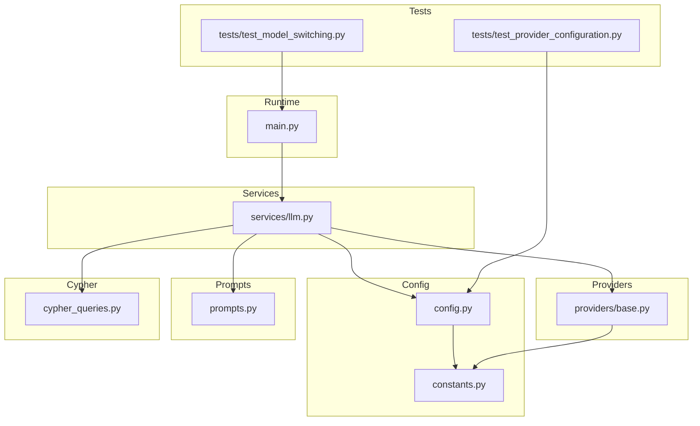
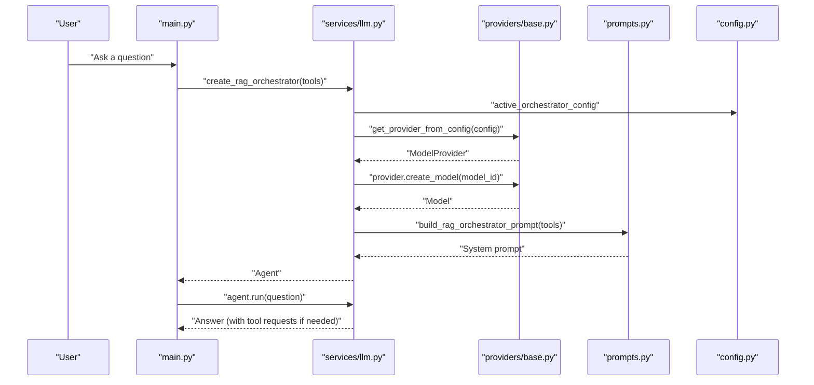
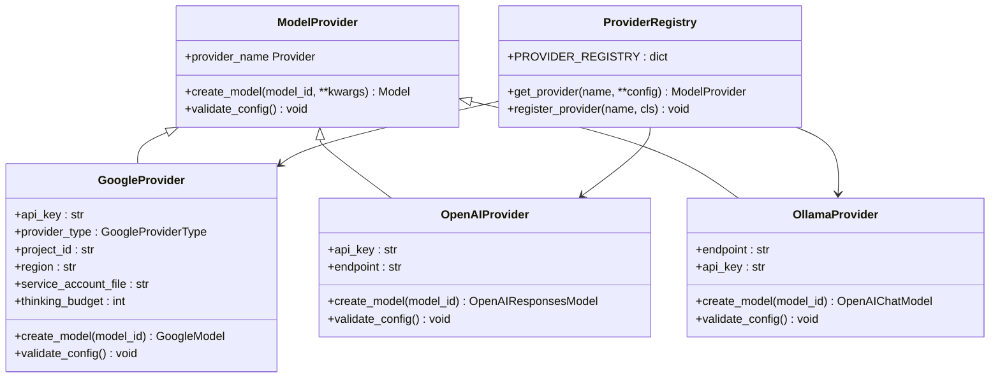
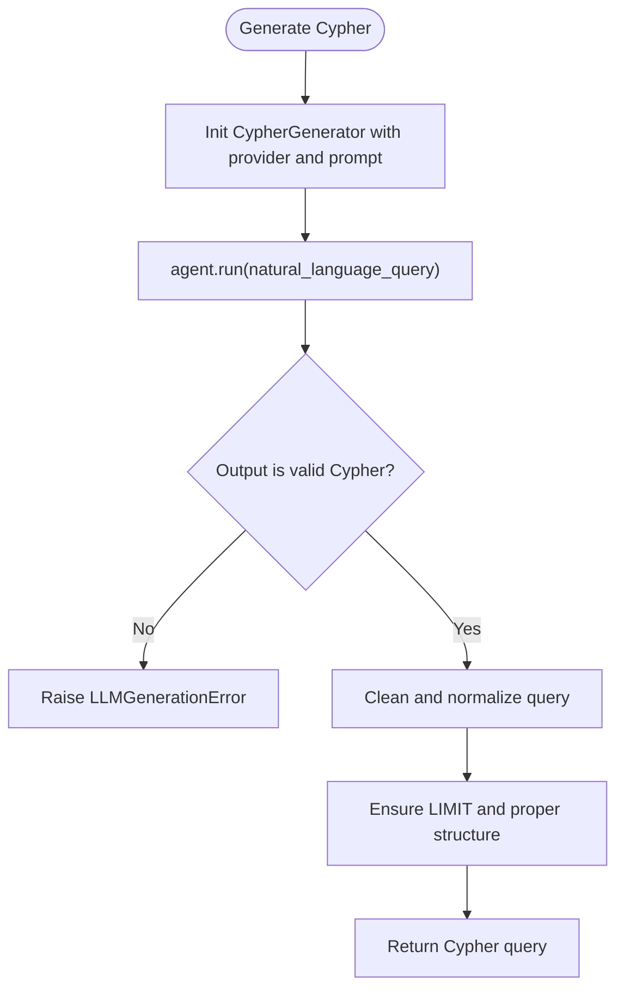
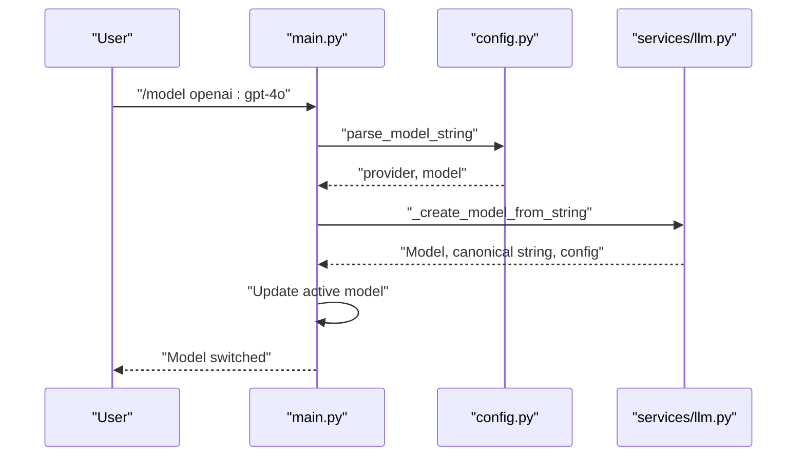
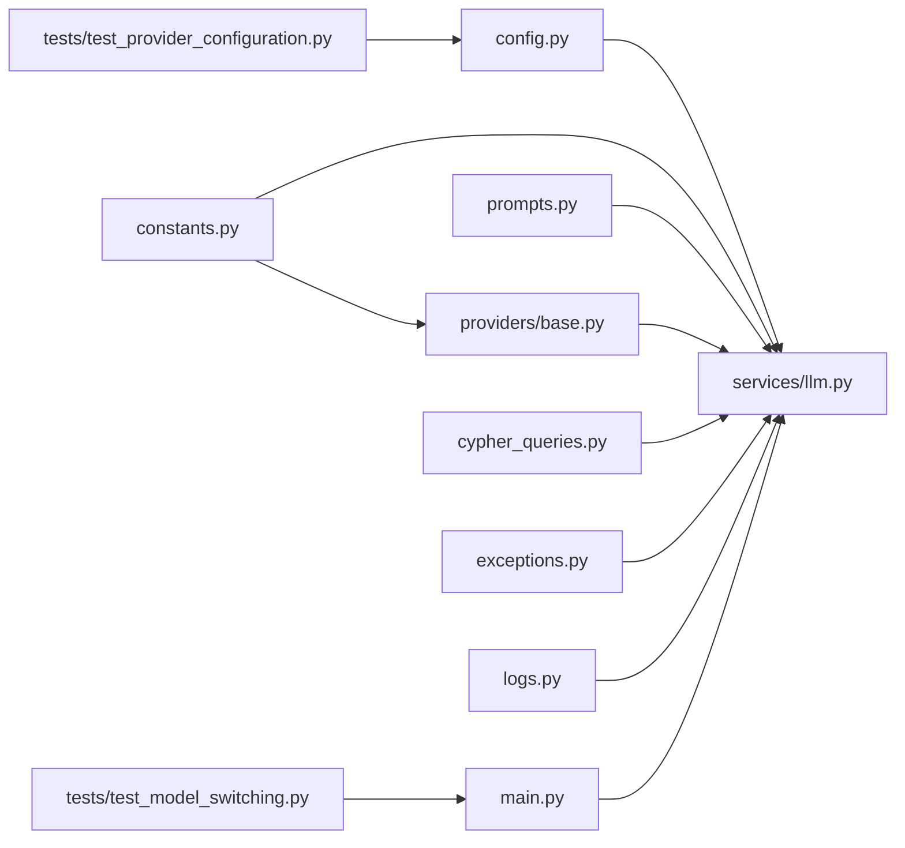

# AI Integration

<cite>
**Referenced Files in This Document**
- [providers/base.py](file://codebase_rag/providers/base.py)
- [services/llm.py](file://codebase_rag/services/llm.py)
- [config.py](file://codebase_rag/config.py)
- [constants.py](file://codebase_rag/constants.py)
- [prompts.py](file://codebase_rag/prompts.py)
- [cypher_queries.py](file://codebase_rag/cypher_queries.py)
- [exceptions.py](file://codebase_rag/exceptions.py)
- [logs.py](file://codebase_rag/logs.py)
- [types_defs.py](file://codebase_rag/types_defs.py)
- [main.py](file://codebase_rag/main.py)
- [test_provider_configuration.py](file://codebase_rag/tests/test_provider_configuration.py)
- [test_model_switching.py](file://codebase_rag/tests/test_model_switching.py)
</cite>

## Table of Contents
1. [Introduction](#introduction)
2. [Project Structure](#project-structure)
3. [Core Components](#core-components)
4. [Architecture Overview](#architecture-overview)
5. [Detailed Component Analysis](#detailed-component-analysis)
6. [Dependency Analysis](#dependency-analysis)
7. [Performance Considerations](#performance-considerations)
8. [Troubleshooting Guide](#troubleshooting-guide)
9. [Conclusion](#conclusion)
10. [Appendices](#appendices)

## Introduction
This document describes the Graph-Code AI integration system that supports multiple AI providers for two distinct roles:
- Orchestrator: a reasoning agent that decides how to answer user questions using tools and a knowledge graph.
- Cypher Generator: a specialized agent that translates natural language queries into Neo4j Cypher queries.

The system is provider-agnostic and integrates with Google Gemini, OpenAI, and Ollama. It includes:
- A unified provider abstraction with pluggable configuration.
- Role-based model selection and runtime switching.
- A Cypher generation pipeline with strict output validation.
- Provider-specific authentication and endpoint handling.
- A reasoning budget system for thinking models.
- Practical configuration examples and troubleshooting guidance.

## Project Structure
The AI integration spans several modules:
- Providers: provider abstractions and factories.
- Services: LLM orchestration and Cypher generation.
- Config: environment-driven settings and model configuration.
- Prompts: role-specific system prompts and Cypher rules.
- Constants: enums, endpoints, and defaults.
- Tests: provider configuration and model switching scenarios.

**Diagram sources**
- [providers/base.py](file://codebase_rag/providers/base.py#L1-L209)
- [services/llm.py](file://codebase_rag/services/llm.py#L1-L93)
- [config.py](file://codebase_rag/config.py#L1-L274)
- [constants.py](file://codebase_rag/constants.py#L1-L2757)
- [prompts.py](file://codebase_rag/prompts.py#L1-L261)
- [cypher_queries.py](file://codebase_rag/cypher_queries.py#L1-L120)
- [main.py](file://codebase_rag/main.py#L1-L200)
- [test_provider_configuration.py](file://codebase_rag/tests/test_provider_configuration.py#L1-L232)
- [test_model_switching.py](file://codebase_rag/tests/test_model_switching.py#L1-L474)

**Section sources**
- [providers/base.py](file://codebase_rag/providers/base.py#L1-L209)
- [services/llm.py](file://codebase_rag/services/llm.py#L1-L93)
- [config.py](file://codebase_rag/config.py#L1-L274)
- [constants.py](file://codebase_rag/constants.py#L1-L2757)
- [prompts.py](file://codebase_rag/prompts.py#L1-L261)
- [cypher_queries.py](file://codebase_rag/cypher_queries.py#L1-L120)
- [main.py](file://codebase_rag/main.py#L1-L200)
- [test_provider_configuration.py](file://codebase_rag/tests/test_provider_configuration.py#L1-L232)
- [test_model_switching.py](file://codebase_rag/tests/test_model_switching.py#L1-L474)

## Core Components
- Provider Abstraction: Defines a common interface for creating provider-specific models and validating configuration.
- Provider Implementations: Google (Gemini GLA and Vertex), OpenAI, and Ollama.
- Model Factory: Resolves provider and model from environment or runtime overrides.
- Orchestrator Agent: Uses a system prompt and tools to answer questions.
- Cypher Generator Agent: Translates natural language into Cypher with strict validation and formatting.
- Configuration: Environment variables and runtime setters for provider/model selection.
- Prompts: Role-specific system prompts and Cypher rules.
- Cypher Utilities: Helper functions to build and wrap Cypher queries.

**Section sources**
- [providers/base.py](file://codebase_rag/providers/base.py#L20-L199)
- [services/llm.py](file://codebase_rag/services/llm.py#L23-L93)
- [config.py](file://codebase_rag/config.py#L20-L234)
- [prompts.py](file://codebase_rag/prompts.py#L36-L230)
- [cypher_queries.py](file://codebase_rag/cypher_queries.py#L82-L120)

## Architecture Overview
The system separates concerns between provider selection, model creation, and role-specific agents. The orchestrator uses tools to retrieve and synthesize information, while the Cypher generator produces graph traversal queries.

**Diagram sources**
- [services/llm.py](file://codebase_rag/services/llm.py#L78-L93)
- [providers/base.py](file://codebase_rag/providers/base.py#L179-L189)
- [prompts.py](file://codebase_rag/prompts.py#L59-L128)
- [config.py](file://codebase_rag/config.py#L197-L217)
- [main.py](file://codebase_rag/main.py#L1-L200)

## Detailed Component Analysis

### Provider Abstraction and Implementations
The provider abstraction defines:
- A common interface for creating models and validating configuration.
- A registry mapping provider names to provider classes.
- A factory to instantiate providers from configuration.

Provider-specific implementations:
- GoogleProvider: Supports GLA and Vertex AI with API key or service account credentials and optional thinking budget.
- OpenAIProvider: Supports custom endpoints and API key.
- OllamaProvider: Validates local endpoint availability and creates OpenAI-compatible chat models.

**Diagram sources**
- [providers/base.py](file://codebase_rag/providers/base.py#L20-L199)

**Section sources**
- [providers/base.py](file://codebase_rag/providers/base.py#L20-L199)
- [constants.py](file://codebase_rag/constants.py#L17-L22)
- [constants.py](file://codebase_rag/constants.py#L132-L143)

### Model Orchestration and Role Selection
- Orchestrator Agent: Built with a system prompt tailored to tool usage and hybrid search strategies.
- Cypher Generator Agent: Built with a system prompt optimized for Cypher generation and strict output formatting.
- Role-specific configuration: Separate environment variables and runtime setters for orchestrator and Cypher roles.

```mermaid
flowchart TD
Start(["Initialize Orchestrator"]) --> GetCfg["Get active_orchestrator_config"]
GetCfg --> CreateProv["get_provider_from_config(config)"]
CreateProv --> CreateModel["provider.create_model(model_id)"]
CreateModel --> BuildPrompt["build_rag_orchestrator_prompt(tools)"]
BuildPrompt --> Agent["Agent(model, system_prompt, tools)"]
Agent --> Run["agent.run(question)"]
Run --> End(["Return answer"])
```

**Diagram sources**
- [services/llm.py](file://codebase_rag/services/llm.py#L78-L93)
- [prompts.py](file://codebase_rag/prompts.py#L59-L128)
- [config.py](file://codebase_rag/config.py#L197-L217)

**Section sources**
- [services/llm.py](file://codebase_rag/services/llm.py#L78-L93)
- [prompts.py](file://codebase_rag/prompts.py#L59-L128)
- [config.py](file://codebase_rag/config.py#L197-L217)

### Cypher Generation Pipeline
The Cypher generator:
- Selects a stricter prompt for local/open-source models (e.g., Ollama).
- Initializes an Agent with the selected prompt and output type.
- Validates that the output is a Cypher query containing a MATCH keyword.
- Cleans and normalizes the output (removes backticks, ensures semicolon, strips prefix).

**Diagram sources**
- [services/llm.py](file://codebase_rag/services/llm.py#L37-L76)
- [prompts.py](file://codebase_rag/prompts.py#L131-L229)
- [cypher_queries.py](file://codebase_rag/cypher_queries.py#L82-L94)

**Section sources**
- [services/llm.py](file://codebase_rag/services/llm.py#L37-L76)
- [prompts.py](file://codebase_rag/prompts.py#L131-L229)
- [cypher_queries.py](file://codebase_rag/cypher_queries.py#L82-L94)

### Configuration and Runtime Switching
- Environment-driven configuration: Separate variables for orchestrator and Cypher roles.
- Runtime overrides: Programmatic setters to switch providers/models at runtime.
- Model parsing: Accepts "provider:model" format with defaults for bare model names.
- Health checks: Ollama endpoint verification.

**Diagram sources**
- [test_model_switching.py](file://codebase_rag/tests/test_model_switching.py#L370-L431)
- [config.py](file://codebase_rag/config.py#L219-L226)
- [main.py](file://codebase_rag/main.py#L1-L200)

**Section sources**
- [config.py](file://codebase_rag/config.py#L58-L113)
- [config.py](file://codebase_rag/config.py#L197-L217)
- [config.py](file://codebase_rag/config.py#L219-L226)
- [test_model_switching.py](file://codebase_rag/tests/test_model_switching.py#L370-L431)

### Provider-Specific Implementations and Authentication
- Google Gemini:
  - GLA: Requires API key.
  - Vertex: Requires project_id and optional service account file.
  - Optional thinking budget for reasoning models.
- OpenAI:
  - Requires API key.
  - Supports custom endpoints.
- Ollama:
  - Validates local endpoint health.
  - Uses default API key for compatibility.

**Section sources**
- [providers/base.py](file://codebase_rag/providers/base.py#L63-L97)
- [providers/base.py](file://codebase_rag/providers/base.py#L115-L125)
- [providers/base.py](file://codebase_rag/providers/base.py#L143-L155)
- [constants.py](file://codebase_rag/constants.py#L126-L143)
- [exceptions.py](file://codebase_rag/exceptions.py#L2-L18)

### Reasoning Budget and Cost Optimization
- Thinking budget: Google GLA/Flash Thinking models accept a budget parameter to cap reasoning tokens.
- Cost optimization strategies:
  - Prefer smaller models for routine tasks.
  - Use local models (Ollama) for development and low-latency iteration.
  - Apply strict Cypher query limits and aggregation patterns to reduce database workload.
  - Use retries judiciously to balance quality and latency.

**Section sources**
- [providers/base.py](file://codebase_rag/providers/base.py#L92-L97)
- [prompts.py](file://codebase_rag/prompts.py#L136-L142)

### Fallback Mechanisms and Error Handling
- Provider fallback: Defaults to Ollama with a local endpoint when no explicit configuration is provided.
- Validation and health checks: Provider validation raises explicit errors for missing keys or endpoints.
- Agent-level error handling: LLM generation errors are captured and surfaced with contextual messages.
- Logging: Extensive logging for Cypher generation, tool usage, and model switching.

**Section sources**
- [config.py](file://codebase_rag/config.py#L184-L189)
- [exceptions.py](file://codebase_rag/exceptions.py#L42-L47)
- [logs.py](file://codebase_rag/logs.py#L195-L199)
- [logs.py](file://codebase_rag/logs.py#L618-L622)

## Dependency Analysis
The following diagram shows key dependencies among modules involved in AI integration.

**Diagram sources**
- [services/llm.py](file://codebase_rag/services/llm.py#L1-L93)
- [providers/base.py](file://codebase_rag/providers/base.py#L1-L209)
- [config.py](file://codebase_rag/config.py#L1-L274)
- [constants.py](file://codebase_rag/constants.py#L1-L2757)
- [prompts.py](file://codebase_rag/prompts.py#L1-L261)
- [cypher_queries.py](file://codebase_rag/cypher_queries.py#L1-L120)
- [exceptions.py](file://codebase_rag/exceptions.py#L1-L60)
- [logs.py](file://codebase_rag/logs.py#L1-L622)
- [main.py](file://codebase_rag/main.py#L1-L200)
- [test_provider_configuration.py](file://codebase_rag/tests/test_provider_configuration.py#L1-L232)
- [test_model_switching.py](file://codebase_rag/tests/test_model_switching.py#L1-L474)

**Section sources**
- [services/llm.py](file://codebase_rag/services/llm.py#L1-L93)
- [providers/base.py](file://codebase_rag/providers/base.py#L1-L209)
- [config.py](file://codebase_rag/config.py#L1-L274)
- [constants.py](file://codebase_rag/constants.py#L1-L2757)
- [prompts.py](file://codebase_rag/prompts.py#L1-L261)
- [cypher_queries.py](file://codebase_rag/cypher_queries.py#L1-L120)
- [exceptions.py](file://codebase_rag/exceptions.py#L1-L60)
- [logs.py](file://codebase_rag/logs.py#L1-L622)
- [main.py](file://codebase_rag/main.py#L1-L200)
- [test_provider_configuration.py](file://codebase_rag/tests/test_provider_configuration.py#L1-L232)
- [test_model_switching.py](file://codebase_rag/tests/test_model_switching.py#L1-L474)

## Performance Considerations
- Latency and throughput:
  - Local models (Ollama) offer lower latency for iterative development.
  - Cloud providers (OpenAI, Google) may offer stronger reasoning capabilities but incur network and rate-limit considerations.
- Token usage:
  - Use the reasoning budget for thinking models to cap costs.
  - Keep prompts concise and leverage Cypher query limits to minimize database round-trips.
- Retries:
  - Configure agent retries thoughtfully to balance quality and resource usage.

[No sources needed since this section provides general guidance]

## Troubleshooting Guide
Common issues and resolutions:
- Missing API keys:
  - Google GLA and Vertex require keys; OpenAI requires an API key. Set environment variables accordingly.
- Ollama not running:
  - Ensure the local endpoint responds; the system validates health before model creation.
- Invalid model format:
  - Use "provider:model" format; bare model names default to Ollama.
- Provider not recognized:
  - Verify provider name is registered; available providers are enumerated in the registry.
- Cypher generation failures:
  - Ensure the output contains a MATCH keyword and is properly formatted; the system cleans and validates output.

**Section sources**
- [exceptions.py](file://codebase_rag/exceptions.py#L2-L18)
- [providers/base.py](file://codebase_rag/providers/base.py#L201-L209)
- [test_provider_configuration.py](file://codebase_rag/tests/test_provider_configuration.py#L370-L431)
- [services/llm.py](file://codebase_rag/services/llm.py#L58-L76)

## Conclusion
The Graph-Code AI integration system provides a flexible, provider-agnostic framework for orchestrating reasoning and Cypher generation. By centralizing provider configuration, validation, and model creation, it enables seamless switching between Google, OpenAI, and Ollama. Strict Cypher validation, thoughtful prompts, and configurable budgets help maintain reliability and cost-effectiveness across diverse deployment scenarios.

[No sources needed since this section summarizes without analyzing specific files]

## Appendices

### Practical Configuration Examples
- Environment variables:
  - Set separate variables for orchestrator and Cypher roles.
  - Use provider-specific variables (e.g., API keys, project_id, region).
- Runtime overrides:
  - Use setters to programmatically switch providers/models during a session.
- Model parsing:
  - Accepts "provider:model" format; bare names default to Ollama.

**Section sources**
- [config.py](file://codebase_rag/config.py#L58-L113)
- [config.py](file://codebase_rag/config.py#L219-L226)
- [test_provider_configuration.py](file://codebase_rag/tests/test_provider_configuration.py#L85-L108)
- [test_model_switching.py](file://codebase_rag/tests/test_model_switching.py#L370-L431)

### Choosing Models for Use Cases
- Development and low-latency iteration: Ollama models.
- Strong reasoning and multimodal needs: Google GLA/Vertex or OpenAI.
- Cost-sensitive production: Smaller models, strict budgets, and prompt engineering.

[No sources needed since this section provides general guidance]