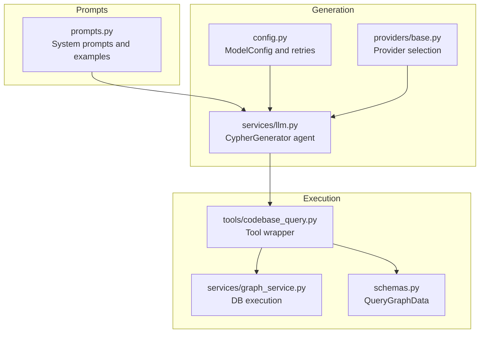
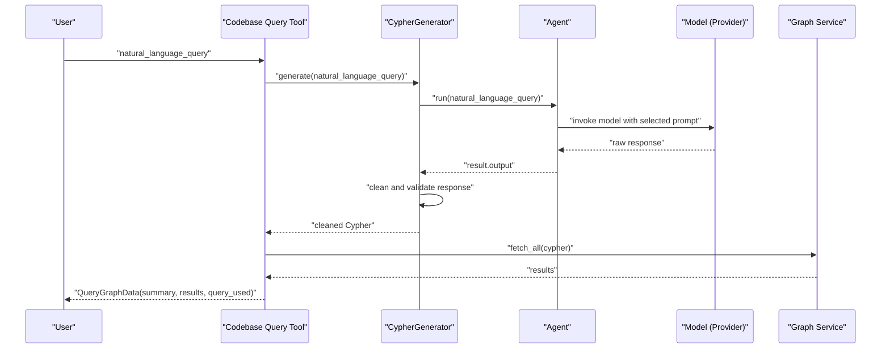
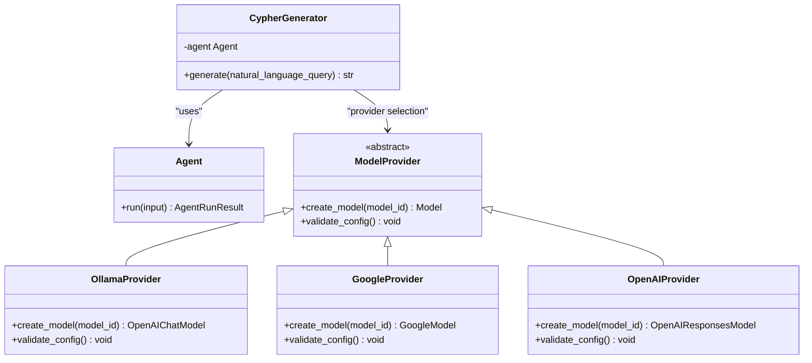
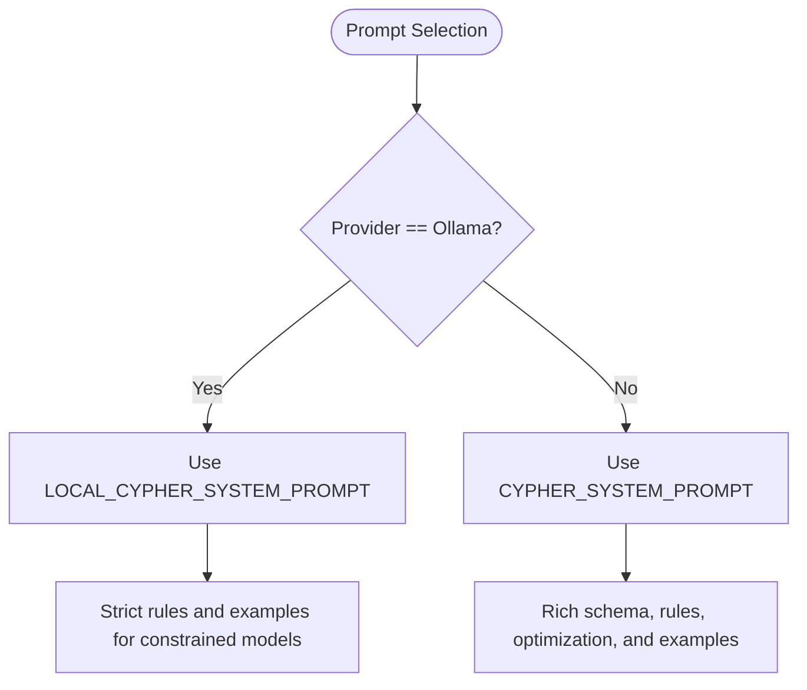
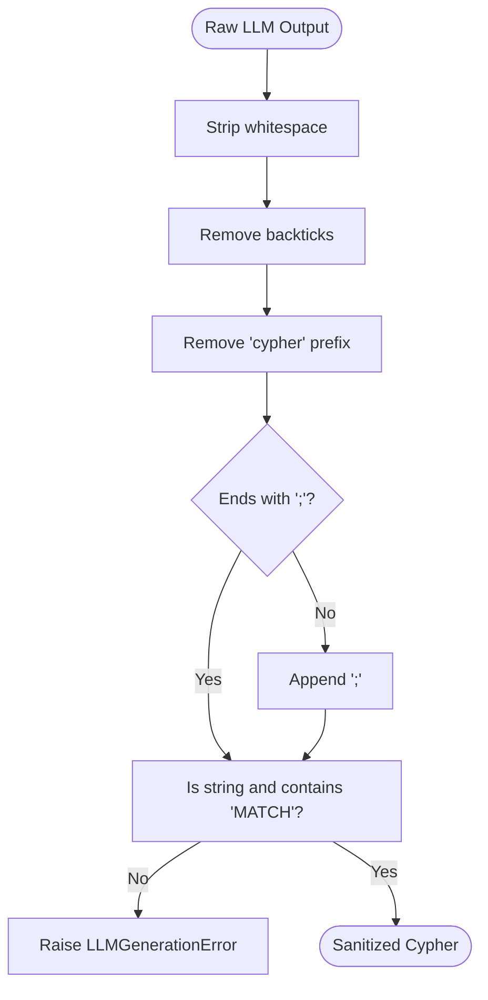
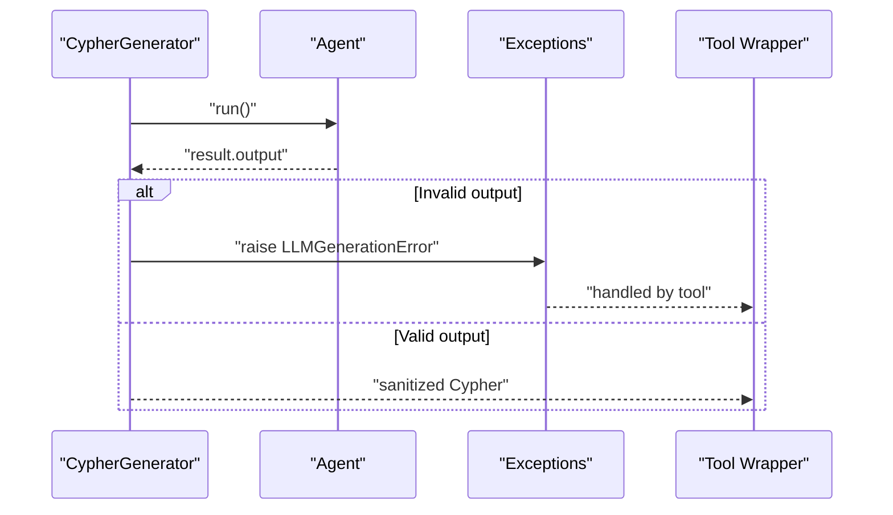
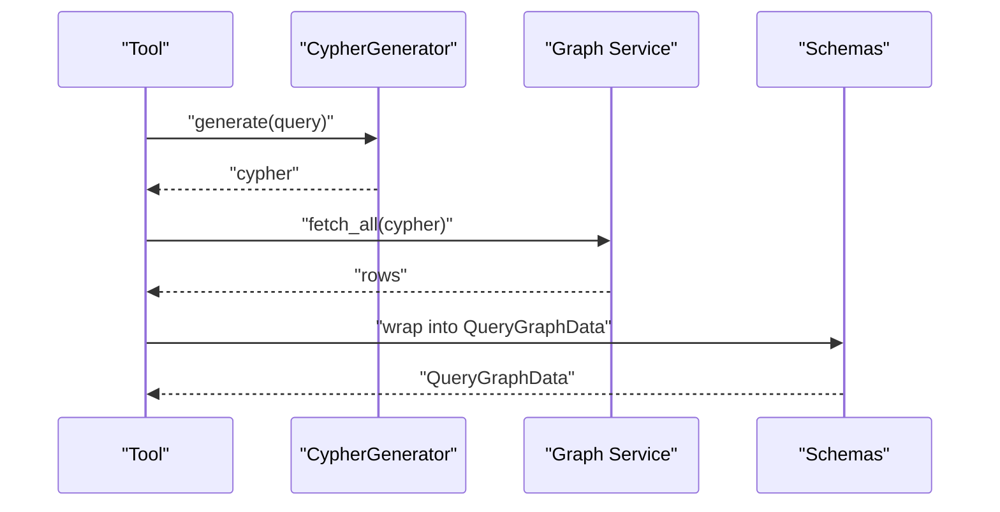
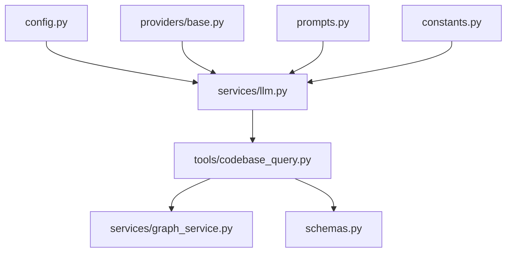

# Cypher Generation

<cite>
**Referenced Files in This Document**
- [services/llm.py](file://codebase_rag/services/llm.py)
- [prompts.py](file://codebase_rag/prompts.py)
- [cypher_queries.py](file://codebase_rag/cypher_queries.py)
- [constants.py](file://codebase_rag/constants.py)
- [config.py](file://codebase_rag/config.py)
- [providers/base.py](file://codebase_rag/providers/base.py)
- [tools/codebase_query.py](file://codebase_rag/tools/codebase_query.py)
- [exceptions.py](file://codebase_rag/exceptions.py)
- [schemas.py](file://codebase_rag/schemas.py)
- [services/graph_service.py](file://codebase_rag/services/graph_service.py)
</cite>

## Table of Contents
1. [Introduction](#introduction)
2. [Project Structure](#project-structure)
3. [Core Components](#core-components)
4. [Architecture Overview](#architecture-overview)
5. [Detailed Component Analysis](#detailed-component-analysis)
6. [Dependency Analysis](#dependency-analysis)
7. [Performance Considerations](#performance-considerations)
8. [Troubleshooting Guide](#troubleshooting-guide)
9. [Conclusion](#conclusion)

## Introduction
This document explains the Cypher generation system that translates natural language queries into executable Cypher statements for a Neo4j-based knowledge graph. It focuses on the CypherGenerator class, the system prompts used for generation (including local vs remote provider variants), query cleaning and validation, the agent-based generation pipeline, error handling and retry mechanisms, and practical examples of natural language to Cypher transformations. It also covers performance considerations and optimization strategies.

## Project Structure
The Cypher generation capability spans several modules:
- Prompt definitions and system prompts for Cypher generation
- The CypherGenerator agent that orchestrates translation
- Constants and helpers for Cypher formatting and validation
- Configuration for model providers and retries
- Tools that integrate generation with graph querying
- Graph service for executing generated Cypher safely

**Diagram sources**
- [prompts.py](file://codebase_rag/prompts.py#L131-L229)
- [services/llm.py](file://codebase_rag/services/llm.py#L37-L76)
- [config.py](file://codebase_rag/config.py#L55-L218)
- [providers/base.py](file://codebase_rag/providers/base.py#L179-L189)
- [tools/codebase_query.py](file://codebase_rag/tools/codebase_query.py#L24-L95)
- [services/graph_service.py](file://codebase_rag/services/graph_service.py#L104-L123)
- [schemas.py](file://codebase_rag/schemas.py#L8-L35)

**Section sources**
- [prompts.py](file://codebase_rag/prompts.py#L131-L229)
- [services/llm.py](file://codebase_rag/services/llm.py#L37-L76)
- [config.py](file://codebase_rag/config.py#L55-L218)
- [providers/base.py](file://codebase_rag/providers/base.py#L179-L189)
- [tools/codebase_query.py](file://codebase_rag/tools/codebase_query.py#L24-L95)
- [services/graph_service.py](file://codebase_rag/services/graph_service.py#L104-L123)
- [schemas.py](file://codebase_rag/schemas.py#L8-L35)

## Core Components
- CypherGenerator: An agent-based component that initializes a model provider based on configuration, selects a system prompt variant depending on provider type, and generates Cypher from natural language with validation and retry logic.
- System prompts: Two primary prompts are used:
  - Remote/provider prompts: Rich, example-driven guidance for advanced models.
  - Local/Ollama prompt: Strict, minimal rules for constrained local models.
- Query cleaning/validation: Ensures generated output is syntactically valid Cypher with proper formatting and termination.
- Tool integration: A tool wraps generation and execution, returning structured results and summaries.
- Graph execution: Executes the generated Cypher against the graph database with safe error handling.

**Section sources**
- [services/llm.py](file://codebase_rag/services/llm.py#L37-L76)
- [prompts.py](file://codebase_rag/prompts.py#L131-L229)
- [constants.py](file://codebase_rag/constants.py#L954-L957)
- [tools/codebase_query.py](file://codebase_rag/tools/codebase_query.py#L24-L95)
- [services/graph_service.py](file://codebase_rag/services/graph_service.py#L104-L123)

## Architecture Overview
The generation pipeline follows a deterministic flow:
1. Natural language query enters the CypherGenerator.
2. The generator selects a system prompt based on the active provider configuration.
3. The agent runs the model and produces a response.
4. The response is cleaned and validated to ensure syntactic correctness.
5. The resulting Cypher is passed to the tool wrapper, which executes it against the graph and returns structured results.

**Diagram sources**
- [services/llm.py](file://codebase_rag/services/llm.py#L58-L75)
- [prompts.py](file://codebase_rag/prompts.py#L131-L229)
- [tools/codebase_query.py](file://codebase_rag/tools/codebase_query.py#L32-L88)
- [services/graph_service.py](file://codebase_rag/services/graph_service.py#L104-L123)

## Detailed Component Analysis

### CypherGenerator
The CypherGenerator encapsulates the agent-based generation pipeline:
- Initialization:
  - Reads the active Cypher model configuration.
  - Selects the appropriate system prompt (remote or local).
  - Creates an agent with configured retries.
- Generation:
  - Runs the agent with the user’s natural language query.
  - Validates that the output is a string containing a Cypher MATCH clause.
  - Cleans the response to ensure consistent formatting and termination.
  - Returns the sanitized Cypher query.

Key behaviors:
- Provider-aware prompt selection: Uses a stricter prompt for local providers (e.g., Ollama).
- Validation: Ensures the output contains a Cypher MATCH keyword and is a string.
- Cleaning: Removes backticks, strips leading prefixes, and appends a semicolon if missing.

**Diagram sources**
- [services/llm.py](file://codebase_rag/services/llm.py#L37-L76)
- [providers/base.py](file://codebase_rag/providers/base.py#L128-L156)
- [providers/base.py](file://codebase_rag/providers/base.py#L40-L98)
- [providers/base.py](file://codebase_rag/providers/base.py#L100-L126)

**Section sources**
- [services/llm.py](file://codebase_rag/services/llm.py#L37-L76)
- [config.py](file://codebase_rag/config.py#L197-L218)
- [providers/base.py](file://codebase_rag/providers/base.py#L179-L189)

### System Prompts: Remote vs Local Variants
Two system prompts guide the model:
- Remote/provider prompt: Rich with schema, rules, optimization tips, and multiple examples.
- Local/Ollama prompt: Minimalist, strict rules, forbids UNION, enforces binding and aliasing, and emphasizes simple clauses.

Both prompts define:
- Graph schema and rules
- Query optimization rules (limits, aggregation vs listing)
- Pattern examples for common intents (decorated functions, path-based listing, keyword search, file lookup, etc.)

**Diagram sources**
- [prompts.py](file://codebase_rag/prompts.py#L131-L229)
- [services/llm.py](file://codebase_rag/services/llm.py#L43-L47)

**Section sources**
- [prompts.py](file://codebase_rag/prompts.py#L131-L229)

### Query Cleaning and Validation
The cleaning and validation pipeline ensures syntactic correctness:
- Strip whitespace and remove backticks.
- Remove a leading “cypher” prefix if present.
- Ensure the output ends with a semicolon.
- Validate that the output is a string and contains a Cypher MATCH keyword.

**Diagram sources**
- [services/llm.py](file://codebase_rag/services/llm.py#L28-L34)
- [services/llm.py](file://codebase_rag/services/llm.py#L62-L68)
- [constants.py](file://codebase_rag/constants.py#L954-L957)

**Section sources**
- [services/llm.py](file://codebase_rag/services/llm.py#L28-L34)
- [services/llm.py](file://codebase_rag/services/llm.py#L62-L68)
- [constants.py](file://codebase_rag/constants.py#L954-L957)

### Agent-Based Generation and Retry Mechanisms
- The agent is initialized with a configurable number of retries.
- On generation failure or invalid output, the system raises a dedicated exception and surfaces a user-friendly summary via the tool wrapper.
- The tool wrapper captures and formats database errors distinctly from translation failures.

**Diagram sources**
- [services/llm.py](file://codebase_rag/services/llm.py#L58-L75)
- [exceptions.py](file://codebase_rag/exceptions.py#L42-L46)
- [tools/codebase_query.py](file://codebase_rag/tools/codebase_query.py#L76-L88)

**Section sources**
- [services/llm.py](file://codebase_rag/services/llm.py#L58-L75)
- [exceptions.py](file://codebase_rag/exceptions.py#L42-L46)
- [tools/codebase_query.py](file://codebase_rag/tools/codebase_query.py#L76-L88)

### Natural Language to Cypher Transformations and Patterns
Common query patterns and their expected outputs are exemplified in the prompts and helper queries:
- Counting items: Return a single aggregated value.
- Listing items: Return name/path/qualified_name with a limit.
- Finding decorated functions/methods: Use list containment checks.
- Path-based listing: Use STARTS WITH semantics.
- Keyword/concept search: Use lower-cased containment checks.
- Finding a specific file: Exact match on name and path.
- Limit-one testing: Single-row result for validation.

These patterns are embedded in:
- Example Cypher snippets for demonstrations
- Query building helpers for dynamic batching and merges

**Section sources**
- [prompts.py](file://codebase_rag/prompts.py#L144-L229)
- [cypher_queries.py](file://codebase_rag/cypher_queries.py#L14-L79)
- [cypher_queries.py](file://codebase_rag/cypher_queries.py#L82-L120)

### Edge Cases and Malformed Outputs
Edge cases handled:
- Empty or non-string outputs
- Missing semicolons
- Backticks or prefixed markers
- Absence of a MATCH keyword
- Provider-specific constraints (e.g., no UNION for local models)

Validation and cleaning routines address these to produce syntactically valid Cypher.

**Section sources**
- [services/llm.py](file://codebase_rag/services/llm.py#L28-L34)
- [services/llm.py](file://codebase_rag/services/llm.py#L62-L68)
- [prompts.py](file://codebase_rag/prompts.py#L173-L229)

### Tool Integration and Result Formatting
The tool integrates generation and execution:
- Calls the CypherGenerator to produce Cypher.
- Executes the query via the graph service.
- Formats results into a table and returns a structured QueryGraphData object with summary, results, and the query used.

**Diagram sources**
- [tools/codebase_query.py](file://codebase_rag/tools/codebase_query.py#L32-L88)
- [services/graph_service.py](file://codebase_rag/services/graph_service.py#L104-L123)
- [schemas.py](file://codebase_rag/schemas.py#L8-L35)

**Section sources**
- [tools/codebase_query.py](file://codebase_rag/tools/codebase_query.py#L24-L95)
- [services/graph_service.py](file://codebase_rag/services/graph_service.py#L104-L123)
- [schemas.py](file://codebase_rag/schemas.py#L8-L35)

## Dependency Analysis
The generation system depends on:
- Configuration for model selection and retries
- Provider selection logic for runtime model creation
- Prompt definitions for instruction sets
- Constants for validation keywords and formatting
- Tool and schema layers for orchestration and output

**Diagram sources**
- [config.py](file://codebase_rag/config.py#L55-L218)
- [providers/base.py](file://codebase_rag/providers/base.py#L179-L189)
- [prompts.py](file://codebase_rag/prompts.py#L131-L229)
- [services/llm.py](file://codebase_rag/services/llm.py#L37-L76)
- [constants.py](file://codebase_rag/constants.py#L954-L957)
- [tools/codebase_query.py](file://codebase_rag/tools/codebase_query.py#L24-L95)
- [schemas.py](file://codebase_rag/schemas.py#L8-L35)
- [services/graph_service.py](file://codebase_rag/services/graph_service.py#L104-L123)

**Section sources**
- [config.py](file://codebase_rag/config.py#L55-L218)
- [providers/base.py](file://codebase_rag/providers/base.py#L179-L189)
- [prompts.py](file://codebase_rag/prompts.py#L131-L229)
- [services/llm.py](file://codebase_rag/services/llm.py#L37-L76)
- [constants.py](file://codebase_rag/constants.py#L954-L957)
- [tools/codebase_query.py](file://codebase_rag/tools/codebase_query.py#L24-L95)
- [schemas.py](file://codebase_rag/schemas.py#L8-L35)
- [services/graph_service.py](file://codebase_rag/services/graph_service.py#L104-L123)

## Performance Considerations
- Limit defaults: The system encourages limiting results to avoid heavy payloads.
- Query patterns: Prefer aggregation queries when counts are sufficient; otherwise list with limits.
- Provider choice: Local models (e.g., Ollama) are constrained; remote providers can handle richer prompts and queries.
- Retries: Configure retries thoughtfully to balance resilience and latency.
- Batching helpers: Utilities exist for UNWIND batching and MERGE operations to optimize bulk updates.

Practical tips:
- Use STARTS WITH for path queries to reduce scanning overhead.
- Prefer exact-match lookups for filenames and qualified names.
- Keep queries simple for constrained models; avoid UNION and complex clauses.

**Section sources**
- [prompts.py](file://codebase_rag/prompts.py#L136-L142)
- [prompts.py](file://codebase_rag/prompts.py#L173-L229)
- [constants.py](file://codebase_rag/constants.py#L414)
- [cypher_queries.py](file://codebase_rag/cypher_queries.py#L82-L120)

## Troubleshooting Guide
Common issues and resolutions:
- Translation failures:
  - Cause: Invalid or malformed Cypher output.
  - Behavior: Raises a generation error; the tool returns a summary indicating translation failure.
- Database errors:
  - Cause: Execution failures (e.g., connection or constraint violations).
  - Behavior: The tool returns an empty result set with a database error summary.
- Provider misconfiguration:
  - Cause: Missing keys or endpoint issues.
  - Behavior: Provider validation raises explicit errors; fix environment variables or endpoints.
- Local model limitations:
  - Symptom: Responses violating strict rules (e.g., UNION, missing semicolons).
  - Resolution: Adjust prompts and simplify queries for constrained models.

Operational checks:
- Verify provider health for local models.
- Confirm model configuration and retries are set appropriately.
- Inspect logs for detailed error messages.

**Section sources**
- [tools/codebase_query.py](file://codebase_rag/tools/codebase_query.py#L76-L88)
- [exceptions.py](file://codebase_rag/exceptions.py#L42-L46)
- [providers/base.py](file://codebase_rag/providers/base.py#L143-L156)
- [services/llm.py](file://codebase_rag/services/llm.py#L58-L75)

## Conclusion
The Cypher generation system provides a robust, agent-based pipeline to convert natural language into syntactically valid Cypher. It adapts to provider capabilities, rigorously validates and cleans outputs, and integrates seamlessly with graph execution and result formatting. By following the defined patterns and constraints, users can reliably transform queries while maintaining performance and reliability across diverse environments.