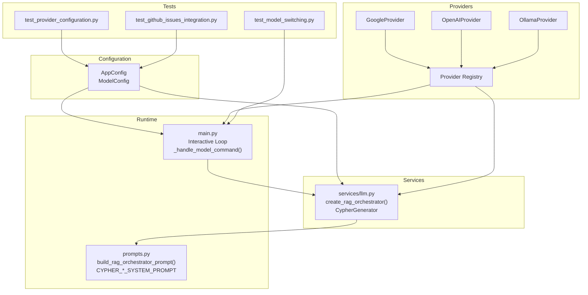
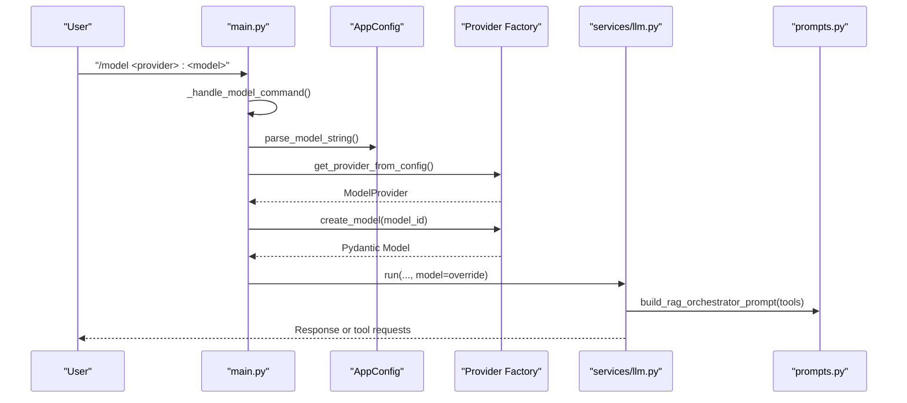
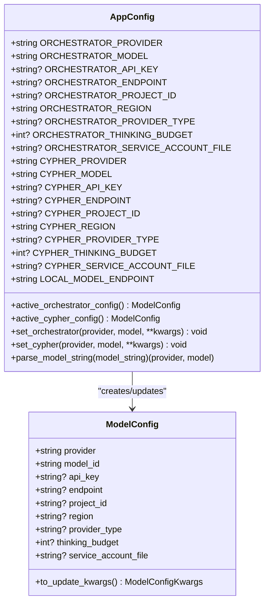
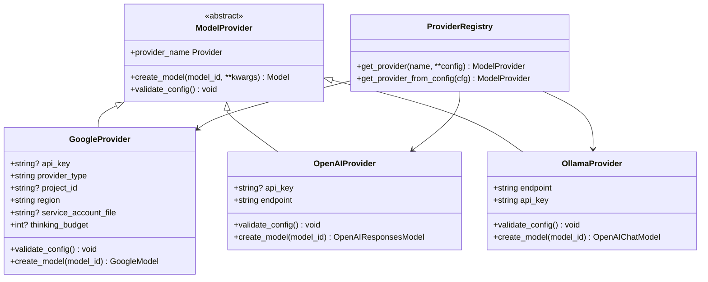
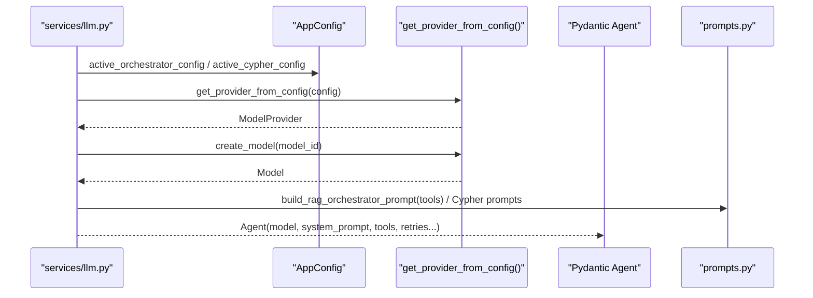
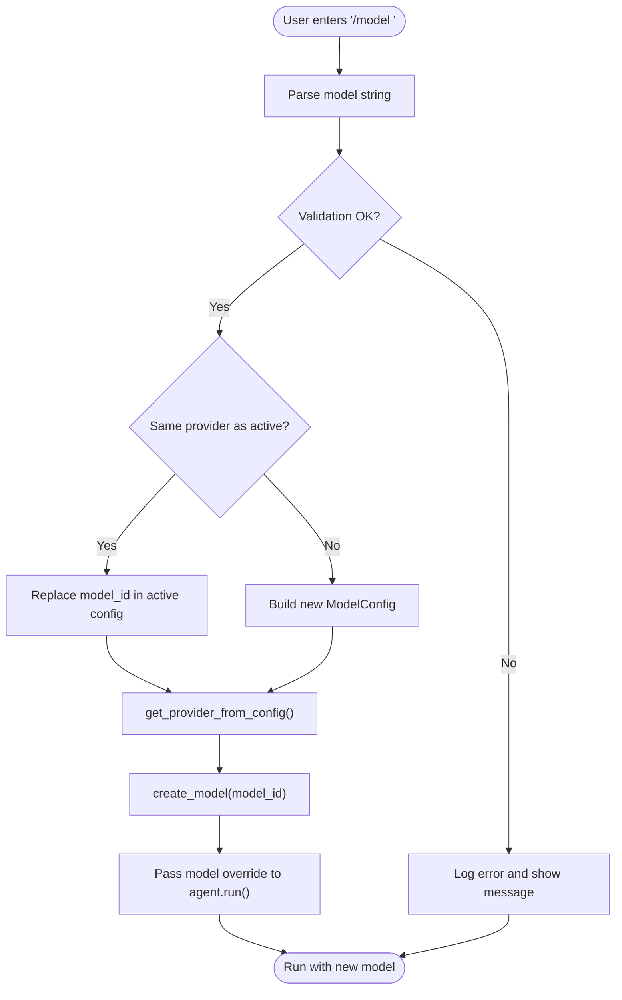
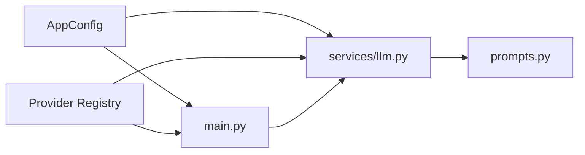

# Model Orchestration

<cite>
**Referenced Files in This Document**
- [config.py](file://codebase_rag/config.py)
- [constants.py](file://codebase_rag/constants.py)
- [providers/base.py](file://codebase_rag/providers/base.py)
- [services/llm.py](file://codebase_rag/services/llm.py)
- [main.py](file://codebase_rag/main.py)
- [prompts.py](file://codebase_rag/prompts.py)
- [exceptions.py](file://codebase_rag/exceptions.py)
- [types_defs.py](file://codebase_rag/types_defs.py)
- [tests/test_model_switching.py](file://codebase_rag/tests/test_model_switching.py)
- [tests/test_provider_configuration.py](file://codebase_rag/tests/test_provider_configuration.py)
- [tests/test_github_issues_integration.py](file://codebase_rag/tests/test_github_issues_integration.py)
</cite>

## Table of Contents
1. [Introduction](#introduction)
2. [Project Structure](#project-structure)
3. [Core Components](#core-components)
4. [Architecture Overview](#architecture-overview)
5. [Detailed Component Analysis](#detailed-component-analysis)
6. [Dependency Analysis](#dependency-analysis)
7. [Performance Considerations](#performance-considerations)
8. [Troubleshooting Guide](#troubleshooting-guide)
9. [Conclusion](#conclusion)
10. [Appendices](#appendices)

## Introduction
This document explains the model orchestration system in Graph-Code, focusing on how models are selected, configured, and integrated with the Pydantic AI framework. It covers:
- Distinctions between thinking models (reasoning) and acting models (tool execution)
- Model configuration management and active settings
- Agent creation and runtime model switching
- Practical configuration examples and fallback strategies
- Reasoning budget management and cost optimization techniques

## Project Structure
The model orchestration spans several modules:
- Configuration and settings: environment-driven model selection and defaults
- Providers: abstraction over model providers (OpenAI, Google, Ollama)
- Services: agent creation and orchestration
- Main loop: interactive runtime switching and model override propagation
- Prompts: system prompts tailored per task (RAG orchestration, Cypher generation)
- Tests: validation of model switching, provider configuration, and reasoning budgets

**Diagram sources**
- [config.py](file://codebase_rag/config.py#L39-L234)
- [providers/base.py](file://codebase_rag/providers/base.py#L158-L194)
- [services/llm.py](file://codebase_rag/services/llm.py#L78-L92)
- [main.py](file://codebase_rag/main.py#L535-L601)
- [prompts.py](file://codebase_rag/prompts.py#L59-L171)
- [tests/test_model_switching.py](file://codebase_rag/tests/test_model_switching.py#L370-L430)
- [tests/test_provider_configuration.py](file://codebase_rag/tests/test_provider_configuration.py#L189-L231)
- [tests/test_github_issues_integration.py](file://codebase_rag/tests/test_github_issues_integration.py#L152-L185)

**Section sources**
- [config.py](file://codebase_rag/config.py#L39-L234)
- [providers/base.py](file://codebase_rag/providers/base.py#L158-L194)
- [services/llm.py](file://codebase_rag/services/llm.py#L78-L92)
- [main.py](file://codebase_rag/main.py#L535-L601)
- [prompts.py](file://codebase_rag/prompts.py#L59-L171)

## Core Components
- ModelConfig: Encapsulates provider, model_id, and provider-specific settings (API key, endpoint, project/region, thinking budget, service account file).
- AppConfig: Loads environment variables, defines defaults, and exposes active orchestrator and Cypher configurations. Provides setters to override active models at runtime.
- Provider abstraction: GoogleProvider, OpenAIProvider, OllamaProvider implement a uniform interface to create Pydantic AI models.
- Agent creation: services/llm.py builds agents with system prompts and tools, using the active model configuration.
- Runtime model switching: main.py supports interactive model switching and passes overrides to agent runs.

Key responsibilities:
- Configuration: Environment-driven defaults and runtime overrides
- Provider selection: Factory-based provider resolution and validation
- Agent orchestration: RAG orchestrator and Cypher generator agents
- Interactive switching: Command-driven model updates and propagation to agent runs

**Section sources**
- [config.py](file://codebase_rag/config.py#L20-L37)
- [config.py](file://codebase_rag/config.py#L163-L217)
- [providers/base.py](file://codebase_rag/providers/base.py#L20-L38)
- [providers/base.py](file://codebase_rag/providers/base.py#L158-L194)
- [services/llm.py](file://codebase_rag/services/llm.py#L78-L92)
- [main.py](file://codebase_rag/main.py#L535-L601)

## Architecture Overview
The orchestration pipeline integrates configuration, provider selection, and agent creation with an interactive runtime model switcher.

**Diagram sources**
- [main.py](file://codebase_rag/main.py#L567-L601)
- [config.py](file://codebase_rag/config.py#L219-L225)
- [providers/base.py](file://codebase_rag/providers/base.py#L179-L189)
- [services/llm.py](file://codebase_rag/services/llm.py#L78-L92)
- [prompts.py](file://codebase_rag/prompts.py#L59-L128)

## Detailed Component Analysis

### Model Configuration System
- ModelConfig stores provider, model_id, and optional provider-specific fields (API key, endpoint, project/region, thinking budget, service account file).
- AppConfig loads environment variables for orchestrator and Cypher roles, applies defaults, and exposes active configurations. It also provides setters to override active models at runtime.
- Defaults:
  - Local provider: Ollama with default endpoint and API key
  - Roles: orchestrator and cypher
- Active model getters return either overridden configs or defaults.

**Diagram sources**
- [config.py](file://codebase_rag/config.py#L20-L37)
- [config.py](file://codebase_rag/config.py#L39-L234)

**Section sources**
- [config.py](file://codebase_rag/config.py#L20-L37)
- [config.py](file://codebase_rag/config.py#L163-L217)
- [config.py](file://codebase_rag/config.py#L219-L225)

### Provider Abstraction and Model Creation
- ModelProvider is an abstract base with create_model and validate_config methods.
- Concrete providers:
  - GoogleProvider: supports GLA and Vertex; validates keys/projects; supports thinking budget via GoogleModelSettings.
  - OpenAIProvider: validates API key; creates OpenAIResponsesModel.
  - OllamaProvider: validates local endpoint health; creates OpenAIChatModel compatible with Ollama v1 API.
- Provider registry maps provider names to classes; get_provider resolves provider instances; get_provider_from_config constructs providers from ModelConfig.

**Diagram sources**
- [providers/base.py](file://codebase_rag/providers/base.py#L20-L38)
- [providers/base.py](file://codebase_rag/providers/base.py#L40-L98)
- [providers/base.py](file://codebase_rag/providers/base.py#L100-L126)
- [providers/base.py](file://codebase_rag/providers/base.py#L128-L156)
- [providers/base.py](file://codebase_rag/providers/base.py#L158-L194)

**Section sources**
- [providers/base.py](file://codebase_rag/providers/base.py#L20-L38)
- [providers/base.py](file://codebase_rag/providers/base.py#L40-L98)
- [providers/base.py](file://codebase_rag/providers/base.py#L100-L126)
- [providers/base.py](file://codebase_rag/providers/base.py#L128-L156)
- [providers/base.py](file://codebase_rag/providers/base.py#L179-L189)

### Agent Creation and Pydantic AI Integration
- Orchestrator agent: Created by services/llm.py using the active orchestrator configuration, a system prompt built from prompts.py, tools, and retry settings.
- Cypher generator: Created similarly for Cypher tasks, selecting a system prompt based on provider type (local vs cloud).
- Both agents leverage the provider abstraction to instantiate the underlying Pydantic AI model.

**Diagram sources**
- [services/llm.py](file://codebase_rag/services/llm.py#L78-L92)
- [services/llm.py](file://codebase_rag/services/llm.py#L37-L76)
- [prompts.py](file://codebase_rag/prompts.py#L59-L128)
- [prompts.py](file://codebase_rag/prompts.py#L131-L229)

**Section sources**
- [services/llm.py](file://codebase_rag/services/llm.py#L78-L92)
- [services/llm.py](file://codebase_rag/services/llm.py#L37-L76)
- [prompts.py](file://codebase_rag/prompts.py#L59-L128)
- [prompts.py](file://codebase_rag/prompts.py#L131-L229)

### Runtime Model Switching and Overrides
- Users can switch models interactively using a command prefix. The handler parses the provider:model string, validates it, and constructs a new provider/model.
- If the provider matches the active orchestrator configuration, the model_id is updated; otherwise, a fresh ModelConfig is created (preserving endpoint/API key for Ollama).
- The override is passed to agent.run, enabling temporary model changes per interaction.

**Diagram sources**
- [main.py](file://codebase_rag/main.py#L567-L601)
- [main.py](file://codebase_rag/main.py#L535-L565)
- [config.py](file://codebase_rag/config.py#L219-L225)

**Section sources**
- [main.py](file://codebase_rag/main.py#L567-L601)
- [main.py](file://codebase_rag/main.py#L535-L565)
- [tests/test_model_switching.py](file://codebase_rag/tests/test_model_switching.py#L370-L430)

### Thinking Models vs Acting Models
- Thinking models: Designed for complex reasoning with extended thinking budgets. Google GLA/Vertex supports thinking budget configuration via provider settings.
- Acting models: Used for tool execution and general orchestration. They are configured similarly but do not require thinking budgets.
- The system distinguishes these roles via separate configuration profiles (orchestrator vs cypher) and provider capabilities.

Practical guidance:
- Use thinking-capable models for tasks requiring deep reasoning or multi-step planning.
- Prefer acting models for tool execution and routine orchestration to reduce cost and latency.

**Section sources**
- [providers/base.py](file://codebase_rag/providers/base.py#L69-L97)
- [tests/test_github_issues_integration.py](file://codebase_rag/tests/test_github_issues_integration.py#L168-L185)
- [tests/test_provider_configuration.py](file://codebase_rag/tests/test_provider_configuration.py#L196-L212)

### Practical Configuration Examples
- Environment-driven configuration:
  - Set provider and model for orchestrator/cypher via environment variables; optional endpoint, API key, project/region, thinking budget, and service account file.
- Runtime overrides:
  - Use the interactive model switch command to temporarily change the model for the current session.
- Provider-specific examples validated by tests:
  - Google Vertex with project and region
  - Google thinking model with thinking budget
  - OpenAI with custom endpoint

**Section sources**
- [tests/test_provider_configuration.py](file://codebase_rag/tests/test_provider_configuration.py#L189-L231)
- [tests/test_github_issues_integration.py](file://codebase_rag/tests/test_github_issues_integration.py#L152-L185)
- [main.py](file://codebase_rag/main.py#L697-L724)

### Fallback Strategies
- Provider validation failures: The system raises explicit errors with guidance (e.g., missing API key, Ollama not running).
- Health checks: Ollama endpoint health is verified before model creation.
- Graceful degradation patterns are demonstrated in tests for asynchronous services, which can inspire similar patterns for model fallbacks (e.g., try cloud provider if local fails).

**Section sources**
- [exceptions.py](file://codebase_rag/exceptions.py#L1-L18)
- [providers/base.py](file://codebase_rag/providers/base.py#L201-L209)
- [tests/test_javascript_error_handling.py](file://codebase_rag/tests/test_javascript_error_handling.py#L1050-L1121)

## Dependency Analysis
- Coupling:
  - services/llm.py depends on AppConfig and provider factory to construct agents.
  - main.py depends on AppConfig and provider factory for runtime switching.
  - providers/base.py centralizes provider logic and validation.
- Cohesion:
  - Configuration, provider selection, and agent creation are cohesive within their respective modules.
- External dependencies:
  - Pydantic AI models and providers
  - HTTP client for Ollama health checks

**Diagram sources**
- [config.py](file://codebase_rag/config.py#L39-L234)
- [providers/base.py](file://codebase_rag/providers/base.py#L158-L194)
- [services/llm.py](file://codebase_rag/services/llm.py#L78-L92)
- [main.py](file://codebase_rag/main.py#L535-L601)
- [prompts.py](file://codebase_rag/prompts.py#L59-L128)

**Section sources**
- [config.py](file://codebase_rag/config.py#L39-L234)
- [providers/base.py](file://codebase_rag/providers/base.py#L158-L194)
- [services/llm.py](file://codebase_rag/services/llm.py#L78-L92)
- [main.py](file://codebase_rag/main.py#L535-L601)
- [prompts.py](file://codebase_rag/prompts.py#L59-L128)

## Performance Considerations
- Cost optimization:
  - Prefer acting models for routine tasks; reserve thinking models for complex reasoning.
  - Use provider-specific endpoints and regional settings to minimize latency and costs.
- Throughput:
  - Adjust agent retries and output retries according to task requirements.
- Latency:
  - Local models (Ollama) reduce network latency but may lack advanced reasoning capabilities.
- Validation:
  - Ensure provider health checks are enabled to avoid repeated failures.

[No sources needed since this section provides general guidance]

## Troubleshooting Guide
Common issues and resolutions:
- Unknown provider: Verify provider name and ensure it is registered.
- Missing API key or project: Configure required environment variables for the selected provider.
- Ollama not running: Start the Ollama service and ensure the endpoint is reachable.
- Invalid model format: Use the required provider:model format.
- Model switching errors: Check logs for detailed error messages and adjust configuration accordingly.

**Section sources**
- [exceptions.py](file://codebase_rag/exceptions.py#L1-L18)
- [main.py](file://codebase_rag/main.py#L598-L601)
- [providers/base.py](file://codebase_rag/providers/base.py#L143-L147)

## Conclusion
Graph-Code’s model orchestration system cleanly separates configuration, provider abstraction, and agent creation while enabling flexible runtime model switching. By leveraging environment-driven settings, provider validation, and Pydantic AI integration, it supports both reasoning-heavy tasks (thinking models) and routine orchestration (acting models). Proper configuration and thoughtful use of thinking budgets and provider endpoints enable cost-effective and performant deployments.

[No sources needed since this section summarizes without analyzing specific files]

## Appendices

### Appendix A: Environment Variables and Fields
- Orchestrator configuration:
  - Provider, model, API key, endpoint, project/region, provider type, thinking budget, service account file
- Cypher configuration:
  - Same fields as orchestrator
- Local endpoint defaults and provider constants are defined centrally.

**Section sources**
- [config.py](file://codebase_rag/config.py#L58-L76)
- [config.py](file://codebase_rag/config.py#L78-L89)
- [constants.py](file://codebase_rag/constants.py#L17-L22)
- [constants.py](file://codebase_rag/constants.py#L137-L143)