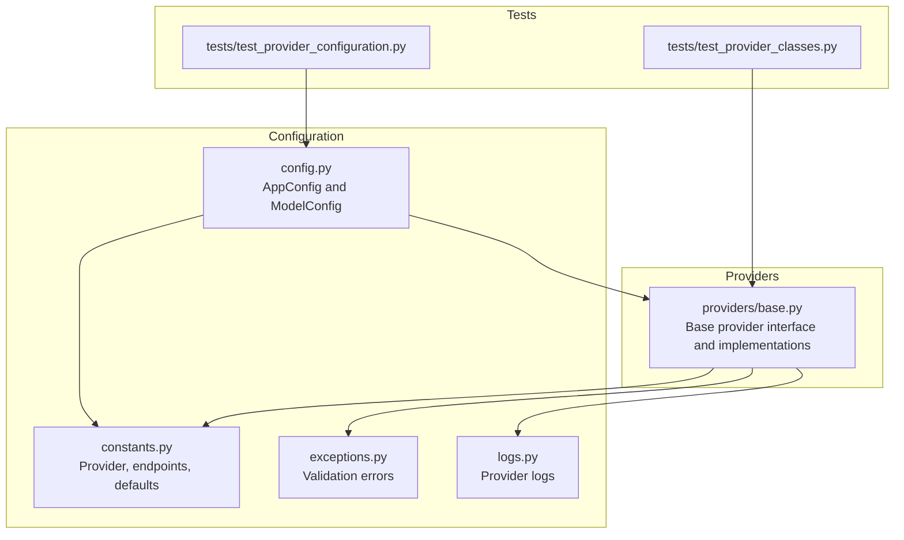
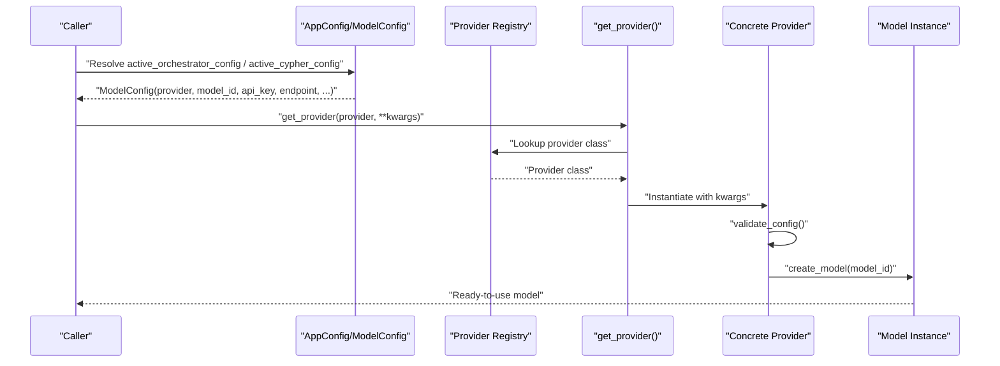
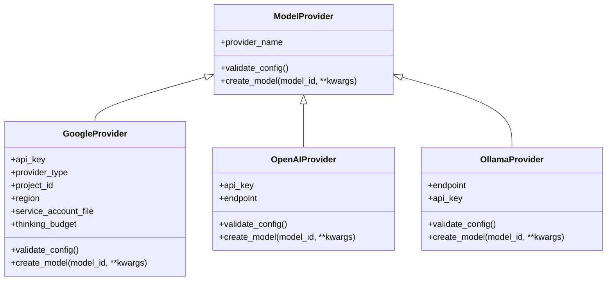
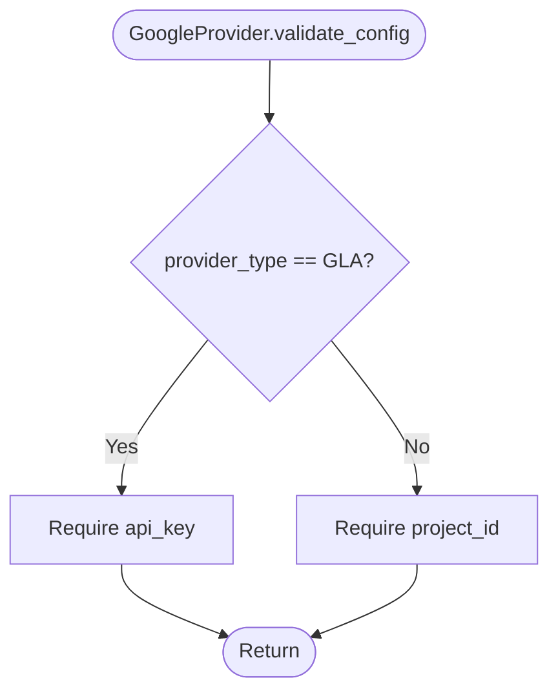
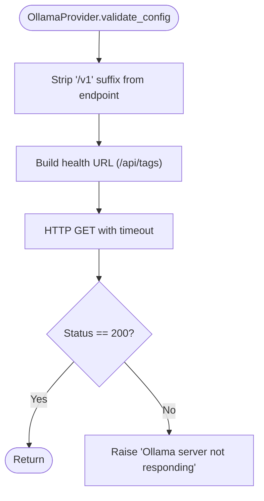
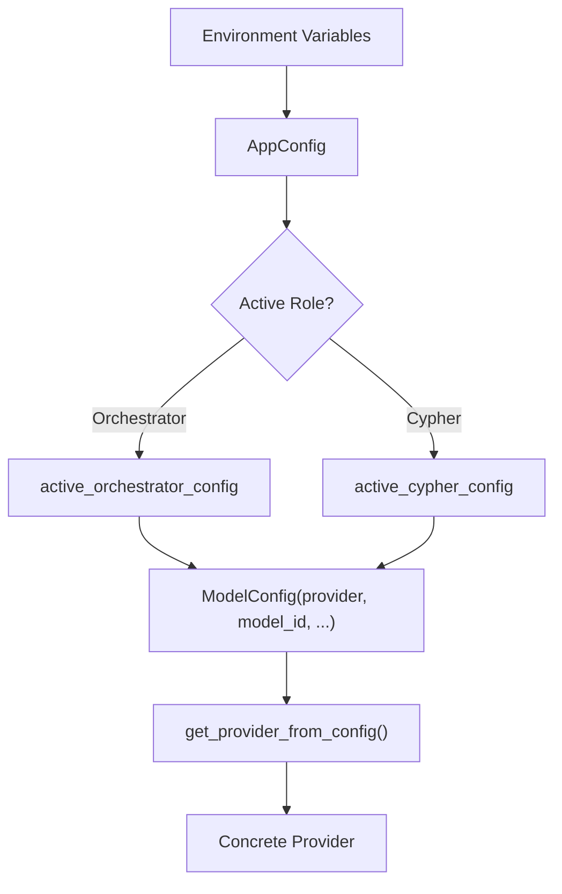
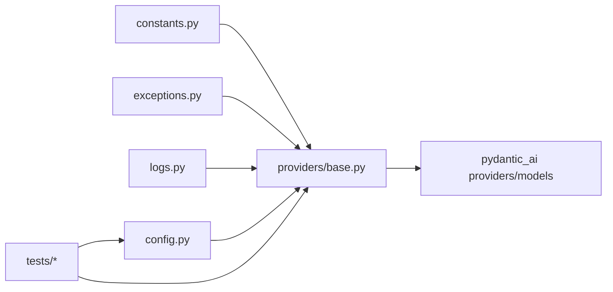

# Provider Architecture

<cite>
**Referenced Files in This Document**
- [base.py](file://codebase_rag/providers/base.py)
- [config.py](file://codebase_rag/config.py)
- [constants.py](file://codebase_rag/constants.py)
- [exceptions.py](file://codebase_rag/exceptions.py)
- [logs.py](file://codebase_rag/logs.py)
- [test_provider_classes.py](file://codebase_rag/tests/test_provider_classes.py)
- [test_provider_configuration.py](file://codebase_rag/tests/test_provider_configuration.py)
</cite>

## Table of Contents
1. [Introduction](#introduction)
2. [Project Structure](#project-structure)
3. [Core Components](#core-components)
4. [Architecture Overview](#architecture-overview)
5. [Detailed Component Analysis](#detailed-component-analysis)
6. [Dependency Analysis](#dependency-analysis)
7. [Performance Considerations](#performance-considerations)
8. [Troubleshooting Guide](#troubleshooting-guide)
9. [Conclusion](#conclusion)

## Introduction
This document explains the AI provider architecture in Graph-Code. It covers the provider abstraction layer supporting multiple AI model providers (Google Gemini, OpenAI, and Ollama), the provider factory pattern, the base provider interface, provider-specific authentication and endpoint configurations, model initialization, provider selection logic, and practical examples for configuration and switching between providers. It also outlines provider-specific limitations and capabilities.

## Project Structure
The provider architecture is centered around a small set of modules:
- Providers: a base abstraction with concrete implementations for Google, OpenAI, and Ollama
- Configuration: environment-driven settings and model selection
- Constants and exceptions: shared enums, endpoints, and error messages
- Tests: verification of provider creation, validation, and configuration

**Diagram sources**
- [base.py](file://codebase_rag/providers/base.py#L20-L209)
- [config.py](file://codebase_rag/config.py#L20-L234)
- [constants.py](file://codebase_rag/constants.py#L17-L143)
- [exceptions.py](file://codebase_rag/exceptions.py#L1-L60)
- [logs.py](file://codebase_rag/logs.py#L1-L6)
- [test_provider_classes.py](file://codebase_rag/tests/test_provider_classes.py#L1-L278)
- [test_provider_configuration.py](file://codebase_rag/tests/test_provider_configuration.py#L1-L232)

**Section sources**
- [base.py](file://codebase_rag/providers/base.py#L1-L209)
- [config.py](file://codebase_rag/config.py#L1-L234)
- [constants.py](file://codebase_rag/constants.py#L1-L143)

## Core Components
- Base provider interface: defines the contract for provider implementations, including model creation and configuration validation.
- Concrete providers:
  - GoogleProvider: supports GLA and Vertex AI with distinct authentication and configuration.
  - OpenAIProvider: supports API key and custom endpoint.
  - OllamaProvider: supports local endpoint health checks and OpenAI-compatible chat model creation.
- Factory and registry: a registry mapping provider names to classes and a factory function to instantiate providers.
- Configuration: environment-driven settings via AppConfig and ModelConfig, enabling per-role (orchestrator/cypher) provider selection.

Key responsibilities:
- Validation: each provider validates required configuration before model creation.
- Model creation: providers return model instances compatible with the underlying LLM SDK.
- Selection: AppConfig resolves active provider/model per role, with sensible defaults.

**Section sources**
- [base.py](file://codebase_rag/providers/base.py#L20-L199)
- [config.py](file://codebase_rag/config.py#L20-L234)
- [constants.py](file://codebase_rag/constants.py#L17-L143)

## Architecture Overview
The provider architecture follows a factory pattern with a registry. The configuration layer supplies provider metadata and credentials. At runtime, the system instantiates the appropriate provider implementation and initializes a model for use.

**Diagram sources**
- [base.py](file://codebase_rag/providers/base.py#L158-L199)
- [config.py](file://codebase_rag/config.py#L197-L218)

## Detailed Component Analysis

### Base Provider Interface and Factory Pattern
- ModelProvider is an abstract base class defining:
  - provider_name property
  - validate_config() for required configuration checks
  - create_model(model_id, **kwargs) to produce a model instance
- Concrete providers implement these methods with provider-specific logic.
- Registry: PROVIDER_REGISTRY maps provider names to classes.
- Factory: get_provider() retrieves a provider class from the registry and constructs it with supplied kwargs.
- Additional helpers:
  - get_provider_from_config(): convenience wrapper using a ModelConfig object.
  - register_provider(): allows registering custom providers dynamically.
  - list_providers(): enumerates available providers.

**Diagram sources**
- [base.py](file://codebase_rag/providers/base.py#L20-L199)

**Section sources**
- [base.py](file://codebase_rag/providers/base.py#L20-L199)

### GoogleProvider
- Authentication and configuration:
  - GLA mode requires an API key.
  - Vertex mode requires a project ID; optional service account file for credentials.
- Endpoint and model initialization:
  - Creates a provider instance using either API key or Vertex credentials.
  - Optionally sets thinking budget for reasoning models.
- Validation:
  - Raises explicit errors if required fields are missing.

**Diagram sources**
- [base.py](file://codebase_rag/providers/base.py#L63-L68)
- [exceptions.py](file://codebase_rag/exceptions.py#L2-L9)

**Section sources**
- [base.py](file://codebase_rag/providers/base.py#L40-L98)
- [exceptions.py](file://codebase_rag/exceptions.py#L1-L18)

### OpenAIProvider
- Authentication and configuration:
  - Requires an API key.
  - Supports a configurable endpoint URL.
- Model initialization:
  - Returns an OpenAI-compatible responses model.
- Validation:
  - Ensures API key presence.

**Section sources**
- [base.py](file://codebase_rag/providers/base.py#L100-L126)
- [exceptions.py](file://codebase_rag/exceptions.py#L10-L13)

### OllamaProvider
- Authentication and configuration:
  - Uses a fixed API key constant for compatibility with OpenAI-style clients.
  - Validates endpoint health by checking a known health path.
- Model initialization:
  - Returns an OpenAI-compatible chat model pointing to the configured endpoint.
- Validation:
  - Performs a network health check against the base URL; raises an error if unreachable.

**Diagram sources**
- [base.py](file://codebase_rag/providers/base.py#L201-L209)
- [constants.py](file://codebase_rag/constants.py#L137-L146)
- [exceptions.py](file://codebase_rag/exceptions.py#L14-L17)

**Section sources**
- [base.py](file://codebase_rag/providers/base.py#L128-L156)
- [exceptions.py](file://codebase_rag/exceptions.py#L14-L17)
- [constants.py](file://codebase_rag/constants.py#L137-L146)

### Provider Factory and Registry
- Registry: maps provider names to provider classes.
- Factory: get_provider() resolves a provider by name and constructs it with kwargs.
- Convenience: get_provider_from_config() forwards fields from a ModelConfig object.
- Extensibility: register_provider() adds custom providers at runtime.

**Section sources**
- [base.py](file://codebase_rag/providers/base.py#L158-L199)

### Configuration and Provider Selection
- AppConfig loads environment variables and exposes:
  - Role-specific settings: ORCHESTRATOR_* and CYPHER_*.
  - Defaults: falls back to Ollama with a local endpoint when no explicit provider is set.
- ModelConfig encapsulates provider metadata and credentials for a given role.
- Selection logic:
  - Active configs are resolved from environment variables or defaults.
  - Runtime overrides are supported via set_orchestrator() and set_cypher().
- Model parsing:
  - parse_model_string() supports "provider:model" format and defaults to Ollama for bare model names.

**Diagram sources**
- [config.py](file://codebase_rag/config.py#L39-L234)
- [base.py](file://codebase_rag/providers/base.py#L179-L189)

**Section sources**
- [config.py](file://codebase_rag/config.py#L39-L234)
- [constants.py](file://codebase_rag/constants.py#L17-L143)

## Dependency Analysis
- Internal dependencies:
  - providers/base.py depends on constants, exceptions, and pydantic-ai provider/model classes.
  - config.py depends on constants and dataclasses/pydantic settings.
  - tests depend on providers/base.py and config.py to validate behavior.
- External dependencies:
  - pydantic_ai providers/models for Google and OpenAI integrations.
  - httpx for Ollama health checks.

**Diagram sources**
- [base.py](file://codebase_rag/providers/base.py#L1-L18)
- [constants.py](file://codebase_rag/constants.py#L17-L143)
- [exceptions.py](file://codebase_rag/exceptions.py#L1-L60)
- [logs.py](file://codebase_rag/logs.py#L1-L6)
- [config.py](file://codebase_rag/config.py#L1-L234)

**Section sources**
- [base.py](file://codebase_rag/providers/base.py#L1-L18)
- [config.py](file://codebase_rag/config.py#L1-L234)

## Performance Considerations
- Ollama health checks: The Ollama provider performs a network request to a health endpoint. Configure timeouts appropriately to avoid blocking initialization.
- Model initialization cost: Provider-specific SDK initialization occurs during create_model(); defer heavy initialization until needed.
- Endpoint choice: Using local endpoints (e.g., Ollama) reduces latency compared to remote APIs, but may impact model quality depending on the selected model.

[No sources needed since this section provides general guidance]

## Troubleshooting Guide
Common issues and resolutions:
- Unknown provider name:
  - Symptom: ValueError indicating unknown provider.
  - Resolution: Ensure provider name matches registered keys; use list_providers() to confirm available names.
- Missing API key or project ID:
  - Symptom: Validation errors for Google GLA or Vertex, or OpenAI.
  - Resolution: Set required environment variables or pass api_key/project_id explicitly.
- Ollama server not responding:
  - Symptom: Validation error indicating the server is unreachable.
  - Resolution: Start the Ollama server or adjust endpoint and timeout settings.

Operational logs:
- Provider registration and runtime messages are logged via the logging module.

**Section sources**
- [base.py](file://codebase_rag/providers/base.py#L165-L176)
- [exceptions.py](file://codebase_rag/exceptions.py#L1-L60)
- [logs.py](file://codebase_rag/logs.py#L1-L6)

## Conclusion
The provider architecture in Graph-Code offers a clean abstraction over multiple AI providers, with a robust factory and registry pattern, environment-driven configuration, and strong validation. It supports Google GLA/Vertex, OpenAI, and Ollama, with straightforward mechanisms to add new providers and switch between them per role. By leveraging AppConfig and ModelConfig, users can configure providers via environment variables or runtime overrides, ensuring flexibility and operability across diverse deployment scenarios.