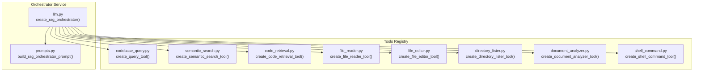
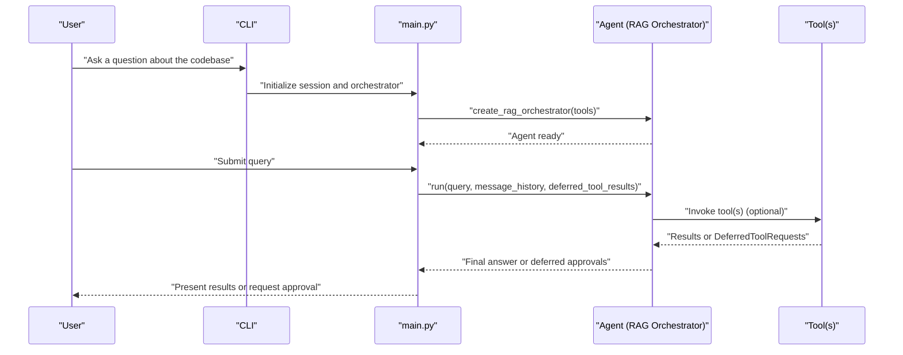
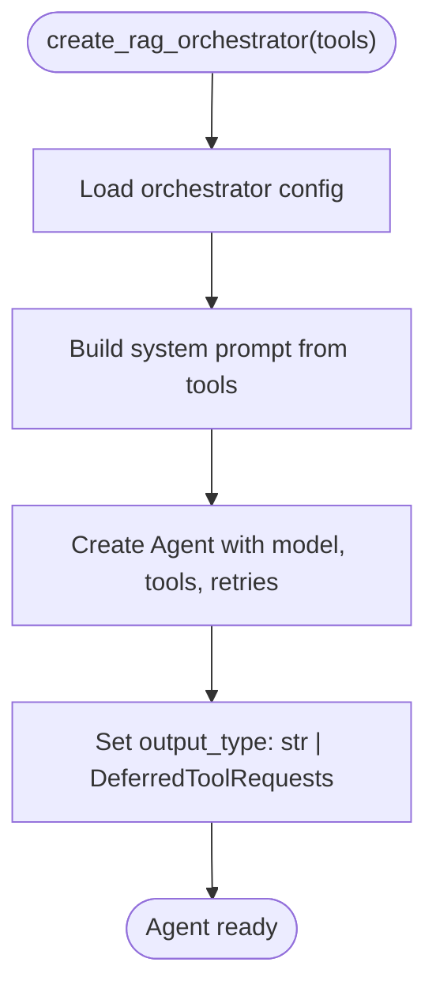
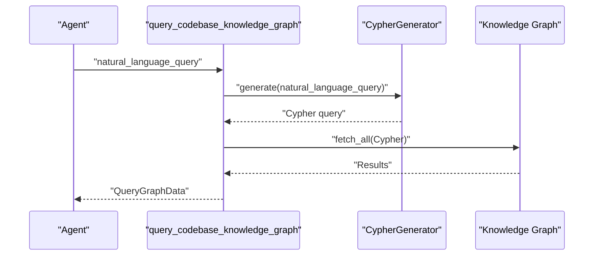
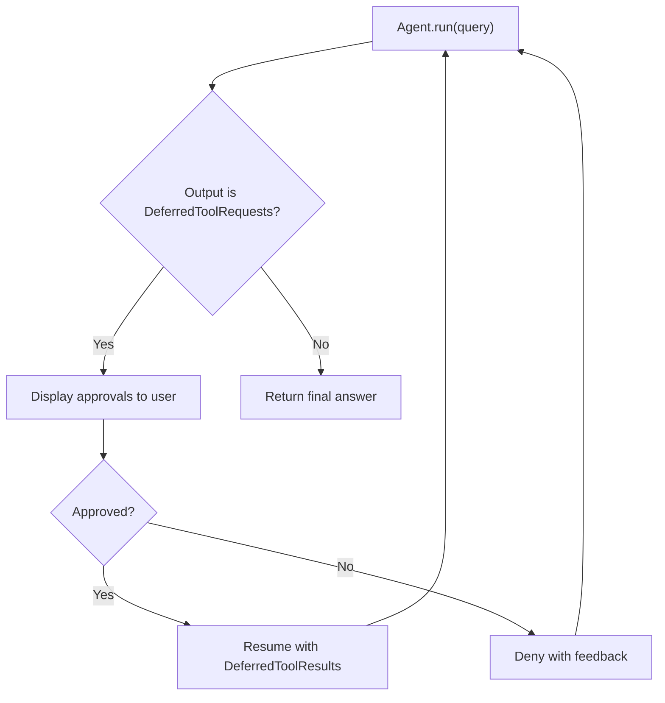
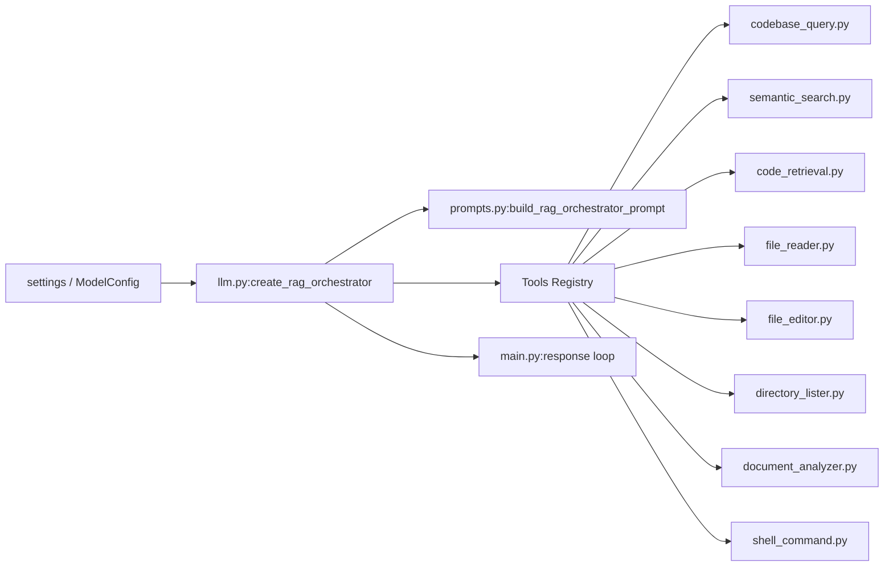

# RAG Orchestrator

<cite>
**Referenced Files in This Document**
- [main.py](file://codebase_rag/main.py)
- [llm.py](file://codebase_rag/services/llm.py)
- [prompts.py](file://codebase_rag/prompts.py)
- [codebase_query.py](file://codebase_rag/tools/codebase_query.py)
- [code_retrieval.py](file://codebase_rag/tools/code_retrieval.py)
- [directory_lister.py](file://codebase_rag/tools/directory_lister.py)
- [document_analyzer.py](file://codebase_rag/tools/document_analyzer.py)
- [file_reader.py](file://codebase_rag/tools/file_reader.py)
- [file_editor.py](file://codebase_rag/tools/file_editor.py)
- [semantic_search.py](file://codebase_rag/tools/semantic_search.py)
- [shell_command.py](file://codebase_rag/tools/shell_command.py)
- [cli.py](file://codebase_rag/cli.py)
</cite>

## Table of Contents
1. [Introduction](#introduction)
2. [Project Structure](#project-structure)
3. [Core Components](#core-components)
4. [Architecture Overview](#architecture-overview)
5. [Detailed Component Analysis](#detailed-component-analysis)
6. [Dependency Analysis](#dependency-analysis)
7. [Performance Considerations](#performance-considerations)
8. [Troubleshooting Guide](#troubleshooting-guide)
9. [Conclusion](#conclusion)

## Introduction
This document explains the RAG orchestrator system that powers AI-driven codebase interactions. It focuses on how the orchestrator composes agents with tool integration, coordinates natural language understanding, knowledge graph queries, and tool execution, and how deferred tool requests enable safe, stepwise workflows. It also covers tool registry integration, retry and error handling strategies, and practical usage patterns for building robust, cost-aware orchestrator-based workflows.

## Project Structure
The orchestrator is centered around a service that builds an agent with a curated set of tools. The agent’s system prompt is dynamically generated from the available tools, ensuring the AI stays within the supported capabilities and follows best practices for tool usage.

**Diagram sources**
- [llm.py](file://codebase_rag/services/llm.py#L78-L92)
- [prompts.py](file://codebase_rag/prompts.py#L59-L128)
- [codebase_query.py](file://codebase_rag/tools/codebase_query.py#L24-L94)
- [semantic_search.py](file://codebase_rag/tools/semantic_search.py#L121-L156)
- [code_retrieval.py](file://codebase_rag/tools/code_retrieval.py#L85-L94)
- [file_reader.py](file://codebase_rag/tools/file_reader.py#L55-L66)
- [file_editor.py](file://codebase_rag/tools/file_editor.py#L279-L295)
- [directory_lister.py](file://codebase_rag/tools/directory_lister.py#L52-L57)
- [document_analyzer.py](file://codebase_rag/tools/document_analyzer.py#L148-L167)
- [shell_command.py](file://codebase_rag/tools/shell_command.py#L422-L435)

**Section sources**
- [llm.py](file://codebase_rag/services/llm.py#L78-L92)
- [prompts.py](file://codebase_rag/prompts.py#L59-L128)

## Core Components
- Orchestrator creation: The orchestrator is built by selecting a model provider and model from configuration, constructing a system prompt from the tool registry, and enabling retries and deferred tool requests.
- Tool integration: Tools are registered as Pydantic AI Tool instances and passed into the orchestrator. Each tool encapsulates a specific capability (reading files, querying the graph, executing shell commands, etc.).
- Deferred tool requests: The orchestrator supports returning DeferredToolRequests, allowing the AI to propose actions that require user approval or further refinement before execution.
- Retry and error handling: The orchestrator and supporting tools implement retries and explicit error propagation to maintain reliability.

**Section sources**
- [llm.py](file://codebase_rag/services/llm.py#L78-L92)
- [main.py](file://codebase_rag/main.py#L387-L437)

## Architecture Overview
The orchestrator sits at the center of the system, receiving natural language queries, deciding which tools to use, and managing the execution lifecycle including approvals and retries.

**Diagram sources**
- [main.py](file://codebase_rag/main.py#L387-L437)
- [llm.py](file://codebase_rag/services/llm.py#L78-L92)

## Detailed Component Analysis

### Orchestrator Creation and Tool Integration
- The orchestrator is created with a configured model and a dynamic system prompt derived from the tool registry. It supports retries for model generation and output parsing, and declares output types that include both plain text and deferred tool requests.
- The system prompt enforces strict tool-only answers, proper tool selection per file type, and a recommended hybrid search approach combining semantic search and graph queries.

**Diagram sources**
- [llm.py](file://codebase_rag/services/llm.py#L78-L92)
- [prompts.py](file://codebase_rag/prompts.py#L59-L128)

**Section sources**
- [llm.py](file://codebase_rag/services/llm.py#L78-L92)
- [prompts.py](file://codebase_rag/prompts.py#L59-L128)

### Knowledge Graph Query Tool
- The graph query tool translates natural language into Cypher using a dedicated Cypher generator, executes the query against the knowledge graph, and formats results for display. It gracefully handles translation failures and database errors.

**Diagram sources**
- [codebase_query.py](file://codebase_rag/tools/codebase_query.py#L24-L94)
- [llm.py](file://codebase_rag/services/llm.py#L37-L75)

**Section sources**
- [codebase_query.py](file://codebase_rag/tools/codebase_query.py#L24-L94)
- [llm.py](file://codebase_rag/services/llm.py#L37-L75)

### Semantic Search Tool
- The semantic search tool embeds the query, searches embeddings, retrieves matching nodes, and enriches results with graph metadata. It falls back gracefully when dependencies are missing or when no matches are found.

**Section sources**
- [semantic_search.py](file://codebase_rag/tools/semantic_search.py#L18-L77)

### Code Retrieval Tool
- Retrieves a code snippet by qualified name using a Cypher query against the knowledge graph and reads the actual source file to return a snippet with metadata.

**Section sources**
- [code_retrieval.py](file://codebase_rag/tools/code_retrieval.py#L17-L82)

### File Reader Tool
- Safely reads a file from the project root, validates paths, and returns either content or an error message. It avoids binary files and handles decoding errors.

**Section sources**
- [file_reader.py](file://codebase_rag/tools/file_reader.py#L16-L52)

### File Editor Tool
- Supports surgical replacements and full file edits with AST-aware function extraction and diff-based patching. It validates paths and handles ambiguous matches.

**Section sources**
- [file_editor.py](file://codebase_rag/tools/file_editor.py#L22-L276)

### Directory Lister Tool
- Lists directory contents safely under the project root, preventing traversal outside the allowed scope.

**Section sources**
- [directory_lister.py](file://codebase_rag/tools/directory_lister.py#L15-L49)

### Document Analyzer Tool
- Analyzes documents (images/PDFs) using a configured provider client, copying files into a temporary area and extracting text responses with robust error handling.

**Section sources**
- [document_analyzer.py](file://codebase_rag/tools/document_analyzer.py#L28-L145)

### Shell Command Tool
- Executes shell commands with extensive safety checks, pipeline parsing, allowlisting, and approval gating. It returns structured results and raises approval-required exceptions when necessary.

**Section sources**
- [shell_command.py](file://codebase_rag/tools/shell_command.py#L262-L419)

### Deferred Tool Request Mechanism
- The orchestrator’s output type includes DeferredToolRequests, enabling the AI to propose actions that require user confirmation or additional context. The runtime loop processes approvals and resumes execution with deferred results.

**Diagram sources**
- [main.py](file://codebase_rag/main.py#L387-L437)

**Section sources**
- [main.py](file://codebase_rag/main.py#L218-L248)
- [main.py](file://codebase_rag/main.py#L387-L437)

### Orchestrator Usage Patterns and Tool Coordination
- Hybrid search: Start with semantic search to locate intent-aligned candidates, then query the graph for relationships, and finally read files to understand implementation details.
- Entry point discovery: Use semantic search to find likely entry points, query relationships, and read the actual main file to distinguish real entry points from helpers.
- Document-centric analysis: Use the document analyzer for PDFs and images, then combine with graph and file reads for synthesis.
- Safe shell usage: Let the shell command tool handle dangerous patterns and approvals automatically; when it returns a confirmation prompt, surface it to the user for approval.

**Section sources**
- [prompts.py](file://codebase_rag/prompts.py#L78-L127)
- [shell_command.py](file://codebase_rag/tools/shell_command.py#L422-L435)

## Dependency Analysis
The orchestrator depends on:
- Configuration-driven model selection and provider instantiation
- Dynamic system prompt construction from the tool registry
- Tool implementations that encapsulate domain-specific capabilities
- A runtime loop that manages deferred tool requests and user approvals

**Diagram sources**
- [llm.py](file://codebase_rag/services/llm.py#L78-L92)
- [prompts.py](file://codebase_rag/prompts.py#L59-L128)
- [main.py](file://codebase_rag/main.py#L387-L437)

**Section sources**
- [llm.py](file://codebase_rag/services/llm.py#L78-L92)
- [prompts.py](file://codebase_rag/prompts.py#L59-L128)
- [main.py](file://codebase_rag/main.py#L387-L437)

## Performance Considerations
- Token efficiency: Prefer focused semantic queries and read only relevant sections of files to reduce context usage.
- Batched graph operations: Use limit clauses and targeted queries to avoid overwhelming responses.
- Cost management: Choose smaller, local models for low-cost runs when adequate; reserve larger models for complex reasoning.
- Retries: Configure agent and output retries appropriately to balance reliability and latency.
- Safety-first execution: Allowlist commands and enforce approvals to minimize costly mistakes.

[No sources needed since this section provides general guidance]

## Troubleshooting Guide
- Orchestrator initialization failures: Errors during provider/model creation are wrapped and surfaced as generation errors with contextual messages.
- Tool execution errors: Tools catch exceptions and return structured summaries or error messages; inspect logs for detailed failure reasons.
- Deferred approvals: If the orchestrator returns deferred requests, ensure the runtime loop processes approvals and resumes with deferred results.
- Shell command denials: When a command requires approval, surface the prompt to the user and handle denials with feedback.

**Section sources**
- [llm.py](file://codebase_rag/services/llm.py#L78-L92)
- [codebase_query.py](file://codebase_rag/tools/codebase_query.py#L76-L88)
- [file_reader.py](file://codebase_rag/tools/file_reader.py#L47-L52)
- [shell_command.py](file://codebase_rag/tools/shell_command.py#L422-L435)
- [main.py](file://codebase_rag/main.py#L387-L437)

## Conclusion
The RAG orchestrator integrates a diverse set of AI-powered tools behind a disciplined system prompt and robust execution model. By leveraging deferred tool requests, strict safety checks, and hybrid search strategies, it enables reliable, interpretable, and cost-conscious codebase interactions. Proper configuration, retry tuning, and adherence to tool-only workflows ensure predictable outcomes across varied use cases.