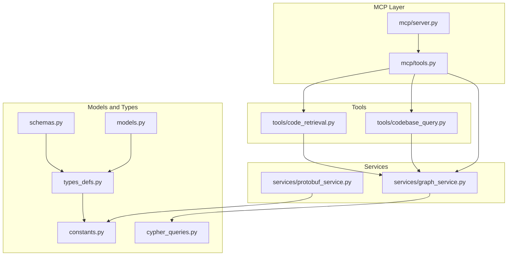
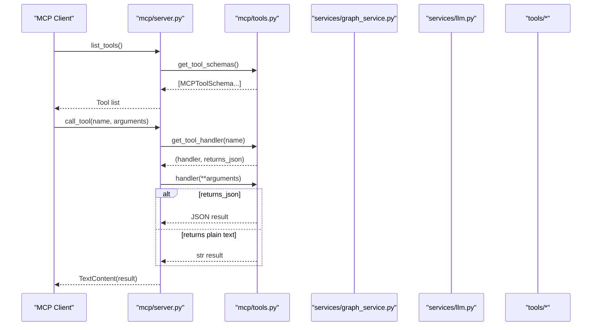
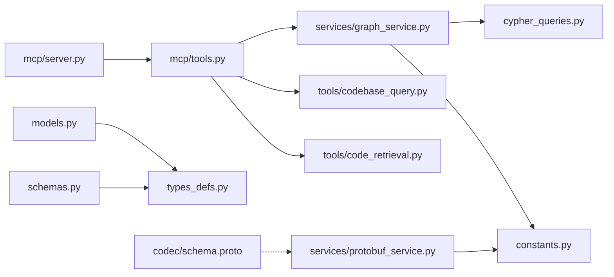

# API Reference

<cite>
**Referenced Files in This Document**
- [models.py](file://codebase_rag/models.py)
- [types_defs.py](file://codebase_rag/types_defs.py)
- [schemas.py](file://codebase_rag/schemas.py)
- [exceptions.py](file://codebase_rag/exceptions.py)
- [tool_errors.py](file://codebase_rag/tool_errors.py)
- [mcp/tools.py](file://codebase_rag/mcp/tools.py)
- [mcp/server.py](file://codebase_rag/mcp/server.py)
- [services/graph_service.py](file://codebase_rag/services/graph_service.py)
- [services/protobuf_service.py](file://codebase_rag/services/protobuf_service.py)
- [tools/codebase_query.py](file://codebase_rag/tools/codebase_query.py)
- [tools/code_retrieval.py](file://codebase_rag/tools/code_retrieval.py)
- [constants.py](file://codebase_rag/constants.py)
- [cypher_queries.py](file://codebase_rag/cypher_queries.py)
- [services/__init__.py](file://codebase_rag/services/__init__.py)
- [codec/schema.proto](file://codec/schema.proto)
</cite>

## Table of Contents
1. [Introduction](#introduction)
2. [Project Structure](#project-structure)
3. [Core Components](#core-components)
4. [Architecture Overview](#architecture-overview)
5. [Detailed Component Analysis](#detailed-component-analysis)
6. [Dependency Analysis](#dependency-analysis)
7. [Performance Considerations](#performance-considerations)
8. [Troubleshooting Guide](#troubleshooting-guide)
9. [Conclusion](#conclusion)
10. [Appendices](#appendices)

## Introduction
This document provides a comprehensive API reference for Graph-Code’s core interfaces and data models. It covers:
- Public API endpoints and tool schemas for the Model Context Protocol (MCP)
- Function signatures and parameter specifications for core services
- Data models for nodes, relationships, and configuration
- Exception hierarchy and error handling patterns
- Internal and external data structures, including Protocol Buffers schemas
- Serialization formats and interchange protocols
- API versioning strategy and backward compatibility guarantees
- Practical examples for querying, editing, and configuration
- Guidance for extending APIs and developing custom integrations

## Project Structure
The API surface spans several modules:
- MCP server and tool registry for external tool invocation
- Services for graph ingestion, querying, and export
- Tools for natural language to Cypher translation and code snippet retrieval
- Data models and typed dictionaries for internal and external APIs
- Protocol Buffers schema for graph serialization

**Diagram sources**
- [mcp/server.py](file://codebase_rag/mcp/server.py#L58-L135)
- [mcp/tools.py](file://codebase_rag/mcp/tools.py#L40-L458)
- [services/graph_service.py](file://codebase_rag/services/graph_service.py#L49-L364)
- [services/protobuf_service.py](file://codebase_rag/services/protobuf_service.py#L35-L178)
- [tools/codebase_query.py](file://codebase_rag/tools/codebase_query.py#L24-L95)
- [tools/code_retrieval.py](file://codebase_rag/tools/code_retrieval.py#L17-L95)
- [models.py](file://codebase_rag/models.py#L15-L95)
- [types_defs.py](file://codebase_rag/types_defs.py#L1-L555)
- [schemas.py](file://codebase_rag/schemas.py#L8-L82)
- [constants.py](file://codebase_rag/constants.py#L1-L800)
- [cypher_queries.py](file://codebase_rag/cypher_queries.py#L1-L120)

**Section sources**
- [mcp/server.py](file://codebase_rag/mcp/server.py#L1-L166)
- [mcp/tools.py](file://codebase_rag/mcp/tools.py#L1-L458)
- [services/graph_service.py](file://codebase_rag/services/graph_service.py#L1-L364)
- [services/protobuf_service.py](file://codebase_rag/services/protobuf_service.py#L1-L178)
- [tools/codebase_query.py](file://codebase_rag/tools/codebase_query.py#L1-L95)
- [tools/code_retrieval.py](file://codebase_rag/tools/code_retrieval.py#L1-L95)
- [models.py](file://codebase_rag/models.py#L1-L95)
- [types_defs.py](file://codebase_rag/types_defs.py#L1-L555)
- [schemas.py](file://codebase_rag/schemas.py#L1-L82)
- [constants.py](file://codebase_rag/constants.py#L1-L800)
- [cypher_queries.py](file://codebase_rag/cypher_queries.py#L1-L120)

## Core Components
This section documents the primary APIs and data models used by Graph-Code.

- Graph data models
  - Node: identified by an integer ID, labels, and properties
  - Relationship: directed link with type and properties
- Typed dictionaries and schemas for results and tool arguments
- Protobuf schema for graph serialization
- MCP tool registry and server for external tool invocation

Key data structures and their definitions:
- Node and relationship models: [GraphNode](file://codebase_rag/models.py#L36-L47), [GraphRelationship](file://codebase_rag/models.py#L42-L47)
- Typed dictionaries for results and tool arguments: [QueryGraphData](file://codebase_rag/schemas.py#L8-L34), [CodeSnippet](file://codebase_rag/schemas.py#L37-L45), [ShellCommandResult](file://codebase_rag/schemas.py#L48-L51), [EditResult](file://codebase_rag/schemas.py#L54-L63), [FileReadResult](file://codebase_rag/schemas.py#L66-L69), [FileCreationResult](file://codebase_rag/schemas.py#L72-L82)
- MCP input schema and tool metadata: [MCPInputSchema](file://codebase_rag/types_defs.py#L355-L364), [ToolMetadata](file://codebase_rag/models.py#L89-L95)
- Protobuf schema: [GraphCodeIndex](file://codec/schema.proto#L81-L84), [Node](file://codec/schema.proto#L92-L106), [Relationship](file://codec/schema.proto#L110-L134)

**Section sources**
- [models.py](file://codebase_rag/models.py#L36-L95)
- [schemas.py](file://codebase_rag/schemas.py#L8-L82)
- [types_defs.py](file://codebase_rag/types_defs.py#L346-L421)
- [codec/schema.proto](file://codec/schema.proto#L81-L235)

## Architecture Overview
The MCP server exposes a registry of tools. Each tool is backed by a handler that interacts with the graph service and other components. Results are serialized either as JSON or plain text depending on the tool’s specification.

**Diagram sources**
- [mcp/server.py](file://codebase_rag/mcp/server.py#L96-L134)
- [mcp/tools.py](file://codebase_rag/mcp/tools.py#L433-L446)

**Section sources**
- [mcp/server.py](file://codebase_rag/mcp/server.py#L58-L135)
- [mcp/tools.py](file://codebase_rag/mcp/tools.py#L40-L458)

## Detailed Component Analysis

### MCP Tool Registry and Server
- Tool registry creation and handlers
  - [MCPToolsRegistry.__init__](file://codebase_rag/mcp/tools.py#L40-L249): registers tools with input schemas and handlers
  - [MCPToolsRegistry.get_tool_schemas](file://codebase_rag/mcp/tools.py#L433-L441): returns tool schemas for discovery
  - [MCPToolsRegistry.get_tool_handler](file://codebase_rag/mcp/tools.py#L443-L446): resolves handler and return type
- Server initialization and routing
  - [create_server](file://codebase_rag/mcp/server.py#L58-L135): sets up logging, project root, services, and routes
  - [Server.list_tools](file://codebase_rag/mcp/server.py#L96-L106): returns tool descriptors
  - [Server.call_tool](file://codebase_rag/mcp/server.py#L108-L134): dispatches tool calls and formats results

Public tool endpoints and parameters:
- list_projects: no parameters
- delete_project: required parameter project_name
- wipe_database: required parameter confirm (boolean)
- index_repository: no parameters
- query_code_graph: required parameter natural_language_query
- get_code_snippet: required parameter qualified_name
- surgical_replace_code: required parameters file_path, target_code, replacement_code
- read_file: required parameter file_path; optional parameters offset, limit
- write_file: required parameters file_path, content
- list_directory: optional parameter directory_path (defaults to configured value)

Return types:
- Returns JSON for tools that produce structured results (list_projects, delete_project, wipe_database, index_repository, query_code_graph, get_code_snippet, read_file, write_file, list_directory)
- Returns plain text for tools that produce human-readable summaries

**Section sources**
- [mcp/tools.py](file://codebase_rag/mcp/tools.py#L40-L458)
- [mcp/server.py](file://codebase_rag/mcp/server.py#L58-L135)
- [types_defs.py](file://codebase_rag/types_defs.py#L346-L421)

### Graph Service (Memgraph Ingestor)
- Connection lifecycle and batching
  - [MemgraphIngestor.__enter__](file://codebase_rag/services/graph_service.py#L67-L72), [__exit__](file://codebase_rag/services/graph_service.py#L74-L82)
  - [MemgraphIngestor.ensure_node_batch](file://codebase_rag/services/graph_service.py#L189-L196), [ensure_relationship_batch](file://codebase_rag/services/graph_service.py#L197-L218)
  - [MemgraphIngestor.flush_nodes](file://codebase_rag/services/graph_service.py#L219-L266), [flush_relationships](file://codebase_rag/services/graph_service.py#L267-L322), [flush_all](file://codebase_rag/services/graph_service.py#L323-L327)
- Query execution and export
  - [MemgraphIngestor.fetch_all](file://codebase_rag/services/graph_service.py#L329-L333), [execute_write](file://codebase_rag/services/graph_service.py#L335-L339)
  - [MemgraphIngestor.export_graph_to_dict](file://codebase_rag/services/graph_service.py#L341-L360)

Protocols for ingestion and querying:
- [IngestorProtocol](file://codebase_rag/services/__init__.py#L6-L18)
- [QueryProtocol](file://codebase_rag/services/__init__.py#L21-L27)

Cypher utilities:
- [wrap_with_unwind](file://codebase_rag/cypher_queries.py#L82-L83), [build_merge_node_query](file://codebase_rag/cypher_queries.py#L101-L102), [build_merge_relationship_query](file://codebase_rag/cypher_queries.py#L105-L119)

**Section sources**
- [services/graph_service.py](file://codebase_rag/services/graph_service.py#L49-L364)
- [services/__init__.py](file://codebase_rag/services/__init__.py#L1-L28)
- [cypher_queries.py](file://codebase_rag/cypher_queries.py#L82-L120)

### Tools: Natural Language to Cypher and Code Retrieval
- Query tool
  - [create_query_tool](file://codebase_rag/tools/codebase_query.py#L24-L95): translates NL to Cypher and executes via ingestor
- Code retrieval tool
  - [CodeRetriever.find_code_snippet](file://codebase_rag/tools/code_retrieval.py#L23-L82): retrieves source code snippet by qualified name

Results and schemas:
- [QueryGraphData](file://codebase_rag/schemas.py#L8-L34)
- [CodeSnippet](file://codebase_rag/schemas.py#L37-L45)

**Section sources**
- [tools/codebase_query.py](file://codebase_rag/tools/codebase_query.py#L24-L95)
- [tools/code_retrieval.py](file://codebase_rag/tools/code_retrieval.py#L17-L95)
- [schemas.py](file://codebase_rag/schemas.py#L8-L82)

### Protobuf Service and Schema
- Protobuf ingestion and flushing
  - [ProtobufFileIngestor](file://codebase_rag/services/protobuf_service.py#L35-L178): builds nodes and relationships, writes joint or split indices
- Schema definitions
  - [GraphCodeIndex](file://codec/schema.proto#L81-L84), [Node](file://codec/schema.proto#L92-L106), [Relationship](file://codec/schema.proto#L110-L134)
  - Node payloads: [Project](file://codec/schema.proto#L141-L144), [Package](file://codec/schema.proto#L146-L152), [Folder](file://codec/schema.proto#L154-L159), [File](file://codec/schema.proto#L161-L167), [Module](file://codec/schema.proto#L169-L175), [ModuleImplementation](file://codec/schema.proto#L178-L185), [ModuleInterface](file://codec/schema.proto#L188-L194), [ExternalPackage](file://codec/schema.proto#L196-L199), [Function](file://codec/schema.proto#L201-L211), [Method](file://codec/schema.proto#L213-L222), [Class](file://codec/schema.proto#L224-L234)

Serialization behavior:
- Nodes are keyed by label-specific unique identifiers (name, path, or qualified_name)
- Relationships are uniquely identified by (source_id, rel_type, target_id) and merge properties when duplicates occur

**Section sources**
- [services/protobuf_service.py](file://codebase_rag/services/protobuf_service.py#L35-L178)
- [codec/schema.proto](file://codec/schema.proto#L81-L235)

### Data Models and Typed Definitions
- Node and relationship models: [GraphNode](file://codebase_rag/models.py#L36-L39), [GraphRelationship](file://codebase_rag/models.py#L42-L47)
- Typed dictionaries for graph data: [GraphData](file://codebase_rag/types_defs.py#L171-L174), [GraphSummary](file://codebase_rag/types_defs.py#L177-L182), [NodeData](file://codebase_rag/types_defs.py#L158-L161), [RelationshipData](file://codebase_rag/types_defs.py#L164-L168)
- Result schemas: [EmbeddingQueryResult](file://codebase_rag/types_defs.py#L185-L191), [SemanticSearchResult](file://codebase_rag/types_defs.py#L193-L199)
- Java introspection models: [JavaClassInfo](file://codebase_rag/types_defs.py#L200-L207), [JavaMethodInfo](file://codebase_rag/types_defs.py#L210-L217), [JavaFieldInfo](file://codebase_rag/types_defs.py#L220-L224), [JavaAnnotationInfo](file://codebase_rag/types_defs.py#L227-L229), [JavaMethodCallInfo](file://codebase_rag/types_defs.py#L232-L236)
- MCP tool schemas and input schema: [MCPToolSchema](file://codebase_rag/types_defs.py#L361-L364), [MCPInputSchema](file://codebase_rag/types_defs.py#L355-L364)
- Node and relationship schemas for validation: [NODE_SCHEMAS](file://codebase_rag/types_defs.py#L435-L470), [RELATIONSHIP_SCHEMAS](file://codebase_rag/types_defs.py#L473-L554)

Validation rules:
- Node schemas define property types per label
- Relationship schemas define allowed source-target combinations and relationship types

**Section sources**
- [models.py](file://codebase_rag/models.py#L36-L95)
- [types_defs.py](file://codebase_rag/types_defs.py#L152-L554)

### Exception Hierarchy and Error Handling
- Provider and configuration errors: [exceptions.py](file://codebase_rag/exceptions.py#L1-L60)
- Tool-specific errors: [tool_errors.py](file://codebase_rag/tool_errors.py#L1-L72)
- Example patterns:
  - Validation failures raise descriptive messages for configuration and provider setup
  - Tool handlers catch exceptions and return structured error results or formatted error text
  - MCP server wraps tool errors into standardized text content

Common error categories:
- Provider configuration (missing keys, invalid endpoints)
- Graph loading and constraint violations
- Parser availability and language support
- LLM generation failures and invalid outputs
- Access control and security-related restrictions
- Tool execution errors (file operations, directory listing, shell commands)

**Section sources**
- [exceptions.py](file://codebase_rag/exceptions.py#L1-L60)
- [tool_errors.py](file://codebase_rag/tool_errors.py#L1-L72)
- [mcp/server.py](file://codebase_rag/mcp/server.py#L108-L134)
- [mcp/tools.py](file://codebase_rag/mcp/tools.py#L251-L431)

### API Versioning and Backward Compatibility
- No explicit versioning scheme is defined in the codebase. The recommended approach is to:
  - Keep MCP tool names and input schemas backward compatible
  - Add new optional parameters while preserving required ones
  - Maintain Protobuf schema evolution by adding fields with new tags and avoiding removals
  - Provide deprecation notices for removed tools or parameters

[No sources needed since this section provides general guidance]

### Practical Examples

- Query the code graph using natural language
  - Call: [query_code_graph](file://codebase_rag/mcp/tools.py#L314-L334)
  - Parameters: natural_language_query (string)
  - Returns: [QueryGraphData](file://codebase_rag/schemas.py#L8-L34) as JSON

- Retrieve a code snippet by qualified name
  - Call: [get_code_snippet](file://codebase_rag/mcp/tools.py#L336-L354)
  - Parameters: qualified_name (string)
  - Returns: [CodeSnippetResultDict](file://codebase_rag/types_defs.py#L374-L383) as JSON

- Surgical code replacement
  - Call: [surgical_replace_code](file://codebase_rag/mcp/tools.py#L356-L369)
  - Parameters: file_path (string), target_code (string), replacement_code (string)
  - Returns: plain text status

- Read file content with pagination
  - Call: [read_file](file://codebase_rag/mcp/tools.py#L371-L407)
  - Parameters: file_path (string), offset (integer, optional), limit (integer, optional)
  - Returns: plain text header plus content

- Write file content
  - Call: [write_file](file://codebase_rag/mcp/tools.py#L409-L420)
  - Parameters: file_path (string), content (string)
  - Returns: plain text success or error

- List directory contents
  - Call: [list_directory](file://codebase_rag/mcp/tools.py#L422-L431)
  - Parameters: directory_path (string, optional, defaults to configured value)
  - Returns: plain text listing

**Section sources**
- [mcp/tools.py](file://codebase_rag/mcp/tools.py#L314-L431)
- [schemas.py](file://codebase_rag/schemas.py#L8-L82)
- [types_defs.py](file://codebase_rag/types_defs.py#L374-L383)

### Extending APIs and Developing Custom Integrations
- Extend MCP tools
  - Define a new ToolMetadata with input schema and handler
  - Register the tool in [MCPToolsRegistry._tools](file://codebase_rag/mcp/tools.py#L70-L249)
  - Implement handler logic and return either JSON-compatible data or plain text
- Integrate new ingestion backends
  - Implement [IngestorProtocol](file://codebase_rag/services/__init__.py#L6-L18) to support batching and flushing
  - Use [build_merge_node_query](file://codebase_rag/cypher_queries.py#L101-L102) and [build_merge_relationship_query](file://codebase_rag/cypher_queries.py#L105-L119) for Cypher-based backends
- Add Protobuf node types
  - Extend [Node.payload oneof](file://codec/schema.proto#L93-L105) and mapping in [ProtobufFileIngestor](file://codebase_rag/services/protobuf_service.py#L13-L29)
- Maintain backward compatibility
  - Avoid removing required fields or parameters
  - Add new optional fields with default values

**Section sources**
- [mcp/tools.py](file://codebase_rag/mcp/tools.py#L40-L249)
- [services/__init__.py](file://codebase_rag/services/__init__.py#L6-L18)
- [cypher_queries.py](file://codebase_rag/cypher_queries.py#L101-L119)
- [services/protobuf_service.py](file://codebase_rag/services/protobuf_service.py#L13-L29)
- [codec/schema.proto](file://codec/schema.proto#L93-L105)

## Dependency Analysis
This section maps key dependencies among components.

**Diagram sources**
- [mcp/server.py](file://codebase_rag/mcp/server.py#L58-L135)
- [mcp/tools.py](file://codebase_rag/mcp/tools.py#L40-L249)
- [services/graph_service.py](file://codebase_rag/services/graph_service.py#L49-L364)
- [tools/codebase_query.py](file://codebase_rag/tools/codebase_query.py#L24-L95)
- [tools/code_retrieval.py](file://codebase_rag/tools/code_retrieval.py#L17-L95)
- [cypher_queries.py](file://codebase_rag/cypher_queries.py#L1-L120)
- [constants.py](file://codebase_rag/constants.py#L1-L800)
- [services/protobuf_service.py](file://codebase_rag/services/protobuf_service.py#L35-L178)
- [models.py](file://codebase_rag/models.py#L1-L95)
- [types_defs.py](file://codebase_rag/types_defs.py#L1-L555)
- [schemas.py](file://codebase_rag/schemas.py#L1-L82)
- [codec/schema.proto](file://codec/schema.proto#L81-L235)

**Section sources**
- [mcp/server.py](file://codebase_rag/mcp/server.py#L58-L135)
- [mcp/tools.py](file://codebase_rag/mcp/tools.py#L40-L249)
- [services/graph_service.py](file://codebase_rag/services/graph_service.py#L49-L364)
- [tools/codebase_query.py](file://codebase_rag/tools/codebase_query.py#L24-L95)
- [tools/code_retrieval.py](file://codebase_rag/tools/code_retrieval.py#L17-L95)
- [services/protobuf_service.py](file://codebase_rag/services/protobuf_service.py#L35-L178)
- [models.py](file://codebase_rag/models.py#L1-L95)
- [types_defs.py](file://codebase_rag/types_defs.py#L1-L555)
- [schemas.py](file://codebase_rag/schemas.py#L1-L82)
- [constants.py](file://codebase_rag/constants.py#L1-L800)
- [cypher_queries.py](file://codebase_rag/cypher_queries.py#L1-L120)
- [codec/schema.proto](file://codec/schema.proto#L81-L235)

## Performance Considerations
- Batching and buffering
  - Use [ensure_node_batch](file://codebase_rag/services/graph_service.py#L189-L196) and [ensure_relationship_batch](file://codebase_rag/services/graph_service.py#L197-L218) to reduce round-trips
  - Tune batch_size in [MemgraphIngestor](file://codebase_rag/services/graph_service.py#L50-L55) for optimal throughput
- Query efficiency
  - Prefer targeted Cypher queries and limits; see [CYPHER_DEFAULT_LIMIT](file://codebase_rag/constants.py#L414-L414) and examples in [cypher_queries.py](file://codebase_rag/cypher_queries.py#L1-L120)
- Protobuf serialization
  - Choose split index mode for large graphs to reduce memory pressure; see [flush_all](file://codebase_rag/services/protobuf_service.py#L174-L177)

[No sources needed since this section provides general guidance]

## Troubleshooting Guide
Common issues and resolutions:
- Provider configuration errors
  - Ensure required keys and endpoints are set; see [exceptions.py](file://codebase_rag/exceptions.py#L1-L60)
- Graph connectivity and constraints
  - Verify Memgraph connection and unique constraints; see [MemgraphIngestor.__enter__](file://codebase_rag/services/graph_service.py#L67-L72), [ensure_constraints](file://codebase_rag/services/graph_service.py#L180-L187)
- Tool execution failures
  - Inspect tool-specific errors and return structured results; see [tool_errors.py](file://codebase_rag/tool_errors.py#L1-L72)
- MCP server startup
  - Confirm project root resolution and directory existence; see [get_project_root](file://codebase_rag/mcp/server.py#L30-L55)

**Section sources**
- [exceptions.py](file://codebase_rag/exceptions.py#L1-L60)
- [tool_errors.py](file://codebase_rag/tool_errors.py#L1-L72)
- [services/graph_service.py](file://codebase_rag/services/graph_service.py#L67-L72)
- [mcp/server.py](file://codebase_rag/mcp/server.py#L30-L55)

## Conclusion
Graph-Code exposes a robust MCP-based tool interface backed by a Cypher-based graph service and Protobuf serialization. The API emphasizes structured schemas, typed dictionaries, and clear error handling. By following the guidelines here, developers can integrate new tools, extend ingestion backends, and maintain backward compatibility.

[No sources needed since this section summarizes without analyzing specific files]

## Appendices

### API Endpoints Summary
- list_projects: no parameters
- delete_project: project_name (string)
- wipe_database: confirm (boolean)
- index_repository: no parameters
- query_code_graph: natural_language_query (string)
- get_code_snippet: qualified_name (string)
- surgical_replace_code: file_path (string), target_code (string), replacement_code (string)
- read_file: file_path (string), offset (integer, optional), limit (integer, optional)
- write_file: file_path (string), content (string)
- list_directory: directory_path (string, optional)

**Section sources**
- [mcp/tools.py](file://codebase_rag/mcp/tools.py#L70-L249)

### Data Model Definitions
- Node: node_id (integer), labels (list of strings), properties (dict)
- Relationship: from_id (integer), to_id (integer), type (string), properties (dict)
- GraphData: nodes (list of NodeData or ResultRow), relationships (list of RelationshipData or ResultRow), metadata (GraphMetadata)
- MCPInputSchema: type (string), properties (dict of MCPInputSchemaProperty), required (list of strings)

**Section sources**
- [models.py](file://codebase_rag/models.py#L36-L47)
- [types_defs.py](file://codebase_rag/types_defs.py#L158-L174)
- [types_defs.py](file://codebase_rag/types_defs.py#L355-L364)

### Serialization Formats and Protocols
- JSON: used for MCP tool results that return structured data
- Plain text: used for human-readable summaries and file operations
- Protocol Buffers: [GraphCodeIndex](file://codec/schema.proto#L81-L84) with oneof payload variants for nodes and enum relationship types

**Section sources**
- [mcp/server.py](file://codebase_rag/mcp/server.py#L123-L128)
- [codec/schema.proto](file://codec/schema.proto#L81-L235)