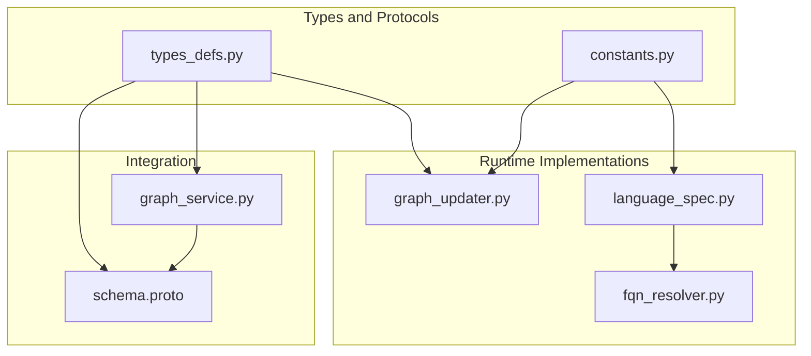
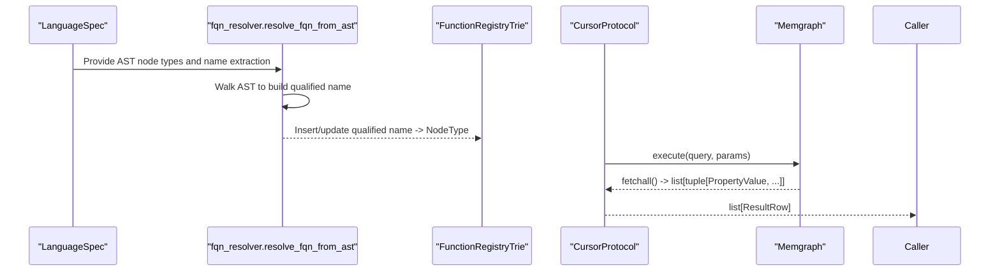
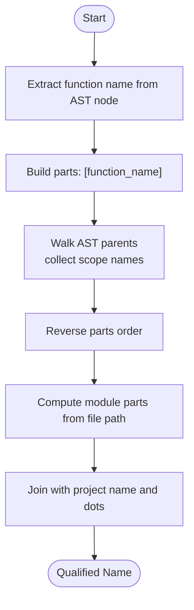
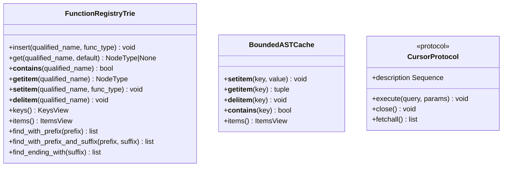
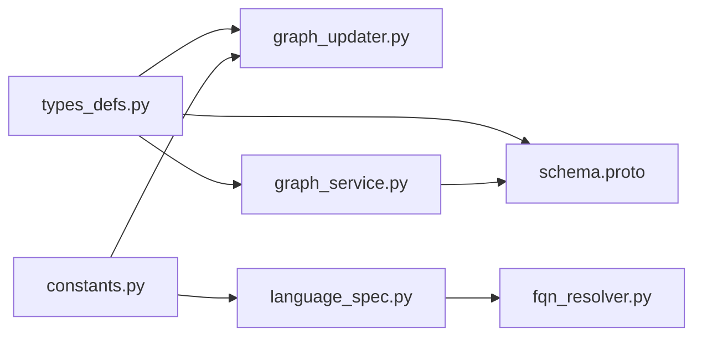

# Core Types and Interfaces

<cite>
**Referenced Files in This Document**
- [types_defs.py](file://codebase_rag/types_defs.py)
- [constants.py](file://codebase_rag/constants.py)
- [graph_updater.py](file://codebase_rag/graph_updater.py)
- [fqn_resolver.py](file://codebase_rag/utils/fqn_resolver.py)
- [language_spec.py](file://codebase_rag/language_spec.py)
- [graph_service.py](file://codebase_rag/services/graph_service.py)
- [schema.proto](file://codec/schema.proto)
</cite>

## Table of Contents
1. [Introduction](#introduction)
2. [Project Structure](#project-structure)
3. [Core Components](#core-components)
4. [Architecture Overview](#architecture-overview)
5. [Detailed Component Analysis](#detailed-component-analysis)
6. [Dependency Analysis](#dependency-analysis)
7. [Performance Considerations](#performance-considerations)
8. [Troubleshooting Guide](#troubleshooting-guide)
9. [Conclusion](#conclusion)

## Introduction
This document explains Graph-Code’s core type definitions and interfaces that underpin type-safe operations across the codebase. It covers:
- Fundamental type aliases for property values, result rows, and batching
- Protocol interfaces for registries, caches, cursors, and AST nodes
- Node identifier system and qualified name resolution patterns
- Language-specific type definitions and their relationships to AST nodes
- Enum definitions for node labels and relationship types
- Practical usage patterns and integration with the overall architecture

## Project Structure
The core type system is primarily defined in a single module and complemented by constants, language specs, and utilities:
- types_defs.py: central type definitions, protocols, and language-agnostic schemas
- constants.py: enums for node labels, relationship types, supported languages, and AST node type constants
- graph_updater.py: concrete implementations of FunctionRegistryTrie and AST cache
- fqn_resolver.py: qualified name resolution using language-specific specs
- language_spec.py: language-specific AST node type mappings and helpers
- graph_service.py: usage of protocols and result types in ingestion and querying
- schema.proto: protobuf representation of nodes and relationships

**Diagram sources**
- [types_defs.py](file://codebase_rag/types_defs.py#L21-L126)
- [constants.py](file://codebase_rag/constants.py#L317-L377)
- [graph_updater.py](file://codebase_rag/graph_updater.py#L31-L160)
- [fqn_resolver.py](file://codebase_rag/utils/fqn_resolver.py#L17-L108)
- [language_spec.py](file://codebase_rag/language_spec.py#L113-L202)
- [graph_service.py](file://codebase_rag/services/graph_service.py#L96-L165)
- [schema.proto](file://codec/schema.proto#L81-L134)

**Section sources**
- [types_defs.py](file://codebase_rag/types_defs.py#L1-L555)
- [constants.py](file://codebase_rag/constants.py#L317-L377)

## Core Components
This section documents the fundamental type aliases and protocols used throughout the system.

- PropertyValue: the atomic property value type used across the graph and APIs
- ResultScalar, ResultValue, ResultRow: result typing for query outputs
- NodeIdentifier: a structured tuple identifying nodes by label, key, and optional qualifier
- FunctionRegistryTrieProtocol: a registry interface for qualified names and function types
- ASTCacheProtocol: a bounded cache interface for Tree-sitter ASTs keyed by file path
- CursorProtocol: a database cursor abstraction for executing Cypher queries and fetching results
- NodeType enum: language-agnostic node categories
- NodeLabel and RelationshipType enums: graph schema identifiers

Practical usage patterns:
- PropertyValue appears in property dictionaries, batch parameters, and result rows
- ResultRow is returned by query tools and ingested into the graph
- FunctionRegistryTrieProtocol enables fast qualified name lookups and prefix/suffix filtering
- ASTCacheProtocol ensures efficient reuse of parsed ASTs
- CursorProtocol abstracts database operations for ingestion and querying

**Section sources**
- [types_defs.py](file://codebase_rag/types_defs.py#L21-L126)
- [constants.py](file://codebase_rag/constants.py#L317-L377)

## Architecture Overview
The type system integrates with language-specific AST parsing, qualified name resolution, and graph ingestion/querying.

**Diagram sources**
- [language_spec.py](file://codebase_rag/language_spec.py#L113-L202)
- [fqn_resolver.py](file://codebase_rag/utils/fqn_resolver.py#L17-L108)
- [graph_updater.py](file://codebase_rag/graph_updater.py#L31-L160)
- [graph_service.py](file://codebase_rag/services/graph_service.py#L84-L165)

## Detailed Component Analysis

### Type Aliases and Result Types
- PropertyValue: union of scalar-like values suitable for graph properties
- ResultScalar: scalar result type for individual cells
- ResultValue: union of scalars, lists of scalars, or dict of scalars
- ResultRow: mapping from column names to ResultValue
- NodeIdentifier: tuple of (label or string, key string, optional qualifier)

Usage patterns:
- Properties are stored as PropertyDict and passed to batch operations
- ResultRow is used to represent tabular query results and is compatible with protobuf node/relationship schemas

Constraints:
- PropertyValue excludes complex nested structures to maintain compatibility with graph databases and protobuf
- ResultRow enforces columnar structure for predictable downstream processing

**Section sources**
- [types_defs.py](file://codebase_rag/types_defs.py#L21-L63)
- [schema.proto](file://codec/schema.proto#L81-L134)

### Protocol Interfaces
- FunctionRegistryTrieProtocol: supports containment checks, item access, insertion, deletion, iteration, and specialized prefix/suffix searches
- ASTCacheProtocol: supports set/get/del, membership testing, and iteration over cached AST-language pairs
- CursorProtocol: supports execute with flexible parameter types, close, description, and fetchall
- TreeSitterNodeProtocol: minimal interface for AST node introspection (type, children, text)

Behavior expectations:
- FunctionRegistryTrieProtocol methods must preserve type safety and support efficient prefix/suffix filtering
- ASTCacheProtocol must enforce eviction policies and maintain LRU-like ordering
- CursorProtocol must translate flexible parameter types into database-compatible forms and return normalized ResultRow structures

**Section sources**
- [types_defs.py](file://codebase_rag/types_defs.py#L81-L136)

### Node Identifier System and Qualified Name Resolution
- NodeIdentifier: standardized tuple for node identification across the system
- QualifiedName: dot-separated fully qualified names built from AST scopes and module paths
- FQNSpec: language-specific helpers for extracting names and computing module parts
- resolve_fqn_from_ast: constructs qualified names by walking AST ancestors and combining project/module/function parts

Patterns:
- Project name + module path segments + function/class/method name
- Language-specific name extraction via node fields and AST node type sets
- Optional simple-name index to accelerate suffix-based lookups

**Diagram sources**
- [fqn_resolver.py](file://codebase_rag/utils/fqn_resolver.py#L17-L44)
- [language_spec.py](file://codebase_rag/language_spec.py#L113-L202)

**Section sources**
- [types_defs.py](file://codebase_rag/types_defs.py#L55-L63)
- [fqn_resolver.py](file://codebase_rag/utils/fqn_resolver.py#L17-L108)
- [language_spec.py](file://codebase_rag/language_spec.py#L113-L202)

### Language-Specific Type Definitions and AST Node Relationships
- NodeType enum: Function, Method, Class, Module, Interface, Package, Enum, Type, Union
- NodeLabel and RelationshipType enums: define the graph schema and relationships
- LanguageSpec: per-language AST node type mappings and query configurations
- AST node type constants: categorized by function, class, call, import, and others

Integration:
- LanguageSpec drives parsing and query generation for each language
- NodeType informs registry entries and schema validations
- NodeLabel and RelationshipType align with protobuf node and relationship messages

**Section sources**
- [types_defs.py](file://codebase_rag/types_defs.py#L65-L78)
- [constants.py](file://codebase_rag/constants.py#L317-L377)
- [language_spec.py](file://codebase_rag/language_spec.py#L205-L425)
- [schema.proto](file://codec/schema.proto#L111-L134)

### Concrete Implementations
- FunctionRegistryTrie: implements FunctionRegistryTrieProtocol with trie-backed storage and O(1) simple-name index fallback
- BoundedASTCache: implements ASTCacheProtocol with LRU-like eviction and memory-aware limits
- CursorProtocol usage: graph_service wraps database cursors and normalizes results into ResultRow

**Diagram sources**
- [graph_updater.py](file://codebase_rag/graph_updater.py#L31-L160)
- [types_defs.py](file://codebase_rag/types_defs.py#L81-L136)

**Section sources**
- [graph_updater.py](file://codebase_rag/graph_updater.py#L31-L160)
- [graph_service.py](file://codebase_rag/services/graph_service.py#L84-L165)

### Enum Definitions and String Representations
- NodeLabel: enumerates graph node types with string values
- RelationshipType: enumerates relationships with string values
- NodeType: enumerates language constructs with string values

These enums are used to annotate registry entries, schema builders, and protobuf messages.

**Section sources**
- [constants.py](file://codebase_rag/constants.py#L317-L377)
- [schema.proto](file://codec/schema.proto#L111-L134)

### Type Checking Patterns and Integration
- Property typing: PropertyDict consistently uses PropertyValue to ensure compatibility with graph databases and protobuf
- Result typing: ResultRow and ResultValue enable robust downstream processing and UI rendering
- Protocol typing: FunctionRegistryTrieProtocol, ASTCacheProtocol, and CursorProtocol decouple implementations from consumers
- Schema alignment: NodeSchema and RelationshipSchema tuples align with NodeLabel and RelationshipType enums and protobuf messages

Practical examples:
- Query tools return QueryResultDict with results as list[ResultRow]
- Graph ingestion uses BatchParams unions and BatchWrapper for efficient bulk operations
- Protobuf messages mirror the graph schema for export/import

**Section sources**
- [types_defs.py](file://codebase_rag/types_defs.py#L142-L175)
- [graph_service.py](file://codebase_rag/services/graph_service.py#L96-L165)
- [schema.proto](file://codec/schema.proto#L81-L134)

## Dependency Analysis
The type system exhibits low coupling and high cohesion:
- types_defs.py centralizes type definitions and protocols
- constants.py provides domain enums and AST node type constants
- graph_updater.py implements trie and cache protocols
- language_spec.py and fqn_resolver.py depend on constants and AST node types
- graph_service.py depends on types_defs and constants for ingestion/querying
- schema.proto complements runtime types with protobuf schemas

**Diagram sources**
- [types_defs.py](file://codebase_rag/types_defs.py#L1-L555)
- [constants.py](file://codebase_rag/constants.py#L317-L377)
- [graph_updater.py](file://codebase_rag/graph_updater.py#L1-L200)
- [language_spec.py](file://codebase_rag/language_spec.py#L1-L426)
- [fqn_resolver.py](file://codebase_rag/utils/fqn_resolver.py#L1-L108)
- [graph_service.py](file://codebase_rag/services/graph_service.py#L1-L200)
- [schema.proto](file://codec/schema.proto#L1-L235)

**Section sources**
- [types_defs.py](file://codebase_rag/types_defs.py#L1-L555)
- [constants.py](file://codebase_rag/constants.py#L317-L377)
- [graph_updater.py](file://codebase_rag/graph_updater.py#L1-L200)
- [language_spec.py](file://codebase_rag/language_spec.py#L1-L426)
- [fqn_resolver.py](file://codebase_rag/utils/fqn_resolver.py#L1-L108)
- [graph_service.py](file://codebase_rag/services/graph_service.py#L1-L200)
- [schema.proto](file://codec/schema.proto#L1-L235)

## Performance Considerations
- FunctionRegistryTrie: O(depth) insertion/search via trie; O(1) simple-name index lookup fallback; DFS traversal for subtree collection
- BoundedASTCache: LRU-like eviction with configurable max entries and memory limits; move-to-end on access
- CursorProtocol: BatchWrapper and wrap_with_unwind reduce round-trips for bulk operations
- ResultRow normalization: Ensures consistent downstream processing and UI rendering

[No sources needed since this section provides general guidance]

## Troubleshooting Guide
Common issues and resolutions:
- Qualified name mismatch: Verify LanguageSpec name extraction and module path computation
- Registry lookup failures: Confirm trie prefix/suffix filters and simple-name index availability
- Cursor errors: Validate parameter types passed to execute and ensure BatchWrapper wrapping for sequences
- Cache misses: Adjust cache limits and verify eviction policies

**Section sources**
- [fqn_resolver.py](file://codebase_rag/utils/fqn_resolver.py#L17-L108)
- [graph_updater.py](file://codebase_rag/graph_updater.py#L162-L200)
- [graph_service.py](file://codebase_rag/services/graph_service.py#L124-L165)

## Conclusion
Graph-Code’s type system provides a robust foundation for type-safe operations across parsing, indexing, querying, and exporting. The combination of protocol interfaces, language-specific specs, and trie-based registries ensures scalability and maintainability. By adhering to the defined types and protocols, developers can extend language support, optimize lookups, and integrate with various graph backends seamlessly.