# Data Models and Schemas

<cite>
**Referenced Files in This Document**
- [models.py](file://codebase_rag/models.py)
- [types_defs.py](file://codebase_rag/types_defs.py)
- [schemas.py](file://codebase_rag/schemas.py)
- [constants.py](file://codebase_rag/constants.py)
- [schema.proto](file://codec/schema.proto)
- [graph_loader.py](file://codebase_rag/graph_loader.py)
- [graph_updater.py](file://codebase_rag/graph_updater.py)
- [semantic_search.py](file://codebase_rag/tools/semantic_search.py)
- [vector_store.py](file://codebase_rag/vector_store.py)
- [schema_builder.py](file://codebase_rag/schema_builder.py)
- [tools.py](file://codebase_rag/mcp/tools.py)
- [server.py](file://codebase_rag/mcp/server.py)
- [config.py](file://codebase_rag/config.py)
</cite>

## Table of Contents
1. [Introduction](#introduction)
2. [Project Structure](#project-structure)
3. [Core Components](#core-components)
4. [Architecture Overview](#architecture-overview)
5. [Detailed Component Analysis](#detailed-component-analysis)
6. [Dependency Analysis](#dependency-analysis)
7. [Performance Considerations](#performance-considerations)
8. [Troubleshooting Guide](#troubleshooting-guide)
9. [Conclusion](#conclusion)
10. [Appendices](#appendices)

## Introduction
This document describes the data models and schemas used throughout Graph-Code’s system. It covers graph data structures (NodeData, RelationshipData, GraphData, GraphSummary), specialized language models (JavaClassInfo, JavaMethodInfo, JavaFieldInfo), semantic search and embedding result models, MCP tool schemas, configuration models (ModelConfigKwargs, GraphMetadata), and serialization formats. It also includes validation patterns, transformation flows, and practical usage examples.

## Project Structure
The data model layer spans several modules:
- Typed dictionaries and protocols define the core schemas and typed interfaces.
- Pydantic models formalize validated outputs for tools and results.
- Protobuf messages define a canonical binary serialization for graph exports.
- Utilities and loaders transform raw data into typed structures and compute summaries.

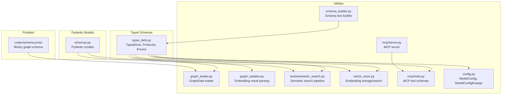

**Diagram sources**
- [types_defs.py](file://codebase_rag/types_defs.py#L142-L470)
- [schemas.py](file://codebase_rag/schemas.py#L8-L82)
- [schema.proto](file://codec/schema.proto#L81-L235)
- [graph_loader.py](file://codebase_rag/graph_loader.py#L15-L142)
- [graph_updater.py](file://codebase_rag/graph_updater.py#L451-L468)
- [semantic_search.py](file://codebase_rag/tools/semantic_search.py#L18-L78)
- [vector_store.py](file://codebase_rag/vector_store.py#L50-L80)
- [schema_builder.py](file://codebase_rag/schema_builder.py#L1-L41)
- [tools.py](file://codebase_rag/mcp/tools.py#L94-L444)
- [server.py](file://codebase_rag/mcp/server.py#L96-L127)
- [config.py](file://codebase_rag/config.py#L20-L37)

**Section sources**
- [types_defs.py](file://codebase_rag/types_defs.py#L142-L470)
- [schemas.py](file://codebase_rag/schemas.py#L8-L82)
- [schema.proto](file://codec/schema.proto#L81-L235)
- [graph_loader.py](file://codebase_rag/graph_loader.py#L15-L142)
- [graph_updater.py](file://codebase_rag/graph_updater.py#L451-L468)
- [semantic_search.py](file://codebase_rag/tools/semantic_search.py#L18-L78)
- [vector_store.py](file://codebase_rag/vector_store.py#L50-L80)
- [schema_builder.py](file://codebase_rag/schema_builder.py#L1-L41)
- [tools.py](file://codebase_rag/mcp/tools.py#L94-L444)
- [server.py](file://codebase_rag/mcp/server.py#L96-L127)
- [config.py](file://codebase_rag/config.py#L20-L37)

## Core Components
This section documents the primary data models and their roles.

- NodeData: Describes a graph node with identifiers, labels, and properties.
- RelationshipData: Describes a directed relationship with source/target ids, type, and properties.
- GraphData: Aggregates nodes and relationships plus metadata for export/import.
- GraphSummary: Summarizes counts, label distributions, and metadata.
- GraphMetadata: Captures totals and export timestamp.
- JavaClassInfo, JavaMethodInfo, JavaFieldInfo: Language-specific descriptors for Java constructs.
- SemanticSearchResult: Structured result for semantic search with scores.
- EmbeddingQueryResult: Lightweight result for embedding-driven queries.
- MCPInputSchema, MCPToolSchema: Define MCP tool input schemas and tool descriptors.
- ModelConfigKwargs: Configuration parameters passed to model update operations.
- Pydantic models: QueryGraphData, CodeSnippet, ShellCommandResult, EditResult, FileReadResult, FileCreationResult.

Validation rules and transformations:
- NodeData and RelationshipData enforce property typing via PropertyValue.
- GraphData supports mixed node/relationship formats (typed dicts vs. result rows).
- SemanticSearchResult enforces numeric score rounding and safe type extraction.
- EmbeddingQueryResult sanitizes optional fields to None when types mismatch.
- Pydantic models forbid extra fields and apply validators for robustness.

**Section sources**
- [types_defs.py](file://codebase_rag/types_defs.py#L158-L230)
- [types_defs.py](file://codebase_rag/types_defs.py#L152-L183)
- [types_defs.py](file://codebase_rag/types_defs.py#L185-L199)
- [types_defs.py](file://codebase_rag/types_defs.py#L346-L365)
- [types_defs.py](file://codebase_rag/types_defs.py#L142-L150)
- [schemas.py](file://codebase_rag/schemas.py#L8-L82)

## Architecture Overview
The system orchestrates ingestion, embedding, and retrieval to produce structured results.

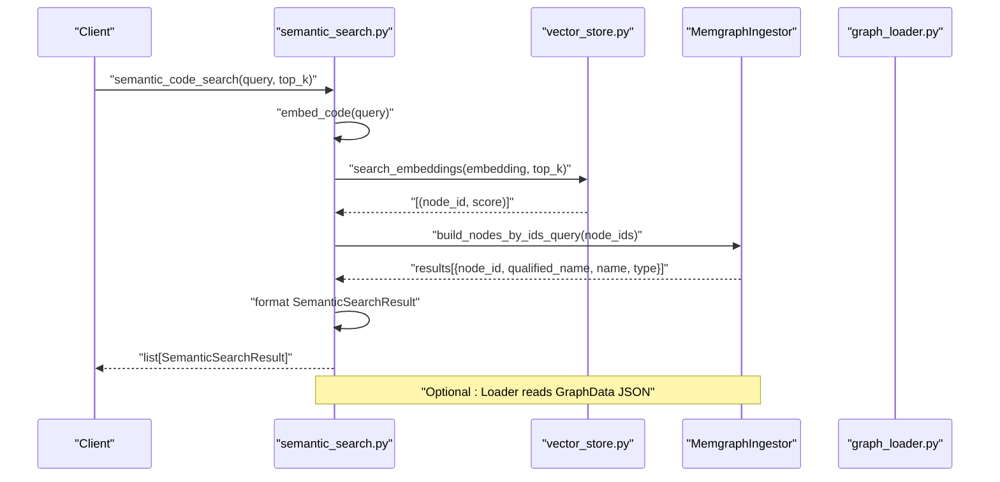

**Diagram sources**
- [semantic_search.py](file://codebase_rag/tools/semantic_search.py#L18-L78)
- [vector_store.py](file://codebase_rag/vector_store.py#L50-L80)
- [graph_loader.py](file://codebase_rag/graph_loader.py#L15-L142)

## Detailed Component Analysis

### Graph Data Models
GraphData and related structures unify nodes and relationships for export/import and runtime usage.

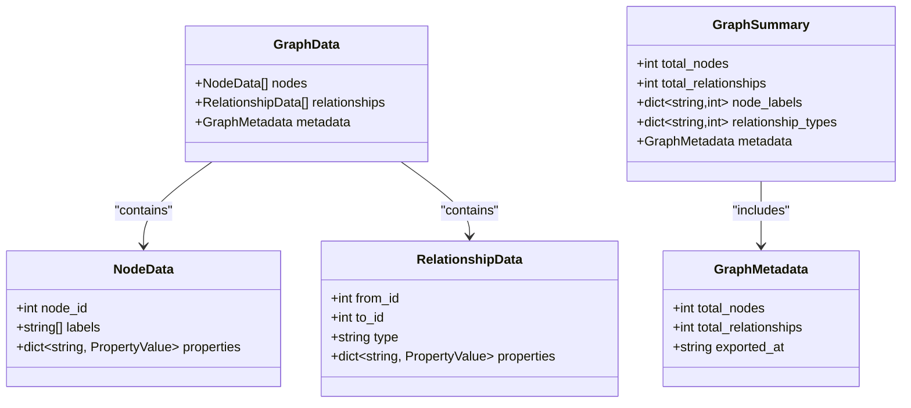

- GraphData supports heterogeneous node/relationship lists (typed dicts or result rows).
- GraphSummary aggregates counts and distributions from loaded data.

**Diagram sources**
- [types_defs.py](file://codebase_rag/types_defs.py#L158-L183)
- [graph_loader.py](file://codebase_rag/graph_loader.py#L136-L142)

**Section sources**
- [types_defs.py](file://codebase_rag/types_defs.py#L158-L183)
- [graph_loader.py](file://codebase_rag/graph_loader.py#L136-L142)

### Java Language-Specific Models
JavaClassInfo, JavaMethodInfo, and JavaFieldInfo describe Java constructs extracted from ASTs.

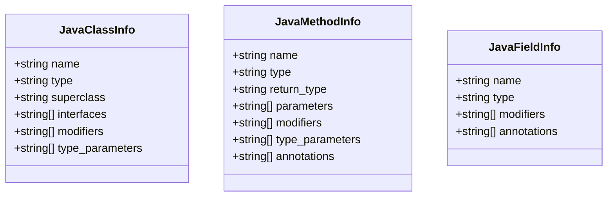

- These models are produced by language handlers and used to populate graph nodes for Java constructs.

**Diagram sources**
- [types_defs.py](file://codebase_rag/types_defs.py#L201-L230)

**Section sources**
- [types_defs.py](file://codebase_rag/types_defs.py#L201-L230)

### Semantic Search Results and Embedding Queries
SemanticSearchResult captures scored matches; EmbeddingQueryResult carries lightweight metadata for embedding-driven queries.

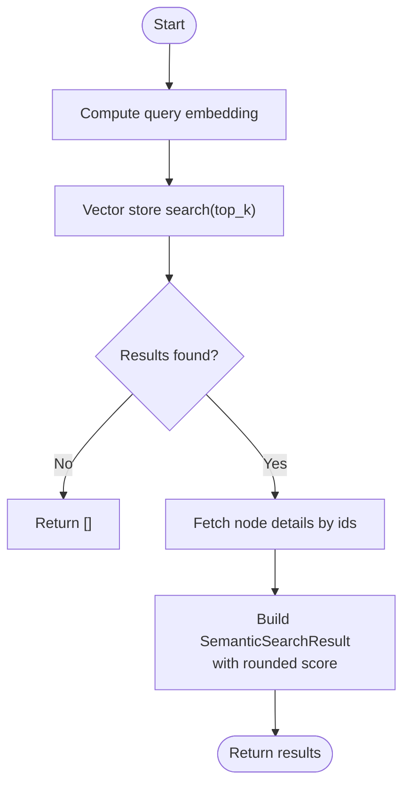

**Diagram sources**
- [semantic_search.py](file://codebase_rag/tools/semantic_search.py#L18-L78)
- [vector_store.py](file://codebase_rag/vector_store.py#L50-L80)

Additional embedding parsing:

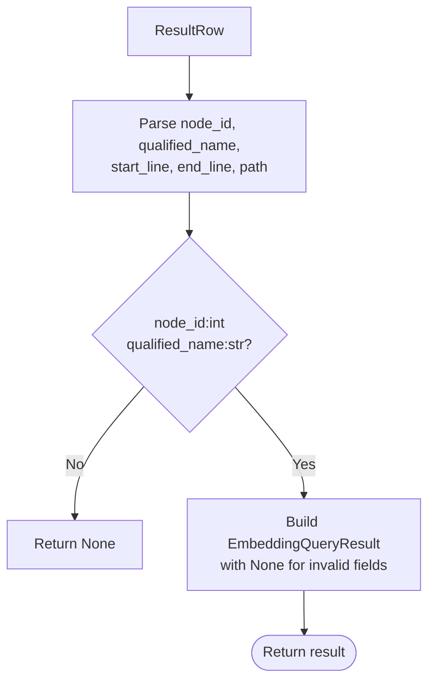

**Diagram sources**
- [graph_updater.py](file://codebase_rag/graph_updater.py#L451-L468)

**Section sources**
- [semantic_search.py](file://codebase_rag/tools/semantic_search.py#L18-L78)
- [vector_store.py](file://codebase_rag/vector_store.py#L50-L80)
- [graph_updater.py](file://codebase_rag/graph_updater.py#L451-L468)

### MCP Tool Schemas
MCP tools expose input schemas and handlers. The server lists tools and dispatches calls.

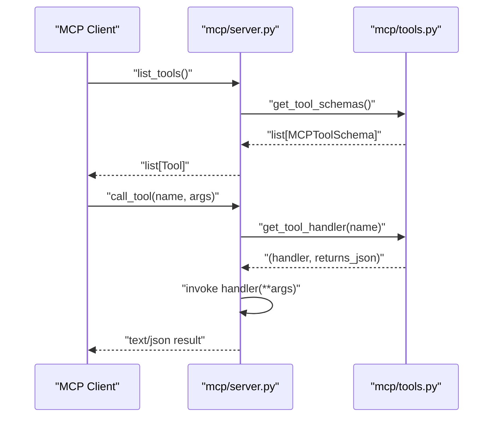

**Diagram sources**
- [server.py](file://codebase_rag/mcp/server.py#L96-L127)
- [tools.py](file://codebase_rag/mcp/tools.py#L433-L444)

MCP schema definitions:

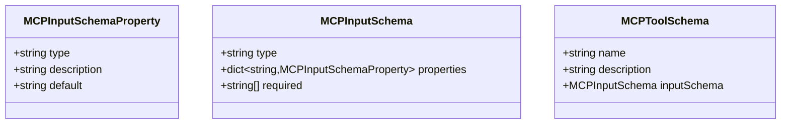

**Diagram sources**
- [types_defs.py](file://codebase_rag/types_defs.py#L346-L365)
- [tools.py](file://codebase_rag/mcp/tools.py#L94-L124)

**Section sources**
- [server.py](file://codebase_rag/mcp/server.py#L96-L127)
- [tools.py](file://codebase_rag/mcp/tools.py#L94-L124)
- [types_defs.py](file://codebase_rag/types_defs.py#L346-L365)

### Configuration Models
ModelConfig and ModelConfigKwargs encapsulate provider/model settings and kwargs for updates.

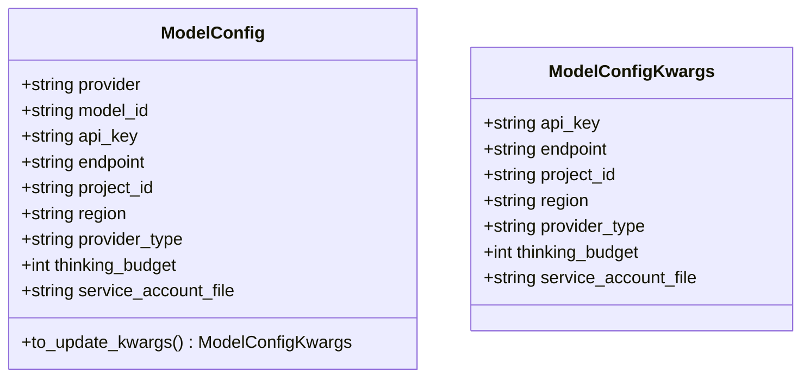

- ModelConfig.to_update_kwargs strips provider/model_id and forwards other fields as kwargs.

**Diagram sources**
- [config.py](file://codebase_rag/config.py#L20-L37)
- [types_defs.py](file://codebase_rag/types_defs.py#L142-L150)

**Section sources**
- [config.py](file://codebase_rag/config.py#L20-L37)
- [types_defs.py](file://codebase_rag/types_defs.py#L142-L150)

### Serialization Formats and Transformations
- JSON: GraphData is loaded/stored as JSON; GraphLoader parses nodes, relationships, and metadata.
- Protobuf: Binary serialization for graph exports with strongly-typed node payloads and relationship properties.

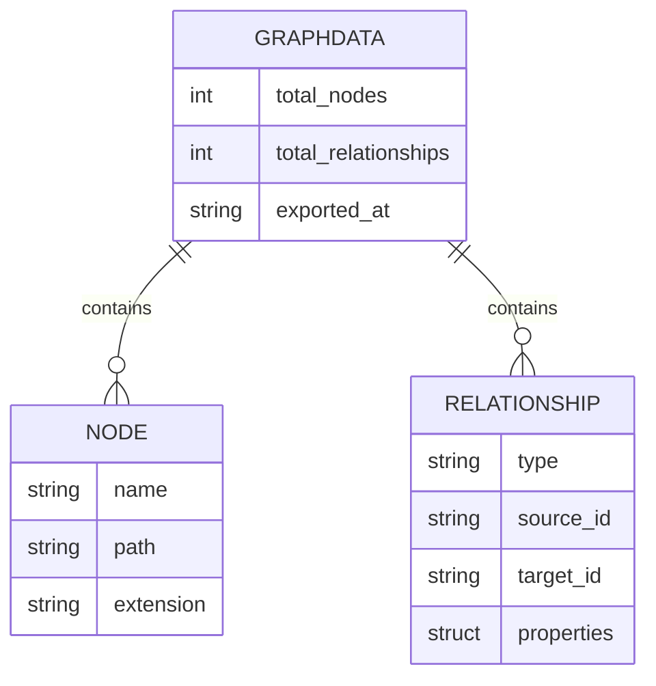

**Diagram sources**
- [schema.proto](file://codec/schema.proto#L81-L134)
- [graph_loader.py](file://codebase_rag/graph_loader.py#L15-L142)

**Section sources**
- [schema.proto](file://codec/schema.proto#L81-L134)
- [graph_loader.py](file://codebase_rag/graph_loader.py#L15-L142)

## Dependency Analysis
The following diagram shows key dependencies among data models and utilities.

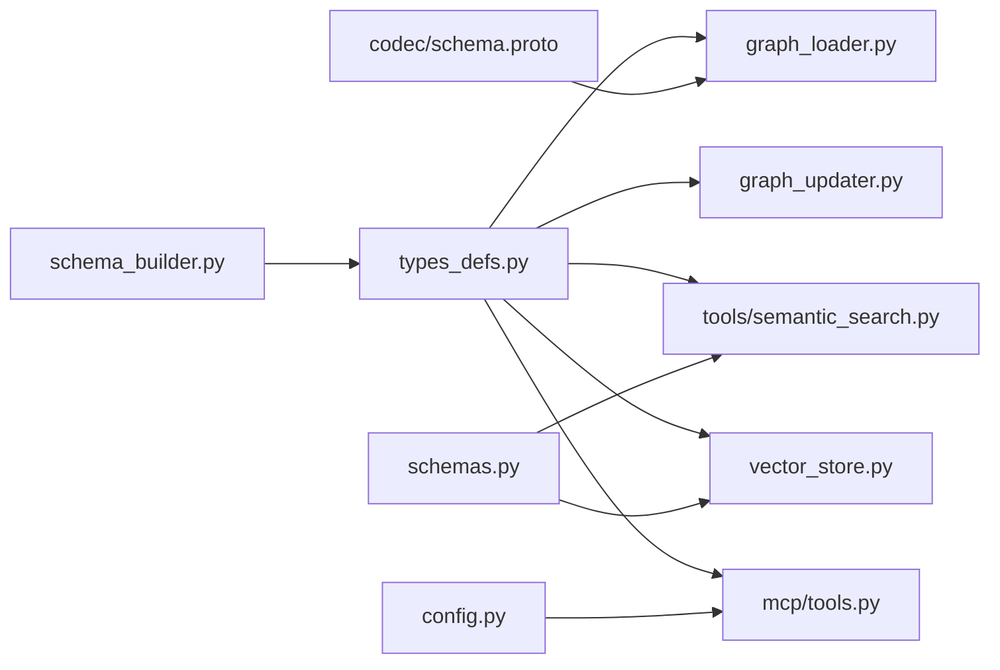

**Diagram sources**
- [types_defs.py](file://codebase_rag/types_defs.py#L142-L470)
- [schemas.py](file://codebase_rag/schemas.py#L8-L82)
- [schema.proto](file://codec/schema.proto#L81-L235)
- [graph_loader.py](file://codebase_rag/graph_loader.py#L15-L142)
- [graph_updater.py](file://codebase_rag/graph_updater.py#L451-L468)
- [semantic_search.py](file://codebase_rag/tools/semantic_search.py#L18-L78)
- [vector_store.py](file://codebase_rag/vector_store.py#L50-L80)
- [schema_builder.py](file://codebase_rag/schema_builder.py#L1-L41)
- [tools.py](file://codebase_rag/mcp/tools.py#L94-L444)
- [config.py](file://codebase_rag/config.py#L20-L37)

**Section sources**
- [types_defs.py](file://codebase_rag/types_defs.py#L142-L470)
- [schemas.py](file://codebase_rag/schemas.py#L8-L82)
- [schema.proto](file://codec/schema.proto#L81-L235)
- [graph_loader.py](file://codebase_rag/graph_loader.py#L15-L142)
- [graph_updater.py](file://codebase_rag/graph_updater.py#L451-L468)
- [semantic_search.py](file://codebase_rag/tools/semantic_search.py#L18-L78)
- [vector_store.py](file://codebase_rag/vector_store.py#L50-L80)
- [schema_builder.py](file://codebase_rag/schema_builder.py#L1-L41)
- [tools.py](file://codebase_rag/mcp/tools.py#L94-L444)
- [config.py](file://codebase_rag/config.py#L20-L37)

## Performance Considerations
- Vector search: Limit top_k to reduce downstream processing; ensure embeddings are indexed efficiently.
- Batch queries: Use batch sizes appropriate for the graph service to avoid timeouts.
- Property sanitization: Converting non-primitive values to strings reduces downstream serialization overhead.
- Lazy loading: GraphLoader defers parsing until accessed to minimize startup cost.

## Troubleshooting Guide
Common validation and transformation pitfalls:
- Node/relationship property types: Ensure PropertyValue compatibility; non-primitive values are coerced to strings.
- Optional fields: EmbeddingQueryResult sets invalid fields to None; verify downstream consumers handle None gracefully.
- Extra fields: Pydantic models forbid extra fields; remove unknown keys to prevent validation errors.
- MCP tool schemas: Ensure required fields are present and typed correctly; server returns errors for unknown tools.

**Section sources**
- [schemas.py](file://codebase_rag/schemas.py#L13-L34)
- [schemas.py](file://codebase_rag/schemas.py#L59-L63)
- [graph_updater.py](file://codebase_rag/graph_updater.py#L451-L468)
- [server.py](file://codebase_rag/mcp/server.py#L112-L118)

## Conclusion
Graph-Code’s data model layer combines typed dictionaries, Pydantic models, and Protobuf serialization to support robust graph ingestion, semantic search, and MCP tooling. Consistent validation and transformation patterns ensure reliable interoperability across components.

## Appendices

### Schema Builder Reference
The schema builder generates human-readable graph schema text from predefined node and relationship schemas.

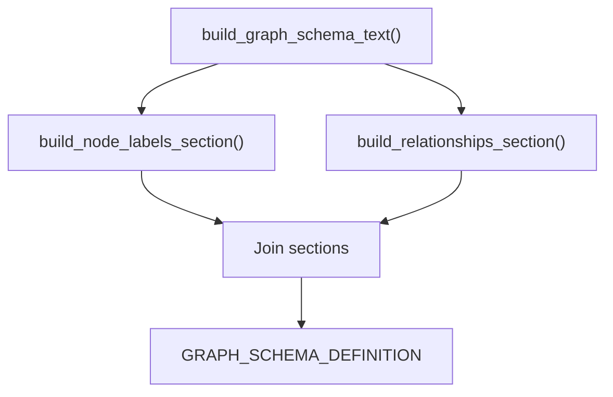

**Diagram sources**
- [schema_builder.py](file://codebase_rag/schema_builder.py#L35-L41)

**Section sources**
- [schema_builder.py](file://codebase_rag/schema_builder.py#L35-L41)
- [constants.py](file://codebase_rag/constants.py#L434-L554)