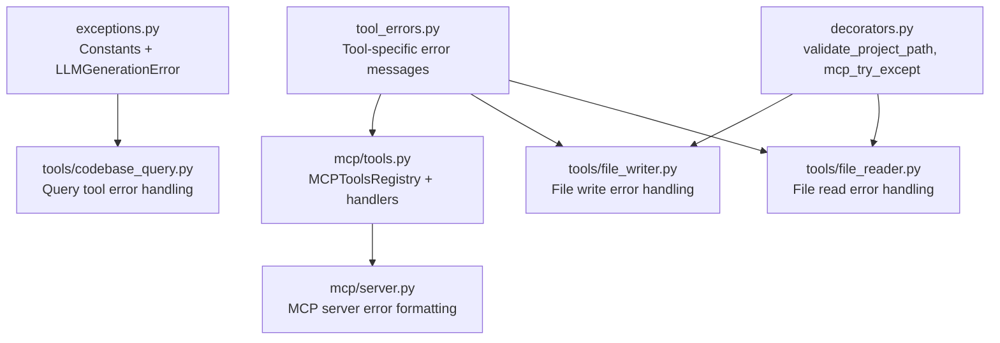
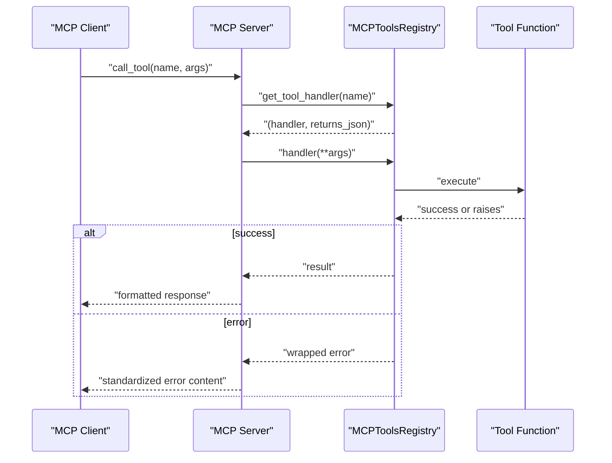
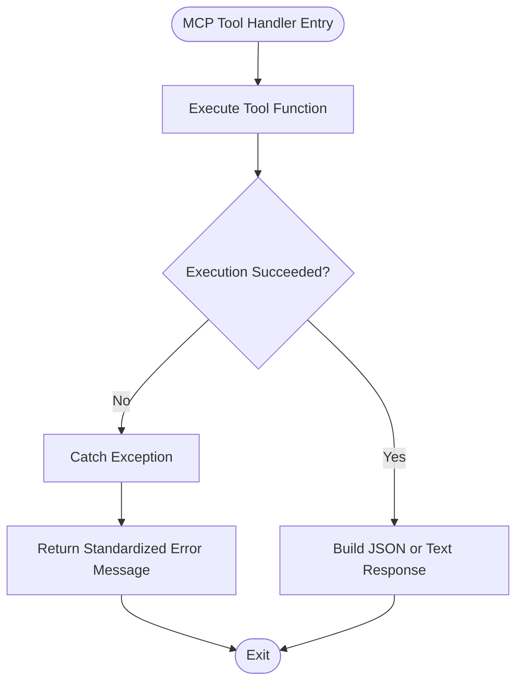
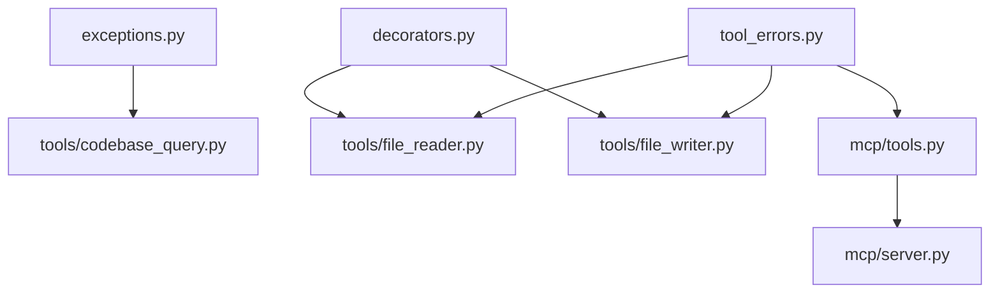

# Exception Handling and Error Types

<cite>
**Referenced Files in This Document**
- [exceptions.py](file://codebase_rag/exceptions.py)
- [tool_errors.py](file://codebase_rag/tool_errors.py)
- [mcp/tools.py](file://codebase_rag/mcp/tools.py)
- [mcp/server.py](file://codebase_rag/mcp/server.py)
- [tools/codebase_query.py](file://codebase_rag/tools/codebase_query.py)
- [tools/file_reader.py](file://codebase_rag/tools/file_reader.py)
- [tools/file_writer.py](file://codebase_rag/tools/file_writer.py)
- [decorators.py](file://codebase_rag/decorators.py)
- [providers/base.py](file://codebase_rag/providers/base.py)
- [services/graph_service.py](file://codebase_rag/services/graph_service.py)
- [graph_loader.py](file://codebase_rag/graph_loader.py)
- [parser_loader.py](file://codebase_rag/parser_loader.py)
- [config.py](file://codebase_rag/config.py)
- [main.py](file://codebase_rag/main.py)
</cite>

## Table of Contents
1. [Introduction](#introduction)
2. [Project Structure](#project-structure)
3. [Core Components](#core-components)
4. [Architecture Overview](#architecture-overview)
5. [Detailed Component Analysis](#detailed-component-analysis)
6. [Dependency Analysis](#dependency-analysis)
7. [Performance Considerations](#performance-considerations)
8. [Troubleshooting Guide](#troubleshooting-guide)
9. [Conclusion](#conclusion)

## Introduction
This document explains Graph-Code’s exception hierarchy and error handling patterns. It catalogs custom exception classes, categorizes error types, and details how errors propagate across parsing, querying, file operations, and MCP tool execution. It also documents error response formats used in API and MCP communications, and provides best practices for error handling in custom tools and integrations.

## Project Structure
The error handling system spans several modules:
- Centralized error constants and exception classes
- Tool-specific error messages and wrappers
- MCP tool registry and server error handling
- Tool implementations for file operations and querying
- Decorators for cross-cutting concerns like path validation and MCP error wrapping
- Provider and service modules raising domain-specific errors

**Diagram sources**
- [exceptions.py](file://codebase_rag/exceptions.py#L58-L60)
- [tool_errors.py](file://codebase_rag/tool_errors.py#L1-L72)
- [decorators.py](file://codebase_rag/decorators.py#L55-L87)
- [mcp/tools.py](file://codebase_rag/mcp/tools.py#L40-L458)
- [mcp/server.py](file://codebase_rag/mcp/server.py#L87-L127)
- [tools/codebase_query.py](file://codebase_rag/tools/codebase_query.py#L76-L88)
- [tools/file_reader.py](file://codebase_rag/tools/file_reader.py#L21-L52)
- [tools/file_writer.py](file://codebase_rag/tools/file_writer.py#L21-L39)

**Section sources**
- [exceptions.py](file://codebase_rag/exceptions.py#L1-L60)
- [tool_errors.py](file://codebase_rag/tool_errors.py#L1-L72)
- [decorators.py](file://codebase_rag/decorators.py#L1-L161)
- [mcp/tools.py](file://codebase_rag/mcp/tools.py#L40-L458)
- [mcp/server.py](file://codebase_rag/mcp/server.py#L87-L127)
- [tools/codebase_query.py](file://codebase_rag/tools/codebase_query.py#L1-L95)
- [tools/file_reader.py](file://codebase_rag/tools/file_reader.py#L1-L67)
- [tools/file_writer.py](file://codebase_rag/tools/file_writer.py#L1-L52)

## Core Components
- Centralized constants and exception classes:
  - Constants for provider configuration, dependency, configuration, graph loading, parser, LLM, graph service, and access control errors.
  - A single custom exception class for LLM generation failures.
- Tool-specific error messages and wrappers:
  - Dedicated error templates for file operations, document analyzer, directories, shell commands, code retrieval, file writer, export, MCP tools, and CLI validation.
- MCP tool registry and server:
  - Registry handlers wrap tool execution in try/except blocks and return structured results or formatted error messages.
  - Server composes standardized error content for MCP clients.

Key implementation references:
- Centralized constants and exception class: [exceptions.py](file://codebase_rag/exceptions.py#L1-L60)
- Tool-specific error constants: [tool_errors.py](file://codebase_rag/tool_errors.py#L1-L72)
- MCP tool registry error handling: [mcp/tools.py](file://codebase_rag/mcp/tools.py#L251-L431)
- MCP server error formatting: [mcp/server.py](file://codebase_rag/mcp/server.py#L87-L127)

**Section sources**
- [exceptions.py](file://codebase_rag/exceptions.py#L1-L60)
- [tool_errors.py](file://codebase_rag/tool_errors.py#L1-L72)
- [mcp/tools.py](file://codebase_rag/mcp/tools.py#L251-L431)
- [mcp/server.py](file://codebase_rag/mcp/server.py#L87-L127)

## Architecture Overview
The system follows a layered error handling strategy:
- Domain-specific errors are raised early with descriptive messages.
- Tool implementations catch and translate errors into structured results or standardized error messages.
- MCP handlers and server apply consistent formatting for client consumption.
- Decorators enforce preconditions and centralize path validation and MCP error wrapping.

**Diagram sources**
- [mcp/server.py](file://codebase_rag/mcp/server.py#L108-L127)
- [mcp/tools.py](file://codebase_rag/mcp/tools.py#L443-L445)

**Section sources**
- [mcp/server.py](file://codebase_rag/mcp/server.py#L87-L127)
- [mcp/tools.py](file://codebase_rag/mcp/tools.py#L443-L445)

## Detailed Component Analysis

### Exception Hierarchy and Categories
- Provider configuration errors: Missing keys, invalid endpoints, unknown providers.
- Dependency errors: Missing extras for optional features.
- Configuration errors: Empty provider/model identifiers, invalid model format, batch size constraints.
- Graph loading errors: Missing files, incomplete data loading.
- Parser errors: No Tree-sitter languages available.
- LLM errors: Generation failures, invalid outputs, orchestrator initialization issues.
- Graph service errors: Batch size constraints, connectivity issues.
- Access control errors: Outside-project-root access denials.

Representative references:
- Provider configuration constants: [exceptions.py](file://codebase_rag/exceptions.py#L2-L18)
- Dependency constant: [exceptions.py](file://codebase_rag/exceptions.py#L21-L21)
- Configuration constants: [exceptions.py](file://codebase_rag/exceptions.py#L24-L30)
- Graph loading constants: [exceptions.py](file://codebase_rag/exceptions.py#L33-L37)
- Parser constant: [exceptions.py](file://codebase_rag/exceptions.py#L40-L40)
- LLM constants: [exceptions.py](file://codebase_rag/exceptions.py#L43-L46)
- Graph service constants: [exceptions.py](file://codebase_rag/exceptions.py#L49-L50)
- Access control constants: [exceptions.py](file://codebase_rag/exceptions.py#L53-L54)
- Custom exception class: [exceptions.py](file://codebase_rag/exceptions.py#L58-L60)

**Section sources**
- [exceptions.py](file://codebase_rag/exceptions.py#L1-L60)

### Tool-Specific Error Types and Integration
- File operation errors: Not found, binary file detection, Unicode decode failures.
- Document analyzer errors: Unsupported provider, file path issues, API validation and runtime errors.
- Directory errors: Invalid/directory path, empty directory, listing failures.
- Shell command errors: Allowlist violations, timeouts, dangerous patterns.
- Code retrieval errors: Entity not found, missing location data.
- File writer errors: Security risks and creation failures.
- Export errors: General export failures.
- MCP tool errors: None returns, invalid responses, repository path issues, project not found.
- CLI validation errors: Positive integer validation.

Representative references:
- File operation constants: [tool_errors.py](file://codebase_rag/tool_errors.py#L7-L13)
- Document analyzer constants: [tool_errors.py](file://codebase_rag/tool_errors.py#L16-L31)
- Directory constants: [tool_errors.py](file://codebase_rag/tool_errors.py#L34-L36)
- Shell command constants: [tool_errors.py](file://codebase_rag/tool_errors.py#L39-L46)
- Code retrieval constants: [tool_errors.py](file://codebase_rag/tool_errors.py#L49-L50)
- File writer constants: [tool_errors.py](file://codebase_rag/tool_errors.py#L53-L56)
- Export constant: [tool_errors.py](file://codebase_rag/tool_errors.py#L59-L59)
- MCP tool constants: [tool_errors.py](file://codebase_rag/tool_errors.py#L62-L68)
- CLI validation constant: [tool_errors.py](file://codebase_rag/tool_errors.py#L71-L71)

**Section sources**
- [tool_errors.py](file://codebase_rag/tool_errors.py#L1-L72)

### MCP Tool Execution Error Handling
- Registry handlers wrap tool execution in try/except and return either success payloads or error results.
- Specific patterns:
  - Query tool returns structured QueryGraphData with summaries for translation and database errors.
  - Code snippet tool checks for None returns and invalid responses.
  - File read/write/list directory tools return standardized error wrappers on failure.
  - Path validation enforced via decorator to prevent out-of-root access.

Representative references:
- Query tool error handling: [tools/codebase_query.py](file://codebase_rag/tools/codebase_query.py#L76-L88)
- Code snippet tool error handling: [mcp/tools.py](file://codebase_rag/mcp/tools.py#L336-L354)
- File read error handling: [tools/file_reader.py](file://codebase_rag/tools/file_reader.py#L21-L52)
- File write error handling: [tools/file_writer.py](file://codebase_rag/tools/file_writer.py#L21-L39)
- Directory listing error handling: [mcp/tools.py](file://codebase_rag/mcp/tools.py#L422-L431)
- Path validation decorator: [decorators.py](file://codebase_rag/decorators.py#L55-L87)
- MCP server error formatting: [mcp/server.py](file://codebase_rag/mcp/server.py#L87-L94)

**Diagram sources**
- [mcp/tools.py](file://codebase_rag/mcp/tools.py#L314-L354)
- [mcp/server.py](file://codebase_rag/mcp/server.py#L87-L127)

**Section sources**
- [mcp/tools.py](file://codebase_rag/mcp/tools.py#L251-L431)
- [mcp/server.py](file://codebase_rag/mcp/server.py#L87-L127)
- [tools/codebase_query.py](file://codebase_rag/tools/codebase_query.py#L76-L88)
- [tools/file_reader.py](file://codebase_rag/tools/file_reader.py#L21-L52)
- [tools/file_writer.py](file://codebase_rag/tools/file_writer.py#L21-L39)
- [decorators.py](file://codebase_rag/decorators.py#L55-L87)

### Error Propagation Patterns
- Early validation and raising:
  - Configuration and provider validation raise descriptive errors early.
  - Graph loader raises file-not-found and load-failed errors.
  - Parser loader raises a runtime error when no languages are available.
- Tool-level handling:
  - Tools catch domain exceptions and return structured results with summaries or error messages.
  - MCP handlers convert exceptions into standardized responses.
- Decorator-driven safeguards:
  - Path validation prevents out-of-root access and returns error results.
  - MCP try-except decorator converts exceptions into error messages.

Representative references:
- Provider validation raises: [providers/base.py](file://codebase_rag/providers/base.py#L64-L66)
- OpenAI/Ollama validation raises: [providers/base.py](file://codebase_rag/providers/base.py#L116-L116), [providers/base.py](file://codebase_rag/providers/base.py#L146-L146)
- Unknown provider error: [providers/base.py](file://codebase_rag/providers/base.py#L170-L170)
- Batch size and connection errors: [services/graph_service.py](file://codebase_rag/services/graph_service.py#L53-L53), [services/graph_service.py](file://codebase_rag/services/graph_service.py#L86-L86)
- Graph file not found: [graph_loader.py](file://codebase_rag/graph_loader.py#L37-L37)
- Failed to load data: [graph_loader.py](file://codebase_rag/graph_loader.py#L44-L44)
- No languages available: [parser_loader.py](file://codebase_rag/parser_loader.py#L288-L288)
- Configuration validations: [config.py](file://codebase_rag/config.py#L223-L229), [config.py](file://codebase_rag/config.py#L271-L271)
- Main entry validations: [main.py](file://codebase_rag/main.py#L540-L547), [main.py](file://codebase_rag/main.py#L954-L954)

**Section sources**
- [providers/base.py](file://codebase_rag/providers/base.py#L64-L66)
- [providers/base.py](file://codebase_rag/providers/base.py#L116-L116)
- [providers/base.py](file://codebase_rag/providers/base.py#L146-L146)
- [providers/base.py](file://codebase_rag/providers/base.py#L170-L170)
- [services/graph_service.py](file://codebase_rag/services/graph_service.py#L53-L53)
- [services/graph_service.py](file://codebase_rag/services/graph_service.py#L86-L86)
- [graph_loader.py](file://codebase_rag/graph_loader.py#L37-L37)
- [graph_loader.py](file://codebase_rag/graph_loader.py#L44-L44)
- [parser_loader.py](file://codebase_rag/parser_loader.py#L288-L288)
- [config.py](file://codebase_rag/config.py#L223-L229)
- [config.py](file://codebase_rag/config.py#L271-L271)
- [main.py](file://codebase_rag/main.py#L540-L547)
- [main.py](file://codebase_rag/main.py#L954-L954)

### Error Response Formats in API and MCP
- MCP server composes standardized error content using a generic error wrapper template.
- MCP tool handlers return either JSON payloads or text responses, with error fields populated on failure.
- Tool wrappers convert result objects with embedded error messages into a consistent error wrapper string.

Representative references:
- Generic error wrapper: [tool_errors.py](file://codebase_rag/tool_errors.py#L4-L4)
- Server error content composition: [mcp/server.py](file://codebase_rag/mcp/server.py#L87-L94)
- Query tool error result: [tools/codebase_query.py](file://codebase_rag/tools/codebase_query.py#L76-L88)
- Code snippet invalid response handling: [mcp/tools.py](file://codebase_rag/mcp/tools.py#L336-L354)
- File read error wrapper: [tools/file_reader.py](file://codebase_rag/tools/file_reader.py#L55-L66)
- File write error wrapper: [mcp/tools.py](file://codebase_rag/mcp/tools.py#L409-L420)

**Section sources**
- [tool_errors.py](file://codebase_rag/tool_errors.py#L1-L72)
- [mcp/server.py](file://codebase_rag/mcp/server.py#L87-L127)
- [tools/codebase_query.py](file://codebase_rag/tools/codebase_query.py#L76-L88)
- [mcp/tools.py](file://codebase_rag/mcp/tools.py#L336-L354)
- [tools/file_reader.py](file://codebase_rag/tools/file_reader.py#L55-L66)
- [mcp/tools.py](file://codebase_rag/mcp/tools.py#L409-L420)

### Best Practices for Custom Tool Development and Integration
- Validate inputs early and raise descriptive errors close to the source.
- Use structured result objects with explicit error fields for tools returning data.
- Wrap tool execution in try/except and convert exceptions to standardized error messages.
- Enforce path safety using the provided path validation decorator to avoid out-of-root access.
- Prefer returning JSON results for tools intended for MCP clients; otherwise, return formatted text.
- Log errors with sufficient context while preserving user-friendly messages.

Representative references:
- Path validation decorator: [decorators.py](file://codebase_rag/decorators.py#L55-L87)
- MCP try-except decorator: [decorators.py](file://codebase_rag/decorators.py#L145-L161)
- Query tool error handling pattern: [tools/codebase_query.py](file://codebase_rag/tools/codebase_query.py#L76-L88)
- MCP tool handler patterns: [mcp/tools.py](file://codebase_rag/mcp/tools.py#L251-L431)

**Section sources**
- [decorators.py](file://codebase_rag/decorators.py#L55-L87)
- [decorators.py](file://codebase_rag/decorators.py#L145-L161)
- [tools/codebase_query.py](file://codebase_rag/tools/codebase_query.py#L76-L88)
- [mcp/tools.py](file://codebase_rag/mcp/tools.py#L251-L431)

### Error Recovery Strategies and Graceful Degradation
- Graceful degradation:
  - Prefer fallbacks when primary operations fail; return a degraded flag indicating fallback usage.
- Circuit breaker patterns:
  - Track recent failures and temporarily disable risky operations.
- Rate limiting:
  - Enforce per-window request counts to prevent overload.
- Logging and monitoring:
  - Log errors with context and maintain error aggregators for diagnostics.

Representative references:
- Lua error recovery patterns and graceful degradation: [Lua tests](file://codebase_rag/tests/test_lua_error_handling.py#L756-L1066)
- JavaScript async error collection and graceful degradation: [JavaScript tests](file://codebase_rag/tests/test_javascript_error_handling.py#L1005-L1286)

**Section sources**
- [test_lua_error_handling.py](file://codebase_rag/tests/test_lua_error_handling.py#L756-L1066)
- [test_javascript_error_handling.py](file://codebase_rag/tests/test_javascript_error_handling.py#L1005-L1286)

### Common Error Scenarios and Handling Approaches
- Provider configuration missing:
  - Raise provider-specific validation errors early with actionable messages.
  - Representative references: [providers/base.py](file://codebase_rag/providers/base.py#L64-L66), [providers/base.py](file://codebase_rag/providers/base.py#L116-L116), [providers/base.py](file://codebase_rag/providers/base.py#L146-L146), [providers/base.py](file://codebase_rag/providers/base.py#L170-L170)
- Graph file not found or load failure:
  - Raise file-not-found and load-failed errors to halt indexing gracefully.
  - Representative references: [graph_loader.py](file://codebase_rag/graph_loader.py#L37-L37), [graph_loader.py](file://codebase_rag/graph_loader.py#L44-L44)
- Parser unavailable:
  - Raise runtime error when no Tree-sitter languages are available.
  - Representative reference: [parser_loader.py](file://codebase_rag/parser_loader.py#L288-L288)
- Query translation failure:
  - Return structured result with translation failure summary.
  - Representative reference: [tools/codebase_query.py](file://codebase_rag/tools/codebase_query.py#L76-L81)
- Database connectivity or batch size issues:
  - Raise connection and batch-size errors for immediate feedback.
  - Representative references: [services/graph_service.py](file://codebase_rag/services/graph_service.py#L53-L53), [services/graph_service.py](file://codebase_rag/services/graph_service.py#L86-L86)
- File read/write security or decoding errors:
  - Use path validation decorator and return error results with user-friendly messages.
  - Representative references: [decorators.py](file://codebase_rag/decorators.py#L55-L87), [tools/file_reader.py](file://codebase_rag/tools/file_reader.py#L21-L52), [tools/file_writer.py](file://codebase_rag/tools/file_writer.py#L21-L39)
- MCP tool invalid responses:
  - Detect None returns and invalid responses; return standardized error messages.
  - Representative reference: [mcp/tools.py](file://codebase_rag/mcp/tools.py#L336-L354)

**Section sources**
- [providers/base.py](file://codebase_rag/providers/base.py#L64-L66)
- [providers/base.py](file://codebase_rag/providers/base.py#L116-L116)
- [providers/base.py](file://codebase_rag/providers/base.py#L146-L146)
- [providers/base.py](file://codebase_rag/providers/base.py#L170-L170)
- [graph_loader.py](file://codebase_rag/graph_loader.py#L37-L37)
- [graph_loader.py](file://codebase_rag/graph_loader.py#L44-L44)
- [parser_loader.py](file://codebase_rag/parser_loader.py#L288-L288)
- [tools/codebase_query.py](file://codebase_rag/tools/codebase_query.py#L76-L81)
- [services/graph_service.py](file://codebase_rag/services/graph_service.py#L53-L53)
- [services/graph_service.py](file://codebase_rag/services/graph_service.py#L86-L86)
- [decorators.py](file://codebase_rag/decorators.py#L55-L87)
- [tools/file_reader.py](file://codebase_rag/tools/file_reader.py#L21-L52)
- [tools/file_writer.py](file://codebase_rag/tools/file_writer.py#L21-L39)
- [mcp/tools.py](file://codebase_rag/mcp/tools.py#L336-L354)

## Dependency Analysis
The error handling system exhibits low coupling and high cohesion:
- Centralized constants minimize duplication and ensure consistent messaging.
- Decorators encapsulate cross-cutting concerns (validation, timing, MCP error wrapping).
- Tool implementations depend on shared error constants and decorators.
- MCP server depends on tool error wrappers for consistent responses.

**Diagram sources**
- [exceptions.py](file://codebase_rag/exceptions.py#L1-L60)
- [tool_errors.py](file://codebase_rag/tool_errors.py#L1-L72)
- [decorators.py](file://codebase_rag/decorators.py#L55-L87)
- [tools/codebase_query.py](file://codebase_rag/tools/codebase_query.py#L1-L95)
- [tools/file_reader.py](file://codebase_rag/tools/file_reader.py#L1-L67)
- [tools/file_writer.py](file://codebase_rag/tools/file_writer.py#L1-L52)
- [mcp/tools.py](file://codebase_rag/mcp/tools.py#L40-L458)
- [mcp/server.py](file://codebase_rag/mcp/server.py#L87-L127)

**Section sources**
- [exceptions.py](file://codebase_rag/exceptions.py#L1-L60)
- [tool_errors.py](file://codebase_rag/tool_errors.py#L1-L72)
- [decorators.py](file://codebase_rag/decorators.py#L55-L87)
- [tools/codebase_query.py](file://codebase_rag/tools/codebase_query.py#L1-L95)
- [tools/file_reader.py](file://codebase_rag/tools/file_reader.py#L1-L67)
- [tools/file_writer.py](file://codebase_rag/tools/file_writer.py#L1-L52)
- [mcp/tools.py](file://codebase_rag/mcp/tools.py#L40-L458)
- [mcp/server.py](file://codebase_rag/mcp/server.py#L87-L127)

## Performance Considerations
- Prefer early validation to avoid expensive downstream operations.
- Use structured results to minimize string parsing overhead in tool responses.
- Apply timing decorators to identify slow operations without sacrificing readability.
- Avoid excessive logging in hot paths; rely on contextual logs around errors.

[No sources needed since this section provides general guidance]

## Troubleshooting Guide
- Provider configuration issues:
  - Verify API keys and project IDs; ensure endpoint availability.
  - References: [providers/base.py](file://codebase_rag/providers/base.py#L64-L66), [providers/base.py](file://codebase_rag/providers/base.py#L116-L116), [providers/base.py](file://codebase_rag/providers/base.py#L146-L146), [providers/base.py](file://codebase_rag/providers/base.py#L170-L170)
- Graph loading problems:
  - Confirm file existence and data completeness.
  - References: [graph_loader.py](file://codebase_rag/graph_loader.py#L37-L37), [graph_loader.py](file://codebase_rag/graph_loader.py#L44-L44)
- Parser not available:
  - Install required Tree-sitter grammars.
  - Reference: [parser_loader.py](file://codebase_rag/parser_loader.py#L288-L288)
- Query tool failures:
  - Inspect translation and database summaries for actionable insights.
  - Reference: [tools/codebase_query.py](file://codebase_rag/tools/codebase_query.py#L76-L88)
- MCP tool errors:
  - Check for invalid responses and repository path issues.
  - References: [mcp/tools.py](file://codebase_rag/mcp/tools.py#L336-L354), [mcp/tools.py](file://codebase_rag/mcp/tools.py#L260-L279)

**Section sources**
- [providers/base.py](file://codebase_rag/providers/base.py#L64-L66)
- [providers/base.py](file://codebase_rag/providers/base.py#L116-L116)
- [providers/base.py](file://codebase_rag/providers/base.py#L146-L146)
- [providers/base.py](file://codebase_rag/providers/base.py#L170-L170)
- [graph_loader.py](file://codebase_rag/graph_loader.py#L37-L37)
- [graph_loader.py](file://codebase_rag/graph_loader.py#L44-L44)
- [parser_loader.py](file://codebase_rag/parser_loader.py#L288-L288)
- [tools/codebase_query.py](file://codebase_rag/tools/codebase_query.py#L76-L88)
- [mcp/tools.py](file://codebase_rag/mcp/tools.py#L336-L354)
- [mcp/tools.py](file://codebase_rag/mcp/tools.py#L260-L279)

## Conclusion
Graph-Code’s error handling system emphasizes early validation, centralized messaging, and consistent response formats. By leveraging shared constants, decorators, and MCP-aware error wrappers, the system ensures predictable behavior across parsing, querying, file operations, and tool execution. Adopting the documented patterns enables robust, maintainable error handling in custom tools and integrations.