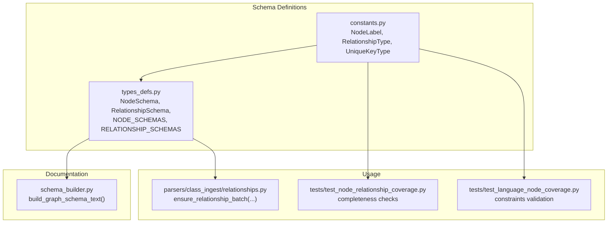
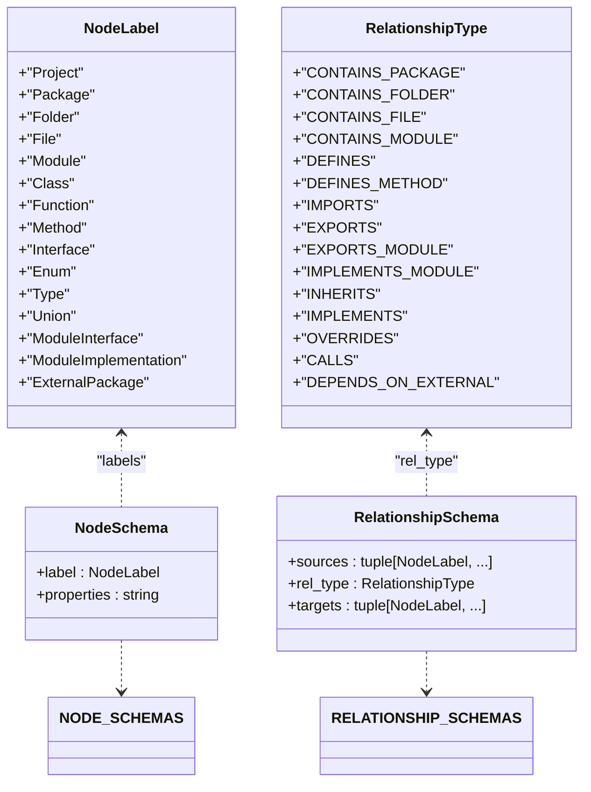
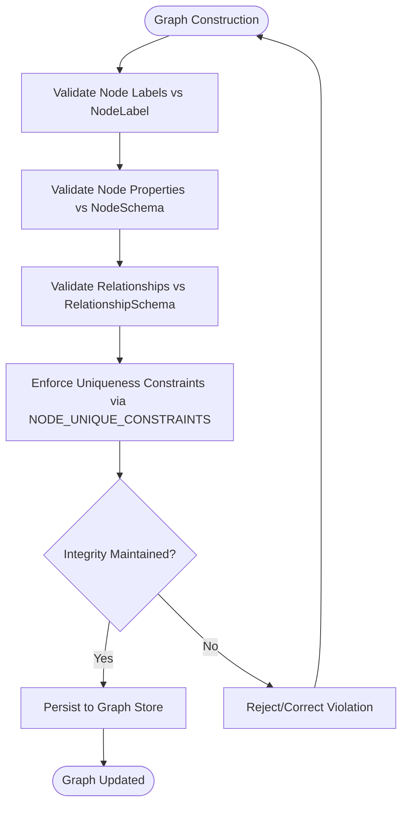
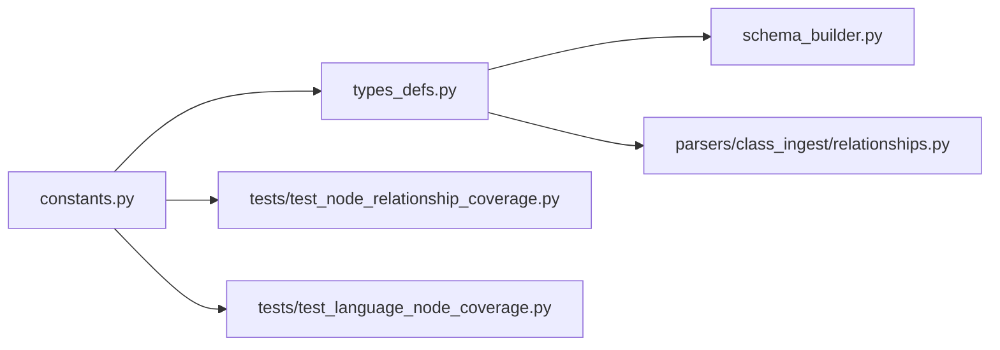

# Graph Schema Definitions

<cite>
**Referenced Files in This Document**
- [constants.py](file://codebase_rag/constants.py)
- [types_defs.py](file://codebase_rag/types_defs.py)
- [schema_builder.py](file://codebase_rag/schema_builder.py)
- [schemas.py](file://codebase_rag/schemas.py)
- [relationships.py](file://codebase_rag/parsers/class_ingest/relationships.py)
- [test_node_relationship_coverage.py](file://codebase_rag/tests/test_node_relationship_coverage.py)
- [test_language_node_coverage.py](file://codebase_rag/tests/test_language_node_coverage.py)
</cite>

## Table of Contents
1. [Introduction](#introduction)
2. [Project Structure](#project-structure)
3. [Core Components](#core-components)
4. [Architecture Overview](#architecture-overview)
5. [Detailed Component Analysis](#detailed-component-analysis)
6. [Dependency Analysis](#dependency-analysis)
7. [Performance Considerations](#performance-considerations)
8. [Troubleshooting Guide](#troubleshooting-guide)
9. [Conclusion](#conclusion)

## Introduction
This document describes Graph-Code’s graph schema definitions and validation rules. It explains the node and relationship schemas, the node identifier system, relationship type semantics, and how schema definitions support graph integrity. It also covers schema usage in graph construction and validation, along with evolution and backward compatibility considerations.

## Project Structure
The schema system is defined centrally and consumed across parsing and ingestion modules:
- Node and relationship enumerations define allowed graph types and edges.
- Typed schema definitions enumerate node labels and their properties, and enumerate valid source-target relationships with relationship types.
- A builder generates human-readable schema documentation from the typed definitions.
- Tests validate completeness and correctness of schema coverage and constraints.

**Diagram sources**
- [constants.py](file://codebase_rag/constants.py#L317-L377)
- [types_defs.py](file://codebase_rag/types_defs.py#L424-L471)
- [schema_builder.py](file://codebase_rag/schema_builder.py#L35-L41)
- [relationships.py](file://codebase_rag/parsers/class_ingest/relationships.py#L77-L94)
- [test_node_relationship_coverage.py](file://codebase_rag/tests/test_node_relationship_coverage.py#L173-L202)
- [test_language_node_coverage.py](file://codebase_rag/tests/test_language_node_coverage.py#L150-L172)

**Section sources**
- [constants.py](file://codebase_rag/constants.py#L317-L377)
- [types_defs.py](file://codebase_rag/types_defs.py#L424-L471)
- [schema_builder.py](file://codebase_rag/schema_builder.py#L35-L41)

## Core Components
- NodeLabel: Enumerates all valid node labels in the graph (e.g., Project, Package, Folder, File, Module, Class, Function, Method, Interface, Enum, Type, Union, ModuleInterface, ModuleImplementation, ExternalPackage).
- RelationshipType: Enumerates all valid relationship types (e.g., CONTAINS_PACKAGE, CONTAINS_FOLDER, CONTAINS_FILE, CONTAINS_MODULE, DEFINES, DEFINES_METHOD, IMPORTS, EXPORTS, EXPORTS_MODULE, IMPLEMENTS_MODULE, INHERITS, IMPLEMENTS, OVERRIDES, CALLS, DEPENDS_ON_EXTERNAL).
- UniqueKeyType: Defines uniqueness constraints per node label (e.g., NAME, PATH, QUALIFIED_NAME).
- NodeSchema: A typed schema describing a node label and its property specification string.
- RelationshipSchema: A typed schema describing allowed source-target combinations and the relationship type connecting them.
- NODE_SCHEMAS and RELATIONSHIP_SCHEMAS: Central tuples of schemas that define the canonical graph shape.

**Section sources**
- [constants.py](file://codebase_rag/constants.py#L317-L377)
- [constants.py](file://codebase_rag/constants.py#L335-L351)
- [types_defs.py](file://codebase_rag/types_defs.py#L424-L471)
- [types_defs.py](file://codebase_rag/types_defs.py#L429-L471)

## Architecture Overview
The schema architecture enforces graph integrity by constraining:
- Which node labels can appear in the graph.
- Which properties each node label supports.
- Which relationships are permitted between node labels.
- How uniqueness constraints are enforced per node label.

**Diagram sources**
- [constants.py](file://codebase_rag/constants.py#L317-L377)
- [types_defs.py](file://codebase_rag/types_defs.py#L424-L471)
- [types_defs.py](file://codebase_rag/types_defs.py#L429-L471)

## Detailed Component Analysis

### Node Schemas and Field Specifications
Each node label is paired with a property specification string that documents required and meaningful properties. The canonical list is defined in NODE_SCHEMAS.

- PROJECT: {name: string}
- PACKAGE: {qualified_name: string, name: string, path: string}
- FOLDER: {path: string, name: string}
- FILE: {path: string, name: string, extension: string}
- MODULE: {qualified_name: string, name: string, path: string}
- CLASS: {qualified_name: string, name: string, decorators: list[string]}
- FUNCTION: {qualified_name: string, name: string, decorators: list[string]}
- METHOD: {qualified_name: string, name: string, decorators: list[string]}
- INTERFACE: {qualified_name: string, name: string}
- ENUM: {qualified_name: string, name: string}
- TYPE: {qualified_name: string, name: string}
- UNION: {qualified_name: string, name: string}
- MODULE_INTERFACE: {qualified_name: string, name: string, path: string}
- MODULE_IMPLEMENTATION: {qualified_name: string, name: string, path: string, implements_module: string}
- EXTERNAL_PACKAGE: {name: string, version_spec: string}

These specifications guide ingestion and validation to ensure nodes carry the expected properties.

**Section sources**
- [types_defs.py](file://codebase_rag/types_defs.py#L435-L470)

### Relationship Schemas and Directionality
Relationship schemas define allowed source-to-target combinations and the relationship type. Directionality is implicit: relationships are directed from sources to targets.

Representative relationships:
- CONTAINS_PACKAGE: (Project|Package|Folder) → Package
- CONTAINS_FOLDER: (Project|Package|Folder) → Folder
- CONTAINS_FILE: (Project|Package|Folder) → File
- CONTAINS_MODULE: (Project|Package|Folder) → Module
- DEFINES: Module → (Class|Function)
- DEFINES_METHOD: Class → Method
- IMPORTS: Module → Module
- EXPORTS: Module → (Class|Function)
- EXPORTS_MODULE: Module → ModuleInterface
- IMPLEMENTS_MODULE: Module → ModuleImplementation
- INHERITS: Class → Class
- IMPLEMENTS: Class → Interface
- OVERRIDES: Method → Method
- IMPLEMENTS: ModuleImplementation → ModuleInterface
- DEPENDS_ON_EXTERNAL: Project → ExternalPackage
- CALLS: (Function|Method) → (Function|Method)

Directionality is enforced by the ordered tuple of sources and targets. Multiple sources or targets are supported via grouping.

**Section sources**
- [types_defs.py](file://codebase_rag/types_defs.py#L473-L554)

### Node Identifier System and Uniqueness Constraints
Uniqueness constraints per node label are defined by:
- UniqueKeyType: NAME, PATH, QUALIFIED_NAME
- NODE_UNIQUE_CONSTRAINTS: Maps NodeLabel.value to the appropriate UniqueKeyType.value

Examples:
- Project: NAME
- Package: QUALIFIED_NAME
- Folder: PATH
- File: PATH
- Module: QUALIFIED_NAME
- Class: QUALIFIED_NAME
- Function: QUALIFIED_NAME
- Method: QUALIFIED_NAME
- Interface: QUALIFIED_NAME
- Enum: QUALIFIED_NAME
- Type: QUALIFIED_NAME
- Union: QUALIFIED_NAME
- ModuleInterface: QUALIFIED_NAME
- ModuleImplementation: QUALIFIED_NAME
- ExternalPackage: NAME

Tests enforce:
- All NodeLabel values have a corresponding constraint.
- Constraint keys are strings and follow PascalCase.
- Constraint values are valid property names (NAME, PATH, QUALIFIED_NAME).
- NodeType values are a subset of NodeLabel values.

**Section sources**
- [constants.py](file://codebase_rag/constants.py#L335-L351)
- [constants.py](file://codebase_rag/constants.py#L950-L952)
- [test_node_relationship_coverage.py](file://codebase_rag/tests/test_node_relationship_coverage.py#L173-L202)
- [test_language_node_coverage.py](file://codebase_rag/tests/test_language_node_coverage.py#L150-L172)

### Schema Validation Patterns and Graph Integrity
Validation occurs conceptually through:
- Enumerations: NodeLabel and RelationshipType ensure only allowed labels and relationships are used.
- Schema tuples: NODE_SCHEMAS and RELATIONSHIP_SCHEMAS act as canonical contracts for node shapes and allowed edges.
- Builder documentation: schema_builder.py consumes the schema tuples to produce human-readable documentation, ensuring alignment between definitions and documentation.
- Tests: Coverage tests validate completeness and correctness of schema usage across ingestion logic.

[No sources needed since this diagram shows conceptual workflow, not actual code structure]

### Relationship Type Enumeration and Directional Constraints
- RelationshipType values are uppercase identifiers.
- Directionality is defined by the order of sources and targets in RelationshipSchema.
- Many relationships are self-symmetric (e.g., INHERITS, IMPLEMENTS, OVERRIDES) while others are directional (e.g., IMPORTS, EXPORTS).
- Multi-source or multi-target schemas are supported by grouping sources/targets with parentheses in the builder output.

**Section sources**
- [constants.py](file://codebase_rag/constants.py#L361-L377)
- [types_defs.py](file://codebase_rag/types_defs.py#L429-L433)
- [schema_builder.py](file://codebase_rag/schema_builder.py#L13-L20)

### Examples of Schema Usage in Graph Construction and Validation
- Creating inheritance relationships:
  - Use ensure_relationship_batch with RelationshipType.INHERITS between Class nodes identified by qualified_name.
- Creating implements relationships:
  - Use ensure_relationship_batch with RelationshipType.IMPLEMENTS between Class and Interface nodes.
- Creating calls relationships:
  - Use ensure_relationship_batch with RelationshipType.CALLS between Function and Method nodes.

These usages align with the RelationshipSchema definitions for INHERITS, IMPLEMENTS, and CALLS.

**Section sources**
- [relationships.py](file://codebase_rag/parsers/class_ingest/relationships.py#L77-L94)
- [types_defs.py](file://codebase_rag/types_defs.py#L525-L553)

### Schema Evolution and Backward Compatibility
Guidelines derived from the codebase:
- Enumerations (NodeLabel, RelationshipType) are central contracts. Adding new values should be rare and deliberate.
- NODE_SCHEMAS and RELATIONSHIP_SCHEMAS define the canonical graph shape. Changes should be versioned and accompanied by migration logic.
- Tests validate completeness and correctness; evolving schemas should maintain or extend these guarantees.
- Builder output depends on the schema tuples; any changes should update documentation generation accordingly.

[No sources needed since this section provides general guidance]

## Dependency Analysis
The schema system has clear dependencies:
- constants.py defines enumerations and uniqueness constraints.
- types_defs.py defines typed schema structures and the canonical schema tuples.
- schema_builder.py consumes the schema tuples to generate documentation.
- parsers/class_ingest/relationships.py uses the enumerations and schema tuples to construct relationships.
- Tests validate schema coverage and constraints.

**Diagram sources**
- [constants.py](file://codebase_rag/constants.py#L317-L377)
- [types_defs.py](file://codebase_rag/types_defs.py#L424-L471)
- [schema_builder.py](file://codebase_rag/schema_builder.py#L35-L41)
- [relationships.py](file://codebase_rag/parsers/class_ingest/relationships.py#L77-L94)
- [test_node_relationship_coverage.py](file://codebase_rag/tests/test_node_relationship_coverage.py#L173-L202)
- [test_language_node_coverage.py](file://codebase_rag/tests/test_language_node_coverage.py#L150-L172)

**Section sources**
- [constants.py](file://codebase_rag/constants.py#L317-L377)
- [types_defs.py](file://codebase_rag/types_defs.py#L424-L471)
- [schema_builder.py](file://codebase_rag/schema_builder.py#L35-L41)
- [relationships.py](file://codebase_rag/parsers/class_ingest/relationships.py#L77-L94)
- [test_node_relationship_coverage.py](file://codebase_rag/tests/test_node_relationship_coverage.py#L173-L202)
- [test_language_node_coverage.py](file://codebase_rag/tests/test_language_node_coverage.py#L150-L172)

## Performance Considerations
- Keep schema tuples minimal and precise to reduce validation overhead.
- Prefer targeted schema checks during ingestion rather than post-hoc validation.
- Use batched operations for relationship creation to minimize repeated schema lookups.

[No sources needed since this section provides general guidance]

## Troubleshooting Guide
Common issues and resolutions:
- Unexpected node label or relationship type:
  - Verify the values are present in NodeLabel and RelationshipType.
- Missing uniqueness constraint:
  - Ensure NODE_UNIQUE_CONSTRAINTS includes an entry for the node label.
- Relationship not allowed:
  - Confirm the source-target combination and relationship type exist in RELATIONSHIP_SCHEMAS.
- Documentation out of sync:
  - Rebuild schema documentation using the builder to reflect current schema tuples.

**Section sources**
- [constants.py](file://codebase_rag/constants.py#L335-L351)
- [constants.py](file://codebase_rag/constants.py#L950-L952)
- [types_defs.py](file://codebase_rag/types_defs.py#L473-L554)
- [schema_builder.py](file://codebase_rag/schema_builder.py#L35-L41)

## Conclusion
Graph-Code’s schema system provides a robust contract for graph construction and validation. Node and relationship schemas, combined with enumerations and uniqueness constraints, ensure graph integrity. The builder and tests reinforce consistency, while usage in ingestion modules demonstrates practical application. Evolving the schema should be deliberate, well-tested, and documented.