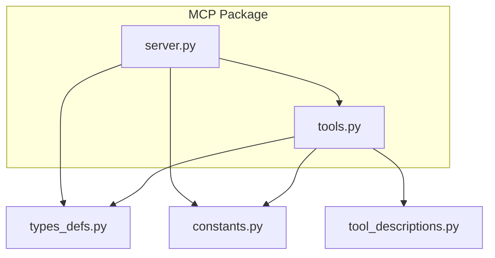
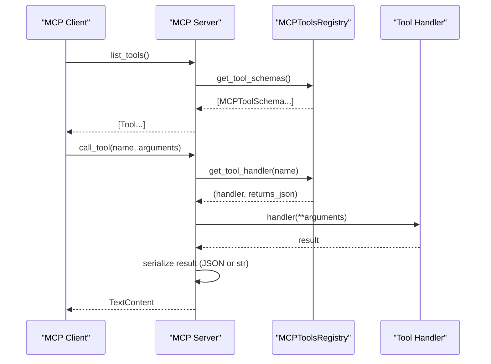
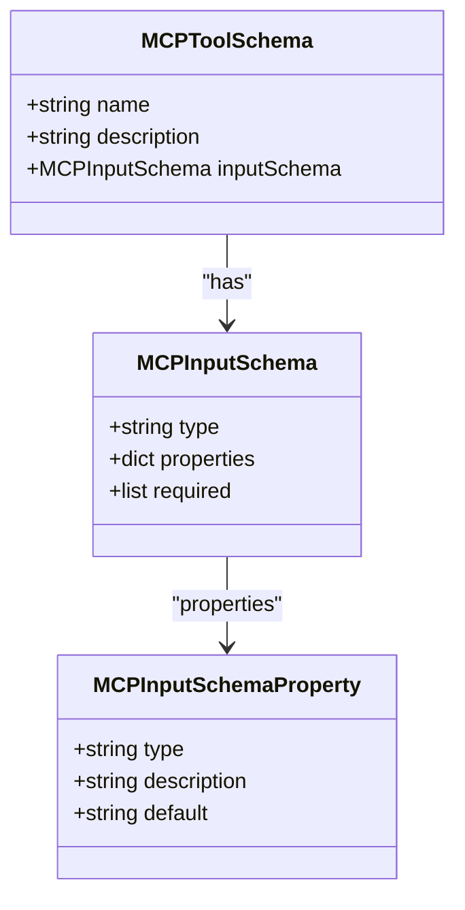
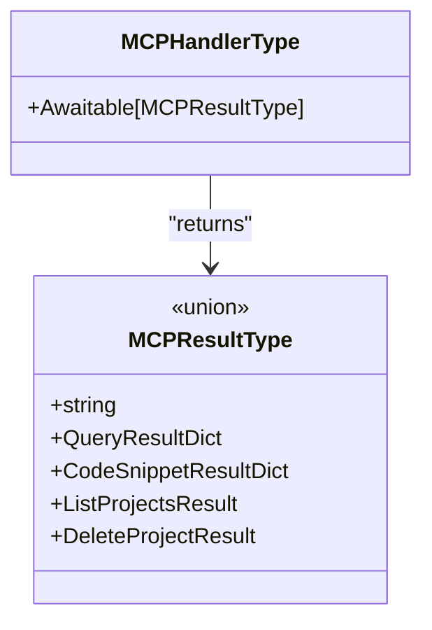
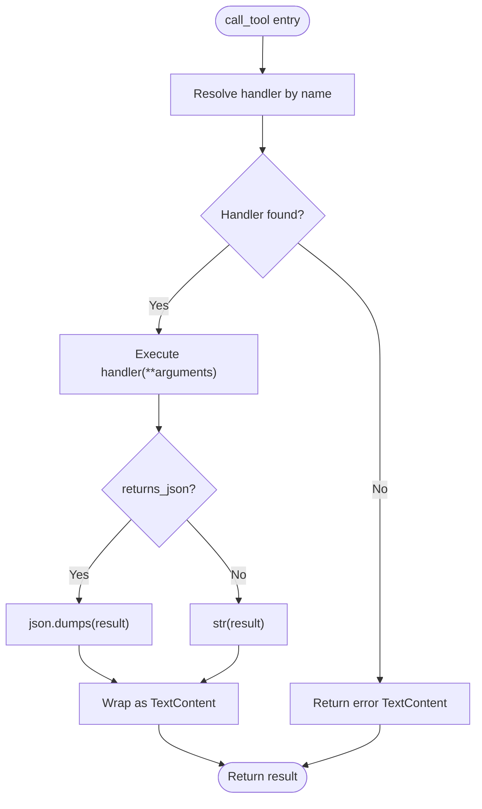
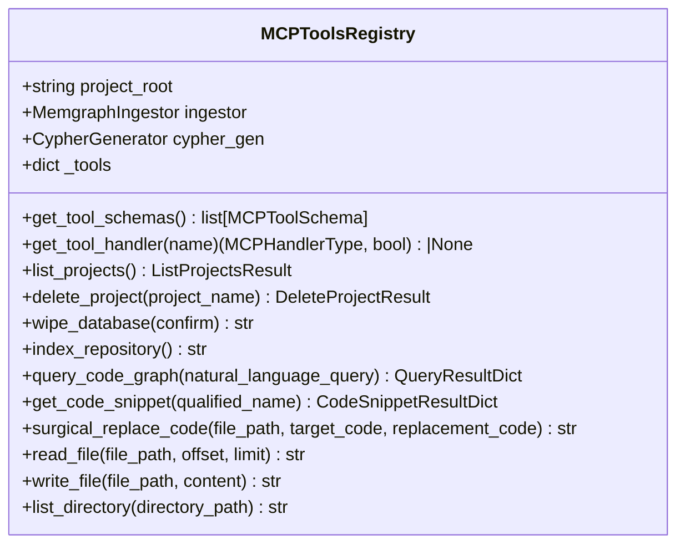
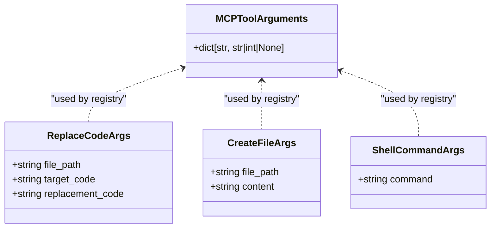
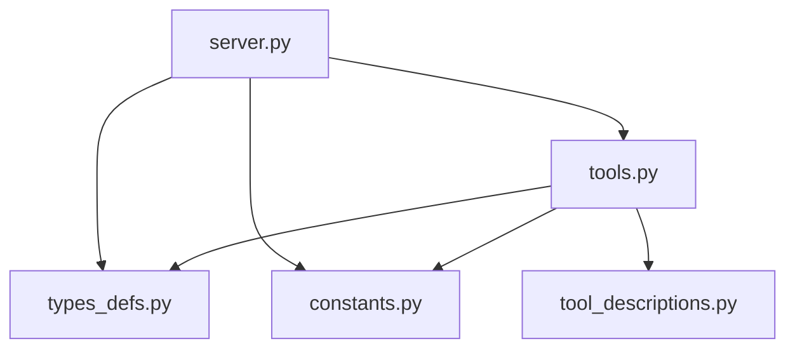

# MCP Protocol Interfaces

<cite>
**Referenced Files in This Document**
- [server.py](file://codebase_rag/mcp/server.py)
- [tools.py](file://codebase_rag/mcp/tools.py)
- [types_defs.py](file://codebase_rag/types_defs.py)
- [constants.py](file://codebase_rag/constants.py)
- [tool_descriptions.py](file://codebase_rag/tools/tool_descriptions.py)
- [test_mcp_server.py](file://codebase_rag/tests/test_mcp_server.py)
- [test_mcp_surgical_replace.py](file://codebase_rag/tests/test_mcp_surgical_replace.py)
- [test_mcp_read_file.py](file://codebase_rag/tests/test_mcp_read_file.py)
</cite>

## Table of Contents
1. [Introduction](#introduction)
2. [Project Structure](#project-structure)
3. [Core Components](#core-components)
4. [Architecture Overview](#architecture-overview)
5. [Detailed Component Analysis](#detailed-component-analysis)
6. [Dependency Analysis](#dependency-analysis)
7. [Performance Considerations](#performance-considerations)
8. [Troubleshooting Guide](#troubleshooting-guide)
9. [Conclusion](#conclusion)
10. [Appendices](#appendices)

## Introduction
This document explains the Model Context Protocol (MCP) interfaces and implementations used by Graph-Code. It covers the MCP tool schemas, handler and result types, the MCP server implementation, the tool registry integration, argument types and validation, result unions and response formats, practical development and integration patterns, and protocol versioning and compatibility considerations.

## Project Structure
The MCP implementation is organized under the mcp package with a clear separation between the server entrypoint, the tool registry, and shared type definitions. Tests validate server configuration, tool argument handling, and file operations.

**Diagram sources**
- [server.py](file://codebase_rag/mcp/server.py#L1-L166)
- [tools.py](file://codebase_rag/mcp/tools.py#L1-L458)
- [types_defs.py](file://codebase_rag/types_defs.py#L343-L421)
- [constants.py](file://codebase_rag/constants.py#L2347-L2408)
- [tool_descriptions.py](file://codebase_rag/tools/tool_descriptions.py#L73-L146)

**Section sources**
- [server.py](file://codebase_rag/mcp/server.py#L1-L166)
- [tools.py](file://codebase_rag/mcp/tools.py#L1-L458)
- [types_defs.py](file://codebase_rag/types_defs.py#L343-L421)
- [constants.py](file://codebase_rag/constants.py#L2347-L2408)
- [tool_descriptions.py](file://codebase_rag/tools/tool_descriptions.py#L73-L146)

## Core Components
- MCP server: Initializes logging, resolves project root, constructs services, registers MCP tool schemas, and handles tool execution via a registry.
- MCP tools registry: Defines tool schemas, binds handlers, and exposes tool metadata consumed by the server.
- Type definitions: Provide typed schemas for MCP input, tool metadata, and result unions.
- Constants and descriptions: Define tool names, schema types, parameter names, and human-readable descriptions.

Key responsibilities:
- Server: Exposes list_tools and call_tool endpoints, routes arguments to handlers, serializes results, and manages lifecycle.
- Registry: Encapsulates tool metadata, handler functions, and JSON serialization preferences per tool.
- Types: Enforce schema shape and result union typing for MCP handlers.

**Section sources**
- [server.py](file://codebase_rag/mcp/server.py#L58-L135)
- [tools.py](file://codebase_rag/mcp/tools.py#L40-L249)
- [types_defs.py](file://codebase_rag/types_defs.py#L343-L421)
- [constants.py](file://codebase_rag/constants.py#L2347-L2398)

## Architecture Overview
The MCP server runs as a stdio-based process, exposing MCP endpoints to clients. Tools are registered centrally and invoked asynchronously by name with validated arguments.

**Diagram sources**
- [server.py](file://codebase_rag/mcp/server.py#L96-L134)
- [tools.py](file://codebase_rag/mcp/tools.py#L433-L446)

**Section sources**
- [server.py](file://codebase_rag/mcp/server.py#L96-L134)
- [tools.py](file://codebase_rag/mcp/tools.py#L433-L446)

## Detailed Component Analysis

### MCP Tool Schemas and Properties
MCP tool schemas are defined with:
- Name: Tool identifier
- Description: Human-readable description
- Input schema: JSON Schema-like structure with properties and required fields

Property definitions include:
- type: One of object, string, integer, boolean
- description: Parameter description
- default: Optional default value

**Diagram sources**
- [types_defs.py](file://codebase_rag/types_defs.py#L346-L365)

**Section sources**
- [types_defs.py](file://codebase_rag/types_defs.py#L346-L365)
- [constants.py](file://codebase_rag/constants.py#L2368-L2383)

### MCP Handler Types and Result Types
- Handler type: Callable[..., Awaitable[MCPResultType]]
- Result union: str | QueryResultDict | CodeSnippetResultDict | ListProjectsResult | DeleteProjectResult
- Per-tool JSON preference: returns_json flag controls whether handler results are serialized as JSON or string

**Diagram sources**
- [types_defs.py](file://codebase_rag/types_defs.py#L414-L421)

**Section sources**
- [types_defs.py](file://codebase_rag/types_defs.py#L414-L421)

### MCP Server Implementation
Responsibilities:
- Logging setup and project root resolution
- Service construction (Memgraph ingestor, Cypher generator)
- Tool registry creation and registration
- list_tools: Returns MCP Tool objects with inputSchema
- call_tool: Resolves handler, executes with validated arguments, serializes result, and handles errors

Execution flow:
- Validates tool name and handler availability
- Invokes handler with keyword arguments
- Serializes result based on returns_json
- Wraps errors in TextContent with standardized error wrapper

**Diagram sources**
- [server.py](file://codebase_rag/mcp/server.py#L108-L134)

**Section sources**
- [server.py](file://codebase_rag/mcp/server.py#L21-L56)
- [server.py](file://codebase_rag/mcp/server.py#L58-L86)
- [server.py](file://codebase_rag/mcp/server.py#L96-L134)

### Tool Registry and Integration
The registry:
- Holds tool metadata (name, description, input schema, handler, returns_json)
- Provides get_tool_schemas and get_tool_handler
- Implements handlers for each tool (e.g., list_projects, delete_project, query_code_graph, get_code_snippet, surgical_replace_code, read_file, write_file, list_directory)

Tool schemas and required parameters:
- list_projects: no parameters
- delete_project: project_name (string, required)
- wipe_database: confirm (boolean, required)
- index_repository: no parameters
- query_code_graph: natural_language_query (string, required)
- get_code_snippet: qualified_name (string, required)
- surgical_replace_code: file_path, target_code, replacement_code (strings, all required)
- read_file: file_path (string, required); supports offset (integer) and limit (integer)
- write_file: file_path, content (both strings, required)
- list_directory: directory_path (string, default ".")

**Diagram sources**
- [tools.py](file://codebase_rag/mcp/tools.py#L40-L446)

**Section sources**
- [tools.py](file://codebase_rag/mcp/tools.py#L40-L249)
- [tools.py](file://codebase_rag/mcp/tools.py#L433-L446)
- [constants.py](file://codebase_rag/constants.py#L2347-L2398)
- [tool_descriptions.py](file://codebase_rag/tools/tool_descriptions.py#L73-L146)

### MCP Tool Argument Types and Validation
Argument types used across tools:
- ReplaceCodeArgs: file_path, target_code, replacement_code
- CreateFileArgs: file_path, content
- ShellCommandArgs: command
- MCPToolArguments: dict[str, str | int | None] (used by server to accept incoming arguments)

Validation and behavior:
- Required parameters are enforced by tool schemas
- read_file supports optional offset and limit for pagination
- write_file returns success or error message
- surgical_replace_code returns success or error message
- Other tools return structured dictionaries or strings depending on returns_json

**Diagram sources**
- [types_defs.py](file://codebase_rag/types_defs.py#L297-L310)
- [types_defs.py](file://codebase_rag/types_defs.py#L343)

**Section sources**
- [types_defs.py](file://codebase_rag/types_defs.py#L297-L310)
- [types_defs.py](file://codebase_rag/types_defs.py#L343)

### MCP Result Type Unions and Response Formats
Result unions:
- str: Plain text responses (e.g., success messages, error messages)
- QueryResultDict: Structured results with query_used, results, summary, error
- CodeSnippetResultDict: Structured snippet info with qualified_name, source_code, file_path, line_start, line_end, docstring, found, error_message, error
- ListProjectsResult: Union of success/error variants
- DeleteProjectResult: Union of success/error variants

Response serialization:
- If returns_json is True, results are serialized with indentation
- Otherwise, results are converted to string

**Section sources**
- [types_defs.py](file://codebase_rag/types_defs.py#L367-L421)
- [server.py](file://codebase_rag/mcp/server.py#L123-L128)

### Practical Examples and Integration Patterns
- Server startup and configuration:
  - Environment variable TARGET_REPO_PATH or settings.TARGET_REPO_PATH determines project root
  - Falls back to current working directory with appropriate warnings
  - Validates path existence and directory type

- Tool usage patterns:
  - Surgical replace code: Exact target and replacement strings are passed to underlying editor tool
  - Read file with pagination: Supports offset and limit for large files
  - Write file: Creates or overwrites file content; returns success or error message

- Integration tips:
  - Use list_tools to discover capabilities and input schemas
  - Use call_tool with validated arguments according to tool schemas
  - Respect returns_json to interpret results correctly

**Section sources**
- [test_mcp_server.py](file://codebase_rag/tests/test_mcp_server.py#L14-L173)
- [test_mcp_surgical_replace.py](file://codebase_rag/tests/test_mcp_surgical_replace.py#L63-L121)
- [test_mcp_read_file.py](file://codebase_rag/tests/test_mcp_read_file.py#L80-L115)

## Dependency Analysis
The server depends on:
- MCP server runtime and stdio transport
- Tool registry for schemas and handlers
- Services for graph ingestion and Cypher generation
- Constants and logging utilities

The registry depends on:
- Tool metadata and descriptions
- Underlying tools (query, code retrieval, file reader/writer/editor, directory lister)
- Parser loader and Cypher generator

**Diagram sources**
- [server.py](file://codebase_rag/mcp/server.py#L1-L18)
- [tools.py](file://codebase_rag/mcp/tools.py#L1-L37)

**Section sources**
- [server.py](file://codebase_rag/mcp/server.py#L1-L18)
- [tools.py](file://codebase_rag/mcp/tools.py#L1-L37)

## Performance Considerations
- Pagination for read_file avoids loading entire large files into memory by skipping to offset and reading up to limit lines.
- JSON serialization is applied only when returns_json is true, reducing overhead for string-only responses.
- Asynchronous execution allows concurrent tool invocations.

[No sources needed since this section provides general guidance]

## Troubleshooting Guide
Common issues and resolutions:
- Unknown tool: Server returns an error TextContent when a tool name is not found.
- Execution errors: Exceptions are caught, logged, and returned as error TextContent.
- Project root misconfiguration: Ensure TARGET_REPO_PATH environment variable or settings is set to a valid directory; otherwise, defaults to current working directory.
- File operations: write_file and surgical_replace_code return error messages on failures; verify permissions and paths.

**Section sources**
- [server.py](file://codebase_rag/mcp/server.py#L112-L134)
- [test_mcp_server.py](file://codebase_rag/tests/test_mcp_server.py#L91-L111)

## Conclusion
Graph-Code’s MCP implementation provides a robust, typed interface for tool discovery and invocation. The server delegates to a centralized registry that defines schemas, handlers, and serialization preferences. Tool schemas enforce required parameters, while result unions and per-tool JSON flags ensure predictable response formats. Tests demonstrate configuration, argument handling, and file operation behaviors.

[No sources needed since this section summarizes without analyzing specific files]

## Appendices

### MCP Protocol Versioning and Compatibility
- The server identifies itself with a fixed name and uses MCP types for tool definitions and content responses.
- No explicit version negotiation is implemented in the server; clients should align with the tool schemas exposed by list_tools.
- Backward compatibility considerations:
  - Adding optional properties to input schemas (e.g., defaults) is safe.
  - Removing required properties or changing types may break clients.
  - Extending result unions should preserve existing keys to avoid breaking consumers relying on specific fields.

**Section sources**
- [constants.py](file://codebase_rag/constants.py#L2400-L2408)
- [server.py](file://codebase_rag/mcp/server.py#L96-L106)