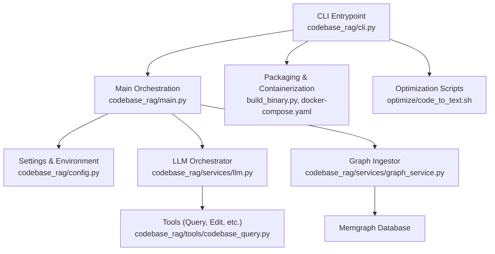
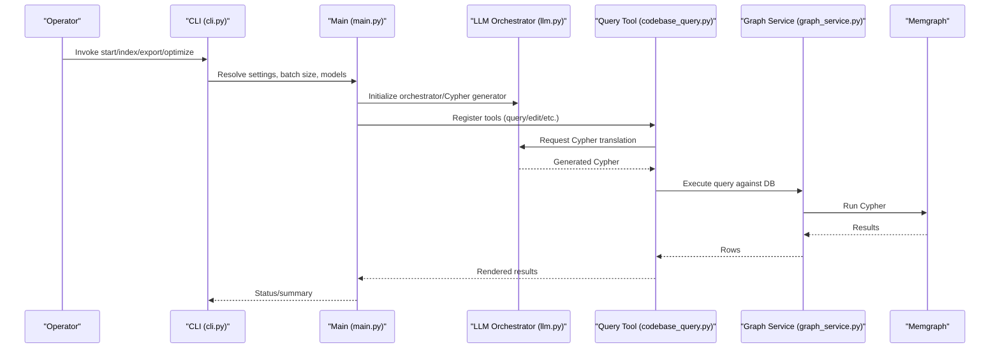
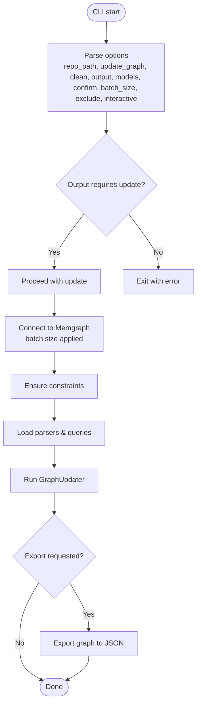
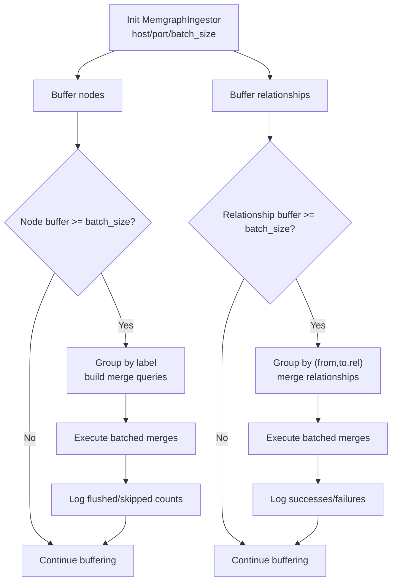
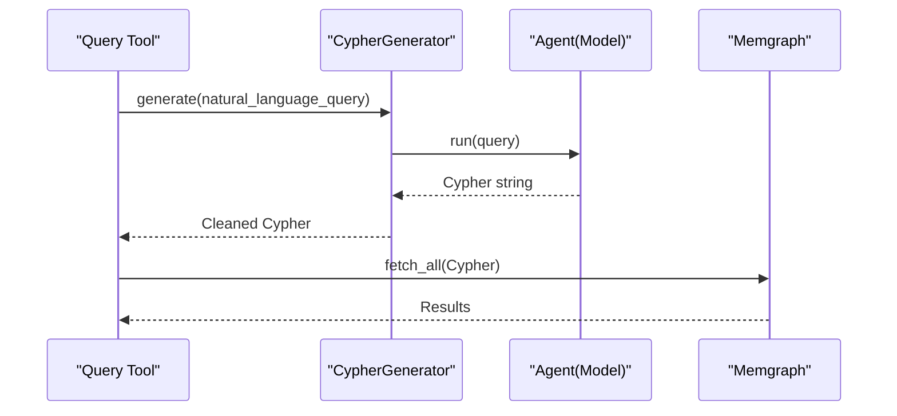
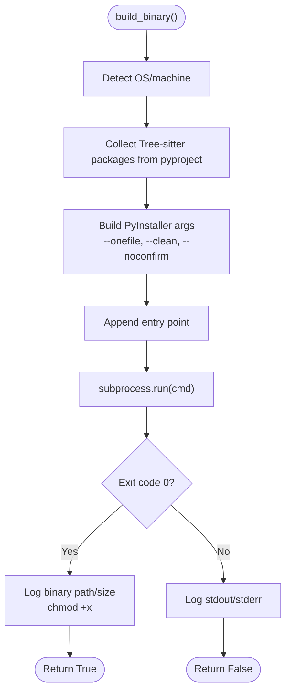
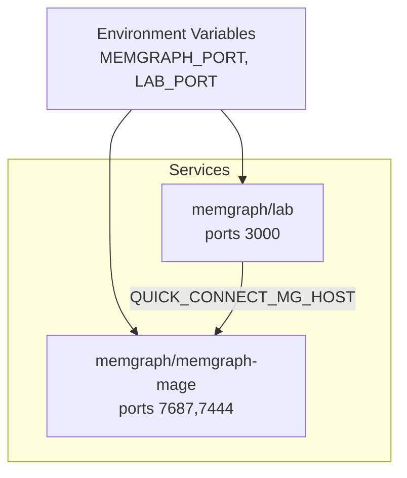
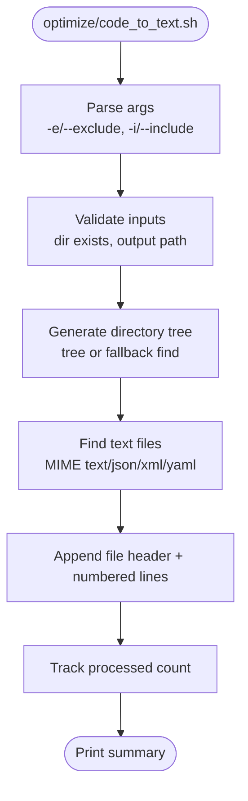
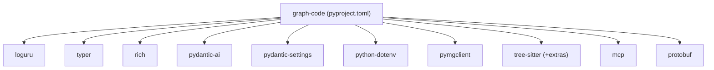

# Advanced Topics

<cite>
**Referenced Files in This Document**
- [build_binary.py](file://build_binary.py)
- [docker-compose.yaml](file://docker-compose.yaml)
- [main.py](file://main.py)
- [codebase_rag/main.py](file://codebase_rag/main.py)
- [codebase_rag/config.py](file://codebase_rag/config.py)
- [codebase_rag/constants.py](file://codebase_rag/constants.py)
- [codebase_rag/services/graph_service.py](file://codebase_rag/services/graph_service.py)
- [codebase_rag/services/llm.py](file://codebase_rag/services/llm.py)
- [codebase_rag/tools/codebase_query.py](file://codebase_rag/tools/codebase_query.py)
- [codebase_rag/cli.py](file://codebase_rag/cli.py)
- [optimize/code_to_text.sh](file://optimize/code_to_text.sh)
- [optimize/tree-sitter-cpp.txt](file://optimize/tree-sitter-cpp.txt)
- [pyproject.toml](file://pyproject.toml)
- [Makefile](file://Makefile)
</cite>

## Table of Contents
1. [Introduction](#introduction)
2. [Project Structure](#project-structure)
3. [Core Components](#core-components)
4. [Architecture Overview](#architecture-overview)
5. [Detailed Component Analysis](#detailed-component-analysis)
6. [Dependency Analysis](#dependency-analysis)
7. [Performance Considerations](#performance-considerations)
8. [Scaling Strategies](#scaling-strategies)
9. [Enterprise Deployment Patterns](#enterprise-deployment-patterns)
10. [Monitoring, Logging, and Observability](#monitoring-logging-and-observability)
11. [Security Considerations](#security-considerations)
12. [Backup and Recovery](#backup-and-recovery)
13. [Upgrade and Migration](#upgrade-and-migration)
14. [Advanced Configuration Scenarios](#advanced-configuration-scenarios)
15. [Troubleshooting Guide](#troubleshooting-guide)
16. [Conclusion](#conclusion)

## Introduction
This document provides advanced operational guidance for Graph-Code, focusing on performance optimization, containerization, scaling for large codebases and high-throughput environments, enterprise deployment patterns, production hardening, monitoring/logging/observability, security, backup/recovery, upgrades, and advanced configuration. It synthesizes the repository’s build, packaging, orchestration, ingestion, and runtime components to deliver practical, production-grade recommendations.

## Project Structure
At a high level, the system comprises:
- CLI entrypoints and orchestration logic
- Configuration and environment-driven settings
- Ingestion pipeline into a graph database (Memgraph)
- LLM orchestration and Cypher generation
- Tools for querying and exporting the knowledge graph
- Packaging and containerization assets
- Optimization scripts for preprocessing and performance tuning

**Diagram sources**
- [codebase_rag/cli.py](file://codebase_rag/cli.py#L1-L395)
- [codebase_rag/main.py](file://codebase_rag/main.py#L1-L800)
- [codebase_rag/config.py](file://codebase_rag/config.py#L1-L274)
- [codebase_rag/services/llm.py](file://codebase_rag/services/llm.py#L1-L93)
- [codebase_rag/services/graph_service.py](file://codebase_rag/services/graph_service.py#L1-L364)
- [codebase_rag/tools/codebase_query.py](file://codebase_rag/tools/codebase_query.py#L1-L95)
- [build_binary.py](file://build_binary.py#L1-L105)
- [docker-compose.yaml](file://docker-compose.yaml#L1-L13)
- [optimize/code_to_text.sh](file://optimize/code_to_text.sh#L1-L170)

**Section sources**
- [codebase_rag/cli.py](file://codebase_rag/cli.py#L1-L395)
- [codebase_rag/main.py](file://codebase_rag/main.py#L1-L800)
- [codebase_rag/config.py](file://codebase_rag/config.py#L1-L274)
- [codebase_rag/services/llm.py](file://codebase_rag/services/llm.py#L1-L93)
- [codebase_rag/services/graph_service.py](file://codebase_rag/services/graph_service.py#L1-L364)
- [codebase_rag/tools/codebase_query.py](file://codebase_rag/tools/codebase_query.py#L1-L95)
- [build_binary.py](file://build_binary.py#L1-L105)
- [docker-compose.yaml](file://docker-compose.yaml#L1-L13)
- [optimize/code_to_text.sh](file://optimize/code_to_text.sh#L1-L170)

## Core Components
- CLI and Commands: Provides start/index/export/optimize/mcp-server/graph-loader/language subcommands with batch size, model overrides, and output controls.
- Configuration: Centralized settings via environment variables and .env, including Memgraph connection, batch sizes, model providers, and shell command policies.
- Graph Ingestion: Streaming node/relationship buffering with batch flushing and constraint enforcement.
- LLM Orchestration: Agent-based orchestrator and Cypher generator with retry policies and provider abstraction.
- Tools: Query tool translates NL to Cypher, executes against the graph, and renders results.
- Packaging/Containerization: Binary builder for distribution and Docker Compose for local/CI environments.
- Optimization Scripts: Preprocessing utilities to flatten codebases into text for downstream analysis.

**Section sources**
- [codebase_rag/cli.py](file://codebase_rag/cli.py#L1-L395)
- [codebase_rag/config.py](file://codebase_rag/config.py#L1-L274)
- [codebase_rag/services/graph_service.py](file://codebase_rag/services/graph_service.py#L1-L364)
- [codebase_rag/services/llm.py](file://codebase_rag/services/llm.py#L1-L93)
- [codebase_rag/tools/codebase_query.py](file://codebase_rag/tools/codebase_query.py#L1-L95)
- [build_binary.py](file://build_binary.py#L1-L105)
- [docker-compose.yaml](file://docker-compose.yaml#L1-L13)
- [optimize/code_to_text.sh](file://optimize/code_to_text.sh#L1-L170)

## Architecture Overview
The runtime architecture integrates CLI orchestration, LLM agents, Cypher generation, and graph ingestion. It supports both in-memory graph updates and export to JSON for auditability.

**Diagram sources**
- [codebase_rag/cli.py](file://codebase_rag/cli.py#L1-L395)
- [codebase_rag/main.py](file://codebase_rag/main.py#L1-L800)
- [codebase_rag/services/llm.py](file://codebase_rag/services/llm.py#L1-L93)
- [codebase_rag/tools/codebase_query.py](file://codebase_rag/tools/codebase_query.py#L1-L95)
- [codebase_rag/services/graph_service.py](file://codebase_rag/services/graph_service.py#L1-L364)

## Detailed Component Analysis

### CLI Command Flow
The CLI coordinates environment resolution, batch sizing, model selection, and execution modes. It supports quiet mode, interactive setup, and export controls.

**Diagram sources**
- [codebase_rag/cli.py](file://codebase_rag/cli.py#L55-L172)
- [codebase_rag/main.py](file://codebase_rag/main.py#L737-L743)

**Section sources**
- [codebase_rag/cli.py](file://codebase_rag/cli.py#L55-L172)
- [codebase_rag/main.py](file://codebase_rag/main.py#L737-L743)

### Graph Ingestion Pipeline
Streaming buffers nodes and relationships, grouping by label/type and batching for efficient writes. It enforces uniqueness constraints and logs flush statistics.

**Diagram sources**
- [codebase_rag/services/graph_service.py](file://codebase_rag/services/graph_service.py#L49-L327)

**Section sources**
- [codebase_rag/services/graph_service.py](file://codebase_rag/services/graph_service.py#L49-L327)

### LLM Orchestration and Cypher Generation
The Cypher generator uses a provider-specific system prompt and retries. The orchestrator composes tools with retries and output retries.

**Diagram sources**
- [codebase_rag/services/llm.py](file://codebase_rag/services/llm.py#L37-L76)
- [codebase_rag/tools/codebase_query.py](file://codebase_rag/tools/codebase_query.py#L32-L88)

**Section sources**
- [codebase_rag/services/llm.py](file://codebase_rag/services/llm.py#L37-L76)
- [codebase_rag/tools/codebase_query.py](file://codebase_rag/tools/codebase_query.py#L32-L88)

### Packaging and Distribution
Binary packaging uses PyInstaller with collected Tree-sitter packages and platform-specific arguments. The script logs progress, validates output, and sets permissions.

**Diagram sources**
- [build_binary.py](file://build_binary.py#L47-L104)

**Section sources**
- [build_binary.py](file://build_binary.py#L47-L104)
- [pyproject.toml](file://pyproject.toml#L37-L55)

### Containerization with Docker Compose
The compose file provisions Memgraph and Lab with mapped ports and environment variables for quick local development and CI.

**Diagram sources**
- [docker-compose.yaml](file://docker-compose.yaml#L1-L13)

**Section sources**
- [docker-compose.yaml](file://docker-compose.yaml#L1-L13)

### Optimization Scripts
The code-to-text script generates a flattened representation of a codebase for downstream analysis, supporting include/exclude patterns and safe MIME detection.

**Diagram sources**
- [optimize/code_to_text.sh](file://optimize/code_to_text.sh#L54-L169)

**Section sources**
- [optimize/code_to_text.sh](file://optimize/code_to_text.sh#L54-L169)

## Dependency Analysis
Key runtime dependencies include logging, LLM orchestration, graph client, and Tree-sitter parsers. Optional extras enable full language support and semantic capabilities.

**Diagram sources**
- [pyproject.toml](file://pyproject.toml#L7-L25)
- [pyproject.toml](file://pyproject.toml#L37-L61)

**Section sources**
- [pyproject.toml](file://pyproject.toml#L7-L25)
- [pyproject.toml](file://pyproject.toml#L37-L61)

## Performance Considerations
- Batch Sizing: Tune MEMGRAPH_BATCH_SIZE and per-command --batch-size to balance throughput and memory usage. Larger batches reduce round-trips but increase memory pressure.
- Parser Selection: Use optional treesitter-full extra to include all language grammars; prune unnecessary languages in production to minimize startup overhead.
- Embeddings: When semantic dependencies are present, configure embedding collection and progress intervals to avoid excessive logging and IO.
- Binary Packaging: Use build_binary.py to produce a single-file executable with Tree-sitter modules included, reducing runtime discovery overhead.
- Containerization: Use docker-compose for local/dev parity; ensure resource limits and health checks in production orchestration platforms.

[No sources needed since this section provides general guidance]

## Scaling Strategies
- Horizontal Scaling: Distribute ingestion across multiple workers or queues; coordinate with a shared Memgraph cluster and consistent partitioning of repositories.
- Vertical Scaling: Increase batch_size and model concurrency where supported; monitor memory and CPU saturation.
- Asynchronous Updates: Use the watch target to continuously update the graph as code changes, minimizing latency for large monorepos.
- Caching: Leverage configured cache limits and eviction thresholds to reduce repeated computation for frequently accessed nodes.
- Export-First Workflows: For very large graphs, export to JSON periodically and offload analytics to external systems.

**Section sources**
- [codebase_rag/config.py](file://codebase_rag/config.py#L144-L154)
- [Makefile](file://Makefile#L56-L64)

## Enterprise Deployment Patterns
- Immutable Images: Build images with pinned versions and minimal base layers; sign and scan images in CI/CD.
- Secrets Management: Store API keys and credentials in environment variables managed by your platform; avoid committing secrets.
- Network Policies: Restrict Memgraph/Lab connectivity; expose only necessary ports and enforce TLS termination at ingress.
- RBAC: Enforce least-privilege access to the graph database and tooling.
- Health Checks: Configure readiness/liveness probes for Memgraph and application services.
- Backup Strategy: Regularly export graph snapshots to durable storage; automate retention and verification.

**Section sources**
- [docker-compose.yaml](file://docker-compose.yaml#L1-L13)
- [codebase_rag/config.py](file://codebase_rag/config.py#L50-L56)

## Monitoring, Logging, and Observability
- Structured Logs: Use the configured log format and levels; suppress non-essential output in quiet mode for production.
- Metrics: Instrument ingestion rates, query latencies, and tool invocation counts; surface metrics to your platform’s telemetry backend.
- Tracing: Correlate CLI invocations with graph operations and LLM generations for end-to-end visibility.
- Dashboards: Visualize node/relationship counts, batch flush stats, and failure rates.

**Section sources**
- [codebase_rag/config.py](file://codebase_rag/config.py#L161-L162)
- [codebase_rag/constants.py](file://codebase_rag/constants.py#L615-L616)

## Security Considerations
- Network Security: Limit Memgraph ports to trusted networks; prefer VPN or bastion hosts for access.
- Data Encryption: Enable TLS for Memgraph connections and secure backups at rest.
- Access Control: Enforce API key rotation and provider-specific secret management.
- Least Privilege: Run containers with reduced privileges; drop unnecessary capabilities.
- Supply Chain: Pin dependencies and monitor advisories; rebuild binaries regularly.

**Section sources**
- [codebase_rag/config.py](file://codebase_rag/config.py#L60-L76)
- [pyproject.toml](file://pyproject.toml#L107-L121)

## Backup and Recovery
- Graph Exports: Use the export command to produce JSON snapshots containing nodes, relationships, and metadata.
- Retention: Automate periodic exports with rotation policies; store in encrypted, versioned storage.
- Recovery: Import snapshots via the graph loader command to reconstruct the graph state.

**Section sources**
- [codebase_rag/cli.py](file://codebase_rag/cli.py#L237-L271)
- [codebase_rag/cli.py](file://codebase_rag/cli.py#L352-L381)

## Upgrade and Migration
- Versioned Releases: Pin application and dependency versions; validate upgrades in staging.
- Migration Steps:
  - Stop ingestion and drain workloads.
  - Back up the graph (export JSON).
  - Rebuild or reinstall with new binaries/images.
  - Restart services and re-ingest deltas.
- Rollback: Keep previous artifacts and revert quickly if issues arise.

**Section sources**
- [pyproject.toml](file://pyproject.toml#L1-L6)
- [build_binary.py](file://build_binary.py#L47-L104)

## Advanced Configuration Scenarios
- Model Overrides: Dynamically switch orchestrator and Cypher models at runtime via CLI commands.
- Shell Command Policies: Restrict allowed commands and git subcommands for safer automation.
- Interactive Setup: Customize exclusion/unignore lists per repository to tune ingestion scope.
- Batch Size Tuning: Adjust global and per-command batch sizes to fit hardware constraints.

**Section sources**
- [codebase_rag/cli.py](file://codebase_rag/cli.py#L314-L330)
- [codebase_rag/config.py](file://codebase_rag/config.py#L82-L142)
- [codebase_rag/main.py](file://codebase_rag/main.py#L681-L694)

## Troubleshooting Guide
- Startup Errors: Validate environment variables and .env presence; check model provider configuration.
- Ingestion Failures: Inspect batch errors, constraint violations, and missing properties; review truncated batch logs.
- Query Failures: Confirm Cypher generation succeeded and DB connectivity; verify query results rendering.
- Packaging Issues: Review PyInstaller logs, missing Tree-sitter modules, and platform compatibility.

**Section sources**
- [codebase_rag/cli.py](file://codebase_rag/cli.py#L164-L172)
- [codebase_rag/services/graph_service.py](file://codebase_rag/services/graph_service.py#L124-L146)
- [codebase_rag/services/llm.py](file://codebase_rag/services/llm.py#L58-L76)
- [build_binary.py](file://build_binary.py#L93-L99)

## Conclusion
By combining robust configuration, scalable ingestion, containerized delivery, and production-grade hardening, Graph-Code can operate effectively in enterprise environments. Apply the strategies outlined here to optimize performance, ensure reliability, and maintain security and compliance across large-scale deployments.