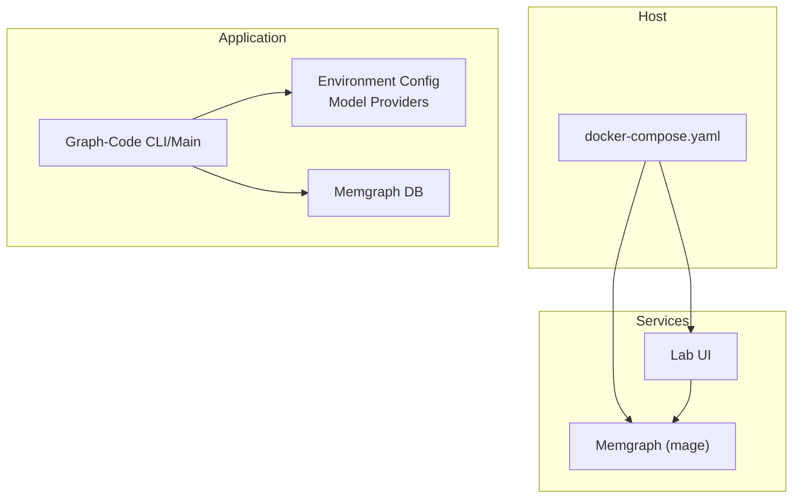
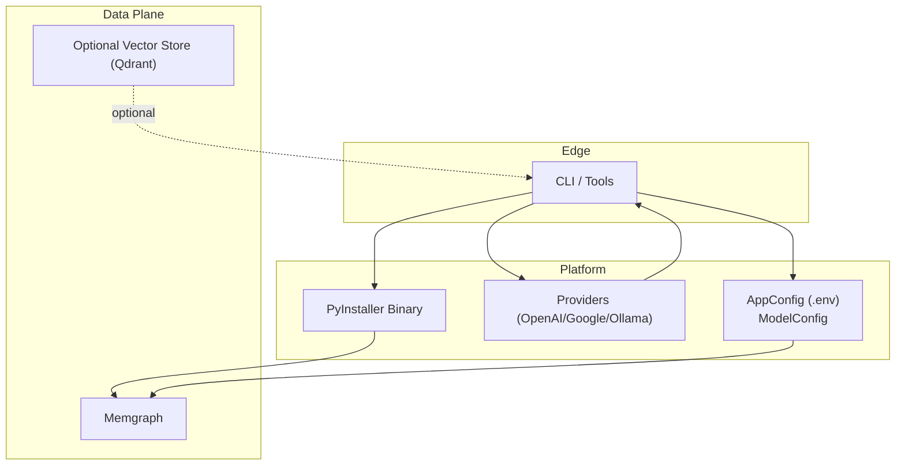
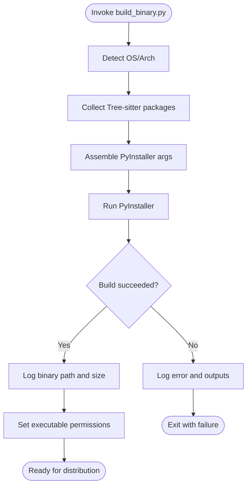
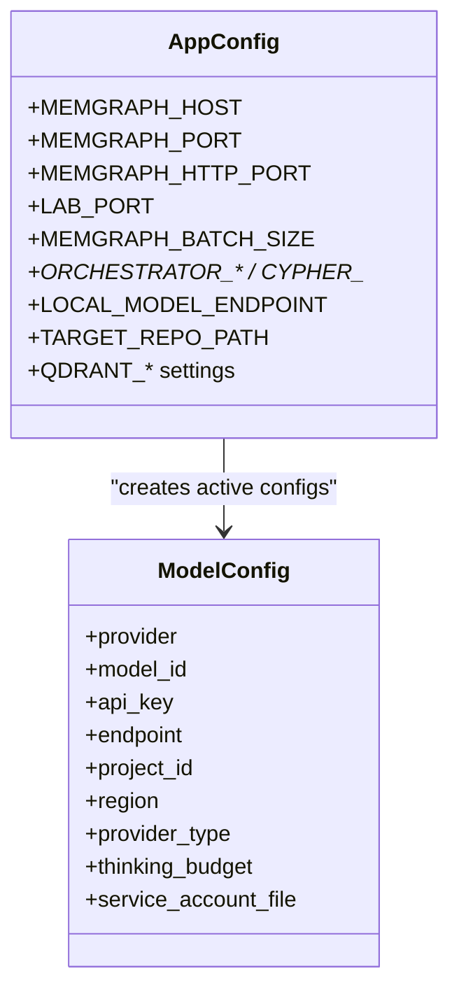
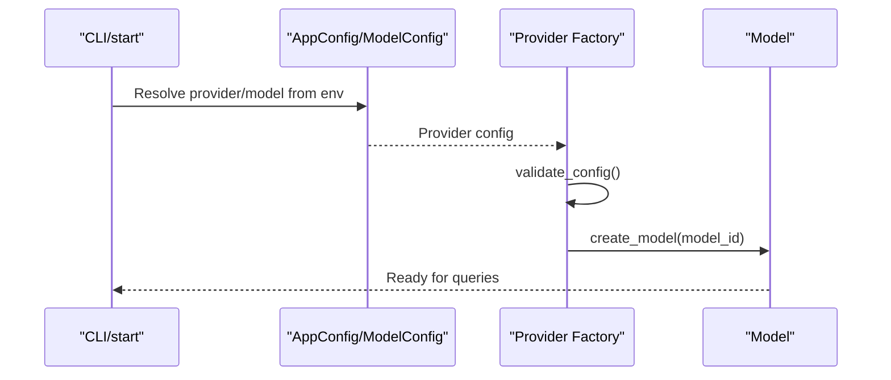
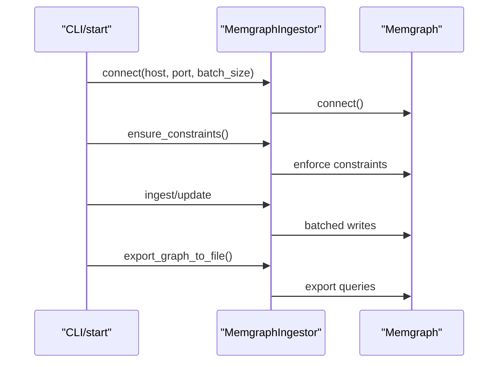
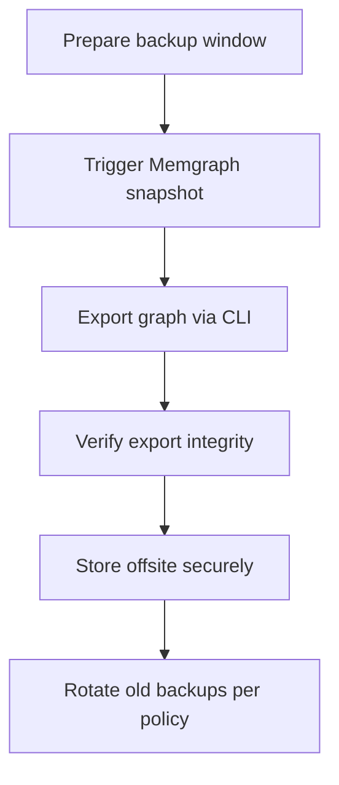
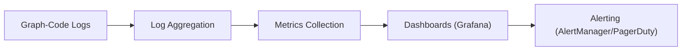
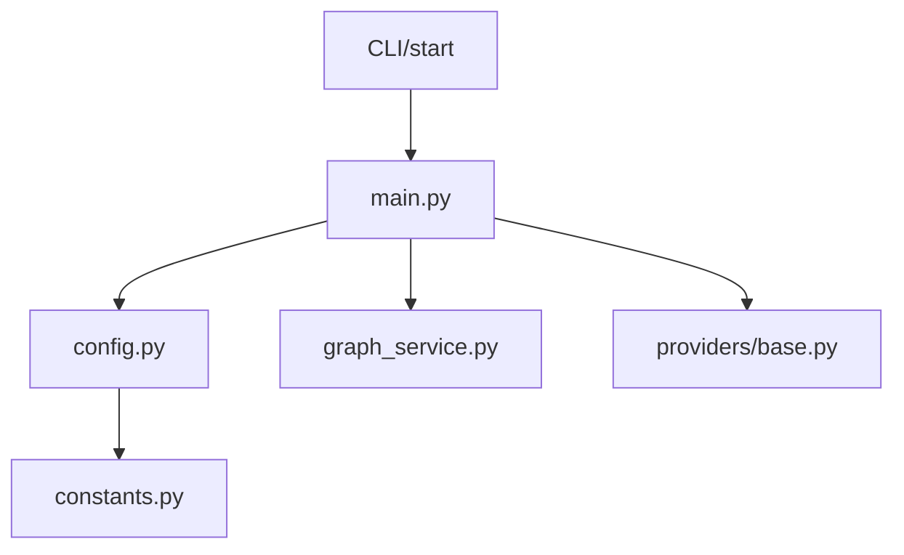

# Enterprise Deployment

<cite>
**Referenced Files in This Document**
- [docker-compose.yaml](file://docker-compose.yaml)
- [build_binary.py](file://build_binary.py)
- [pyproject.toml](file://pyproject.toml)
- [Makefile](file://Makefile)
- [codebase_rag/config.py](file://codebase_rag/config.py)
- [codebase_rag/constants.py](file://codebase_rag/constants.py)
- [codebase_rag/cli.py](file://codebase_rag/cli.py)
- [codebase_rag/main.py](file://codebase_rag/main.py)
- [codebase_rag/services/graph_service.py](file://codebase_rag/services/graph_service.py)
- [codebase_rag/providers/base.py](file://codebase_rag/providers/base.py)
- [codebase_rag/logs.py](file://codebase_rag/logs.py)
</cite>

## Table of Contents
1. [Introduction](#introduction)
2. [Project Structure](#project-structure)
3. [Core Components](#core-components)
4. [Architecture Overview](#architecture-overview)
5. [Detailed Component Analysis](#detailed-component-analysis)
6. [Dependency Analysis](#dependency-analysis)
7. [Performance Considerations](#performance-considerations)
8. [Troubleshooting Guide](#troubleshooting-guide)
9. [Conclusion](#conclusion)
10. [Appendices](#appendices)

## Introduction
This document provides enterprise-grade deployment guidance for Graph-Code. It covers containerization with Docker Compose, production binary builds, environment configuration and secrets handling, model provider setup, database connectivity to Memgraph, horizontal scaling strategies, backup and recovery for knowledge graph data, monitoring and alerting, security hardening, deployment automation, and capacity planning.

## Project Structure
Graph-Code is a Python application with a modular codebase. Key deployment-relevant areas include:
- Container orchestration via Docker Compose for Memgraph and optional Lab UI
- Binary packaging for production distribution
- Configuration management for environment variables and model providers
- Graph ingestion and persistence through Memgraph
- Logging and observability hooks

**Diagram sources**
- [docker-compose.yaml](file://docker-compose.yaml#L1-L13)
- [codebase_rag/config.py](file://codebase_rag/config.py#L50-L80)
- [codebase_rag/services/graph_service.py](file://codebase_rag/services/graph_service.py#L49-L72)

**Section sources**
- [docker-compose.yaml](file://docker-compose.yaml#L1-L13)
- [pyproject.toml](file://pyproject.toml#L1-L30)
- [Makefile](file://Makefile#L1-L20)

## Core Components
- Docker Compose orchestration defines Memgraph and Lab services with configurable ports and quick-connect integration.
- Binary build pipeline produces a single-file executable for distribution using PyInstaller and project metadata.
- Environment configuration loads settings from environment variables and .env files, supporting multiple model providers and Memgraph connectivity.
- Graph ingestion connects to Memgraph, enforces constraints, and batches writes for performance.

**Section sources**
- [docker-compose.yaml](file://docker-compose.yaml#L1-L13)
- [build_binary.py](file://build_binary.py#L47-L100)
- [codebase_rag/config.py](file://codebase_rag/config.py#L39-L80)
- [codebase_rag/services/graph_service.py](file://codebase_rag/services/graph_service.py#L49-L72)

## Architecture Overview
The enterprise deployment architecture centers on:
- A containerized knowledge graph backend (Memgraph) with optional web UI (Lab)
- An application front-end (CLI/main) that ingests codebases and queries the graph
- Pluggable model providers (OpenAI, Google, Anthropic, Ollama) configured via environment variables
- Batched ingestion and constraint enforcement for reliability and performance

**Diagram sources**
- [codebase_rag/config.py](file://codebase_rag/config.py#L39-L80)
- [codebase_rag/providers/base.py](file://codebase_rag/providers/base.py#L100-L150)
- [codebase_rag/services/graph_service.py](file://codebase_rag/services/graph_service.py#L49-L72)

## Detailed Component Analysis

### Docker Orchestration and Networking
- Memgraph service exposes ports for Bolt (7687) and HTTP (7444) with environment overrides via ${VAR:-default}.
- Lab service provides a web UI connected to Memgraph via QUICK_CONNECT_MG_HOST.
- Networking: Services share the default Compose network; expose only required ports externally.

Operational notes:
- Set MEMGRAPH_PORT and MEMGRAPH_HTTP_PORT to bind host ports safely.
- Use reverse proxies or ingress for TLS termination and access control.

**Section sources**
- [docker-compose.yaml](file://docker-compose.yaml#L1-L13)

### Binary Building and Distribution
- The build script detects OS/architecture, collects Tree-sitter packages, and invokes PyInstaller with appropriate arguments.
- It logs progress, validates the resulting binary, records size, and sets permissions.
- Distribution: ship the produced binary to target hosts; ensure runtime libraries are compatible.

**Diagram sources**
- [build_binary.py](file://build_binary.py#L47-L100)

**Section sources**
- [build_binary.py](file://build_binary.py#L47-L100)
- [pyproject.toml](file://pyproject.toml#L1-L30)

### Environment Configuration Management
- AppConfig loads environment variables and .env, with defaults for Memgraph host/port, Lab port, batch sizes, and model settings.
- ModelConfig supports multiple providers (OpenAI, Google, Anthropic, Ollama) with optional endpoints, API keys, and service account files.
- Provider selection and overrides are supported via CLI options and environment variables.

**Diagram sources**
- [codebase_rag/config.py](file://codebase_rag/config.py#L39-L80)
- [codebase_rag/config.py](file://codebase_rag/config.py#L20-L37)

**Section sources**
- [codebase_rag/config.py](file://codebase_rag/config.py#L39-L80)
- [codebase_rag/constants.py](file://codebase_rag/constants.py#L12-L31)

### Model Provider Setup
- OpenAIProvider reads API key from environment or config and constructs a provider with a base URL.
- GoogleProvider supports GLA or Vertex with optional service account credentials and thinking budget.
- OllamaProvider validates health endpoint and constructs a model with a default endpoint.

**Diagram sources**
- [codebase_rag/providers/base.py](file://codebase_rag/providers/base.py#L100-L150)
- [codebase_rag/config.py](file://codebase_rag/config.py#L197-L218)

**Section sources**
- [codebase_rag/providers/base.py](file://codebase_rag/providers/base.py#L100-L150)
- [codebase_rag/config.py](file://codebase_rag/config.py#L197-L218)

### Database Connectivity and Ingestion
- MemgraphIngestor manages connection, batching, and constraint enforcement.
- It supports cleaning databases, ensuring unique constraints, and exporting graph data.

**Diagram sources**
- [codebase_rag/services/graph_service.py](file://codebase_rag/services/graph_service.py#L49-L72)
- [codebase_rag/main.py](file://codebase_rag/main.py#L737-L743)

**Section sources**
- [codebase_rag/services/graph_service.py](file://codebase_rag/services/graph_service.py#L49-L72)
- [codebase_rag/main.py](file://codebase_rag/main.py#L737-L743)

### Backup and Recovery for Knowledge Graph Data
- Use Memgraph’s native backup mechanisms and snapshotting for durable persistence.
- Export graph data via the CLI to JSON for offloading and verification.
- Recommended cadence: periodic snapshots plus daily exports for compliance and DR testing.

**Section sources**
- [codebase_rag/main.py](file://codebase_rag/main.py#L745-L766)
- [codebase_rag/services/graph_service.py](file://codebase_rag/services/graph_service.py#L166-L179)

### Monitoring and Alerting
- Application logs use structured formatting suitable for log aggregation systems.
- Key events include connection, batching, and error logging for Cypher and batch operations.
- Recommended stack: centralized logging (e.g., ELK/Opensearch), metrics (Prometheus/OpenTelemetry), and alerts (PagerDuty/AlertManager).

**Section sources**
- [codebase_rag/logs.py](file://codebase_rag/logs.py#L155-L194)

### Security Hardening
- Network segmentation: isolate Memgraph and Lab behind a private network; restrict inbound ports.
- Access controls: require authentication at ingress; enable TLS; enforce least privilege for service accounts.
- Audit logging: enable database audit logs and application audit trails; monitor for unauthorized access.
- Secrets management: store API keys and service account files in a secrets vault; mount read-only at runtime.

[No sources needed since this section provides general guidance]

### Deployment Automation and CI/CD
- Use Makefile targets for development and testing; adapt CI to mirror these steps.
- Automate binary builds with build_binary.py and publish artifacts.
- CI tasks: lint, typecheck, unit tests, integration tests, and binary packaging.

**Section sources**
- [Makefile](file://Makefile#L33-L47)
- [build_binary.py](file://build_binary.py#L47-L100)

### Capacity Planning and Resource Sizing
- Memgraph sizing depends on graph scale, cardinality, and concurrent queries; provision CPU/memory accordingly.
- Batch size tuning impacts throughput and memory footprint; adjust MEMGRAPH_BATCH_SIZE per workload.
- Vector store (Qdrant) sizing depends on embedding counts and dimensions; plan storage and replicas.
- Horizontal scaling: run multiple application instances behind a load balancer; ensure shared storage for ingestion state if applicable.

[No sources needed since this section provides general guidance]

## Dependency Analysis
- The CLI orchestrates ingestion, updates model settings, and delegates to the main application and graph service.
- Providers encapsulate external model APIs and validate configuration.
- Constants define supported providers, endpoints, and defaults used across configuration and CLI.

**Diagram sources**
- [codebase_rag/cli.py](file://codebase_rag/cli.py#L55-L172)
- [codebase_rag/main.py](file://codebase_rag/main.py#L1-L50)
- [codebase_rag/config.py](file://codebase_rag/config.py#L39-L80)
- [codebase_rag/services/graph_service.py](file://codebase_rag/services/graph_service.py#L49-L72)
- [codebase_rag/providers/base.py](file://codebase_rag/providers/base.py#L100-L150)
- [codebase_rag/constants.py](file://codebase_rag/constants.py#L12-L31)

**Section sources**
- [codebase_rag/cli.py](file://codebase_rag/cli.py#L55-L172)
- [codebase_rag/main.py](file://codebase_rag/main.py#L1-L50)
- [codebase_rag/config.py](file://codebase_rag/config.py#L39-L80)
- [codebase_rag/services/graph_service.py](file://codebase_rag/services/graph_service.py#L49-L72)
- [codebase_rag/providers/base.py](file://codebase_rag/providers/base.py#L100-L150)
- [codebase_rag/constants.py](file://codebase_rag/constants.py#L12-L31)

## Performance Considerations
- Tune MEMGRAPH_BATCH_SIZE for throughput vs. latency trade-offs.
- Use Ollama or managed providers for cost-effective local inference; scale horizontally as needed.
- Monitor Memgraph metrics (queries/sec, memory, disk IO) and adjust resources accordingly.

[No sources needed since this section provides general guidance]

## Troubleshooting Guide
Common operational issues and where to look:
- Connection failures to Memgraph: verify host/port and network connectivity; check logs for connection errors.
- Provider misconfiguration: confirm API keys and endpoints; validate provider health checks.
- Batch errors: inspect truncated batch parameters and Cypher query logs.
- Export failures: validate output path permissions and graph export logs.

**Section sources**
- [codebase_rag/services/graph_service.py](file://codebase_rag/services/graph_service.py#L104-L146)
- [codebase_rag/logs.py](file://codebase_rag/logs.py#L155-L194)

## Conclusion
This guide outlines a robust, scalable, and secure deployment of Graph-Code. By leveraging Docker Compose for orchestration, PyInstaller for distribution, environment-driven configuration, and provider-agnostic model integrations, enterprises can operate Graph-Code reliably at scale. Combine these practices with sound backup, monitoring, and security measures to achieve production readiness.

## Appendices
- Reference environment variables and defaults for Memgraph and model providers.
- Reference CLI options for ingestion, export, and model switching.

[No sources needed since this section summarizes without analyzing specific files]