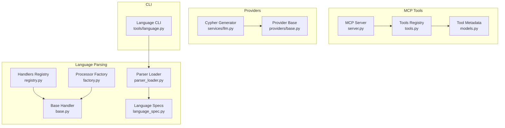
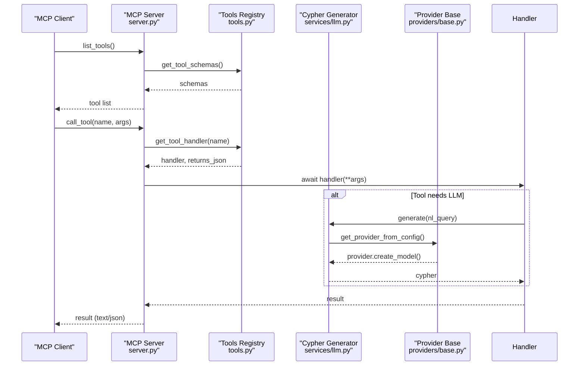
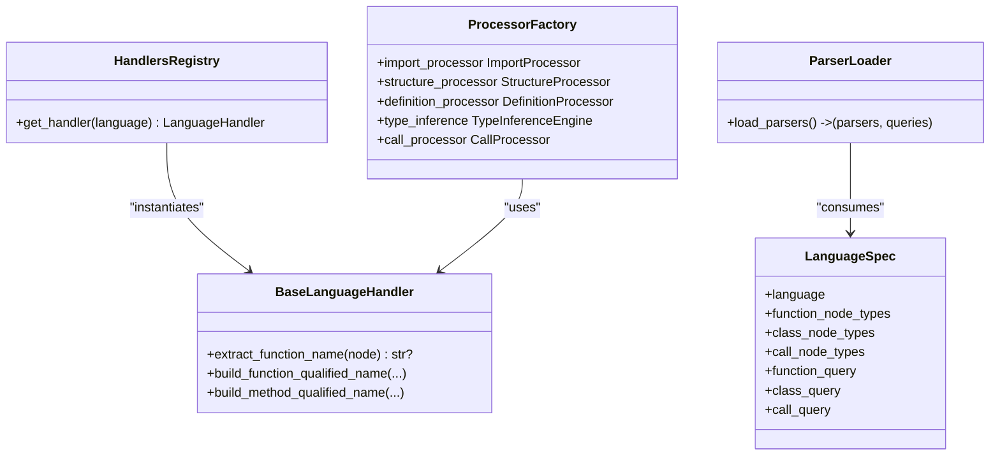
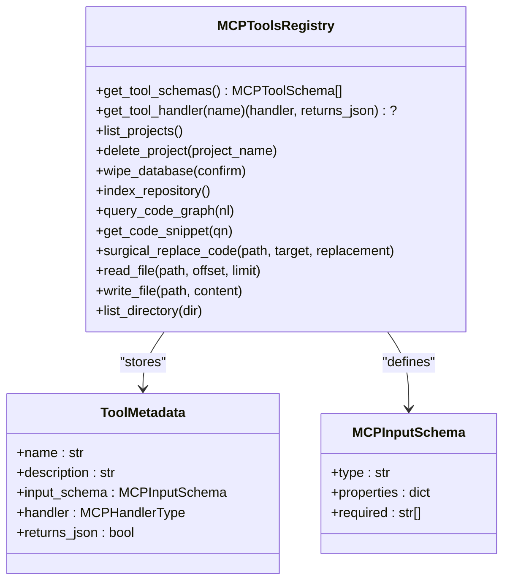
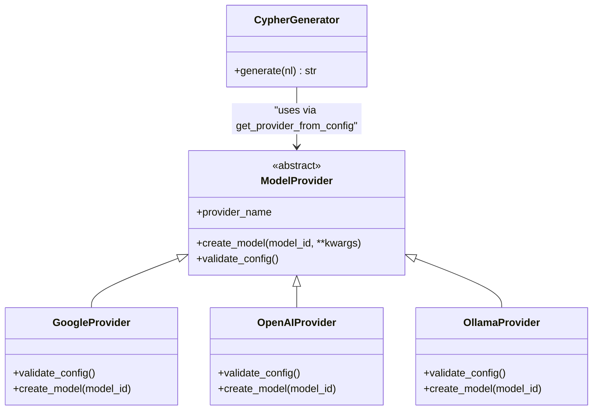
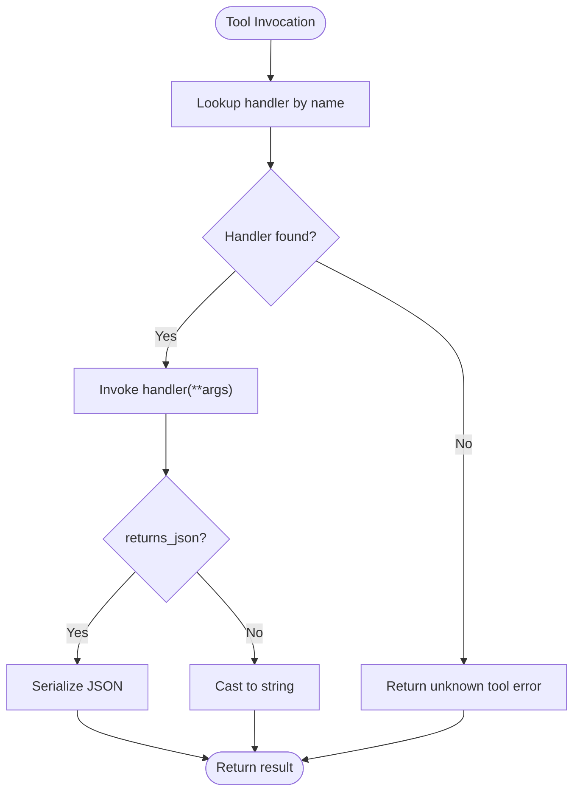
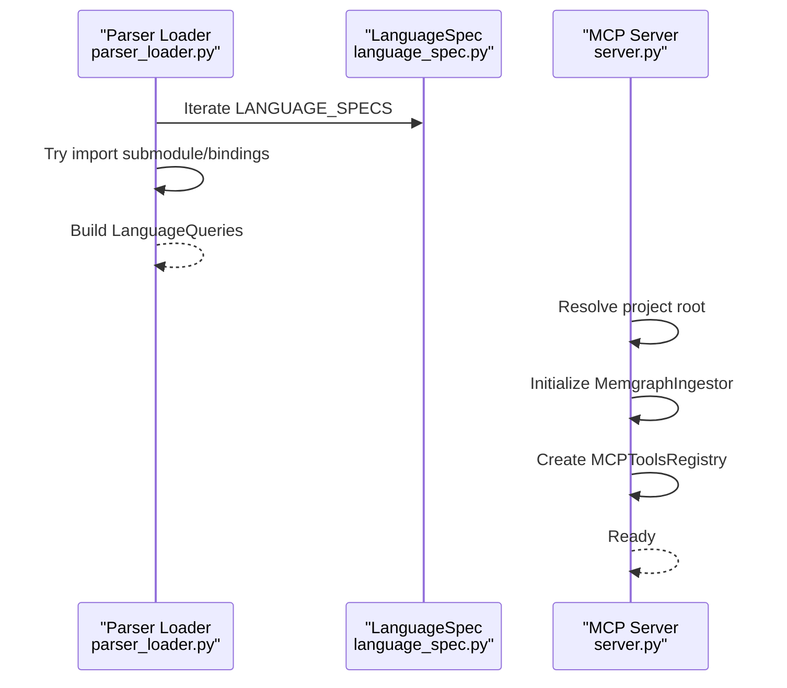
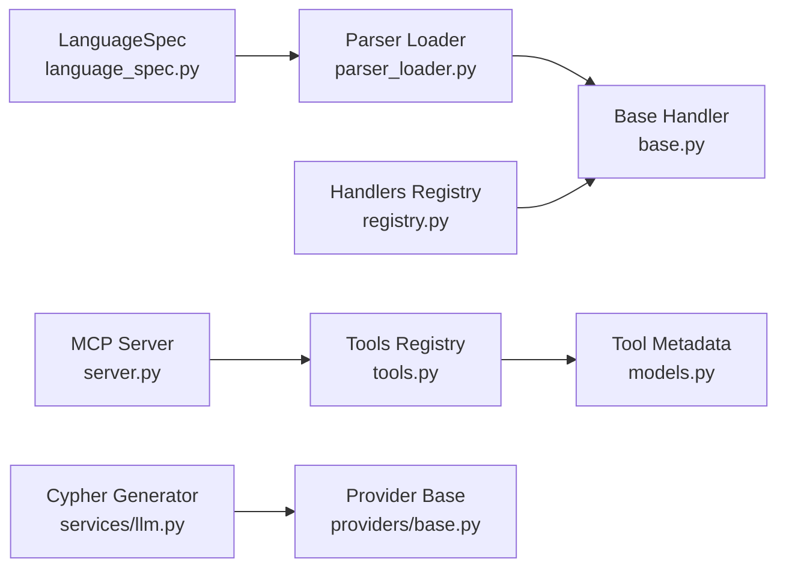

# Extension and Plugin Development

<cite>
**Referenced Files in This Document**
- [registry.py](file://codebase_rag/parsers/handlers/registry.py)
- [base.py](file://codebase_rag/parsers/handlers/base.py)
- [factory.py](file://codebase_rag/parsers/factory.py)
- [language_spec.py](file://codebase_rag/language_spec.py)
- [parser_loader.py](file://codebase_rag/parser_loader.py)
- [types_defs.py](file://codebase_rag/types_defs.py)
- [constants.py](file://codebase_rag/constants.py)
- [tools.py](file://codebase_rag/mcp/tools.py)
- [server.py](file://codebase_rag/mcp/server.py)
- [base.py](file://codebase_rag/providers/base.py)
- [llm.py](file://codebase_rag/services/llm.py)
- [models.py](file://codebase_rag/models.py)
- [schema.proto](file://codec/schema.proto)
- [language.py](file://codebase_rag/tools/language.py)
</cite>

## Table of Contents
1. [Introduction](#introduction)
2. [Project Structure](#project-structure)
3. [Core Components](#core-components)
4. [Architecture Overview](#architecture-overview)
5. [Detailed Component Analysis](#detailed-component-analysis)
6. [Dependency Analysis](#dependency-analysis)
7. [Performance Considerations](#performance-considerations)
8. [Troubleshooting Guide](#troubleshooting-guide)
9. [Conclusion](#conclusion)
10. [Appendices](#appendices)

## Introduction
This document explains how to extend Graph-Code functionality via plugins and customizations. It covers:
- Language handler registration and adding new language support with Tree-sitter grammars and AST processing
- Tool registry architecture for building AI-powered tools with validation and approval flows
- Provider abstraction for integrating custom LLM providers and model configurations
- MCP tool development with schema definitions, parameter validation, and error handling
- Plugin lifecycle (loading, initialization, cleanup)
- Backward compatibility and version management
- Templates and examples for common extension patterns
- Performance considerations and integration testing strategies
- Debugging and troubleshooting approaches

## Project Structure
The extension surface spans several subsystems:
- Language parsing and AST processing pipeline
- MCP server and tool registry
- Provider abstraction and LLM orchestration
- CLI utilities for language grammar management

**Diagram sources**
- [registry.py](file://codebase_rag/parsers/handlers/registry.py#L15-L31)
- [base.py](file://codebase_rag/parsers/handlers/base.py#L15-L107)
- [factory.py](file://codebase_rag/parsers/factory.py#L18-L115)
- [language_spec.py](file://codebase_rag/language_spec.py#L205-L409)
- [parser_loader.py](file://codebase_rag/parser_loader.py#L17-L292)
- [server.py](file://codebase_rag/mcp/server.py#L58-L135)
- [tools.py](file://codebase_rag/mcp/tools.py#L40-L457)
- [models.py](file://codebase_rag/models/models.py#L89-L95)
- [base.py](file://codebase_rag/providers/base.py#L20-L209)
- [llm.py](file://codebase_rag/services/llm.py#L37-L92)
- [language.py](file://codebase_rag/tools/language.py#L374-L614)

**Section sources**
- [registry.py](file://codebase_rag/parsers/handlers/registry.py#L15-L31)
- [parser_loader.py](file://codebase_rag/parser_loader.py#L17-L292)
- [server.py](file://codebase_rag/mcp/server.py#L58-L135)
- [base.py](file://codebase_rag/providers/base.py#L20-L209)

## Core Components
- Handlers Registry: Maps languages to handler classes and caches instances.
- Base Language Handler: Defines AST processing hooks and helpers for qualified name construction.
- Processor Factory: Provides lazily constructed processors (imports, structure, definitions, types, calls).
- Language Specs and Parser Loader: Define language-specific AST node types, queries, and load Tree-sitter grammars.
- MCP Server and Tools Registry: Expose tools via MCP with schema-driven validation and error handling.
- Providers and LLM Services: Abstract provider instantiation and orchestrate agents with tools.
- CLI Language Management: Add/remove Tree-sitter grammars and language specs.

**Section sources**
- [registry.py](file://codebase_rag/parsers/handlers/registry.py#L15-L31)
- [base.py](file://codebase_rag/parsers/handlers/base.py#L15-L107)
- [factory.py](file://codebase_rag/parsers/factory.py#L18-L115)
- [language_spec.py](file://codebase_rag/language_spec.py#L205-L409)
- [parser_loader.py](file://codebase_rag/parser_loader.py#L17-L292)
- [server.py](file://codebase_rag/mcp/server.py#L58-L135)
- [tools.py](file://codebase_rag/mcp/tools.py#L40-L457)
- [base.py](file://codebase_rag/providers/base.py#L20-L209)
- [llm.py](file://codebase_rag/services/llm.py#L37-L92)
- [models.py](file://codebase_rag/models/models.py#L89-L95)
- [language.py](file://codebase_rag/tools/language.py#L374-L614)

## Architecture Overview
The system integrates language parsing, tool execution, and provider orchestration:

**Diagram sources**
- [server.py](file://codebase_rag/mcp/server.py#L96-L134)
- [tools.py](file://codebase_rag/mcp/tools.py#L433-L446)
- [llm.py](file://codebase_rag/services/llm.py#L37-L92)
- [base.py](file://codebase_rag/providers/base.py#L179-L189)

## Detailed Component Analysis

### Language Handler Registration and Tree-Sitter Integration
- Handlers Registry maps SupportedLanguage to handler classes and caches instances.
- BaseLanguageHandler defines AST helpers and naming conventions.
- Parser Loader dynamically imports Tree-sitter language modules from submodules or built bindings.
- LanguageSpec defines AST node types and Cypher queries per language; parser_loader builds LanguageQueries.

**Diagram sources**
- [registry.py](file://codebase_rag/parsers/handlers/registry.py#L15-L31)
- [base.py](file://codebase_rag/parsers/handlers/base.py#L15-L107)
- [factory.py](file://codebase_rag/parsers/factory.py#L18-L115)
- [parser_loader.py](file://codebase_rag/parser_loader.py#L251-L292)
- [language_spec.py](file://codebase_rag/language_spec.py#L58-L73)

Guidelines for adding a new language:
- Define LanguageSpec entries with node types and optional Cypher queries.
- Ensure Tree-sitter grammar submodule is available and exposes a language loader attribute.
- Register handler class in the registry if AST processing differs from base behavior.
- Use the language CLI to add grammar and auto-detect node types.

**Section sources**
- [registry.py](file://codebase_rag/parsers/handlers/registry.py#L15-L31)
- [base.py](file://codebase_rag/parsers/handlers/base.py#L15-L107)
- [language_spec.py](file://codebase_rag/language_spec.py#L205-L409)
- [parser_loader.py](file://codebase_rag/parser_loader.py#L17-L292)
- [language.py](file://codebase_rag/tools/language.py#L374-L614)

### Tool Registry Architecture and Validation
- MCPToolsRegistry centralizes tool definitions, schemas, and handlers.
- ToolMetadata encapsulates input schemas and handler signatures.
- Server validates tool names, invokes handlers, and serializes results.

**Diagram sources**
- [tools.py](file://codebase_rag/mcp/tools.py#L40-L457)
- [models.py](file://codebase_rag/models/models.py#L89-L95)
- [types_defs.py](file://codebase_rag/types_defs.py#L355-L365)

Validation and approval patterns:
- Tools expose input schemas; server enforces schema compliance.
- Approval prompts and cancellation are integrated in the broader system (UI and agent loop).
- Error handling returns structured error content to clients.

**Section sources**
- [tools.py](file://codebase_rag/mcp/tools.py#L40-L457)
- [models.py](file://codebase_rag/models/models.py#L89-L95)
- [types_defs.py](file://codebase_rag/types_defs.py#L343-L421)

### Provider Abstraction and Model Configurations
- ModelProvider abstracts provider creation and validation.
- Concrete providers (Google, OpenAI, Ollama) implement provider-specific logic and validation.
- get_provider and get_provider_from_config instantiate providers from configuration.
- CypherGenerator composes an Agent with a provider-backed model.

**Diagram sources**
- [base.py](file://codebase_rag/providers/base.py#L20-L209)
- [llm.py](file://codebase_rag/services/llm.py#L37-L92)

Best practices:
- Validate provider configuration early (e.g., API keys, endpoints).
- Use environment variables for secrets and defaults.
- Keep provider-specific settings in ModelConfig-compatible fields.

**Section sources**
- [base.py](file://codebase_rag/providers/base.py#L20-L209)
- [llm.py](file://codebase_rag/services/llm.py#L37-L92)
- [constants.py](file://codebase_rag/constants.py#L17-L22)

### MCP Tool Development Patterns
- Schema definitions: Use MCPInputSchema and ToolMetadata to define inputs and return types.
- Parameter validation: Enforce required fields and types in handlers.
- Error handling: Wrap exceptions into standardized error messages and logs.
- Async handlers: MCP handlers are async and return either JSON or plain text.

**Diagram sources**
- [server.py](file://codebase_rag/mcp/server.py#L108-L134)
- [tools.py](file://codebase_rag/mcp/tools.py#L433-L446)

**Section sources**
- [server.py](file://codebase_rag/mcp/server.py#L96-L134)
- [tools.py](file://codebase_rag/mcp/tools.py#L40-L457)
- [types_defs.py](file://codebase_rag/types_defs.py#L343-L421)

### Plugin Lifecycle
- Loading: Parser Loader attempts to import language modules and build Tree-sitter parsers.
- Initialization: MCP server resolves project root, initializes services, registers tools.
- Cleanup: Context managers handle resource release (e.g., database connections).

**Diagram sources**
- [parser_loader.py](file://codebase_rag/parser_loader.py#L251-L292)
- [language_spec.py](file://codebase_rag/language_spec.py#L205-L409)
- [server.py](file://codebase_rag/mcp/server.py#L58-L83)

**Section sources**
- [parser_loader.py](file://codebase_rag/parser_loader.py#L17-L292)
- [server.py](file://codebase_rag/mcp/server.py#L58-L83)

### Backward Compatibility and Version Management
- LanguageSpec supports optional Cypher queries; missing queries fall back to generated patterns.
- Parser Loader gracefully handles missing grammars and logs failures.
- Constants define supported languages and defaults; updates should maintain existing keys.

Recommendations:
- Keep SupportedLanguage enum stable; add new members at the end.
- Provide default queries in LanguageSpec for new languages.
- Use semantic versioning for grammars and CLI language management.

**Section sources**
- [language_spec.py](file://codebase_rag/language_spec.py#L205-L409)
- [parser_loader.py](file://codebase_rag/parser_loader.py#L251-L292)
- [constants.py](file://codebase_rag/constants.py#L426-L438)

### Templates and Examples
- Adding a new language:
  - Extend LanguageSpec with node types and queries.
  - Add grammar submodule and expose a language loader attribute.
  - Optionally add a custom handler class and register it in the registry.
  - Use the language CLI to add grammar and review node categories.

- Creating a new MCP tool:
  - Define ToolMetadata with input schema and handler.
  - Implement handler with parameter validation and error handling.
  - Register tool in MCPToolsRegistry and expose schema via get_tool_schemas.

- Integrating a new provider:
  - Implement a subclass of ModelProvider with validate_config and create_model.
  - Register provider in PROVIDER_REGISTRY and use get_provider_from_config.

**Section sources**
- [language_spec.py](file://codebase_rag/language_spec.py#L205-L409)
- [language.py](file://codebase_rag/tools/language.py#L374-L614)
- [tools.py](file://codebase_rag/mcp/tools.py#L40-L457)
- [base.py](file://codebase_rag/providers/base.py#L158-L194)

## Dependency Analysis
Key dependency relationships:
- Parser Loader depends on LanguageSpec and Tree-sitter modules.
- Handlers Registry depends on SupportedLanguage and BaseLanguageHandler.
- MCP Server depends on Tools Registry and services.
- LLM Service depends on Provider Base and configuration.

**Diagram sources**
- [language_spec.py](file://codebase_rag/language_spec.py#L205-L409)
- [parser_loader.py](file://codebase_rag/parser_loader.py#L251-L292)
- [base.py](file://codebase_rag/parsers/handlers/base.py#L15-L107)
- [registry.py](file://codebase_rag/parsers/handlers/registry.py#L15-L31)
- [server.py](file://codebase_rag/mcp/server.py#L58-L135)
- [tools.py](file://codebase_rag/mcp/tools.py#L40-L457)
- [models.py](file://codebase_rag/models/models.py#L89-L95)
- [llm.py](file://codebase_rag/services/llm.py#L37-L92)
- [base.py](file://codebase_rag/providers/base.py#L20-L209)

**Section sources**
- [parser_loader.py](file://codebase_rag/parser_loader.py#L251-L292)
- [registry.py](file://codebase_rag/parsers/handlers/registry.py#L15-L31)
- [server.py](file://codebase_rag/mcp/server.py#L58-L135)
- [llm.py](file://codebase_rag/services/llm.py#L37-L92)

## Performance Considerations
- Parser caching: Handlers registry uses LRU cache for handler instances.
- Lazy processor construction: ProcessorFactory defers instantiation until needed.
- Query compilation: Parser Loader compiles queries once per language.
- MCP result serialization: Prefer JSON for structured results to reduce parsing overhead.
- Provider health checks: Ollama provider checks endpoint availability before use.

**Section sources**
- [registry.py](file://codebase_rag/parsers/handlers/registry.py#L28-L31)
- [factory.py](file://codebase_rag/parsers/factory.py#L49-L115)
- [parser_loader.py](file://codebase_rag/parser_loader.py#L205-L248)
- [base.py](file://codebase_rag/providers/base.py#L201-L209)

## Troubleshooting Guide
Common issues and resolutions:
- Missing Tree-sitter grammar: Parser Loader logs grammar load failures; ensure submodule exists and bindings are built.
- Unknown MCP tool: Server returns an error; verify tool name and handler registration.
- Provider configuration errors: Provider validate_config raises explicit errors; check API keys and endpoints.
- Language CLI failures: Grammar addition/removal uses subprocess; inspect logs and manual cleanup hints.

Debugging tips:
- Enable MCP logging and inspect server startup logs.
- Use CLI language commands to verify grammar installation and node type detection.
- Validate schemas and handler signatures in the tools registry.

**Section sources**
- [parser_loader.py](file://codebase_rag/parser_loader.py#L251-L292)
- [server.py](file://codebase_rag/mcp/server.py#L108-L134)
- [base.py](file://codebase_rag/providers/base.py#L63-L68)
- [language.py](file://codebase_rag/tools/language.py#L41-L127)

## Conclusion
Graph-Code provides a robust extension framework:
- Language handlers and Tree-sitter integration enable multi-language AST processing.
- MCP tools and schemas standardize AI-powered tooling with validation and error handling.
- Provider abstraction simplifies LLM integration and configuration.
- Clear lifecycles and performance-conscious designs support scalable customization.

## Appendices
- Protobuf schema for graph export is defined in schema.proto.

**Section sources**
- [schema.proto](file://codec/schema.proto#L81-L235)