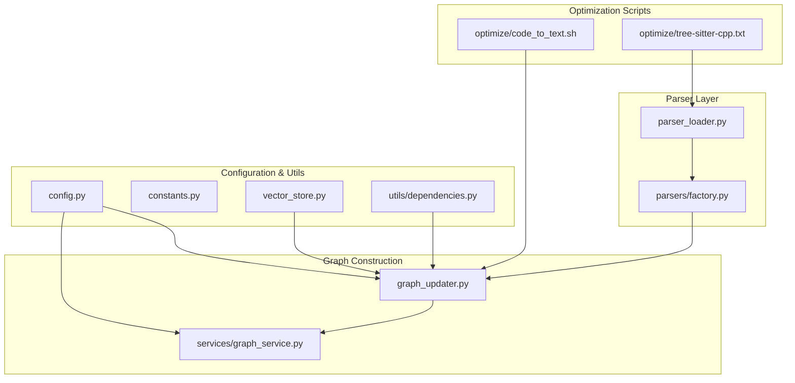
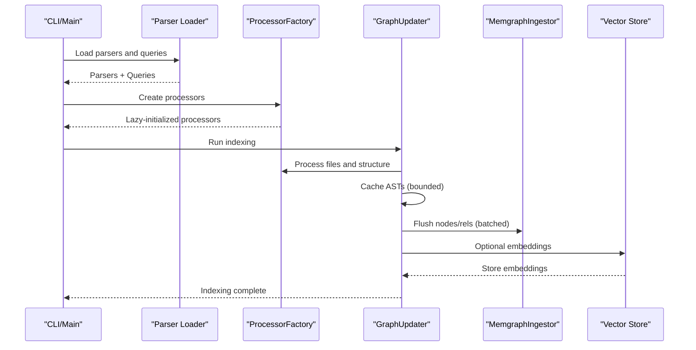
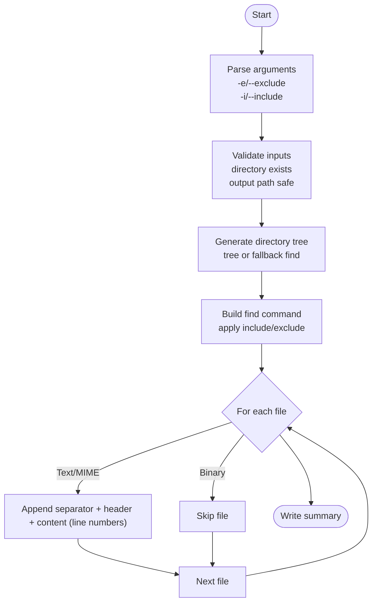
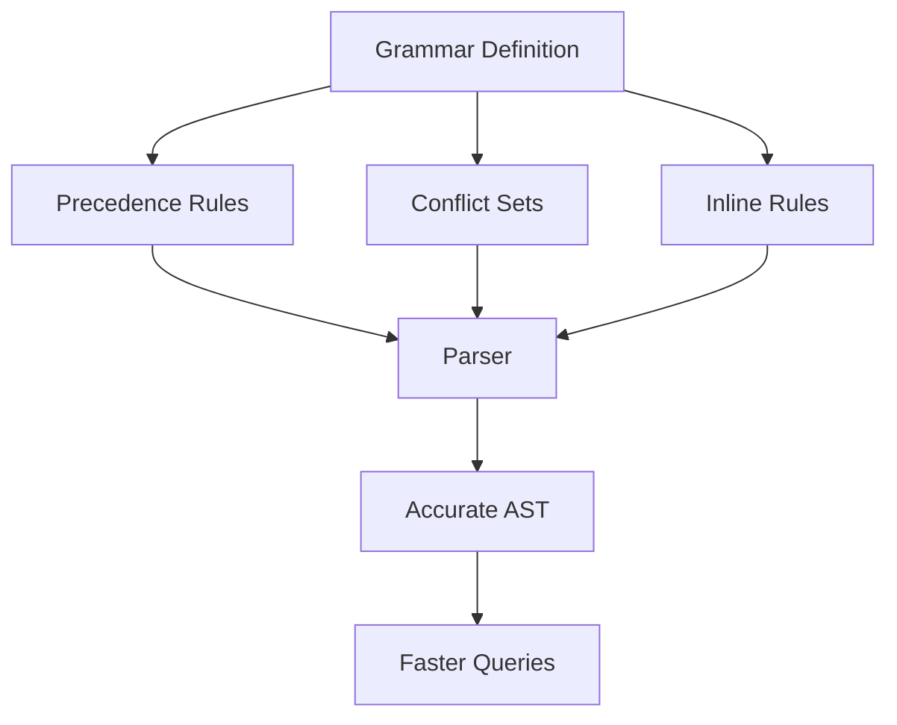
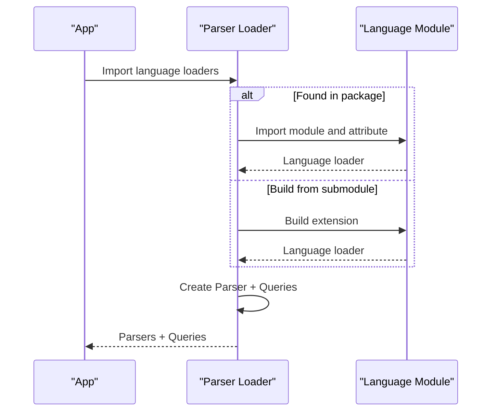
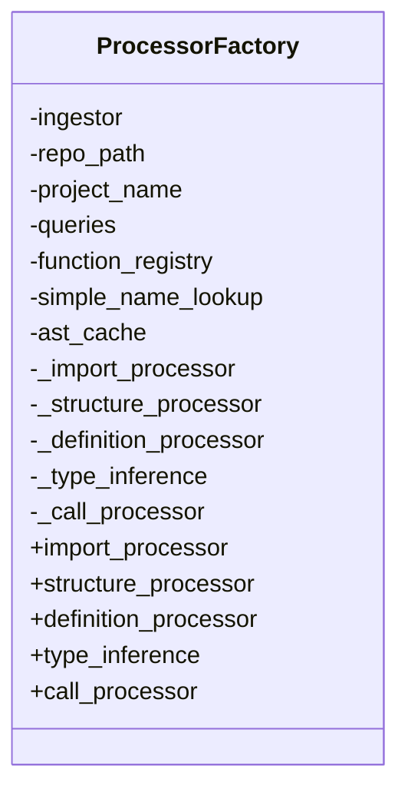
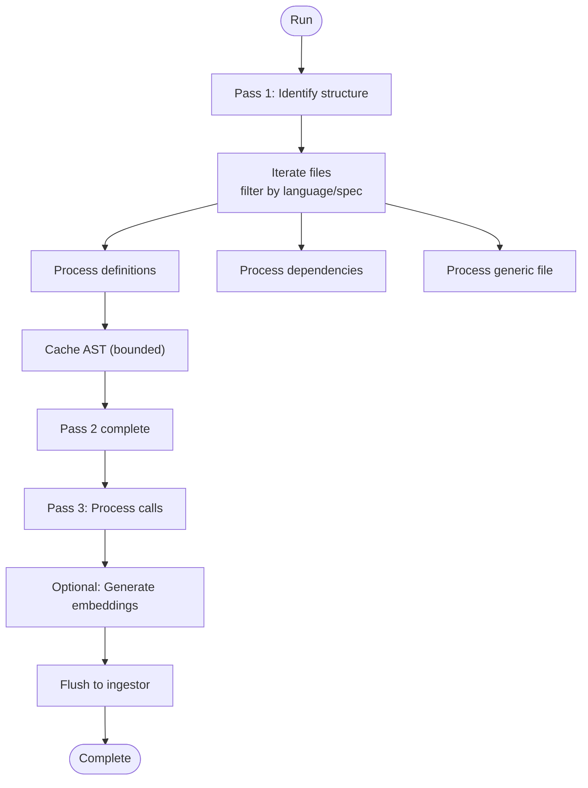
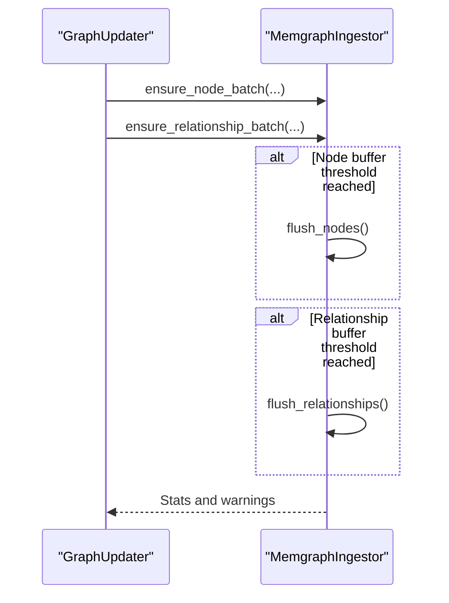
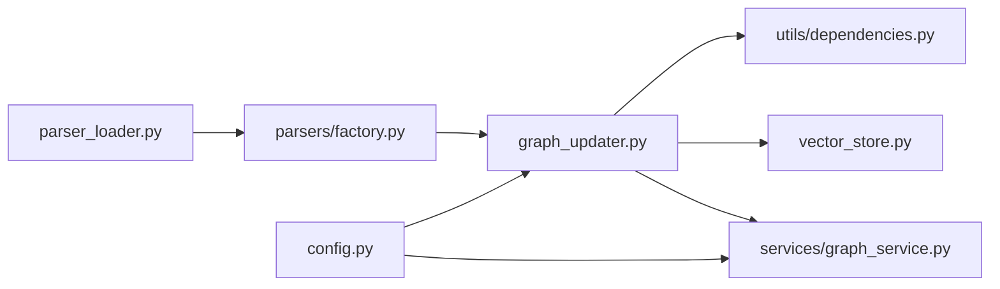

# Performance Optimization

<cite>
**Referenced Files in This Document**
- [optimize/code_to_text.sh](file://optimize/code_to_text.sh)
- [optimize/tree-sitter-cpp.txt](file://optimize/tree-sitter-cpp.txt)
- [codebase_rag/parser_loader.py](file://codebase_rag/parser_loader.py)
- [codebase_rag/parsers/factory.py](file://codebase_rag/parsers/factory.py)
- [codebase_rag/graph_updater.py](file://codebase_rag/graph_updater.py)
- [codebase_rag/services/graph_service.py](file://codebase_rag/services/graph_service.py)
- [codebase_rag/config.py](file://codebase_rag/config.py)
- [codebase_rag/constants.py](file://codebase_rag/constants.py)
- [codebase_rag/vector_store.py](file://codebase_rag/vector_store.py)
- [codebase_rag/utils/dependencies.py](file://codebase_rag/utils/dependencies.py)
- [codebase_rag/main.py](file://codebase_rag/main.py)
</cite>

## Table of Contents
1. [Introduction](#introduction)
2. [Project Structure](#project-structure)
3. [Core Components](#core-components)
4. [Architecture Overview](#architecture-overview)
5. [Detailed Component Analysis](#detailed-component-analysis)
6. [Dependency Analysis](#dependency-analysis)
7. [Performance Considerations](#performance-considerations)
8. [Troubleshooting Guide](#troubleshooting-guide)
9. [Conclusion](#conclusion)
10. [Appendices](#appendices)

## Introduction
This document provides a comprehensive guide to performance optimization strategies in Graph-Code. It focuses on:
- Generating optimized code context via the code_to_text.sh script and its impact on parsing throughput
- Tree-sitter grammar optimization techniques and language-specific tuning
- Memory usage optimization patterns including parser factory efficiency and bounded caches
- Batching strategies for large codebases and resource management
- Profiling and monitoring approaches
- Benchmarking methodologies and performance regression testing
- CPU and memory optimization tailored to different codebase sizes and complexity levels
- Bottleneck identification across parsing, graph construction, and query execution phases

## Project Structure
The performance-critical subsystems are organized around:
- Parser loading and language-specific grammars
- Processor factory for lazy instantiation of analyzers
- Graph updater orchestrating passes over files and caching ASTs
- Batched ingestion to Memgraph
- Optional semantic embeddings and vector store integration

**Diagram sources**
- [optimize/code_to_text.sh](file://optimize/code_to_text.sh#L1-L170)
- [optimize/tree-sitter-cpp.txt](file://optimize/tree-sitter-cpp.txt#L1-L12290)
- [codebase_rag/parser_loader.py](file://codebase_rag/parser_loader.py#L1-L293)
- [codebase_rag/parsers/factory.py](file://codebase_rag/parsers/factory.py#L1-L116)
- [codebase_rag/graph_updater.py](file://codebase_rag/graph_updater.py#L1-L469)
- [codebase_rag/services/graph_service.py](file://codebase_rag/services/graph_service.py#L1-L364)
- [codebase_rag/config.py](file://codebase_rag/config.py#L1-L274)
- [codebase_rag/constants.py](file://codebase_rag/constants.py#L1-L2757)
- [codebase_rag/vector_store.py](file://codebase_rag/vector_store.py#L1-L81)
- [codebase_rag/utils/dependencies.py](file://codebase_rag/utils/dependencies.py#L1-L45)

**Section sources**
- [optimize/code_to_text.sh](file://optimize/code_to_text.sh#L1-L170)
- [optimize/tree-sitter-cpp.txt](file://optimize/tree-sitter-cpp.txt#L1-L12290)
- [codebase_rag/parser_loader.py](file://codebase_rag/parser_loader.py#L1-L293)
- [codebase_rag/parsers/factory.py](file://codebase_rag/parsers/factory.py#L1-L116)
- [codebase_rag/graph_updater.py](file://codebase_rag/graph_updater.py#L1-L469)
- [codebase_rag/services/graph_service.py](file://codebase_rag/services/graph_service.py#L1-L364)
- [codebase_rag/config.py](file://codebase_rag/config.py#L1-L274)
- [codebase_rag/constants.py](file://codebase_rag/constants.py#L1-L2757)
- [codebase_rag/vector_store.py](file://codebase_rag/vector_store.py#L1-L81)
- [codebase_rag/utils/dependencies.py](file://codebase_rag/utils/dependencies.py#L1-L45)

## Core Components
- code_to_text.sh: Generates a single-file code context representation by walking the codebase, filtering binary files, and concatenating text with line numbers. This reduces downstream parsing overhead by consolidating inputs and enabling faster preprocessing.
- Tree-sitter grammar optimization: Language-specific grammars (e.g., tree-sitter-cpp) define precedence, conflicts, and inline rules to improve parsing accuracy and speed.
- Parser loader: Dynamically loads language grammars and builds parsers and queries, centralizing initialization costs.
- Processor factory: Lazy instantiation of processors (imports, structure, definitions, types, calls) to minimize memory footprint during startup.
- Graph updater: Orchestrates multi-pass processing, maintains an LRU-style bounded AST cache, and coordinates batching for embeddings.
- Batched ingestion: MemgraphIngestor buffers nodes and relationships and flushes in batches to reduce round-trips.
- Configuration and constants: Centralized tunables for batch sizes, cache limits, and thresholds.
- Vector store: Optional Qdrant-backed embedding storage with lazy client initialization.

**Section sources**
- [optimize/code_to_text.sh](file://optimize/code_to_text.sh#L1-L170)
- [optimize/tree-sitter-cpp.txt](file://optimize/tree-sitter-cpp.txt#L335-L800)
- [codebase_rag/parser_loader.py](file://codebase_rag/parser_loader.py#L170-L293)
- [codebase_rag/parsers/factory.py](file://codebase_rag/parsers/factory.py#L18-L116)
- [codebase_rag/graph_updater.py](file://codebase_rag/graph_updater.py#L162-L221)
- [codebase_rag/services/graph_service.py](file://codebase_rag/services/graph_service.py#L49-L364)
- [codebase_rag/config.py](file://codebase_rag/config.py#L54-L155)
- [codebase_rag/constants.py](file://codebase_rag/constants.py#L1126-L1126)
- [codebase_rag/vector_store.py](file://codebase_rag/vector_store.py#L1-L81)

## Architecture Overview
The pipeline integrates preprocessing, parsing, graph construction, and optional semantic enrichment.

**Diagram sources**
- [codebase_rag/parser_loader.py](file://codebase_rag/parser_loader.py#L276-L293)
- [codebase_rag/parsers/factory.py](file://codebase_rag/parsers/factory.py#L18-L116)
- [codebase_rag/graph_updater.py](file://codebase_rag/graph_updater.py#L264-L286)
- [codebase_rag/services/graph_service.py](file://codebase_rag/services/graph_service.py#L189-L328)
- [codebase_rag/vector_store.py](file://codebase_rag/vector_store.py#L27-L48)

## Detailed Component Analysis

### code_to_text.sh: Optimized Code Context Generation
- Traverses the codebase, generates a directory tree, and appends file contents with line numbers.
- Filters out binary files using MIME detection; includes JSON/XML/YAML safely.
- Uses arrays to construct safe find commands and supports include/exclude patterns.
- Produces a single consolidated text file for downstream processing.

**Diagram sources**
- [optimize/code_to_text.sh](file://optimize/code_to_text.sh#L54-L165)

**Section sources**
- [optimize/code_to_text.sh](file://optimize/code_to_text.sh#L1-L170)

### Tree-sitter Grammar Optimization (tree-sitter-cpp)
- Defines precedence and conflict sets to reduce backtracking and ambiguity resolution.
- Adds modern C++ constructs and attributes, ensuring accurate parsing of contemporary code.
- Inline rules and precedence adjustments improve parsing performance for complex expressions.

**Diagram sources**
- [optimize/tree-sitter-cpp.txt](file://optimize/tree-sitter-cpp.txt#L335-L436)

**Section sources**
- [optimize/tree-sitter-cpp.txt](file://optimize/tree-sitter-cpp.txt#L335-L800)

### Parser Loader: Efficient Grammar Loading and Query Building
- Attempts to import language loaders from installed packages; falls back to submodule build if needed.
- Builds parsers and queries per language, centralizing initialization costs.
- Provides helpers to combine import patterns and create optional queries.

**Diagram sources**
- [codebase_rag/parser_loader.py](file://codebase_rag/parser_loader.py#L17-L170)

**Section sources**
- [codebase_rag/parser_loader.py](file://codebase_rag/parser_loader.py#L170-L293)

### Processor Factory: Lazy Initialization and Resource Efficiency
- Defers creation of processors until first use, reducing peak memory during startup.
- Shares shared resources (ingestor, queries, caches) across processors.

**Diagram sources**
- [codebase_rag/parsers/factory.py](file://codebase_rag/parsers/factory.py#L18-L116)

**Section sources**
- [codebase_rag/parsers/factory.py](file://codebase_rag/parsers/factory.py#L18-L116)

### Graph Updater: Multi-Pass Processing with Bounded Caching
- Pass 1: Identify structure
- Pass 2: Process files, cache ASTs with bounded memory and entry counts
- Pass 3: Process function calls using cached ASTs
- Optional pass: Generate semantic embeddings and store in vector store

**Diagram sources**
- [codebase_rag/graph_updater.py](file://codebase_rag/graph_updater.py#L264-L286)
- [codebase_rag/graph_updater.py](file://codebase_rag/graph_updater.py#L319-L355)

**Section sources**
- [codebase_rag/graph_updater.py](file://codebase_rag/graph_updater.py#L223-L469)

### Batched Ingestion to Memgraph
- Buffers nodes and relationships separately and flushes when thresholds are met.
- Groups by label and relationship pattern to minimize query overhead.
- Emits progress and warnings for failures.

**Diagram sources**
- [codebase_rag/services/graph_service.py](file://codebase_rag/services/graph_service.py#L189-L328)

**Section sources**
- [codebase_rag/services/graph_service.py](file://codebase_rag/services/graph_service.py#L49-L364)

### Configuration and Constants: Tunables for Performance
- Batch sizes for Memgraph ingestion
- Cache limits (entries, memory, eviction divisor, memory threshold ratio)
- Semantic embedding progress interval and vector dimension
- Defaults for interactive and semantic operations

**Section sources**
- [codebase_rag/config.py](file://codebase_rag/config.py#L54-L155)
- [codebase_rag/constants.py](file://codebase_rag/constants.py#L1126-L1126)

### Vector Store Integration: Optional Semantic Embeddings
- Lazy client initialization and collection creation
- Upsert and search operations with configurable top-k

**Section sources**
- [codebase_rag/vector_store.py](file://codebase_rag/vector_store.py#L1-L81)

## Dependency Analysis
- Parser loader depends on language specs and dynamic imports; it can fall back to building from submodule.
- Graph updater depends on processor factory and ingestor; it also conditionally depends on semantic dependencies.
- Vector store depends on optional Qdrant client availability.

**Diagram sources**
- [codebase_rag/parser_loader.py](file://codebase_rag/parser_loader.py#L96-L170)
- [codebase_rag/parsers/factory.py](file://codebase_rag/parsers/factory.py#L18-L116)
- [codebase_rag/graph_updater.py](file://codebase_rag/graph_updater.py#L246-L256)
- [codebase_rag/services/graph_service.py](file://codebase_rag/services/graph_service.py#L49-L66)
- [codebase_rag/vector_store.py](file://codebase_rag/vector_store.py#L8-L25)
- [codebase_rag/utils/dependencies.py](file://codebase_rag/utils/dependencies.py#L15-L41)

**Section sources**
- [codebase_rag/parser_loader.py](file://codebase_rag/parser_loader.py#L96-L170)
- [codebase_rag/parsers/factory.py](file://codebase_rag/parsers/factory.py#L18-L116)
- [codebase_rag/graph_updater.py](file://codebase_rag/graph_updater.py#L246-L256)
- [codebase_rag/services/graph_service.py](file://codebase_rag/services/graph_service.py#L49-L66)
- [codebase_rag/vector_store.py](file://codebase_rag/vector_store.py#L8-L25)
- [codebase_rag/utils/dependencies.py](file://codebase_rag/utils/dependencies.py#L15-L41)

## Performance Considerations
- Preprocessing with code_to_text.sh reduces downstream parsing volume and improves I/O locality.
- Tree-sitter grammar tuning minimizes conflicts and improves parser throughput.
- Lazy processor instantiation reduces peak memory during startup.
- Bounded AST cache prevents unbounded memory growth; eviction policy balances entries and memory.
- Batched ingestion to Memgraph reduces network overhead and improves write throughput.
- Conditional semantic embedding avoids unnecessary work when dependencies are missing.
- Environment-driven configuration enables tuning for different environments and hardware profiles.

[No sources needed since this section provides general guidance]

## Troubleshooting Guide
- Parser loading failures: Verify language bindings installation or submodule build success; check debug logs for submodule load attempts.
- Missing semantic dependencies: Ensure Qdrant client and related packages are installed; embedding steps will be skipped otherwise.
- Batch size issues: Validate batch size is positive; adjust via configuration or CLI options.
- Cache eviction anomalies: Monitor cache metrics and adjust CACHE_MAX_ENTRIES and CACHE_MAX_MEMORY_MB accordingly.

**Section sources**
- [codebase_rag/parser_loader.py](file://codebase_rag/parser_loader.py#L17-L82)
- [codebase_rag/utils/dependencies.py](file://codebase_rag/utils/dependencies.py#L15-L41)
- [codebase_rag/config.py](file://codebase_rag/config.py#L227-L231)
- [codebase_rag/graph_updater.py](file://codebase_rag/graph_updater.py#L200-L221)

## Conclusion
By combining efficient preprocessing, tuned tree-sitter grammars, lazy initialization, bounded caching, and batched ingestion, Graph-Code achieves scalable performance across diverse codebases. Configuration and optional semantic capabilities allow tailoring performance to specific environments and workloads.

[No sources needed since this section summarizes without analyzing specific files]

## Appendices

### Benchmarking Methodologies and Regression Testing
- Establish baselines for parsing, graph construction, and query execution on representative codebases.
- Measure wall-clock time and memory usage for each phase; track cache hit rates and eviction frequency.
- Introduce controlled changes (grammar updates, cache limits, batch sizes) and compare metrics against baseline.
- Automate periodic runs to detect regressions; surface significant deviations in CI.

[No sources needed since this section provides general guidance]

### CPU and Memory Optimization Guidelines
- CPU:
  - Prefer tuned grammars and minimal conflict sets to reduce backtracking.
  - Use lazy initialization and bounded caches to cap memory spikes.
  - Increase batch sizes to amortize connection and parsing overhead.
- Memory:
  - Tune CACHE_MAX_ENTRIES and CACHE_MAX_MEMORY_MB to balance cache effectiveness and footprint.
  - Monitor eviction divisor and memory threshold ratio to adapt to workload characteristics.

[No sources needed since this section provides general guidance]