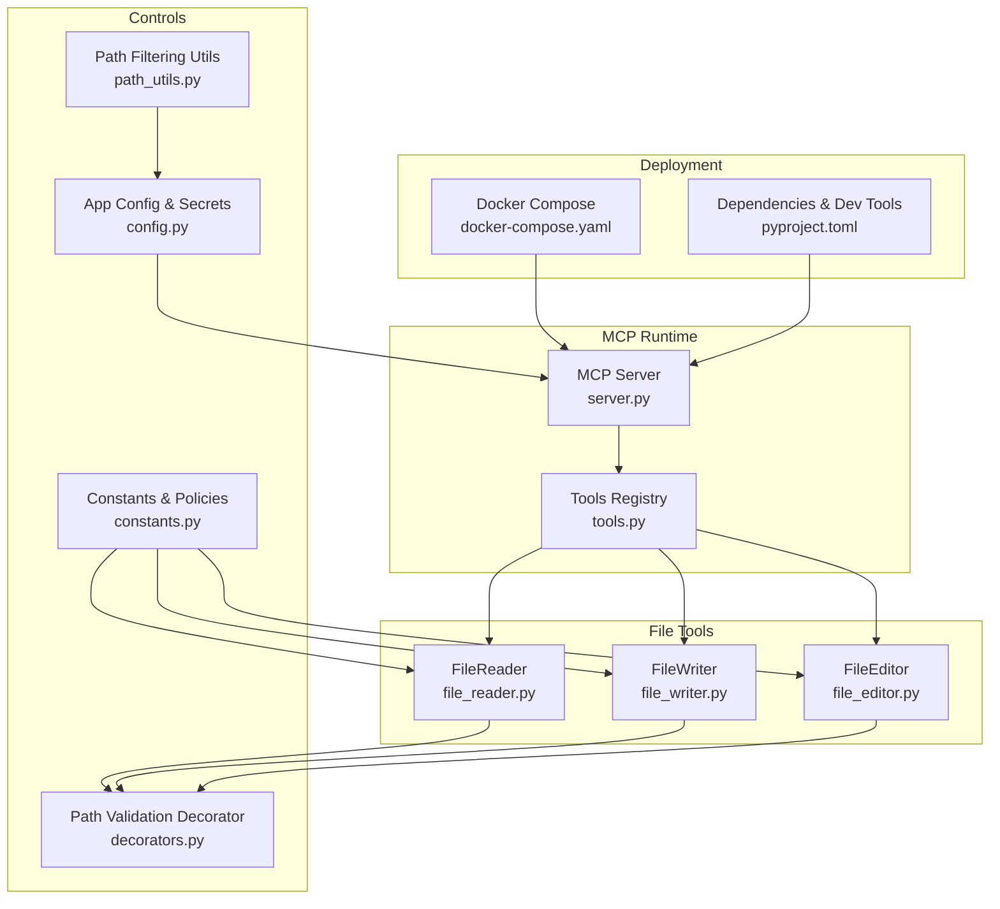
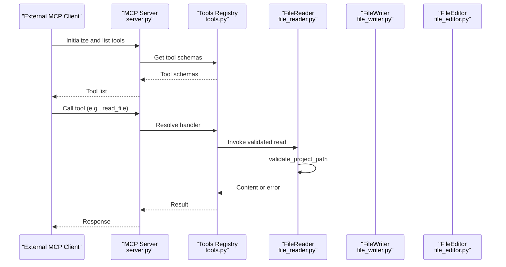
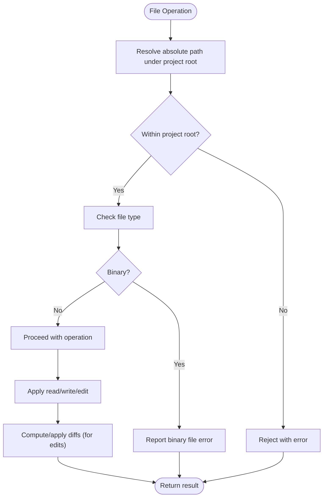
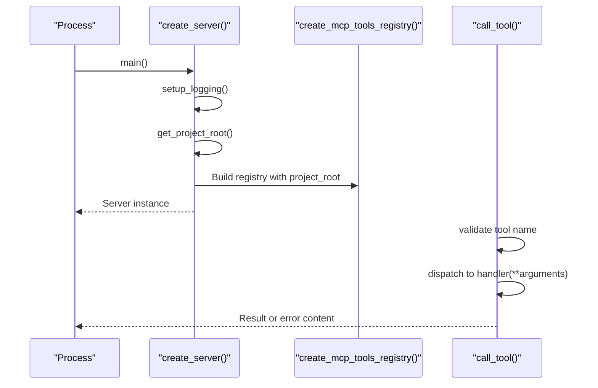
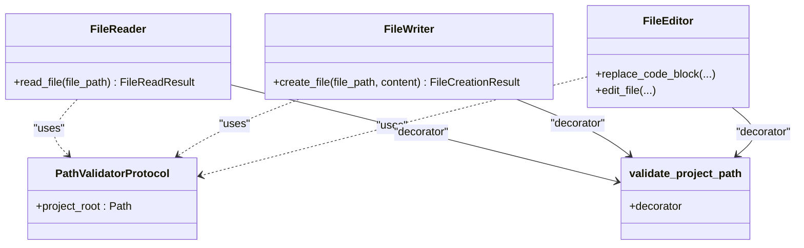
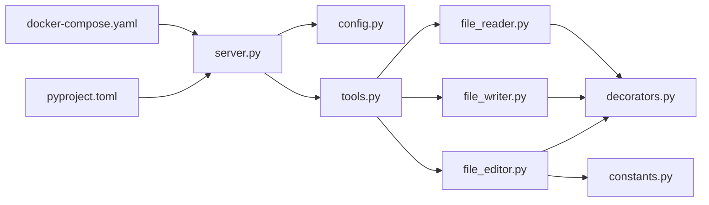

# Security Considerations

<cite>
**Referenced Files in This Document**
- [server.py](file://codebase_rag/mcp/server.py)
- [tools.py](file://codebase_rag/mcp/tools.py)
- [file_editor.py](file://codebase_rag/tools/file_editor.py)
- [file_reader.py](file://codebase_rag/tools/file_reader.py)
- [file_writer.py](file://codebase_rag/tools/file_writer.py)
- [decorators.py](file://codebase_rag/decorators.py)
- [config.py](file://codebase_rag/config.py)
- [constants.py](file://codebase_rag/constants.py)
- [path_utils.py](file://codebase_rag/utils/path_utils.py)
- [docker-compose.yaml](file://docker-compose.yaml)
- [pyproject.toml](file://pyproject.toml)
</cite>

## Table of Contents
1. [Introduction](#introduction)
2. [Project Structure](#project-structure)
3. [Core Components](#core-components)
4. [Architecture Overview](#architecture-overview)
5. [Detailed Component Analysis](#detailed-component-analysis)
6. [Dependency Analysis](#dependency-analysis)
7. [Performance Considerations](#performance-considerations)
8. [Troubleshooting Guide](#troubleshooting-guide)
9. [Conclusion](#conclusion)
10. [Appendices](#appendices)

## Introduction
This document provides enterprise-grade security guidance for Graph-Code, focusing on file system security, MCP server security, network exposure in Docker, data protection, access control, supply chain hygiene, monitoring, incident response, configuration and secrets handling, and compliance and audit requirements. It synthesizes security controls present in the codebase and highlights areas where explicit enterprise hardening should be applied.

## Project Structure
Security-relevant components are organized around:
- MCP server runtime and tool registries for controlled codebase access
- File system tools enforcing path containment and safe read/write/edit operations
- Configuration and environment-driven settings
- Docker Compose for containerized deployment and port exposure
- Dependency management and optional security tooling

**Diagram sources**
- [server.py](file://codebase_rag/mcp/server.py#L58-L135)
- [tools.py](file://codebase_rag/mcp/tools.py#L40-L249)
- [file_reader.py](file://codebase_rag/tools/file_reader.py#L16-L52)
- [file_writer.py](file://codebase_rag/tools/file_writer.py#L16-L39)
- [file_editor.py](file://codebase_rag/tools/file_editor.py#L22-L276)
- [decorators.py](file://codebase_rag/decorators.py#L55-L87)
- [config.py](file://codebase_rag/config.py#L39-L234)
- [constants.py](file://codebase_rag/constants.py#L45-L82)
- [path_utils.py](file://codebase_rag/utils/path_utils.py#L6-L27)
- [docker-compose.yaml](file://docker-compose.yaml#L1-L13)
- [pyproject.toml](file://pyproject.toml#L1-L126)

**Section sources**
- [server.py](file://codebase_rag/mcp/server.py#L1-L166)
- [tools.py](file://codebase_rag/mcp/tools.py#L1-L458)
- [file_reader.py](file://codebase_rag/tools/file_reader.py#L1-L67)
- [file_writer.py](file://codebase_rag/tools/file_writer.py#L1-L52)
- [file_editor.py](file://codebase_rag/tools/file_editor.py#L1-L296)
- [decorators.py](file://codebase_rag/decorators.py#L1-L161)
- [config.py](file://codebase_rag/config.py#L1-L274)
- [constants.py](file://codebase_rag/constants.py#L1-L800)
- [path_utils.py](file://codebase_rag/utils/path_utils.py#L1-L28)
- [docker-compose.yaml](file://docker-compose.yaml#L1-L13)
- [pyproject.toml](file://pyproject.toml#L1-L126)

## Core Components
- MCP Server: Initializes logging, resolves project root, constructs services, registers tools, and runs via stdio transport.
- Tools Registry: Provides typed tool schemas and handlers for codebase operations (read, write, edit, list, query).
- File Tools: Safe file read, write, and surgical edit with path containment checks and binary file safeguards.
- Path Validation Decorator: Enforces project-root containment and rejects out-of-tree paths.
- Configuration: Loads environment variables and .env, defines allowed shell commands and ports.
- Constants: Defines binary file types, encodings, and policy constants used by file tools.
- Docker Compose: Exposes Memgraph and Lab ports; environment-driven overrides.
- Dependencies: Includes security-focused libraries and optional dev/security tooling.

**Section sources**
- [server.py](file://codebase_rag/mcp/server.py#L58-L135)
- [tools.py](file://codebase_rag/mcp/tools.py#L40-L249)
- [file_reader.py](file://codebase_rag/tools/file_reader.py#L16-L52)
- [file_writer.py](file://codebase_rag/tools/file_writer.py#L16-L39)
- [file_editor.py](file://codebase_rag/tools/file_editor.py#L22-L276)
- [decorators.py](file://codebase_rag/decorators.py#L55-L87)
- [config.py](file://codebase_rag/config.py#L39-L234)
- [constants.py](file://codebase_rag/constants.py#L45-L82)
- [docker-compose.yaml](file://docker-compose.yaml#L1-L13)
- [pyproject.toml](file://pyproject.toml#L1-L126)

## Architecture Overview
The MCP server exposes a controlled set of tools to external clients. All file operations are validated against the configured project root and filtered for binary content. Configuration drives allowed commands and ports, while Docker Compose manages service exposure.

**Diagram sources**
- [server.py](file://codebase_rag/mcp/server.py#L96-L134)
- [tools.py](file://codebase_rag/mcp/tools.py#L433-L446)
- [file_reader.py](file://codebase_rag/tools/file_reader.py#L21-L52)
- [decorators.py](file://codebase_rag/decorators.py#L55-L87)

## Detailed Component Analysis

### File System Security Measures
- Path Containment: All file operations are decorated with a validator that resolves the absolute path under the project root and enforces containment. Attempts to escape the root are rejected.
- Binary File Handling: Reads explicitly reject binary file extensions and report decoding errors safely.
- Write Operation Validation: Writes create parent directories as needed and write UTF-8 text; errors are logged and returned as structured results.
- Surgical Edit Safety: Edits locate target blocks, compute diffs, and apply patches; failures are logged and surfaced conservatively.

**Diagram sources**
- [decorators.py](file://codebase_rag/decorators.py#L55-L87)
- [file_reader.py](file://codebase_rag/tools/file_reader.py#L25-L52)
- [file_writer.py](file://codebase_rag/tools/file_writer.py#L25-L39)
- [file_editor.py](file://codebase_rag/tools/file_editor.py#L209-L253)

**Section sources**
- [decorators.py](file://codebase_rag/decorators.py#L55-L87)
- [file_reader.py](file://codebase_rag/tools/file_reader.py#L16-L52)
- [file_writer.py](file://codebase_rag/tools/file_writer.py#L16-L39)
- [file_editor.py](file://codebase_rag/tools/file_editor.py#L22-L276)
- [constants.py](file://codebase_rag/constants.py#L50-L62)

### MCP Server Security
- Initialization and Logging: Server sets up logging with configurable levels and formats, aiding auditability.
- Project Root Resolution: Resolves target repository path from environment or settings, validates existence and type, and logs resolution.
- Tool Registration: Registers typed tools with JSON schemas; handlers enforce validation and return sanitized results.
- Error Handling: Exceptions are caught, logged, and wrapped in standardized error content to avoid leaking internal details.

**Diagram sources**
- [server.py](file://codebase_rag/mcp/server.py#L21-L135)
- [tools.py](file://codebase_rag/mcp/tools.py#L448-L457)

**Section sources**
- [server.py](file://codebase_rag/mcp/server.py#L21-L135)
- [tools.py](file://codebase_rag/mcp/tools.py#L40-L249)

### Network Security Considerations (Docker)
- Port Exposure: Memgraph and Lab services expose ports via environment variables. Ensure only necessary ports are published externally.
- Environment Overrides: Ports are configurable via environment variables in Compose, enabling isolation per environment.
- Recommendations:
  - Bind to localhost or internal networks only in production.
  - Use reverse proxies with authentication and TLS termination.
  - Restrict inbound firewall rules to trusted CIDRs.
  - Disable interactive dashboards in restricted environments.

**Section sources**
- [docker-compose.yaml](file://docker-compose.yaml#L1-L13)

### Data Protection
- Encodings: UTF-8 is used consistently for file I/O, reducing risk of encoding-related corruption.
- Binary File Handling: Explicitly rejects binary extensions and reports decoding errors safely.
- Secrets Management: Configuration loads from environment and .env; ensure secrets are managed externally and not committed.
- Encryption:
  - At rest: Store sensitive artifacts outside the repository or encrypt with OS-level mechanisms.
  - In transit: Use TLS for external integrations and reverse proxy termination.
- Retention: No built-in retention policies; implement lifecycle policies at storage and CI/CD layers.

**Section sources**
- [constants.py](file://codebase_rag/constants.py#L188-L189)
- [constants.py](file://codebase_rag/constants.py#L50-L62)
- [config.py](file://codebase_rag/config.py#L17-L234)

### Access Control Mechanisms
- Path Containment: Enforced by the path validation decorator for all file operations.
- Tool Approval: Some tools require explicit approval (e.g., surgical edit and create file), enabling human-in-the-loop for risky actions.
- Shell Command Allowlists: Configuration defines allowed commands and safe subsets, limiting arbitrary command execution.

**Diagram sources**
- [decorators.py](file://codebase_rag/decorators.py#L55-L87)
- [file_reader.py](file://codebase_rag/tools/file_reader.py#L25-L52)
- [file_writer.py](file://codebase_rag/tools/file_writer.py#L25-L39)
- [file_editor.py](file://codebase_rag/tools/file_editor.py#L259-L276)

**Section sources**
- [decorators.py](file://codebase_rag/decorators.py#L55-L87)
- [file_reader.py](file://codebase_rag/tools/file_reader.py#L16-L52)
- [file_writer.py](file://codebase_rag/tools/file_writer.py#L16-L39)
- [file_editor.py](file://codebase_rag/tools/file_editor.py#L22-L276)
- [config.py](file://codebase_rag/config.py#L82-L142)

### Supply Chain Security
- Dependencies: Explicit dependency list in project configuration; pin versions where feasible.
- Optional Security Tools: Dev dependency groups include bandit, semgrep, and ruff, indicating proactive linting and scanning practices.
- Recommendations:
  - Use lock files and SBOM generation.
  - Integrate dependency scanning in CI.
  - Monitor advisories and maintain an inventory of third-party components.

**Section sources**
- [pyproject.toml](file://pyproject.toml#L1-L126)

### Security Monitoring and Incident Response
- Logging: Centralized logging via loguru with configurable levels and formats; errors are captured and wrapped for MCP responses.
- Audit Trail: Logging records tool invocations, pagination headers, and errors; consider aggregating logs for centralized monitoring.
- Recommendations:
  - Forward logs to SIEM/observability platforms.
  - Define alerting thresholds for repeated tool errors and unauthorized path attempts.
  - Establish incident playbooks for file system violations and configuration drift.

**Section sources**
- [server.py](file://codebase_rag/mcp/server.py#L21-L27)
- [server.py](file://codebase_rag/mcp/server.py#L130-L134)
- [tools.py](file://codebase_rag/mcp/tools.py#L371-L407)

### Secure Configuration Management and Secrets Handling
- Environment Loading: Configuration loads from environment and .env; ensure .env is excluded from version control.
- Secret Placement: API keys and endpoints are environment-driven; manage via secret managers or platform vaults.
- Recommendations:
  - Use encrypted .env in CI/CD with strict permissions.
  - Rotate secrets regularly and revoke compromised keys.
  - Avoid embedding secrets in tool schemas or logs.

**Section sources**
- [config.py](file://codebase_rag/config.py#L17-L234)

### Compliance and Audit Trail Requirements
- Logging Format: Structured timestamps and messages support auditability.
- Tool Approvals: Some tools require explicit approval, supporting change governance.
- Recommendations:
  - Define retention and archival policies for logs and sessions.
  - Include compliance headers and audit fields in tool responses.
  - Periodically review tool schemas and handler access.

**Section sources**
- [constants.py](file://codebase_rag/constants.py#L616-L616)
- [file_editor.py](file://codebase_rag/tools/file_editor.py#L290-L295)
- [file_writer.py](file://codebase_rag/tools/file_writer.py#L46-L51)

## Dependency Analysis
The MCP server depends on configuration, logging, and tool registries. File tools depend on the path validation decorator and constants. Docker Compose ties services to environment variables.

**Diagram sources**
- [server.py](file://codebase_rag/mcp/server.py#L11-L18)
- [tools.py](file://codebase_rag/mcp/tools.py#L1-L37)
- [file_reader.py](file://codebase_rag/tools/file_reader.py#L1-L13)
- [file_writer.py](file://codebase_rag/tools/file_writer.py#L1-L13)
- [file_editor.py](file://codebase_rag/tools/file_editor.py#L1-L19)
- [decorators.py](file://codebase_rag/decorators.py#L1-L16)
- [docker-compose.yaml](file://docker-compose.yaml#L1-L13)
- [pyproject.toml](file://pyproject.toml#L1-L126)

**Section sources**
- [server.py](file://codebase_rag/mcp/server.py#L1-L166)
- [tools.py](file://codebase_rag/mcp/tools.py#L1-L458)
- [file_reader.py](file://codebase_rag/tools/file_reader.py#L1-L67)
- [file_writer.py](file://codebase_rag/tools/file_writer.py#L1-L52)
- [file_editor.py](file://codebase_rag/tools/file_editor.py#L1-L296)
- [decorators.py](file://codebase_rag/decorators.py#L1-L161)
- [docker-compose.yaml](file://docker-compose.yaml#L1-L13)
- [pyproject.toml](file://pyproject.toml#L1-L126)

## Performance Considerations
- Path validation adds minimal overhead by resolving and comparing paths.
- File operations are synchronous; consider async I/O for high-throughput scenarios.
- Logging verbosity can impact performance; tune levels appropriately in production.

[No sources needed since this section provides general guidance]

## Troubleshooting Guide
- Path Outside Root: Validate project root and ensure environment variables are set correctly.
- Binary File Read: Confirm file type and encoding; binary files are rejected.
- Write Failures: Verify permissions, parent directories, and disk space.
- Tool Errors: Review MCP server logs for wrapped error messages and stack traces.

**Section sources**
- [server.py](file://codebase_rag/mcp/server.py#L48-L54)
- [file_reader.py](file://codebase_rag/tools/file_reader.py#L33-L45)
- [file_writer.py](file://codebase_rag/tools/file_writer.py#L29-L39)
- [file_editor.py](file://codebase_rag/tools/file_editor.py#L248-L253)

## Conclusion
Graph-Code implements strong file system containment and safe I/O defaults. The MCP server centralizes tooling with validation and logging. Enterprise hardening should focus on Docker exposure controls, secrets management, encryption, supply chain scanning, and robust monitoring and incident response procedures.

[No sources needed since this section summarizes without analyzing specific files]

## Appendices
- Best Practices Checklist
  - Enforce path containment and approval gates for file edits.
  - Limit exposed ports and bind to internal networks.
  - Manage secrets via external vaults and rotate regularly.
  - Enable dependency scanning and SBOM generation.
  - Aggregate logs and configure alerts for suspicious activity.
  - Define retention and audit policies aligned with compliance needs.

[No sources needed since this section provides general guidance]