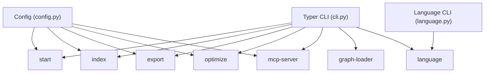
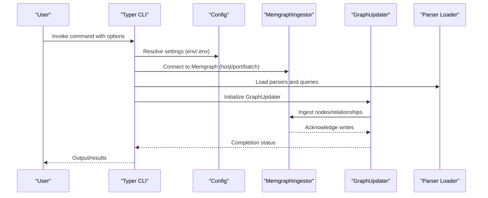
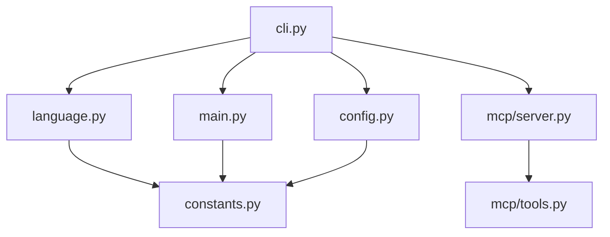

# CLI Reference

<cite>
**Referenced Files in This Document**
- [cli.py](file://codebase_rag/cli.py)
- [cli_help.py](file://codebase_rag/cli_help.py)
- [config.py](file://codebase_rag/config.py)
- [main.py](file://codebase_rag/main.py)
- [language.py](file://codebase_rag/tools/language.py)
- [server.py](file://codebase_rag/mcp/server.py)
- [tools.py](file://codebase_rag/mcp/tools.py)
- [constants.py](file://codebase_rag/constants.py)
- [README.md](file://README.md)
- [QUICK_START.md](file://QUICK_START.md)
- [graph_export_example.py](file://examples/graph_export_example.py)
- [test_cli_smoke.py](file://codebase_rag/tests/test_cli_smoke.py)
</cite>

## Table of Contents
1. [Introduction](#introduction)
2. [Project Structure](#project-structure)
3. [Core Components](#core-components)
4. [Architecture Overview](#architecture-overview)
5. [Detailed Component Analysis](#detailed-component-analysis)
6. [Dependency Analysis](#dependency-analysis)
7. [Performance Considerations](#performance-considerations)
8. [Troubleshooting Guide](#troubleshooting-guide)
9. [Conclusion](#conclusion)
10. [Appendices](#appendices)

## Introduction
This document provides comprehensive command-line interface (CLI) documentation for Graph-Code. It covers all available commands, their parameters, usage examples, and expected outputs. It also explains environment variable integration, configuration options, command combinations, and troubleshooting guidance. The CLI integrates with Memgraph for knowledge graph storage and retrieval, supports language grammar management, and includes an MCP server for Claude Code integration.

## Project Structure
The CLI is implemented as a Typer application with subcommands for startup, indexing, exporting, optimization, MCP server, graph loading, and language management. Configuration is managed via environment variables and a settings object. Language grammars are handled by a dedicated Click-based subcommand group.

**Diagram sources**
- [cli.py](file://codebase_rag/cli.py#L26-L395)
- [config.py](file://codebase_rag/config.py#L39-L234)
- [language.py](file://codebase_rag/tools/language.py#L374-L614)

**Section sources**
- [cli.py](file://codebase_rag/cli.py#L26-L395)
- [cli_help.py](file://codebase_rag/cli_help.py#L4-L91)
- [config.py](file://codebase_rag/config.py#L39-L234)

## Core Components
- Typer CLI application with global options and subcommands
- Configuration loader supporting environment variables and .env files
- Language management subcommands for grammar addition, listing, removal, and cleanup
- MCP server for integrating with Claude Code
- Graph loader for inspecting exported graph JSON

Key responsibilities:
- Parse CLI arguments and route to appropriate handlers
- Resolve configuration from environment variables
- Manage language grammars via Git submodules and configuration updates
- Start and run the MCP server with tool registries
- Load and summarize exported graph JSON files

**Section sources**
- [cli.py](file://codebase_rag/cli.py#L26-L395)
- [config.py](file://codebase_rag/config.py#L39-L234)
- [language.py](file://codebase_rag/tools/language.py#L374-L614)
- [server.py](file://codebase_rag/mcp/server.py#L58-L135)
- [tools.py](file://codebase_rag/mcp/tools.py#L40-L200)

## Architecture Overview
The CLI orchestrates several subsystems:
- Configuration and settings resolution
- Memgraph connectivity and graph operations
- Parser and query loading for codebase analysis
- Language grammar management
- MCP tool registry and server lifecycle

**Diagram sources**
- [cli.py](file://codebase_rag/cli.py#L107-L162)
- [main.py](file://codebase_rag/main.py#L737-L742)
- [main.py](file://codebase_rag/main.py#L745-L766)
- [config.py](file://codebase_rag/config.py#L227-L231)

## Detailed Component Analysis

### Global Options and Help
- Global option: --quiet/-q suppresses non-essential output and redirects logs to console.

Behavior:
- Sets a global quiet flag in settings
- Removes default logger and adds a console sink when quiet is enabled

**Section sources**
- [cli.py](file://codebase_rag/cli.py#L34-L48)
- [config.py](file://codebase_rag/config.py#L161-L161)

### Command: start
Purpose:
- Start an interactive chat session with the codebase
- Optionally update the knowledge graph, clean the database, and export after update

Parameters:
- --repo-path: Target repository path for retrieval
- --update-graph: Update the knowledge graph by parsing the repository
- --clean: Clean the database before updating (use when adding first repo)
- -o/--output: Export graph to JSON file after updating (requires --update-graph)
- --orchestrator: Specify orchestrator as provider:model (e.g., ollama:llama3.2, openai:gpt-4, google:gemini-2.5-pro)
- --cypher: Specify cypher model as provider:model (e.g., ollama:codellama, google:gemini-2.5-flash)
- --no-confirm: Disable confirmation prompts for edit operations
- --batch-size: Number of buffered nodes/relationships before flushing to Memgraph
- --exclude: Additional directories to exclude from indexing (can be specified multiple times)
- --interactive-setup: Show interactive prompt to select which detected directories to keep

Validation and behavior:
- If --output is provided without --update-graph, prints an error and exits
- Updates model settings for orchestrator and cypher
- Resolves effective batch size from CLI or settings
- When updating graph:
  - Loads .cgrignore patterns and merges with CLI excludes
  - Optionally prompts for unignored directories when interactive setup is enabled
  - Ensures constraints and cleans database if requested
  - Runs GraphUpdater to parse and ingest
  - Exports to JSON if requested
- Without update-graph, runs the main async loop for interactive chat

Expected outputs:
- Progress messages indicating actions (updating graph, cleaning DB, exporting)
- Success messages upon completion
- Error messages for invalid configurations or failures

Common workflows:
- Initial setup: start --update-graph --clean --output exported_graph.json
- Incremental updates: start --update-graph --output exported_graph.json
- Interactive chat: start

Parameter conflicts:
- --output requires --update-graph

Environment integration:
- TARGET_REPO_PATH defaults to current directory if not provided
- Quiet mode affects logging verbosity

**Section sources**
- [cli.py](file://codebase_rag/cli.py#L55-L172)
- [config.py](file://codebase_rag/config.py#L227-L231)
- [cli_help.py](file://codebase_rag/cli_help.py#L34-L80)

### Command: index
Purpose:
- Index a codebase to protobuf files for offline use

Parameters:
- --repo-path: Target repository path to index
- -o/--output-proto-dir: Required. Path to the output directory for the protobuf index file(s)
- --split-index: Write index to separate nodes.bin and relationships.bin files
- --exclude: Additional directories to exclude from indexing (can be specified multiple times)
- --interactive-setup: Show interactive prompt to select which detected directories to keep

Behavior:
- Resolves repository path and loads .cgrignore patterns
- Merges CLI excludes with ignored/unignored patterns
- Initializes ProtobufFileIngestor and GraphUpdater
- Runs GraphUpdater to produce protobuf index
- Prints success message upon completion

Expected outputs:
- Progress messages indicating indexing location and output directory
- Success message when indexing completes

Common workflows:
- Offline indexing: index -o ./proto_index

**Section sources**
- [cli.py](file://codebase_rag/cli.py#L174-L234)
- [cli_help.py](file://codebase_rag/cli_help.py#L56-L80)

### Command: export
Purpose:
- Export knowledge graph from Memgraph to JSON file

Parameters:
- -o/--output: Output file path for the exported graph
- --json/--no-json: Export in JSON format (only JSON is supported)
- --batch-size: Number of buffered nodes/relationships before flushing to Memgraph

Behavior:
- Validates that JSON format is selected
- Resolves effective batch size
- Connects to Memgraph and exports graph to JSON
- Prints statistics (node count, relationship count)

Expected outputs:
- Connection and export progress messages
- Success message with file path and statistics

Common workflows:
- Export graph: export -o exported_graph.json

**Section sources**
- [cli.py](file://codebase_rag/cli.py#L237-L271)
- [main.py](file://codebase_rag/main.py#L745-L766)
- [cli_help.py](file://codebase_rag/cli_help.py#L55-L66)

### Command: optimize
Purpose:
- AI-guided codebase optimization session

Parameters:
- language (argument): Programming language to optimize for (e.g., python, java, javascript, cpp)
- --repo-path: Path to the repository to optimize
- --reference-document: Path to reference document/book for optimization guidance
- --orchestrator: Specify orchestrator as provider:model
- --cypher: Specify cypher model as provider:model
- --no-confirm: Disable confirmation prompts for edit operations
- --batch-size: Number of buffered nodes/relationships before flushing to Memgraph

Behavior:
- Updates model settings for orchestrator and cypher
- Resolves effective batch size
- Runs the optimization loop with the specified language and optional reference document

Expected outputs:
- Optimization session UI and tool approvals
- Success messages upon completion

Common workflows:
- Optimize Python: optimize python --reference-document guidelines.md
- Optimize with custom models: optimize java --orchestrator openai:gpt-4o

**Section sources**
- [cli.py](file://codebase_rag/cli.py#L273-L330)
- [cli_help.py](file://codebase_rag/cli_help.py#L61-L66)

### Command: mcp-server
Purpose:
- Start the MCP server for Claude Code integration

Behavior:
- Creates MCP server with tool registry
- Resolves project root from environment or settings
- Initializes MemgraphIngestor and CypherGenerator
- Starts stdio server and handles tool calls

Expected outputs:
- Server initialization and connection logs
- Tool listing and execution responses

Common workflows:
- Start server: mcp-server

Environment integration:
- TARGET_REPO_PATH influences project root resolution
- MEMGRAPH_HOST and MEMGRAPH_PORT are used for connection

**Section sources**
- [cli.py](file://codebase_rag/cli.py#L332-L350)
- [server.py](file://codebase_rag/mcp/server.py#L58-L135)
- [tools.py](file://codebase_rag/mcp/tools.py#L40-L200)

### Command: graph-loader
Purpose:
- Load and display summary of exported graph JSON

Parameters:
- graph-file (argument): Path to the exported graph JSON file

Behavior:
- Loads graph and prints a summary including total nodes, relationships, node types, relationship types, and export timestamp

Expected outputs:
- Summary table with counts and types
- Success message upon completion

Common workflows:
- Inspect graph: graph-loader exported_graph.json

**Section sources**
- [cli.py](file://codebase_rag/cli.py#L352-L382)
- [graph_export_example.py](file://examples/graph_export_example.py#L66-L87)

### Command: language
Purpose:
- Manage language grammars (add, remove, list, cleanup)

Subcommands:
- language add [language_name] [--grammar-url URL]
  - Adds a new language grammar via Git submodule
  - Detects language name and extensions from tree-sitter JSON or prompts user
  - Parses node types and categorizes into functions, classes, modules, calls
  - Updates language configuration
- language list
  - Lists all configured languages with extensions and categorized node types
- language remove LANGUAGE_NAME [--keep-submodule]
  - Removes language from configuration and optionally keeps Git submodule
- language cleanup
  - Removes orphaned Git submodules

Behavior:
- Uses Click for subcommands
- Manages Git submodules and language specs
- Provides interactive prompts for missing information
- Updates configuration file atomically

Expected outputs:
- Progress messages for submodule operations
- Success messages for add/remove/cleanup
- Error messages for failures

Common workflows:
- Add grammar: language add python --grammar-url https://github.com/tree-sitter/tree-sitter-python
- List languages: language list
- Remove language: language remove python

**Section sources**
- [cli.py](file://codebase_rag/cli.py#L384-L391)
- [language.py](file://codebase_rag/tools/language.py#L374-L614)

## Dependency Analysis
The CLI depends on configuration settings, Memgraph connectivity, parser/query loaders, and language specifications. The language management subcommands depend on Git operations and configuration file manipulation.

**Diagram sources**
- [cli.py](file://codebase_rag/cli.py#L10-L24)
- [config.py](file://codebase_rag/config.py#L39-L234)
- [main.py](file://codebase_rag/main.py#L31-L63)
- [language.py](file://codebase_rag/tools/language.py#L18-L21)
- [server.py](file://codebase_rag/mcp/server.py#L11-L18)
- [tools.py](file://codebase_rag/mcp/tools.py#L6-L14)
- [constants.py](file://codebase_rag/constants.py#L1-L200)

**Section sources**
- [cli.py](file://codebase_rag/cli.py#L10-L24)
- [config.py](file://codebase_rag/config.py#L39-L234)
- [main.py](file://codebase_rag/main.py#L31-L63)
- [language.py](file://codebase_rag/tools/language.py#L18-L21)
- [server.py](file://codebase_rag/mcp/server.py#L11-L18)
- [tools.py](file://codebase_rag/mcp/tools.py#L6-L14)
- [constants.py](file://codebase_rag/constants.py#L1-L200)

## Performance Considerations
- Batch size tuning:
  - Use --batch-size to control buffering to Memgraph
  - Larger batches improve throughput but increase memory usage
  - Default batch size is configurable via settings
- Export performance:
  - Export connects to Memgraph and streams graph data to JSON
  - Large graphs may take significant time; monitor progress messages
- Indexing performance:
  - Protobuf index writing can be split into separate files with --split-index
  - Exclusions reduce parsing overhead; use --exclude and --interactive-setup judiciously
- Model selection:
  - Choose appropriate providers and models for orchestrator and cypher
  - Cloud models may introduce latency; local models (Ollama) can be faster for repeated operations

Best practices:
- Start with default batch size and adjust based on available memory and performance
- Use exclusions to focus on relevant directories
- Prefer incremental updates (--update-graph) rather than full rebuilds when possible
- For large repositories, consider splitting index files to improve I/O performance

**Section sources**
- [config.py](file://codebase_rag/config.py#L54-L56)
- [config.py](file://codebase_rag/config.py#L227-L231)
- [cli.py](file://codebase_rag/cli.py#L118-L120)
- [cli.py](file://codebase_rag/cli.py#L256-L256)

## Troubleshooting Guide
Common errors and resolutions:
- Parameter conflicts:
  - Using --output without --update-graph in start command results in an error; add --update-graph
- Invalid batch size:
  - Batch size must be positive; ensure --batch-size >= 1
- Export format:
  - Only JSON format is supported for export; avoid disabling JSON
- MCP server configuration:
  - Ensure TARGET_REPO_PATH is set or inferable; verify Memgraph connectivity
- Language management:
  - Git submodule errors during add/remove; follow manual cleanup hints if automatic fails
  - Missing grammar URL; use default URL or specify a valid tree-sitter grammar repository

Diagnostic tips:
- Use --quiet to reduce noise and focus on essential messages
- Review logs for detailed error information
- Validate environment variables and .env file contents

**Section sources**
- [cli.py](file://codebase_rag/cli.py#L112-L116)
- [cli.py](file://codebase_rag/cli.py#L250-L252)
- [config.py](file://codebase_rag/config.py#L229-L231)
- [server.py](file://codebase_rag/mcp/server.py#L30-L55)
- [language.py](file://codebase_rag/tools/language.py#L56-L72)

## Conclusion
The Graph-Code CLI provides a comprehensive toolkit for parsing repositories, querying codebases, exporting graphs, optimizing code, managing language grammars, and integrating with Claude Code via MCP. By leveraging environment variables and configuration settings, users can tailor the CLI to their infrastructure and workflows. Proper use of batch sizes, exclusions, and model selection ensures optimal performance and reliability.

## Appendices

### Environment Variables and Configuration
- Memgraph connectivity:
  - MEMGRAPH_HOST, MEMGRAPH_PORT, MEMGRAPH_HTTP_PORT
- Orchestrator and Cypher models:
  - ORCHESTRATOR_PROVIDER, ORCHESTRATOR_MODEL, ORCHESTRATOR_API_KEY, ORCHESTRATOR_ENDPOINT, ORCHESTRATOR_PROJECT_ID, ORCHESTRATOR_REGION, ORCHESTRATOR_PROVIDER_TYPE, ORCHESTRATOR_THINKING_BUDGET, ORCHESTRATOR_SERVICE_ACCOUNT_FILE
  - CYPHER_PROVIDER, CYPHER_MODEL, CYPHER_API_KEY, CYPHER_ENDPOINT, CYPHER_PROJECT_ID, CYPHER_REGION, CYPHER_PROVIDER_TYPE, CYPHER_THINKING_BUDGET, CYPHER_SERVICE_ACCOUNT_FILE
- General settings:
  - TARGET_REPO_PATH, MEMGRAPH_BATCH_SIZE, SHELL_COMMAND_TIMEOUT, SHELL_COMMAND_ALLOWLIST, SHELL_READ_ONLY_COMMANDS, SHELL_SAFE_GIT_SUBCOMMANDS
- MCP server:
  - TARGET_REPO_PATH influences project root resolution
- Quiet mode:
  - CGR_QUIET controls non-essential output suppression

**Section sources**
- [config.py](file://codebase_rag/config.py#L50-L113)
- [config.py](file://codebase_rag/config.py#L158-L234)
- [server.py](file://codebase_rag/mcp/server.py#L30-L55)

### Practical Workflows and Examples
- Parsing repositories:
  - Initial setup: start --update-graph --clean --output exported_graph.json
  - Incremental updates: start --update-graph --output exported_graph.json
- Querying codebases:
  - Interactive chat: start
  - Optimization: optimize python --reference-document guidelines.md
- Exporting graphs:
  - export -o exported_graph.json
- Indexing for offline use:
  - index -o ./proto_index
- Managing languages:
  - Add grammar: language add python --grammar-url https://github.com/tree-sitter/tree-sitter-python
  - List languages: language list
  - Remove language: language remove python
- MCP server:
  - Start server: mcp-server

**Section sources**
- [cli.py](file://codebase_rag/cli.py#L55-L172)
- [cli.py](file://codebase_rag/cli.py#L174-L234)
- [cli.py](file://codebase_rag/cli.py#L237-L271)
- [cli.py](file://codebase_rag/cli.py#L273-L330)
- [language.py](file://codebase_rag/tools/language.py#L374-L614)
- [server.py](file://codebase_rag/mcp/server.py#L138-L160)

### Command Reference Summary
- start: Interactive chat and/or graph update with export
- index: Protobuf index generation
- export: Graph export to JSON
- optimize: AI-guided optimization session
- mcp-server: MCP server for Claude Code
- graph-loader: Summarize exported graph JSON
- language: Grammar management (add, list, remove, cleanup)

**Section sources**
- [cli.py](file://codebase_rag/cli.py#L55-L382)
- [cli_help.py](file://codebase_rag/cli_help.py#L82-L91)