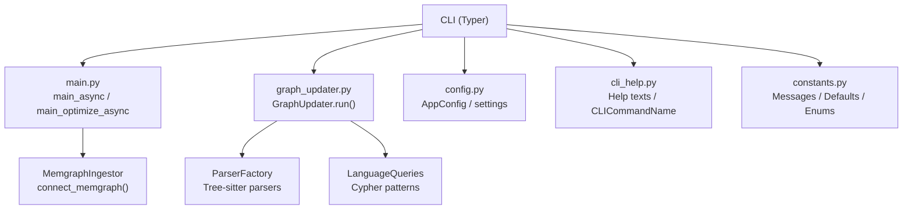
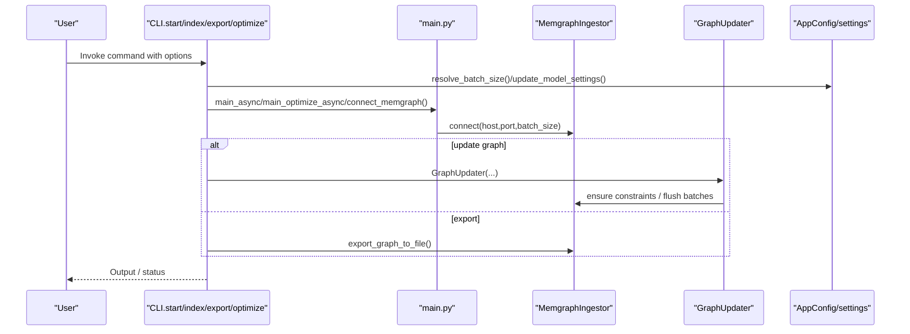
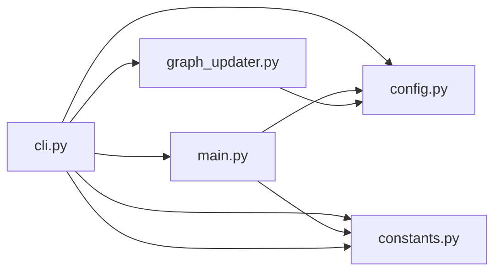

# Core Commands

<cite>
**Referenced Files in This Document**
- [cli.py](file://codebase_rag/cli.py)
- [cli_help.py](file://codebase_rag/cli_help.py)
- [main.py](file://codebase_rag/main.py)
- [graph_updater.py](file://codebase_rag/graph_updater.py)
- [config.py](file://codebase_rag/config.py)
- [constants.py](file://codebase_rag/constants.py)
- [README.md](file://README.md)
</cite>

## Table of Contents
1. [Introduction](#introduction)
2. [Project Structure](#project-structure)
3. [Core Components](#core-components)
4. [Architecture Overview](#architecture-overview)
5. [Detailed Component Analysis](#detailed-component-analysis)
6. [Dependency Analysis](#dependency-analysis)
7. [Performance Considerations](#performance-considerations)
8. [Troubleshooting Guide](#troubleshooting-guide)
9. [Conclusion](#conclusion)
10. [Appendices](#appendices)

## Introduction
This document provides comprehensive documentation for the Graph-Code core commands: start, index, export, and optimize. It explains functionality, parameters, usage examples, expected outputs, and operational workflows. It also covers command-line arguments such as --repo-path, --batch-size, --orchestrator, and --cypher, along with validation, error handling, and best practices for performance and reliability.

## Project Structure
The CLI is implemented using Typer and delegates to the main application logic and services:
- CLI entrypoints and command definitions live in the CLI module.
- The main application orchestrates model initialization, agent creation, and interactive loops.
- GraphUpdater coordinates parsing, ingestion, and graph updates.
- Configuration and constants define defaults, validation, and messaging.

**Diagram sources**
- [cli.py](file://codebase_rag/cli.py#L26-L395)
- [main.py](file://codebase_rag/main.py#L1011-L1062)
- [graph_updater.py](file://codebase_rag/graph_updater.py#L223-L469)
- [config.py](file://codebase_rag/config.py#L39-L234)
- [cli_help.py](file://codebase_rag/cli_help.py#L4-L90)
- [constants.py](file://codebase_rag/constants.py#L209-L277)

**Section sources**
- [cli.py](file://codebase_rag/cli.py#L26-L395)
- [main.py](file://codebase_rag/main.py#L1011-L1062)
- [graph_updater.py](file://codebase_rag/graph_updater.py#L223-L469)
- [config.py](file://codebase_rag/config.py#L39-L234)
- [cli_help.py](file://codebase_rag/cli_help.py#L4-L90)
- [constants.py](file://codebase_rag/constants.py#L209-L277)

## Core Components
- CLI module defines commands and their options, including validation and error handling.
- Main module initializes configuration, connects to Memgraph, and runs interactive loops.
- GraphUpdater performs multi-pass parsing, relationship discovery, and optional semantic embeddings.
- Configuration module resolves defaults and validates model settings.
- Constants module centralizes messages, defaults, and enumerations.

**Section sources**
- [cli.py](file://codebase_rag/cli.py#L55-L330)
- [main.py](file://codebase_rag/main.py#L1011-L1062)
- [graph_updater.py](file://codebase_rag/graph_updater.py#L223-L469)
- [config.py](file://codebase_rag/config.py#L227-L234)
- [constants.py](file://codebase_rag/constants.py#L209-L277)

## Architecture Overview
The core commands share a common runtime:
- They connect to Memgraph via a shared ingestor.
- They can override model settings via --orchestrator and --cypher.
- They support batching via --batch-size to tune throughput and memory usage.
- Some commands export data to JSON for downstream analysis.

**Diagram sources**
- [cli.py](file://codebase_rag/cli.py#L55-L330)
- [main.py](file://codebase_rag/main.py#L737-L766)
- [graph_updater.py](file://codebase_rag/graph_updater.py#L264-L286)
- [config.py](file://codebase_rag/config.py#L227-L234)

## Detailed Component Analysis

### Command: start
Purpose:
- Start an interactive chat session with the codebase.
- Optionally update the knowledge graph by parsing a repository and export to JSON.

Key parameters:
- --repo-path: Target repository path (defaults to settings.TARGET_REPO_PATH).
- --update-graph: Enable graph update mode.
- --clean: Clean database before update (useful for first-time ingestion).
- -o/--output: Export graph to JSON after update (requires --update-graph).
- --orchestrator: Provider:model for the orchestrator model.
- --cypher: Provider:model for the Cypher model.
- --no-confirm: Disable edit confirmations (YOLO mode).
- --batch-size: Override Memgraph batch size.
- --exclude: Additional directories to exclude (can be repeated).
- --interactive-setup: Interactively select directories to keep.

Behavior:
- Validates that --output requires --update-graph.
- Resolves effective batch size via settings.resolve_batch_size().
- In update mode:
  - Loads .cgrignore patterns and merges with CLI excludes.
  - Optionally prompts for interactive selection of directories to keep.
  - Ensures constraints and cleans database if requested.
  - Runs GraphUpdater to parse files, discover relationships, and generate embeddings.
  - Exports to JSON if requested.
- Without update mode, starts interactive chat loop.

Expected outputs:
- Progress messages for parsing passes.
- Summary of generated embeddings.
- Success message upon completion.

Validation and errors:
- Raises typer.Exit(1) on invalid combinations (e.g., --output without --update-graph).
- Catches ValueError and prints startup error message.

Examples:
- First-time ingestion with cleaning and export:
  - cgr start --repo-path /path/to/repo --update-graph --clean -o graph.json
- Incremental update for additional repositories:
  - cgr start --repo-path /path/to/repo2 --update-graph
- Interactive exclusion:
  - cgr start --repo-path /path/to/repo --update-graph --interactive-setup
- Chat-only mode:
  - cgr start --repo-path /path/to/repo

**Section sources**
- [cli.py](file://codebase_rag/cli.py#L55-L172)
- [main.py](file://codebase_rag/main.py#L1011-L1028)
- [graph_updater.py](file://codebase_rag/graph_updater.py#L264-L286)
- [config.py](file://codebase_rag/config.py#L227-L234)
- [constants.py](file://codebase_rag/constants.py#L209-L240)
- [README.md](file://README.md#L258-L280)

### Command: index
Purpose:
- Index a repository to protobuf files for offline use.

Key parameters:
- --repo-path: Target repository path.
- -o/--output-proto-dir: Required. Output directory for protobuf index files.
- --split-index: Write index to separate nodes.bin and relationships.bin files.
- --exclude: Additional directories to exclude (can be repeated).
- --interactive-setup: Interactively select directories to keep.

Behavior:
- Loads .cgrignore patterns and merges with CLI excludes.
- Optionally prompts for interactive selection of directories to keep.
- Uses ProtobufFileIngestor to write index files.
- Runs GraphUpdater to parse and structure the codebase.

Expected outputs:
- Messages indicating indexing progress and completion.

Validation and errors:
- Wraps exceptions in CLI error messages and exits with non-zero status.

Examples:
- Basic indexing:
  - cgr index --repo-path /path/to/repo -o ./out
- Split index:
  - cgr index --repo-path /path/to/repo -o ./out --split-index

**Section sources**
- [cli.py](file://codebase_rag/cli.py#L174-L235)
- [graph_updater.py](file://codebase_rag/graph_updater.py#L223-L469)
- [config.py](file://codebase_rag/config.py#L242-L274)
- [constants.py](file://codebase_rag/constants.py#L191-L195)

### Command: export
Purpose:
- Export the knowledge graph from Memgraph to a JSON file.

Key parameters:
- -o/--output: Required. Output file path.
- --json/--no-json: Only JSON format is supported.
- --batch-size: Override Memgraph batch size.

Behavior:
- Connects to Memgraph with the effective batch size.
- Calls export_graph_to_file to serialize the graph and print stats.

Expected outputs:
- Success message with file path and counts of nodes/relationships.

Validation and errors:
- Enforces JSON-only format and exits with non-zero status on failure.

Examples:
- Export with default batch size:
  - cgr export -o graph.json
- Adjust batch size:
  - cgr export -o graph.json --batch-size 5000

**Section sources**
- [cli.py](file://codebase_rag/cli.py#L237-L271)
- [main.py](file://codebase_rag/main.py#L745-L766)
- [constants.py](file://codebase_rag/constants.py#L209-L213)

### Command: optimize
Purpose:
- AI-guided codebase optimization session for a specific language.

Key parameters:
- language (argument): Programming language to optimize for (e.g., python, java, javascript, cpp).
- --repo-path: Target repository path.
- --reference-document: Path to a reference document to guide optimization.
- --orchestrator: Provider:model for the orchestrator model.
- --cypher: Provider:model for the Cypher model.
- --no-confirm: Disable edit confirmations.
- --batch-size: Override Memgraph batch size.

Behavior:
- Initializes configuration and connects to Memgraph.
- Starts an optimization loop with an agent and tools.
- Supports reference document guidance.

Expected outputs:
- Interactive panel with guidance and optimization suggestions.
- Approval prompts for each suggested change.

Validation and errors:
- Catches ValueError and prints startup error message.

Examples:
- Basic optimization:
  - cgr optimize python --repo-path /path/to/repo
- With reference document:
  - cgr optimize python --repo-path /path/to/repo --reference-document ./standards.md
- With specific models and batch size:
  - cgr optimize javascript --repo-path /path/to/frontend --orchestrator google:gemini-2.0-flash-thinking-exp-01-21 --batch-size 5000

**Section sources**
- [cli.py](file://codebase_rag/cli.py#L273-L330)
- [main.py](file://codebase_rag/main.py#L1030-L1062)
- [constants.py](file://codebase_rag/constants.py#L426-L507)
- [README.md](file://README.md#L426-L500)

### Command-line Arguments and Validation

- --repo-path
  - Purpose: Target repository path for parsing/querying/exporting/optimizing.
  - Acceptable values: Path string; defaults to settings.TARGET_REPO_PATH.
  - Notes: Used by start, index, export, optimize.

- --batch-size
  - Purpose: Number of buffered nodes/relationships before flushing to Memgraph.
  - Acceptable values: Integer >= 1; validated by settings.resolve_batch_size().
  - Notes: Applied consistently across commands that connect to Memgraph.

- --orchestrator
  - Purpose: Provider:model for the orchestrator model.
  - Acceptable values: provider:model string; e.g., ollama:llama3.2, openai:gpt-4, google:gemini-2.5-pro.
  - Notes: Overrides active orchestrator configuration.

- --cypher
  - Purpose: Provider:model for the Cypher model.
  - Acceptable values: provider:model string; e.g., ollama:codellama, google:gemini-2.5-flash.
  - Notes: Overrides active Cypher configuration.

- --output (-o)
  - Purpose: Output file path for export.
  - Acceptable values: Path string.
  - Notes: Required for export; optional for start (requires --update-graph).

- --update-graph
  - Purpose: Enable graph update mode for start.
  - Acceptable values: Flag.
  - Notes: Enables parsing and optional export.

- --clean
  - Purpose: Clean database before update for start.
  - Acceptable values: Flag.
  - Notes: Use for first-time ingestion.

- --no-confirm
  - Purpose: Disable edit confirmations for start and optimize.
  - Acceptable values: Flag.
  - Notes: YOLO mode for automated operations.

- --exclude
  - Purpose: Additional directories to exclude from indexing.
  - Acceptable values: Repeated string values.
  - Notes: Merged with .cgrignore patterns.

- --interactive-setup
  - Purpose: Interactively select directories to keep during indexing/update.
  - Acceptable values: Flag.
  - Notes: Provides grouped selection UI.

- --split-index
  - Purpose: Write index to separate nodes.bin and relationships.bin files for index.
  - Acceptable values: Flag.
  - Notes: Controls protobuf output layout.

- --reference-document
  - Purpose: Path to a reference document to guide optimization.
  - Acceptable values: Path string.
  - Notes: Used by optimize.

Validation and error handling:
- CLI enforces mutually exclusive or required combinations (e.g., --output requires --update-graph).
- Batch size must be positive; otherwise raises ValueError.
- JSON-only export enforced; other formats are rejected.
- Exceptions are caught and printed with CLI error messages; exits with non-zero status.

**Section sources**
- [cli.py](file://codebase_rag/cli.py#L55-L330)
- [cli_help.py](file://codebase_rag/cli_help.py#L34-L80)
- [config.py](file://codebase_rag/config.py#L227-L234)
- [constants.py](file://codebase_rag/constants.py#L209-L213)

### Practical Workflows and Examples

- Parsing repositories:
  - First-time ingestion with cleaning and export:
    - cgr start --repo-path /path/to/repo --update-graph --clean -o graph.json
  - Incremental updates for additional repositories:
    - cgr start --repo-path /path/to/repo2 --update-graph
  - Controlling batch size:
    - cgr start --repo-path /path/to/repo --update-graph --batch-size 5000

- Querying codebases:
  - Start interactive chat:
    - cgr start --repo-path /path/to/repo

- Exporting graphs:
  - Export existing graph:
    - cgr export -o graph.json
  - Export with adjusted batch size:
    - cgr export -o graph.json --batch-size 5000

- Running optimizations:
  - Basic optimization:
    - cgr optimize python --repo-path /path/to/repo
  - With reference document:
    - cgr optimize python --repo-path /path/to/repo --reference-document ./standards.md
  - With specific models:
    - cgr optimize javascript --repo-path /path/to/frontend --orchestrator google:gemini-2.0-flash-thinking-exp-01-21

- Command combinations:
  - Update graph and export in one step:
    - cgr start --repo-path /path/to/repo --update-graph --clean -o graph.json
  - Index for offline use:
    - cgr index --repo-path /path/to/repo -o ./out --split-index

**Section sources**
- [README.md](file://README.md#L258-L500)
- [cli.py](file://codebase_rag/cli.py#L55-L330)

## Dependency Analysis
The commands depend on shared services and configuration:
- CLI depends on Typer and imports main functions and helpers.
- main.py provides connection helpers and orchestration functions.
- graph_updater.py encapsulates parsing and ingestion logic.
- config.py centralizes settings resolution and validation.
- constants.py provides messages and defaults.

**Diagram sources**
- [cli.py](file://codebase_rag/cli.py#L1-L31)
- [main.py](file://codebase_rag/main.py#L1-L64)
- [graph_updater.py](file://codebase_rag/graph_updater.py#L1-L29)
- [config.py](file://codebase_rag/config.py#L1-L17)
- [constants.py](file://codebase_rag/constants.py#L1-L20)

**Section sources**
- [cli.py](file://codebase_rag/cli.py#L1-L31)
- [main.py](file://codebase_rag/main.py#L1-L64)
- [graph_updater.py](file://codebase_rag/graph_updater.py#L1-L29)
- [config.py](file://codebase_rag/config.py#L1-L17)
- [constants.py](file://codebase_rag/constants.py#L1-L20)

## Performance Considerations
- Batch size tuning:
  - Larger batch sizes reduce network overhead but increase memory usage.
  - Smaller batch sizes improve responsiveness but may increase total time.
- Embeddings generation:
  - Optional semantic embeddings are generated post-ingestion; disable if not needed to save time.
- Interactive exclusions:
  - Using --interactive-setup can reduce unnecessary parsing by excluding large subtrees.
- Export performance:
  - Adjust --batch-size during export to balance speed and memory footprint.
- Real-time updates:
  - The realtime updater recalculates relationships on every change; monitor performance on large codebases.

[No sources needed since this section provides general guidance]

## Troubleshooting Guide
Common issues and resolutions:
- Startup errors:
  - Raised ValueError during startup are captured and reported; check model configuration and environment variables.
- Export failures:
  - Non-zero exit on export failure; verify Memgraph connectivity and output path permissions.
- Invalid batch size:
  - Must be >= 1; otherwise a validation error is raised.
- Output requires update:
  - --output without --update-graph triggers an explicit error; add --update-graph to enable export.
- Interactive setup:
  - If no directories are detected, the system falls back to .cgrignore patterns; use --interactive-setup to customize.

**Section sources**
- [cli.py](file://codebase_rag/cli.py#L112-L117)
- [cli.py](file://codebase_rag/cli.py#L250-L253)
- [main.py](file://codebase_rag/main.py#L1016-L1028)
- [constants.py](file://codebase_rag/constants.py#L209-L213)

## Conclusion
The Graph-Code core commands provide a cohesive workflow for parsing, querying, exporting, and optimizing codebases. By leveraging shared configuration, validation, and ingestion logic, they deliver consistent behavior across diverse environments. Proper use of parameters like --batch-size, --orchestrator, and --cypher ensures reliable performance and flexibility. The included examples and troubleshooting guidance should help streamline typical development and maintenance tasks.

[No sources needed since this section summarizes without analyzing specific files]

## Appendices

### Appendix A: Command Reference Summary
- start: Interactive chat; optional graph update and export.
- index: Offline indexing to protobuf files.
- export: Export knowledge graph to JSON.
- optimize: AI-guided optimization session for a language.

**Section sources**
- [cli.py](file://codebase_rag/cli.py#L55-L330)
- [cli_help.py](file://codebase_rag/cli_help.py#L20-L26)