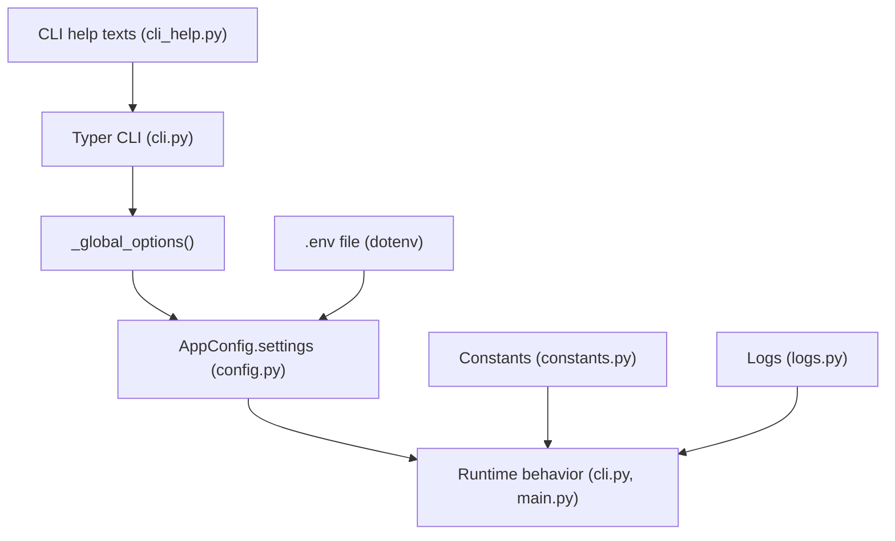
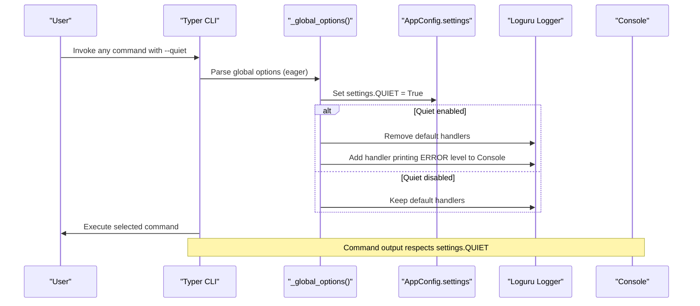
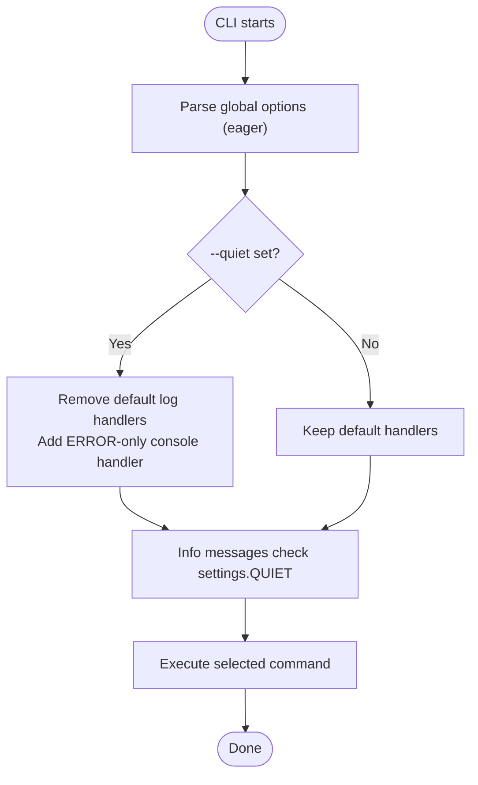
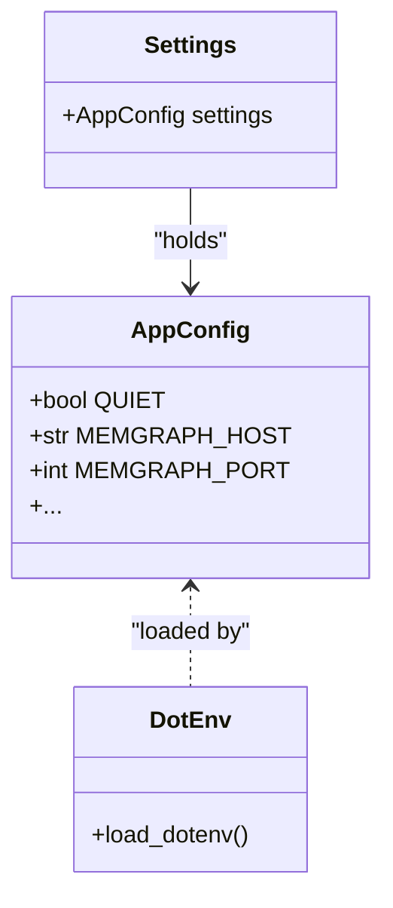
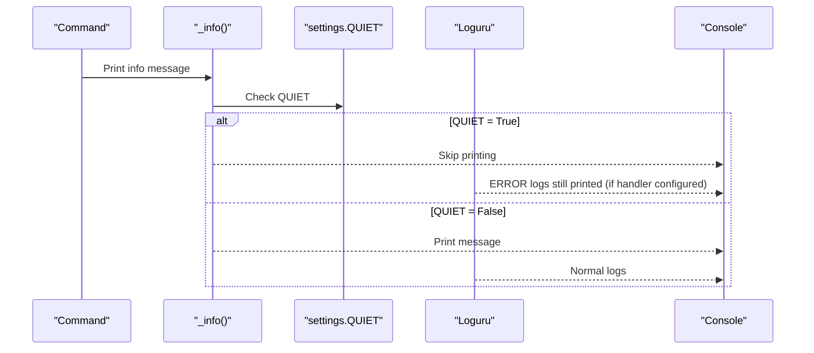
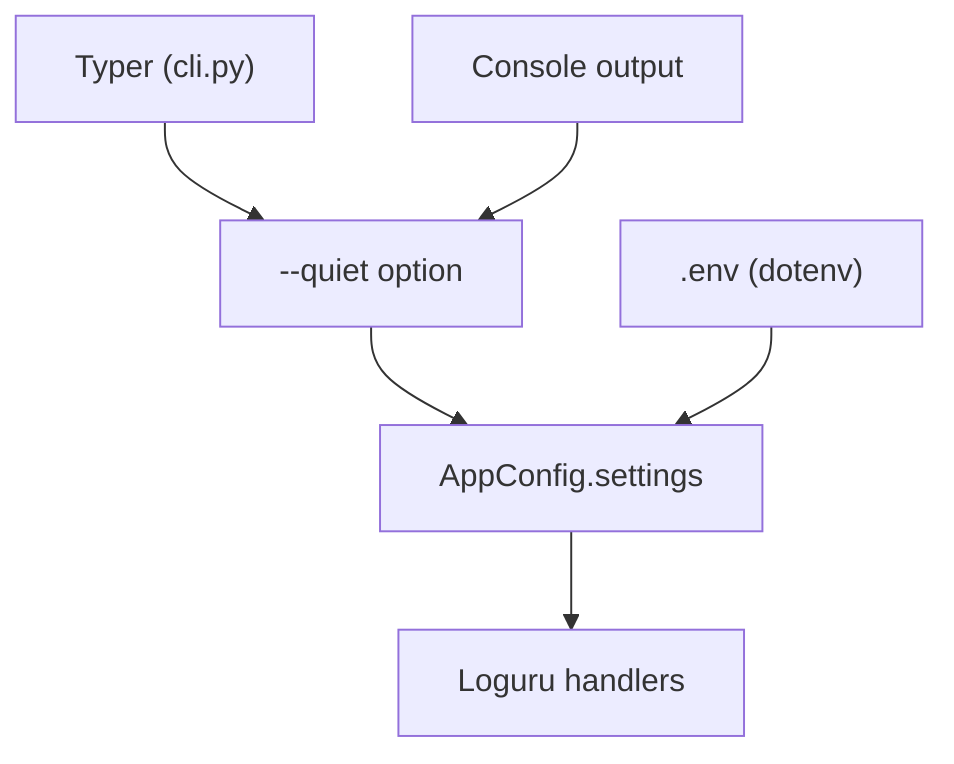

# Global Options

<cite>
**Referenced Files in This Document**
- [cli.py](file://codebase_rag/cli.py)
- [config.py](file://codebase_rag/config.py)
- [main.py](file://codebase_rag/main.py)
- [constants.py](file://codebase_rag/constants.py)
- [cli_help.py](file://codebase_rag/cli_help.py)
- [logs.py](file://codebase_rag/logs.py)
- [README.md](file://README.md)
</cite>

## Table of Contents
1. [Introduction](#introduction)
2. [Project Structure](#project-structure)
3. [Core Components](#core-components)
4. [Architecture Overview](#architecture-overview)
5. [Detailed Component Analysis](#detailed-component-analysis)
6. [Dependency Analysis](#dependency-analysis)
7. [Performance Considerations](#performance-considerations)
8. [Troubleshooting Guide](#troubleshooting-guide)
9. [Conclusion](#conclusion)

## Introduction
This document explains the global CLI options that apply across all commands in the system. It focuses on the --quiet option for controlling output verbosity, how environment variables integrate with configuration, and how configuration precedence works. It also details how global options affect command behavior and output formatting, and provides examples of combining global options with specific commands. Finally, it covers configuration file integration, environment variable overrides, command-line argument precedence, and troubleshooting guidance for configuration conflicts and unexpected behavior.

## Project Structure
The global CLI option is defined at the application callback level and influences logging and console output across all commands. Configuration is centralized via environment variables and a .env file, with runtime settings exposed through a typed settings object.

**Diagram sources**
- [cli.py](file://codebase_rag/cli.py#L34-L48)
- [config.py](file://codebase_rag/config.py#L17-L18)
- [cli_help.py](file://codebase_rag/cli_help.py#L14-L18)
- [constants.py](file://codebase_rag/constants.py#L615-L616)
- [logs.py](file://codebase_rag/logs.py#L1-L10)

**Section sources**
- [cli.py](file://codebase_rag/cli.py#L26-L48)
- [config.py](file://codebase_rag/config.py#L17-L18)
- [cli_help.py](file://codebase_rag/cli_help.py#L14-L18)
- [constants.py](file://codebase_rag/constants.py#L615-L616)

## Core Components
- Global --quiet option: Defined as a Typer callback option with eager evaluation. When enabled, it suppresses non-essential output and restricts logging to error-level messages routed to the console.
- Settings integration: The global option updates a shared settings object that controls QUIET behavior across the application.
- Environment variable integration: The settings object loads environment variables from a .env file using python-dotenv and exposes them as typed configuration.
- Console output control: The global option affects both informational messages printed to the console and the underlying logging configuration.

Key implementation references:
- Global option definition and eager behavior
- Quiet mode logging redirection
- Settings field for quiet mode
- Environment variable loading

**Section sources**
- [cli.py](file://codebase_rag/cli.py#L34-L48)
- [cli.py](file://codebase_rag/cli.py#L50-L53)
- [config.py](file://codebase_rag/config.py#L161-L161)
- [config.py](file://codebase_rag/config.py#L17-L18)

## Architecture Overview
The global --quiet option is processed during CLI initialization and influences both console output and logging behavior. The settings object centralizes configuration, including the quiet flag, which is respected by command implementations and logging utilities.

**Diagram sources**
- [cli.py](file://codebase_rag/cli.py#L34-L48)
- [cli.py](file://codebase_rag/cli.py#L50-L53)
- [config.py](file://codebase_rag/config.py#L161-L161)

## Detailed Component Analysis

### Global --quiet Option
- Definition: A Typer callback option with short and long forms, eager evaluation, and a help description indicating suppression of non-essential output.
- Behavior:
  - When enabled, removes default log handlers and adds a handler that prints only ERROR-level messages to the console.
  - Disables informational messages controlled by a helper that checks the quiet setting.
- Scope: Applies globally to all commands because it is defined at the application callback level.

**Diagram sources**
- [cli.py](file://codebase_rag/cli.py#L34-L48)
- [cli.py](file://codebase_rag/cli.py#L50-L53)

**Section sources**
- [cli.py](file://codebase_rag/cli.py#L34-L48)
- [cli.py](file://codebase_rag/cli.py#L50-L53)

### Settings and Environment Variables
- Settings object: Loads environment variables from a .env file and exposes them as typed fields. The quiet flag is mapped to an environment alias for convenience.
- Environment variable loading: python-dotenv is invoked at module import time to populate environment variables before settings are constructed.
- Configuration precedence: Command-line arguments override settings for the duration of the process when parsed; environment variables provide baseline defaults.

**Diagram sources**
- [config.py](file://codebase_rag/config.py#L39-L234)
- [config.py](file://codebase_rag/config.py#L17-L18)

**Section sources**
- [config.py](file://codebase_rag/config.py#L39-L234)
- [config.py](file://codebase_rag/config.py#L17-L18)

### Console Output Formatting and Logging Levels
- Console output: Informational messages are suppressed when quiet mode is enabled; only errors remain visible.
- Logging levels: In quiet mode, only ERROR-level logs are shown on the console. In normal mode, logs are formatted and sent to stdout.
- Command behavior: Commands that print informational banners, progress messages, or summaries honor the quiet flag.

**Diagram sources**
- [cli.py](file://codebase_rag/cli.py#L50-L53)
- [main.py](file://codebase_rag/main.py#L251-L253)

**Section sources**
- [cli.py](file://codebase_rag/cli.py#L50-L53)
- [main.py](file://codebase_rag/main.py#L251-L253)

### Configuration Precedence and Examples
- Precedence order:
  1) Command-line arguments (parsed eagerly by the global callback)
  2) Environment variables (.env file loaded via python-dotenv)
  3) Defaults in the settings schema
- Practical examples:
  - Combine --quiet with any command to reduce console noise and restrict logs to errors.
  - Use environment variables to set a baseline quiet preference for CI or automated runs.
  - Override quiet behavior per invocation by toggling the --quiet flag.

Notes on configuration integration:
- Environment variables are loaded at import time and influence settings initialization.
- The quiet flag is exposed as an environment alias for convenience.

**Section sources**
- [config.py](file://codebase_rag/config.py#L17-L18)
- [config.py](file://codebase_rag/config.py#L161-L161)
- [cli.py](file://codebase_rag/cli.py#L34-L48)

## Dependency Analysis
The global --quiet option depends on:
- Typer CLI framework for option parsing and eager callbacks
- Loguru for logging configuration and handler management
- Settings object for centralized configuration state
- Environment variable loading for baseline configuration

**Diagram sources**
- [cli.py](file://codebase_rag/cli.py#L34-L48)
- [config.py](file://codebase_rag/config.py#L17-L18)
- [main.py](file://codebase_rag/main.py#L251-L253)

**Section sources**
- [cli.py](file://codebase_rag/cli.py#L34-L48)
- [config.py](file://codebase_rag/config.py#L17-L18)
- [main.py](file://codebase_rag/main.py#L251-L253)

## Performance Considerations
- Quiet mode reduces console throughput by limiting output to errors, which can improve readability and reduce I/O overhead in noisy environments.
- Logging handler redirection avoids unnecessary formatting and routing of INFO/WARN messages, potentially lowering CPU usage during long-running operations.

[No sources needed since this section provides general guidance]

## Troubleshooting Guide
Common issues and resolutions:
- Unexpected silence: If a command appears silent, confirm whether --quiet was passed or if the quiet flag is set via environment variables. Temporarily disable quiet mode to diagnose.
- Conflicting configurations: If environment variables and command-line flags appear inconsistent, remember that command-line arguments are parsed eagerly and take effect immediately in the current process.
- Logging visibility: In quiet mode, only ERROR logs are printed to the console. Use verbose logging contexts or disable quiet mode for detailed diagnostics.
- Environment file not applied: Ensure the .env file is present and readable, and that python-dotenv is functioning as expected.

Relevant implementation references:
- Quiet mode handler redirection and error-level filtering
- Settings quiet flag and environment alias
- Environment variable loading at import time

**Section sources**
- [cli.py](file://codebase_rag/cli.py#L34-L48)
- [cli.py](file://codebase_rag/cli.py#L50-L53)
- [config.py](file://codebase_rag/config.py#L161-L161)
- [config.py](file://codebase_rag/config.py#L17-L18)

## Conclusion
The global --quiet option provides a simple and effective way to control output verbosity across all commands. By integrating with the settings object and environment variables, it ensures predictable behavior and easy configuration for both interactive and automated usage. Understanding its eager parsing, logging redirection, and precedence relative to environment variables helps avoid confusion and enables reliable troubleshooting.