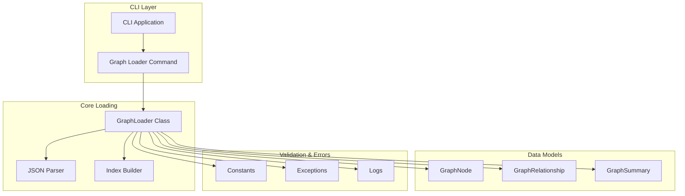
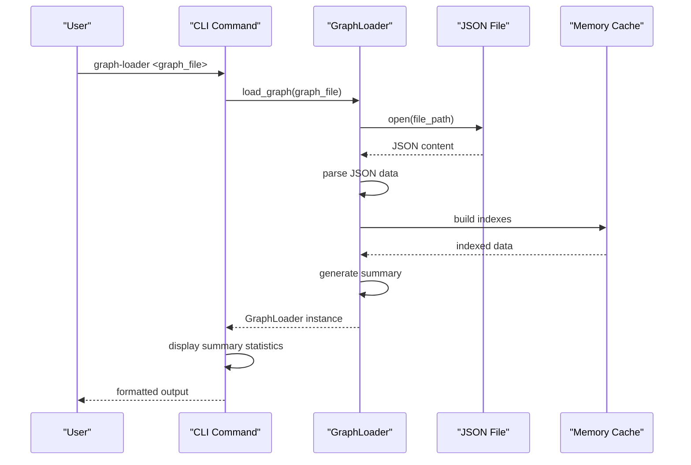
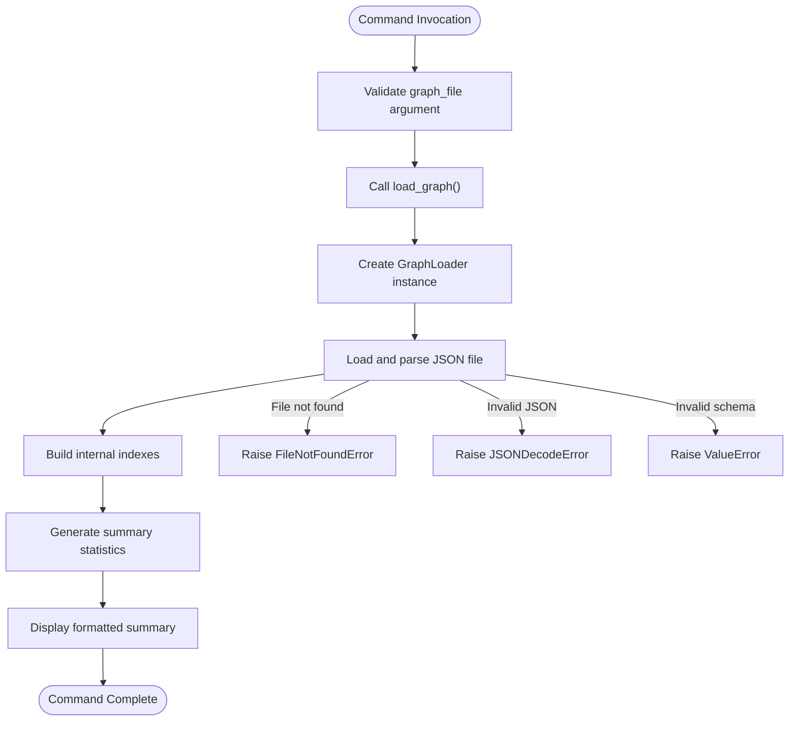
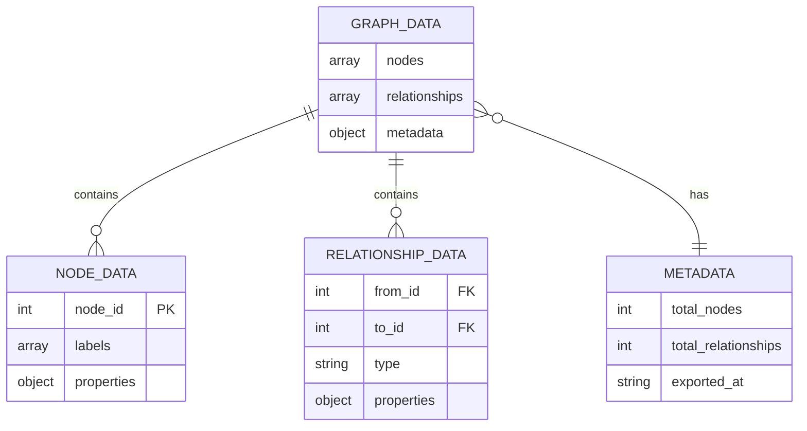
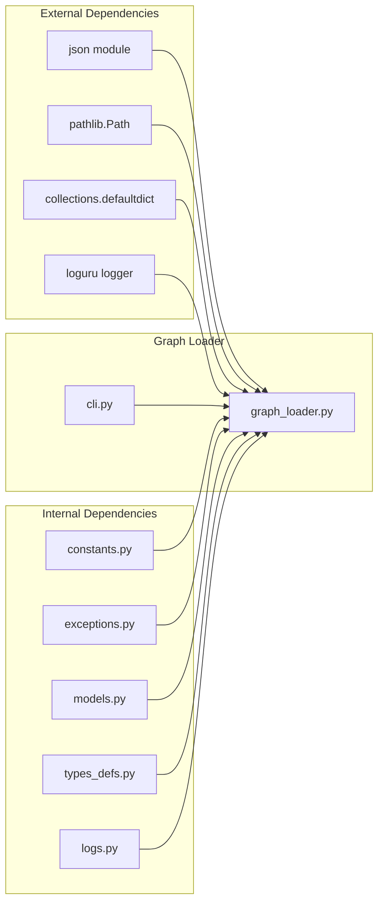
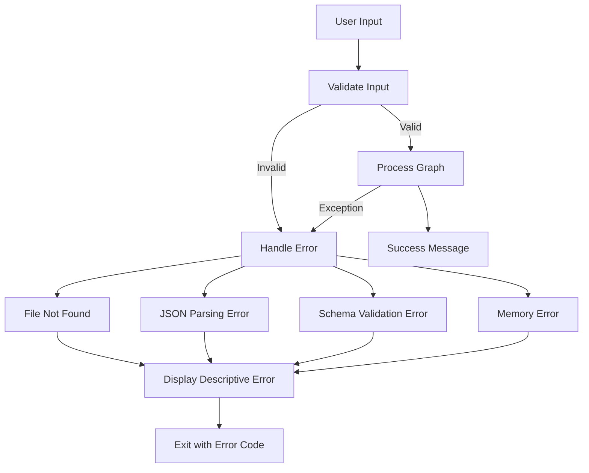

# Graph Loader Command

<cite>
**Referenced Files in This Document**
- [graph_loader.py](file://codebase_rag/graph_loader.py)
- [cli.py](file://codebase_rag/cli.py)
- [cli_help.py](file://codebase_rag/cli_help.py)
- [constants.py](file://codebase_rag/constants.py)
- [exceptions.py](file://codebase_rag/exceptions.py)
- [models.py](file://codebase_rag/models.py)
- [types_defs.py](file://codebase_rag/types_defs.py)
- [logs.py](file://codebase_rag/logs.py)
- [test_graph_loader.py](file://codebase_rag/tests/test_graph_loader.py)
- [README.md](file://README.md)
</cite>

## Table of Contents
1. [Introduction](#introduction)
2. [Project Structure](#project-structure)
3. [Core Components](#core-components)
4. [Architecture Overview](#architecture-overview)
5. [Detailed Component Analysis](#detailed-component-analysis)
6. [Dependency Analysis](#dependency-analysis)
7. [Performance Considerations](#performance-considerations)
8. [Troubleshooting Guide](#troubleshooting-guide)
9. [Conclusion](#conclusion)

## Introduction
The Graph Loader Command provides a simple yet powerful interface to load and analyze exported graph files from the codebase RAG system. This command enables users to quickly inspect the structure and content of knowledge graphs without requiring an active connection to the Memgraph database. The command reads a JSON-formatted graph export and displays summary statistics, including node counts, relationship counts, and metadata about the export.

The graph loader serves as a diagnostic and analysis tool, allowing developers to validate graph exports, understand the composition of their knowledge graphs, and troubleshoot issues with graph data. It supports lazy loading of graph data, efficient property-based lookups, and comprehensive summary reporting.

## Project Structure
The graph loader functionality is implemented within the codebase_rag package, with the CLI command integrated into the main application entry point. The system follows a modular architecture with clear separation between data loading, validation, and presentation layers.

**Diagram sources**
- [cli.py](file://codebase_rag/cli.py#L352-L382)
- [graph_loader.py](file://codebase_rag/graph_loader.py#L15-L155)

**Section sources**
- [cli.py](file://codebase_rag/cli.py#L352-L382)
- [graph_loader.py](file://codebase_rag/graph_loader.py#L15-L155)

## Core Components
The graph loader system consists of several key components that work together to provide efficient graph loading and analysis capabilities.

### GraphLoader Class
The central component responsible for loading and managing graph data. It implements lazy loading, maintains indexes for efficient lookups, and provides summary statistics.

Key features:
- Lazy loading of graph data from JSON files
- Automatic indexing of nodes by ID and labels
- Property-based indexing for fast lookups
- Comprehensive relationship tracking
- Summary statistics generation

### Data Models
The system defines typed data structures for graph entities and metadata:

- **GraphNode**: Represents individual nodes with ID, labels, and properties
- **GraphRelationship**: Represents relationships with source/target IDs, type, and properties  
- **GraphSummary**: Contains aggregated statistics and metadata

### Validation and Error Handling
The system includes comprehensive validation and error handling mechanisms:
- File existence verification
- JSON parsing validation
- Data structure validation against expected schema
- Graceful error reporting with descriptive messages

**Section sources**
- [graph_loader.py](file://codebase_rag/graph_loader.py#L15-L155)
- [models.py](file://codebase_rag/models.py#L36-L47)
- [types_defs.py](file://codebase_rag/types_defs.py#L152-L183)
- [exceptions.py](file://codebase_rag/exceptions.py#L32-L37)

## Architecture Overview
The graph loader command follows a layered architecture with clear separation of concerns:

**Diagram sources**
- [cli.py](file://codebase_rag/cli.py#L352-L382)
- [graph_loader.py](file://codebase_rag/graph_loader.py#L36-L77)

The architecture ensures efficient memory usage through lazy loading and provides fast access patterns through multiple indexing strategies.

## Detailed Component Analysis

### Graph Loader Command Implementation
The CLI command provides a straightforward interface for loading and analyzing graph files:

**Diagram sources**
- [cli.py](file://codebase_rag/cli.py#L352-L382)
- [graph_loader.py](file://codebase_rag/graph_loader.py#L36-L77)

### Graph Loading Process
The graph loading process involves several stages of validation and processing:

1. **File Validation**: Checks if the specified file exists and is accessible
2. **JSON Parsing**: Loads and validates the JSON structure
3. **Data Validation**: Ensures the graph data conforms to expected schema
4. **Index Building**: Creates efficient lookup structures for nodes and relationships
5. **Summary Generation**: Computes aggregate statistics for display

### Data Structure Requirements
The graph loader expects a specific JSON format containing nodes, relationships, and metadata:

**Diagram sources**
- [types_defs.py](file://codebase_rag/types_defs.py#L171-L175)
- [constants.py](file://codebase_rag/constants.py#L150-L163)

**Section sources**
- [cli.py](file://codebase_rag/cli.py#L352-L382)
- [graph_loader.py](file://codebase_rag/graph_loader.py#L36-L155)
- [types_defs.py](file://codebase_rag/types_defs.py#L171-L183)
- [constants.py](file://codebase_rag/constants.py#L150-L163)

## Dependency Analysis
The graph loader system has minimal external dependencies, focusing on core Python libraries and internal components.

**Diagram sources**
- [graph_loader.py](file://codebase_rag/graph_loader.py#L1-L12)
- [cli.py](file://codebase_rag/cli.py#L1-L25)

The dependency graph shows a clean separation between external standard library dependencies and internal project components, facilitating maintainability and testing.

**Section sources**
- [graph_loader.py](file://codebase_rag/graph_loader.py#L1-L12)
- [cli.py](file://codebase_rag/cli.py#L1-L25)

## Performance Considerations
The graph loader is designed for efficiency and scalability when handling large graph exports.

### Memory Optimization Strategies
- **Lazy Loading**: Graph data is loaded only when accessed, reducing memory footprint
- **Incremental Indexing**: Indexes are built on-demand for property lookups
- **Efficient Data Structures**: Uses defaultdict for fast property-based lookups
- **Streaming Processing**: Processes nodes and relationships sequentially without loading entire dataset into memory

### Performance Characteristics
- **Time Complexity**: O(n + m) where n is number of nodes and m is number of relationships
- **Space Complexity**: O(n + m) for storing graph data plus O(p) for property indexes where p is unique property values
- **Memory Usage**: Linear with respect to graph size, with minimal overhead for indexes

### Optimization Techniques
For large graph files, consider:
- **Property Indexing**: The system automatically builds property indexes when first accessed
- **Selective Loading**: Only load data that is actually needed for analysis
- **Batch Processing**: Process relationships in batches to manage memory usage
- **Efficient Lookups**: Use the built-in indexing for fast property-based searches

## Troubleshooting Guide

### Common Issues and Solutions

#### File Not Found Error
**Symptoms**: Command fails with "Graph file not found" message
**Causes**: 
- Incorrect file path specified
- File permissions issue
- File moved or deleted

**Solutions**:
- Verify the file path exists and is accessible
- Check file permissions
- Ensure the file hasn't been moved or deleted

#### Invalid JSON Format
**Symptoms**: Command fails with JSON parsing error
**Causes**:
- Corrupted JSON file
- Incomplete export
- Wrong file format

**Solutions**:
- Verify the file is a valid JSON document
- Re-run the export process
- Check for file corruption or truncation

#### Schema Validation Errors
**Symptoms**: Command fails with validation error about missing fields
**Causes**:
- Incompatible graph format
- Modified export structure
- Partially exported data

**Solutions**:
- Ensure the file was exported using the supported export command
- Verify the export completed successfully
- Check that all required fields are present

#### Memory Limitations
**Symptoms**: Command runs out of memory with large graph files
**Causes**:
- Extremely large graph export
- Insufficient system memory
- Memory leaks in processing

**Solutions**:
- Process smaller graph segments
- Increase system memory or swap space
- Use the lazy loading features effectively

### Error Handling Mechanisms
The system provides comprehensive error handling with descriptive messages:

**Diagram sources**
- [exceptions.py](file://codebase_rag/exceptions.py#L32-L37)
- [cli.py](file://codebase_rag/cli.py#L377-L381)

**Section sources**
- [exceptions.py](file://codebase_rag/exceptions.py#L32-L37)
- [cli.py](file://codebase_rag/cli.py#L377-L381)

## Conclusion
The Graph Loader Command provides a robust and efficient solution for loading and analyzing exported graph files from the codebase RAG system. Its design emphasizes simplicity, reliability, and performance while maintaining comprehensive error handling and validation.

Key strengths of the implementation include:
- **Simple Interface**: Single command with straightforward usage
- **Robust Validation**: Comprehensive error handling and validation
- **Efficient Processing**: Lazy loading and optimized data structures
- **Rich Analysis**: Comprehensive summary statistics and metadata
- **Extensible Design**: Modular architecture supporting future enhancements

The command serves as an essential diagnostic and analysis tool, enabling developers to validate graph exports, understand graph structure, and troubleshoot issues efficiently. Its integration with the broader codebase RAG ecosystem provides seamless workflow for graph-based code analysis and exploration.

Future enhancements could include support for additional graph formats, enhanced filtering capabilities, and integration with visualization tools for interactive graph exploration.