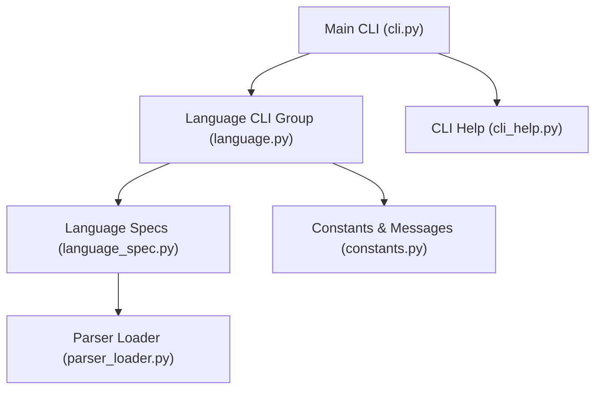
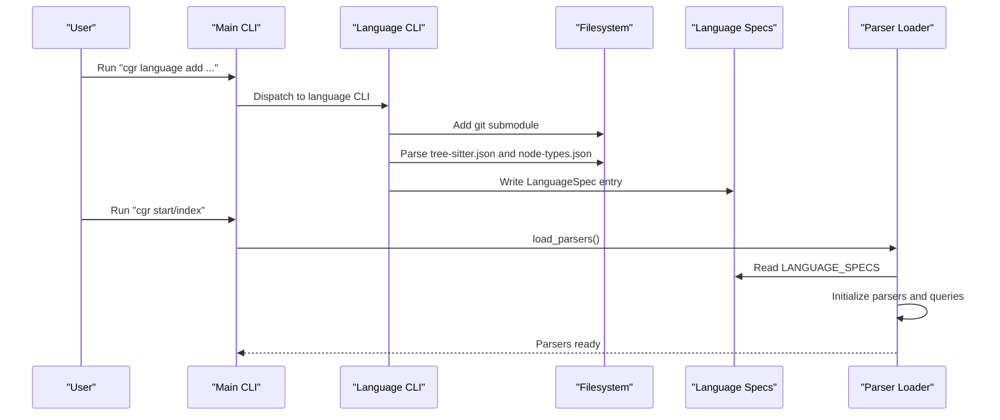
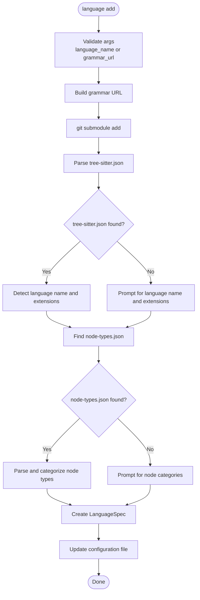
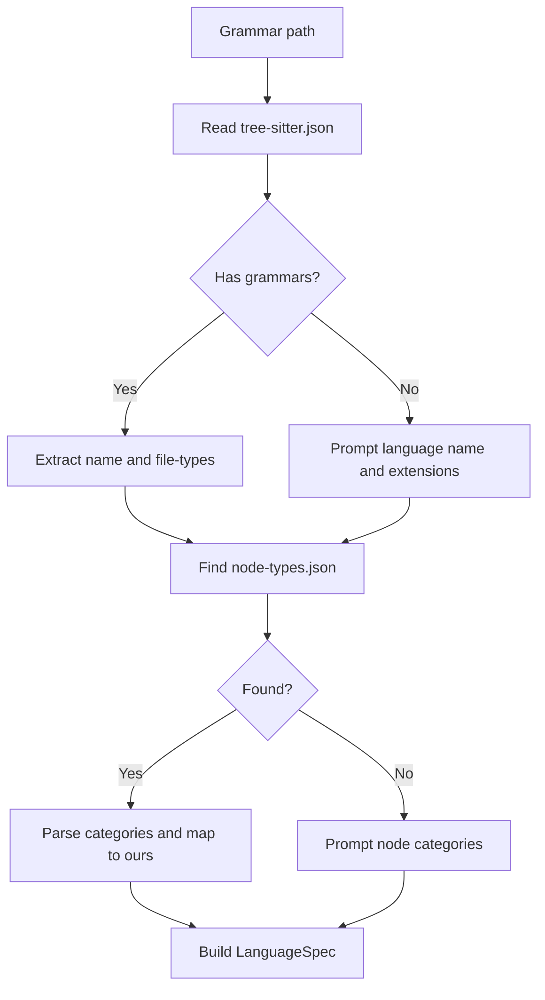
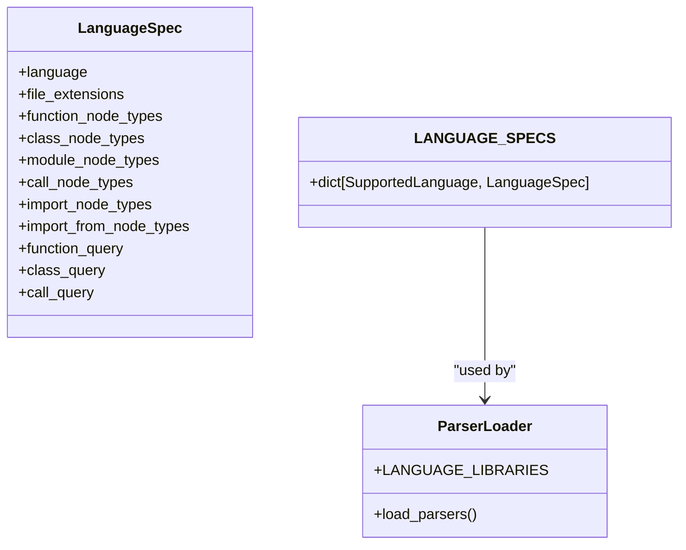
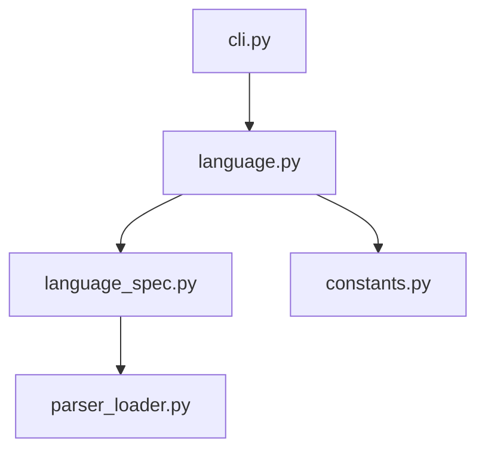

# Language Management Commands

<cite>
**Referenced Files in This Document**
- [language.py](file://codebase_rag/tools/language.py)
- [cli.py](file://codebase_rag/cli.py)
- [language_spec.py](file://codebase_rag/language_spec.py)
- [parser_loader.py](file://codebase_rag/parser_loader.py)
- [constants.py](file://codebase_rag/constants.py)
- [cli_help.py](file://codebase_rag/cli_help.py)
- [models.py](file://codebase_rag/models.py)
</cite>

## Table of Contents
1. [Introduction](#introduction)
2. [Project Structure](#project-structure)
3. [Core Components](#core-components)
4. [Architecture Overview](#architecture-overview)
5. [Detailed Component Analysis](#detailed-component-analysis)
6. [Dependency Analysis](#dependency-analysis)
7. [Performance Considerations](#performance-considerations)
8. [Troubleshooting Guide](#troubleshooting-guide)
9. [Conclusion](#conclusion)

## Introduction
This document explains the language management commands that enable adding, removing, listing, and cleaning up language grammars used by the system. It covers command syntax, subcommands, language detection mechanisms, configuration of language-specific parsers, and how language management integrates with the broader parsing pipeline. It also provides troubleshooting guidance for common issues such as grammar detection failures, parser conflicts, and configuration errors.

## Project Structure
The language management functionality is implemented as a dedicated CLI group under the main application. The group delegates to a Click-based command module that manages Tree-sitter grammars via git submodules, detects language characteristics from grammar metadata, and updates the language specification configuration.

**Diagram sources**
- [cli.py](file://codebase_rag/cli.py#L384-L391)
- [language.py](file://codebase_rag/tools/language.py#L374-L376)
- [language_spec.py](file://codebase_rag/language_spec.py#L205-L426)
- [parser_loader.py](file://codebase_rag/parser_loader.py#L17-L172)
- [constants.py](file://codebase_rag/constants.py#L1310-L1425)
- [cli_help.py](file://codebase_rag/cli_help.py#L26-L32)

**Section sources**
- [cli.py](file://codebase_rag/cli.py#L384-L391)
- [language.py](file://codebase_rag/tools/language.py#L374-L376)

## Core Components
- Language CLI group: Provides subcommands to add, list, remove, and clean up language grammars.
- Language specification: Defines language capabilities, node types, and queries used by the parser loader.
- Parser loader: Loads Tree-sitter grammars from submodules and constructs parsers and queries per language.
- Constants and messages: Centralized configuration for language CLI prompts, messages, and defaults.

Key responsibilities:
- Add grammar: Adds a Tree-sitter grammar via git submodule, auto-detects language name and extensions, optionally parses node types to categorize nodes, and writes a configuration entry.
- List languages: Displays configured languages and their node type mappings.
- Remove language: Removes a language from configuration and optionally removes the associated submodule.
- Cleanup orphaned modules: Scans and removes orphaned git submodules.

**Section sources**
- [language.py](file://codebase_rag/tools/language.py#L374-L614)
- [language_spec.py](file://codebase_rag/language_spec.py#L205-L426)
- [parser_loader.py](file://codebase_rag/parser_loader.py#L276-L293)
- [constants.py](file://codebase_rag/constants.py#L1310-L1425)

## Architecture Overview
The language management commands integrate with the broader parsing system by updating the language specification registry and enabling parser initialization.

**Diagram sources**
- [cli.py](file://codebase_rag/cli.py#L55-L162)
- [language.py](file://codebase_rag/tools/language.py#L379-L461)
- [language_spec.py](file://codebase_rag/language_spec.py#L205-L426)
- [parser_loader.py](file://codebase_rag/parser_loader.py#L276-L293)

## Detailed Component Analysis

### Language CLI Group and Subcommands
- Command group: Declared as a Click group with a help description.
- Subcommands:
  - add_grammar: Adds a grammar via URL or default Tree-sitter repository, auto-detects language metadata, prompts for manual mapping if needed, and updates configuration.
  - list_languages: Prints a formatted table of configured languages and their node types.
  - remove_language: Removes a language from configuration and optionally deletes the submodule.
  - cleanup_orphaned_modules: Finds and optionally removes orphaned git submodules.

**Diagram sources**
- [language.py](file://codebase_rag/tools/language.py#L379-L461)
- [constants.py](file://codebase_rag/constants.py#L1310-L1425)

**Section sources**
- [language.py](file://codebase_rag/tools/language.py#L379-L614)
- [cli_help.py](file://codebase_rag/cli_help.py#L28-L32)

### Language Detection Mechanisms
- Auto-detection from tree-sitter.json:
  - Reads the grammar configuration and extracts the language name and file extensions.
  - Ensures extensions include the dot prefix.
- Auto-detection from node-types.json:
  - Parses semantic categories and maps node types to functions, classes, modules, and calls.
  - Uses keyword sets to classify nodes heuristically.
- Fallbacks:
  - Prompts the user for language name and extensions if tree-sitter.json is missing.
  - Prompts the user for node categories if node-types.json is missing.

**Diagram sources**
- [language.py](file://codebase_rag/tools/language.py#L129-L271)
- [constants.py](file://codebase_rag/constants.py#L1281-L1308)

**Section sources**
- [language.py](file://codebase_rag/tools/language.py#L129-L271)
- [constants.py](file://codebase_rag/constants.py#L1281-L1308)

### Language Specification and Parser Integration
- LanguageSpec defines:
  - language identifier
  - file_extensions
  - function_node_types, class_node_types, module_node_types, call_node_types
  - optional import_node_types and import_from_node_types
  - optional function_query, class_query, call_query
- LANGUAGE_SPECS is a registry of supported languages with their specs.
- Parser loader:
  - Attempts to import Tree-sitter language bindings.
  - Falls back to loading from git submodules.
  - Builds parsers and queries per language using LanguageSpec.

**Diagram sources**
- [models.py](file://codebase_rag/models.py#L57-L73)
- [language_spec.py](file://codebase_rag/language_spec.py#L205-L426)
- [parser_loader.py](file://codebase_rag/parser_loader.py#L276-L293)

**Section sources**
- [models.py](file://codebase_rag/models.py#L57-L73)
- [language_spec.py](file://codebase_rag/language_spec.py#L205-L426)
- [parser_loader.py](file://codebase_rag/parser_loader.py#L17-L172)

### Command Syntax and Examples
- Add a grammar:
  - cgr language add LANGUAGE_NAME [--grammar-url GITHUB_URL]
  - Example: cgr language add python
  - Example: cgr language add --grammar-url https://github.com/tree-sitter/example-lang
- List languages:
  - cgr language list
- Remove a language:
  - cgr language remove LANGUAGE_NAME [--keep-submodule]
- Cleanup orphaned modules:
  - cgr language cleanup

Notes:
- If grammar-url is not provided for a named language, the command uses a default Tree-sitter URL pattern.
- When adding from a custom URL, the command warns about potential risks and asks for confirmation.

**Section sources**
- [cli_help.py](file://codebase_rag/cli_help.py#L68-L72)
- [language.py](file://codebase_rag/tools/language.py#L379-L461)

## Dependency Analysis
- The main CLI registers the language command group and forwards arguments to the language CLI module.
- The language CLI module depends on:
  - LANGUAGE_SPECS for writing configuration entries.
  - Constants for prompts, messages, and defaults.
  - Parser loader for runtime integration checks.
- Parser loader depends on LANGUAGE_SPECS to initialize parsers and queries.

**Diagram sources**
- [cli.py](file://codebase_rag/cli.py#L384-L391)
- [language.py](file://codebase_rag/tools/language.py#L374-L376)
- [language_spec.py](file://codebase_rag/language_spec.py#L205-L426)
- [parser_loader.py](file://codebase_rag/parser_loader.py#L276-L293)

**Section sources**
- [cli.py](file://codebase_rag/cli.py#L384-L391)
- [language.py](file://codebase_rag/tools/language.py#L374-L376)
- [language_spec.py](file://codebase_rag/language_spec.py#L205-L426)
- [parser_loader.py](file://codebase_rag/parser_loader.py#L276-L293)

## Performance Considerations
- Grammar loading from submodules may require building native bindings; this can be slow on first use.
- Parsing node-types.json and mapping categories involves JSON parsing and classification; ensure grammars are well-formed.
- The parser loader initializes a parser per language; avoid unnecessary language loads by keeping LANGUAGE_SPECS minimal until needed.

## Troubleshooting Guide
Common issues and resolutions:
- Missing tree-sitter.json:
  - Symptom: Warning that tree-sitter.json was not found.
  - Resolution: Provide language name and extensions manually; ensure grammar repository structure is correct.
- Missing node-types.json:
  - Symptom: Warning that node-types.json was not found.
  - Resolution: Manually select node categories for functions, classes, modules, and calls.
- Git errors during submodule add:
  - Symptom: Git error messages when adding submodule.
  - Resolution: Check repository URL and network connectivity; follow manual removal hints if reinstall fails.
- Reinstall failure:
  - Symptom: Failure to reinstall existing submodule.
  - Resolution: Follow manual steps to remove submodule entries and directories, then retry.
- Removing language fails:
  - Symptom: Error updating configuration file.
  - Resolution: Verify file permissions and edit the configuration file manually if needed.
- Cleanup orphaned modules:
  - Symptom: Orphaned git modules found.
  - Resolution: Confirm removal to delete orphaned directories.

Configuration and validation tips:
- After adding a language, review the generated LanguageSpec entries and adjust node categories as needed.
- Use the list command to verify configuration entries and node type mappings.
- Ensure LANGUAGE_SPECS ends with a closing brace; otherwise, the update will fail.

**Section sources**
- [language.py](file://codebase_rag/tools/language.py#L56-L127)
- [language.py](file://codebase_rag/tools/language.py#L572-L610)
- [constants.py](file://codebase_rag/constants.py#L1371-L1425)

## Conclusion
The language management commands provide a robust mechanism to add, configure, and maintain language grammars for the parsing system. By leveraging Tree-sitter grammars via git submodules, auto-detecting language metadata, and updating the language specification registry, the system supports multi-language projects seamlessly. Proper configuration and periodic cleanup ensure reliable parsing performance across diverse codebases.