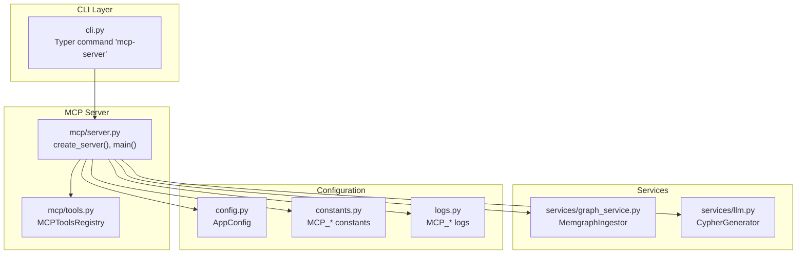
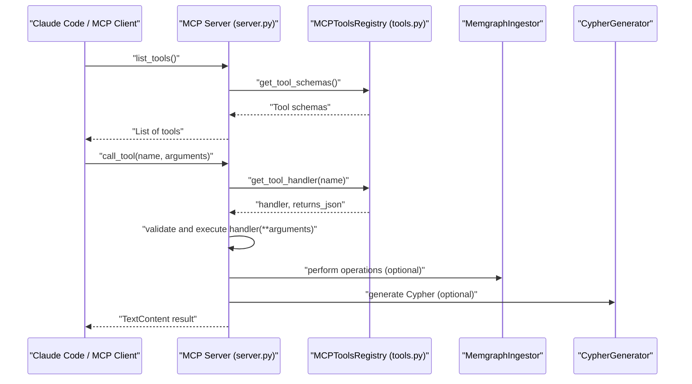
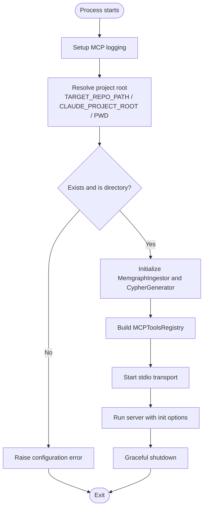
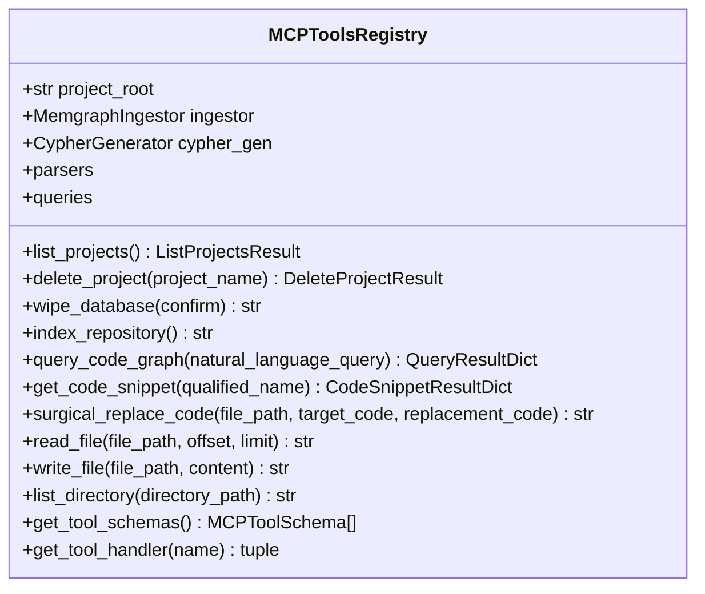
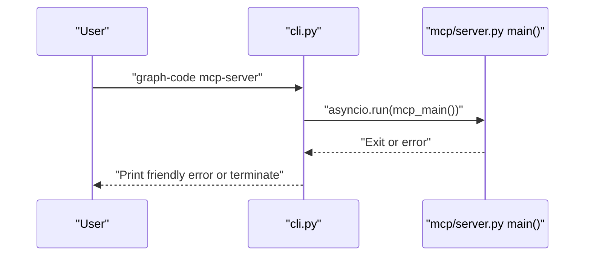
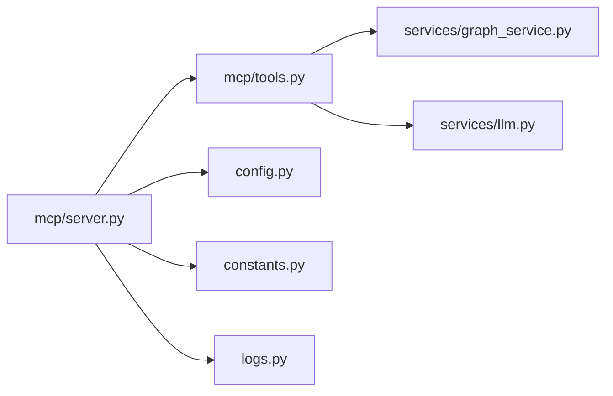

# MCP Server Command

<cite>
**Referenced Files in This Document**
- [server.py](file://codebase_rag/mcp/server.py)
- [tools.py](file://codebase_rag/mcp/tools.py)
- [cli.py](file://codebase_rag/cli.py)
- [cli_help.py](file://codebase_rag/cli_help.py)
- [constants.py](file://codebase_rag/constants.py)
- [config.py](file://codebase_rag/config.py)
- [logs.py](file://codebase_rag/logs.py)
- [claude-code-setup.md](file://docs/claude-code-setup.md)
- [main.py](file://codebase_rag/main.py)
</cite>

## Table of Contents
1. [Introduction](#introduction)
2. [Project Structure](#project-structure)
3. [Core Components](#core-components)
4. [Architecture Overview](#architecture-overview)
5. [Detailed Component Analysis](#detailed-component-analysis)
6. [Dependency Analysis](#dependency-analysis)
7. [Performance Considerations](#performance-considerations)
8. [Troubleshooting Guide](#troubleshooting-guide)
9. [Conclusion](#conclusion)
10. [Appendices](#appendices)

## Introduction
This document explains the MCP server command that enables Model Context Protocol (MCP) integration for Claude Code and other AI agents. It covers command syntax, configuration options, startup procedures, server lifecycle, graceful shutdown, error handling, and practical setup steps. It also documents the available tools and how to connect external tools and agents to the MCP server.

## Project Structure
The MCP server is implemented as a dedicated module under codebase_rag/mcp, with a thin CLI entrypoint that delegates to the MCP runtime. The server initializes logging, resolves the project root, connects to the knowledge graph backend, registers MCP tools, and runs over stdio transport.

**Diagram sources**
- [cli.py](file://codebase_rag/cli.py#L332-L350)
- [server.py](file://codebase_rag/mcp/server.py#L58-L135)
- [tools.py](file://codebase_rag/mcp/tools.py#L40-L457)
- [config.py](file://codebase_rag/config.py#L39-L234)
- [constants.py](file://codebase_rag/constants.py#L2347-L2420)
- [logs.py](file://codebase_rag/logs.py#L595-L613)

**Section sources**
- [cli.py](file://codebase_rag/cli.py#L332-L350)
- [server.py](file://codebase_rag/mcp/server.py#L58-L135)
- [tools.py](file://codebase_rag/mcp/tools.py#L40-L457)
- [config.py](file://codebase_rag/config.py#L39-L234)
- [constants.py](file://codebase_rag/constants.py#L2347-L2420)
- [logs.py](file://codebase_rag/logs.py#L595-L613)

## Core Components
- MCP server entrypoint and lifecycle:
  - Initializes logging with MCP-specific format and level.
  - Resolves project root via environment variables or defaults.
  - Creates MemgraphIngestor and CypherGenerator.
  - Registers MCP tools and exposes list_tools and call_tool endpoints.
  - Runs over stdio transport with initialization options.
- MCP tools registry:
  - Provides a catalog of MCP tools with input schemas and handlers.
  - Supports project management, indexing, querying, code retrieval, file operations, and directory listing.
- CLI integration:
  - Exposes the "mcp-server" command that runs the MCP server asynchronously.
  - Handles keyboard interrupts and configuration errors with user-friendly messages.

Key MCP constants and environment variables:
- Server name, content type, pagination, logging format, and default directory are defined for MCP compatibility.
- Environment variables include TARGET_REPO_PATH, CLAUDE_PROJECT_ROOT, and PWD to locate the project root.

**Section sources**
- [server.py](file://codebase_rag/mcp/server.py#L21-L135)
- [tools.py](file://codebase_rag/mcp/tools.py#L40-L457)
- [cli.py](file://codebase_rag/cli.py#L332-L350)
- [constants.py](file://codebase_rag/constants.py#L2400-L2410)
- [constants.py](file://codebase_rag/constants.py#L2361-L2366)

## Architecture Overview
The MCP server follows a straightforward request-response pattern over stdio. Clients (e.g., Claude Code) send MCP requests; the server lists available tools and executes requested tools with validated arguments.

**Diagram sources**
- [server.py](file://codebase_rag/mcp/server.py#L96-L134)
- [tools.py](file://codebase_rag/mcp/tools.py#L433-L446)

**Section sources**
- [server.py](file://codebase_rag/mcp/server.py#L96-L134)
- [tools.py](file://codebase_rag/mcp/tools.py#L433-L446)

## Detailed Component Analysis

### MCP Server Lifecycle and Startup
- Logging setup:
  - Uses MCP-specific log level and format.
- Project root resolution:
  - Reads TARGET_REPO_PATH or falls back to CLAUDE_PROJECT_ROOT or PWD.
  - Defaults to current working directory if none are set.
  - Validates existence and directory type; raises errors otherwise.
- Service initialization:
  - Creates MemgraphIngestor with configured host/port/batch size.
  - Creates CypherGenerator for query assistance.
  - Builds MCP tools registry with handlers and schemas.
- Transport and run loop:
  - Starts stdio transport and runs the server with initialization options.
  - Graceful shutdown logs server shutdown.

**Diagram sources**
- [server.py](file://codebase_rag/mcp/server.py#L21-L160)

**Section sources**
- [server.py](file://codebase_rag/mcp/server.py#L21-L160)
- [logs.py](file://codebase_rag/logs.py#L595-L613)

### MCP Tools Registry and Handlers
The registry defines MCP tools with:
- Tool metadata: name, description, input schema, handler function, and whether the result should be serialized as JSON.
- Handlers for:
  - Project management: list_projects, delete_project, wipe_database.
  - Indexing: index_repository.
  - Querying: query_code_graph.
  - Code retrieval: get_code_snippet.
  - File operations: surgical_replace_code, read_file, write_file.
  - Directory listing: list_directory.

Input schemas enumerate required parameters and types for each tool.

**Diagram sources**
- [tools.py](file://codebase_rag/mcp/tools.py#L40-L457)

**Section sources**
- [tools.py](file://codebase_rag/mcp/tools.py#L40-L457)
- [constants.py](file://codebase_rag/constants.py#L2347-L2398)

### CLI Integration and Command Syntax
- Command:
  - graph-code mcp-server
- Behavior:
  - Delegates to the MCP server main routine.
  - Handles keyboard interrupts and configuration errors with helpful hints.

**Diagram sources**
- [cli.py](file://codebase_rag/cli.py#L332-L350)
- [server.py](file://codebase_rag/mcp/server.py#L138-L166)

**Section sources**
- [cli.py](file://codebase_rag/cli.py#L332-L350)
- [cli_help.py](file://codebase_rag/cli_help.py#L24-L26)

### Configuration Options and Environment Variables
- Target repository path:
  - TARGET_REPO_PATH: primary way to set the project root.
  - CLAUDE_PROJECT_ROOT and PWD: fallbacks used by the server to infer the project root.
- Memgraph connectivity:
  - MEMGRAPH_HOST and MEMGRAPH_PORT are read from configuration.
- Logging:
  - MCP-specific log level and format are applied.
- Additional settings:
  - MEMGRAPH_BATCH_SIZE influences ingestion batching.

**Section sources**
- [constants.py](file://codebase_rag/constants.py#L2361-L2366)
- [config.py](file://codebase_rag/config.py#L50-L54)
- [server.py](file://codebase_rag/mcp/server.py#L68-L82)
- [logs.py](file://codebase_rag/logs.py#L595-L606)

### Integration with Claude Code and Other Agents
- Claude Code setup:
  - Add an MCP server with stdio transport.
  - Configure TARGET_REPO_PATH to point to the desired project.
  - Optionally configure LLM provider for Cypher generation via CYPHER_PROVIDER, CYPHER_MODEL, and CYPHER_API_KEY.
  - Run the MCP server via the CLI command from the repository root.
- Transport and discovery:
  - The server runs over stdio transport and advertises tools via list_tools.
  - Clients discover and call tools by name.

**Section sources**
- [claude-code-setup.md](file://docs/claude-code-setup.md#L1-L137)
- [cli.py](file://codebase_rag/cli.py#L332-L350)
- [server.py](file://codebase_rag/mcp/server.py#L86-L106)

## Dependency Analysis
The MCP server depends on:
- Configuration settings for Memgraph connectivity and batch size.
- MCP constants for tool names, environment variables, logging, and schemas.
- Logging constants for MCP-specific messages.
- Tools registry for tool schemas and handlers.
- Services for graph operations and Cypher generation.

**Diagram sources**
- [server.py](file://codebase_rag/mcp/server.py#L11-L18)
- [tools.py](file://codebase_rag/mcp/tools.py#L9-L14)
- [config.py](file://codebase_rag/config.py#L39-L234)
- [constants.py](file://codebase_rag/constants.py#L2347-L2420)
- [logs.py](file://codebase_rag/logs.py#L595-L613)

**Section sources**
- [server.py](file://codebase_rag/mcp/server.py#L11-L18)
- [tools.py](file://codebase_rag/mcp/tools.py#L9-L14)
- [config.py](file://codebase_rag/config.py#L39-L234)
- [constants.py](file://codebase_rag/constants.py#L2347-L2420)
- [logs.py](file://codebase_rag/logs.py#L595-L613)

## Performance Considerations
- Batch size:
  - MEMGRAPH_BATCH_SIZE controls buffering for graph updates; larger batches reduce I/O overhead but increase memory usage.
- Tool execution:
  - Some tools perform file I/O or graph queries; ensure adequate resources for large repositories.
- Logging:
  - MCP-specific logging format and level are optimized for clarity; adjust verbosity as needed.

[No sources needed since this section provides general guidance]

## Troubleshooting Guide
Common issues and resolutions:
- Wrong repository analyzed:
  - Without TARGET_REPO_PATH, the server uses the directory where Claude Code is opened.
  - With TARGET_REPO_PATH, it always uses that specific path (must be absolute).
- Memgraph connection failed:
  - Ensure the Memgraph container is running and reachable on the configured host/port.
- Tools not showing:
  - Verify the MCP server is running and use client commands to list installed servers.
- Configuration errors:
  - The CLI prints a friendly message and suggests setting TARGET_REPO_PATH if the project root cannot be resolved.
- Tool execution errors:
  - The server wraps tool errors in a standardized text format and logs detailed exceptions.

**Section sources**
- [claude-code-setup.md](file://docs/claude-code-setup.md#L120-L131)
- [cli.py](file://codebase_rag/cli.py#L340-L349)
- [server.py](file://codebase_rag/mcp/server.py#L48-L54)
- [logs.py](file://codebase_rag/logs.py#L602-L607)

## Conclusion
The MCP server command provides a robust, stdio-based integration point for Claude Code and other AI agents. It offers a curated set of tools for indexing, querying, retrieving code snippets, editing files, and browsing directories. Proper configuration of the target repository and Memgraph connectivity ensures reliable operation, while structured logging and error handling simplify troubleshooting.

[No sources needed since this section summarizes without analyzing specific files]

## Appendices

### MCP Server Command Syntax
- Command: graph-code mcp-server
- Behavior: Starts the MCP server over stdio transport with tool registration and logging.

**Section sources**
- [cli.py](file://codebase_rag/cli.py#L332-L350)
- [cli_help.py](file://codebase_rag/cli_help.py#L24-L26)

### Configuration Options Reference
- TARGET_REPO_PATH: Absolute path to the target repository.
- CLAUDE_PROJECT_ROOT: Fallback environment variable for project root.
- PWD: Another fallback environment variable for project root.
- MEMGRAPH_HOST, MEMGRAPH_PORT: Memgraph connectivity.
- MEMGRAPH_BATCH_SIZE: Batch size for graph operations.
- MCP-specific logging and formatting constants.

**Section sources**
- [constants.py](file://codebase_rag/constants.py#L2361-L2366)
- [config.py](file://codebase_rag/config.py#L50-L54)
- [constants.py](file://codebase_rag/constants.py#L2404-L2406)

### Available Tools
- list_projects, delete_project, wipe_database
- index_repository
- query_code_graph
- get_code_snippet
- surgical_replace_code, read_file, write_file
- list_directory

Each tool has a defined input schema and handler behavior.

**Section sources**
- [tools.py](file://codebase_rag/mcp/tools.py#L70-L249)
- [constants.py](file://codebase_rag/constants.py#L2347-L2358)

### Security Considerations
- File operations are constrained by project root validation to prevent path traversal.
- Shell command execution is restricted by allowlists and safety checks.
- Ensure API keys and credentials are managed securely and not exposed in logs.

**Section sources**
- [logs.py](file://codebase_rag/logs.py#L319-L320)
- [config.py](file://codebase_rag/config.py#L82-L142)