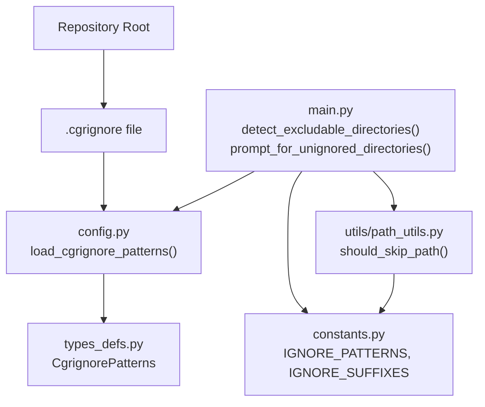
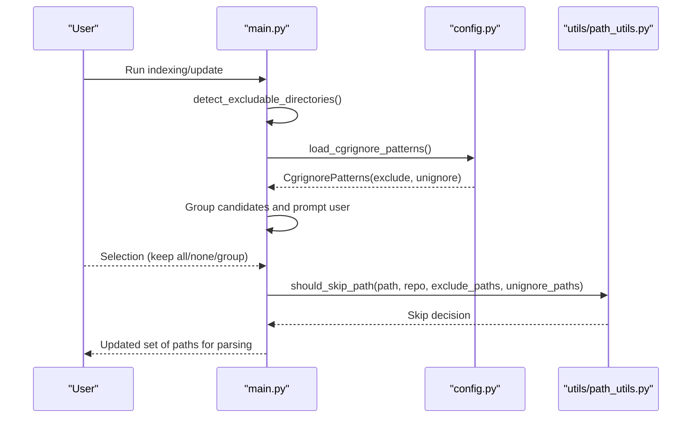
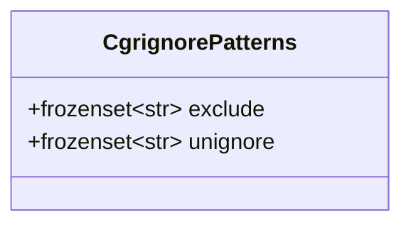
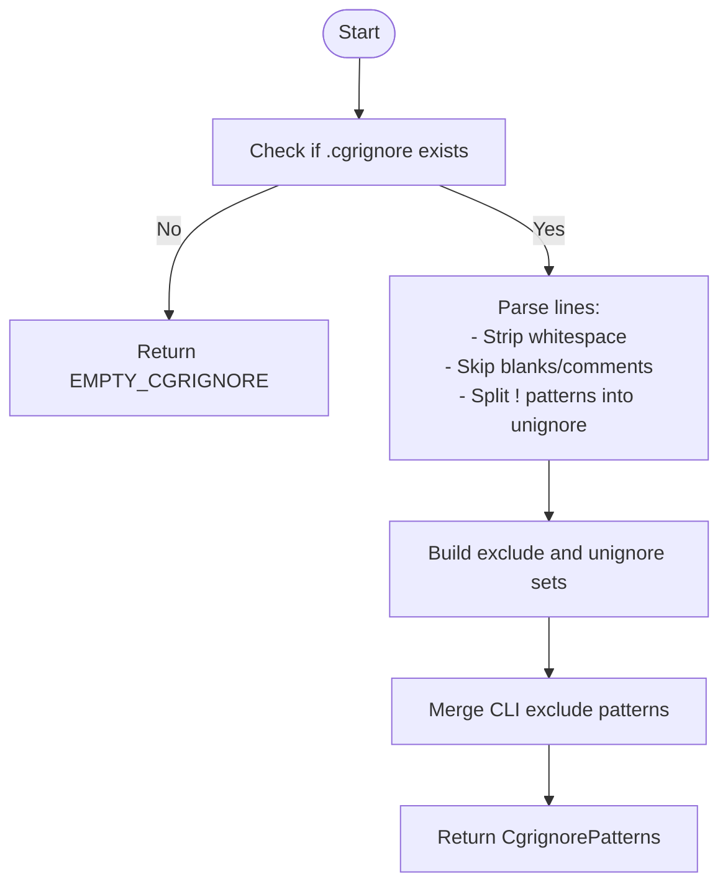
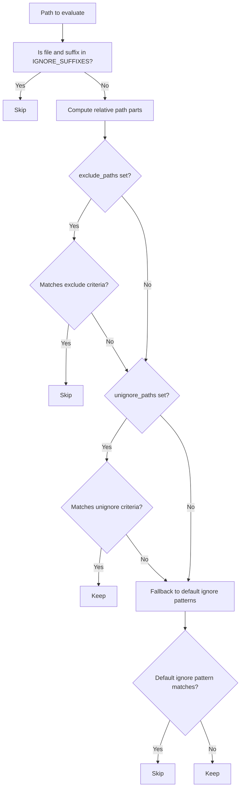
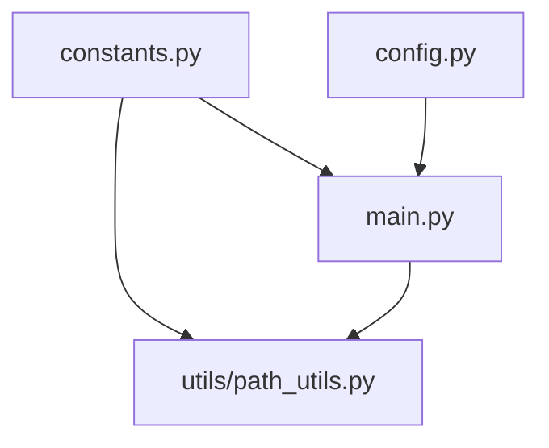

# .cgrignore Configuration

<cite>
**Referenced Files in This Document**
- [config.py](file://codebase_rag/config.py)
- [types_defs.py](file://codebase_rag/types_defs.py)
- [main.py](file://codebase_rag/main.py)
- [path_utils.py](file://codebase_rag/utils/path_utils.py)
- [constants.py](file://codebase_rag/constants.py)
- [test_cgrignore.py](file://codebase_rag/tests/test_cgrignore.py)
- [test_exclude_patterns.py](file://codebase_rag/tests/test_exclude_patterns.py)
</cite>

## Table of Contents
1. [Introduction](#introduction)
2. [Project Structure](#project-structure)
3. [Core Components](#core-components)
4. [Architecture Overview](#architecture-overview)
5. [Detailed Component Analysis](#detailed-component-analysis)
6. [Dependency Analysis](#dependency-analysis)
7. [Performance Considerations](#performance-considerations)
8. [Troubleshooting Guide](#troubleshooting-guide)
9. [Conclusion](#conclusion)

## Introduction
This document explains the .cgrignore file format and configuration system used to control which directories and files are excluded from parsing and included in the knowledge graph. It covers the CgrignorePatterns data structure, syntax rules, loading and precedence mechanisms, and how ignore patterns integrate with language-specific parsing and knowledge graph construction. Practical examples and troubleshooting guidance are included to help you configure .cgrignore effectively for different project types.

## Project Structure
The .cgrignore configuration is implemented across several modules:
- Configuration loader and data structures
- Interactive directory selection and grouping
- Path filtering logic for parsing decisions
- Constants defining default ignore patterns and suffixes
- Tests validating behavior and edge cases

**Diagram sources**
- [config.py](file://codebase_rag/config.py#L242-L274)
- [types_defs.py](file://codebase_rag/types_defs.py#L242-L245)
- [main.py](file://codebase_rag/main.py#L768-L786)
- [main.py](file://codebase_rag/main.py#L887-L946)
- [path_utils.py](file://codebase_rag/utils/path_utils.py#L6-L28)
- [constants.py](file://codebase_rag/constants.py#L780-L828)

**Section sources**
- [config.py](file://codebase_rag/config.py#L236-L274)
- [types_defs.py](file://codebase_rag/types_defs.py#L242-L245)
- [main.py](file://codebase_rag/main.py#L768-L786)
- [main.py](file://codebase_rag/main.py#L887-L946)
- [path_utils.py](file://codebase_rag/utils/path_utils.py#L6-L28)
- [constants.py](file://codebase_rag/constants.py#L780-L828)

## Core Components
- CgrignorePatterns: Immutable named tuple containing two frozensets:
  - exclude: patterns to exclude from parsing
  - unignore: patterns to un-ignore even if matched by defaults
- Loader: Reads .cgrignore from the repository root and parses lines into the above sets
- Interactive selection: Detects candidate directories, groups them, and lets users choose which to keep
- Path filtering: Determines whether a path should be skipped based on suffixes, explicit excludes, unignores, and default ignore patterns

**Section sources**
- [types_defs.py](file://codebase_rag/types_defs.py#L242-L245)
- [config.py](file://codebase_rag/config.py#L242-L274)
- [main.py](file://codebase_rag/main.py#L768-L786)
- [main.py](file://codebase_rag/main.py#L887-L946)
- [path_utils.py](file://codebase_rag/utils/path_utils.py#L6-L28)
- [constants.py](file://codebase_rag/constants.py#L780-L828)

## Architecture Overview
The .cgrignore system integrates with interactive directory detection and path filtering to influence parsing and knowledge graph construction.

**Diagram sources**
- [main.py](file://codebase_rag/main.py#L768-L786)
- [main.py](file://codebase_rag/main.py#L887-L946)
- [config.py](file://codebase_rag/config.py#L242-L274)
- [path_utils.py](file://codebase_rag/utils/path_utils.py#L6-L28)

## Detailed Component Analysis

### .cgrignore File Format and Syntax
- File name: .cgrignore
- Location: Repository root
- Lines are processed as follows:
  - Blank lines and comments (starting with #) are ignored
  - Lines starting with ! indicate unignore patterns
  - Other lines are treated as exclude patterns
  - Leading/trailing whitespace is stripped
  - Duplicate patterns are deduplicated automatically

Behavior validated by tests:
- Comments and blank lines are ignored
- Whitespace is stripped around patterns
- Negation syntax with ! is parsed into unignore set
- Mixed exclude and negation lines work together
- Duplicates are removed; empty file yields empty patterns
- Non-file .cgrignore returns empty patterns

**Section sources**
- [config.py](file://codebase_rag/config.py#L242-L274)
- [test_cgrignore.py](file://codebase_rag/tests/test_cgrignore.py#L34-L88)
- [test_cgrignore.py](file://codebase_rag/tests/test_cgrignore.py#L91-L135)

### CgrignorePatterns Data Structure
- Fields:
  - exclude: frozenset[str] — patterns to exclude
  - unignore: frozenset[str] — patterns to un-ignore
- Construction:
  - Built from parsed .cgrignore lines
  - Returned as immutable named tuple for safe sharing

**Diagram sources**
- [types_defs.py](file://codebase_rag/types_defs.py#L242-L245)

**Section sources**
- [types_defs.py](file://codebase_rag/types_defs.py#L242-L245)

### Loading Mechanism and Precedence
- Loading:
  - load_cgrignore_patterns reads the .cgrignore file if present
  - Returns EMPTY_CGRIGNORE if the file does not exist or is unreadable
- Precedence:
  - CLI-provided exclude patterns are merged with .cgrignore exclude patterns
  - Unignore patterns from .cgrignore are always considered
  - Interactive selection allows overriding defaults and .cgrignore choices

**Diagram sources**
- [config.py](file://codebase_rag/config.py#L242-L274)
- [main.py](file://codebase_rag/main.py#L887-L946)

**Section sources**
- [config.py](file://codebase_rag/config.py#L242-L274)
- [main.py](file://codebase_rag/main.py#L887-L946)

### Interaction with Language-Specific Parsing and Knowledge Graph Construction
- Default ignore patterns:
  - constants.IGNORE_PATTERNS defines directory names commonly excluded
  - constants.IGNORE_SUFFIXES defines file suffixes commonly excluded
- Path filtering:
  - should_skip_path evaluates:
    - Suffix checks against IGNORE_SUFFIXES
    - Explicit exclude_paths (from CLI and .cgrignore exclude)
    - Unignore overrides (from .cgrignore unignore)
    - Default ignore patterns for directory names
- Knowledge graph construction:
  - Paths marked to skip are not parsed by language-specific parsers
  - This reduces noise and improves graph quality by excluding build artifacts, caches, and vendored libraries

**Diagram sources**
- [path_utils.py](file://codebase_rag/utils/path_utils.py#L6-L28)
- [constants.py](file://codebase_rag/constants.py#L780-L828)

**Section sources**
- [path_utils.py](file://codebase_rag/utils/path_utils.py#L6-L28)
- [constants.py](file://codebase_rag/constants.py#L780-L828)
- [test_exclude_patterns.py](file://codebase_rag/tests/test_exclude_patterns.py#L374-L427)
- [test_exclude_patterns.py](file://codebase_rag/tests/test_exclude_patterns.py#L429-L482)

### Practical Examples of Common Ignore Patterns
- Build artifacts and caches:
  - node_modules, vendor, dist, build, target, out, obj, bin
- Virtual environments and IDE caches:
  - .venv, venv, .env, .git, .idea, .vscode, .mypy_cache, __pycache__
- Generated or temporary files:
  - *.tmp, ~, .pyc, .so, .dll, .class
- Language-specific:
  - site-packages (Python), Pods (Swift), cargo target (Rust), etc.

These patterns are derived from constants.IGNORE_PATTERNS and constants.IGNORE_SUFFIXES and can be overridden or extended via .cgrignore.

**Section sources**
- [constants.py](file://codebase_rag/constants.py#L780-L828)

### Relationship Between .cgrignore and Standard .gitignore Patterns
- .cgrignore is not a direct superset of .gitignore semantics:
  - .cgrignore supports negation with ! to un-ignore specific paths
  - .cgrignore operates at the parsing level for knowledge graph construction
  - .gitignore governs Git’s own ignore behavior and is unrelated to .cgrignore
- Recommendation:
  - Align .cgrignore patterns with typical .gitignore exclusions for consistency
  - Use ! to un-ignore specific subdirectories or files within otherwise excluded folders

[No sources needed since this section clarifies conceptual relationships without quoting specific code]

### How to Specify Directories and Files to Exclude
- Directory names:
  - Add the directory name on its own line (e.g., vendor)
- Full paths:
  - Add a full path to exclude a nested subtree (e.g., build/temp)
- Negation:
  - Prefix with ! to un-ignore a previously excluded path (e.g., !vendor/lib)
- Comments:
  - Lines starting with # are ignored

Validation and behavior are covered by tests for parsing, whitespace handling, and mixed patterns.

**Section sources**
- [config.py](file://codebase_rag/config.py#L242-L274)
- [test_cgrignore.py](file://codebase_rag/tests/test_cgrignore.py#L91-L135)

## Dependency Analysis
The .cgrignore system depends on:
- constants.IGNORE_PATTERNS and constants.IGNORE_SUFFIXES for default behavior
- Interactive detection and grouping in main.py to present candidates to users
- Path filtering in utils/path_utils.py to decide whether to parse a path

**Diagram sources**
- [constants.py](file://codebase_rag/constants.py#L780-L828)
- [config.py](file://codebase_rag/config.py#L242-L274)
- [main.py](file://codebase_rag/main.py#L768-L786)
- [main.py](file://codebase_rag/main.py#L887-L946)
- [path_utils.py](file://codebase_rag/utils/path_utils.py#L6-L28)

**Section sources**
- [constants.py](file://codebase_rag/constants.py#L780-L828)
- [config.py](file://codebase_rag/config.py#L242-L274)
- [main.py](file://codebase_rag/main.py#L768-L786)
- [main.py](file://codebase_rag/main.py#L887-L946)
- [path_utils.py](file://codebase_rag/utils/path_utils.py#L6-L28)

## Performance Considerations
- Pattern sets are frozensets for fast membership testing
- Path filtering short-circuits on suffix checks and explicit excludes
- Interactive grouping minimizes repeated scanning by consolidating candidates

[No sources needed since this section provides general guidance]

## Troubleshooting Guide
Common issues and resolutions:
- A file or directory is being excluded but should not be:
  - Verify suffix is not in IGNORE_SUFFIXES
  - Check if the path matches an exclude pattern from CLI or .cgrignore
  - Use unignore patterns (with !) to override defaults or .cgrignore excludes
- A file or directory should be excluded but is not:
  - Confirm the path matches a default ignore pattern in IGNORE_PATTERNS
  - Ensure the pattern is correctly formatted in .cgrignore (whitespace is trimmed)
  - Validate that negation is not unintentionally overriding the exclusion
- Mixed scenarios:
  - Tests demonstrate that explicit exclude takes precedence over unignore when both match a path

**Section sources**
- [test_exclude_patterns.py](file://codebase_rag/tests/test_exclude_patterns.py#L429-L482)
- [test_exclude_patterns.py](file://codebase_rag/tests/test_exclude_patterns.py#L522-L605)
- [test_exclude_patterns.py](file://codebase_rag/tests/test_exclude_patterns.py#L627-L648)

## Conclusion
.cgrignore provides a concise, flexible way to control which parts of your repository are parsed and included in the knowledge graph. By combining explicit excludes, negations, and default ignore patterns, you can tailor the indexing process to your project’s needs. Use the provided tests and examples as references to craft effective .cgrignore configurations for your environment.