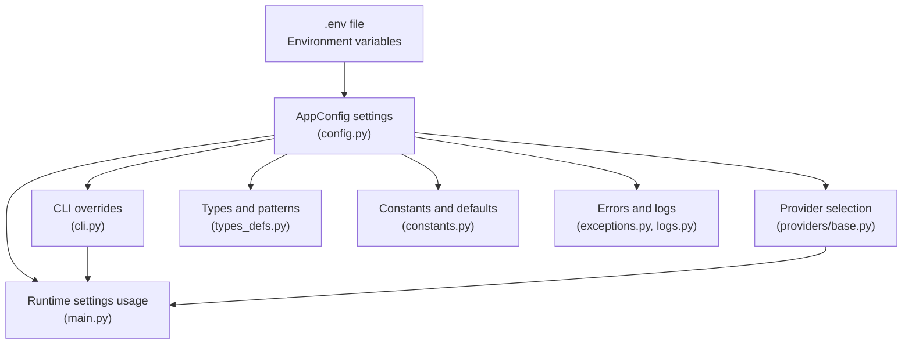
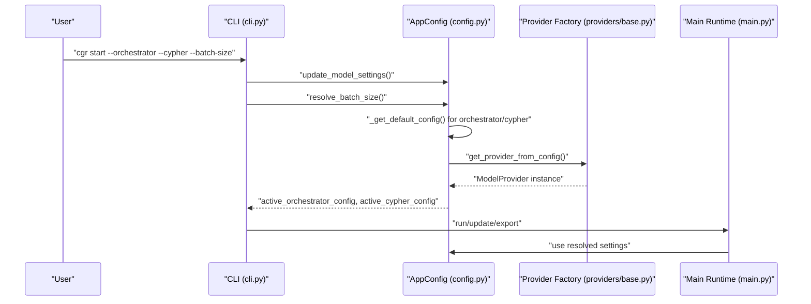
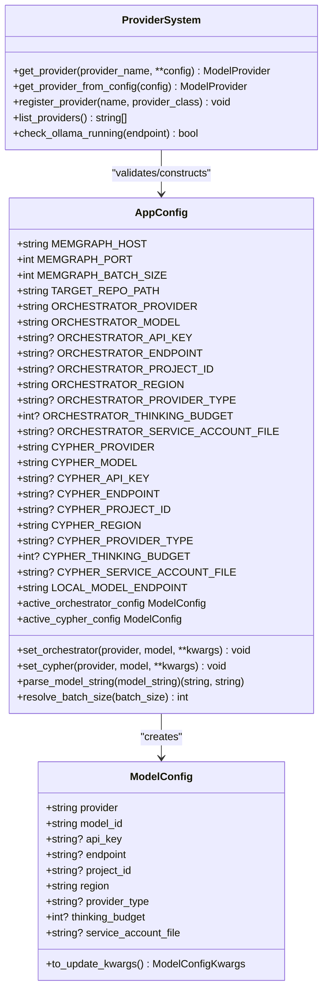
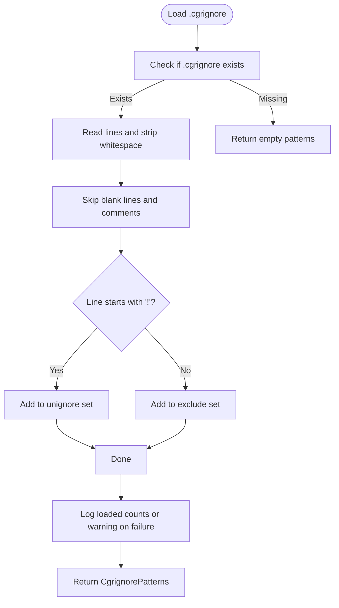
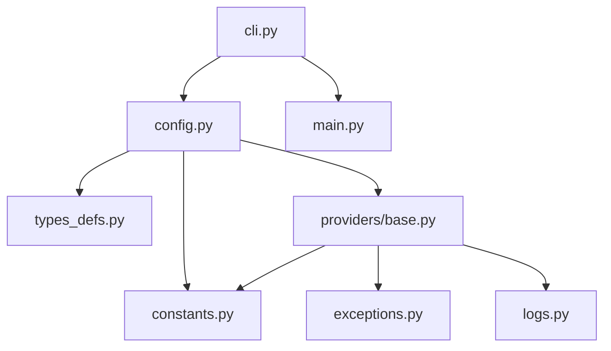

# Configuration Management

<cite>
**Referenced Files in This Document**
- [config.py](file://codebase_rag/config.py)
- [constants.py](file://codebase_rag/constants.py)
- [cli.py](file://codebase_rag/cli.py)
- [cli_help.py](file://codebase_rag/cli_help.py)
- [main.py](file://codebase_rag/main.py)
- [providers/base.py](file://codebase_rag/providers/base.py)
- [exceptions.py](file://codebase_rag/exceptions.py)
- [logs.py](file://codebase_rag/logs.py)
- [types_defs.py](file://codebase_rag/types_defs.py)
- [.cgrignore](file://README.md)
</cite>

## Table of Contents
1. [Introduction](#introduction)
2. [Project Structure](#project-structure)
3. [Core Components](#core-components)
4. [Architecture Overview](#architecture-overview)
5. [Detailed Component Analysis](#detailed-component-analysis)
6. [Dependency Analysis](#dependency-analysis)
7. [Performance Considerations](#performance-considerations)
8. [Troubleshooting Guide](#troubleshooting-guide)
9. [Conclusion](#conclusion)
10. [Appendices](#appendices)

## Introduction
This document explains the Graph-Code configuration management system. It covers environment variables, provider-explicit configuration for orchestrator and Cypher models, database settings, system parameters, the .cgrignore file format, validation and error handling, practical configuration scenarios, security considerations, troubleshooting, and the relationship between configuration and command-line overrides.

## Project Structure
The configuration system centers around a settings class that loads environment variables and a .env file, a provider abstraction for model selection, and CLI integration for runtime overrides. The key files are:
- Settings and model configuration: config.py
- Constants and defaults: constants.py
- CLI and command overrides: cli.py, cli_help.py
- Provider selection and validation: providers/base.py
- Validation errors and logs: exceptions.py, logs.py
- Types and patterns: types_defs.py
- .cgrignore format and usage: README.md

**Diagram sources**
- [config.py](file://codebase_rag/config.py#L39-L234)
- [cli.py](file://codebase_rag/cli.py#L55-L172)
- [main.py](file://codebase_rag/main.py#L107-L162)
- [providers/base.py](file://codebase_rag/providers/base.py#L179-L194)
- [types_defs.py](file://codebase_rag/types_defs.py#L142-L149)
- [constants.py](file://codebase_rag/constants.py#L122-L124)
- [exceptions.py](file://codebase_rag/exceptions.py#L1-L60)
- [logs.py](file://codebase_rag/logs.py#L93-L96)

**Section sources**
- [config.py](file://codebase_rag/config.py#L39-L234)
- [cli.py](file://codebase_rag/cli.py#L55-L172)
- [main.py](file://codebase_rag/main.py#L107-L162)
- [providers/base.py](file://codebase_rag/providers/base.py#L179-L194)
- [types_defs.py](file://codebase_rag/types_defs.py#L142-L149)
- [constants.py](file://codebase_rag/constants.py#L122-L124)
- [exceptions.py](file://codebase_rag/exceptions.py#L1-L60)
- [logs.py](file://codebase_rag/logs.py#L93-L96)

## Core Components
- AppConfig: Loads environment variables from .env, defines defaults, and exposes active model configurations for orchestrator and Cypher. It also resolves batch sizes and provides helpers to parse provider:model strings and set active models at runtime.
- ModelConfig: Encapsulates provider, model_id, and optional provider-specific fields (API key, endpoint, project/region for cloud providers, thinking budget, service account file).
- Provider system: Selects and validates providers (Google, OpenAI, Ollama) and constructs models based on configuration.
- CLI integration: Allows overriding orchestrator and Cypher models and batch size at runtime, merging with environment settings.
- .cgrignore: Repository-level exclusion patterns for indexing.

Key environment variables and parameters:
- Provider settings
  - ORCHESTRATOR_PROVIDER, ORCHESTRATOR_MODEL, ORCHESTRATOR_API_KEY, ORCHESTRATOR_ENDPOINT, ORCHESTRATOR_PROJECT_ID, ORCHESTRATOR_REGION, ORCHESTRATOR_PROVIDER_TYPE, ORCHESTRATOR_THINKING_BUDGET, ORCHESTRATOR_SERVICE_ACCOUNT_FILE
  - CYPHER_PROVIDER, CYPHER_MODEL, CYPHER_API_KEY, CYPHER_ENDPOINT, CYPHER_PROJECT_ID, CYPHER_REGION, CYPHER_PROVIDER_TYPE, CYPHER_THINKING_BUDGET, CYPHER_SERVICE_ACCOUNT_FILE
- System settings
  - MEMGRAPH_HOST, MEMGRAPH_PORT, MEMGRAPH_HTTP_PORT, LAB_PORT, MEMGRAPH_BATCH_SIZE, TARGET_REPO_PATH, LOCAL_MODEL_ENDPOINT
- CLI overrides
  - --orchestrator, --cypher, --batch-size

**Section sources**
- [config.py](file://codebase_rag/config.py#L50-L113)
- [config.py](file://codebase_rag/config.py#L163-L218)
- [constants.py](file://codebase_rag/constants.py#L12-L22)
- [cli_help.py](file://codebase_rag/cli_help.py#L34-L44)
- [cli.py](file://codebase_rag/cli.py#L76-L96)

## Architecture Overview
The configuration pipeline:
- Load environment variables (.env) into AppConfig
- Resolve active model configurations (provider/model/API key/endpoint)
- Apply CLI overrides for orchestrator/cypher and batch size
- Validate provider settings and connectivity
- Use resolved settings for graph ingestion, querying, and export

**Diagram sources**
- [cli.py](file://codebase_rag/cli.py#L118-L120)
- [config.py](file://codebase_rag/config.py#L197-L218)
- [providers/base.py](file://codebase_rag/providers/base.py#L179-L189)
- [main.py](file://codebase_rag/main.py#L138-L154)

## Detailed Component Analysis

### Environment Variables and Defaults
- Provider configuration (orchestrator)
  - ORCHESTRATOR_PROVIDER, ORCHESTRATOR_MODEL, ORCHESTRATOR_API_KEY, ORCHESTRATOR_ENDPOINT, ORCHESTRATOR_PROJECT_ID, ORCHESTRATOR_REGION, ORCHESTRATOR_PROVIDER_TYPE, ORCHESTRATOR_THINKING_BUDGET, ORCHESTRATOR_SERVICE_ACCOUNT_FILE
- Provider configuration (Cypher)
  - CYPHER_PROVIDER, CYPHER_MODEL, CYPHER_API_KEY, CYPHER_ENDPOINT, CYPHER_PROJECT_ID, CYPHER_REGION, CYPHER_PROVIDER_TYPE, CYPHER_THINKING_BUDGET, CYPHER_SERVICE_ACCOUNT_FILE
- System parameters
  - MEMGRAPH_HOST, MEMGRAPH_PORT, MEMGRAPH_HTTP_PORT, LAB_PORT, MEMGRAPH_BATCH_SIZE, TARGET_REPO_PATH, LOCAL_MODEL_ENDPOINT
- Defaults and constants
  - DEFAULT_REGION, DEFAULT_MODEL, DEFAULT_API_KEY, OPENAI_DEFAULT_ENDPOINT, OLLAMA_DEFAULT_ENDPOINT, OLLAMA_HEALTH_PATH, HTTP_OK

Behavior highlights:
- If provider/model are present for a role, they are used; otherwise, defaults to Ollama with a local endpoint and default API key.
- LOCAL_MODEL_ENDPOINT is used for Ollama fallback when switching models.

**Section sources**
- [config.py](file://codebase_rag/config.py#L50-L113)
- [config.py](file://codebase_rag/config.py#L163-L189)
- [constants.py](file://codebase_rag/constants.py#L122-L143)

### Provider-Explicit Configuration System
- Separate provider/model settings for orchestrator and Cypher enable mixing providers (e.g., Google orchestrator + Ollama Cypher).
- At runtime, CLI can override either or both roles independently.
- Provider validation ensures required keys and endpoints are present depending on provider type.

**Diagram sources**
- [config.py](file://codebase_rag/config.py#L20-L36)
- [config.py](file://codebase_rag/config.py#L39-L234)
- [providers/base.py](file://codebase_rag/providers/base.py#L179-L208)

**Section sources**
- [config.py](file://codebase_rag/config.py#L163-L218)
- [providers/base.py](file://codebase_rag/providers/base.py#L179-L194)

### Configuration Precedence and Inheritance
- Environment variables (.env) define base settings.
- CLI overrides take effect at runtime:
  - --orchestrator and --cypher override the active model for that role.
  - --batch-size overrides the Memgraph batch size.
- Active model resolution:
  - If provider/model are set for a role, use them; otherwise, default to Ollama with LOCAL_MODEL_ENDPOINT and DEFAULT_API_KEY.
- Provider-specific fields inherit from environment unless overridden at runtime.

**Section sources**
- [config.py](file://codebase_rag/config.py#L197-L218)
- [config.py](file://codebase_rag/config.py#L227-L231)
- [cli.py](file://codebase_rag/cli.py#L118-L120)
- [main.py](file://codebase_rag/main.py#L697-L724)

### .cgrignore File Format
- Located at repository root as .cgrignore.
- Format:
  - One directory name per line.
  - Lines starting with # are comments.
  - Blank lines are ignored.
  - Patterns are exact directory name matches (not globs).
  - Negation with ! to unignore specific paths.
- Behavior:
  - Loaded during indexing/update/export.
  - Merged with --exclude CLI flags and auto-detected ignore patterns.
  - Logs success or warnings on read failures.

**Diagram sources**
- [config.py](file://codebase_rag/config.py#L242-L273)
- [logs.py](file://codebase_rag/logs.py#L93-L96)

**Section sources**
- [config.py](file://codebase_rag/config.py#L236-L273)
- [logs.py](file://codebase_rag/logs.py#L93-L96)
- [.cgrignore](file://README.md#L653-L669)

### Settings Validation and Error Handling
- Provider validation:
  - Google GLA requires API key.
  - Google Vertex requires project_id.
  - OpenAI requires API key.
  - Ollama requires server running at endpoint.
- Batch size validation:
  - Must be positive; otherwise raises error.
- CLI validation:
  - --output requires --update-graph.
  - Model format must be provider:model.
- Logging:
  - Successful loading of .cgrignore.
  - Warnings on read failures.
  - Errors for invalid model/provider/format and startup failures.

**Section sources**
- [providers/base.py](file://codebase_rag/providers/base.py#L63-L67)
- [providers/base.py](file://codebase_rag/providers/base.py#L115-L117)
- [providers/base.py](file://codebase_rag/providers/base.py#L143-L147)
- [config.py](file://codebase_rag/config.py#L227-L231)
- [cli.py](file://codebase_rag/cli.py#L112-L116)
- [exceptions.py](file://codebase_rag/exceptions.py#L2-L29)
- [logs.py](file://codebase_rag/logs.py#L93-L96)

### Practical Configuration Scenarios
- All Ollama (local models)
  - Set ORCHESTRATOR_PROVIDER=ollama, ORCHESTRATOR_MODEL=<model>, ORCHESTRATOR_ENDPOINT=<local endpoint>
  - Set CYPHER_PROVIDER=ollama, CYPHER_MODEL=<model>, CYPHER_ENDPOINT=<local endpoint>
- All OpenAI models
  - Set ORCHESTRATOR_PROVIDER=openai, ORCHESTRATOR_MODEL=<model>, ORCHESTRATOR_API_KEY=<key>
  - Set CYPHER_PROVIDER=openai, CYPHER_MODEL=<model>, CYPHER_API_KEY=<key>
- All Google models
  - Set ORCHESTRATOR_PROVIDER=google, ORCHESTRATOR_MODEL=<model>, ORCHESTRATOR_API_KEY=<key>
  - Set CYPHER_PROVIDER=google, CYPHER_MODEL=<model>, CYPHER_API_KEY=<key>
- Mixed providers
  - Example: Google orchestrator + Ollama Cypher
  - Configure both roles independently

Notes:
- For Google Vertex, set ORCHESTRATOR_PROJECT_ID and region.
- For Ollama, ensure server is running locally.

**Section sources**
- [README.md](file://README.md#L145-L216)

### Security Considerations
- API keys and sensitive configuration:
  - Store in .env file; do not commit secrets to version control.
  - Provider-specific keys:
    - ORCHESTRATOR_API_KEY, CYPHER_API_KEY
    - Google Vertex: ORCHESTRATOR_PROJECT_ID, ORCHESTRATOR_SERVICE_ACCOUNT_FILE
- Environment isolation:
  - Use virtual environments and restrict permissions on .env.
- Least privilege:
  - Use minimal required scopes for cloud providers (e.g., Vertex AI service account file).

**Section sources**
- [providers/base.py](file://codebase_rag/providers/base.py#L40-L98)
- [providers/base.py](file://codebase_rag/providers/base.py#L100-L126)
- [providers/base.py](file://codebase_rag/providers/base.py#L128-L156)

### Relationship Between Configuration and CLI Overrides
- --orchestrator and --cypher accept provider:model format and update active model settings at runtime.
- --batch-size overrides MEMGRAPH_BATCH_SIZE for the current operation.
- --output requires --update-graph; otherwise, CLI exits with error.
- Interactive setup merges .cgrignore unignores with user selections.

**Section sources**
- [cli.py](file://codebase_rag/cli.py#L76-L116)
- [cli.py](file://codebase_rag/cli.py#L118-L162)
- [main.py](file://codebase_rag/main.py#L697-L724)

## Dependency Analysis
- AppConfig depends on:
  - constants.py for defaults and enums
  - types_defs.py for ModelConfigKwargs
  - providers/base.py for provider selection
- CLI depends on:
  - AppConfig for settings
  - main.py for execution flows
- Providers depend on:
  - exceptions.py and logs.py for error messages and logging
  - constants.py for endpoints and defaults

**Diagram sources**
- [config.py](file://codebase_rag/config.py#L12-L15)
- [cli.py](file://codebase_rag/cli.py#L10-L21)
- [providers/base.py](file://codebase_rag/providers/base.py#L14-L17)

**Section sources**
- [config.py](file://codebase_rag/config.py#L12-L15)
- [cli.py](file://codebase_rag/cli.py#L10-L21)
- [providers/base.py](file://codebase_rag/providers/base.py#L14-L17)

## Performance Considerations
- MEMGRAPH_BATCH_SIZE controls flush frequency to Memgraph; larger batches reduce overhead but increase memory usage.
- Ollama health checks occur during provider validation; ensure endpoint responsiveness to avoid delays.
- .cgrignore reduces indexing scope; tune exclusions to balance completeness and speed.

[No sources needed since this section provides general guidance]

## Troubleshooting Guide
Common issues and resolutions:
- Ollama not running
  - Symptom: Provider validation error indicating server not responding.
  - Resolution: Start Ollama server locally and verify endpoint.
- Missing API keys
  - Symptom: Provider validation errors for Google/OpenAI.
  - Resolution: Set ORCHESTRATOR_API_KEY/CYPHER_API_KEY or configure provider-specific fields.
- Invalid model/provider format
  - Symptom: CLI/model parsing errors.
  - Resolution: Use provider:model format (e.g., google:gemini-2.5-pro).
- Output without update
  - Symptom: CLI error stating --output requires --update-graph.
  - Resolution: Add --update-graph when using --output.
- .cgrignore read failures
  - Symptom: Warning logs about failing to read .cgrignore.
  - Resolution: Check file permissions and path correctness.

**Section sources**
- [providers/base.py](file://codebase_rag/providers/base.py#L143-L147)
- [exceptions.py](file://codebase_rag/exceptions.py#L14-L17)
- [exceptions.py](file://codebase_rag/exceptions.py#L24-L28)
- [cli.py](file://codebase_rag/cli.py#L112-L116)
- [logs.py](file://codebase_rag/logs.py#L95-L96)

## Conclusion
Graph-Code’s configuration system combines environment-driven settings with flexible provider-explicit configuration and CLI overrides. It supports mixing providers for orchestrator and Cypher, validates inputs rigorously, and provides clear error messaging. The .cgrignore mechanism complements environment settings for repository-wide exclusions. By following the scenarios and security recommendations here, teams can deploy Graph-Code reliably across diverse environments.

## Appendices

### Appendix A: Environment Variables Reference
- Provider settings
  - ORCHESTRATOR_PROVIDER, ORCHESTRATOR_MODEL, ORCHESTRATOR_API_KEY, ORCHESTRATOR_ENDPOINT, ORCHESTRATOR_PROJECT_ID, ORCHESTRATOR_REGION, ORCHESTRATOR_PROVIDER_TYPE, ORCHESTRATOR_THINKING_BUDGET, ORCHESTRATOR_SERVICE_ACCOUNT_FILE
  - CYPHER_PROVIDER, CYPHER_MODEL, CYPHER_API_KEY, CYPHER_ENDPOINT, CYPHER_PROJECT_ID, CYPHER_REGION, CYPHER_PROVIDER_TYPE, CYPHER_THINKING_BUDGET, CYPHER_SERVICE_ACCOUNT_FILE
- System settings
  - MEMGRAPH_HOST, MEMGRAPH_PORT, MEMGRAPH_HTTP_PORT, LAB_PORT, MEMGRAPH_BATCH_SIZE, TARGET_REPO_PATH, LOCAL_MODEL_ENDPOINT

**Section sources**
- [config.py](file://codebase_rag/config.py#L50-L113)
- [constants.py](file://codebase_rag/constants.py#L122-L143)

### Appendix B: CLI Overrides Reference
- --orchestrator provider:model
- --cypher provider:model
- --batch-size N
- --output path (requires --update-graph)

**Section sources**
- [cli_help.py](file://codebase_rag/cli_help.py#L34-L44)
- [cli.py](file://codebase_rag/cli.py#L76-L96)
- [cli.py](file://codebase_rag/cli.py#L112-L116)