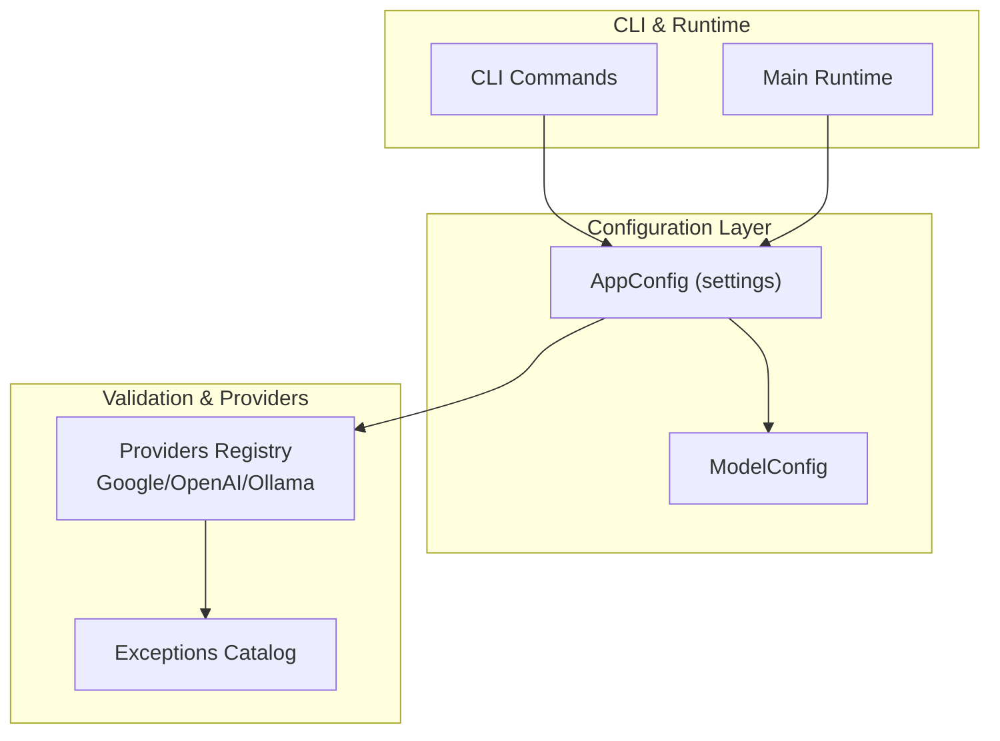
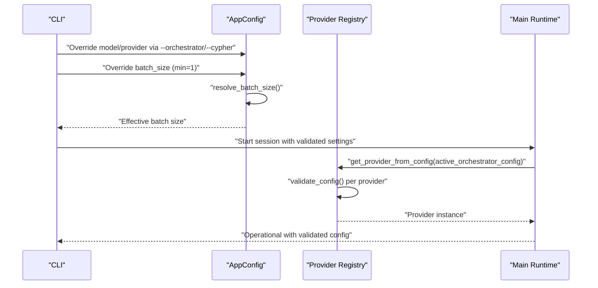
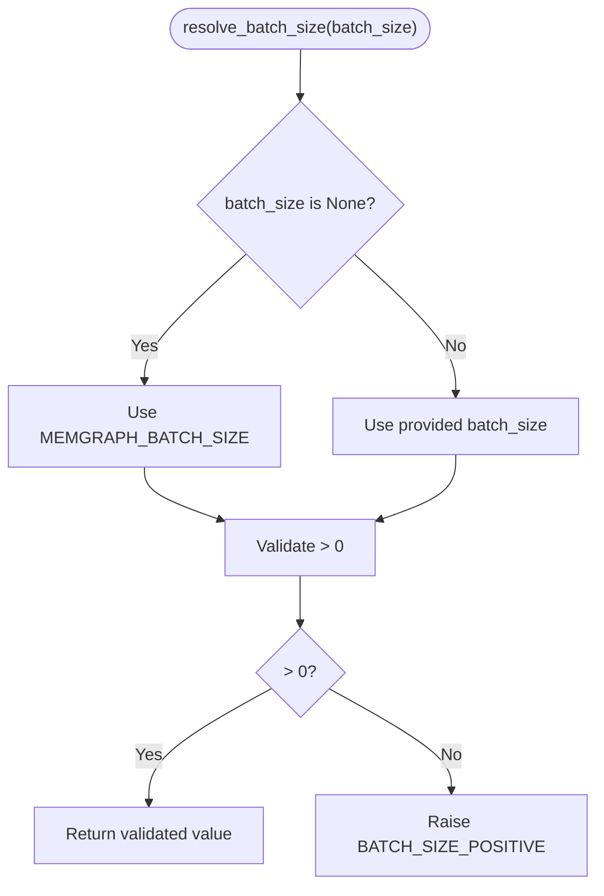
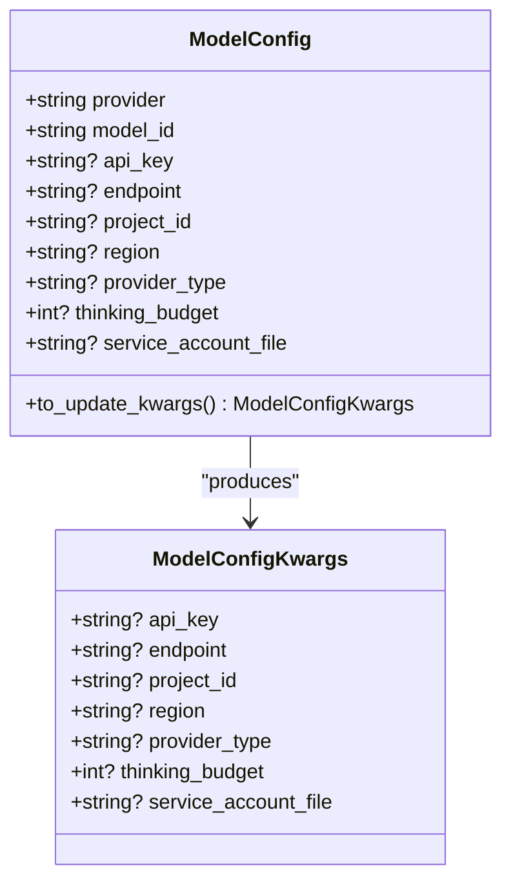
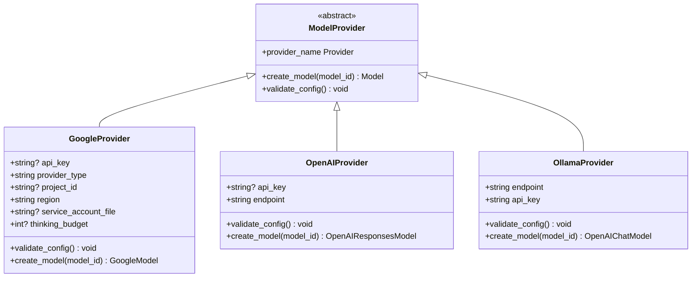
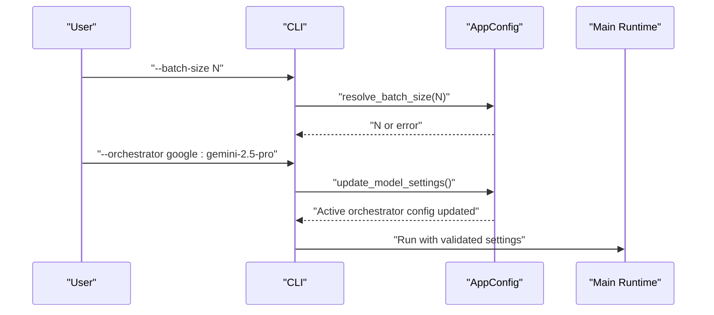
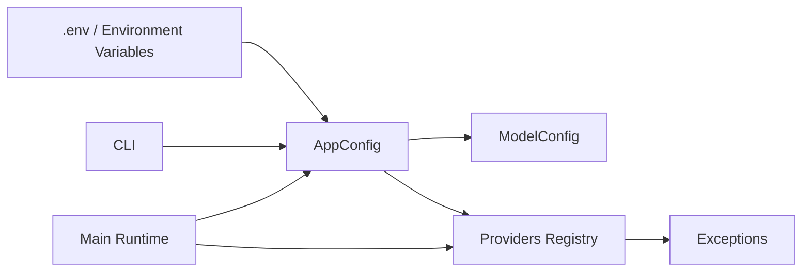

# Configuration Validation and Error Handling

<cite>
**Referenced Files in This Document**
- [config.py](file://codebase_rag/config.py)
- [exceptions.py](file://codebase_rag/exceptions.py)
- [constants.py](file://codebase_rag/constants.py)
- [types_defs.py](file://codebase_rag/types_defs.py)
- [cli.py](file://codebase_rag/cli.py)
- [main.py](file://codebase_rag/main.py)
- [providers/base.py](file://codebase_rag/providers/base.py)
- [logs.py](file://codebase_rag/logs.py)
</cite>

## Table of Contents
1. [Introduction](#introduction)
2. [Project Structure](#project-structure)
3. [Core Components](#core-components)
4. [Architecture Overview](#architecture-overview)
5. [Detailed Component Analysis](#detailed-component-analysis)
6. [Dependency Analysis](#dependency-analysis)
7. [Performance Considerations](#performance-considerations)
8. [Troubleshooting Guide](#troubleshooting-guide)
9. [Conclusion](#conclusion)

## Introduction
This document explains the configuration validation system and error handling mechanisms in Graph-Code. It covers:
- AppConfig class validation, including positive value checks for batch sizes and timeouts
- ModelConfig validation and parameter validation logic
- Exception handling for invalid configurations, missing API keys, and unsupported provider combinations
- Settings precedence among environment variables, .env files, and command-line overrides
- Logging and warning systems for configuration issues
- Examples of common configuration errors and their solutions
- Graceful fallback mechanisms when configuration is incomplete or invalid
- Debugging techniques and best practices for production configuration management

## Project Structure
The configuration system centers around a settings object that loads environment variables and .env files, validates inputs, and exposes strongly-typed configuration for downstream services. CLI commands feed overrides that supersede environment defaults.

**Diagram sources**
- [config.py](file://codebase_rag/config.py#L39-L234)
- [providers/base.py](file://codebase_rag/providers/base.py#L158-L209)
- [cli.py](file://codebase_rag/cli.py#L107-L172)
- [main.py](file://codebase_rag/main.py#L535-L565)

**Section sources**
- [config.py](file://codebase_rag/config.py#L39-L234)
- [cli.py](file://codebase_rag/cli.py#L107-L172)

## Core Components
- AppConfig: Centralized settings loader and validator. Loads from environment and .env, resolves defaults, validates constraints, and exposes active model configurations.
- ModelConfig: Immutable data structure representing a single model’s provider and connection parameters.
- Exceptions catalog: Standardized error messages for configuration and provider validation failures.
- Providers registry: Validates provider-specific requirements (e.g., API keys, project IDs) and raises descriptive errors.
- CLI: Applies command-line overrides and enforces minimum constraints (e.g., positive batch size).

Key responsibilities:
- Positive value validation for batch sizes and timeouts
- Provider-specific validation (API keys, project IDs, endpoint reachability)
- Precedence of CLI overrides over environment and .env
- Logging and warnings for recoverable issues

**Section sources**
- [config.py](file://codebase_rag/config.py#L39-L234)
- [exceptions.py](file://codebase_rag/exceptions.py#L1-L60)
- [providers/base.py](file://codebase_rag/providers/base.py#L40-L156)
- [cli.py](file://codebase_rag/cli.py#L91-L96)

## Architecture Overview
The configuration pipeline integrates environment loading, validation, and runtime usage across CLI and main application.

**Diagram sources**
- [cli.py](file://codebase_rag/cli.py#L107-L120)
- [config.py](file://codebase_rag/config.py#L226-L231)
- [providers/base.py](file://codebase_rag/providers/base.py#L179-L189)
- [main.py](file://codebase_rag/main.py#L535-L565)

## Detailed Component Analysis

### AppConfig: Settings Loading, Defaults, and Validation
- Environment and .env loading: Uses Pydantic Settings with case-insensitive keys and UTF-8 encoding.
- Defaults: Provides sensible defaults for hosts, ports, timeouts, batch sizes, and model endpoints.
- Active model selection: Builds ModelConfig from environment variables or falls back to Ollama defaults.
- Overrides: set_orchestrator/set_cypher allow runtime overrides.
- Validation:
  - parse_model_string enforces non-empty provider/model parts and rejects malformed “provider:model” strings.
  - resolve_batch_size ensures batch_size is a positive integer, raising a configuration error otherwise.

**Diagram sources**
- [config.py](file://codebase_rag/config.py#L226-L231)
- [exceptions.py](file://codebase_rag/exceptions.py#L29-L29)

**Section sources**
- [config.py](file://codebase_rag/config.py#L39-L234)
- [exceptions.py](file://codebase_rag/exceptions.py#L23-L31)

### ModelConfig: Parameter Representation and Updates
- Fields include provider, model_id, api_key, endpoint, project_id, region, provider_type, thinking_budget, service_account_file.
- to_update_kwargs strips provider and model_id to produce a kwargs dict suitable for updating active configs.

**Diagram sources**
- [config.py](file://codebase_rag/config.py#L20-L37)
- [types_defs.py](file://codebase_rag/types_defs.py#L142-L149)

**Section sources**
- [config.py](file://codebase_rag/config.py#L20-L37)
- [types_defs.py](file://codebase_rag/types_defs.py#L142-L149)

### Provider-Specific Validation and Error Handling
- GoogleProvider:
  - GLA requires api_key; Vertex requires project_id; raises descriptive errors.
  - Supports optional thinking budget via provider settings.
- OpenAIProvider:
  - Requires api_key; uses default endpoint if not overridden.
- OllamaProvider:
  - Validates endpoint reachability via health check; raises OLLAMA_NOT_RUNNING if unreachable.
- Unknown provider:
  - get_provider raises UNKNOWN_PROVIDER with a list of supported providers.

**Diagram sources**
- [providers/base.py](file://codebase_rag/providers/base.py#L20-L156)
- [exceptions.py](file://codebase_rag/exceptions.py#L2-L17)

**Section sources**
- [providers/base.py](file://codebase_rag/providers/base.py#L40-L156)
- [exceptions.py](file://codebase_rag/exceptions.py#L1-L17)

### CLI Overrides and Precedence
- Command-line options override environment variables and .env values:
  - --batch-size enforces min=1 and takes precedence over MEMGRAPH_BATCH_SIZE.
  - --orchestrator and --cypher accept “provider:model” strings and update active configs.
- CLI catches ValueError and prints user-friendly startup errors.

**Diagram sources**
- [cli.py](file://codebase_rag/cli.py#L91-L96)
- [cli.py](file://codebase_rag/cli.py#L118-L120)
- [main.py](file://codebase_rag/main.py#L697-L724)

**Section sources**
- [cli.py](file://codebase_rag/cli.py#L91-L96)
- [cli.py](file://codebase_rag/cli.py#L118-L120)
- [main.py](file://codebase_rag/main.py#L697-L724)

### Logging and Warning Systems
- Info logs for configuration summaries and model switches.
- Warning logs for recoverable issues (e.g., .cgrignore read failures).
- Error logs for unexpected conditions and export/indexing failures.
- Quiet mode suppresses non-essential output.

Common logged events:
- Model switching success/failure
- Export and indexing errors
- .cgrignore read failures
- Unexpected exceptions

**Section sources**
- [logs.py](file://codebase_rag/logs.py#L311-L320)
- [logs.py](file://codebase_rag/logs.py#L618-L621)
- [config.py](file://codebase_rag/config.py#L271-L273)

## Dependency Analysis
- AppConfig depends on:
  - Environment variables (.env) via Pydantic BaseSettings
  - Constants for defaults and provider names
  - Exceptions for error messages
  - Types for ModelConfigKwargs
- CLI depends on AppConfig for resolving overrides and on main functions for execution.
- Providers depend on AppConfig-derived ModelConfig and constants for endpoints and regions.

**Diagram sources**
- [config.py](file://codebase_rag/config.py#L17-L48)
- [constants.py](file://codebase_rag/constants.py#L17-L22)
- [exceptions.py](file://codebase_rag/exceptions.py#L1-L60)
- [cli.py](file://codebase_rag/cli.py#L107-L172)
- [main.py](file://codebase_rag/main.py#L535-L565)

**Section sources**
- [config.py](file://codebase_rag/config.py#L17-L48)
- [constants.py](file://codebase_rag/constants.py#L17-L22)
- [exceptions.py](file://codebase_rag/exceptions.py#L1-L60)
- [cli.py](file://codebase_rag/cli.py#L107-L172)
- [main.py](file://codebase_rag/main.py#L535-L565)

## Performance Considerations
- Batch size validation prevents inefficient or unsafe batch sizes early, avoiding downstream failures.
- Provider health checks (Ollama) short-circuit initialization when endpoints are unreachable.
- Defaults minimize configuration overhead for local development while allowing explicit overrides in production.

[No sources needed since this section provides general guidance]

## Troubleshooting Guide

Common configuration errors and resolutions:
- Invalid batch size
  - Symptom: ValueError indicating batch_size must be positive.
  - Resolution: Set --batch-size to a positive integer or adjust MEMGRAPH_BATCH_SIZE.
  - Section sources
    - [config.py](file://codebase_rag/config.py#L226-L231)
    - [exceptions.py](file://codebase_rag/exceptions.py#L29-L29)
- Missing API key for providers
  - Symptom: OPENAI_NO_KEY or GOOGLE_GLA_NO_KEY.
  - Resolution: Provide api_key via environment variables or .env; for Vertex, also set project_id.
  - Section sources
    - [providers/base.py](file://codebase_rag/providers/base.py#L115-L117)
    - [providers/base.py](file://codebase_rag/providers/base.py#L63-L67)
    - [exceptions.py](file://codebase_rag/exceptions.py#L10-L17)
- Unsupported provider
  - Symptom: UNKNOWN_PROVIDER with available list.
  - Resolution: Use a supported provider (google, openai, ollama).
  - Section sources
    - [providers/base.py](file://codebase_rag/providers/base.py#L165-L176)
    - [exceptions.py](file://codebase_rag/exceptions.py#L18-L18)
- Ollama not reachable
  - Symptom: OLLAMA_NOT_RUNNING.
  - Resolution: Start Ollama server or configure a reachable endpoint.
  - Section sources
    - [providers/base.py](file://codebase_rag/providers/base.py#L143-L147)
    - [exceptions.py](file://codebase_rag/exceptions.py#L14-L17)
- Malformed model string
  - Symptom: MODEL_FORMAT_INVALID or PROVIDER_EMPTY or MODEL_ID_EMPTY.
  - Resolution: Use “provider:model” format with non-empty parts.
  - Section sources
    - [main.py](file://codebase_rag/main.py#L535-L565)
    - [exceptions.py](file://codebase_rag/exceptions.py#L24-L28)

Graceful fallbacks:
- If environment variables are missing, AppConfig falls back to Ollama defaults for model configuration.
- If .cgrignore cannot be read, the system continues with empty ignore patterns and logs a warning.
- Quiet mode reduces noise for CI/CD pipelines.

**Section sources**
- [config.py](file://codebase_rag/config.py#L184-L189)
- [config.py](file://codebase_rag/config.py#L271-L273)
- [cli.py](file://codebase_rag/cli.py#L167-L171)

## Conclusion
Graph-Code’s configuration system combines environment-based loading, strict validation, and clear error messaging. It enforces positive constraints for batch sizes, validates provider-specific requirements, and supports robust CLI overrides. Logging and warnings guide users toward correct configuration, while graceful fallbacks ensure resilient operation when defaults are sufficient. For production, prefer explicit environment variables and .env files, validate provider credentials centrally, and leverage CLI overrides for targeted sessions.