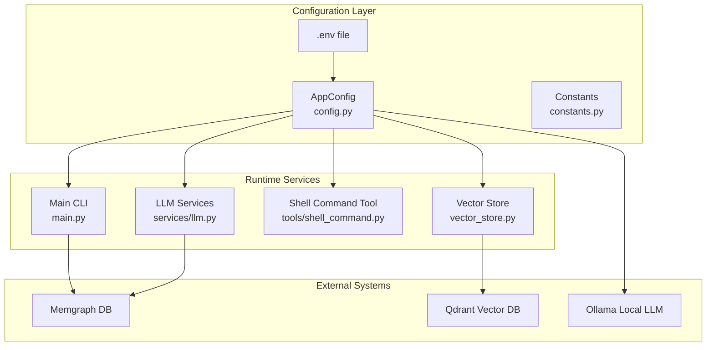
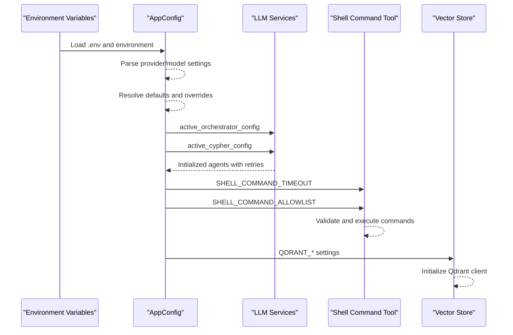
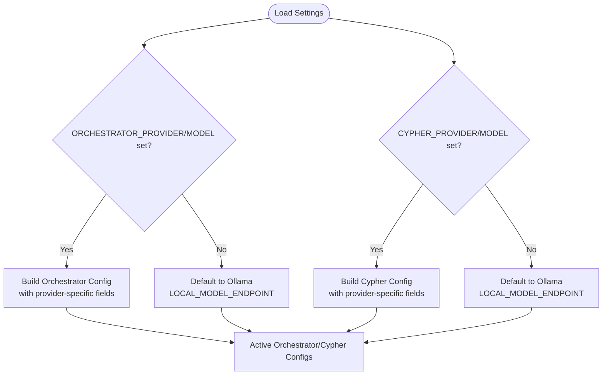
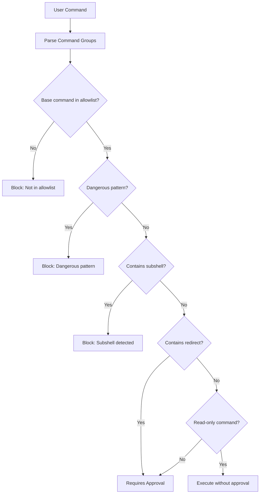
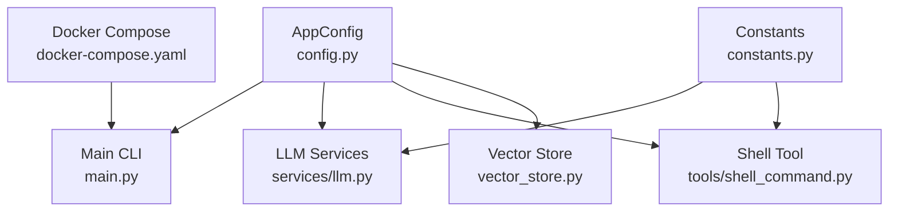

# Environment Variables

<cite>
**Referenced Files in This Document**
- [config.py](file://codebase_rag/config.py)
- [constants.py](file://codebase_rag/constants.py)
- [main.py](file://codebase_rag/main.py)
- [shell_command.py](file://codebase_rag/tools/shell_command.py)
- [vector_store.py](file://codebase_rag/vector_store.py)
- [docker-compose.yaml](file://docker-compose.yaml)
- [README.md](file://README.md)
- [test_provider_configuration.py](file://codebase_rag/tests/test_provider_configuration.py)
</cite>

## Table of Contents
1. [Introduction](#introduction)
2. [Project Structure](#project-structure)
3. [Core Components](#core-components)
4. [Architecture Overview](#architecture-overview)
5. [Detailed Component Analysis](#detailed-component-analysis)
6. [Dependency Analysis](#dependency-analysis)
7. [Performance Considerations](#performance-considerations)
8. [Troubleshooting Guide](#troubleshooting-guide)
9. [Conclusion](#conclusion)

## Introduction
This document provides comprehensive documentation for the Graph-Code environment variables and configuration system. It explains all environment variables, including database settings, system parameters, provider configurations, local model access, shell command security controls, and embedding/cache settings. It also details the dual-provider architecture that allows different providers for orchestrator and Cypher models, and provides practical deployment examples and troubleshooting guidance.

## Project Structure
The configuration system is primarily defined in a single settings class that loads values from environment variables and a .env file. Supporting constants define provider types, defaults, and security policies. The CLI and services consume these settings to configure runtime behavior.

**Diagram sources**
- [config.py](file://codebase_rag/config.py#L39-L234)
- [constants.py](file://codebase_rag/constants.py#L12-L125)
- [main.py](file://codebase_rag/main.py#L37-L742)
- [shell_command.py](file://codebase_rag/tools/shell_command.py#L1-L436)
- [vector_store.py](file://codebase_rag/vector_store.py#L1-L80)

**Section sources**
- [config.py](file://codebase_rag/config.py#L39-L234)
- [constants.py](file://codebase_rag/constants.py#L12-L125)

## Core Components
This section enumerates all environment variables and their roles, with defaults and typical values.

- Database settings
  - MEMGRAPH_HOST: Memgraph hostname (default: localhost)
  - MEMGRAPH_PORT: Memgraph Bolt port (default: 7687)
  - MEMGRAPH_HTTP_PORT: Memgraph HTTP port (default: 7444)
  - LAB_PORT: Memgraph Lab web UI port (default: 3000)

- System parameters
  - TARGET_REPO_PATH: Default repository path (default: .)
  - MEMGRAPH_BATCH_SIZE: Batch size for Memgraph operations (default: 1000)
  - AGENT_RETRIES: Retry attempts for agent operations (default: 3)
  - ORCHESTRATOR_OUTPUT_RETRIES: Output retries for orchestrator agent (default: 100)

- Provider configurations (dual-provider architecture)
  - ORCHESTRATOR_PROVIDER: Provider for orchestrator model (e.g., google, openai, ollama)
  - ORCHESTRATOR_MODEL: Model identifier for orchestrator
  - ORCHESTRATOR_API_KEY: API key for provider (if required)
  - ORCHESTRATOR_ENDPOINT: Custom endpoint URL (if required)
  - ORCHESTRATOR_PROJECT_ID: Google Cloud project ID (Vertex AI)
  - ORCHESTRATOR_REGION: Google Cloud region (default: us-central1)
  - ORCHESTRATOR_PROVIDER_TYPE: Google provider type (gla or vertex)
  - ORCHESTRATOR_THINKING_BUDGET: Reasoning budget for models
  - ORCHESTRATOR_SERVICE_ACCOUNT_FILE: Service account file path (Vertex AI)

  - CYPHER_PROVIDER: Provider for Cypher model (e.g., google, openai, ollama)
  - CYPHER_MODEL: Model identifier for Cypher model
  - CYPHER_API_KEY: API key for provider (if required)
  - CYPHER_ENDPOINT: Custom endpoint URL (if required)
  - CYPHER_PROJECT_ID: Google Cloud project ID (Vertex AI)
  - CYPHER_REGION: Google Cloud region (default: us-central1)
  - CYPHER_PROVIDER_TYPE: Google provider type (gla or vertex)
  - CYPHER_THINKING_BUDGET: Reasoning budget for models
  - CYPHER_SERVICE_ACCOUNT_FILE: Service account file path (Vertex AI)

- Local model endpoint
  - LOCAL_MODEL_ENDPOINT: Fallback endpoint for Ollama (default: http://localhost:11434/v1)

- Shell command security settings
  - SHELL_COMMAND_TIMEOUT: Default timeout for shell commands (default: 30)
  - SHELL_COMMAND_ALLOWLIST: Allowed base commands (frozen set)
  - SHELL_READ_ONLY_COMMANDS: Commands requiring no approval (frozen set)
  - SHELL_SAFE_GIT_SUBCOMMANDS: Git subcommands allowed without approval (frozen set)

- Embedding and cache configuration
  - QDRANT_DB_PATH: Local Qdrant storage path (default: ./.qdrant_code_embeddings)
  - QDRANT_COLLECTION_NAME: Collection name for embeddings (default: code_embeddings)
  - QDRANT_VECTOR_DIM: Vector dimension (default: 768)
  - QDRANT_TOP_K: Top-k retrieval count (default: 5)
  - EMBEDDING_MAX_LENGTH: Maximum text length for embeddings (default: 512)
  - EMBEDDING_PROGRESS_INTERVAL: Progress reporting interval (default: 10)
  - CACHE_MAX_ENTRIES: Maximum cache entries (default: 1000)
  - CACHE_MAX_MEMORY_MB: Maximum cache memory in MB (default: 500)
  - CACHE_EVICTION_DIVISOR: Eviction divisor for cache policy (default: 10)
  - CACHE_MEMORY_THRESHOLD_RATIO: Memory threshold ratio (default: 0.8)

- Quiet mode
  - CGR_QUIET: Quiet logging mode (validation alias)

**Section sources**
- [config.py](file://codebase_rag/config.py#L50-L161)
- [constants.py](file://codebase_rag/constants.py#L122-L143)
- [constants.py](file://codebase_rag/constants.py#L970-L1098)

## Architecture Overview
The configuration system uses a centralized settings class that reads environment variables and a .env file. It supports a dual-provider architecture where orchestrator and Cypher models can use different providers and endpoints. Runtime services consume these settings to initialize agents, connect to databases, and enforce shell command security.

**Diagram sources**
- [config.py](file://codebase_rag/config.py#L197-L234)
- [main.py](file://codebase_rag/main.py#L37-L92)
- [shell_command.py](file://codebase_rag/tools/shell_command.py#L262-L436)
- [vector_store.py](file://codebase_rag/vector_store.py#L14-L68)

**Section sources**
- [config.py](file://codebase_rag/config.py#L197-L234)
- [main.py](file://codebase_rag/main.py#L37-L92)

## Detailed Component Analysis

### Dual-Provider Architecture
Graph-Code supports configuring different providers for orchestrator and Cypher models independently. The settings class resolves provider/model combinations and falls back to Ollama with a local endpoint when provider/model are not explicitly set.

Key behaviors:
- Explicit provider/model environment variables override defaults
- If provider/model are set, additional provider-specific variables (API key, endpoint, project ID, region, provider type, thinking budget, service account file) are honored
- If no explicit configuration is provided, the system defaults to Ollama with a local endpoint and a default model
- Runtime overrides via CLI or programmatic calls update active configurations

**Diagram sources**
- [config.py](file://codebase_rag/config.py#L163-L218)
- [constants.py](file://codebase_rag/constants.py#L17-L22)
- [constants.py](file://codebase_rag/constants.py#L122-L125)

**Section sources**
- [config.py](file://codebase_rag/config.py#L163-L218)
- [test_provider_configuration.py](file://codebase_rag/tests/test_provider_configuration.py#L9-L130)

### Local Model Endpoint (LOCAL_MODEL_ENDPOINT)
- Purpose: Provides a default endpoint for Ollama when no explicit endpoint is configured
- Default: http://localhost:11434/v1
- Behavior: Used when provider is Ollama and no endpoint is provided in environment variables

Practical usage:
- Set LOCAL_MODEL_ENDPOINT to override the default Ollama endpoint
- Useful when running Ollama on a different host or port

**Section sources**
- [config.py](file://codebase_rag/config.py#L78-L187)
- [constants.py](file://codebase_rag/constants.py#L138-L141)

### Shell Command Security Settings
The shell command tool enforces strict security policies:
- Allowlist: Only commands in the allowlist can be executed
- Read-only commands: Executed without approval (e.g., ls, cat, find)
- Write commands: Require user approval before execution
- Dangerous patterns: Blocked cross-segment patterns (e.g., remote script execution via pipes)
- Pipeline patterns: Blocked pipeline patterns (e.g., wget|sh)
- Subshell detection: Rejects subshell operators ($() and backticks)
- Redirect operators: Detected and may require approval
- Git safety: Only safe subcommands are allowed without approval

Configuration variables:
- SHELL_COMMAND_TIMEOUT: Default timeout for shell commands (seconds)
- SHELL_COMMAND_ALLOWLIST: Frozen set of allowed base commands
- SHELL_READ_ONLY_COMMANDS: Frozen set of commands requiring no approval
- SHELL_SAFE_GIT_SUBCOMMANDS: Frozen set of safe git subcommands

**Diagram sources**
- [shell_command.py](file://codebase_rag/tools/shell_command.py#L194-L260)
- [constants.py](file://codebase_rag/constants.py#L970-L1098)

**Section sources**
- [shell_command.py](file://codebase_rag/tools/shell_command.py#L194-L260)
- [constants.py](file://codebase_rag/constants.py#L970-L1098)

### Embedding and Cache Configuration
Embeddings are stored in Qdrant with configurable parameters:
- QDRANT_DB_PATH: Local storage path for Qdrant
- QDRANT_COLLECTION_NAME: Name of the collection storing embeddings
- QDRANT_VECTOR_DIM: Dimension of vectors (default: 768)
- QDRANT_TOP_K: Number of nearest neighbors to retrieve
- EMBEDDING_MAX_LENGTH: Maximum text length processed for embeddings
- EMBEDDING_PROGRESS_INTERVAL: Progress reporting interval

Cache configuration:
- CACHE_MAX_ENTRIES: Maximum number of cached items
- CACHE_MAX_MEMORY_MB: Maximum memory usage in MB
- CACHE_EVICTION_DIVISOR: Eviction policy divisor
- CACHE_MEMORY_THRESHOLD_RATIO: Memory threshold ratio for eviction

**Section sources**
- [config.py](file://codebase_rag/config.py#L144-L155)
- [vector_store.py](file://codebase_rag/vector_store.py#L14-L68)

## Dependency Analysis
The configuration system couples tightly with several runtime components:

**Diagram sources**
- [config.py](file://codebase_rag/config.py#L39-L234)
- [constants.py](file://codebase_rag/constants.py#L12-L125)
- [main.py](file://codebase_rag/main.py#L37-L742)
- [shell_command.py](file://codebase_rag/tools/shell_command.py#L1-L436)
- [vector_store.py](file://codebase_rag/vector_store.py#L1-L80)
- [docker-compose.yaml](file://docker-compose.yaml#L1-L12)

**Section sources**
- [config.py](file://codebase_rag/config.py#L39-L234)
- [main.py](file://codebase_rag/main.py#L37-L742)

## Performance Considerations
- Memgraph batching: Adjust MEMGRAPH_BATCH_SIZE to balance throughput and memory usage
- Embedding dimensions: Larger QDRANT_VECTOR_DIM increases accuracy but memory usage
- Cache sizing: Tune CACHE_MAX_ENTRIES and CACHE_MAX_MEMORY_MB for your workload
- Shell timeouts: Increase SHELL_COMMAND_TIMEOUT for long-running commands
- Agent retries: Higher AGENT_RETRIES and ORCHESTRATOR_OUTPUT_RETRIES improve reliability but increase latency

## Troubleshooting Guide
Common configuration issues and resolutions:

- Provider configuration conflicts
  - Symptom: Unexpected provider/model selection
  - Resolution: Ensure ORCHESTRATOR_PROVIDER and ORCHESTRATOR_MODEL are both set, or neither. Same applies to CYPHER_* variables.

- Ollama endpoint issues
  - Symptom: Local model access failures
  - Resolution: Verify LOCAL_MODEL_ENDPOINT points to a reachable Ollama instance. Ensure the model is pulled and running.

- Shell command blocked
  - Symptom: Commands fail with "not in allowlist" or "dangerous pattern"
  - Resolution: Add command to SHELL_COMMAND_ALLOWLIST or use a safe alternative. Review dangerous patterns and avoid subshells and redirects.

- Qdrant initialization failures
  - Symptom: Embedding operations fail
  - Resolution: Check QDRANT_DB_PATH permissions and available disk space. Verify collection name and vector dimensions match.

- Memgraph connectivity
  - Symptom: Cannot connect to database
  - Resolution: Verify MEMGRAPH_HOST, MEMGRAPH_PORT, and MEMGRAPH_HTTP_PORT match your deployment. Check firewall and Docker network settings.

- Mixed provider scenarios
  - Symptom: Inconsistent behavior between orchestrator and Cypher
  - Resolution: Configure separate provider settings for ORCHESTRATOR_* and CYPHER_* variables. Use the same provider for both if you want identical behavior.

**Section sources**
- [test_provider_configuration.py](file://codebase_rag/tests/test_provider_configuration.py#L85-L130)
- [README.md](file://README.md#L139-L216)

## Conclusion
The Graph-Code environment variable system provides flexible configuration for a dual-provider LLM architecture, secure shell command execution, and scalable embedding storage. By understanding the separation between orchestrator and Cypher providers, the security controls for shell commands, and the embedding/cache tuning parameters, you can deploy Graph-Code effectively across diverse environments while maintaining security and performance.