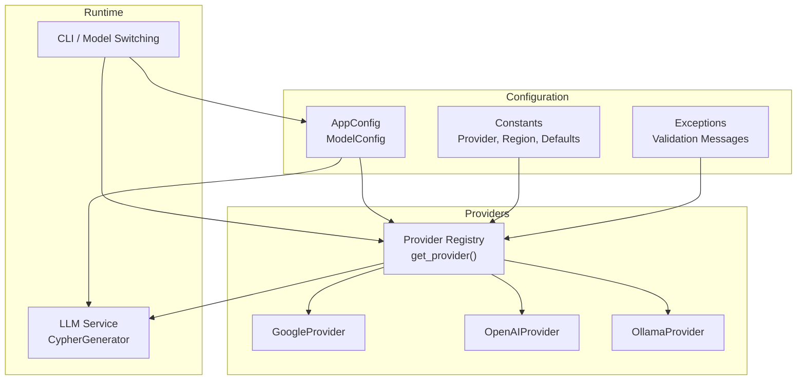
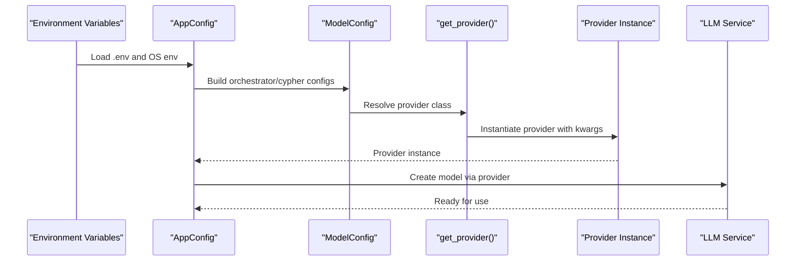
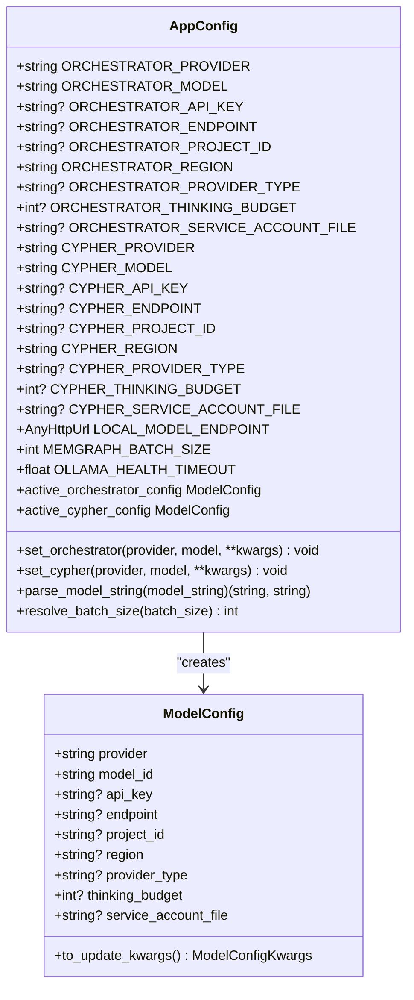
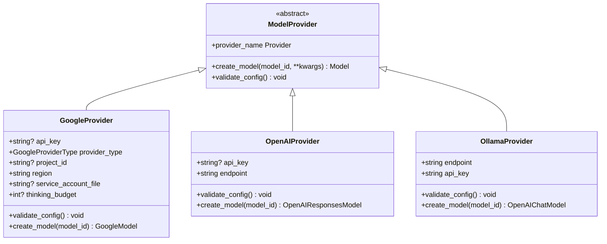
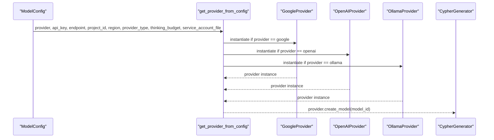
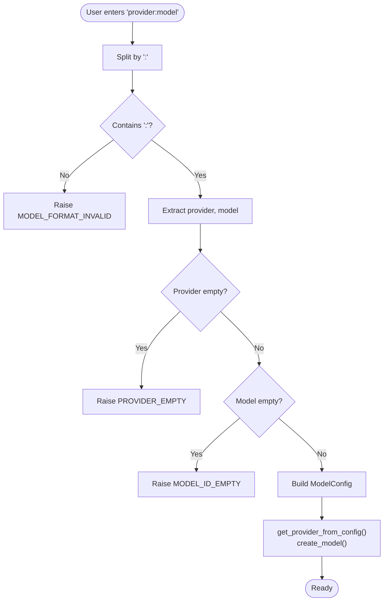
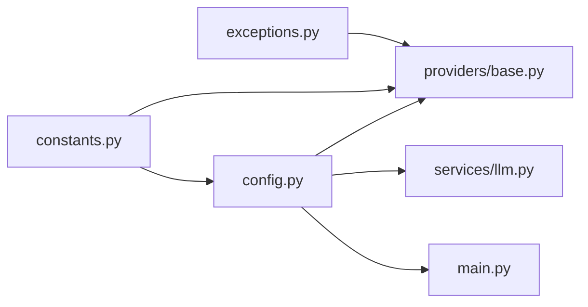

# Provider Configuration

<cite>
**Referenced Files in This Document**
- [config.py](file://codebase_rag/config.py)
- [constants.py](file://codebase_rag/constants.py)
- [exceptions.py](file://codebase_rag/exceptions.py)
- [providers/base.py](file://codebase_rag/providers/base.py)
- [services/llm.py](file://codebase_rag/services/llm.py)
- [main.py](file://codebase_rag/main.py)
- [README.md](file://README.md)
- [tests/test_provider_configuration.py](file://codebase_rag/tests/test_provider_configuration.py)
- [tests/test_provider_classes.py](file://codebase_rag/tests/test_provider_classes.py)
</cite>

## Table of Contents
1. [Introduction](#introduction)
2. [Project Structure](#project-structure)
3. [Core Components](#core-components)
4. [Architecture Overview](#architecture-overview)
5. [Detailed Component Analysis](#detailed-component-analysis)
6. [Dependency Analysis](#dependency-analysis)
7. [Performance Considerations](#performance-considerations)
8. [Troubleshooting Guide](#troubleshooting-guide)
9. [Conclusion](#conclusion)

## Introduction
This document explains the Graph-Code provider configuration system. It covers the ModelConfig class structure, how providers are configured for both orchestrator and Cypher roles, supported provider types (OpenAI, Google, Ollama), the provider-explicit configuration system that allows mixing different providers for different roles, model string parsing format (provider:model_id), default fallback mechanisms, provider-specific parameters, examples of configuring popular providers, troubleshooting connectivity issues, and security considerations for API key management.

## Project Structure
The provider configuration system spans several modules:
- Configuration and defaults: AppConfig and ModelConfig
- Provider registry and factories: ModelProvider subclasses and provider lookup
- Runtime usage: LLM service creation and CLI model switching
- Tests validating configuration behavior

**Diagram sources**
- [config.py](file://codebase_rag/config.py#L20-L234)
- [constants.py](file://codebase_rag/constants.py#L17-L143)
- [exceptions.py](file://codebase_rag/exceptions.py#L1-L60)
- [providers/base.py](file://codebase_rag/providers/base.py#L20-L194)
- [services/llm.py](file://codebase_rag/services/llm.py#L23-L45)
- [main.py](file://codebase_rag/main.py#L535-L602)

**Section sources**
- [config.py](file://codebase_rag/config.py#L20-L234)
- [constants.py](file://codebase_rag/constants.py#L17-L143)

## Core Components
- ModelConfig: Holds provider, model_id, and provider-specific parameters (api_key, endpoint, project_id, region, provider_type, thinking_budget, service_account_file).
- AppConfig: Loads environment variables, constructs ModelConfig for orchestrator and Cypher roles, and provides default fallbacks.
- Provider classes: GoogleProvider, OpenAIProvider, OllamaProvider implement ModelProvider and create provider-specific model instances.
- Provider registry: get_provider() resolves provider names to classes; get_provider_from_config() instantiates providers from ModelConfig.

Key behaviors:
- Environment-driven configuration with explicit overrides for orchestrator and Cypher.
- Default fallback to Ollama when no explicit configuration is provided.
- Validation errors surfaced via exceptions with actionable messages.

**Section sources**
- [config.py](file://codebase_rag/config.py#L20-L234)
- [providers/base.py](file://codebase_rag/providers/base.py#L20-L194)
- [exceptions.py](file://codebase_rag/exceptions.py#L1-L60)

## Architecture Overview
The provider configuration pipeline connects environment inputs to runtime model instantiation:

**Diagram sources**
- [config.py](file://codebase_rag/config.py#L39-L234)
- [providers/base.py](file://codebase_rag/providers/base.py#L165-L189)
- [services/llm.py](file://codebase_rag/services/llm.py#L23-L25)

## Detailed Component Analysis

### ModelConfig and AppConfig
- ModelConfig stores provider, model_id, and optional provider-specific fields.
- AppConfig loads settings from .env and OS environment, constructs ModelConfig for orchestrator and Cypher, and falls back to Ollama when no provider/model is set.
- Active configs are exposed as properties and can be overridden at runtime.

**Diagram sources**
- [config.py](file://codebase_rag/config.py#L20-L234)

**Section sources**
- [config.py](file://codebase_rag/config.py#L20-L234)

### Provider Classes and Registry
- ModelProvider defines the interface for provider implementations.
- GoogleProvider supports GLA and Vertex AI variants with validation for required keys and project IDs.
- OpenAIProvider validates presence of API key and accepts a custom endpoint.
- OllamaProvider validates local server availability and uses a default API key when unspecified.
- Provider registry maps provider names to classes and supports dynamic registration.

**Diagram sources**
- [providers/base.py](file://codebase_rag/providers/base.py#L20-L194)
- [constants.py](file://codebase_rag/constants.py#L17-L143)

**Section sources**
- [providers/base.py](file://codebase_rag/providers/base.py#L20-L194)
- [constants.py](file://codebase_rag/constants.py#L132-L143)

### Provider Resolution and Model Creation
- get_provider() resolves a provider name to a class and instantiates it with kwargs.
- get_provider_from_config() extracts provider-specific parameters from ModelConfig and creates a provider instance.
- LLM service uses the provider to create a model for Cypher generation.

**Diagram sources**
- [providers/base.py](file://codebase_rag/providers/base.py#L165-L189)
- [services/llm.py](file://codebase_rag/services/llm.py#L23-L25)

**Section sources**
- [providers/base.py](file://codebase_rag/providers/base.py#L165-L189)
- [services/llm.py](file://codebase_rag/services/llm.py#L23-L25)

### Model String Parsing and Runtime Overrides
- parse_model_string() splits "provider:model_id" and enforces non-empty provider and model parts.
- CLI supports runtime model switching via a command that parses a provider:model string and updates the active configuration.
- When provider is omitted, defaults to Ollama with a default endpoint and API key.

**Diagram sources**
- [config.py](file://codebase_rag/config.py#L219-L225)
- [main.py](file://codebase_rag/main.py#L535-L564)

**Section sources**
- [config.py](file://codebase_rag/config.py#L219-L225)
- [main.py](file://codebase_rag/main.py#L535-L602)

### Supported Providers and Configuration Requirements
- OpenAI
  - Required: api_key
  - Optional: endpoint (default provided)
  - Configure via environment variables or runtime overrides
- Google
  - GLA variant: api_key required
  - Vertex variant: project_id required; optional region and service_account_file
  - Optional: thinking_budget
- Ollama
  - Validates local server availability; endpoint defaults to a local URL
  - API key defaults to a specific value when not provided

Examples in the repository demonstrate environment-based configuration for all three providers and mixed provider setups.

**Section sources**
- [providers/base.py](file://codebase_rag/providers/base.py#L100-L156)
- [exceptions.py](file://codebase_rag/exceptions.py#L2-L17)
- [README.md](file://README.md#L145-L216)
- [tests/test_provider_configuration.py](file://codebase_rag/tests/test_provider_configuration.py#L12-L130)

### Provider-Explicit Configuration for Roles
- Separate environment variables for ORCHESTRATOR_* and CYPHER_* roles enable independent provider selection.
- Each role can independently select provider, model, and provider-specific parameters.
- Tests confirm that explicit environment variables are respected and that mixed provider configurations work.

**Section sources**
- [config.py](file://codebase_rag/config.py#L58-L76)
- [tests/test_provider_configuration.py](file://codebase_rag/tests/test_provider_configuration.py#L12-L130)

## Dependency Analysis
Provider configuration depends on:
- Constants for provider names, default endpoints, and default values
- Exceptions for validation errors
- Provider registry for dynamic provider resolution
- AppConfig for environment-driven defaults and runtime overrides

**Diagram sources**
- [constants.py](file://codebase_rag/constants.py#L17-L143)
- [config.py](file://codebase_rag/config.py#L20-L234)
- [providers/base.py](file://codebase_rag/providers/base.py#L20-L194)
- [services/llm.py](file://codebase_rag/services/llm.py#L23-L25)
- [main.py](file://codebase_rag/main.py#L535-L602)

**Section sources**
- [constants.py](file://codebase_rag/constants.py#L17-L143)
- [config.py](file://codebase_rag/config.py#L20-L234)
- [providers/base.py](file://codebase_rag/providers/base.py#L20-L194)

## Performance Considerations
- Provider validation occurs at instantiation time; Ollama validation performs a network request to the health endpoint. Keep timeouts reasonable to avoid blocking startup.
- Default fallback to Ollama reduces configuration overhead but may increase latency if local models are slower than cloud providers.
- Consider setting custom endpoints for providers to reduce latency and improve reliability.

[No sources needed since this section provides general guidance]

## Troubleshooting Guide
Common issues and resolutions:
- Unknown provider name
  - Symptom: Error indicating unknown provider with available list
  - Cause: Typo or unsupported provider name
  - Fix: Use supported provider names (google, openai, ollama)
- Missing API key
  - OpenAI: Set ORCHESTRATOR_API_KEY or CYPHER_API_KEY
  - Google GLA: Set ORCHESTRATOR_API_KEY or CYPHER_API_KEY
  - Resolution: Provide the appropriate API key environment variable
- Missing project ID for Google Vertex
  - Symptom: Error requiring project_id
  - Fix: Set ORCHESTRATOR_PROJECT_ID or CYPHER_PROJECT_ID
- Ollama server not responding
  - Symptom: Error indicating Ollama not running at endpoint
  - Fix: Start Ollama locally and ensure the endpoint is reachable
- Invalid model string format
  - Symptom: Errors for missing colon, empty provider, or empty model
  - Fix: Use "provider:model" format with non-empty parts

Security considerations:
- Store API keys in environment variables or secure secret managers; avoid committing secrets to version control.
- Restrict permissions on service account files and ensure they are only readable by the application.
- Prefer HTTPS endpoints and restrict network access to trusted providers.

**Section sources**
- [exceptions.py](file://codebase_rag/exceptions.py#L1-L60)
- [providers/base.py](file://codebase_rag/providers/base.py#L143-L147)
- [README.md](file://README.md#L616-L643)

## Conclusion
The Graph-Code provider configuration system offers flexible, environment-driven configuration with explicit separation of concerns for orchestrator and Cypher roles. It supports mixing providers, provides sensible defaults, validates inputs rigorously, and integrates seamlessly with runtime model switching. By following the configuration patterns and security practices outlined here, users can reliably configure OpenAI, Google, and Ollama providers for diverse operational needs.