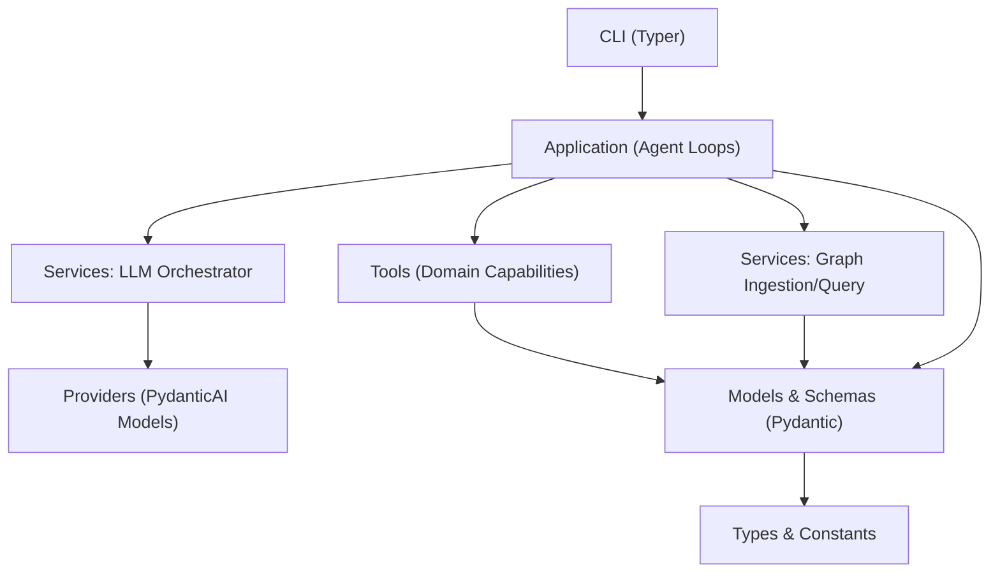
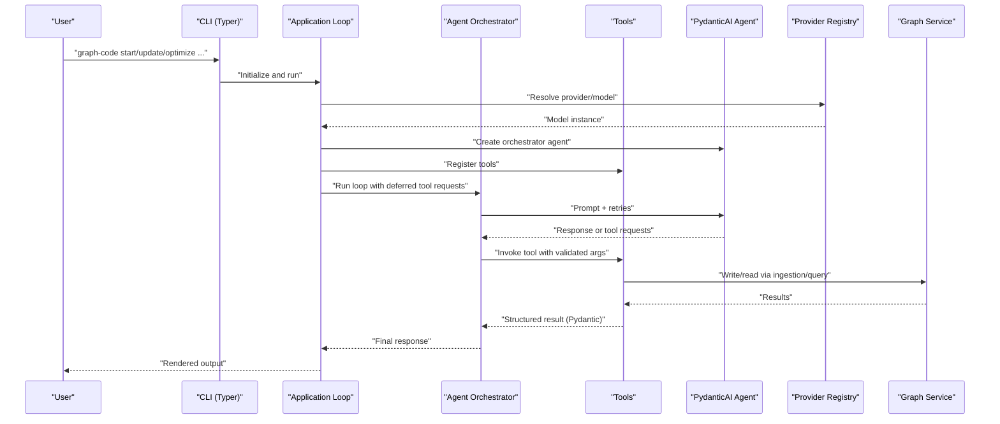
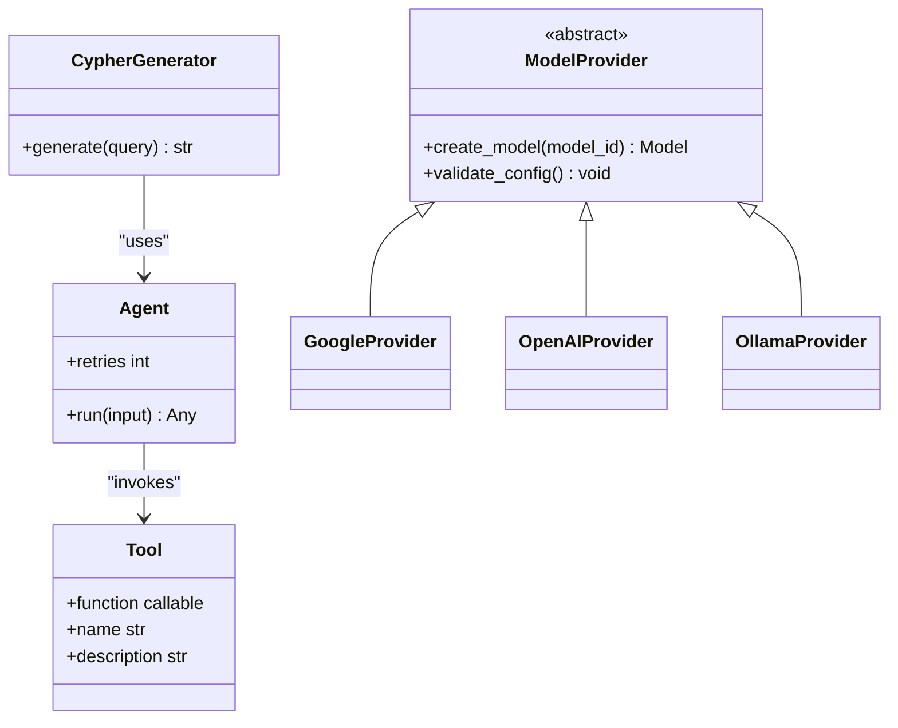
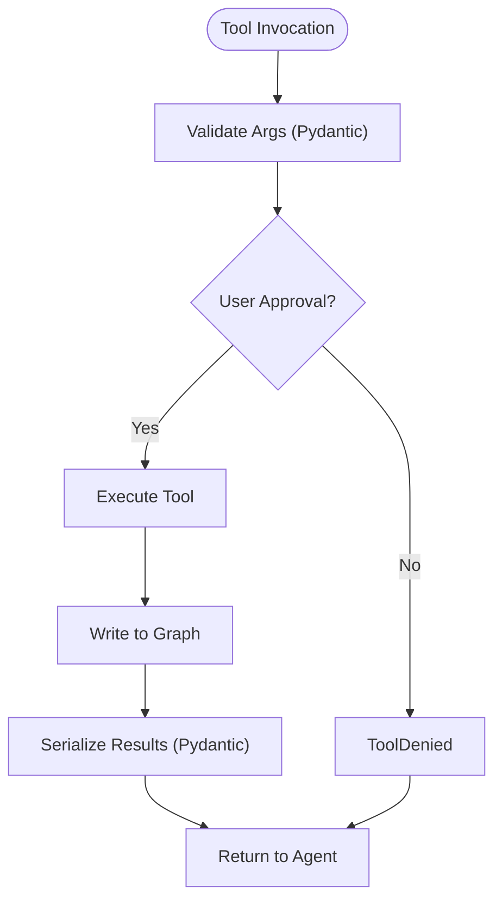
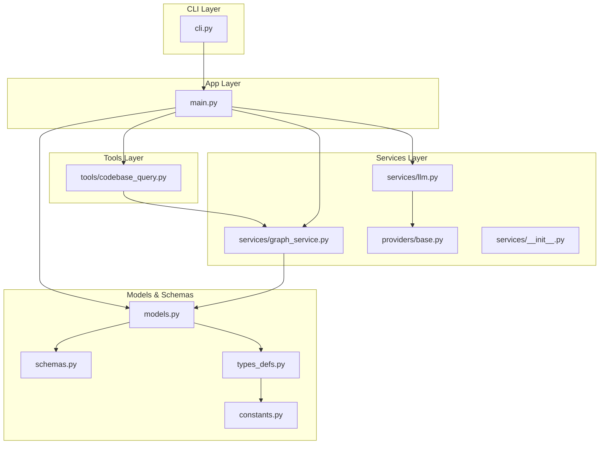
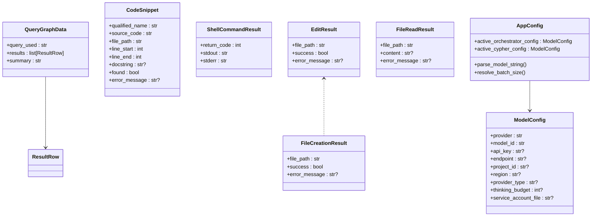
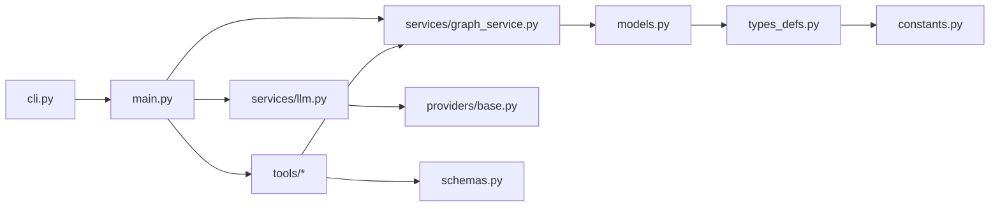

# Architectural Principles

<cite>
**Referenced Files in This Document**
- [main.py](file://codebase_rag/main.py)
- [cli.py](file://codebase_rag/cli.py)
- [config.py](file://codebase_rag/config.py)
- [models.py](file://codebase_rag/models.py)
- [schemas.py](file://codebase_rag/schemas.py)
- [types_defs.py](file://codebase_rag/types_defs.py)
- [constants.py](file://codebase_rag/constants.py)
- [providers/base.py](file://codebase_rag/providers/base.py)
- [services/graph_service.py](file://codebase_rag/services/graph_service.py)
- [services/llm.py](file://codebase_rag/services/llm.py)
- [services/__init__.py](file://codebase_rag/services/__init__.py)
- [tools/codebase_query.py](file://codebase_rag/tools/codebase_query.py)
</cite>

## Table of Contents
1. [Introduction](#introduction)
2. [Project Structure](#project-structure)
3. [Core Components](#core-components)
4. [Architecture Overview](#architecture-overview)
5. [Detailed Component Analysis](#detailed-component-analysis)
6. [Dependency Analysis](#dependency-analysis)
7. [Performance Considerations](#performance-considerations)
8. [Troubleshooting Guide](#troubleshooting-guide)
9. [Conclusion](#conclusion)
10. [Appendices](#appendices)

## Introduction
This document codifies the architectural principles for Graph-Code development. It establishes:
- The official agentic framework: PydanticAI
- The rationale for avoiding alternative frameworks
- Encouraged design patterns: factory, strategy, command, and observer
- Architectural layers and component separation
- Emphasis on Pydantic models for validation and serialization
- Explicit imports and single-source-of-truth principles
- Guidance for maintaining architectural consistency when extending the codebase

## Project Structure
The project is organized into cohesive layers:
- CLI layer: user-facing commands and orchestration
- Application layer: agent orchestration, loops, and UI
- Services layer: LLM orchestration, graph ingestion/query, and provider abstraction
- Tools layer: domain-specific capabilities exposed to agents
- Models and schemas: typed data contracts and Pydantic models
- Types and constants: shared protocols, enums, and configuration keys

**Diagram sources**
- [cli.py](file://codebase_rag/cli.py#L1-L395)
- [main.py](file://codebase_rag/main.py#L1-L1062)
- [services/llm.py](file://codebase_rag/services/llm.py#L1-L93)
- [services/graph_service.py](file://codebase_rag/services/graph_service.py#L1-L364)
- [providers/base.py](file://codebase_rag/providers/base.py#L1-L209)
- [models.py](file://codebase_rag/models.py#L1-L95)
- [schemas.py](file://codebase_rag/schemas.py#L1-L82)
- [types_defs.py](file://codebase_rag/types_defs.py#L1-L555)
- [constants.py](file://codebase_rag/constants.py#L1-L800)

**Section sources**
- [cli.py](file://codebase_rag/cli.py#L1-L395)
- [main.py](file://codebase_rag/main.py#L1-L1062)
- [services/llm.py](file://codebase_rag/services/llm.py#L1-L93)
- [services/graph_service.py](file://codebase_rag/services/graph_service.py#L1-L364)
- [providers/base.py](file://codebase_rag/providers/base.py#L1-L209)
- [models.py](file://codebase_rag/models.py#L1-L95)
- [schemas.py](file://codebase_rag/schemas.py#L1-L82)
- [types_defs.py](file://codebase_rag/types_defs.py#L1-L555)
- [constants.py](file://codebase_rag/constants.py#L1-L800)

## Core Components
- PydanticAI as the official agentic framework: Agents, tools, and deferred tool requests are central to the application loop and tool orchestration.
- Typed configuration via Pydantic settings for model providers and runtime behavior.
- Pydantic models for all structured outputs and results to ensure validation and serialization consistency.
- Explicit imports and single-source-of-truth for configuration, constants, and types.

Key architectural anchors:
- Agent orchestration and interactive loops in the application layer
- Provider abstraction for model creation and configuration
- Typed protocols for ingestion/query contracts
- Pydantic models for tool outputs and query results

**Section sources**
- [main.py](file://codebase_rag/main.py#L1-L1062)
- [services/llm.py](file://codebase_rag/services/llm.py#L1-L93)
- [providers/base.py](file://codebase_rag/providers/base.py#L1-L209)
- [services/__init__.py](file://codebase_rag/services/__init__.py#L1-L28)
- [schemas.py](file://codebase_rag/schemas.py#L1-L82)
- [config.py](file://codebase_rag/config.py#L1-L274)

## Architecture Overview
The system is built around PydanticAI agents that:
- Use a configured LLM provider
- Execute tools that operate on the codebase and filesystem
- Persist results to a graph database and export to JSON

**Diagram sources**
- [cli.py](file://codebase_rag/cli.py#L1-L395)
- [main.py](file://codebase_rag/main.py#L1-L1062)
- [services/llm.py](file://codebase_rag/services/llm.py#L1-L93)
- [providers/base.py](file://codebase_rag/providers/base.py#L1-L209)
- [tools/codebase_query.py](file://codebase_rag/tools/codebase_query.py#L1-L95)
- [services/graph_service.py](file://codebase_rag/services/graph_service.py#L1-L364)

## Detailed Component Analysis

### PydanticAI as the Official Agentic Framework
- Agents encapsulate LLM behavior, retries, and tool invocation.
- Deferred tool requests enable interactive approvals and controlled execution.
- Tool registration uses PydanticAI’s Tool type with explicit schemas.

**Diagram sources**
- [services/llm.py](file://codebase_rag/services/llm.py#L1-L93)
- [providers/base.py](file://codebase_rag/providers/base.py#L1-L209)
- [tools/codebase_query.py](file://codebase_rag/tools/codebase_query.py#L1-L95)

**Section sources**
- [services/llm.py](file://codebase_rag/services/llm.py#L1-L93)
- [providers/base.py](file://codebase_rag/providers/base.py#L1-L209)
- [tools/codebase_query.py](file://codebase_rag/tools/codebase_query.py#L1-L95)

### Design Patterns Encouraged
- Factory pattern: Provider registry and provider classes instantiate model instances.
- Strategy pattern: Different providers (Google, OpenAI, Ollama) implement a common interface.
- Command pattern: CLI commands encapsulate actions; tools encapsulate domain operations.
- Observer pattern: Event-driven patterns appear across languages and tests; in the system, tool outputs and graph updates act as observed events.

**Diagram sources**
- [main.py](file://codebase_rag/main.py#L218-L248)
- [schemas.py](file://codebase_rag/schemas.py#L1-L82)
- [services/graph_service.py](file://codebase_rag/services/graph_service.py#L1-L364)

**Section sources**
- [main.py](file://codebase_rag/main.py#L218-L248)
- [schemas.py](file://codebase_rag/schemas.py#L1-L82)
- [services/graph_service.py](file://codebase_rag/services/graph_service.py#L1-L364)

### Architectural Layers and Component Separation
- CLI layer: Typer commands, option parsing, and lifecycle orchestration.
- Application layer: Agent loops, interactive sessions, and tool approval flows.
- Services layer: LLM orchestration, provider abstraction, and graph ingestion/query.
- Tools layer: Domain capabilities (query, read/edit, shell, etc.) with explicit schemas.
- Models and schemas: Pydantic models for validation and serialization.
- Types and constants: Shared protocols, enums, and configuration keys.

**Diagram sources**
- [cli.py](file://codebase_rag/cli.py#L1-L395)
- [main.py](file://codebase_rag/main.py#L1-L1062)
- [services/llm.py](file://codebase_rag/services/llm.py#L1-L93)
- [services/graph_service.py](file://codebase_rag/services/graph_service.py#L1-L364)
- [providers/base.py](file://codebase_rag/providers/base.py#L1-L209)
- [services/__init__.py](file://codebase_rag/services/__init__.py#L1-L28)
- [tools/codebase_query.py](file://codebase_rag/tools/codebase_query.py#L1-L95)
- [models.py](file://codebase_rag/models.py#L1-L95)
- [schemas.py](file://codebase_rag/schemas.py#L1-L82)
- [types_defs.py](file://codebase_rag/types_defs.py#L1-L555)
- [constants.py](file://codebase_rag/constants.py#L1-L800)

**Section sources**
- [cli.py](file://codebase_rag/cli.py#L1-L395)
- [main.py](file://codebase_rag/main.py#L1-L1062)
- [services/llm.py](file://codebase_rag/services/llm.py#L1-L93)
- [services/graph_service.py](file://codebase_rag/services/graph_service.py#L1-L364)
- [providers/base.py](file://codebase_rag/providers/base.py#L1-L209)
- [services/__init__.py](file://codebase_rag/services/__init__.py#L1-L28)
- [tools/codebase_query.py](file://codebase_rag/tools/codebase_query.py#L1-L95)
- [models.py](file://codebase_rag/models.py#L1-L95)
- [schemas.py](file://codebase_rag/schemas.py#L1-L82)
- [types_defs.py](file://codebase_rag/types_defs.py#L1-L555)
- [constants.py](file://codebase_rag/constants.py#L1-L800)

### Pydantic Models for Validation and Serialization
- Structured outputs: QueryGraphData, CodeSnippet, ShellCommandResult, EditResult, FileReadResult, FileCreationResult.
- Validators ensure robustness and consistent shapes for downstream consumers.
- Configuration uses Pydantic settings with environment loading.

**Diagram sources**
- [schemas.py](file://codebase_rag/schemas.py#L1-L82)
- [config.py](file://codebase_rag/config.py#L1-L274)

**Section sources**
- [schemas.py](file://codebase_rag/schemas.py#L1-L82)
- [config.py](file://codebase_rag/config.py#L1-L274)

### Explicit Imports and Single-Source-of-Truth Principles
- Explicit imports are used throughout to avoid ambiguity and improve discoverability.
- Single-source-of-truth for configuration via Pydantic settings and constants.
- Centralized enums and typed dictionaries define contracts across layers.

Examples of explicit imports and centralized definitions:
- Application imports tools, services, and models explicitly.
- Constants and enums are defined centrally and referenced across modules.
- Typed protocols and schemas enforce consistent interfaces.

**Section sources**
- [main.py](file://codebase_rag/main.py#L1-L1062)
- [cli.py](file://codebase_rag/cli.py#L1-L395)
- [constants.py](file://codebase_rag/constants.py#L1-L800)
- [types_defs.py](file://codebase_rag/types_defs.py#L1-L555)

### Maintaining Architectural Consistency When Extending
- Use PydanticAI for any new agent or tool logic.
- Define tool inputs/outputs with Pydantic models for validation.
- Register new providers via the provider registry following the existing pattern.
- Keep CLI commands focused on orchestration; delegate domain logic to services/tools.
- Maintain explicit imports and avoid star imports.
- Add new constants and enums to centralized files to preserve single-source-of-truth.

**Section sources**
- [services/llm.py](file://codebase_rag/services/llm.py#L1-L93)
- [providers/base.py](file://codebase_rag/providers/base.py#L1-L209)
- [schemas.py](file://codebase_rag/schemas.py#L1-L82)
- [cli.py](file://codebase_rag/cli.py#L1-L395)

## Dependency Analysis
The system exhibits low coupling and high cohesion:
- CLI depends on application and services
- Application depends on providers, tools, and schemas
- Services depend on providers and graph infrastructure
- Tools depend on services and schemas
- Models and schemas are consumed across layers

**Diagram sources**
- [cli.py](file://codebase_rag/cli.py#L1-L395)
- [main.py](file://codebase_rag/main.py#L1-L1062)
- [services/llm.py](file://codebase_rag/services/llm.py#L1-L93)
- [services/graph_service.py](file://codebase_rag/services/graph_service.py#L1-L364)
- [providers/base.py](file://codebase_rag/providers/base.py#L1-L209)
- [tools/codebase_query.py](file://codebase_rag/tools/codebase_query.py#L1-L95)
- [schemas.py](file://codebase_rag/schemas.py#L1-L82)
- [models.py](file://codebase_rag/models.py#L1-L95)
- [types_defs.py](file://codebase_rag/types_defs.py#L1-L555)
- [constants.py](file://codebase_rag/constants.py#L1-L800)

**Section sources**
- [cli.py](file://codebase_rag/cli.py#L1-L395)
- [main.py](file://codebase_rag/main.py#L1-L1062)
- [services/llm.py](file://codebase_rag/services/llm.py#L1-L93)
- [services/graph_service.py](file://codebase_rag/services/graph_service.py#L1-L364)
- [providers/base.py](file://codebase_rag/providers/base.py#L1-L209)
- [tools/codebase_query.py](file://codebase_rag/tools/codebase_query.py#L1-L95)
- [schemas.py](file://codebase_rag/schemas.py#L1-L82)
- [models.py](file://codebase_rag/models.py#L1-L95)
- [types_defs.py](file://codebase_rag/types_defs.py#L1-L555)
- [constants.py](file://codebase_rag/constants.py#L1-L800)

## Performance Considerations
- Batch graph writes to reduce round-trips and improve throughput.
- Configure retries and timeouts thoughtfully to balance reliability and responsiveness.
- Use Pydantic validators to catch invalid outputs early and avoid expensive downstream errors.
- Prefer explicit imports to keep module resolution fast and predictable.

[No sources needed since this section provides general guidance]

## Troubleshooting Guide
Common areas to inspect:
- Provider health checks and model initialization failures
- Tool argument validation and serialization errors
- Graph ingestion batch failures and constraint violations
- CLI configuration and environment variable issues

**Section sources**
- [providers/base.py](file://codebase_rag/providers/base.py#L201-L209)
- [services/graph_service.py](file://codebase_rag/services/graph_service.py#L124-L165)
- [schemas.py](file://codebase_rag/schemas.py#L59-L82)
- [config.py](file://codebase_rag/config.py#L227-L231)

## Conclusion
Graph-Code’s architecture centers on PydanticAI for agent orchestration, Pydantic models for validation and serialization, and a layered design that separates concerns across CLI, application, services, tools, and models. By adhering to explicit imports, single-source-of-truth principles, and the encouraged design patterns, contributors can extend the system reliably and consistently.

[No sources needed since this section summarizes without analyzing specific files]

## Appendices
- Provider registry supports multiple LLM providers with a uniform interface.
- Typed protocols define ingestion and query contracts for pluggable backends.
- Centralized constants and enums ensure consistency across modules.

**Section sources**
- [providers/base.py](file://codebase_rag/providers/base.py#L158-L199)
- [services/__init__.py](file://codebase_rag/services/__init__.py#L6-L28)
- [constants.py](file://codebase_rag/constants.py#L12-L800)