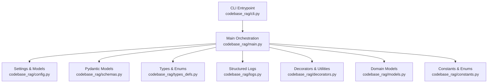
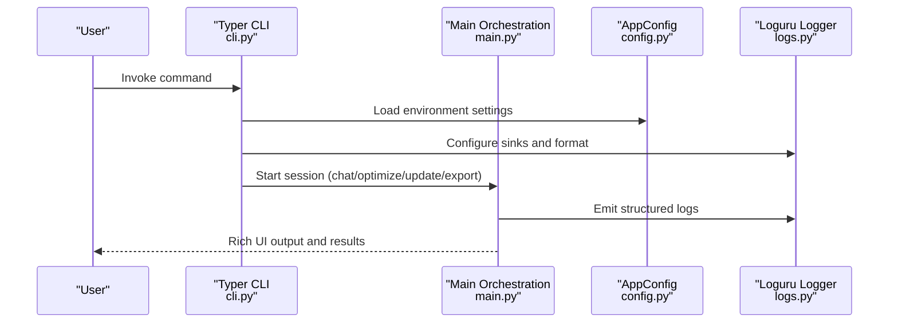
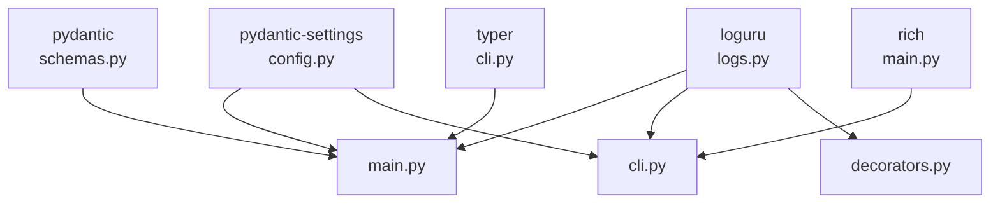

# Coding Standards

<cite>
**Referenced Files in This Document**
- [main.py](file://codebase_rag/main.py)
- [cli.py](file://codebase_rag/cli.py)
- [schemas.py](file://codebase_rag/schemas.py)
- [types_defs.py](file://codebase_rag/types_defs.py)
- [models.py](file://codebase_rag/models.py)
- [constants.py](file://codebase_rag/constants.py)
- [config.py](file://codebase_rag/config.py)
- [decorators.py](file://codebase_rag/decorators.py)
- [logs.py](file://codebase_rag/logs.py)
- [conftest.py](file://codebase_rag/tests/conftest.py)
</cite>

## Table of Contents
1. [Introduction](#introduction)
2. [Project Structure](#project-structure)
3. [Core Components](#core-components)
4. [Architecture Overview](#architecture-overview)
5. [Detailed Component Analysis](#detailed-component-analysis)
6. [Dependency Analysis](#dependency-analysis)
7. [Performance Considerations](#performance-considerations)
8. [Troubleshooting Guide](#troubleshooting-guide)
9. [Conclusion](#conclusion)

## Introduction
This document defines the coding standards for Graph-Code development. It consolidates the strict type system requirements, code organization principles, style conventions, validation patterns, and comment policies observed across the codebase. The goal is to ensure consistency, readability, maintainability, and robustness across all contributions.

## Project Structure
The project follows a feature-layered organization:
- Feature modules under codebase_rag/ (services, parsers, tools, utils)
- CLI entrypoints and orchestration logic
- Configuration and constants
- Strict type modeling via Pydantic, StrEnum, and TypedDict
- Logging via loguru with structured messages

**Diagram sources**
- [cli.py](file://codebase_rag/cli.py#L1-L395)
- [main.py](file://codebase_rag/main.py#L1-L1062)
- [config.py](file://codebase_rag/config.py#L1-L274)
- [schemas.py](file://codebase_rag/schemas.py#L1-L82)
- [types_defs.py](file://codebase_rag/types_defs.py#L1-L555)
- [logs.py](file://codebase_rag/logs.py#L1-L622)
- [decorators.py](file://codebase_rag/decorators.py#L1-L161)
- [models.py](file://codebase_rag/models.py#L1-L95)
- [constants.py](file://codebase_rag/constants.py#L1-L800)

**Section sources**
- [cli.py](file://codebase_rag/cli.py#L1-L395)
- [main.py](file://codebase_rag/main.py#L1-L1062)
- [config.py](file://codebase_rag/config.py#L1-L274)
- [schemas.py](file://codebase_rag/schemas.py#L1-L82)
- [types_defs.py](file://codebase_rag/types_defs.py#L1-L555)
- [logs.py](file://codebase_rag/logs.py#L1-L622)
- [decorators.py](file://codebase_rag/decorators.py#L1-L161)
- [models.py](file://codebase_rag/models.py#L1-L95)
- [constants.py](file://codebase_rag/constants.py#L1-L800)

## Core Components
- Strict type system:
  - Pydantic models for validation and serialization
  - StrEnum for enumerated string values
  - TypedDict for runtime-checked dictionaries
- CLI framework:
  - Typer for command-line interfaces
- Logging:
  - loguru for structured logging with sinks and formatting
- Decorators:
  - Timing, recursion guard, path validation, operation logging, and MCP error handling
- Configuration:
  - Pydantic BaseSettings for environment-driven configuration

**Section sources**
- [schemas.py](file://codebase_rag/schemas.py#L1-L82)
- [types_defs.py](file://codebase_rag/types_defs.py#L1-L555)
- [constants.py](file://codebase_rag/constants.py#L1-L800)
- [cli.py](file://codebase_rag/cli.py#L1-L395)
- [main.py](file://codebase_rag/main.py#L1-L1062)
- [config.py](file://codebase_rag/config.py#L1-L274)
- [decorators.py](file://codebase_rag/decorators.py#L1-L161)
- [logs.py](file://codebase_rag/logs.py#L1-L622)

## Architecture Overview
The CLI initializes settings, sets up logging, and delegates to main orchestration. Main coordinates agent loops, tool approvals, and Memgraph interactions. Validation occurs via Pydantic models and typed structures.

**Diagram sources**
- [cli.py](file://codebase_rag/cli.py#L1-L395)
- [main.py](file://codebase_rag/main.py#L1-L1062)
- [config.py](file://codebase_rag/config.py#L1-L274)
- [logs.py](file://codebase_rag/logs.py#L1-L622)

## Detailed Component Analysis

### Strict Type System Requirements
- Pydantic usage:
  - BaseModel for validated data transfer objects and results
  - field_validator and model_validator for pre/post processing and normalization
  - ConfigDict(extra="forbid") to prevent unknown fields
- StrEnum patterns:
  - Extensive use of StrEnum for enumerated values (e.g., Providers, Colors, NodeLabels)
- TypedDict conventions:
  - Typed dictionaries for graph data, tool arguments, and protocol schemas
  - Total=False for optional fields where appropriate

Examples of usage:
- Pydantic models: [QueryGraphData](file://codebase_rag/schemas.py#L8-L34), [CodeSnippet](file://codebase_rag/schemas.py#L37-L46), [EditResult](file://codebase_rag/schemas.py#L54-L63)
- StrEnum: [Provider](file://codebase_rag/constants.py#L17-L22), [Color](file://codebase_rag/constants.py#L24-L31), [NodeLabel](file://codebase_rag/constants.py#L317-L333)
- TypedDict: [GraphData](file://codebase_rag/types_defs.py#L171-L175), [ReplaceCodeArgs](file://codebase_rag/types_defs.py#L297-L301), [MCPInputSchema](file://codebase_rag/types_defs.py#L355-L359)

Validation patterns:
- Pre-processing with field_validator: [QueryGraphData.results](file://codebase_rag/schemas.py#L13-L32)
- Post-processing with model_validator: [EditResult](file://codebase_rag/schemas.py#L59-L63), [FileCreationResult](file://codebase_rag/schemas.py#L77-L81)

Prohibited constructs:
- No type ignores, casts, Any, or object types are used in the analyzed codebase

**Section sources**
- [schemas.py](file://codebase_rag/schemas.py#L1-L82)
- [types_defs.py](file://codebase_rag/types_defs.py#L1-L555)
- [constants.py](file://codebase_rag/constants.py#L1-L800)

### Code Organization Principles
- File structure conventions:
  - Feature-based modules under codebase_rag/
  - CLI entrypoint in cli.py, orchestration in main.py
  - Configuration in config.py, constants in constants.py
  - Domain models in models.py, schemas in schemas.py
- Import patterns:
  - Absolute imports from the package root
  - Standard library and third-party imports grouped and separated
  - TYPE_CHECKING guards for expensive imports
- Modularization guidelines:
  - Keep modules cohesive around single responsibilities
  - Use protocols and TypedDict to decouple interfaces
  - Centralize configuration via AppConfig and constants

**Section sources**
- [cli.py](file://codebase_rag/cli.py#L1-L395)
- [main.py](file://codebase_rag/main.py#L1-L1062)
- [config.py](file://codebase_rag/config.py#L1-L274)
- [constants.py](file://codebase_rag/constants.py#L1-L800)
- [models.py](file://codebase_rag/models.py#L1-L95)
- [schemas.py](file://codebase_rag/schemas.py#L1-L82)
- [types_defs.py](file://codebase_rag/types_defs.py#L1-L555)

### Coding Style Requirements
- Logging:
  - Use loguru logger for structured logging
  - Prefer logger.info/warning/error/exception over print
- CLI:
  - Use Typer for CLI interfaces
- Control flow:
  - Prefer match statements over elif chains for readability and exhaustiveness
- Comments:
  - Inline comments are generally avoided except for very specific cases (as observed in the codebase)

Examples:
- loguru usage: [main.py](file://codebase_rag/main.py#L252-L253), [cli.py](file://codebase_rag/cli.py#L46-L47)
- Typer usage: [cli.py](file://codebase_rag/cli.py#L26-L31)
- match statements: [main.py](file://codebase_rag/main.py#L125-L144), [main.py](file://codebase_rag/main.py#L164-L180), [main.py](file://codebase_rag/main.py#L188-L215), [main.py](file://codebase_rag/main.py#L699-L714)

**Section sources**
- [main.py](file://codebase_rag/main.py#L1-L1062)
- [cli.py](file://codebase_rag/cli.py#L1-L395)

### Comment Policy
- Inline comments are rare; most documentation resides in docstrings or constants/messages
- Messages and UI strings are centralized in constants for consistency and internationalization readiness

**Section sources**
- [constants.py](file://codebase_rag/constants.py#L209-L277)
- [logs.py](file://codebase_rag/logs.py#L1-L622)

### Validation Patterns and Prohibitions
- Validation via Pydantic:
  - field_validator for sanitizing inputs
  - model_validator for derived or dependent validations
- Prohibited:
  - No type ignores, casts, Any, or object types are used in the analyzed codebase

Example flows:
- Normalization of results: [QueryGraphData](file://codebase_rag/schemas.py#L13-L32)
- Derived success flag: [EditResult](file://codebase_rag/schemas.py#L59-L63)

**Section sources**
- [schemas.py](file://codebase_rag/schemas.py#L1-L82)

### Testing Patterns
- Tests use pytest fixtures and mocks
- loguru is reconfigured in tests to suppress noise
- Mock protocols and dataclasses emulate runtime behavior

Example patterns:
- Fixture setup and teardown: [conftest.py](file://codebase_rag/tests/conftest.py#L89-L98)
- Mocked ingestor usage: [conftest.py](file://codebase_rag/tests/conftest.py#L101-L104)
- Protocol-based mocking: [conftest.py](file://codebase_rag/tests/conftest.py#L26-L36)

**Section sources**
- [conftest.py](file://codebase_rag/tests/conftest.py#L1-L290)

## Dependency Analysis
Key dependencies and their roles:
- loguru: Structured logging across modules
- pydantic/pydantic-settings: Configuration and validation
- typer: CLI framework
- rich/loguru: Console UI and logging sinks
- pytest/unittest.mock: Testing infrastructure

**Diagram sources**
- [logs.py](file://codebase_rag/logs.py#L1-L622)
- [main.py](file://codebase_rag/main.py#L1-L1062)
- [cli.py](file://codebase_rag/cli.py#L1-L395)
- [decorators.py](file://codebase_rag/decorators.py#L1-L161)
- [config.py](file://codebase_rag/config.py#L1-L274)
- [schemas.py](file://codebase_rag/schemas.py#L1-L82)

**Section sources**
- [logs.py](file://codebase_rag/logs.py#L1-L622)
- [main.py](file://codebase_rag/main.py#L1-L1062)
- [cli.py](file://codebase_rag/cli.py#L1-L395)
- [decorators.py](file://codebase_rag/decorators.py#L1-L161)
- [config.py](file://codebase_rag/config.py#L1-L274)
- [schemas.py](file://codebase_rag/schemas.py#L1-L82)

## Performance Considerations
- Use decorators for timing and recursion guarding to avoid redundant work and infinite loops
- Centralized configuration reduces repeated environment reads
- Match statements improve branch performance and readability compared to long elif chains

**Section sources**
- [decorators.py](file://codebase_rag/decorators.py#L1-L161)
- [config.py](file://codebase_rag/config.py#L1-L274)
- [main.py](file://codebase_rag/main.py#L1-L1062)

## Troubleshooting Guide
- Logging:
  - Structured logs are emitted via loguru sinks; adjust verbosity via CLI options
- Error handling:
  - Exceptions are caught and logged with contextual messages
  - CLI commands surface errors with consistent formatting

Common patterns:
- Quiet mode: [cli.py](file://codebase_rag/cli.py#L43-L48)
- Error surfacing: [cli.py](file://codebase_rag/cli.py#L168-L172), [cli.py](file://codebase_rag/cli.py#L229-L234), [cli.py](file://codebase_rag/cli.py#L265-L271)
- Structured messages: [logs.py](file://codebase_rag/logs.py#L310-L320)

**Section sources**
- [cli.py](file://codebase_rag/cli.py#L1-L395)
- [logs.py](file://codebase_rag/logs.py#L1-L622)

## Conclusion
The Graph-Code project enforces a strict, consistent, and robust coding standard:
- Strong typing via Pydantic, StrEnum, and TypedDict
- Typer-based CLI and loguru-based logging
- Match statements for control flow
- Centralized configuration and logging
- Prohibition of unsafe type constructs
- Well-defined testing patterns with mocks and fixtures

Adhering to these standards ensures predictable behavior, improved maintainability, and clearer collaboration across the codebase.