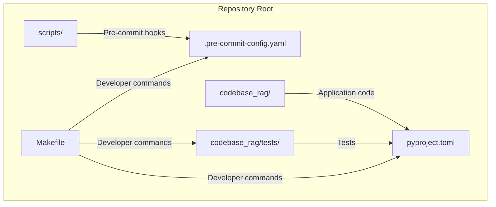
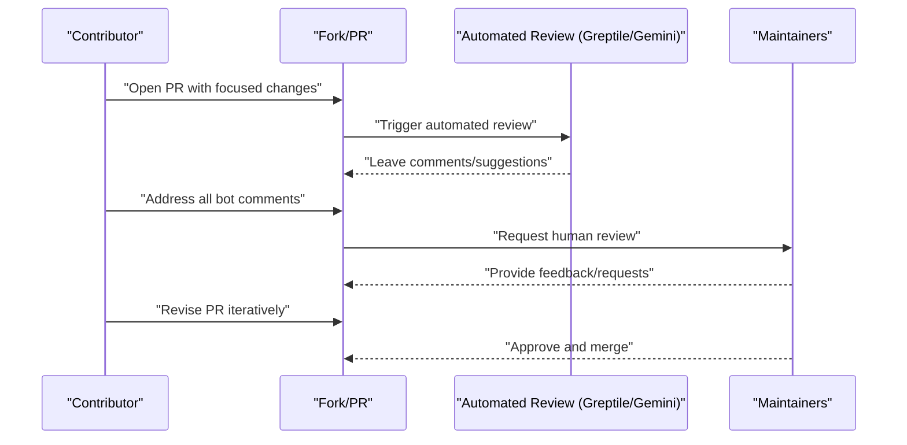
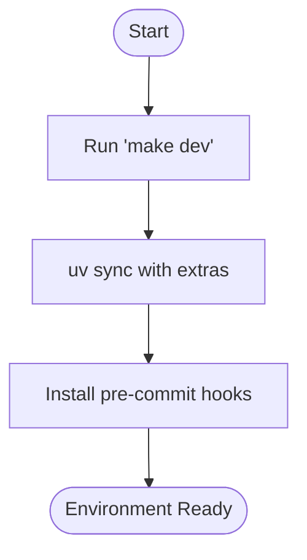
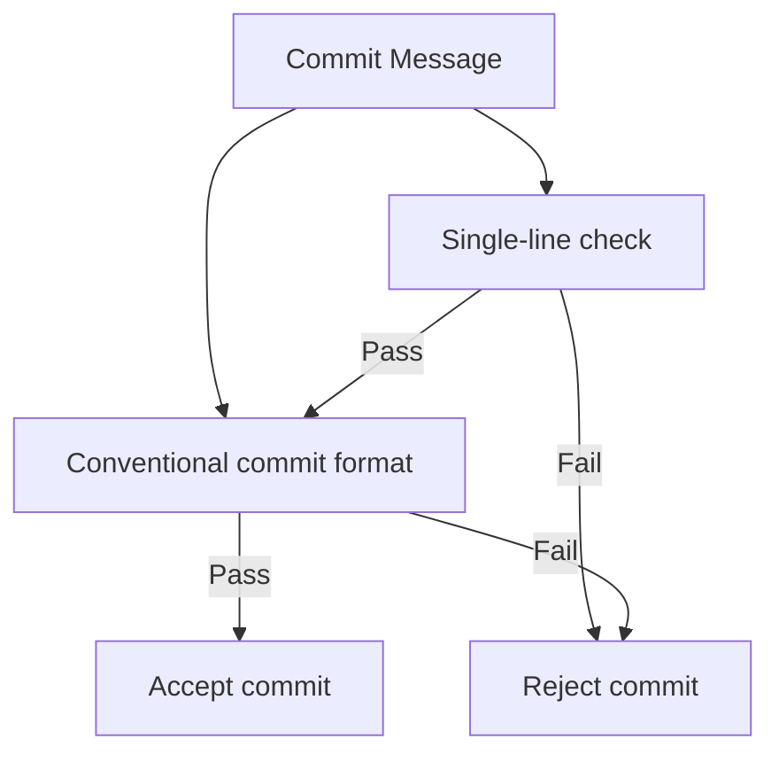
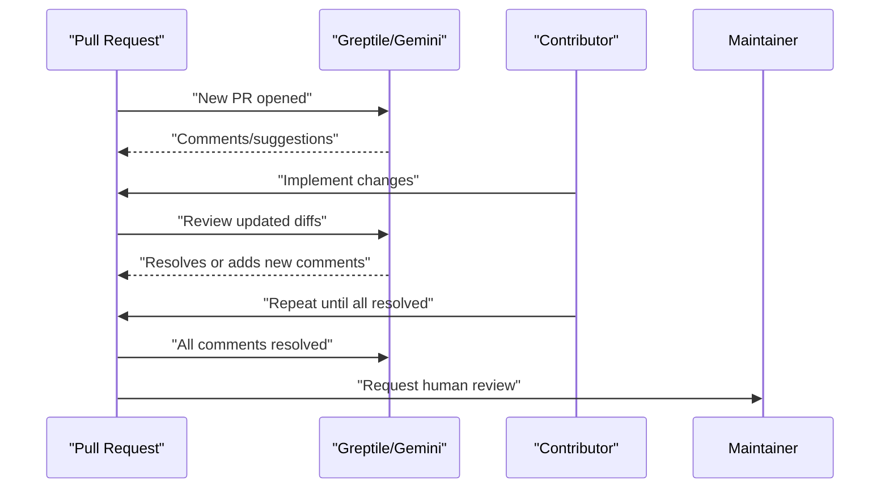
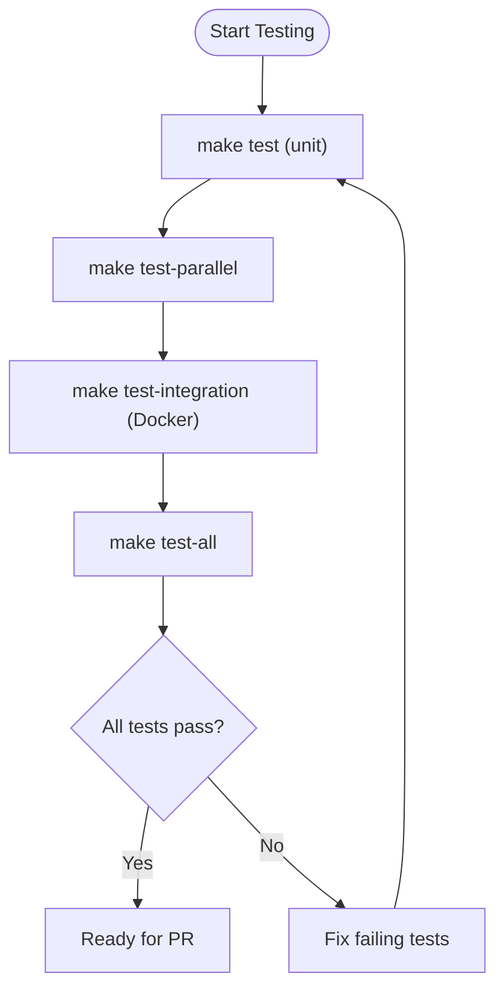
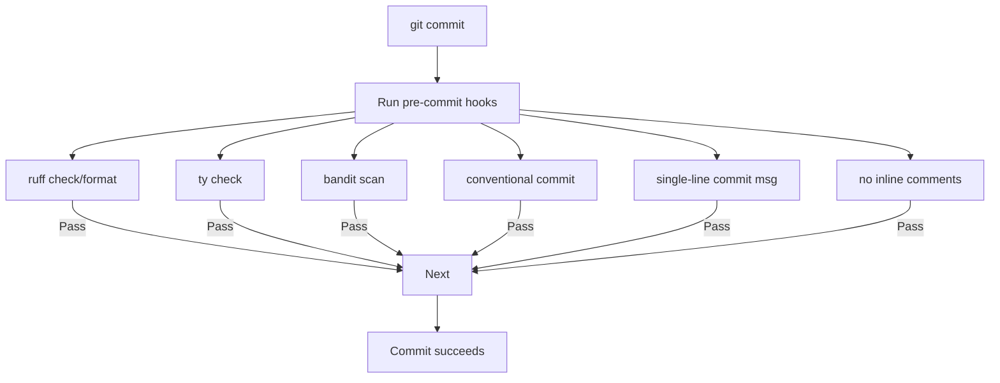
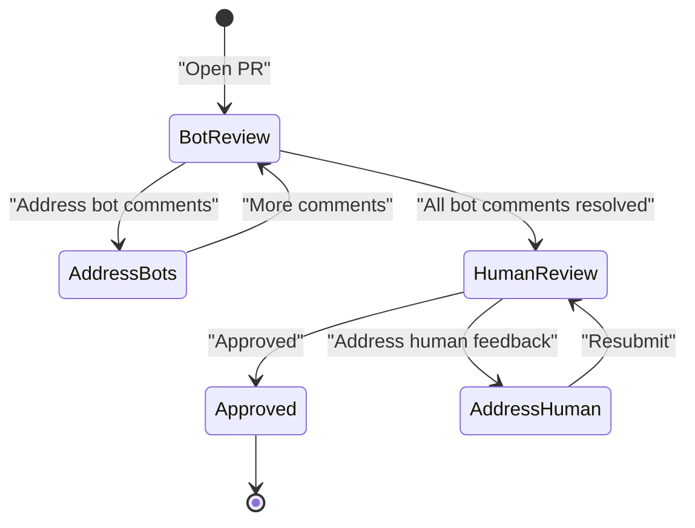
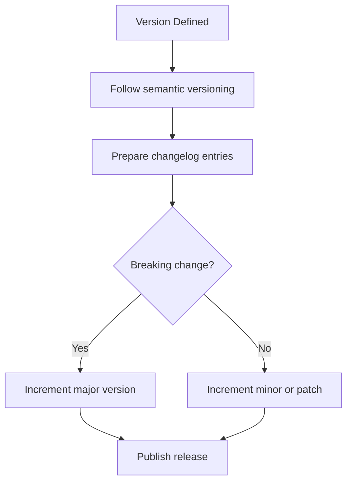
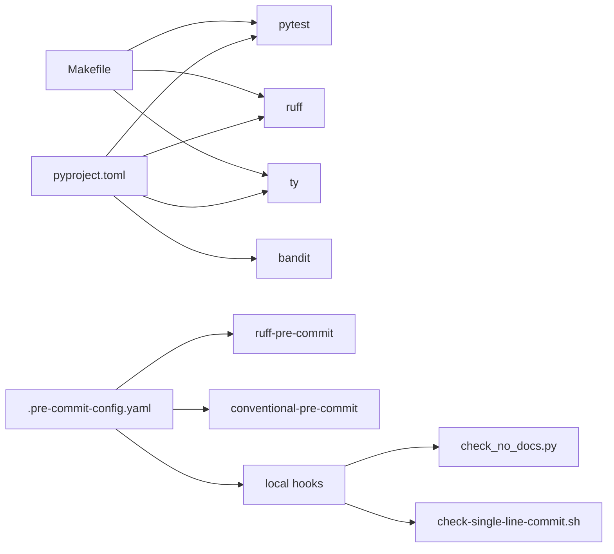

# Contribution Workflow

<cite>
**Referenced Files in This Document**
- [CONTRIBUTING.md](file://CONTRIBUTING.md)
- [README.md](file://README.md)
- [.pre-commit-config.yaml](file://.pre-commit-config.yaml)
- [pyproject.toml](file://pyproject.toml)
- [Makefile](file://Makefile)
- [scripts/hooks/check-single-line-commit.sh](file://scripts/hooks/check-single-line-commit.sh)
- [scripts/check_no_docs.py](file://scripts/check_no_docs.py)
- [codebase_rag/tests/](file://codebase_rag/tests/)
</cite>

## Table of Contents
1. [Introduction](#introduction)
2. [Project Structure](#project-structure)
3. [Core Components](#core-components)
4. [Architecture Overview](#architecture-overview)
5. [Detailed Component Analysis](#detailed-component-analysis)
6. [Dependency Analysis](#dependency-analysis)
7. [Performance Considerations](#performance-considerations)
8. [Troubleshooting Guide](#troubleshooting-guide)
9. [Conclusion](#conclusion)
10. [Appendices](#appendices)

## Introduction
This document defines the complete contribution workflow for Graph-Code, from discovering an issue to getting a pull request accepted. It covers automated code review with Greptile and Gemini Code Assist bots, conventional commit requirements, PR title conventions, testing requirements, pre-commit hook compliance, the iterative review cycle, and release/version management guidance. It also provides practical advice for maintaining backward compatibility and handling breaking changes.

## Project Structure
The repository follows a layered structure centered around a CLI application and a comprehensive test suite. Key areas for contributors:
- codebase_rag/: core application code, parsers, services, tools, and utilities
- codebase_rag/tests/: extensive unit, integration, and end-to-end tests
- scripts/: pre-commit hook enforcement and helper scripts
- pyproject.toml: project metadata, dependencies, tool configurations
- .pre-commit-config.yaml: automated checks on commits and commit messages
- Makefile: standardized developer commands for setup, testing, linting, and type checking

**Diagram sources**
- [pyproject.toml](file://pyproject.toml#L1-L126)
- [.pre-commit-config.yaml](file://.pre-commit-config.yaml#L1-L61)
- [Makefile](file://Makefile#L1-L80)

**Section sources**
- [pyproject.toml](file://pyproject.toml#L1-L126)
- [.pre-commit-config.yaml](file://.pre-commit-config.yaml#L1-L61)
- [Makefile](file://Makefile#L1-L80)

## Core Components
This section outlines the contribution workflow essentials: issue discovery, development setup, commit and PR conventions, automated review, testing, and release/version guidance.

- Issue discovery and assignment
  - Browse issues, pick a suitable task, and comment to coordinate with maintainers.
- Development environment
  - Use the Makefile to set up a complete environment, including dependencies, language grammars, and pre-commit hooks.
- Commit and PR conventions
  - Conventional Commits format, one-line commit messages, and PR titles matching the conventional commit pattern.
- Automated code review
  - Greptile and Gemini Code Assist bots provide initial feedback; address all comments before requesting human review.
- Testing and pre-commit hooks
  - Run existing tests, add tests for new functionality, and ensure pre-commit passes without manual bypasses.
- Release and version management
  - Version is defined in project metadata; follow semantic versioning and prepare changelog entries aligned with conventional commit types.

**Section sources**
- [CONTRIBUTING.md](file://CONTRIBUTING.md#L5-L64)
- [CONTRIBUTING.md](file://CONTRIBUTING.md#L672-L718)
- [README.md](file://README.md#L222-L247)
- [pyproject.toml](file://pyproject.toml#L1-L6)

## Architecture Overview
The contribution workflow integrates developer actions with automated checks and review systems.

**Diagram sources**
- [CONTRIBUTING.md](file://CONTRIBUTING.md#L53-L64)

## Detailed Component Analysis

### Issue Discovery and Assignment
- Use the repository’s issue tracker to discover tasks.
- Comment on an issue to claim it and avoid duplication.
- Fork the repository and create a descriptive branch for your work.

**Section sources**
- [CONTRIBUTING.md](file://CONTRIBUTING.md#L5-L12)

### Development Environment Setup
- Use the Makefile to install dependencies, language grammars, and pre-commit hooks.
- The development environment includes test extras and optional semantic search dependencies.

**Diagram sources**
- [Makefile](file://Makefile#L27-L32)
- [pyproject.toml](file://pyproject.toml#L37-L61)

**Section sources**
- [Makefile](file://Makefile#L27-L32)
- [pyproject.toml](file://pyproject.toml#L37-L61)

### Commit Message and PR Title Conventions
- Commit messages must be a single line and follow Conventional Commits.
- PR titles must match the conventional commit pattern and include a scope and optional breaking change indicator.
- Allowed prefixes include build, chore, ci, docs, feat, fix, perf, refactor/prefactor, revert, style, and test.

**Diagram sources**
- [scripts/hooks/check-single-line-commit.sh](file://scripts/hooks/check-single-line-commit.sh#L1-L23)
- [.pre-commit-config.yaml](file://.pre-commit-config.yaml#L49-L60)
- [CONTRIBUTING.md](file://CONTRIBUTING.md#L672-L718)

**Section sources**
- [scripts/hooks/check-single-line-commit.sh](file://scripts/hooks/check-single-line-commit.sh#L1-L23)
- [.pre-commit-config.yaml](file://.pre-commit-config.yaml#L49-L60)
- [CONTRIBUTING.md](file://CONTRIBUTING.md#L672-L718)

### Automated Code Review with Greptile and Gemini Code Assist
- Automated bots provide initial feedback; address every comment before requesting human review.
- For each suggestion, either accept it or clearly justify why it does not apply.
- Iterate until all bot comments are resolved.

**Diagram sources**
- [CONTRIBUTING.md](file://CONTRIBUTING.md#L53-L64)

**Section sources**
- [CONTRIBUTING.md](file://CONTRIBUTING.md#L53-L64)

### Testing Requirements
- Run existing tests to ensure no regressions.
- Add tests for new functionality.
- Use Makefile targets for unit, integration, and parallel test execution.
- Ensure pre-commit hooks pass before pushing.

**Diagram sources**
- [Makefile](file://Makefile#L33-L46)
- [pyproject.toml](file://pyproject.toml#L94-L105)

**Section sources**
- [Makefile](file://Makefile#L33-L46)
- [pyproject.toml](file://pyproject.toml#L94-L105)

### Pre-commit Hook Compliance
- Mandatory pre-commit hooks enforce formatting, type checking, linting, security scanning, conventional commit validation, and inline comment policy.
- Do not bypass hooks with “--no-verify”.

**Diagram sources**
- [.pre-commit-config.yaml](file://.pre-commit-config.yaml#L1-L61)
- [scripts/check_no_docs.py](file://scripts/check_no_docs.py#L1-L125)
- [scripts/hooks/check-single-line-commit.sh](file://scripts/hooks/check-single-line-commit.sh#L1-L23)

**Section sources**
- [.pre-commit-config.yaml](file://.pre-commit-config.yaml#L1-L61)
- [scripts/check_no_docs.py](file://scripts/check_no_docs.py#L1-L125)
- [scripts/hooks/check-single-line-commit.sh](file://scripts/hooks/check-single-line-commit.sh#L1-L23)

### Code Review Process and Iteration
- After resolving all automated bot comments, request a human review.
- Expect feedback on design, logic, and adherence to style/type constraints.
- Iterate on feedback until maintainers approve.

**Diagram sources**
- [CONTRIBUTING.md](file://CONTRIBUTING.md#L53-L64)

**Section sources**
- [CONTRIBUTING.md](file://CONTRIBUTING.md#L53-L64)

### Release and Version Management
- Version is defined in project metadata; follow semantic versioning.
- Prepare changelog entries aligned with conventional commit types (feat, fix, perf, refactor, style, test, docs, chore, ci, build, revert).
- Breaking changes are indicated by the “!” modifier in commit messages and PR titles.

**Diagram sources**
- [pyproject.toml](file://pyproject.toml#L3-L4)
- [CONTRIBUTING.md](file://CONTRIBUTING.md#L672-L718)

**Section sources**
- [pyproject.toml](file://pyproject.toml#L3-L4)
- [CONTRIBUTING.md](file://CONTRIBUTING.md#L672-L718)

### Backward Compatibility and Breaking Changes
- Use the “!” modifier in commit messages and PR titles to indicate breaking changes.
- Limit PR scope to a single issue or feature to reduce risk.
- Prefer additive changes and deprecations with migration guidance when possible.

**Section sources**
- [CONTRIBUTING.md](file://CONTRIBUTING.md#L47-L51)
- [CONTRIBUTING.md](file://CONTRIBUTING.md#L672-L718)

## Dependency Analysis
The contribution workflow relies on consistent tooling and configuration across the repository.

**Diagram sources**
- [pyproject.toml](file://pyproject.toml#L37-L121)
- [.pre-commit-config.yaml](file://.pre-commit-config.yaml#L1-L61)
- [Makefile](file://Makefile#L69-L78)

**Section sources**
- [pyproject.toml](file://pyproject.toml#L37-L121)
- [.pre-commit-config.yaml](file://.pre-commit-config.yaml#L1-L61)
- [Makefile](file://Makefile#L69-L78)

## Performance Considerations
- Use parallel test execution for faster feedback loops.
- Keep PRs focused to minimize review overhead and reduce CI time.
- Run linting and type checks locally to fail fast before committing.

**Section sources**
- [Makefile](file://Makefile#L36-L46)
- [CONTRIBUTING.md](file://CONTRIBUTING.md#L47-L51)

## Troubleshooting Guide
- Pre-commit fails on conventional commit validation
  - Ensure commit messages follow the conventional commit pattern and are a single line.
- Pre-commit fails on inline comments
  - Remove disallowed inline comments; only top-of-file comments, (H) comments, and specific markers are permitted.
- Pre-commit fails on type checking
  - Fix type errors reported by the type checker; avoid Any/object and use strict typing.
- Automated bot comments remain unresolved
  - Address every suggestion or provide a clear justification; do not ignore comments.
- Tests fail locally but succeed in CI
  - Verify environment differences (Docker, model endpoints) and re-run with the same flags used in CI.

**Section sources**
- [scripts/hooks/check-single-line-commit.sh](file://scripts/hooks/check-single-line-commit.sh#L1-L23)
- [scripts/check_no_docs.py](file://scripts/check_no_docs.py#L1-L125)
- [.pre-commit-config.yaml](file://.pre-commit-config.yaml#L1-L61)
- [CONTRIBUTING.md](file://CONTRIBUTING.md#L53-L64)

## Conclusion
By following this contribution workflow—starting with issue discovery, adhering to conventional commits and PR conventions, complying with pre-commit hooks, rigorously testing changes, and engaging constructively with automated and human reviewers—you ensure efficient, high-quality contributions to Graph-Code. Releases should align with semantic versioning and clear changelog entries reflecting the nature of changes.

## Appendices
- Useful Makefile targets for daily development
  - make dev, make test, make test-parallel, make test-integration, make test-all, make lint, make format, make typecheck, make check

**Section sources**
- [README.md](file://README.md#L222-L247)
- [Makefile](file://Makefile#L1-L80)