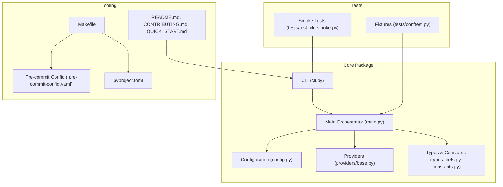
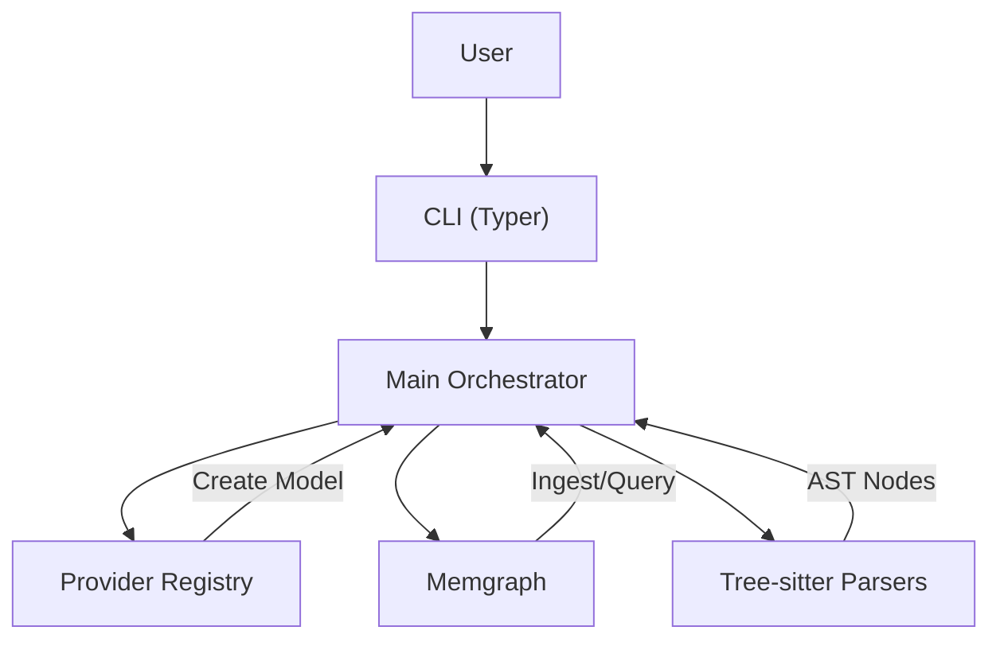
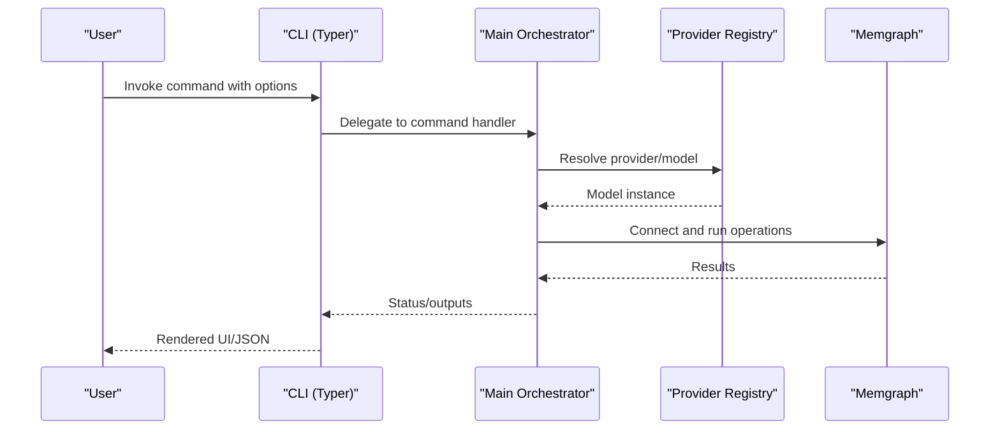
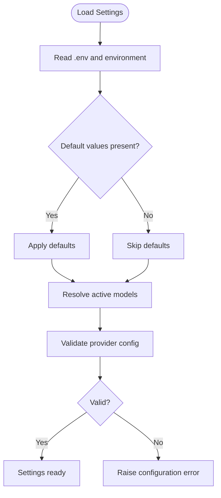
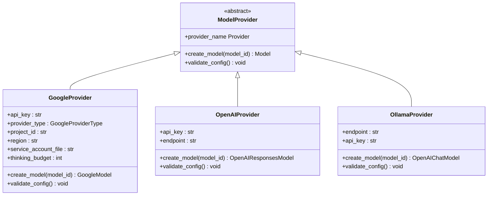
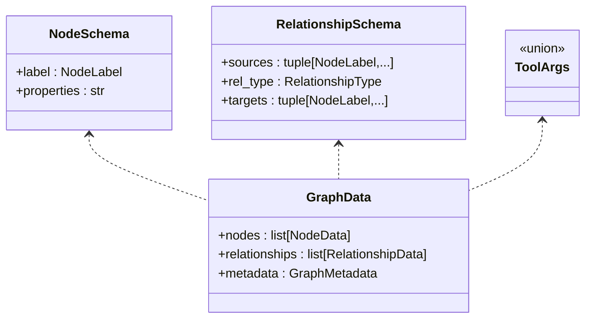
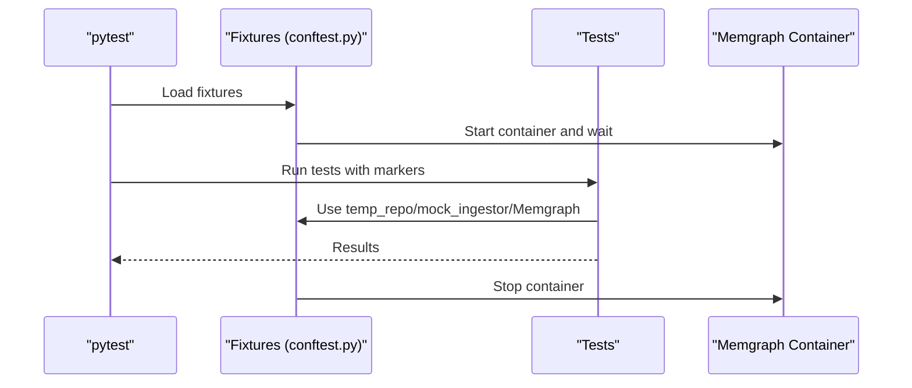
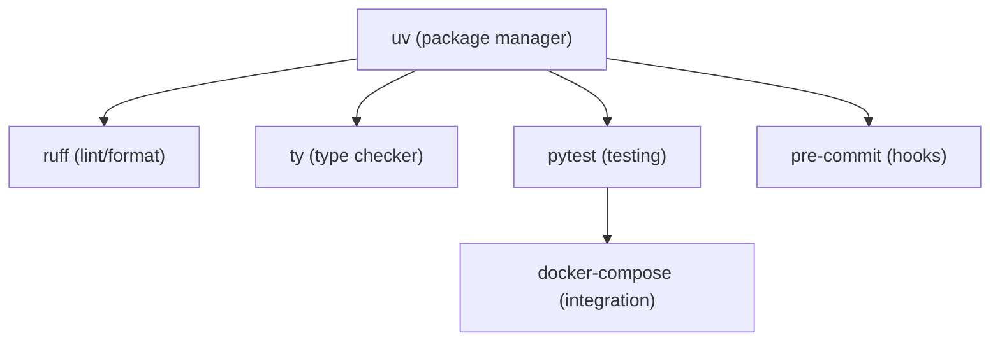

# Development Guidelines

<cite>
**Referenced Files in This Document**
- [CONTRIBUTING.md](file://CONTRIBUTING.md)
- [README.md](file://README.md)
- [QUICK_START.md](file://QUICK_START.md)
- [Makefile](file://Makefile)
- [.pre-commit-config.yaml](file://.pre-commit-config.yaml)
- [pyproject.toml](file://pyproject.toml)
- [codebase_rag/cli.py](file://codebase_rag/cli.py)
- [codebase_rag/main.py](file://codebase_rag/main.py)
- [codebase_rag/config.py](file://codebase_rag/config.py)
- [codebase_rag/providers/base.py](file://codebase_rag/providers/base.py)
- [codebase_rag/constants.py](file://codebase_rag/constants.py)
- [codebase_rag/types_defs.py](file://codebase_rag/types_defs.py)
- [codebase_rag/tests/conftest.py](file://codebase_rag/tests/conftest.py)
- [codebase_rag/tests/test_cli_smoke.py](file://codebase_rag/tests/test_cli_smoke.py)
</cite>

## Table of Contents
1. [Introduction](#introduction)
2. [Project Structure](#project-structure)
3. [Core Components](#core-components)
4. [Architecture Overview](#architecture-overview)
5. [Detailed Component Analysis](#detailed-component-analysis)
6. [Dependency Analysis](#dependency-analysis)
7. [Performance Considerations](#performance-considerations)
8. [Troubleshooting Guide](#troubleshooting-guide)
9. [Conclusion](#conclusion)
10. [Appendices](#appendices)

## Introduction
This document consolidates the development guidelines, contribution practices, and operational procedures for Graph-Code. It covers code style and formatting standards enforced by pre-commit hooks, the development setup using Makefile commands, the contribution workflow from fork to pull request, release and version management, architectural principles, and guidance for extending language support, adding tools, and integrating new AI providers. It also includes troubleshooting advice and community communication channels.

## Project Structure
The repository is organized around a modular Python package (codebase_rag) with supporting configuration, tests, scripts, and documentation. Key areas:
- codebase_rag/: Core application modules (CLI, main orchestration, configuration, providers, services, tools, parsers, utilities)
- codebase_rag/tests/: Comprehensive test suite with fixtures and integration tests
- scripts/: Pre-commit hooks and documentation generation helpers
- docs/, examples/, optimize/: Supporting materials for integration and usage
- Top-level configuration: Makefile, pyproject.toml, .pre-commit-config.yaml, README, CONTRIBUTING, QUICK_START

**Diagram sources**
- [codebase_rag/cli.py](file://codebase_rag/cli.py#L1-L395)
- [codebase_rag/main.py](file://codebase_rag/main.py#L1-L800)
- [codebase_rag/config.py](file://codebase_rag/config.py#L1-L274)
- [codebase_rag/providers/base.py](file://codebase_rag/providers/base.py#L1-L209)
- [codebase_rag/types_defs.py](file://codebase_rag/types_defs.py#L1-L555)
- [codebase_rag/tests/conftest.py](file://codebase_rag/tests/conftest.py#L1-L290)
- [codebase_rag/tests/test_cli_smoke.py](file://codebase_rag/tests/test_cli_smoke.py#L1-L35)
- [Makefile](file://Makefile#L1-L80)
- [.pre-commit-config.yaml](file://.pre-commit-config.yaml#L1-L61)
- [pyproject.toml](file://pyproject.toml#L1-L126)
- [README.md](file://README.md#L1-L886)
- [CONTRIBUTING.md](file://CONTRIBUTING.md#L1-L765)
- [QUICK_START.md](file://QUICK_START.md#L1-L118)

**Section sources**
- [README.md](file://README.md#L1-L886)
- [CONTRIBUTING.md](file://CONTRIBUTING.md#L1-L765)
- [Makefile](file://Makefile#L1-L80)
- [.pre-commit-config.yaml](file://.pre-commit-config.yaml#L1-L61)
- [pyproject.toml](file://pyproject.toml#L1-L126)

## Core Components
- CLI and Commands: The CLI exposes commands for starting, indexing, exporting, optimizing, MCP server, and graph loading. It integrates with Typer for argument parsing and Rich for UI.
- Main Orchestrator: Manages agent loops, tool approvals, session logging, and model switching. It coordinates with Memgraph ingestion and query flows.
- Configuration: Centralized settings via Pydantic Settings with environment variable overrides and model configuration resolution.
- Providers: Pluggable AI providers (Google, OpenAI, Ollama) with validation and model creation abstractions.
- Types and Constants: Strongly typed structures, enums, and constants for nodes, relationships, UI, and tool schemas.

Key implementation references:
- CLI command definitions and options: [codebase_rag/cli.py](file://codebase_rag/cli.py#L55-L395)
- Main orchestration and agent loops: [codebase_rag/main.py](file://codebase_rag/main.py#L681-L725)
- Configuration and model settings: [codebase_rag/config.py](file://codebase_rag/config.py#L39-L234)
- Provider registry and model creation: [codebase_rag/providers/base.py](file://codebase_rag/providers/base.py#L40-L194)
- Types and schemas: [codebase_rag/types_defs.py](file://codebase_rag/types_defs.py#L424-L555), [codebase_rag/constants.py](file://codebase_rag/constants.py#L12-L507)

**Section sources**
- [codebase_rag/cli.py](file://codebase_rag/cli.py#L1-L395)
- [codebase_rag/main.py](file://codebase_rag/main.py#L1-L800)
- [codebase_rag/config.py](file://codebase_rag/config.py#L1-L274)
- [codebase_rag/providers/base.py](file://codebase_rag/providers/base.py#L1-L209)
- [codebase_rag/types_defs.py](file://codebase_rag/types_defs.py#L1-L555)
- [codebase_rag/constants.py](file://codebase_rag/constants.py#L1-L800)

## Architecture Overview
The system comprises:
- CLI-driven workflows for ingestion, querying, exporting, optimization, and MCP server
- Provider-agnostic model orchestration via Pydantic AI
- Memgraph-backed knowledge graph storage and retrieval
- Tree-sitter-based multi-language parsing and ingestion pipeline

**Diagram sources**
- [codebase_rag/cli.py](file://codebase_rag/cli.py#L26-L395)
- [codebase_rag/main.py](file://codebase_rag/main.py#L317-L438)
- [codebase_rag/providers/base.py](file://codebase_rag/providers/base.py#L158-L194)
- [codebase_rag/config.py](file://codebase_rag/config.py#L197-L234)

**Section sources**
- [README.md](file://README.md#L72-L116)
- [codebase_rag/main.py](file://codebase_rag/main.py#L1-L800)
- [codebase_rag/providers/base.py](file://codebase_rag/providers/base.py#L1-L209)

## Detailed Component Analysis

### CLI and Commands
The CLI defines commands for:
- start: Parse and ingest codebases, update graphs, export to file
- index: Generate protobuf indices
- export: Export graph to JSON
- optimize: AI-driven optimization sessions
- mcp_server: Run as MCP server
- graph_loader: Load and summarize exported graphs

**Diagram sources**
- [codebase_rag/cli.py](file://codebase_rag/cli.py#L55-L395)
- [codebase_rag/main.py](file://codebase_rag/main.py#L681-L725)
- [codebase_rag/providers/base.py](file://codebase_rag/providers/base.py#L179-L194)

**Section sources**
- [codebase_rag/cli.py](file://codebase_rag/cli.py#L55-L395)
- [codebase_rag/main.py](file://codebase_rag/main.py#L681-L725)

### Configuration and Model Resolution
Configuration is centralized with environment variable overrides and dynamic model resolution. It supports:
- Orchestrator and Cypher model configuration
- Provider-specific settings (Google, OpenAI, Ollama)
- Batch size and shell command allowlists

**Diagram sources**
- [codebase_rag/config.py](file://codebase_rag/config.py#L39-L234)
- [codebase_rag/providers/base.py](file://codebase_rag/providers/base.py#L63-L98)

**Section sources**
- [codebase_rag/config.py](file://codebase_rag/config.py#L1-L274)
- [codebase_rag/providers/base.py](file://codebase_rag/providers/base.py#L1-L209)

### Provider Registry and Model Creation
The provider registry abstracts model creation and validation across providers. It supports:
- Google (GLA and Vertex variants)
- OpenAI
- Ollama

**Diagram sources**
- [codebase_rag/providers/base.py](file://codebase_rag/providers/base.py#L20-L194)

**Section sources**
- [codebase_rag/providers/base.py](file://codebase_rag/providers/base.py#L1-L209)

### Types and Schemas
Strong typing is enforced for graph data, tool arguments, and schemas. This includes:
- Node and relationship schemas
- Tool argument types
- Typed dictionaries for results and metadata

**Diagram sources**
- [codebase_rag/types_defs.py](file://codebase_rag/types_defs.py#L424-L555)

**Section sources**
- [codebase_rag/types_defs.py](file://codebase_rag/types_defs.py#L1-L555)
- [codebase_rag/constants.py](file://codebase_rag/constants.py#L317-L507)

### Testing and Fixtures
The test suite leverages:
- pytest markers for slow, integration, and e2e tests
- fixtures for temporary repos, Memgraph containers, and mock ingestors
- Smoke tests for CLI import and help command

**Diagram sources**
- [codebase_rag/tests/conftest.py](file://codebase_rag/tests/conftest.py#L182-L290)
- [codebase_rag/tests/test_cli_smoke.py](file://codebase_rag/tests/test_cli_smoke.py#L1-L35)

**Section sources**
- [codebase_rag/tests/conftest.py](file://codebase_rag/tests/conftest.py#L1-L290)
- [codebase_rag/tests/test_cli_smoke.py](file://codebase_rag/tests/test_cli_smoke.py#L1-L35)

## Dependency Analysis
The project uses a modern Python toolchain:
- Package management: uv
- Linting and formatting: ruff
- Type checking: ty
- Testing: pytest with xdist and testcontainers
- Pre-commit hooks for quality gates

**Diagram sources**
- [pyproject.toml](file://pyproject.toml#L1-L126)
- [Makefile](file://Makefile#L1-L80)
- [.pre-commit-config.yaml](file://.pre-commit-config.yaml#L1-L61)

**Section sources**
- [pyproject.toml](file://pyproject.toml#L1-L126)
- [Makefile](file://Makefile#L1-L80)
- [.pre-commit-config.yaml](file://.pre-commit-config.yaml#L1-L61)

## Performance Considerations
- Use Makefile targets for parallelized tests and efficient development workflows
- Tune Memgraph batch sizes for ingestion and export operations
- Prefer local models (Ollama) for privacy and reduced latency when appropriate
- Leverage caching and allowlists for shell commands to avoid unnecessary overhead

[No sources needed since this section provides general guidance]

## Troubleshooting Guide
Common development issues and resolutions:
- Pre-commit failures: Run ruff checks and format locally before committing; ensure hooks are installed
  - See lint/format targets and pre-commit configuration
- Model configuration errors: Verify provider keys and endpoints; use the /model command to switch models interactively
- Memgraph connectivity: Ensure Docker is running and ports are exposed; use docker-compose up -d
- CLI import or help failures: Confirm installation and environment; run smoke tests to validate CLI module import

**Section sources**
- [CONTRIBUTING.md](file://CONTRIBUTING.md#L22-L96)
- [README.md](file://README.md#L217-L221)
- [codebase_rag/tests/test_cli_smoke.py](file://codebase_rag/tests/test_cli_smoke.py#L1-L35)
- [codebase_rag/main.py](file://codebase_rag/main.py#L535-L565)

## Conclusion
This guide consolidates the development practices, tooling, and workflows for contributing to Graph-Code. By adhering to the established code style, using Makefile commands for development tasks, following the contribution workflow, and leveraging the provider and language extensibility patterns, contributors can efficiently add features, improve reliability, and extend the system’s capabilities.

[No sources needed since this section summarizes without analyzing specific files]

## Appendices

### Development Setup and Makefile Commands
- Full development environment: make dev
- Install dependencies: make install or make python
- Run tests: make test, make test-parallel, make test-integration, make test-all, make test-parallel-all
- Cleanup: make clean
- Lint/typecheck/format: make lint, make typecheck, make format
- Check all: make check
- Watch and update graph: make watch REPO_PATH=...
- Regenerate README sections: make readme

**Section sources**
- [README.md](file://README.md#L222-L247)
- [Makefile](file://Makefile#L1-L80)

### Contribution Workflow
- Fork the repository and create a feature branch
- Follow code style and add tests
- Install pre-commit hooks and ensure all checks pass
- Submit a pull request with a clear description and conventional commit title

**Section sources**
- [CONTRIBUTING.md](file://CONTRIBUTING.md#L5-L64)

### Release and Version Management
- Version is managed in pyproject.toml; increment as needed for releases
- Tagging and distribution handled via uv packaging

**Section sources**
- [pyproject.toml](file://pyproject.toml#L2-L4)

### Extending Language Support
- Use the built-in language management tool to add Tree-sitter grammars
- Follow the language addition quick start and automatic configuration updates

**Section sources**
- [README.md](file://README.md#L726-L793)

### Integrating New AI Providers
- Register a new provider in the provider registry
- Implement provider-specific validation and model creation
- Ensure configuration resolution and CLI model switching work seamlessly

**Section sources**
- [codebase_rag/providers/base.py](file://codebase_rag/providers/base.py#L158-L194)

### Architectural Principles and Design Patterns
- Pydantic AI as the official agentic framework
- Strong typing with TypedDict, dataclass, and StrEnum
- Centralized configuration via Pydantic Settings
- Provider abstraction with registry pattern
- CLI-first UX with Typer and Rich

**Section sources**
- [CONTRIBUTING.md](file://CONTRIBUTING.md#L68-L82)
- [codebase_rag/providers/base.py](file://codebase_rag/providers/base.py#L1-L209)
- [codebase_rag/types_defs.py](file://codebase_rag/types_defs.py#L1-L555)
- [codebase_rag/config.py](file://codebase_rag/config.py#L1-L274)

### Community Guidelines and Communication
- Use GitHub Discussions and Issues for questions and collaboration
- Engage respectfully and follow project communication channels

**Section sources**
- [CONTRIBUTING.md](file://CONTRIBUTING.md#L736-L742)