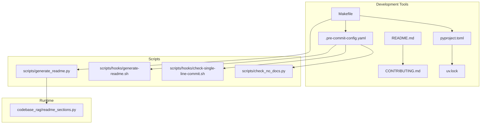
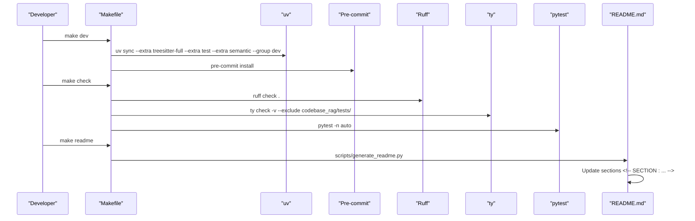
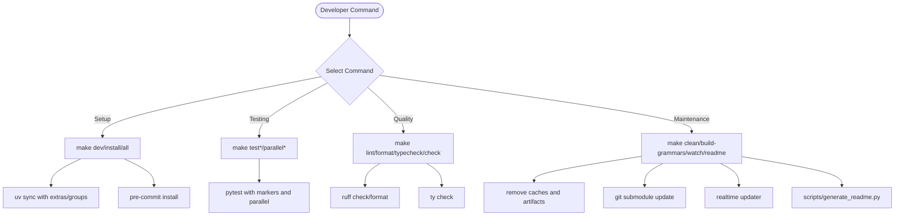
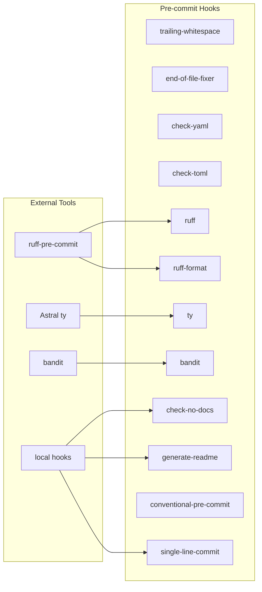
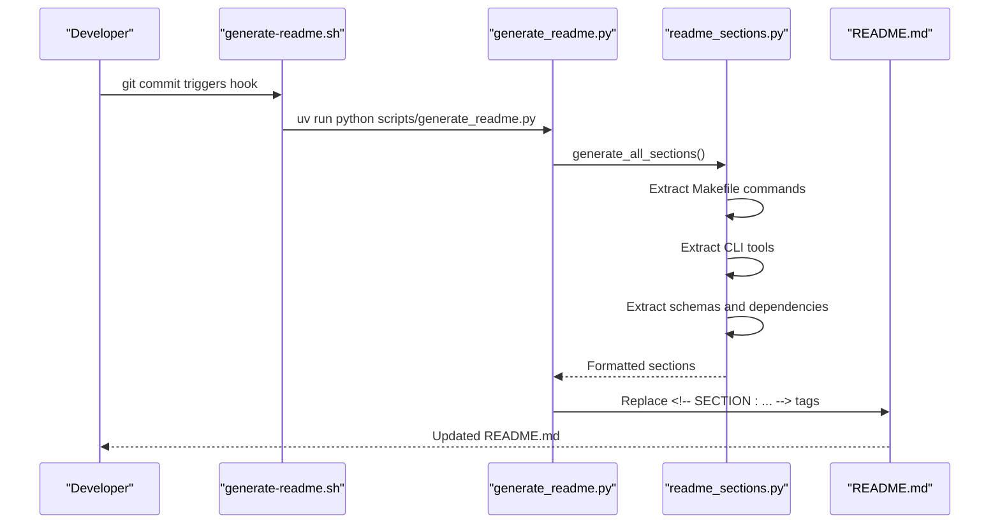
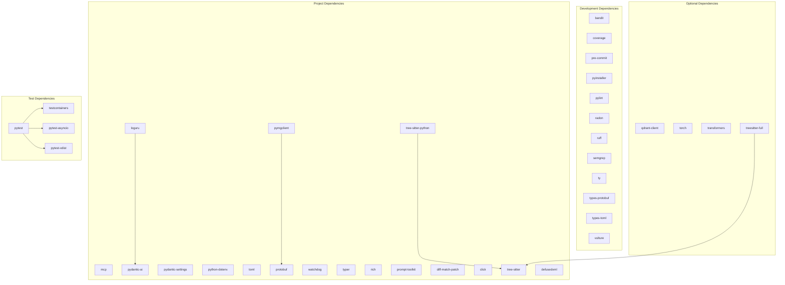

# Development Tools

<cite>
**Referenced Files in This Document**
- [Makefile](file://Makefile)
- [.pre-commit-config.yaml](file://.pre-commit-config.yaml)
- [pyproject.toml](file://pyproject.toml)
- [README.md](file://README.md)
- [CONTRIBUTING.md](file://CONTRIBUTING.md)
- [uv.lock](file://uv.lock)
- [scripts/generate_readme.py](file://scripts/generate_readme.py)
- [scripts/hooks/generate-readme.sh](file://scripts/hooks/generate-readme.sh)
- [scripts/hooks/check-single-line-commit.sh](file://scripts/hooks/check-single-line-commit.sh)
- [scripts/check_no_docs.py](file://scripts/check_no_docs.py)
- [codebase_rag/readme_sections.py](file://codebase_rag/readme_sections.py)
</cite>

## Table of Contents
1. [Introduction](#introduction)
2. [Project Structure](#project-structure)
3. [Core Components](#core-components)
4. [Architecture Overview](#architecture-overview)
5. [Detailed Component Analysis](#detailed-component-analysis)
6. [Dependency Analysis](#dependency-analysis)
7. [Performance Considerations](#performance-considerations)
8. [Troubleshooting Guide](#troubleshooting-guide)
9. [Conclusion](#conclusion)

## Introduction
This document provides comprehensive documentation for the Graph-Code development tools and utilities. It covers the Astral toolchain (uv for package management, ruff for linting and formatting, ty for static type checking, and pytest for testing), the Makefile development workflow, the pre-commit hook system, ripgrep dependency requirements, and the project's tooling philosophy. It also includes troubleshooting guidance and optimization tips for efficient development workflows.

## Project Structure
The development tooling is organized around several key files and scripts:
- Makefile defines development commands for setup, testing, linting, formatting, type checking, and cleanup
- .pre-commit-config.yaml configures pre-commit hooks for code quality checks
- pyproject.toml centralizes project configuration, dependencies, and tool settings
- README.md documents prerequisites including ripgrep and uv
- CONTRIBUTING.md outlines development standards and tooling requirements
- scripts/ contains automation utilities for documentation generation and pre-commit hooks
- codebase_rag/readme_sections.py generates dynamic content for README.md

**Diagram sources**
- [Makefile](file://Makefile#L1-L80)
- [.pre-commit-config.yaml](file://.pre-commit-config.yaml#L1-L61)
- [pyproject.toml](file://pyproject.toml#L1-L126)
- [README.md](file://README.md#L80-L135)
- [CONTRIBUTING.md](file://CONTRIBUTING.md#L77-L124)
- [uv.lock](file://uv.lock#L1-L10)
- [scripts/generate_readme.py](file://scripts/generate_readme.py#L1-L45)
- [scripts/hooks/generate-readme.sh](file://scripts/hooks/generate-readme.sh#L1-L3)
- [scripts/hooks/check-single-line-commit.sh](file://scripts/hooks/check-single-line-commit.sh#L1-L23)
- [scripts/check_no_docs.py](file://scripts/check_no_docs.py#L1-L125)
- [codebase_rag/readme_sections.py](file://codebase_rag/readme_sections.py#L1-L247)

**Section sources**
- [Makefile](file://Makefile#L1-L80)
- [.pre-commit-config.yaml](file://.pre-commit-config.yaml#L1-L61)
- [pyproject.toml](file://pyproject.toml#L1-L126)
- [README.md](file://README.md#L80-L135)
- [CONTRIBUTING.md](file://CONTRIBUTING.md#L77-L124)

## Core Components
This section details the primary development tools and their roles:

### Package Management with uv
- uv serves as the package manager and dependency resolver
- Used for installing dependencies with extras for full language support
- Manages development dependencies and virtual environments
- Locks dependencies in uv.lock for reproducible builds

### Code Quality with Ruff
- Ruff provides linting and formatting in a single tool
- Configured in pyproject.toml with line length, target version, and exclusions
- Integrated into pre-commit hooks and Makefile commands
- Supports both check and format operations

### Static Type Checking with ty
- ty performs static type checking for Python code
- Configured in pyproject.toml with environment and source settings
- Excludes specific test files from type checking
- Integrated into pre-commit hooks and Makefile

### Testing with pytest
- pytest orchestrates unit and integration tests
- Parallel execution supported via pytest-xdist
- Test markers categorize slow, integration, and e2e tests
- Configured in pyproject.toml with asyncio mode and test paths

**Section sources**
- [pyproject.toml](file://pyproject.toml#L31-L126)
- [Makefile](file://Makefile#L69-L78)
- [.pre-commit-config.yaml](file://.pre-commit-config.yaml#L9-L16)
- [CONTRIBUTING.md](file://CONTRIBUTING.md#L77-L82)

## Architecture Overview
The development workflow integrates multiple tools through Makefile commands, pre-commit hooks, and automated documentation generation.

**Diagram sources**
- [Makefile](file://Makefile#L27-L78)
- [.pre-commit-config.yaml](file://.pre-commit-config.yaml#L17-L41)
- [scripts/generate_readme.py](file://scripts/generate_readme.py#L30-L41)
- [codebase_rag/readme_sections.py](file://codebase_rag/readme_sections.py#L230-L246)

## Detailed Component Analysis

### Makefile Commands
The Makefile provides a comprehensive development workflow:

#### Setup Commands
- `make all`: Complete development environment setup with dependencies, grammars, and hooks
- `make install`: Install project dependencies with full language support
- `make python`: Install Python-only dependencies
- `make dev`: Setup development environment with hooks

#### Testing Commands
- `make test`: Run unit tests only
- `make test-parallel`: Run unit tests in parallel
- `make test-integration`: Run integration tests (requires Docker)
- `make test-all`: Run all tests including integration and e2e
- `make test-parallel-all`: Run all tests in parallel

#### Quality Commands
- `make lint`: Run ruff check
- `make format`: Run ruff format
- `make typecheck`: Run ty type checking
- `make check`: Run all checks (lint, typecheck, test)

#### Maintenance Commands
- `make clean`: Clean build artifacts and caches
- `make build-grammars`: Build grammar submodules
- `make watch`: Watch repository for changes and update graph
- `make readme`: Regenerate README.md from codebase

**Diagram sources**
- [Makefile](file://Makefile#L1-L80)

**Section sources**
- [Makefile](file://Makefile#L1-L80)

### Pre-commit Hook System
The pre-commit configuration enforces code quality and consistency:

#### Core Hooks
- trailing-whitespace: Removes trailing whitespace
- end-of-file-fixer: Ensures files end with newline
- check-yaml: Validates YAML syntax
- check-toml: Validates TOML syntax

#### Astral Toolchain Integration
- ruff: Runs linting with automatic fixes
- ruff-format: Formats code consistently
- ty: Static type checking with exclusions
- bandit: Security vulnerability scanning

#### Local Hooks
- check-no-docs: Enforces no inline comments policy
- generate-readme: Updates README sections automatically
- conventional-pre-commit: Validates commit messages
- single-line-commit: Enforces single-line commit messages

**Diagram sources**
- [.pre-commit-config.yaml](file://.pre-commit-config.yaml#L1-L61)

**Section sources**
- [.pre-commit-config.yaml](file://.pre-commit-config.yaml#L1-L61)

### Ripgrep Dependency Requirements
Ripgrep (rg) is required for shell command text searching:

#### Installation Requirements
- Required for shell command text searching functionality
- Available via package managers on all major platforms
- Essential for development workflow involving text search operations

#### Platform-Specific Installation
- macOS: `brew install ripgrep`
- Ubuntu/Debian: `sudo apt-get install ripgrep`
- CentOS/RHEL: `sudo dnf install ripgrep` (may require EPEL)

**Section sources**
- [README.md](file://README.md#L85-L108)
- [CONTRIBUTING.md](file://CONTRIBUTING.md#L82-L82)

### Documentation Automation
The project includes sophisticated documentation generation:

#### Dynamic Content Generation
- scripts/generate_readme.py reads Makefile commands and formats them into tables
- codebase_rag/readme_sections.py extracts project metadata and formats it into structured tables
- Supports dynamic updates of supported languages, CLI commands, MCP tools, and dependencies

#### Pre-commit Integration
- scripts/hooks/generate-readme.sh automatically runs documentation generation and adds changes to git
- Ensures README stays current with project changes

**Diagram sources**
- [scripts/hooks/generate-readme.sh](file://scripts/hooks/generate-readme.sh#L1-L3)
- [scripts/generate_readme.py](file://scripts/generate_readme.py#L30-L41)
- [codebase_rag/readme_sections.py](file://codebase_rag/readme_sections.py#L230-L246)

**Section sources**
- [scripts/generate_readme.py](file://scripts/generate_readme.py#L1-L45)
- [scripts/hooks/generate-readme.sh](file://scripts/hooks/generate-readme.sh#L1-L3)
- [codebase_rag/readme_sections.py](file://codebase_rag/readme_sections.py#L1-L247)

## Dependency Analysis
The project uses a modern Python toolchain with integrated dependency management:

**Diagram sources**
- [pyproject.toml](file://pyproject.toml#L7-L62)

**Section sources**
- [pyproject.toml](file://pyproject.toml#L1-L126)
- [uv.lock](file://uv.lock#L1-L582)

## Performance Considerations
Several optimizations improve development workflow efficiency:

### Parallel Testing
- pytest-xdist enables parallel test execution with automatic worker detection
- Use `make test-parallel` and `make test-parallel-all` for faster feedback cycles
- Reduces development iteration time significantly

### Caching Strategies
- Ruff maintains caches in .ruff_cache for faster linting
- pytest maintains .pytest_cache for faster test discovery
- uv manages dependency caching for faster installations

### Incremental Development
- Pre-commit hooks run only on staged files
- Makefile commands provide targeted operations (lint, format, typecheck)
- Real-time graph updates support active development workflows

### Memory Management
- Tree-sitter grammars are compiled once and reused
- Docker containers for integration tests are managed efficiently
- Batch processing reduces memory overhead during large operations

## Troubleshooting Guide

### Common Tooling Issues

#### uv Installation Problems
- Ensure Python 3.12+ is installed
- Verify uv is installed and up to date
- Check network connectivity for dependency downloads

#### ripgrep Not Found
- Install ripgrep using platform-specific package managers
- Verify installation with `rg --version`
- Check PATH environment variable if installation fails

#### Pre-commit Hook Failures
- Run `pre-commit install` to reinstall hooks
- Use `pre-commit run --all-files` to diagnose issues
- Check hook configurations in .pre-commit-config.yaml

#### Ruff Formatting Conflicts
- Run `uv run ruff format . --check` to identify formatting issues
- Configure editor integration for automatic formatting
- Review ruff configuration in pyproject.toml

#### Type Checking Errors
- Use `uv run ty check codebase_rag/` for detailed type checking
- Check ty configuration in pyproject.toml
- Review excluded files and directories

#### pytest Test Failures
- Use `make test-parallel` for faster failure identification
- Check test markers and filtering in pyproject.toml
- Verify Docker availability for integration tests

### Optimization Tips

#### Development Workflow
- Use `make check` for comprehensive quality assurance before commits
- Leverage parallel testing for faster feedback
- Keep dependencies updated with `uv sync --upgrade`

#### Editor Integration
- Configure editors to run ruff format on save
- Set up type checking in IDE for immediate feedback
- Enable pre-commit hooks in editor workflows

#### Performance Tuning
- Adjust pytest xdist workers based on CPU cores
- Optimize Tree-sitter grammar compilation for development
- Use selective testing during active development

**Section sources**
- [CONTRIBUTING.md](file://CONTRIBUTING.md#L77-L124)
- [README.md](file://README.md#L80-L135)

## Conclusion
The Graph-Code development toolchain provides a comprehensive, modern approach to Python development with integrated quality assurance, automated documentation, and efficient workflow optimization. The Astral toolchain (uv, ruff, ty, pytest) combined with pre-commit hooks and Makefile orchestration creates a robust development environment that balances developer productivity with code quality. The ripgrep dependency requirement ensures powerful text search capabilities essential for codebase navigation and analysis. The documented troubleshooting procedures and optimization tips provide practical guidance for maintaining an efficient development workflow.