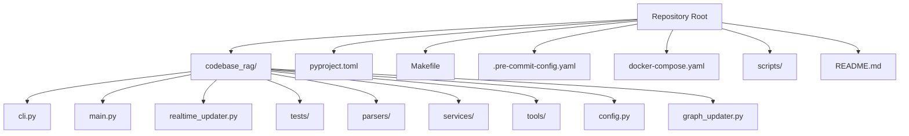
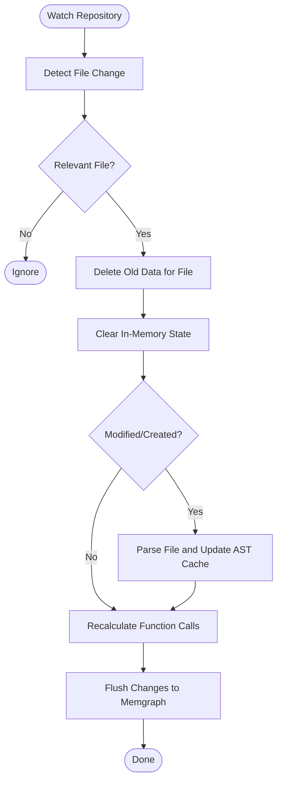
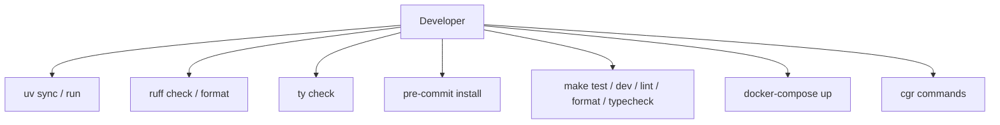
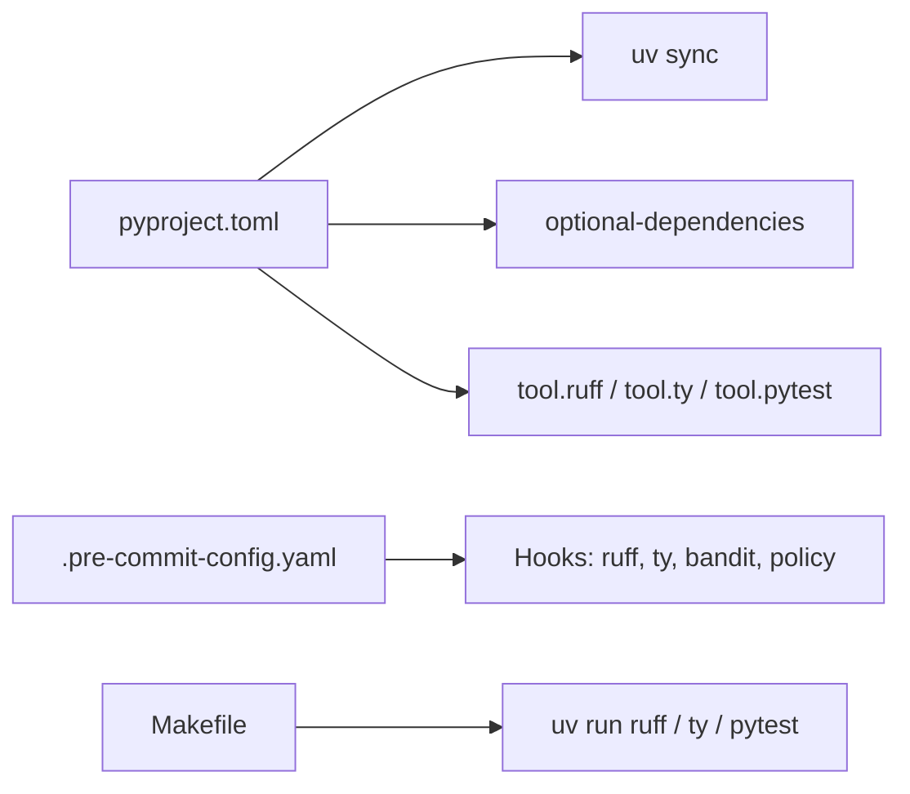

# Getting Started

<cite>
**Referenced Files in This Document**
- [README.md](file://README.md)
- [CONTRIBUTING.md](file://CONTRIBUTING.md)
- [QUICK_START.md](file://QUICK_START.md)
- [pyproject.toml](file://pyproject.toml)
- [Makefile](file://Makefile)
- [.pre-commit-config.yaml](file://.pre-commit-config.yaml)
- [docker-compose.yaml](file://docker-compose.yaml)
- [codebase_rag/cli.py](file://codebase_rag/cli.py)
- [codebase_rag/main.py](file://codebase_rag/main.py)
- [realtime_updater.py](file://realtime_updater.py)
- [scripts/hooks/generate-readme.sh](file://scripts/hooks/generate-readme.sh)
- [scripts/check_no_docs.py](file://scripts/check_no_docs.py)
</cite>

## Table of Contents
1. [Introduction](#introduction)
2. [Project Structure](#project-structure)
3. [Core Components](#core-components)
4. [Architecture Overview](#architecture-overview)
5. [Detailed Component Analysis](#detailed-component-analysis)
6. [Dependency Analysis](#dependency-analysis)
7. [Performance Considerations](#performance-considerations)
8. [Troubleshooting Guide](#troubleshooting-guide)
9. [Conclusion](#conclusion)
10. [Appendices](#appendices)

## Introduction
This guide helps new contributors set up a complete development environment for Graph-Code, understand the fork-and-branch workflow, configure development tools (uv, ruff, ty, pre-commit), and run the project locally. It also covers Makefile commands, testing, and troubleshooting common setup issues. The project emphasizes a welcoming and inclusive contributor experience.

## Project Structure
Graph-Code is a Python project with a CLI entrypoint, a modular codebase for parsing, indexing, querying, and editing code, and supporting infrastructure for Docker-based graph storage.

**Diagram sources**
- [codebase_rag/cli.py](file://codebase_rag/cli.py#L1-L395)
- [codebase_rag/main.py](file://codebase_rag/main.py#L1-L800)
- [realtime_updater.py](file://realtime_updater.py#L1-L184)
- [pyproject.toml](file://pyproject.toml#L1-L126)
- [Makefile](file://Makefile#L1-L80)
- [.pre-commit-config.yaml](file://.pre-commit-config.yaml#L1-L61)
- [docker-compose.yaml](file://docker-compose.yaml#L1-L13)

**Section sources**
- [README.md](file://README.md#L1-L120)
- [pyproject.toml](file://pyproject.toml#L1-L126)
- [Makefile](file://Makefile#L1-L80)

## Core Components
- CLI entrypoint: Provides commands for indexing, querying, exporting, optimizing, and MCP server integration.
- Main runtime: Manages interactive loops, tool orchestration, and Memgraph ingestion/export.
- Real-time updater: Watches repository changes and updates the graph incrementally.
- Configuration and environment: Managed via environment variables and pyproject configuration.

Key responsibilities:
- CLI: Exposes commands and options for developers and users.
- Main runtime: Initializes providers, runs agent loops, and coordinates tools.
- Real-time updater: Subscribes to filesystem events and triggers graph updates.

**Section sources**
- [codebase_rag/cli.py](file://codebase_rag/cli.py#L1-L395)
- [codebase_rag/main.py](file://codebase_rag/main.py#L1-L800)
- [realtime_updater.py](file://realtime_updater.py#L1-L184)

## Architecture Overview
The system integrates a CLI with an agent-driven workflow, parsing and indexing codebases, and a knowledge graph powered by Memgraph. Development tools enforce code quality and type safety.

```mermaid
sequenceDiagram
participant Dev as "Developer"
participant CLI as "CLI (cli.py)"
participant Main as "Runtime (main.py)"
participant MG as "Memgraph (docker-compose.yaml)"
Dev->>CLI : Run "cgr start" with options
CLI->>Main : Initialize session, load settings
Main->>MG : Connect and ensure constraints
Main->>Main : Parse and index codebase
Main-->>Dev : Interactive chat loop with agent
Dev->>Main : Optional export to JSON
Main->>MG : Export graph data
```

**Diagram sources**
- [codebase_rag/cli.py](file://codebase_rag/cli.py#L55-L172)
- [codebase_rag/main.py](file://codebase_rag/main.py#L737-L766)
- [docker-compose.yaml](file://docker-compose.yaml#L1-L13)

## Detailed Component Analysis

### Development Environment Setup
Follow these steps to prepare your environment:

1. Install prerequisites
   - Python 3.12+
   - Docker & Docker Compose
   - cmake (required for pymgclient)
   - ripgrep (rg) for shell command text searching)
   - uv package manager

2. Clone and install
   - Clone the repository and navigate into it.
   - Install dependencies:
     - Basic Python support: uv sync
     - Full multi-language support: uv sync --extra treesitter-full
     - Development (includes tests and pre-commit hooks): make dev

3. Configure environment variables
   - Copy .env.example to .env and customize provider settings for orchestrator and cypher models.

4. Start Memgraph
   - Use docker-compose to run Memgraph and Memgraph Lab.

5. Verify installation
   - Run make test or make test-parallel to ensure tests pass.

**Section sources**
- [README.md](file://README.md#L80-L220)
- [pyproject.toml](file://pyproject.toml#L1-L126)
- [Makefile](file://Makefile#L9-L19)
- [docker-compose.yaml](file://docker-compose.yaml#L1-L13)

### Fork-and-Branch Workflow
New contributors should:
1. Browse issues and pick one that interests you.
2. Comment on the issue to coordinate with maintainers.
3. Fork the repository and create a feature branch with a descriptive name (e.g., feat/add-feature or fix/bug-description).
4. Work locally, following code style and adding tests.
5. Run pre-commit checks and linters before committing.
6. Push your branch and open a pull request referencing the issue.

Automated checks enforced by pre-commit include:
- Trailing whitespace and end-of-file fixes
- YAML/TOML validation
- Ruff lint/format
- Type checking with ty
- Inline comment policy enforcement
- Commit message convention checks

**Section sources**
- [CONTRIBUTING.md](file://CONTRIBUTING.md#L5-L44)
- [.pre-commit-config.yaml](file://.pre-commit-config.yaml#L1-L61)

### Development Tools Setup
- uv: Package manager and dependency resolver. Use uv sync with extras and groups to manage dependencies.
- ruff: Linting and formatting. Use uv run ruff check and uv run ruff format.
- ty: Static type checker. Use uv run ty check.
- pre-commit: Enforce checks on commit. Install hooks with pre-commit install and pre-commit autoupdate.

Pre-commit hooks include:
- ruff and ruff-format
- ty type checking
- inline comment policy and module docstring checks
- conventional commit message validation

**Section sources**
- [CONTRIBUTING.md](file://CONTRIBUTING.md#L77-L96)
- [pyproject.toml](file://pyproject.toml#L63-L121)
- [.pre-commit-config.yaml](file://.pre-commit-config.yaml#L1-L61)

### Running the Development Environment
- Start Memgraph: docker-compose up -d
- Install dependencies: uv sync --extra treesitter-full --extra test --extra dev
- Install pre-commit hooks: pre-commit install
- Run tests: make test or make test-parallel
- Use Makefile commands for common tasks (install, dev, test, lint, format, typecheck, check, readme, watch)

Real-time graph updates:
- Use make watch REPO_PATH=/path/to/repo to continuously update the graph as you edit files.
- Alternatively, run python realtime_updater.py /path/to/repo in a separate terminal.

**Section sources**
- [docker-compose.yaml](file://docker-compose.yaml#L1-L13)
- [Makefile](file://Makefile#L1-L80)
- [realtime_updater.py](file://realtime_updater.py#L114-L150)

### CLI Usage and Commands
The CLI exposes several commands:
- start: Parse and index a repository, optionally update the graph and export to JSON.
- index: Build a protobuf index for a repository.
- export: Export the current graph to a JSON file.
- optimize: Run AI-powered optimization for a specific language.
- mcp-server: Start the MCP server for integration with Claude Code.
- graph-loader: Load and summarize a previously exported graph file.
- language: Manage language grammars (add/remove/list).

Options include model overrides (--orchestrator, --cypher), batch sizing (--batch-size), exclusion patterns (--exclude), and interactive setup prompts.

**Section sources**
- [codebase_rag/cli.py](file://codebase_rag/cli.py#L55-L391)
- [codebase_rag/main.py](file://codebase_rag/main.py#L737-L766)

### Real-Time Graph Updates
The realtime updater watches a repository for file changes and updates the knowledge graph accordingly. It deletes outdated data for affected files, rebuilds in-memory state, recalculates function call relationships across the codebase, and flushes changes to Memgraph.

**Diagram sources**
- [realtime_updater.py](file://realtime_updater.py#L34-L112)

**Section sources**
- [realtime_updater.py](file://realtime_updater.py#L1-L184)

### Conceptual Overview
The development workflow integrates dependency management, code quality, testing, and graph operations. Contributors use uv for package management, ruff and ty for code quality/type safety, pre-commit for automated checks, and Makefile for streamlined tasks.

[No sources needed since this diagram shows conceptual workflow, not actual code structure]

## Dependency Analysis
The project uses uv for dependency resolution and grouping, with optional extras for full language support and development tools. Pre-commit enforces linting, formatting, type checking, and policy compliance.

**Diagram sources**
- [pyproject.toml](file://pyproject.toml#L1-L126)
- [.pre-commit-config.yaml](file://.pre-commit-config.yaml#L1-L61)
- [Makefile](file://Makefile#L69-L78)

**Section sources**
- [pyproject.toml](file://pyproject.toml#L1-L126)
- [.pre-commit-config.yaml](file://.pre-commit-config.yaml#L1-L61)
- [Makefile](file://Makefile#L69-L78)

## Performance Considerations
- Use make test-parallel and pytest-xdist to speed up unit tests.
- Adjust batch-size for Memgraph operations to balance throughput and stability.
- Real-time updates recalculate function call relationships on every change to prevent “islands” but may impact performance on large codebases with frequent changes.

[No sources needed since this section provides general guidance]

## Troubleshooting Guide
Common setup issues and resolutions:
- Docker connectivity: Ensure Docker and Docker Compose are installed and running. Verify ports 7687 and 7444 are available.
- Python version: Confirm Python 3.12+ is installed and uv recognizes the version.
- cmake and ripgrep: Install cmake and ripgrep per OS-specific instructions in the README.
- Pre-commit failures: Address ruff formatting issues and inline comment policy violations flagged by pre-commit hooks.
- Type checking errors: Run uv run ty check and fix reported type issues.
- Commit message errors: Follow conventional commit format enforced by pre-commit.

**Section sources**
- [README.md](file://README.md#L90-L120)
- [.pre-commit-config.yaml](file://.pre-commit-config.yaml#L42-L61)
- [CONTRIBUTING.md](file://CONTRIBUTING.md#L719-L735)

## Conclusion
You are now equipped to set up the Graph-Code development environment, follow the fork-and-branch workflow, configure development tools, run the project locally, and troubleshoot common issues. The project’s contributor guidelines emphasize inclusivity, automated quality checks, and a welcoming experience for all participants.

## Appendices

### Makefile Commands
- make help: Show available targets
- make all: Install everything for full development environment
- make install: Install dependencies with full language support
- make dev: Setup development environment (deps + pre-commit hooks)
- make test / test-parallel: Run unit tests
- make test-integration / test-all / test-parallel-all: Run integration and end-to-end tests
- make clean: Clean build artifacts and caches
- make build-grammars: Build grammar submodules
- make watch: Watch repository and update graph in real-time
- make readme: Regenerate README.md from codebase
- make lint / format / typecheck / check: Run linters, formatter, type checker, and combined checks

**Section sources**
- [Makefile](file://Makefile#L1-L80)

### Quick Start Integration
For a production-ready integration example, refer to the unified integration quick start guide and its included examples.

**Section sources**
- [QUICK_START.md](file://QUICK_START.md#L1-L118)