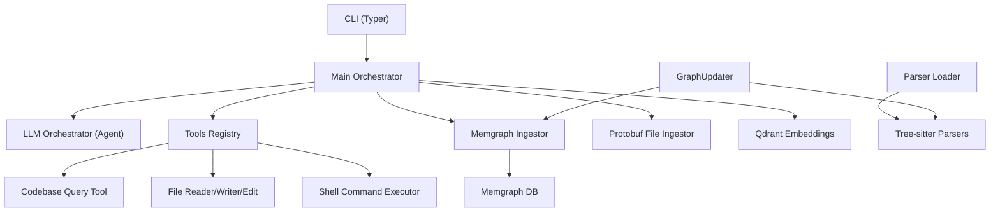
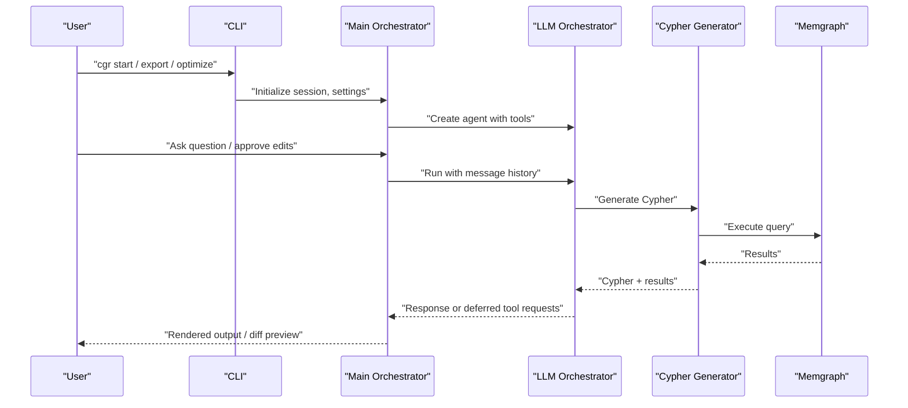

# Best Practices and Guidelines

<cite>
**Referenced Files in This Document**
- [README.md](file://README.md)
- [main.py](file://codebase_rag/main.py)
- [cli.py](file://codebase_rag/cli.py)
- [config.py](file://codebase_rag/config.py)
- [constants.py](file://codebase_rag/constants.py)
- [types_defs.py](file://codebase_rag/types_defs.py)
- [graph_service.py](file://codebase_rag/services/graph_service.py)
- [llm.py](file://codebase_rag/services/llm.py)
- [protobuf_service.py](file://codebase_rag/services/protobuf_service.py)
- [vector_store.py](file://codebase_rag/vector_store.py)
- [graph_updater.py](file://codebase_rag/graph_updater.py)
- [parser_loader.py](file://codebase_rag/parser_loader.py)
- [schema_builder.py](file://codebase_rag/schema_builder.py)
- [codebase_query.py](file://codebase_rag/tools/codebase_query.py)
- [factory.py](file://codebase_rag/parsers/factory.py)
</cite>

## Table of Contents
1. [Introduction](#introduction)
2. [Project Structure](#project-structure)
3. [Core Components](#core-components)
4. [Architecture Overview](#architecture-overview)
5. [Detailed Component Analysis](#detailed-component-analysis)
6. [Dependency Analysis](#dependency-analysis)
7. [Performance Considerations](#performance-considerations)
8. [Troubleshooting Guide](#troubleshooting-guide)
9. [Conclusion](#conclusion)
10. [Appendices](#appendices)

## Introduction
This document consolidates best practices and guidelines for effectively using Graph-Code across diverse scenarios and environments. It focuses on codebase organization, file structure, naming conventions, configuration tuning, collaboration workflows, security, scalability, maintenance, customization, and responsible AI usage. The guidance is grounded in the repository’s implementation and documented behaviors.

## Project Structure
Graph-Code is organized around a CLI-driven workflow with modular components:
- CLI entrypoints and commands orchestrate ingestion, querying, exporting, optimization, and MCP server mode.
- A multi-language parsing pipeline integrates Tree-sitter grammars and language-specific processors.
- A knowledge graph is persisted in Memgraph with batching and constraint enforcement.
- Optional semantic embeddings are stored in Qdrant for advanced retrieval.
- Tools enable natural language querying, file operations, and safe editing with approvals.



**Diagram sources**
- [cli.py](file://codebase_rag/cli.py#L1-L395)
- [main.py](file://codebase_rag/main.py#L1-L800)
- [graph_service.py](file://codebase_rag/services/graph_service.py#L1-L364)
- [protobuf_service.py](file://codebase_rag/services/protobuf_service.py#L1-L178)
- [vector_store.py](file://codebase_rag/vector_store.py#L1-L81)
- [parser_loader.py](file://codebase_rag/parser_loader.py#L1-L293)
- [graph_updater.py](file://codebase_rag/graph_updater.py#L1-L469)

**Section sources**
- [README.md](file://README.md#L72-L136)
- [cli.py](file://codebase_rag/cli.py#L1-L395)
- [main.py](file://codebase_rag/main.py#L1-L800)

## Core Components
- CLI and Commands: Centralized via Typer with commands for start, export, optimize, index, and MCP server. Supports runtime overrides for models, batch sizes, and exclusions.
- Main Orchestrator: Manages sessions, approvals, tool invocation, and agent loops with timeouts and cancellation.
- Configuration: Environment-driven settings for providers, Memgraph, shell allowlists, caching, and embeddings.
- Graph Service: Batches node and relationship writes, enforces unique constraints, and exports graph data.
- LLM Orchestrator: Creates agents for natural language to Cypher generation and general orchestration with retries.
- Vector Store: Optional semantic storage and retrieval using Qdrant.
- Parser Loader and GraphUpdater: Dynamic loading of Tree-sitter grammars, language-specific queries, and incremental graph construction.

**Section sources**
- [cli.py](file://codebase_rag/cli.py#L1-L395)
- [main.py](file://codebase_rag/main.py#L1-L800)
- [config.py](file://codebase_rag/config.py#L1-L274)
- [graph_service.py](file://codebase_rag/services/graph_service.py#L1-L364)
- [llm.py](file://codebase_rag/services/llm.py#L1-L93)
- [vector_store.py](file://codebase_rag/vector_store.py#L1-L81)
- [parser_loader.py](file://codebase_rag/parser_loader.py#L1-L293)
- [graph_updater.py](file://codebase_rag/graph_updater.py#L1-L469)

## Architecture Overview
The system comprises:
- Ingestion Pipeline: CLI → GraphUpdater → Parser Loader → Parsers → Graph Service
- Query Pipeline: CLI → Main Orchestrator → LLM Cypher Generator → Graph Service
- Export/Protobuf Pipeline: CLI → Protobuf File Ingestor
- Optional Embeddings: GraphUpdater → Vector Store



**Diagram sources**
- [cli.py](file://codebase_rag/cli.py#L1-L395)
- [main.py](file://codebase_rag/main.py#L1-L800)
- [llm.py](file://codebase_rag/services/llm.py#L1-L93)
- [codebase_query.py](file://codebase_rag/tools/codebase_query.py#L1-L95)
- [graph_service.py](file://codebase_rag/services/graph_service.py#L1-L364)

## Detailed Component Analysis

### CLI and Command Patterns
- Use explicit model overrides and batch sizing for predictable performance.
- Prefer export with JSON for reproducibility and downstream analysis.
- Combine interactive setup with .cgrignore for fine-grained exclusions.

Recommended patterns:
- Start with explicit providers and models for reproducibility.
- Use batch-size to tune throughput vs. latency.
- Use export for deterministic graph snapshots.

**Section sources**
- [cli.py](file://codebase_rag/cli.py#L55-L172)
- [cli.py](file://codebase_rag/cli.py#L237-L271)
- [cli.py](file://codebase_rag/cli.py#L273-L330)
- [config.py](file://codebase_rag/config.py#L227-L231)

### Main Orchestrator and Agent Loop
- Approvals gate risky actions (edits, shell commands).
- Multiline input with keybindings; cancellation and timeouts supported.
- Session logs capture conversation context for continuity.

Recommended patterns:
- Keep edit confirmation enabled for safety.
- Use “/model” to dynamically switch models mid-session.
- Use “/help” to discover commands.

**Section sources**
- [main.py](file://codebase_rag/main.py#L387-L438)
- [main.py](file://codebase_rag/main.py#L497-L533)
- [main.py](file://codebase_rag/main.py#L604-L680)
- [main.py](file://codebase_rag/main.py#L681-L694)

### Configuration and Environment Management
- Provider settings for orchestrator and Cypher models are independent and environment-driven.
- Memgraph batch size controls write throughput.
- Shell allowlists restrict potentially destructive commands.
- Caching limits protect memory usage.

Recommended patterns:
- Separate environment files per deployment tier.
- Pin provider/model versions in CI.
- Tune MEMGRAPH_BATCH_SIZE and cache limits for workload.

**Section sources**
- [config.py](file://codebase_rag/config.py#L39-L234)
- [constants.py](file://codebase_rag/constants.py#L50-L125)

### Graph Service and Batching
- Buffered node and relationship writes with constraint enforcement.
- Batch flushing reduces round-trips; failures logged with truncated params for inspection.
- Export produces JSON with metadata for auditing.

Recommended patterns:
- Increase batch size for large repos; monitor Memgraph health.
- Ensure unique constraints exist prior to ingestion.
- Use export for post-mortem analysis.

**Section sources**
- [graph_service.py](file://codebase_rag/services/graph_service.py#L49-L364)
- [constants.py](file://codebase_rag/constants.py#L311-L351)

### LLM Orchestrator and Cypher Generation
- Agents encapsulate retries and tool orchestration.
- Cypher generator cleans and validates generated queries.
- System prompts differ for local vs. cloud providers.

Recommended patterns:
- Use local models for privacy-sensitive contexts.
- Validate Cypher outputs before execution.
- Adjust retries for stability under load.

**Section sources**
- [llm.py](file://codebase_rag/services/llm.py#L37-L93)
- [constants.py](file://codebase_rag/constants.py#L12-L22)

### Vector Store and Semantic Embeddings
- Optional semantic embeddings stored in Qdrant with configurable dimensions and top-K.
- Embeddings generated from function nodes; progress intervals reduce noise.

Recommended patterns:
- Enable only when downstream consumers require semantic search.
- Monitor disk usage and tune collection size.

**Section sources**
- [vector_store.py](file://codebase_rag/vector_store.py#L1-L81)
- [graph_updater.py](file://codebase_rag/graph_updater.py#L356-L419)

### Parser Loader and Language Support
- Dynamic loading of Tree-sitter grammars from submodules or installed packages.
- Language-specific queries constructed from node type specs.

Recommended patterns:
- Keep grammars updated; rebuild bindings when necessary.
- Validate language specs for new languages.

**Section sources**
- [parser_loader.py](file://codebase_rag/parser_loader.py#L1-L293)
- [constants.py](file://codebase_rag/constants.py#L426-L507)

### GraphUpdater and Incremental Processing
- Two-phase processing: structure identification, file processing, call resolution.
- Bounded AST cache with eviction policies.
- Optional semantic embedding generation.

Recommended patterns:
- Use bounded caches for large codebases.
- Re-run call processing after structural changes.

**Section sources**
- [graph_updater.py](file://codebase_rag/graph_updater.py#L223-L469)
- [constants.py](file://codebase_rag/constants.py#L383-L385)

### Protobuf Export
- Joint or split index modes for interoperability.
- Oneof mapping ensures correct node payloads.

Recommended patterns:
- Use split index for large-scale distribution.
- Validate oneof mappings when extending schema.

**Section sources**
- [protobuf_service.py](file://codebase_rag/services/protobuf_service.py#L1-L178)
- [constants.py](file://codebase_rag/constants.py#L191-L208)

### Tools and Safety
- Query tool renders tabular results; errors surfaced with context.
- File editor and shell command tools gated by approvals and allowlists.

Recommended patterns:
- Review diffs before approving edits.
- Limit shell commands to allowlisted operations.

**Section sources**
- [codebase_query.py](file://codebase_rag/tools/codebase_query.py#L1-L95)
- [constants.py](file://codebase_rag/constants.py#L82-L142)

### Codebase Organization and Naming Conventions
- Feature-based grouping: parsers, services, tools, utils.
- Clear separation of concerns: CLI, orchestration, ingestion, querying, export.
- Consistent naming for node labels, relationships, and typed dictionaries.

Recommended patterns:
- Group language-specific processors under parsers/<lang>.
- Use descriptive tool names and schemas.
- Keep constants centralized in constants.py and types_defs.py.

**Section sources**
- [constants.py](file://codebase_rag/constants.py#L311-L554)
- [types_defs.py](file://codebase_rag/types_defs.py#L1-L555)

## Dependency Analysis
```mermaid
graph TB
subgraph "CLI Layer"
CLI["cli.py"]
end
subgraph "Runtime"
MAIN["main.py"]
CFG["config.py"]
CONS["constants.py"]
TYPES["types_defs.py"]
end
subgraph "Parsers"
PARSER["parser_loader.py"]
FACT["parsers/factory.py"]
end
subgraph "Ingestion"
UPD["graph_updater.py"]
GSERV["services/graph_service.py"]
PB["services/protobuf_service.py"]
end
subgraph "LLM"
LLM["services/llm.py"]
TOOLQ["tools/codebase_query.py"]
end
subgraph "Embeddings"
VEC["vector_store.py"]
end
CLI --> MAIN
MAIN --> CFG
MAIN --> CONS
MAIN --> TYPES
MAIN --> LLM
MAIN --> TOOLQ
MAIN --> GSERV
MAIN --> PB
MAIN --> VEC
PARSER --> FACT
UPD --> FACT
UPD --> GSERV
UPD --> VEC
```

**Diagram sources**
- [cli.py](file://codebase_rag/cli.py#L1-L395)
- [main.py](file://codebase_rag/main.py#L1-L800)
- [config.py](file://codebase_rag/config.py#L1-L274)
- [constants.py](file://codebase_rag/constants.py#L1-L800)
- [types_defs.py](file://codebase_rag/types_defs.py#L1-L555)
- [parser_loader.py](file://codebase_rag/parser_loader.py#L1-L293)
- [factory.py](file://codebase_rag/parsers/factory.py#L1-L116)
- [graph_updater.py](file://codebase_rag/graph_updater.py#L1-L469)
- [graph_service.py](file://codebase_rag/services/graph_service.py#L1-L364)
- [protobuf_service.py](file://codebase_rag/services/protobuf_service.py#L1-L178)
- [llm.py](file://codebase_rag/services/llm.py#L1-L93)
- [codebase_query.py](file://codebase_rag/tools/codebase_query.py#L1-L95)
- [vector_store.py](file://codebase_rag/vector_store.py#L1-L81)

**Section sources**
- [cli.py](file://codebase_rag/cli.py#L1-L395)
- [main.py](file://codebase_rag/main.py#L1-L800)
- [graph_updater.py](file://codebase_rag/graph_updater.py#L1-L469)

## Performance Considerations
- Memory and CPU
  - Use bounded AST cache with eviction thresholds to cap memory usage.
  - Tune cache max entries and memory thresholds for large repositories.
- Database throughput
  - Increase Memgraph batch size for bulk ingestion; validate with health checks.
  - Enforce unique constraints before ingestion to avoid conflicts.
- Network and model latency
  - Adjust agent retries and output retries for stability.
  - Prefer local models for low-latency, privacy-preserving workflows.
- Semantic search
  - Enable embeddings only when needed; tune top-K and vector dimensions.

**Section sources**
- [graph_updater.py](file://codebase_rag/graph_updater.py#L162-L221)
- [config.py](file://codebase_rag/config.py#L151-L155)
- [config.py](file://codebase_rag/config.py#L54-L56)
- [config.py](file://codebase_rag/config.py#L227-L231)
- [vector_store.py](file://codebase_rag/vector_store.py#L1-L81)

## Troubleshooting Guide
- Ingestion stalls or slow writes
  - Reduce batch size or increase Memgraph resources.
  - Verify unique constraints are created before writing.
- Cypher generation failures
  - Inspect cleaned query and ensure keywords are present.
  - Retry with adjusted system prompts.
- Tool approvals and diffs
  - Review unified diffs before approving edits.
  - Use interactive setup to refine exclusions.
- Shell command errors
  - Confirm command is in allowlist; check read-only vs. write operations.
- Export issues
  - Ensure JSON format is used; inspect truncated batch params on failure.

**Section sources**
- [graph_service.py](file://codebase_rag/services/graph_service.py#L124-L164)
- [llm.py](file://codebase_rag/services/llm.py#L58-L76)
- [main.py](file://codebase_rag/main.py#L183-L216)
- [constants.py](file://codebase_rag/constants.py#L114-L142)
- [cli.py](file://codebase_rag/cli.py#L237-L271)

## Conclusion
By adhering to the recommended patterns—explicit configuration, cautious approvals, batching tuned to workload, and optional semantic enhancements—you can achieve reliable, secure, and scalable Graph-Code deployments. The modular architecture supports customization across domains and teams while maintaining operational safety and performance.

## Appendices

### Recommended Configuration Settings
- Providers and models
  - Set ORCHESTRATOR_* and CYPHER_* consistently in environment files.
  - Use provider:model notation for dynamic switching.
- Memgraph and batching
  - Adjust MEMGRAPH_BATCH_SIZE for throughput; validate with real loads.
- Shell and safety
  - Keep shell allowlists strict; leverage read-only defaults.
- Caching and memory
  - Tune CACHE_MAX_ENTRIES and CACHE_MAX_MEMORY_MB for large repos.

**Section sources**
- [config.py](file://codebase_rag/config.py#L39-L234)
- [constants.py](file://codebase_rag/constants.py#L114-L142)

### Team Collaboration Guidelines
- Code reviews
  - Require approvals for edits and shell commands; maintain diffs.
- Documentation
  - Keep README and schema documentation updated; use schema builder outputs.
- Knowledge sharing
  - Use export to share graph snapshots; integrate with CI for audits.

**Section sources**
- [schema_builder.py](file://codebase_rag/schema_builder.py#L1-L42)
- [README.md](file://README.md#L551-L615)

### Security Best Practices
- Access control
  - Restrict shell commands to allowlisted operations; prefer read-only defaults.
- Data protection
  - Use local models for sensitive environments; avoid exposing API keys.
- Audit logging
  - Utilize session logs and structured logs for traceability.

**Section sources**
- [constants.py](file://codebase_rag/constants.py#L82-L142)
- [main.py](file://codebase_rag/main.py#L87-L109)

### Scaling Graph-Code Deployments
- Load balancing
  - Run multiple instances behind a reverse proxy; persist Memgraph externally.
- Database optimization
  - Monitor batch sizes and constraint creation; scale Memgraph horizontally.
- Resource management
  - Use bounded caches; offload embeddings to dedicated storage.

**Section sources**
- [graph_service.py](file://codebase_rag/services/graph_service.py#L49-L83)
- [graph_updater.py](file://codebase_rag/graph_updater.py#L162-L221)

### Maintenance and Customization
- Regular updates
  - Update Tree-sitter grammars; rebuild bindings; validate parsers.
- Monitoring
  - Track ingestion progress, embedding generation, and export stats.
- Customization
  - Extend language specs and processors; add new tools with typed schemas.

**Section sources**
- [parser_loader.py](file://codebase_rag/parser_loader.py#L1-L293)
- [graph_updater.py](file://codebase_rag/graph_updater.py#L356-L419)
- [types_defs.py](file://codebase_rag/types_defs.py#L343-L421)

### Ethical Considerations and Responsible AI
- Transparency
  - Log model usage and query generations; document prompts.
- Fairness and bias mitigation
  - Diversify training data and prompts; validate outputs.
- Privacy
  - Prefer local models; avoid transmitting sensitive code to external APIs.
- Accountability
  - Require approvals for edits; maintain audit trails.

[No sources needed since this section provides general guidance]