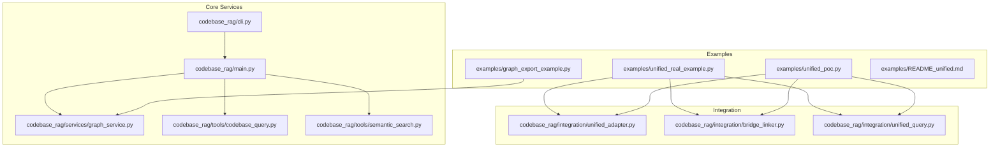
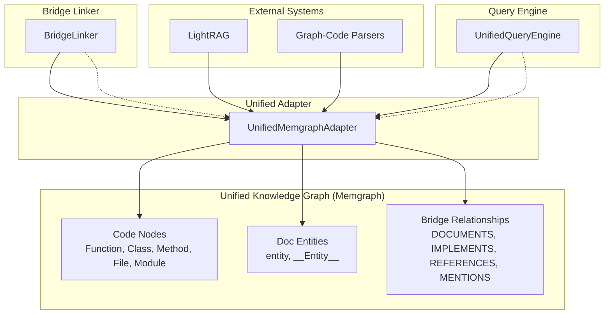
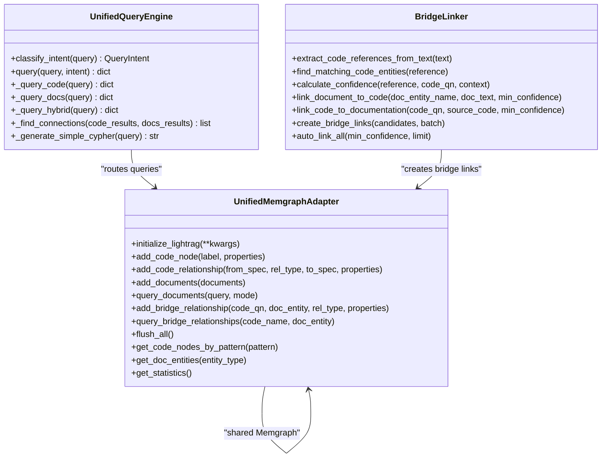
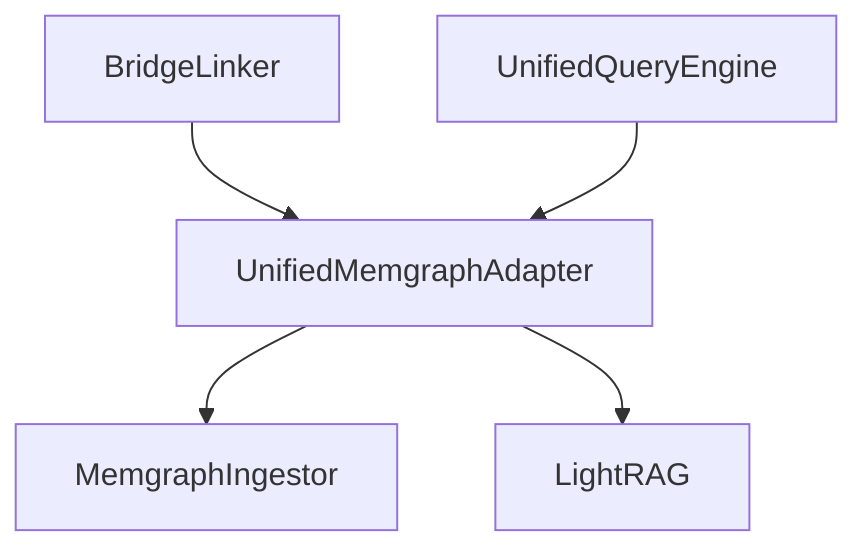

# Examples and Tutorials

<cite>
**Referenced Files in This Document**
- [README.md](file://README.md)
- [QUICK_START.md](file://QUICK_START.md)
- [examples/README_unified.md](file://examples/README_unified.md)
- [examples/unified_poc.py](file://examples/unified_poc.py)
- [examples/unified_real_example.py](file://examples/unified_real_example.py)
- [examples/graph_export_example.py](file://examples/graph_export_example.py)
- [codebase_rag/cli.py](file://codebase_rag/cli.py)
- [codebase_rag/main.py](file://codebase_rag/main.py)
- [codebase_rag/services/graph_service.py](file://codebase_rag/services/graph_service.py)
- [codebase_rag/tools/codebase_query.py](file://codebase_rag/tools/codebase_query.py)
- [codebase_rag/tools/semantic_search.py](file://codebase_rag/tools/semantic_search.py)
- [codebase_rag/integration/unified_adapter.py](file://codebase_rag/integration/unified_adapter.py)
- [codebase_rag/integration/bridge_linker.py](file://codebase_rag/integration/bridge_linker.py)
- [codebase_rag/integration/unified_query.py](file://codebase_rag/integration/unified_query.py)
</cite>

## Table of Contents
1. [Introduction](#introduction)
2. [Project Structure](#project-structure)
3. [Core Components](#core-components)
4. [Architecture Overview](#architecture-overview)
5. [Detailed Component Analysis](#detailed-component-analysis)
6. [Dependency Analysis](#dependency-analysis)
7. [Performance Considerations](#performance-considerations)
8. [Troubleshooting Guide](#troubleshooting-guide)
9. [Conclusion](#conclusion)
10. [Appendices](#appendices)

## Introduction
This document provides comprehensive examples and tutorials for Graph-Code, focusing on practical usage demonstrations, unified integration patterns, and real-world workflows. It covers:
- Unified integration of Graph-Code with LightRAG for a combined code and documentation knowledge system
- Step-by-step tutorials for codebase analysis, natural language querying, and AI-powered optimization
- Integration guidance for connecting Graph-Code with development tools and workflows
- Best practices for enterprise, open-source, and educational use cases
- Troubleshooting and performance optimization strategies
- Guidance on adapting examples for specific project requirements

## Project Structure
The repository organizes core functionality under codebase_rag and provides example scripts under examples. The unified integration lives under codebase_rag/integration and is demonstrated by example scripts.

**Diagram sources**
- [examples/unified_poc.py](file://examples/unified_poc.py#L1-L343)
- [examples/unified_real_example.py](file://examples/unified_real_example.py#L1-L270)
- [examples/graph_export_example.py](file://examples/graph_export_example.py#L1-L101)
- [codebase_rag/integration/unified_adapter.py](file://codebase_rag/integration/unified_adapter.py#L1-L384)
- [codebase_rag/integration/bridge_linker.py](file://codebase_rag/integration/bridge_linker.py#L1-L479)
- [codebase_rag/integration/unified_query.py](file://codebase_rag/integration/unified_query.py#L1-L376)
- [codebase_rag/cli.py](file://codebase_rag/cli.py#L1-L395)
- [codebase_rag/main.py](file://codebase_rag/main.py#L1-L800)
- [codebase_rag/services/graph_service.py](file://codebase_rag/services/graph_service.py#L1-L364)
- [codebase_rag/tools/codebase_query.py](file://codebase_rag/tools/codebase_query.py#L1-L95)
- [codebase_rag/tools/semantic_search.py](file://codebase_rag/tools/semantic_search.py#L1-L157)

**Section sources**
- [README.md](file://README.md#L1-L886)
- [QUICK_START.md](file://QUICK_START.md#L1-L118)
- [examples/README_unified.md](file://examples/README_unified.md#L1-L379)

## Core Components
This section highlights the key components used in unified integration and practical examples.

- UnifiedMemgraphAdapter: Bridges Graph-Code’s synchronous MemgraphIngestor with LightRAG’s asynchronous storage, enabling unified code and documentation ingestion and querying.
- BridgeLinker: Automatically connects code entities to documentation using pattern-based extraction and confidence scoring.
- UnifiedQueryEngine: Classifies user intent (code/docs/hybrid) and routes queries accordingly, merging results when needed.
- CLI and Main: Provide the interactive RAG CLI, orchestration, and tool integrations for querying, semantic search, and optimization.
- GraphService: Low-level Memgraph operations including batching, constraint enforcement, and graph export.

**Section sources**
- [codebase_rag/integration/unified_adapter.py](file://codebase_rag/integration/unified_adapter.py#L1-L384)
- [codebase_rag/integration/bridge_linker.py](file://codebase_rag/integration/bridge_linker.py#L1-L479)
- [codebase_rag/integration/unified_query.py](file://codebase_rag/integration/unified_query.py#L1-L376)
- [codebase_rag/cli.py](file://codebase_rag/cli.py#L1-L395)
- [codebase_rag/main.py](file://codebase_rag/main.py#L1-L800)
- [codebase_rag/services/graph_service.py](file://codebase_rag/services/graph_service.py#L1-L364)

## Architecture Overview
The unified integration architecture connects Graph-Code and LightRAG via a shared Memgraph instance. Code entities (Functions, Classes, etc.) and documentation entities (LightRAG “entity” nodes) coexist with bridge relationships that connect them.

**Diagram sources**
- [codebase_rag/integration/unified_adapter.py](file://codebase_rag/integration/unified_adapter.py#L1-L384)
- [codebase_rag/integration/bridge_linker.py](file://codebase_rag/integration/bridge_linker.py#L1-L479)
- [codebase_rag/integration/unified_query.py](file://codebase_rag/integration/unified_query.py#L1-L376)

## Detailed Component Analysis

### Unified Integration Components
This section explains the three core modules of the unified integration and how they work together.

- UnifiedMemgraphAdapter
  - Purpose: Provide unified access to both Graph-Code and LightRAG using a single Memgraph instance.
  - Key capabilities:
    - Code node ingestion and relationship management
    - LightRAG initialization and document ingestion
    - Bridge relationship creation and querying
    - Statistics and utility functions
  - Typical usage:
    - Initialize adapter with host/port/batch size
    - Initialize LightRAG asynchronously
    - Ingest code nodes and relationships
    - Ingest documents and create bridge relationships
    - Query via UnifiedQueryEngine

- BridgeLinker
  - Purpose: Automatically link code and documentation using pattern-based extraction and confidence scoring.
  - Key capabilities:
    - Extract references from documentation text
    - Match references to code entities
    - Calculate confidence and generate candidates
    - Create bridge relationships with properties (type, confidence, evidence)
    - Auto-link across large codebases with limits and thresholds

- UnifiedQueryEngine
  - Purpose: Route queries to the appropriate system (code, docs, or hybrid) and merge results.
  - Key capabilities:
    - Intent classification (code/docs/hybrid) using keyword patterns
    - Parallel execution for hybrid mode
    - Connection discovery between code and documentation results
    - Fallback Cypher generation for code queries

**Diagram sources**
- [codebase_rag/integration/unified_adapter.py](file://codebase_rag/integration/unified_adapter.py#L1-L384)
- [codebase_rag/integration/bridge_linker.py](file://codebase_rag/integration/bridge_linker.py#L1-L479)
- [codebase_rag/integration/unified_query.py](file://codebase_rag/integration/unified_query.py#L1-L376)

**Section sources**
- [codebase_rag/integration/unified_adapter.py](file://codebase_rag/integration/unified_adapter.py#L1-L384)
- [codebase_rag/integration/bridge_linker.py](file://codebase_rag/integration/bridge_linker.py#L1-L479)
- [codebase_rag/integration/unified_query.py](file://codebase_rag/integration/unified_query.py#L1-L376)

### Practical Tutorials

#### Tutorial 1: Unified Proof-of-Concept
Goal: Demonstrate end-to-end unified integration with sample data.

Steps:
1. Start Memgraph locally
2. Install dependencies (Graph-Code core and LightRAG)
3. Run the PoC example to:
   - Initialize the adapter and LightRAG
   - Ingest sample code nodes and relationships
   - Ingest sample documentation
   - Create bridge relationships (manual or auto-linked)
   - Query the unified graph (code, docs, hybrid)
   - Inspect statistics and bridge relationships

Expected outcomes:
- Successful initialization of both systems
- Ingestion of code and docs into the unified graph
- Creation of bridge relationships
- Query results categorized by intent with merged connections in hybrid mode

**Section sources**
- [QUICK_START.md](file://QUICK_START.md#L1-L118)
- [examples/unified_poc.py](file://examples/unified_poc.py#L1-L343)
- [examples/README_unified.md](file://examples/README_unified.md#L139-L163)

#### Tutorial 2: Real-World Integration
Goal: Integrate with an actual codebase and documentation.

Steps:
1. Prepare paths for the codebase and documentation
2. Initialize the adapter and LightRAG
3. Ingest the codebase using Graph-Code parsers
4. Ingest documentation files (MD, RST, TXT)
5. Auto-link code to documentation with confidence thresholds
6. Query for comprehensive understanding (code, docs, hybrid)
7. Inspect statistics and bridge examples

Expected outcomes:
- Real codebase parsed and ingested
- Documentation ingested and linked to relevant code entities
- Query results enriched by bridge connections
- Useful statistics for graph insights

**Section sources**
- [examples/unified_real_example.py](file://examples/unified_real_example.py#L1-L270)
- [examples/README_unified.md](file://examples/README_unified.md#L164-L185)

#### Tutorial 3: Codebase Analysis and Natural Language Querying
Goal: Use Graph-Code CLI and tools for analysis and querying.

Steps:
1. Parse and ingest a repository into the knowledge graph
2. Start the interactive RAG CLI
3. Use natural language queries to explore code structure and relationships
4. Utilize semantic search for function discovery by intent
5. Export the graph for programmatic analysis

Expected outcomes:
- Knowledge graph populated with code entities and relationships
- Interactive CLI responding to natural language queries
- Semantic search results for functions by purpose
- Exported graph data for downstream analysis

**Section sources**
- [README.md](file://README.md#L250-L425)
- [codebase_rag/tools/codebase_query.py](file://codebase_rag/tools/codebase_query.py#L1-L95)
- [codebase_rag/tools/semantic_search.py](file://codebase_rag/tools/semantic_search.py#L1-L157)
- [codebase_rag/cli.py](file://codebase_rag/cli.py#L1-L395)

#### Tutorial 4: AI-Powered Optimization
Goal: Apply AI-driven optimization suggestions tailored to a specific language and optionally guided by reference documents.

Steps:
1. Choose a language and repository path
2. Optionally provide a reference document (coding standards, best practices)
3. Start the optimization session
4. Review suggestions and approve changes
5. Implement approved optimizations with explanations

Expected outcomes:
- Optimization session initiated with language-specific guidance
- Suggestions aligned with reference documents when provided
- Interactive approval and implementation workflow

**Section sources**
- [README.md](file://README.md#L426-L501)
- [codebase_rag/main.py](file://codebase_rag/main.py#L317-L355)

#### Tutorial 5: Graph Export and Programmatic Analysis
Goal: Export the knowledge graph and analyze it programmatically.

Steps:
1. Export the graph to JSON using the CLI or service
2. Load the exported graph
3. Inspect summaries, node/relationship types, and example nodes
4. Perform custom analyses and integrations

Expected outcomes:
- Exported graph JSON with metadata and counts
- Programmatic access to graph statistics and nodes
- Foundation for custom tooling and dashboards

**Section sources**
- [README.md](file://README.md#L374-L425)
- [examples/graph_export_example.py](file://examples/graph_export_example.py#L1-L101)

### Integration Tutorials

#### Integrating with Development Tools and Workflows
- MCP Server: Run Graph-Code as an MCP server to integrate with Claude Code and other MCP clients. Use the MCP server command and configure environment variables for providers and models.
- Real-time updates: Keep the knowledge graph synchronized with active development using the realtime updater for continuous ingestion and relationship recalculations.

**Section sources**
- [README.md](file://README.md#L509-L550)
- [README.md](file://README.md#L290-L331)
- [codebase_rag/cli.py](file://codebase_rag/cli.py#L332-L350)

#### Best Practices by Use Case
- Enterprise development:
  - Centralized Memgraph deployment with controlled batch sizes
  - Provider configuration for cloud or local models
  - Real-time graph updates during active development
  - Reference-guided optimization sessions
- Open-source contribution:
  - Use the CLI for quick parsing and querying
  - Export graphs for documentation generators and metrics dashboards
  - Leverage semantic search for contributor onboarding
- Educational applications:
  - Unified integration for teaching code and documentation relationships
  - Interactive CLI for exploring codebases and answering student questions

**Section sources**
- [README.md](file://README.md#L110-L247)
- [README.md](file://README.md#L426-L501)
- [examples/README_unified.md](file://examples/README_unified.md#L360-L375)

## Dependency Analysis
The unified integration relies on shared dependencies and clear separation of concerns between adapters, linkers, and query engines.

**Diagram sources**
- [codebase_rag/integration/unified_adapter.py](file://codebase_rag/integration/unified_adapter.py#L1-L384)
- [codebase_rag/integration/bridge_linker.py](file://codebase_rag/integration/bridge_linker.py#L1-L479)
- [codebase_rag/integration/unified_query.py](file://codebase_rag/integration/unified_query.py#L1-L376)
- [codebase_rag/services/graph_service.py](file://codebase_rag/services/graph_service.py#L1-L364)

**Section sources**
- [codebase_rag/integration/unified_adapter.py](file://codebase_rag/integration/unified_adapter.py#L1-L384)
- [codebase_rag/services/graph_service.py](file://codebase_rag/services/graph_service.py#L1-L364)

## Performance Considerations
- Batch operations: Control memory usage and throughput with batch_size parameters for both Graph-Code and LightRAG operations.
- Confidence thresholds: Tune BridgeLinker thresholds to balance recall and precision.
- Processing limits: Use limits when auto-linking large codebases to manage runtime.
- Asynchronous operations: LightRAG operations are async for better performance; leverage parallelism in hybrid queries.
- Real-time updates: Be aware of performance trade-offs when recalculating relationships on every file change.

**Section sources**
- [examples/README_unified.md](file://examples/README_unified.md#L331-L337)
- [README.md](file://README.md#L330-L331)

## Troubleshooting Guide
Common scenarios and resolutions:
- LightRAG not found: Install LightRAG support as indicated by the PoC example.
- Memgraph connection failed: Verify the container is running and accessible; use mgconsole to test connectivity.
- No bridge relationships created: Lower confidence thresholds, verify code entities exist, and confirm documentation ingestion.
- CLI startup errors: Ensure prerequisites are installed and environment variables are configured correctly.
- Export failures: Confirm JSON format and permissions; inspect error logs for details.

**Section sources**
- [examples/unified_poc.py](file://examples/unified_poc.py#L57-L63)
- [examples/README_unified.md](file://examples/README_unified.md#L340-L358)
- [README.md](file://README.md#L80-L136)
- [README.md](file://README.md#L250-L289)

## Conclusion
The unified integration of Graph-Code and LightRAG provides a powerful foundation for combining codebase understanding with documentation knowledge. The provided examples and tutorials demonstrate practical workflows for ingestion, querying, optimization, and integration with development tools. By following best practices and troubleshooting guidance, teams can adapt these examples to enterprise, open-source, and educational contexts effectively.

## Appendices

### Appendix A: Unified Integration Quick Start
- Start Memgraph
- Install dependencies (Graph-Code core and LightRAG)
- Run the unified PoC example

**Section sources**
- [QUICK_START.md](file://QUICK_START.md#L44-L59)

### Appendix B: Example Scripts and Their Use Cases
- unified_poc.py: Demonstrates unified integration with sample data for quick validation
- unified_real_example.py: Integrates with a real codebase and documentation for comprehensive usage
- graph_export_example.py: Loads and analyzes exported graph data programmatically

**Section sources**
- [examples/unified_poc.py](file://examples/unified_poc.py#L1-L343)
- [examples/unified_real_example.py](file://examples/unified_real_example.py#L1-L270)
- [examples/graph_export_example.py](file://examples/graph_export_example.py#L1-L101)