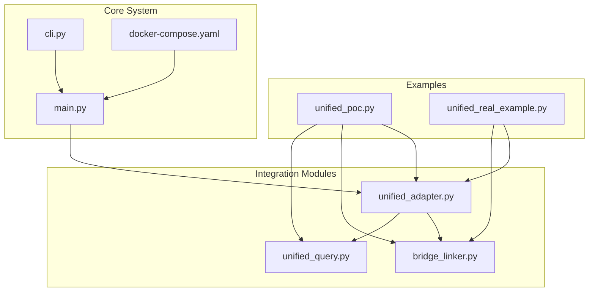
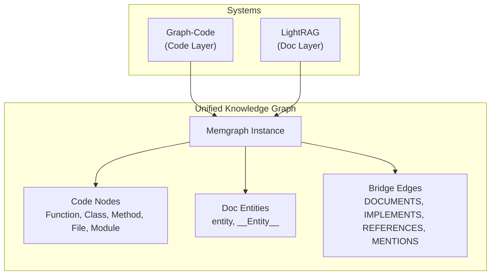
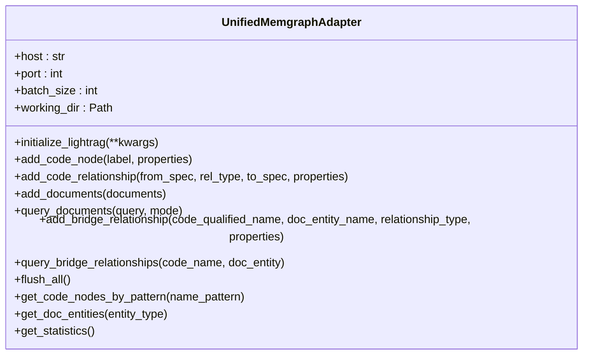
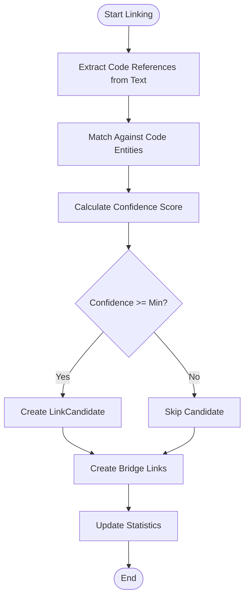
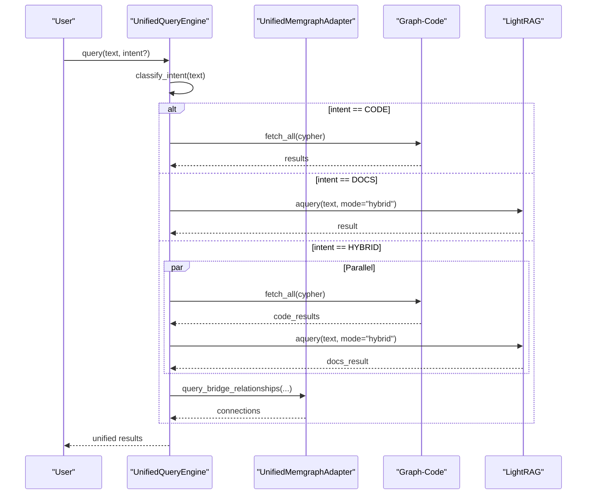
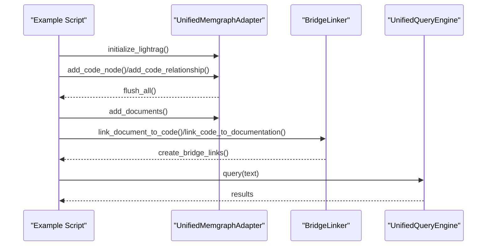
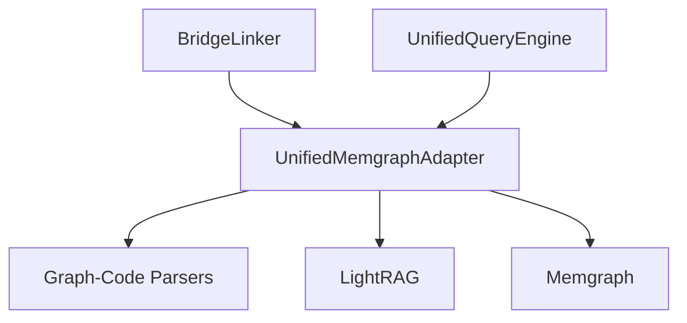

# Integration Tutorials

<cite>
**Referenced Files in This Document**
- [INTEGRATION_SUMMARY.md](file://INTEGRATION_SUMMARY.md)
- [INTEGRATION_COMPLETE.md](file://INTEGRATION_COMPLETE.md)
- [QUICK_START.md](file://QUICK_START.md)
- [README.md](file://README.md)
- [CONTRIBUTING.md](file://CONTRIBUTING.md)
- [unified_adapter.py](file://codebase_rag/integration/unified_adapter.py)
- [bridge_linker.py](file://codebase_rag/integration/bridge_linker.py)
- [unified_query.py](file://codebase_rag/integration/unified_query.py)
- [unified_poc.py](file://examples/unified_poc.py)
- [unified_real_example.py](file://examples/unified_real_example.py)
- [cli.py](file://codebase_rag/cli.py)
- [main.py](file://codebase_rag/main.py)
- [docker-compose.yaml](file://docker-compose.yaml)
</cite>

## Table of Contents
1. [Introduction](#introduction)
2. [Project Structure](#project-structure)
3. [Core Components](#core-components)
4. [Architecture Overview](#architecture-overview)
5. [Detailed Component Analysis](#detailed-component-analysis)
6. [Dependency Analysis](#dependency-analysis)
7. [Performance Considerations](#performance-considerations)
8. [Troubleshooting Guide](#troubleshooting-guide)
9. [Conclusion](#conclusion)
10. [Appendices](#appendices)

## Introduction
This document provides comprehensive integration tutorials for connecting Graph-Code with different development environments and workflows. It explains how to combine Graph-Code’s code analysis with LightRAG’s document understanding using a shared Memgraph instance, and how to extend this integration into CI/CD pipelines, IDEs, and internal tools. The guide covers practical setup, configuration, and operational patterns for web applications, microservices, documentation sites, and educational repositories.

## Project Structure
The integration is implemented as a cohesive set of modules and examples that demonstrate unified ingestion, linking, querying, and statistics collection. The core integration lives under codebase_rag/integration, with runnable examples under examples/, and the main CLI under codebase_rag/cli.py.

**Diagram sources**
- [unified_adapter.py](file://codebase_rag/integration/unified_adapter.py#L1-L384)
- [bridge_linker.py](file://codebase_rag/integration/bridge_linker.py#L1-L479)
- [unified_query.py](file://codebase_rag/integration/unified_query.py#L1-L376)
- [unified_poc.py](file://examples/unified_poc.py#L1-L343)
- [unified_real_example.py](file://examples/unified_real_example.py#L1-L270)
- [cli.py](file://codebase_rag/cli.py#L1-L395)
- [main.py](file://codebase_rag/main.py#L1-L800)
- [docker-compose.yaml](file://docker-compose.yaml)

**Section sources**
- [README.md](file://README.md#L1-L886)
- [INTEGRATION_SUMMARY.md](file://INTEGRATION_SUMMARY.md#L1-L562)
- [INTEGRATION_COMPLETE.md](file://INTEGRATION_COMPLETE.md#L1-L576)

## Core Components
This section introduces the three core integration modules that enable unified storage, intelligent linking, and smart querying across code and documentation.

- UnifiedMemgraphAdapter
  - Provides a single interface to both Graph-Code and LightRAG using a shared Memgraph instance.
  - Adds code nodes and relationships, ingests documents, manages bridge relationships, and exposes statistics.
  - Supports async initialization of LightRAG and synchronous graph-code operations.

- BridgeLinker
  - Automatically discovers relationships between code entities and documentation.
  - Extracts code references from text, matches against code entities, calculates confidence scores, and creates bridge relationships.
  - Supports bidirectional linking and configurable thresholds.

- UnifiedQueryEngine
  - Classifies query intent (code, docs, hybrid) and routes queries accordingly.
  - Executes parallel queries for hybrid mode, merges results, and discovers bridge connections.

**Section sources**
- [unified_adapter.py](file://codebase_rag/integration/unified_adapter.py#L1-L384)
- [bridge_linker.py](file://codebase_rag/integration/bridge_linker.py#L1-L479)
- [unified_query.py](file://codebase_rag/integration/unified_query.py#L1-L376)

## Architecture Overview
The unified system stores both code and documentation in a shared Memgraph database, with bridge relationships connecting code entities to documentation entities. The integration supports:
- Unified storage adapter for both systems
- Automatic bridge creation between code and docs
- Intelligent query routing and hybrid results
- Statistics and connection discovery

**Diagram sources**
- [INTEGRATION_SUMMARY.md](file://INTEGRATION_SUMMARY.md#L60-L102)
- [unified_adapter.py](file://codebase_rag/integration/unified_adapter.py#L19-L68)
- [bridge_linker.py](file://codebase_rag/integration/bridge_linker.py#L30-L64)

**Section sources**
- [INTEGRATION_SUMMARY.md](file://INTEGRATION_SUMMARY.md#L60-L102)
- [INTEGRATION_COMPLETE.md](file://INTEGRATION_COMPLETE.md#L140-L183)

## Detailed Component Analysis

### UnifiedMemgraphAdapter
The adapter encapsulates:
- Initialization and lifecycle management for both Graph-Code and LightRAG
- Code node and relationship insertion
- Document ingestion and querying
- Bridge relationship creation and querying
- Statistics and utility methods

**Diagram sources**
- [unified_adapter.py](file://codebase_rag/integration/unified_adapter.py#L19-L384)

**Section sources**
- [unified_adapter.py](file://codebase_rag/integration/unified_adapter.py#L29-L120)
- [unified_adapter.py](file://codebase_rag/integration/unified_adapter.py#L125-L230)
- [unified_adapter.py](file://codebase_rag/integration/unified_adapter.py#L231-L384)

### BridgeLinker
The linker performs:
- Pattern-based extraction of code references from documentation
- Matching references to code entities in the graph
- Confidence scoring and candidate creation
- Auto-linking across code and docs with thresholds

**Diagram sources**
- [bridge_linker.py](file://codebase_rag/integration/bridge_linker.py#L65-L227)
- [bridge_linker.py](file://codebase_rag/integration/bridge_linker.py#L296-L335)
- [bridge_linker.py](file://codebase_rag/integration/bridge_linker.py#L336-L391)

**Section sources**
- [bridge_linker.py](file://codebase_rag/integration/bridge_linker.py#L65-L179)
- [bridge_linker.py](file://codebase_rag/integration/bridge_linker.py#L180-L295)
- [bridge_linker.py](file://codebase_rag/integration/bridge_linker.py#L296-L391)

### UnifiedQueryEngine
The query engine:
- Classifies intent using keyword patterns
- Routes queries to code or docs systems
- Executes hybrid queries in parallel and merges results
- Discovers bridge connections between results

**Diagram sources**
- [unified_query.py](file://codebase_rag/integration/unified_query.py#L87-L150)
- [unified_query.py](file://codebase_rag/integration/unified_query.py#L151-L261)
- [unified_query.py](file://codebase_rag/integration/unified_query.py#L263-L305)

**Section sources**
- [unified_query.py](file://codebase_rag/integration/unified_query.py#L87-L150)
- [unified_query.py](file://codebase_rag/integration/unified_query.py#L151-L261)
- [unified_query.py](file://codebase_rag/integration/unified_query.py#L263-L376)

### Practical Examples
- unified_poc.py
  - Demonstrates initializing the adapter, adding code nodes and relationships, ingesting documentation, creating bridge relationships, querying, and displaying statistics.
- unified_real_example.py
  - Shows real-world integration with a live codebase, parsing with Graph-Code’s parsers, ingesting docs, auto-linking, and querying.

**Diagram sources**
- [unified_poc.py](file://examples/unified_poc.py#L30-L343)
- [unified_real_example.py](file://examples/unified_real_example.py#L188-L270)

**Section sources**
- [unified_poc.py](file://examples/unified_poc.py#L30-L343)
- [unified_real_example.py](file://examples/unified_real_example.py#L188-L270)

## Dependency Analysis
The integration relies on:
- Memgraph for unified storage
- Graph-Code for code parsing and ingestion
- LightRAG for document processing (optional but recommended)
- Python tooling and CLI for orchestration

**Diagram sources**
- [unified_adapter.py](file://codebase_rag/integration/unified_adapter.py#L15-L16)
- [bridge_linker.py](file://codebase_rag/integration/bridge_linker.py#L16-L16)
- [unified_query.py](file://codebase_rag/integration/unified_query.py#L10-L14)

**Section sources**
- [README.md](file://README.md#L80-L221)
- [cli.py](file://codebase_rag/cli.py#L55-L172)
- [main.py](file://codebase_rag/main.py#L737-L742)

## Performance Considerations
- Batch operations: Use adapter.batch_size to tune Memgraph flush frequency.
- Confidence thresholds: Adjust min_confidence to balance recall and precision in auto-linking.
- Parallel queries: Hybrid mode executes code and docs queries concurrently.
- Real-time updates: The system supports real-time graph updates for active development.

[No sources needed since this section provides general guidance]

## Troubleshooting Guide
Common issues and resolutions:
- LightRAG not installed: Install with the documented package name.
- Memgraph connection failed: Ensure the container is running and ports are exposed.
- No bridge relationships created: Lower confidence thresholds, verify entities exist, and confirm documentation ingestion.
- Query intent classification issues: Customize patterns in UnifiedQueryEngine or specify intent explicitly.

**Section sources**
- [INTEGRATION_SUMMARY.md](file://INTEGRATION_SUMMARY.md#L488-L513)
- [INTEGRATION_COMPLETE.md](file://INTEGRATION_COMPLETE.md#L483-L502)

## Conclusion
The integration provides a production-ready foundation for combining Graph-Code’s code analysis with LightRAG’s document understanding. It supports unified storage, automatic linking, intelligent querying, and comprehensive statistics—ready for deployment across diverse project types and environments.

[No sources needed since this section summarizes without analyzing specific files]

## Appendices

### A. Quick Start and Setup
- Start Memgraph using the provided Docker Compose configuration.
- Install dependencies and run the proof-of-concept example.
- Explore real-world integration with your codebase and documentation.

**Section sources**
- [docker-compose.yaml](file://docker-compose.yaml)
- [QUICK_START.md](file://QUICK_START.md#L42-L118)
- [INTEGRATION_COMPLETE.md](file://INTEGRATION_COMPLETE.md#L275-L343)

### B. CI/CD Integration Patterns
- GitHub Actions: Use jobs to start Memgraph, install dependencies, parse codebases, ingest docs, auto-link, and run queries.
- GitLab CI: Mirror the GitHub Actions workflow with GitLab’s YAML syntax.
- Jenkins: Define pipeline stages for setup, parsing, ingestion, linking, and querying.
- General pattern:
  - Provision Memgraph container
  - Install Python and uv
  - Run Graph-Code parsing and ingestion
  - Ingest documentation and auto-link
  - Execute unified queries and publish results

[No sources needed since this section provides general guidance]

### C. IDE and Internal Tool Integrations
- VS Code extension: Use the MCP server to integrate with Claude Code and other MCP clients.
- Internal tools: Wrap adapter methods to ingest code and docs, create bridges, and query results programmatically.
- Project management systems: Publish bridge relationships and query results as artifacts or annotations.

**Section sources**
- [README.md](file://README.md#L509-L550)
- [cli.py](file://codebase_rag/cli.py#L332-L350)

### D. Security and Access Control
- Environment variables: Store API keys and endpoints in .env files.
- Container isolation: Run Memgraph in a secure network namespace.
- Least privilege: Limit permissions for CI runners and internal tools.

**Section sources**
- [README.md](file://README.md#L616-L690)
- [CONTRIBUTING.md](file://CONTRIBUTING.md#L84-L96)

### E. Deployment Strategies
- Cloud platforms: Use managed containers for Memgraph and run integration jobs on managed compute.
- On-premises: Deploy Memgraph and Python environments behind corporate firewalls.
- Hybrid: Combine cloud-managed Memgraph with on-premises parsing and ingestion.

[No sources needed since this section provides general guidance]