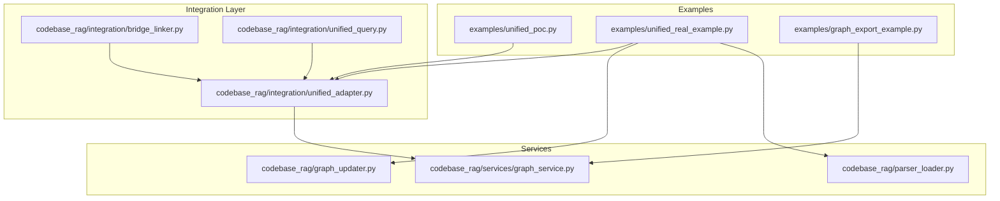
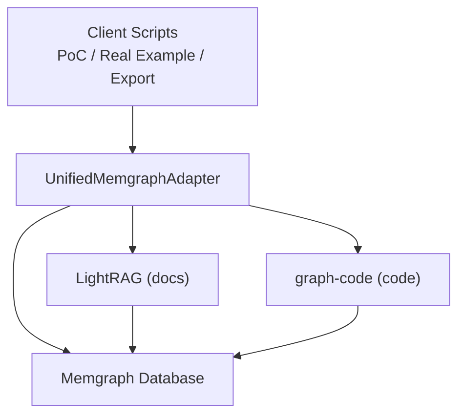
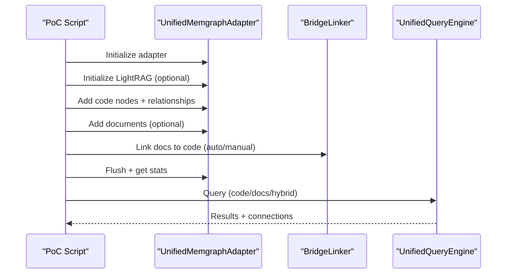
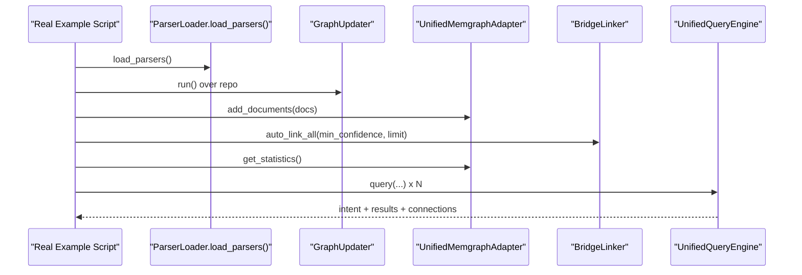
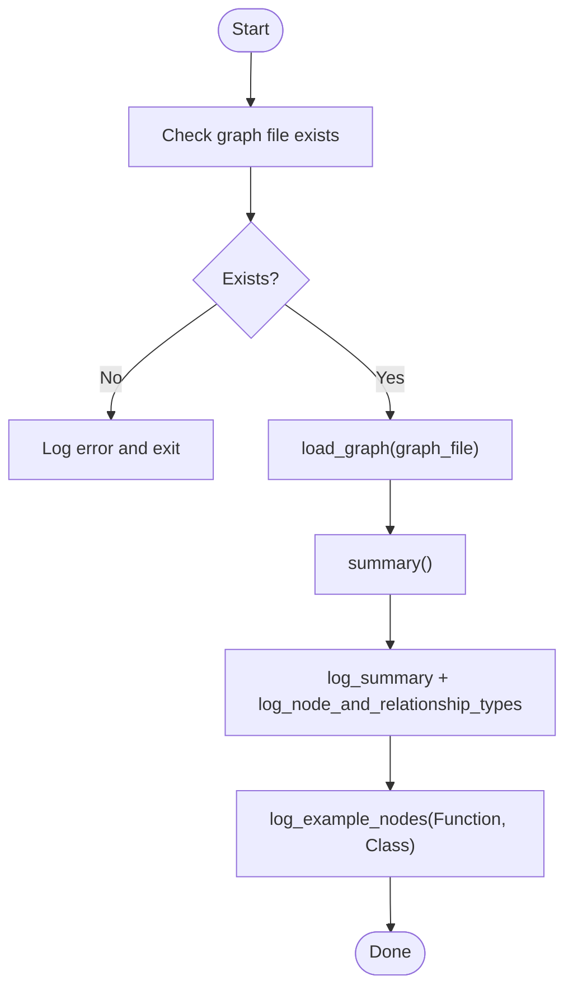
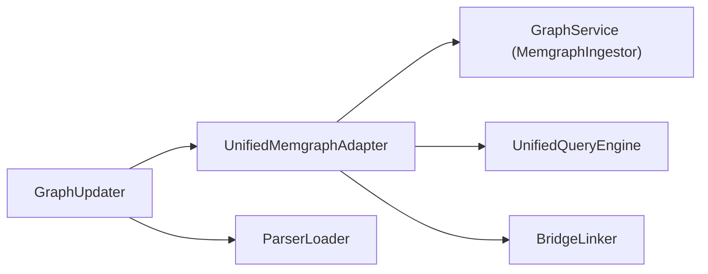

# Practical Usage Examples

<cite>
**Referenced Files in This Document**
- [unified_poc.py](file://examples/unified_poc.py)
- [unified_real_example.py](file://examples/unified_real_example.py)
- [graph_export_example.py](file://examples/graph_export_example.py)
- [README_unified.md](file://examples/README_unified.md)
- [unified_adapter.py](file://codebase_rag/integration/unified_adapter.py)
- [bridge_linker.py](file://codebase_rag/integration/bridge_linker.py)
- [unified_query.py](file://codebase_rag/integration/unified_query.py)
- [graph_service.py](file://codebase_rag/services/graph_service.py)
- [graph_updater.py](file://codebase_rag/graph_updater.py)
- [parser_loader.py](file://codebase_rag/parser_loader.py)
- [test_graph_export_integration.py](file://codebase_rag/tests/test_graph_export_integration.py)
</cite>

## Table of Contents
1. [Introduction](#introduction)
2. [Project Structure](#project-structure)
3. [Core Components](#core-components)
4. [Architecture Overview](#architecture-overview)
5. [Detailed Component Analysis](#detailed-component-analysis)
6. [Dependency Analysis](#dependency-analysis)
7. [Performance Considerations](#performance-considerations)
8. [Troubleshooting Guide](#troubleshooting-guide)
9. [Conclusion](#conclusion)
10. [Appendices](#appendices)

## Introduction
This document provides practical, hands-on guidance for using the unified graph-code and LightRAG integration. It covers:
- A simple proof-of-concept example with synthetic data and step-by-step execution
- A real-world example integrating a live codebase and documentation
- A graph export example for extracting and analyzing knowledge graphs
- Code walkthroughs explaining each component’s purpose, configuration, and customization
- Performance considerations and optimization techniques
- Patterns for adapting examples to different projects, file formats, and parsing rules
- Guidance for CI/CD integration, automated documentation generation, and team collaboration

## Project Structure
The unified integration centers around three example scripts and supporting modules:
- examples/unified_poc.py: Minimal PoC with sample code and docs
- examples/unified_real_example.py: Real codebase and docs ingestion
- examples/graph_export_example.py: Export and analyze knowledge graphs
- codebase_rag/integration: Unified adapter, bridge linker, and query engine
- codebase_rag/services: Graph ingestion and persistence
- codebase_rag/graph_updater + parser_loader: Code parsing and ingestion pipeline

**Diagram sources**
- [unified_poc.py](file://examples/unified_poc.py#L30-L343)
- [unified_real_example.py](file://examples/unified_real_example.py#L188-L270)
- [graph_export_example.py](file://examples/graph_export_example.py#L66-L101)
- [unified_adapter.py](file://codebase_rag/integration/unified_adapter.py#L19-L384)
- [bridge_linker.py](file://codebase_rag/integration/bridge_linker.py#L30-L479)
- [unified_query.py](file://codebase_rag/integration/unified_query.py#L25-L376)
- [graph_service.py](file://codebase_rag/services/graph_service.py#L49-L200)
- [graph_updater.py](file://codebase_rag/graph_updater.py#L1-L200)
- [parser_loader.py](file://codebase_rag/parser_loader.py#L276-L292)

**Section sources**
- [unified_poc.py](file://examples/unified_poc.py#L1-L343)
- [unified_real_example.py](file://examples/unified_real_example.py#L1-L270)
- [graph_export_example.py](file://examples/graph_export_example.py#L1-L101)
- [README_unified.md](file://examples/README_unified.md#L1-L379)

## Core Components
- UnifiedMemgraphAdapter: Single connection to Memgraph for both code and docs; supports batched code ingestion, LightRAG initialization, bridge relationship creation, and statistics.
- BridgeLinker: Pattern-based auto-linker that connects code entities to documentation with confidence scoring.
- UnifiedQueryEngine: Intent classifier routing queries to code, docs, or hybrid modes; discovers bridge connections across results.
- GraphUpdater + ParserLoader: Loads language-specific parsers and runs ingestion over a codebase.
- GraphService: Low-level Memgraph client with batching, constraints, and export helpers.

**Section sources**
- [unified_adapter.py](file://codebase_rag/integration/unified_adapter.py#L19-L384)
- [bridge_linker.py](file://codebase_rag/integration/bridge_linker.py#L30-L479)
- [unified_query.py](file://codebase_rag/integration/unified_query.py#L25-L376)
- [graph_service.py](file://codebase_rag/services/graph_service.py#L49-L200)
- [graph_updater.py](file://codebase_rag/graph_updater.py#L1-L200)
- [parser_loader.py](file://codebase_rag/parser_loader.py#L276-L292)

## Architecture Overview
The unified system shares a single Memgraph instance:
- Code entities (Function, Class, etc.) are ingested via graph-code
- Documentation entities are ingested via LightRAG into the same database
- Bridge relationships connect code and docs for cross-referencing
- UnifiedQueryEngine routes queries and merges results

**Diagram sources**
- [unified_adapter.py](file://codebase_rag/integration/unified_adapter.py#L69-L110)
- [unified_query.py](file://codebase_rag/integration/unified_query.py#L127-L149)
- [bridge_linker.py](file://codebase_rag/integration/bridge_linker.py#L296-L334)

## Detailed Component Analysis

### Simple Proof-of-Concept Example
This example demonstrates end-to-end ingestion and querying using synthetic data:
- Initializes the adapter and optionally LightRAG
- Adds sample code nodes and relationships
- Adds sample documentation
- Creates bridge relationships (auto or manual)
- Executes queries across code, docs, and hybrid modes
- Prints statistics and bridge relationships

**Diagram sources**
- [unified_poc.py](file://examples/unified_poc.py#L30-L343)
- [unified_adapter.py](file://codebase_rag/integration/unified_adapter.py#L125-L287)
- [bridge_linker.py](file://codebase_rag/integration/bridge_linker.py#L180-L226)
- [unified_query.py](file://codebase_rag/integration/unified_query.py#L127-L261)

Expected outputs include:
- Logs for each step (ingestion, linking, querying)
- Statistics for code nodes, docs, bridges, and total relationships
- Bridge relationship samples showing code–doc connections

**Section sources**
- [unified_poc.py](file://examples/unified_poc.py#L30-L343)
- [README_unified.md](file://examples/README_unified.md#L139-L163)

### Real-World Example: Actual Codebase and Docs
This example integrates a real codebase and documentation:
- Loads Tree-sitter parsers and queries
- Runs GraphUpdater over a repository
- Ingests documentation files (MD/RST/TXT)
- Auto-links code to docs with configurable thresholds
- Demonstrates diverse queries and prints statistics and bridge samples

**Diagram sources**
- [unified_real_example.py](file://examples/unified_real_example.py#L26-L113)
- [parser_loader.py](file://codebase_rag/parser_loader.py#L276-L292)
- [graph_updater.py](file://codebase_rag/graph_updater.py#L1-L200)
- [bridge_linker.py](file://codebase_rag/integration/bridge_linker.py#L336-L390)
- [unified_query.py](file://codebase_rag/integration/unified_query.py#L127-L261)

Key configuration options:
- Memgraph host/port, batch size, working directory
- LightRAG initialization parameters
- Bridge confidence threshold and processing limits
- Documentation file extensions supported

**Section sources**
- [unified_real_example.py](file://examples/unified_real_example.py#L188-L270)
- [README_unified.md](file://examples/README_unified.md#L164-L185)

### Graph Export Example
This example loads a previously exported graph JSON and prints summaries, node/relationship types, and sample nodes.

**Diagram sources**
- [graph_export_example.py](file://examples/graph_export_example.py#L66-L101)

**Section sources**
- [graph_export_example.py](file://examples/graph_export_example.py#L1-L101)
- [test_graph_export_integration.py](file://codebase_rag/tests/test_graph_export_integration.py#L82-L200)

### Component Walkthroughs

#### UnifiedMemgraphAdapter
Purpose:
- Provide unified access to both graph-code and LightRAG against a shared Memgraph instance
- Manage code ingestion, doc ingestion, bridge relationships, and statistics

Key capabilities:
- Code node/relationship APIs
- LightRAG initialization and querying
- Bridge relationship creation and querying
- Utility queries for code/doc entities and statistics

Configuration:
- host, port, batch_size, working_dir

Customization:
- Override LightRAG config via initialization kwargs
- Tune batch_size for memory and throughput

**Section sources**
- [unified_adapter.py](file://codebase_rag/integration/unified_adapter.py#L19-L384)

#### BridgeLinker
Purpose:
- Automatically discover and create bridge relationships between code and docs

Key capabilities:
- Extract code references from docs
- Match references to code entities
- Compute confidence scores
- Auto-link with thresholds and limits

Customization:
- Adjust min_confidence and limit
- Extend or tune reference extraction patterns
- Add bidirectional linking from code to docs

**Section sources**
- [bridge_linker.py](file://codebase_rag/integration/bridge_linker.py#L30-L479)

#### UnifiedQueryEngine
Purpose:
- Route queries intelligently and merge results when needed

Key capabilities:
- Intent classification (code/docs/hybrid)
- Parallel execution for hybrid mode
- Connection discovery across code and docs

Customization:
- Add domain-specific keywords to intent classifiers
- Extend Cypher generation for richer code queries
- Tune hybrid mode behavior

**Section sources**
- [unified_query.py](file://codebase_rag/integration/unified_query.py#L25-L376)

#### GraphUpdater and ParserLoader
Purpose:
- Load language-specific parsers and run ingestion over a codebase

Key capabilities:
- Dynamic loading of Tree-sitter grammars
- Building language-specific queries
- Running ingestion with batching

Customization:
- Add new languages by extending specs
- Tune batch sizes and caches
- Extend query sets per language

**Section sources**
- [graph_updater.py](file://codebase_rag/graph_updater.py#L1-L200)
- [parser_loader.py](file://codebase_rag/parser_loader.py#L276-L292)

#### GraphService (MemgraphIngestor)
Purpose:
- Low-level Memgraph operations with batching and constraints

Key capabilities:
- Buffered node and relationship insertion
- Constraint enforcement
- Export and cleanup helpers

Customization:
- Adjust batch_size
- Add custom constraint enforcement
- Extend query builders

**Section sources**
- [graph_service.py](file://codebase_rag/services/graph_service.py#L49-L200)

## Dependency Analysis
The integration layer composes the following dependencies:
- UnifiedMemgraphAdapter depends on MemgraphIngestor for synchronous code ingestion and on LightRAG for asynchronous docs processing
- BridgeLinker depends on UnifiedMemgraphAdapter for querying code entities and creating bridge relationships
- UnifiedQueryEngine depends on UnifiedMemgraphAdapter for routing and merging results
- Real-world example depends on ParserLoader and GraphUpdater to parse and ingest code

**Diagram sources**
- [unified_adapter.py](file://codebase_rag/integration/unified_adapter.py#L52-L58)
- [bridge_linker.py](file://codebase_rag/integration/bridge_linker.py#L38-L45)
- [unified_query.py](file://codebase_rag/integration/unified_query.py#L32-L39)
- [graph_service.py](file://codebase_rag/services/graph_service.py#L49-L66)
- [graph_updater.py](file://codebase_rag/graph_updater.py#L1-L200)
- [parser_loader.py](file://codebase_rag/parser_loader.py#L276-L292)

**Section sources**
- [unified_adapter.py](file://codebase_rag/integration/unified_adapter.py#L19-L384)
- [bridge_linker.py](file://codebase_rag/integration/bridge_linker.py#L30-L479)
- [unified_query.py](file://codebase_rag/integration/unified_query.py#L25-L376)
- [graph_service.py](file://codebase_rag/services/graph_service.py#L49-L200)
- [graph_updater.py](file://codebase_rag/graph_updater.py#L1-L200)
- [parser_loader.py](file://codebase_rag/parser_loader.py#L276-L292)

## Performance Considerations
- Batch operations: Control memory usage and throughput via batch_size in the adapter and GraphUpdater
- Confidence thresholds: Increase min_confidence to reduce false positives and downstream processing
- Processing limits: Use limit in auto-linking to cap work for large codebases
- Async operations: LightRAG operations are async; leverage parallelism in hybrid queries
- Caching and AST reuse: GraphUpdater maintains caches to speed repeated parses
- Export validation: Use integration tests to validate export correctness and performance characteristics

Practical tips:
- Start with moderate batch_size and confidence thresholds; scale up gradually
- Pre-filter large repositories by language or scope
- Monitor bridge creation statistics to tune thresholds

**Section sources**
- [README_unified.md](file://examples/README_unified.md#L331-L337)
- [unified_adapter.py](file://codebase_rag/integration/unified_adapter.py#L285-L384)
- [bridge_linker.py](file://codebase_rag/integration/bridge_linker.py#L336-L390)
- [graph_updater.py](file://codebase_rag/graph_updater.py#L162-L200)
- [test_graph_export_integration.py](file://codebase_rag/tests/test_graph_export_integration.py#L82-L200)

## Troubleshooting Guide
Common issues and resolutions:
- LightRAG not installed: Install with the documented dependency; the adapter raises a clear ImportError if LightRAG is unavailable
- Memgraph connection failures: Ensure the container is running and reachable; verify host/port and firewall rules
- No bridge relationships created: Lower min_confidence, verify code entities exist, confirm docs were ingested
- Export errors: Validate graph JSON structure and ensure required fields are present

Operational checks:
- Use adapter.get_statistics() to inspect node/relationship counts
- Query bridge relationships directly to debug linking
- Validate exports with integration tests

**Section sources**
- [unified_adapter.py](file://codebase_rag/integration/unified_adapter.py#L69-L110)
- [README_unified.md](file://examples/README_unified.md#L340-L358)

## Conclusion
The unified integration enables a powerful, shared knowledge graph across code and documentation. With the provided examples and components, teams can:
- Rapidly prototype integrations using the PoC
- Scale to real codebases and documentation using the real-world example
- Export and analyze knowledge graphs for governance and auditing
- Optimize performance and tailor configurations for their environments

## Appendices

### Adapting Examples to Your Project
- Different file formats: Extend documentation ingestion to support additional formats (e.g., PDF, DOCX) by adding new extensions and readers
- Custom parsing rules: Add or modify language specs and queries in parser loader; extend GraphUpdater to handle new constructs
- Extending functionality: Add new relationship types, intent classifiers, or query modes in the adapter and query engine

### CI/CD and Team Collaboration
- Automated ingestion: Run the real-world example as a scheduled job to keep the knowledge graph fresh
- Pull request reviews: Use the unified graph to power cross-file change analysis and documentation coverage checks
- Documentation generation: Combine export scripts with visualization tools to share insights across teams

[No sources needed since this section provides general guidance]