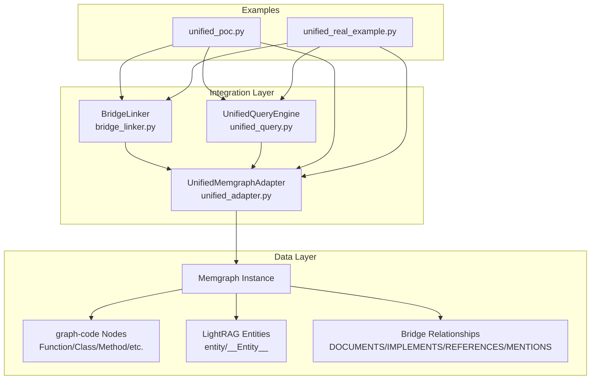
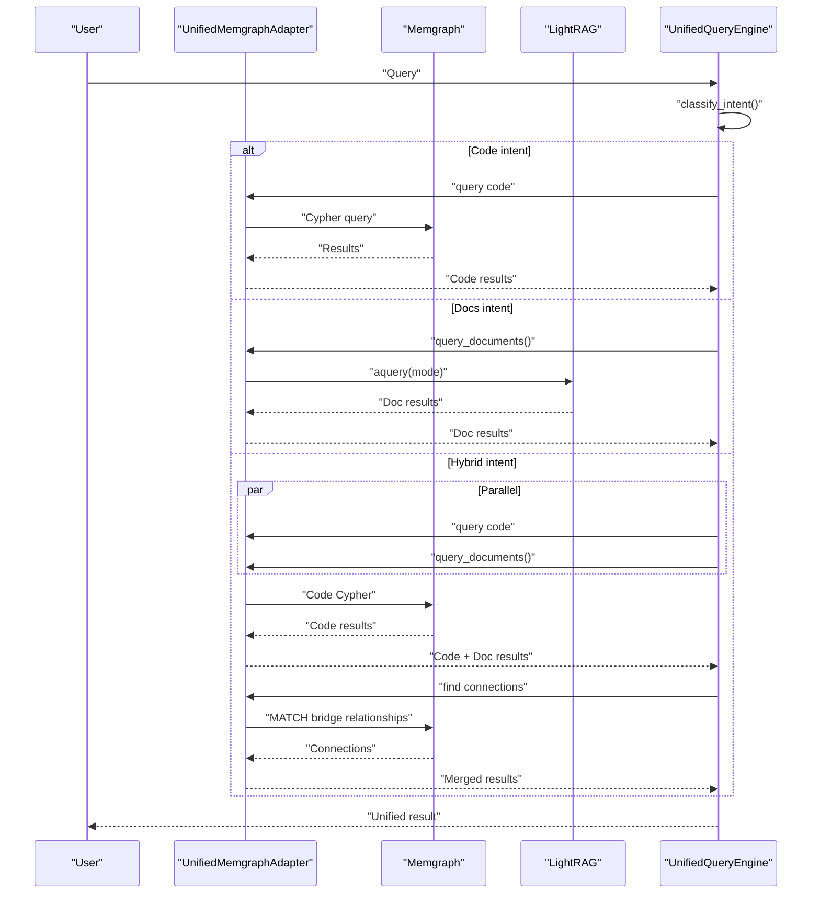
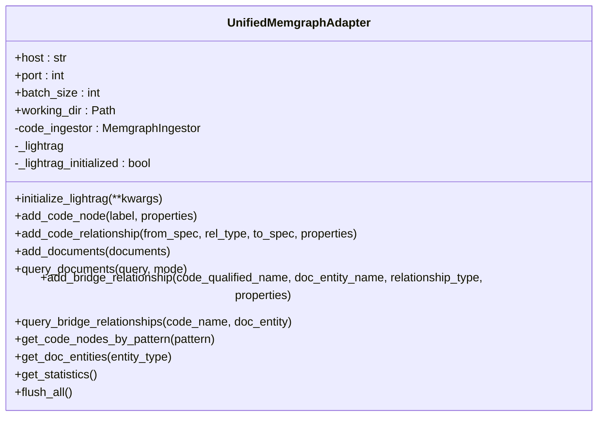
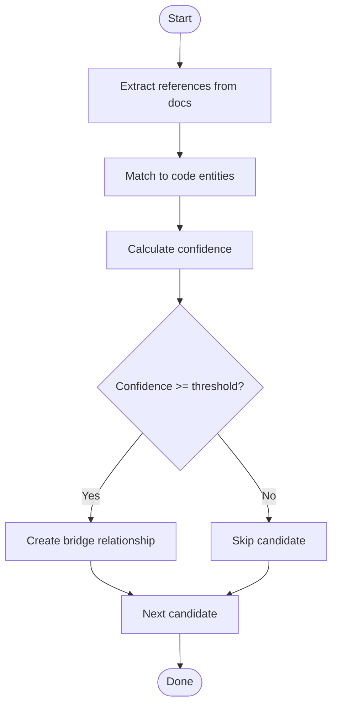
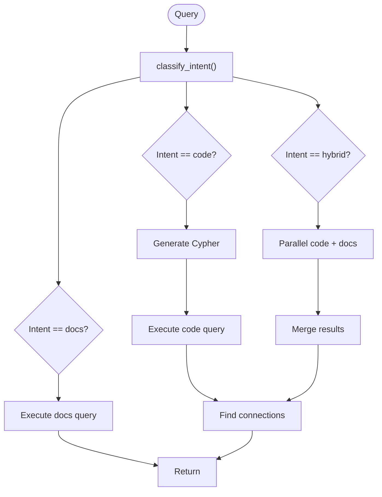
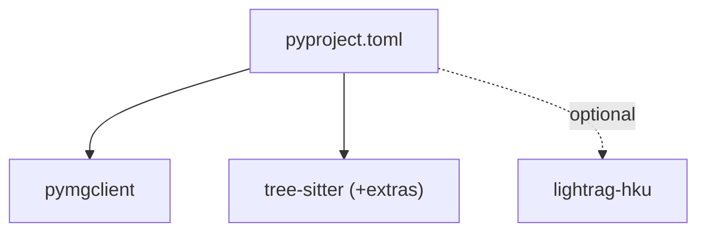

# Unified Integration Guide

<cite>
**Referenced Files in This Document**
- [unified_adapter.py](file://codebase_rag/integration/unified_adapter.py)
- [bridge_linker.py](file://codebase_rag/integration/bridge_linker.py)
- [unified_query.py](file://codebase_rag/integration/unified_query.py)
- [unified_poc.py](file://examples/unified_poc.py)
- [unified_real_example.py](file://examples/unified_real_example.py)
- [README_unified.md](file://examples/README_unified.md)
- [README.md](file://README.md)
- [graph_service.py](file://codebase_rag/services/graph_service.py)
- [types_defs.py](file://codebase_rag/types_defs.py)
- [pyproject.toml](file://pyproject.toml)
</cite>

## Table of Contents
1. [Introduction](#introduction)
2. [Project Structure](#project-structure)
3. [Core Components](#core-components)
4. [Architecture Overview](#architecture-overview)
5. [Detailed Component Analysis](#detailed-component-analysis)
6. [Dependency Analysis](#dependency-analysis)
7. [Performance Considerations](#performance-considerations)
8. [Troubleshooting Guide](#troubleshooting-guide)
9. [Conclusion](#conclusion)
10. [Appendices](#appendices)

## Introduction
This document explains the unified graph-code and LightRAG integration system. It shows how graph-code (code structure analysis) and LightRAG (document knowledge extraction) share a single Memgraph instance to form a unified knowledge graph. The system provides:
- A unified adapter for synchronized access to both systems
- An automatic bridge linker that connects code and documentation
- A query engine that classifies intent and routes queries across systems

It includes step-by-step setup, usage examples, relationship semantics, query routing, performance tips, and troubleshooting guidance.

## Project Structure
The unified integration lives under the integration package and is demonstrated by example scripts:
- Unified adapter: [unified_adapter.py](file://codebase_rag/integration/unified_adapter.py)
- Bridge linker: [bridge_linker.py](file://codebase_rag/integration/bridge_linker.py)
- Unified query engine: [unified_query.py](file://codebase_rag/integration/unified_query.py)
- Proof-of-concept example: [unified_poc.py](file://examples/unified_poc.py)
- Real-world example: [unified_real_example.py](file://examples/unified_real_example.py)
- Unified integration overview: [README_unified.md](file://examples/README_unified.md)
- General project overview: [README.md](file://README.md)
- Graph service (Memgraph client): [graph_service.py](file://codebase_rag/services/graph_service.py)
- Type definitions: [types_defs.py](file://codebase_rag/types_defs.py)
- Project dependencies: [pyproject.toml](file://pyproject.toml)

**Diagram sources**
- [unified_adapter.py](file://codebase_rag/integration/unified_adapter.py#L19-L119)
- [bridge_linker.py](file://codebase_rag/integration/bridge_linker.py#L30-L64)
- [unified_query.py](file://codebase_rag/integration/unified_query.py#L25-L40)
- [unified_poc.py](file://examples/unified_poc.py#L30-L63)
- [unified_real_example.py](file://examples/unified_real_example.py#L188-L210)

**Section sources**
- [README_unified.md](file://examples/README_unified.md#L12-L32)
- [README.md](file://README.md#L72-L78)

## Core Components
- UnifiedMemgraphAdapter: Provides unified access to both graph-code and LightRAG via a shared Memgraph instance. It exposes APIs to add code nodes/relationships, ingest documents, query docs, create bridge relationships, and query bridge relationships.
- BridgeLinker: Automatically discovers and creates bridge relationships between code and documentation using pattern matching and confidence scoring.
- UnifiedQueryEngine: Classifies user intent (code, docs, hybrid) and routes queries accordingly, merging results when needed.

**Section sources**
- [unified_adapter.py](file://codebase_rag/integration/unified_adapter.py#L19-L119)
- [bridge_linker.py](file://codebase_rag/integration/bridge_linker.py#L30-L64)
- [unified_query.py](file://codebase_rag/integration/unified_query.py#L25-L40)

## Architecture Overview
The unified system runs on a single Memgraph instance:
- graph-code writes code nodes and relationships (Function, Class, Method, File, Module, etc.) with a node property marking them as code.
- LightRAG writes documentation entities (entity/__Entity__) into the same graph.
- BridgeLinker creates bridge relationships between code and docs with properties indicating directionality and confidence.
- UnifiedQueryEngine routes queries to either graph-code or LightRAG (or both) depending on intent classification.

**Diagram sources**
- [unified_query.py](file://codebase_rag/integration/unified_query.py#L127-L261)
- [unified_adapter.py](file://codebase_rag/integration/unified_adapter.py#L163-L196)

## Detailed Component Analysis

### UnifiedMemgraphAdapter
Responsibilities:
- Manage a single Memgraph connection for both graph-code and LightRAG
- Provide synchronous graph-code operations via MemgraphIngestor
- Provide asynchronous LightRAG operations via a lazily-initialized LightRAG instance
- Expose convenience APIs for adding code nodes/relationships, adding documents, querying docs, creating bridge relationships, querying bridge relationships, and statistics

Key behaviors:
- Context manager for graph-code operations
- Lazy initialization of LightRAG with configurable working directory and storage backends
- Bridge relationship creation with standardized properties (bridge flag, relationship_type, confidence, evidence)
- Utility queries for code nodes, doc entities, and graph statistics

**Diagram sources**
- [unified_adapter.py](file://codebase_rag/integration/unified_adapter.py#L19-L119)
- [graph_service.py](file://codebase_rag/services/graph_service.py#L49-L83)

**Section sources**
- [unified_adapter.py](file://codebase_rag/integration/unified_adapter.py#L29-L119)
- [graph_service.py](file://codebase_rag/services/graph_service.py#L49-L83)

### BridgeLinker
Responsibilities:
- Detect code references in documentation text
- Detect documentation mentions in code comments
- Compute confidence scores for candidate links
- Create bridge relationships in the graph
- Auto-link all code and documentation with configurable thresholds

Key behaviors:
- Pattern-based extraction of code identifiers from docs and code comments
- Matching references to code entities by exact/partial/substring qualified names
- Confidence calculation considering exact/partial matches and contextual cues
- Relationship types: DOCUMENTS, IMPLEMENTS, REFERENCES, MENTIONS
- Bidirectional linking capability (docs→code and code→docs)

**Diagram sources**
- [bridge_linker.py](file://codebase_rag/integration/bridge_linker.py#L180-L226)
- [bridge_linker.py](file://codebase_rag/integration/bridge_linker.py#L228-L294)

**Section sources**
- [bridge_linker.py](file://codebase_rag/integration/bridge_linker.py#L30-L64)
- [bridge_linker.py](file://codebase_rag/integration/bridge_linker.py#L180-L294)

### UnifiedQueryEngine
Responsibilities:
- Classify user intent as code, docs, or hybrid
- Route queries to appropriate system(s)
- Merge results and discover bridge connections
- Provide pattern-based Cypher generation for code queries

Key behaviors:
- Intent classification based on keyword patterns and file-type indicators
- Parallel execution for hybrid queries
- Connection discovery by matching code qualified names to bridge relationships
- Fallback Cypher generation for code queries

**Diagram sources**
- [unified_query.py](file://codebase_rag/integration/unified_query.py#L87-L126)
- [unified_query.py](file://codebase_rag/integration/unified_query.py#L127-L261)

**Section sources**
- [unified_query.py](file://codebase_rag/integration/unified_query.py#L17-L40)
- [unified_query.py](file://codebase_rag/integration/unified_query.py#L87-L261)

## Dependency Analysis
External dependencies and integrations:
- Memgraph client (mgclient) for synchronous graph operations
- LightRAG (installed separately) for asynchronous document processing
- Tree-sitter grammars for multi-language parsing (optional extras)
- Logging via loguru

**Diagram sources**
- [pyproject.toml](file://pyproject.toml#L7-L25)
- [pyproject.toml](file://pyproject.toml#L45-L55)

**Section sources**
- [pyproject.toml](file://pyproject.toml#L7-L25)
- [pyproject.toml](file://pyproject.toml#L45-L55)

## Performance Considerations
- Batch operations: Tune batch_size to balance memory usage and throughput for graph-code operations.
- Confidence threshold tuning: Adjust min_confidence in BridgeLinker to trade off recall and precision.
- Async operations: Use LightRAG’s async APIs to avoid blocking the event loop.
- Processing limits: Use limit in auto-linking to cap processing for large codebases.
- Parallel querying: Hybrid mode executes code and docs queries concurrently.

[No sources needed since this section provides general guidance]

## Troubleshooting Guide
Common issues and resolutions:
- LightRAG not installed: Install with the documented package name; the adapter raises a clear ImportError if LightRAG is missing.
- Memgraph connection failures: Ensure the container is running and reachable on the configured host/port; use mgconsole to verify connectivity.
- No bridge relationships created: Lower the confidence threshold, verify code entities exist, and confirm documentation ingestion succeeded.
- Query routing confusion: Review intent classification patterns and consider specifying intent explicitly.

**Section sources**
- [unified_adapter.py](file://codebase_rag/integration/unified_adapter.py#L82-L94)
- [README_unified.md](file://examples/README_unified.md#L338-L358)

## Conclusion
The unified graph-code and LightRAG integration provides a cohesive knowledge graph spanning code and documentation. The adapter, linker, and query engine work together to:
- Share a single Memgraph instance
- Automatically connect code and docs
- Route queries intelligently
- Offer practical performance controls and diagnostics

This foundation supports real-world integrations, custom extensions, and scalable deployments.

[No sources needed since this section summarizes without analyzing specific files]

## Appendices

### Setup Instructions
- Prerequisites:
  - Memgraph running locally or remotely
  - Python 3.12+
  - Optional: Tree-sitter grammars for full language support
- Installation:
  - Install the project in editable mode
  - Optionally install LightRAG support
- Configuration:
  - Configure Memgraph host/port and batch size
  - Initialize LightRAG with desired working directory and storage backends

**Section sources**
- [README.md](file://README.md#L80-L136)
- [README_unified.md](file://examples/README_unified.md#L214-L255)

### Usage Examples
- Proof-of-concept:
  - Demonstrates initializing the adapter, adding sample code and docs, creating bridge relationships, querying, and inspecting statistics
- Real-world:
  - Parses a real codebase, ingests documentation, auto-links, and runs comprehensive queries

**Section sources**
- [unified_poc.py](file://examples/unified_poc.py#L30-L343)
- [unified_real_example.py](file://examples/unified_real_example.py#L188-L270)

### Bridge Relationship Types
- DOCUMENTS: Documentation describes code entity (doc → code)
- IMPLEMENTS: Code implements documented concept (code → doc)
- REFERENCES: Code references documentation (code → doc)
- MENTIONS: Documentation mentions code entity (doc → code)

These relationships are directional and recorded with confidence and evidence properties.

**Section sources**
- [bridge_linker.py](file://codebase_rag/integration/bridge_linker.py#L59-L64)
- [unified_adapter.py](file://codebase_rag/integration/unified_adapter.py#L202-L229)

### Query Intent Classification
- Code intent: Keywords indicating code constructs and file extensions
- Docs intent: Keywords indicating documentation and explanations
- Hybrid intent: Mixed keywords or explicit cross-references
- Explicit intent override: Pass intent to the query engine to bypass classification

**Section sources**
- [unified_query.py](file://codebase_rag/integration/unified_query.py#L41-L86)
- [unified_query.py](file://codebase_rag/integration/unified_query.py#L87-L126)

### Extending the System
- Add custom relationship types and confidence heuristics in BridgeLinker
- Extend UnifiedQueryEngine with domain-specific intent patterns
- Integrate additional document formats by preprocessing and normalizing to entity nodes
- Optimize performance by adjusting batch sizes and thresholds

**Section sources**
- [bridge_linker.py](file://codebase_rag/integration/bridge_linker.py#L396-L479)
- [unified_query.py](file://codebase_rag/integration/unified_query.py#L263-L305)