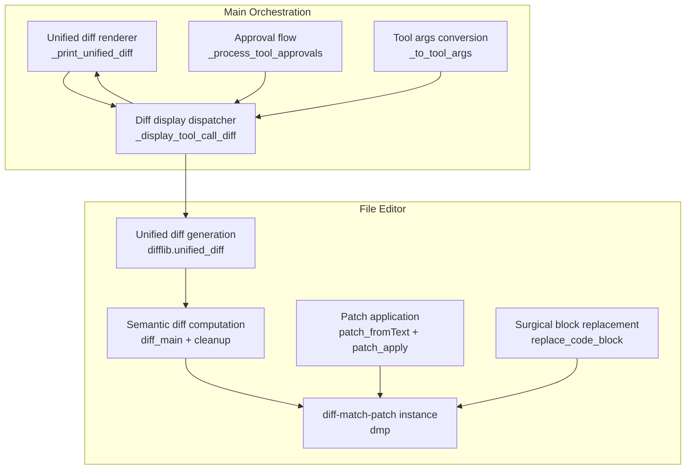
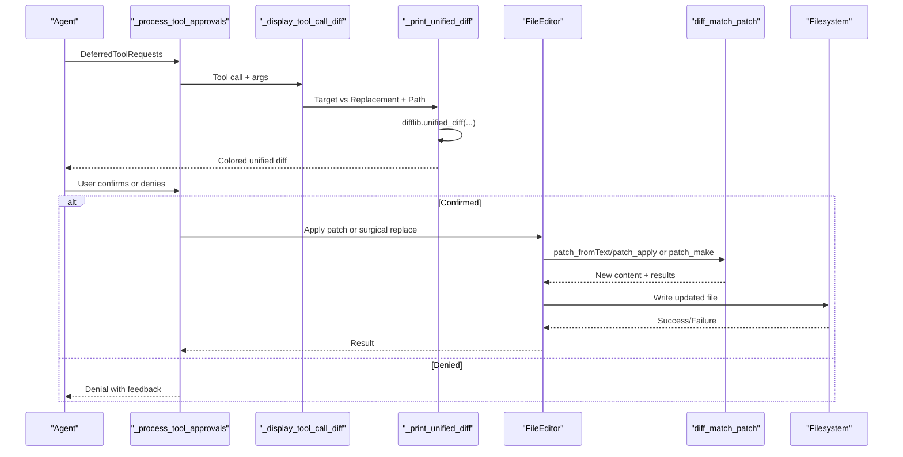
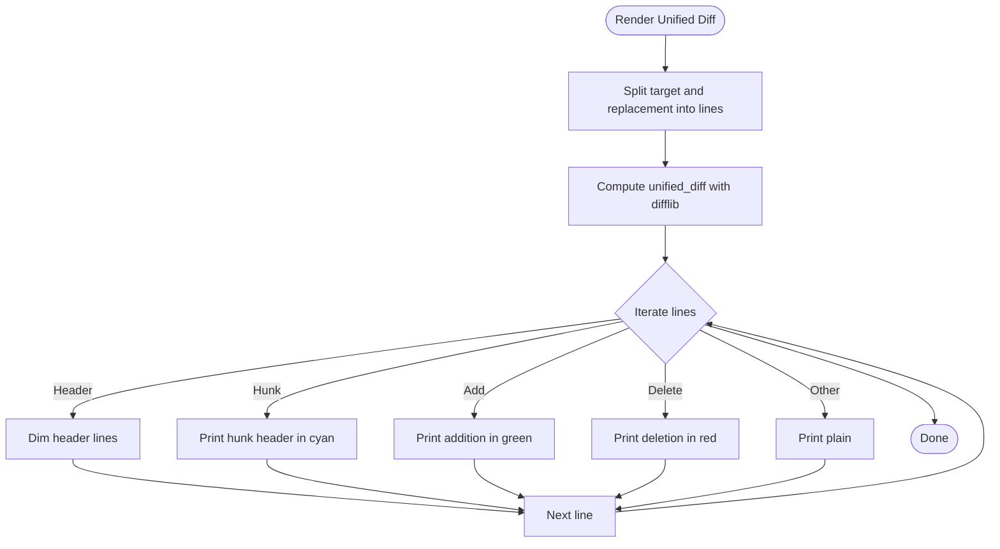
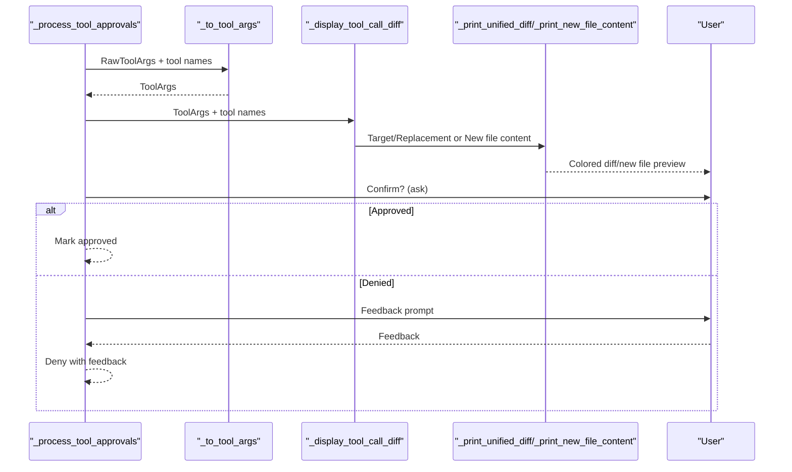
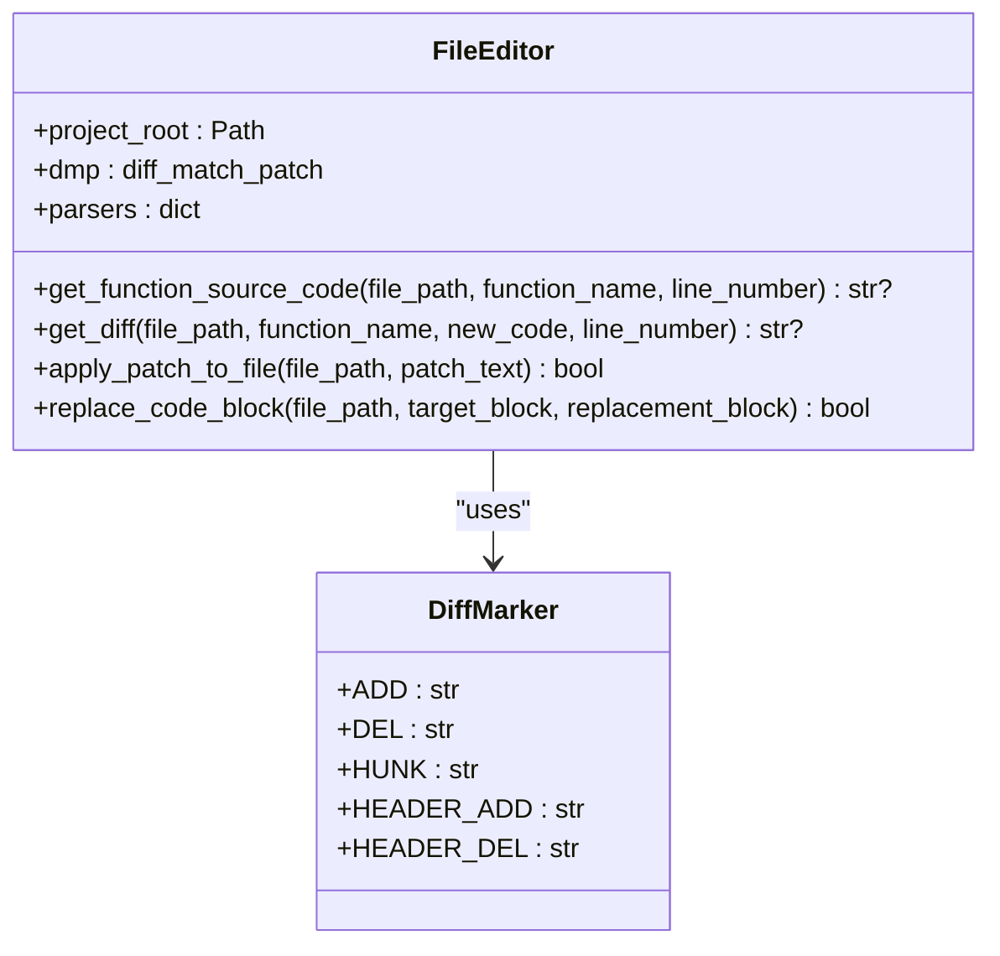
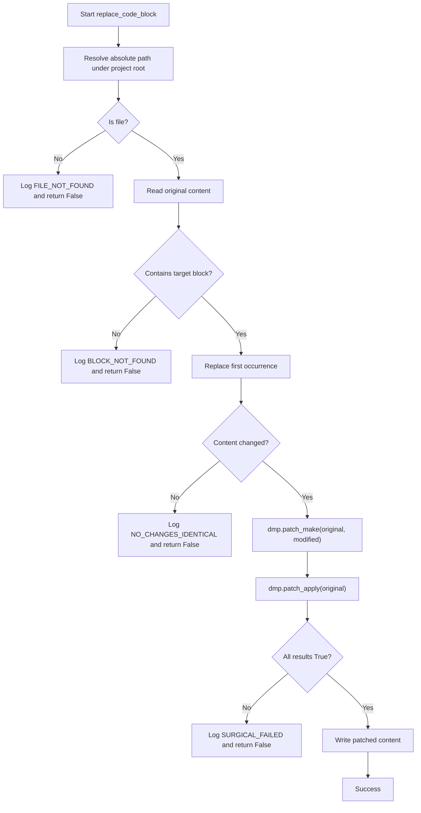
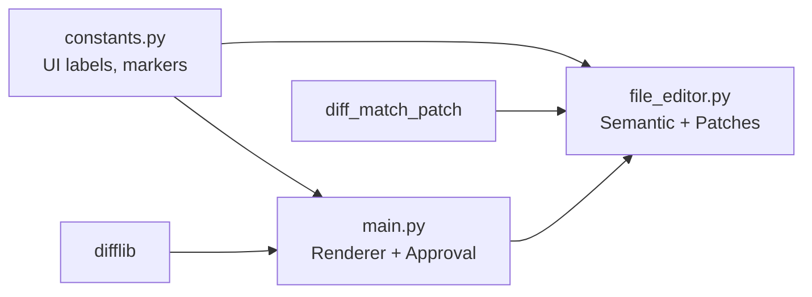

# Diff Visualization

<cite>
**Referenced Files in This Document**
- [main.py](file://codebase_rag/main.py)
- [file_editor.py](file://codebase_rag/tools/file_editor.py)
- [constants.py](file://codebase_rag/constants.py)
- [tool_descriptions.py](file://codebase_rag/tools/tool_descriptions.py)
- [test_file_editor.py](file://codebase_rag/tests/test_file_editor.py)
</cite>

## Table of Contents
1. [Introduction](#introduction)
2. [Project Structure](#project-structure)
3. [Core Components](#core-components)
4. [Architecture Overview](#architecture-overview)
5. [Detailed Component Analysis](#detailed-component-analysis)
6. [Dependency Analysis](#dependency-analysis)
7. [Performance Considerations](#performance-considerations)
8. [Troubleshooting Guide](#troubleshooting-guide)
9. [Conclusion](#conclusion)

## Introduction
This document explains the diff visualization system in Graph-Code. It covers unified diff generation using difflib, integration with diff-match-patch for precise patch creation and application, side-by-side change highlighting, and the interactive approval workflow that lets users review and confirm changes before they are applied. It also documents diff output formats, interpretation of change indicators, and fallback mechanisms for complex transformations.

## Project Structure
The diff visualization spans two primary modules:
- The main CLI orchestration layer renders diffs and manages approvals.
- The file editor module computes semantic diffs, generates unified diffs, and applies patches via diff-match-patch.

**Diagram sources**
- [main.py](file://codebase_rag/main.py#L111-L147)
- [main.py](file://codebase_rag/main.py#L162-L216)
- [main.py](file://codebase_rag/main.py#L218-L248)
- [file_editor.py](file://codebase_rag/tools/file_editor.py#L22-L296)

**Section sources**
- [main.py](file://codebase_rag/main.py#L111-L147)
- [file_editor.py](file://codebase_rag/tools/file_editor.py#L22-L296)

## Core Components
- Unified diff renderer: Prints unified diffs with colorized markers and formatted headers.
- Approval workflow: Presents diffs to users and collects confirmation or feedback.
- Semantic diff engine: Uses diff-match-patch to compute minimal, semantically meaningful differences.
- Patch application: Applies computed patches to files with validation and logging.
- Surgical replacement: Replaces exact code blocks with targeted updates.

**Section sources**
- [main.py](file://codebase_rag/main.py#L111-L147)
- [main.py](file://codebase_rag/main.py#L218-L248)
- [file_editor.py](file://codebase_rag/tools/file_editor.py#L22-L296)

## Architecture Overview
The system integrates three libraries:
- difflib: Generates unified diffs for human-readable side-by-side comparison.
- diff-match-patch: Computes semantic diffs and produces patch sets for precise application.
- Rich/prompt_toolkit: Renders colored diffs and collects user approvals.

**Diagram sources**
- [main.py](file://codebase_rag/main.py#L183-L248)
- [file_editor.py](file://codebase_rag/tools/file_editor.py#L181-L244)

## Detailed Component Analysis

### Unified Diff Rendering
The renderer prints unified diffs with:
- File headers and horizontal separators.
- Color-coded lines: headers dimmed, hunk headers cyan, additions green, deletions red, neutral lines unchanged.
- Unified diff produced by difflib with explicit fromfile/tofile labels.

**Diagram sources**
- [main.py](file://codebase_rag/main.py#L111-L147)
- [constants.py](file://codebase_rag/constants.py#L643-L649)

**Section sources**
- [main.py](file://codebase_rag/main.py#L111-L147)
- [constants.py](file://codebase_rag/constants.py#L643-L649)

### Approval Workflow and Presentation
The approval flow:
- Converts raw tool arguments to typed arguments.
- Displays the appropriate diff or new file content.
- Asks the user for confirmation when editing is enabled.
- Captures feedback if the user declines.

**Diagram sources**
- [main.py](file://codebase_rag/main.py#L162-L216)
- [main.py](file://codebase_rag/main.py#L218-L248)

**Section sources**
- [main.py](file://codebase_rag/main.py#L162-L216)
- [main.py](file://codebase_rag/main.py#L218-L248)

### Semantic Diff and Patch Application
The file editor:
- Extracts function source via AST parsing.
- Computes semantic diffs with diff-match-patch and cleans up for readability.
- Generates unified diffs for display.
- Applies patches to files with validation and logging.

**Diagram sources**
- [file_editor.py](file://codebase_rag/tools/file_editor.py#L22-L296)
- [constants.py](file://codebase_rag/constants.py#L643-L649)

**Section sources**
- [file_editor.py](file://codebase_rag/tools/file_editor.py#L157-L179)
- [file_editor.py](file://codebase_rag/tools/file_editor.py#L181-L202)
- [file_editor.py](file://codebase_rag/tools/file_editor.py#L204-L253)

### Surgical Block Replacement
The surgical replacement:
- Validates file path and existence.
- Ensures the exact target block exists once.
- Computes a patch and applies it atomically.
- Logs success or failure with detailed warnings.

**Diagram sources**
- [file_editor.py](file://codebase_rag/tools/file_editor.py#L204-L253)

**Section sources**
- [file_editor.py](file://codebase_rag/tools/file_editor.py#L204-L253)

### Diff Output Formats and Change Indicators
- Unified diff format: Headers indicate “before” and “after”; hunk headers show ranges; lines prefixed with ‘-’ are deletions, ‘+’ are additions, and context lines are neutral.
- The renderer colorizes headers, hunk headers, additions, and deletions for quick scanning.
- The constants define marker characters and headers used across the system.

Interpretation tips:
- Deletions (‘-’) highlight removed lines.
- Additions (‘+’) highlight inserted lines.
- Hunk headers (“@@ ... @@”) delimit contiguous change blocks.
- Headers (“---” and “+++”) separate old and new versions.

**Section sources**
- [main.py](file://codebase_rag/main.py#L116-L144)
- [constants.py](file://codebase_rag/constants.py#L643-L649)

### Integration with Approval Workflow
- Tools requiring approval (e.g., surgical replace) trigger the approval flow.
- The system displays a unified diff preview before asking for confirmation.
- Users can approve or deny with optional feedback.

**Section sources**
- [main.py](file://codebase_rag/main.py#L218-L248)
- [tool_descriptions.py](file://codebase_rag/tools/tool_descriptions.py#L107-L110)

## Dependency Analysis
- main.py depends on difflib for unified diffs and Rich/prompt_toolkit for rendering and prompting.
- file_editor.py depends on diff-match-patch for semantic diffs and unified diffs for display.
- Both modules rely on constants for shared UI labels and markers.

**Diagram sources**
- [main.py](file://codebase_rag/main.py#L3-L4)
- [file_editor.py](file://codebase_rag/tools/file_editor.py#L3-L6)
- [constants.py](file://codebase_rag/constants.py#L637-L649)

**Section sources**
- [main.py](file://codebase_rag/main.py#L3-L4)
- [file_editor.py](file://codebase_rag/tools/file_editor.py#L3-L6)
- [constants.py](file://codebase_rag/constants.py#L637-L649)

## Performance Considerations
- Unified diffs are linear in the number of changed lines; performance scales with edit size.
- diff-match-patch semantic cleanup reduces noise but adds preprocessing cost.
- For very large files, consider limiting diffs to edited regions (e.g., function-level diffs) to reduce rendering overhead.
- Patch application validates all results; failures abort early to avoid partial writes.

## Troubleshooting Guide
Common issues and resolutions:
- Function not found: When extracting function source fails, the diff cannot be generated. Verify the function name and ensure the file is parsable.
- Ambiguous function names: If multiple matches exist, the system logs details and uses the first match; specify a qualified name or line number to disambiguate.
- Surgical replacement fails: Occurs if the target block is not unique or if patch application fails. Ensure the block appears exactly once and that the file path is valid.
- Patch application errors: If any patch segment fails, the system logs the failure and does not write to disk. Review logs and re-run with corrected inputs.

Validation and tests:
- Tests verify unified diff generation, surgical replacement, and patch application.
- Edge cases covered include non-existent functions, identical content, and invalid paths.

**Section sources**
- [test_file_editor.py](file://codebase_rag/tests/test_file_editor.py#L230-L261)
- [test_file_editor.py](file://codebase_rag/tests/test_file_editor.py#L154-L200)
- [file_editor.py](file://codebase_rag/tools/file_editor.py#L157-L179)
- [file_editor.py](file://codebase_rag/tools/file_editor.py#L181-L202)
- [file_editor.py](file://codebase_rag/tools/file_editor.py#L204-L253)

## Conclusion
Graph-Code’s diff visualization combines unified diffs for readability with diff-match-patch for precise, semantically meaningful edits. The approval workflow ensures users review changes before applying them, while surgical replacements and patch application provide robust fallbacks for complex transformations. Together, these components deliver a safe, transparent, and efficient editing experience.