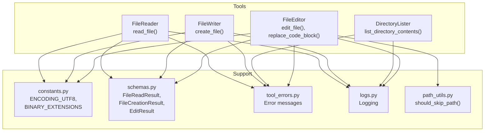
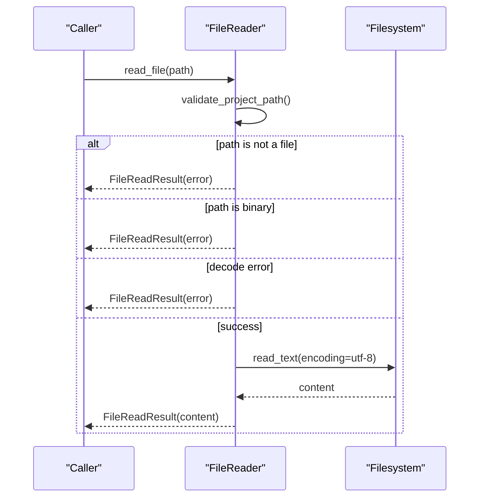
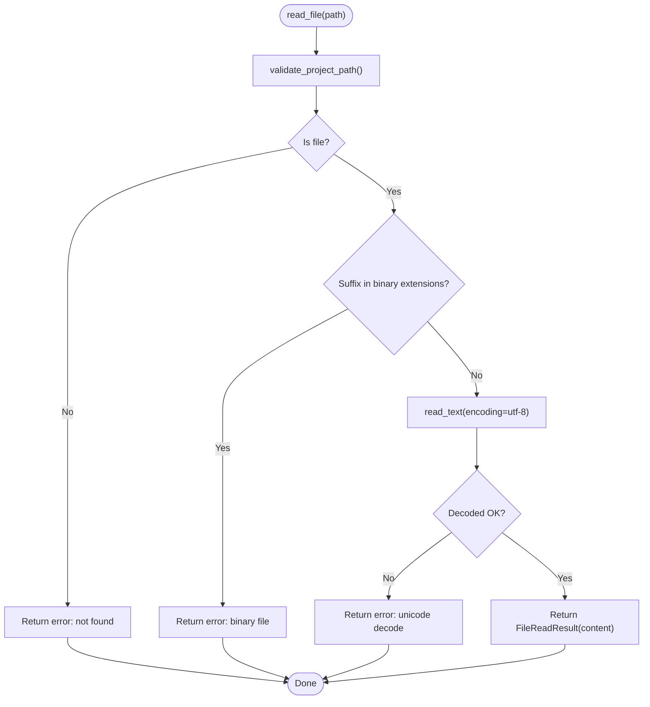
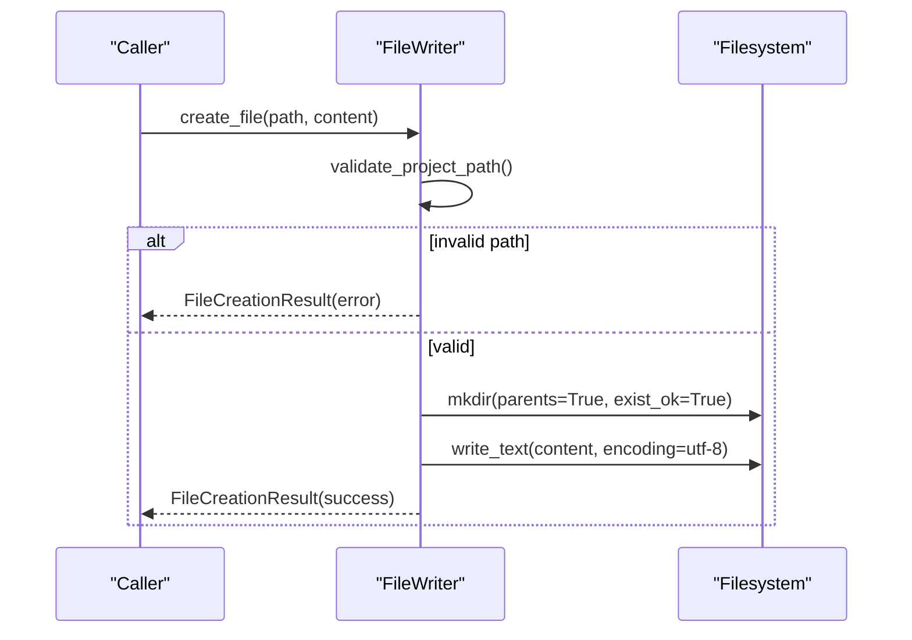
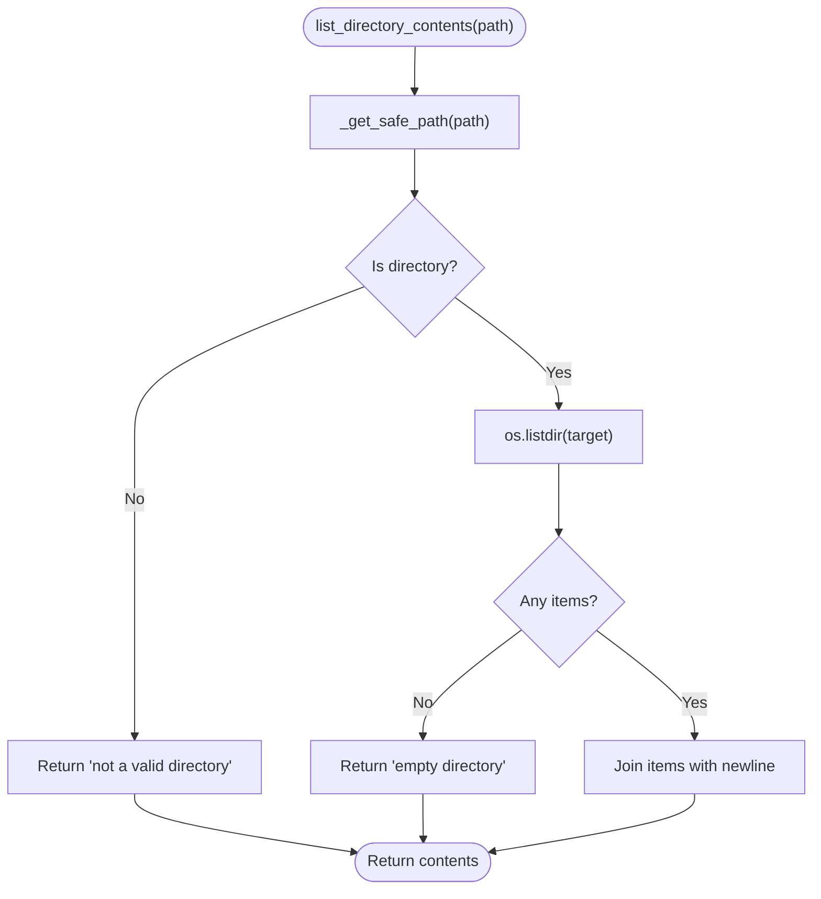
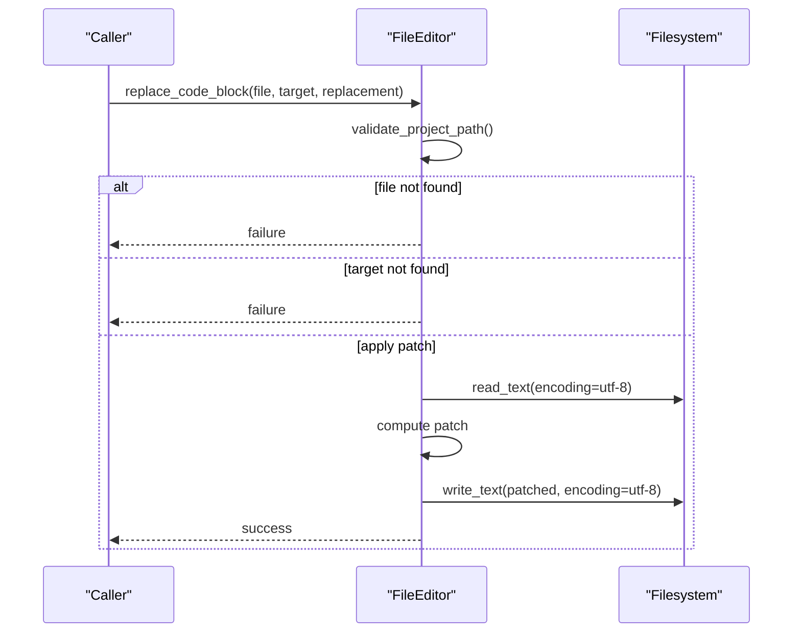
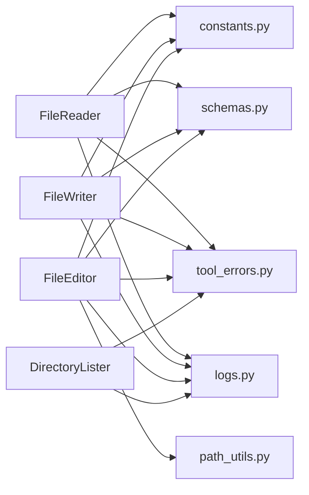

# File I/O Operations

<cite>
**Referenced Files in This Document**
- [file_reader.py](file://codebase_rag/tools/file_reader.py)
- [file_writer.py](file://codebase_rag/tools/file_writer.py)
- [directory_lister.py](file://codebase_rag/tools/directory_lister.py)
- [file_editor.py](file://codebase_rag/tools/file_editor.py)
- [constants.py](file://codebase_rag/constants.py)
- [schemas.py](file://codebase_rag/schemas.py)
- [tool_errors.py](file://codebase_rag/tool_errors.py)
- [logs.py](file://codebase_rag/logs.py)
- [path_utils.py](file://codebase_rag/utils/path_utils.py)
- [test_file_reader.py](file://codebase_rag/tests/test_file_reader.py)
- [test_file_writer.py](file://codebase_rag/tests/test_file_writer.py)
- [test_directory_lister.py](file://codebase_rag/tests/test_directory_lister.py)
- [test_file_editor.py](file://codebase_rag/tests/test_file_editor.py)
</cite>

## Table of Contents
1. [Introduction](#introduction)
2. [Project Structure](#project-structure)
3. [Core Components](#core-components)
4. [Architecture Overview](#architecture-overview)
5. [Detailed Component Analysis](#detailed-component-analysis)
6. [Dependency Analysis](#dependency-analysis)
7. [Performance Considerations](#performance-considerations)
8. [Troubleshooting Guide](#troubleshooting-guide)
9. [Conclusion](#conclusion)
10. [Appendices](#appendices)

## Introduction
This document explains the file input/output subsystem used by Graph-Code tools. It covers:
- File reading with encoding handling and binary-file detection
- File creation and writing with encoding and safety checks
- Directory listing with safe path resolution and filtering
- File system navigation and path resolution logic
- Examples of reading configuration-like files, writing generated code, and exploring project structures
- Error handling for access issues, permissions, and invalid operations
- Performance considerations for large files and batch operations

## Project Structure
The file I/O features are implemented as discrete tool classes that operate within a project root boundary. Supporting modules define encodings, result schemas, error messages, logging, and path filtering.

**Diagram sources**
- [file_reader.py](file://codebase_rag/tools/file_reader.py#L16-L67)
- [file_writer.py](file://codebase_rag/tools/file_writer.py#L16-L52)
- [directory_lister.py](file://codebase_rag/tools/directory_lister.py#L15-L58)
- [file_editor.py](file://codebase_rag/tools/file_editor.py#L22-L296)
- [constants.py](file://codebase_rag/constants.py#L50-L189)
- [schemas.py](file://codebase_rag/schemas.py#L66-L82)
- [tool_errors.py](file://codebase_rag/tool_errors.py#L6-L72)
- [logs.py](file://codebase_rag/logs.py#L200-L320)
- [path_utils.py](file://codebase_rag/utils/path_utils.py#L6-L28)

**Section sources**
- [file_reader.py](file://codebase_rag/tools/file_reader.py#L1-L67)
- [file_writer.py](file://codebase_rag/tools/file_writer.py#L1-L52)
- [directory_lister.py](file://codebase_rag/tools/directory_lister.py#L1-L58)
- [file_editor.py](file://codebase_rag/tools/file_editor.py#L1-L296)
- [constants.py](file://codebase_rag/constants.py#L50-L189)
- [schemas.py](file://codebase_rag/schemas.py#L66-L82)
- [tool_errors.py](file://codebase_rag/tool_errors.py#L6-L72)
- [logs.py](file://codebase_rag/logs.py#L200-L320)
- [path_utils.py](file://codebase_rag/utils/path_utils.py#L6-L28)

## Core Components
- FileReader: Reads text files safely, rejects binary files, handles encoding errors, and enforces project-root boundaries.
- FileWriter: Creates files with UTF-8 encoding, ensures parent directories exist, and enforces project-root boundaries.
- DirectoryLister: Lists directory contents with safe path resolution and returns formatted lists or error messages.
- FileEditor: Full-file replacement and surgical block replacement with AST-aware parsing and diff generation.

Key shared constants and schemas:
- UTF-8 encoding constant and binary file extension sets
- Result models for read/create/edit operations
- Error message templates and logging keys

**Section sources**
- [file_reader.py](file://codebase_rag/tools/file_reader.py#L16-L67)
- [file_writer.py](file://codebase_rag/tools/file_writer.py#L16-L52)
- [directory_lister.py](file://codebase_rag/tools/directory_lister.py#L15-L58)
- [file_editor.py](file://codebase_rag/tools/file_editor.py#L22-L296)
- [constants.py](file://codebase_rag/constants.py#L50-L189)
- [schemas.py](file://codebase_rag/schemas.py#L66-L82)
- [tool_errors.py](file://codebase_rag/tool_errors.py#L6-L72)
- [logs.py](file://codebase_rag/logs.py#L200-L320)

## Architecture Overview
The tools are thin wrappers around filesystem operations, each guarded by a decorator that validates paths against the configured project root. Results are returned via Pydantic models, and errors are normalized into consistent messages.

**Diagram sources**
- [file_reader.py](file://codebase_rag/tools/file_reader.py#L21-L52)
- [constants.py](file://codebase_rag/constants.py#L50-L189)
- [schemas.py](file://codebase_rag/schemas.py#L66-L70)
- [tool_errors.py](file://codebase_rag/tool_errors.py#L6-L13)
- [logs.py](file://codebase_rag/logs.py#L200-L205)

## Detailed Component Analysis

### FileReader
Responsibilities:
- Resolve project root and validate paths
- Reject non-files and binary files
- Read text with UTF-8 and handle decoding errors
- Return structured results with optional error messages

Encoding and binary handling:
- Uses UTF-8 constant
- Rejects files whose suffixes are in the binary-extensions set
- On decode failures, returns a standardized error message

Security:
- Enforces project-root containment via a validator decorator

**Diagram sources**
- [file_reader.py](file://codebase_rag/tools/file_reader.py#L21-L52)
- [constants.py](file://codebase_rag/constants.py#L50-L189)
- [tool_errors.py](file://codebase_rag/tool_errors.py#L6-L13)
- [logs.py](file://codebase_rag/logs.py#L200-L205)

**Section sources**
- [file_reader.py](file://codebase_rag/tools/file_reader.py#L16-L67)
- [constants.py](file://codebase_rag/constants.py#L50-L189)
- [schemas.py](file://codebase_rag/schemas.py#L66-L70)
- [tool_errors.py](file://codebase_rag/tool_errors.py#L6-L13)
- [logs.py](file://codebase_rag/logs.py#L200-L205)

### FileWriter
Responsibilities:
- Resolve project root and validate paths
- Ensure parent directories exist
- Write content with UTF-8 encoding
- Return success or error result

Security:
- Enforces project-root containment via a validator decorator

**Diagram sources**
- [file_writer.py](file://codebase_rag/tools/file_writer.py#L21-L40)
- [constants.py](file://codebase_rag/constants.py#L188-L189)
- [schemas.py](file://codebase_rag/schemas.py#L72-L82)
- [tool_errors.py](file://codebase_rag/tool_errors.py#L52-L56)
- [logs.py](file://codebase_rag/logs.py#L306-L309)

**Section sources**
- [file_writer.py](file://codebase_rag/tools/file_writer.py#L16-L52)
- [schemas.py](file://codebase_rag/schemas.py#L72-L82)
- [tool_errors.py](file://codebase_rag/tool_errors.py#L52-L56)
- [logs.py](file://codebase_rag/logs.py#L306-L309)

### DirectoryLister
Responsibilities:
- Safely resolve requested directory path relative to project root
- List directory contents or return appropriate error messages
- Guard against paths outside the project root

**Diagram sources**
- [directory_lister.py](file://codebase_rag/tools/directory_lister.py#L19-L34)
- [tool_errors.py](file://codebase_rag/tool_errors.py#L33-L37)
- [logs.py](file://codebase_rag/logs.py#L263-L266)

**Section sources**
- [directory_lister.py](file://codebase_rag/tools/directory_lister.py#L15-L58)
- [tool_errors.py](file://codebase_rag/tool_errors.py#L33-L37)
- [logs.py](file://codebase_rag/logs.py#L263-L266)

### FileEditor
Capabilities:
- Full-file replacement with UTF-8 encoding
- Surgical block replacement with diff-match-patch and unified diff
- AST-aware function extraction for supported languages
- Patch application to files

Security and validation:
- Validates paths against project root
- Rejects edits outside root
- Returns structured results with success/error

**Diagram sources**
- [file_editor.py](file://codebase_rag/tools/file_editor.py#L204-L254)
- [constants.py](file://codebase_rag/constants.py#L188-L189)
- [schemas.py](file://codebase_rag/schemas.py#L54-L64)
- [tool_errors.py](file://codebase_rag/tool_errors.py#L6-L13)
- [logs.py](file://codebase_rag/logs.py#L206-L213)

**Section sources**
- [file_editor.py](file://codebase_rag/tools/file_editor.py#L22-L296)
- [schemas.py](file://codebase_rag/schemas.py#L54-L64)
- [tool_errors.py](file://codebase_rag/tool_errors.py#L6-L13)
- [logs.py](file://codebase_rag/logs.py#L206-L213)

## Dependency Analysis
- FileReader/FileWriter/FileEditor depend on:
  - constants for encoding and binary extensions
  - schemas for result models
  - tool_errors for error messages
  - logs for logging keys
  - path_utils for filtering logic (used by higher-level ingestion)
- DirectoryLister depends on:
  - tool_errors for error messages
  - logs for logging keys

**Diagram sources**
- [file_reader.py](file://codebase_rag/tools/file_reader.py#L1-L14)
- [file_writer.py](file://codebase_rag/tools/file_writer.py#L1-L14)
- [file_editor.py](file://codebase_rag/tools/file_editor.py#L1-L20)
- [directory_lister.py](file://codebase_rag/tools/directory_lister.py#L1-L13)
- [constants.py](file://codebase_rag/constants.py#L50-L189)
- [schemas.py](file://codebase_rag/schemas.py#L66-L82)
- [tool_errors.py](file://codebase_rag/tool_errors.py#L6-L72)
- [logs.py](file://codebase_rag/logs.py#L200-L320)
- [path_utils.py](file://codebase_rag/utils/path_utils.py#L6-L28)

**Section sources**
- [file_reader.py](file://codebase_rag/tools/file_reader.py#L1-L14)
- [file_writer.py](file://codebase_rag/tools/file_writer.py#L1-L14)
- [file_editor.py](file://codebase_rag/tools/file_editor.py#L1-L20)
- [directory_lister.py](file://codebase_rag/tools/directory_lister.py#L1-L13)
- [constants.py](file://codebase_rag/constants.py#L50-L189)
- [schemas.py](file://codebase_rag/schemas.py#L66-L82)
- [tool_errors.py](file://codebase_rag/tool_errors.py#L6-L72)
- [logs.py](file://codebase_rag/logs.py#L200-L320)
- [path_utils.py](file://codebase_rag/utils/path_utils.py#L6-L28)

## Performance Considerations
- Text encoding: All operations use UTF-8. For very large files, consider streaming reads/writes or chunked processing to reduce memory pressure.
- Binary detection: FileReader rejects binary files early to avoid expensive I/O and decoding attempts.
- Directory listing: Uses a simple list operation; for very large directories, consider pagination or filtering to reduce output size.
- AST-based editing: FileEditor builds ASTs and computes diffs; this is CPU-bound. For batch edits, process files sequentially or in small concurrent batches to avoid parser initialization overhead.
- Path filtering: Use path_utils to pre-filter unwanted paths to minimize I/O work during indexing or scanning.

[No sources needed since this section provides general guidance]

## Troubleshooting Guide
Common issues and resolutions:
- File not found or is a directory: Returned by FileReader and FileEditor when the path is invalid or a directory.
- Binary file detected: FileReader returns an error suggesting alternative tools.
- Unicode decode error: Indicates non-text content; use appropriate analyzers or tools.
- Access outside project root: All tools enforce root containment; adjust project root or path accordingly.
- Directory listing failures: Errors indicate invalid directories or permission issues.

Validation and tests:
- FileReader tests cover binary files, Unicode content, empty files, and out-of-root paths.
- FileWriter tests cover creation, overwrites, Unicode content, and out-of-root protection.
- DirectoryLister tests cover absolute/relative paths, hidden files, and empty directories.
- FileEditor tests cover AST parsing, surgical replacements, and diff generation.

**Section sources**
- [file_reader.py](file://codebase_rag/tools/file_reader.py#L21-L52)
- [file_writer.py](file://codebase_rag/tools/file_writer.py#L21-L40)
- [directory_lister.py](file://codebase_rag/tools/directory_lister.py#L19-L34)
- [file_editor.py](file://codebase_rag/tools/file_editor.py#L204-L254)
- [tool_errors.py](file://codebase_rag/tool_errors.py#L6-L72)
- [logs.py](file://codebase_rag/logs.py#L200-L320)
- [test_file_reader.py](file://codebase_rag/tests/test_file_reader.py#L77-L162)
- [test_file_writer.py](file://codebase_rag/tests/test_file_writer.py#L58-L130)
- [test_directory_lister.py](file://codebase_rag/tests/test_directory_lister.py#L46-L115)
- [test_file_editor.py](file://codebase_rag/tests/test_file_editor.py#L154-L228)

## Conclusion
The file I/O subsystem provides robust, secure, and consistent operations across reading, writing, directory listing, and surgical editing. It enforces project-root boundaries, handles encoding uniformly, and returns structured results for reliable downstream processing. Tests validate core behaviors and highlight expected error conditions.

[No sources needed since this section summarizes without analyzing specific files]

## Appendices

### Examples

- Reading configuration files
  - Use FileReader to read text-based configs with UTF-8 decoding and automatic binary rejection.
  - Example reference: [test_file_reader.py](file://codebase_rag/tests/test_file_reader.py#L77-L96)

- Writing generated code
  - Use FileWriter to create new files with UTF-8 encoding and ensure parent directories exist.
  - Example reference: [test_file_writer.py](file://codebase_rag/tests/test_file_writer.py#L59-L78)

- Exploring project structures
  - Use DirectoryLister to enumerate directories safely and avoid out-of-root access.
  - Example reference: [test_directory_lister.py](file://codebase_rag/tests/test_directory_lister.py#L47-L67)

- Surgical code replacement
  - Use FileEditor to replace code blocks with diff-match-patch and unified diff previews.
  - Example reference: [test_file_editor.py](file://codebase_rag/tests/test_file_editor.py#L154-L188)

**Section sources**
- [test_file_reader.py](file://codebase_rag/tests/test_file_reader.py#L77-L96)
- [test_file_writer.py](file://codebase_rag/tests/test_file_writer.py#L59-L78)
- [test_directory_lister.py](file://codebase_rag/tests/test_directory_lister.py#L47-L67)
- [test_file_editor.py](file://codebase_rag/tests/test_file_editor.py#L154-L188)