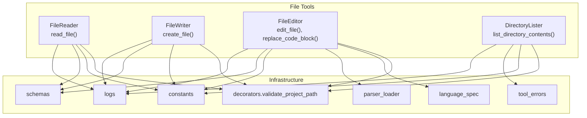
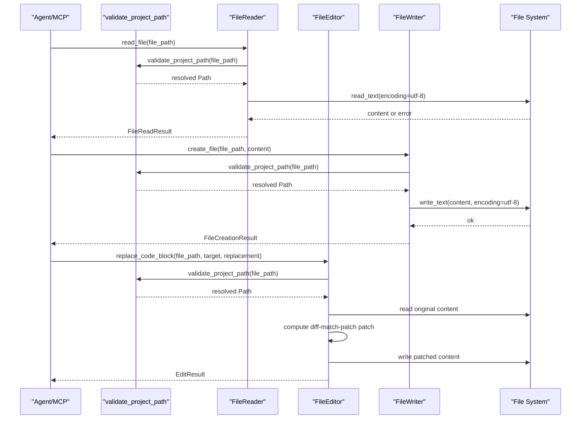
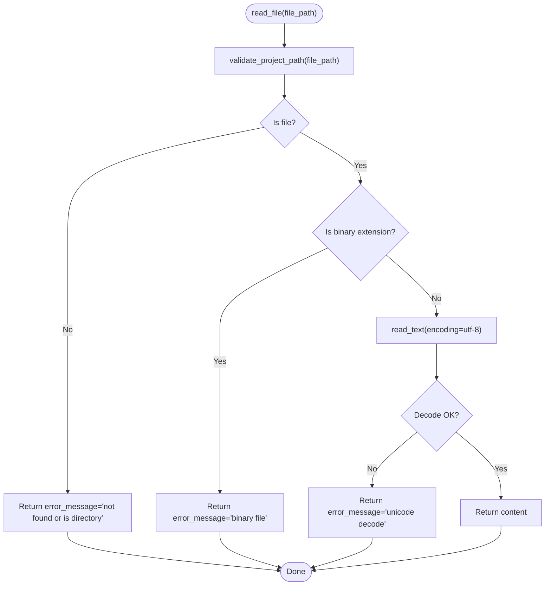
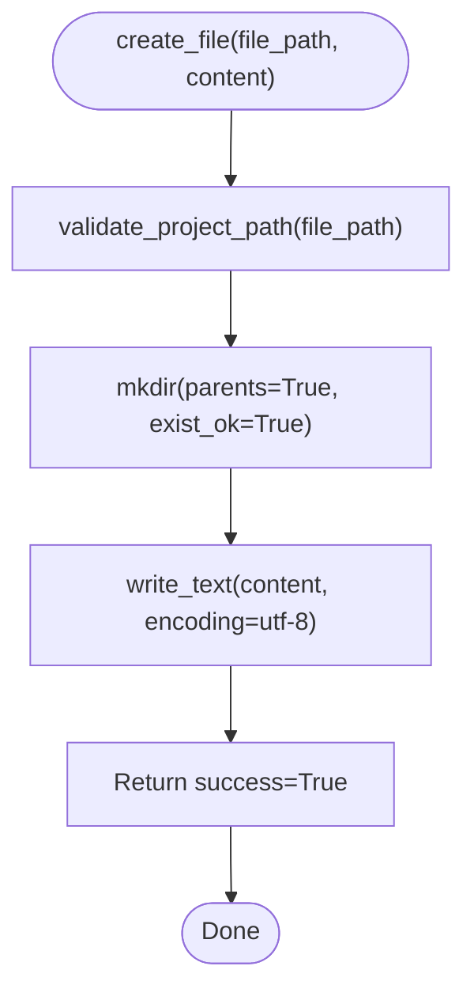
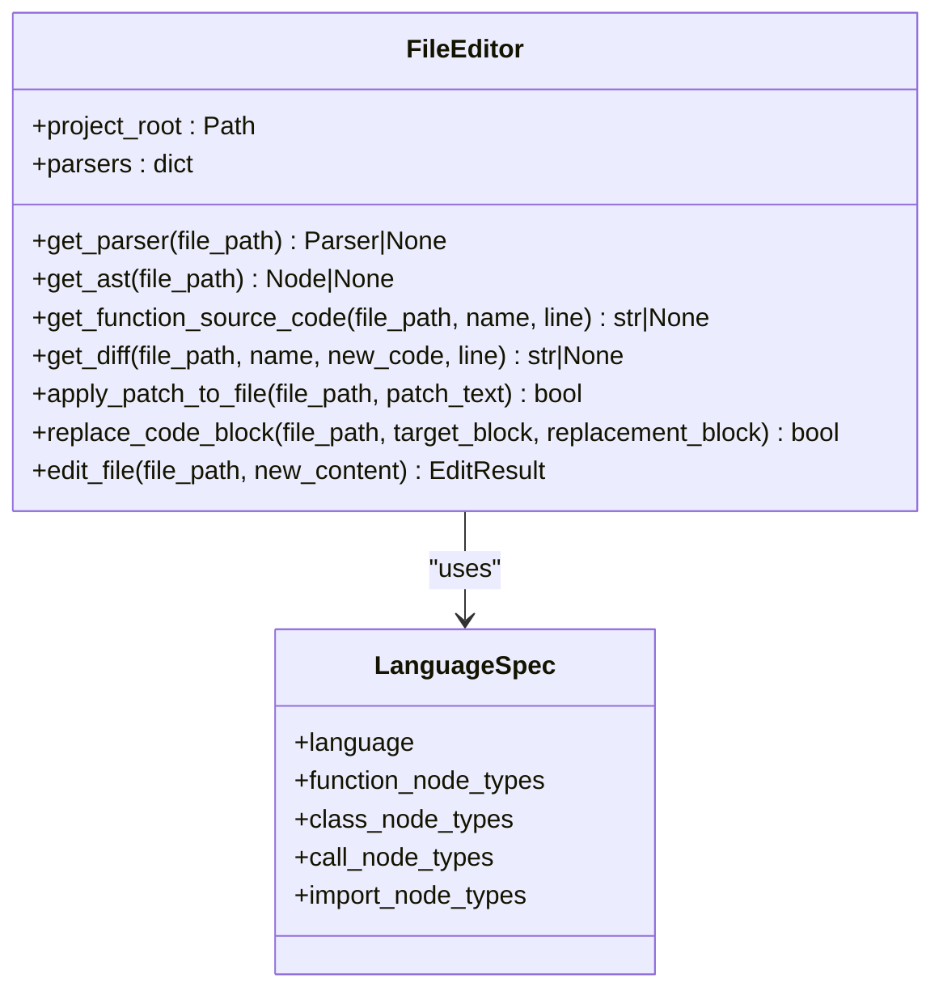
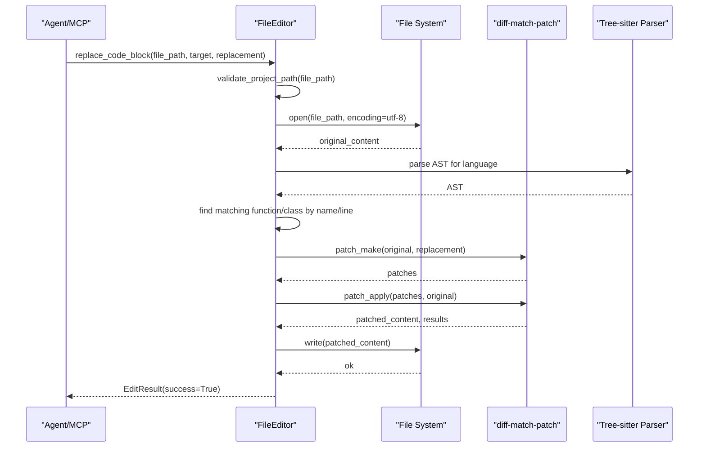
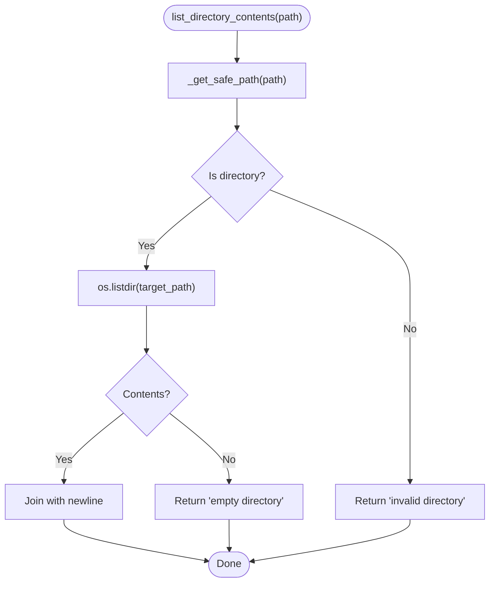
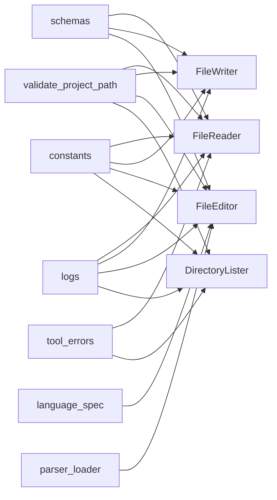

# File Operations

<cite>
**Referenced Files in This Document**
- [file_editor.py](file://codebase_rag/tools/file_editor.py)
- [file_reader.py](file://codebase_rag/tools/file_reader.py)
- [file_writer.py](file://codebase_rag/tools/file_writer.py)
- [directory_lister.py](file://codebase_rag/tools/directory_lister.py)
- [constants.py](file://codebase_rag/constants.py)
- [schemas.py](file://codebase_rag/schemas.py)
- [decorators.py](file://codebase_rag/decorators.py)
- [tool_errors.py](file://codebase_rag/tool_errors.py)
- [logs.py](file://codebase_rag/logs.py)
- [language_spec.py](file://codebase_rag/language_spec.py)
- [parser_loader.py](file://codebase_rag/parser_loader.py)
- [types_defs.py](file://codebase_rag/types_defs.py)
- [tool_descriptions.py](file://codebase_rag/tools/tool_descriptions.py)
</cite>

## Table of Contents
1. [Introduction](#introduction)
2. [Project Structure](#project-structure)
3. [Core Components](#core-components)
4. [Architecture Overview](#architecture-overview)
5. [Detailed Component Analysis](#detailed-component-analysis)
6. [Dependency Analysis](#dependency-analysis)
7. [Performance Considerations](#performance-considerations)
8. [Troubleshooting Guide](#troubleshooting-guide)
9. [Conclusion](#conclusion)

## Introduction
This document describes the Graph-Code file operations subsystem, focusing on safe, surgical code editing via AST-based targeting and diff-match-patch integration, robust file reading/writing with encoding handling, directory listing and navigation, sandboxing, approval workflows, and validation of changes prior to application. It also covers practical examples, error handling, performance considerations, and troubleshooting guidance.

## Project Structure
The file operations system is implemented as a set of focused tools:
- FileReader: reads text files safely with encoding detection and binary-file guards
- FileWriter: creates new files with UTF-8 encoding and path validation
- FileEditor: supports full-file replacement and surgical block replacement using Tree-sitter ASTs and diff-match-patch
- DirectoryLister: lists directory contents with sandbox enforcement
- Shared infrastructure: constants, schemas, decorators, logging, language specs, and parser loader

**Diagram sources**
- [file_reader.py](file://codebase_rag/tools/file_reader.py#L16-L67)
- [file_writer.py](file://codebase_rag/tools/file_writer.py#L16-L52)
- [file_editor.py](file://codebase_rag/tools/file_editor.py#L22-L296)
- [directory_lister.py](file://codebase_rag/tools/directory_lister.py#L15-L58)
- [decorators.py](file://codebase_rag/decorators.py#L55-L87)
- [constants.py](file://codebase_rag/constants.py#L45-L190)
- [schemas.py](file://codebase_rag/schemas.py#L54-L82)
- [language_spec.py](file://codebase_rag/language_spec.py#L205-L426)
- [parser_loader.py](file://codebase_rag/parser_loader.py#L276-L293)

**Section sources**
- [file_reader.py](file://codebase_rag/tools/file_reader.py#L16-L67)
- [file_writer.py](file://codebase_rag/tools/file_writer.py#L16-L52)
- [file_editor.py](file://codebase_rag/tools/file_editor.py#L22-L296)
- [directory_lister.py](file://codebase_rag/tools/directory_lister.py#L15-L58)
- [decorators.py](file://codebase_rag/decorators.py#L55-L87)
- [constants.py](file://codebase_rag/constants.py#L45-L190)
- [schemas.py](file://codebase_rag/schemas.py#L54-L82)
- [language_spec.py](file://codebase_rag/language_spec.py#L205-L426)
- [parser_loader.py](file://codebase_rag/parser_loader.py#L276-L293)

## Core Components
- FileReader: Validates path, checks for binary files, reads text with UTF-8, and returns structured results
- FileWriter: Creates directories as needed, writes UTF-8 content, and returns creation results
- FileEditor: Full-file replacement and surgical block replacement with AST-based targeting and diff-match-patch validation
- DirectoryLister: Lists directory contents with sandbox enforcement and error handling

Key shared mechanisms:
- Path validation via decorator to prevent edits outside the project root
- UTF-8 encoding for all text operations
- Rich logging and standardized error messages
- Structured result schemas for consistent tool outputs

**Section sources**
- [file_reader.py](file://codebase_rag/tools/file_reader.py#L21-L52)
- [file_writer.py](file://codebase_rag/tools/file_writer.py#L21-L39)
- [file_editor.py](file://codebase_rag/tools/file_editor.py#L255-L276)
- [directory_lister.py](file://codebase_rag/tools/directory_lister.py#L19-L33)
- [decorators.py](file://codebase_rag/decorators.py#L55-L87)
- [constants.py](file://codebase_rag/constants.py#L188-L189)
- [schemas.py](file://codebase_rag/schemas.py#L54-L82)
- [tool_errors.py](file://codebase_rag/tool_errors.py#L7-L13)
- [logs.py](file://codebase_rag/logs.py#L201-L213)

## Architecture Overview
The system enforces a strict sandbox boundary around the project root and uses decorators to validate all path arguments. FileEditor integrates Tree-sitter parsers to locate target functions/classes and diff-match-patch to compute and validate surgical changes. Results are returned via Pydantic models for consistent consumption by agents and MCP servers.

**Diagram sources**
- [file_reader.py](file://codebase_rag/tools/file_reader.py#L21-L52)
- [file_writer.py](file://codebase_rag/tools/file_writer.py#L21-L39)
- [file_editor.py](file://codebase_rag/tools/file_editor.py#L204-L246)
- [decorators.py](file://codebase_rag/decorators.py#L55-L87)
- [schemas.py](file://codebase_rag/schemas.py#L66-L82)

## Detailed Component Analysis

### FileReader
- Purpose: Safely read text files with binary-file detection and UTF-8 decoding
- Validation: Uses decorator to enforce project-root boundary
- Behavior:
  - Rejects directories and binary files
  - Reads with UTF-8; on decode errors, returns structured error
  - Logs success/failure via standardized messages
- Output: FileReadResult with content or error_message

**Diagram sources**
- [file_reader.py](file://codebase_rag/tools/file_reader.py#L21-L52)
- [constants.py](file://codebase_rag/constants.py#L50-L62)
- [tool_errors.py](file://codebase_rag/tool_errors.py#L7-L13)
- [logs.py](file://codebase_rag/logs.py#L201-L203)

**Section sources**
- [file_reader.py](file://codebase_rag/tools/file_reader.py#L21-L52)
- [constants.py](file://codebase_rag/constants.py#L50-L62)
- [tool_errors.py](file://codebase_rag/tool_errors.py#L7-L13)
- [logs.py](file://codebase_rag/logs.py#L201-L203)

### FileWriter
- Purpose: Create new files with UTF-8 content and ensure parent directories exist
- Validation: Uses decorator to enforce project-root boundary
- Behavior:
  - Ensures parent directories exist
  - Writes content with UTF-8
  - Returns success or error via FileCreationResult
- Output: FileCreationResult with success flag and optional error_message

**Diagram sources**
- [file_writer.py](file://codebase_rag/tools/file_writer.py#L21-L39)
- [constants.py](file://codebase_rag/constants.py#L188-L189)
- [schemas.py](file://codebase_rag/schemas.py#L72-L82)

**Section sources**
- [file_writer.py](file://codebase_rag/tools/file_writer.py#L21-L39)
- [schemas.py](file://codebase_rag/schemas.py#L72-L82)

### FileEditor
- Purpose: Full-file replacement and surgical code block replacement
- Safety:
  - Decorator ensures path is inside project root
  - Surgical replacement uses exact substring match and diff-match-patch validation
- AST-based targeting:
  - Loads language-specific Tree-sitter parsers
  - Builds AST and traverses to find function/class nodes by name and optionally line number
  - Generates unified diffs for preview/validation
- Diff-match-patch integration:
  - Computes patches between original and modified content
  - Applies patches and validates applicability
- Output: EditResult with success or error_message

**Diagram sources**
- [file_editor.py](file://codebase_rag/tools/file_editor.py#L22-L296)
- [language_spec.py](file://codebase_rag/language_spec.py#L205-L426)

**Diagram sources**
- [file_editor.py](file://codebase_rag/tools/file_editor.py#L204-L246)
- [parser_loader.py](file://codebase_rag/parser_loader.py#L276-L293)
- [language_spec.py](file://codebase_rag/language_spec.py#L205-L426)

**Section sources**
- [file_editor.py](file://codebase_rag/tools/file_editor.py#L22-L296)
- [parser_loader.py](file://codebase_rag/parser_loader.py#L276-L293)
- [language_spec.py](file://codebase_rag/language_spec.py#L205-L426)
- [types_defs.py](file://codebase_rag/types_defs.py#L29-L35)
- [schemas.py](file://codebase_rag/schemas.py#L54-L64)

### DirectoryLister
- Purpose: List directory contents with sandbox enforcement
- Safety: Resolves path relative to project root; raises permission error if outside root
- Behavior:
  - Validates directory existence
  - Returns newline-separated contents or appropriate error message
- Output: String result (joined contents or error message)

**Diagram sources**
- [directory_lister.py](file://codebase_rag/tools/directory_lister.py#L19-L33)
- [tool_errors.py](file://codebase_rag/tool_errors.py#L34-L36)

**Section sources**
- [directory_lister.py](file://codebase_rag/tools/directory_lister.py#L19-L33)
- [tool_errors.py](file://codebase_rag/tool_errors.py#L34-L36)

## Dependency Analysis
- Path validation: Centralized via decorator that resolves and verifies paths against project root
- Encoding: UTF-8 enforced across all text file operations
- Language support: Tree-sitter parsers loaded dynamically per language spec
- Result modeling: Pydantic models for consistent tool outputs
- Logging and errors: Standardized messages and error wrappers

**Diagram sources**
- [decorators.py](file://codebase_rag/decorators.py#L55-L87)
- [constants.py](file://codebase_rag/constants.py#L188-L189)
- [schemas.py](file://codebase_rag/schemas.py#L54-L82)
- [language_spec.py](file://codebase_rag/language_spec.py#L205-L426)
- [parser_loader.py](file://codebase_rag/parser_loader.py#L276-L293)
- [logs.py](file://codebase_rag/logs.py#L201-L213)
- [tool_errors.py](file://codebase_rag/tool_errors.py#L7-L13)

**Section sources**
- [decorators.py](file://codebase_rag/decorators.py#L55-L87)
- [constants.py](file://codebase_rag/constants.py#L188-L189)
- [schemas.py](file://codebase_rag/schemas.py#L54-L82)
- [language_spec.py](file://codebase_rag/language_spec.py#L205-L426)
- [parser_loader.py](file://codebase_rag/parser_loader.py#L276-L293)
- [logs.py](file://codebase_rag/logs.py#L201-L213)
- [tool_errors.py](file://codebase_rag/tool_errors.py#L7-L13)

## Performance Considerations
- Large files: FileReader/FileWriter operate on entire content; consider streaming or chunked operations for very large files
- AST parsing: Tree-sitter parsing overhead; reuse parsers where possible and avoid unnecessary re-parsing
- Diff-match-patch: Patch computation and application are linear in content size; batching multiple small surgical changes can reduce overhead
- Directory listing: For deep directory trees, consider limiting depth or using glob patterns to reduce IO
- Concurrency: Use async-friendly patterns for concurrent file operations; ensure thread-safe access to shared parsers

[No sources needed since this section provides general guidance]

## Troubleshooting Guide
Common issues and resolutions:
- Binary file read attempts: Use document analysis tools instead of FileReader
  - Symptom: Error indicating binary file or unicode decode failure
  - Resolution: Use analyze_document tool for PDF/images
- Permission denied or outside root:
  - Symptom: Access denied when accessing paths outside project root
  - Resolution: Ensure all paths are relative to project root and do not traverse above it
- Surgical replacement fails:
  - Symptom: Target block not found or ambiguous function name
  - Resolution: Provide exact target block; qualify function names or specify line number
- UTF-8 encoding errors:
  - Symptom: Unicode decode errors when reading text files
  - Resolution: Verify file encoding; convert to UTF-8 or handle via specialized tools
- Directory listing errors:
  - Symptom: Invalid directory or listing failures
  - Resolution: Confirm directory path exists and is accessible

**Section sources**
- [tool_errors.py](file://codebase_rag/tool_errors.py#L7-L13)
- [tool_errors.py](file://codebase_rag/tool_errors.py#L34-L36)
- [logs.py](file://codebase_rag/logs.py#L234-L261)
- [file_editor.py](file://codebase_rag/tools/file_editor.py#L107-L155)
- [directory_lister.py](file://codebase_rag/tools/directory_lister.py#L23-L33)

## Practical Examples

### Replace a code block (surgical)
- Steps:
  - Identify exact target code block
  - Prepare replacement code
  - Invoke replace_code_block with file_path, target, replacement
  - Review unified diff preview before approval
- Outcome: Only the target block is replaced; rest of file remains unchanged

**Section sources**
- [file_editor.py](file://codebase_rag/tools/file_editor.py#L204-L246)
- [tool_descriptions.py](file://codebase_rag/tools/tool_descriptions.py#L66-L71)

### Add imports to a file
- Steps:
  - Use FileReader to read current content
  - Insert import statement at top of file
  - Use FileWriter to write new content
- Outcome: New file content includes imports; no AST surgery required

**Section sources**
- [file_reader.py](file://codebase_rag/tools/file_reader.py#L21-L52)
- [file_writer.py](file://codebase_rag/tools/file_writer.py#L21-L39)

### Restructure code by moving a function
- Steps:
  - Locate function via AST-based targeting (by qualified name or line number)
  - Extract function source code
  - Modify function signature or body as needed
  - Apply surgical replacement to move/modify function in place
- Outcome: Function relocated/modified with minimal side effects

**Section sources**
- [file_editor.py](file://codebase_rag/tools/file_editor.py#L44-L155)
- [language_spec.py](file://codebase_rag/language_spec.py#L205-L426)

## Security and Approval Workflow
- Sandbox enforcement:
  - All file operations pass through validate_project_path decorator
  - Paths outside project root are rejected with access denied errors
- Approval gating:
  - Tools requiring approval are marked accordingly in tool descriptions
  - Users must confirm risky operations (e.g., surgical replacements, file creation)
- Logging:
  - All operations log start/end messages and outcomes for auditability

**Section sources**
- [decorators.py](file://codebase_rag/decorators.py#L55-L87)
- [tool_descriptions.py](file://codebase_rag/tools/tool_descriptions.py#L148-L159)
- [logs.py](file://codebase_rag/logs.py#L201-L213)

## Visual Diff Preview and Validation
- Unified diff generation:
  - get_diff computes unified diffs between original and replacement code
- Patch validation:
  - apply_patch_to_file uses diff-match-patch to compute and apply patches
  - Validation ensures patches apply cleanly; otherwise logs warnings and aborts
- Preview:
  - Use get_diff to generate textual diff for review before applying

**Section sources**
- [file_editor.py](file://codebase_rag/tools/file_editor.py#L157-L198)
- [file_editor.py](file://codebase_rag/tools/file_editor.py#L181-L203)

## Conclusion
The Graph-Code file operations system provides a secure, robust, and extensible foundation for reading, writing, and surgically modifying code. By enforcing a project-root sandbox, leveraging Tree-sitter for precise AST targeting, and integrating diff-match-patch for safe, validated changes, it minimizes risk while enabling powerful automation. The standardized schemas, logging, and error handling ensure predictable behavior across tools and agents.