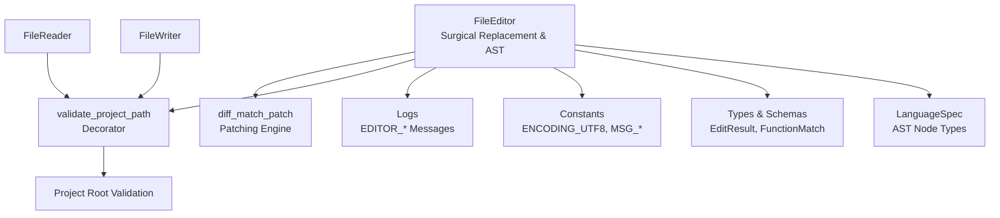
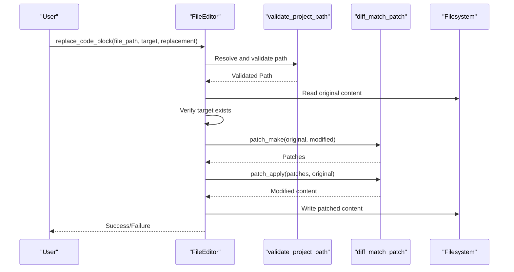
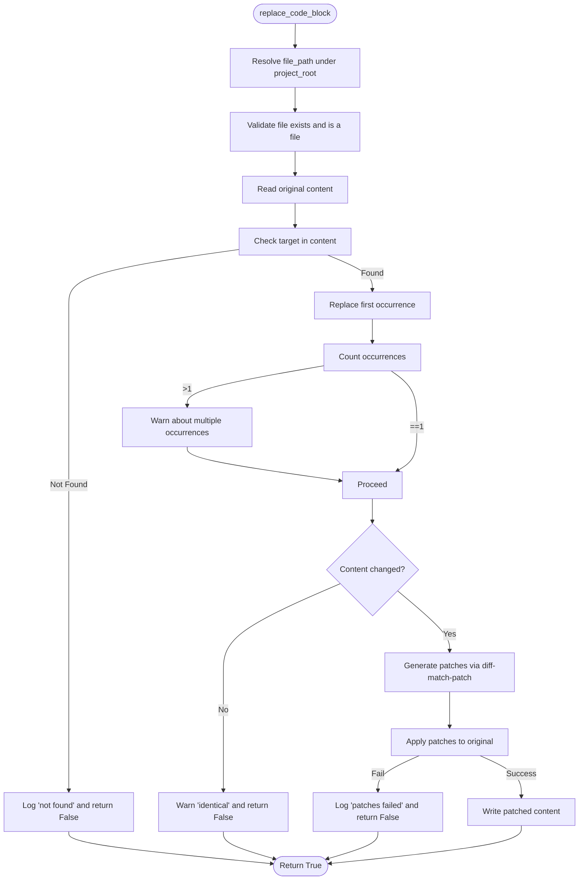
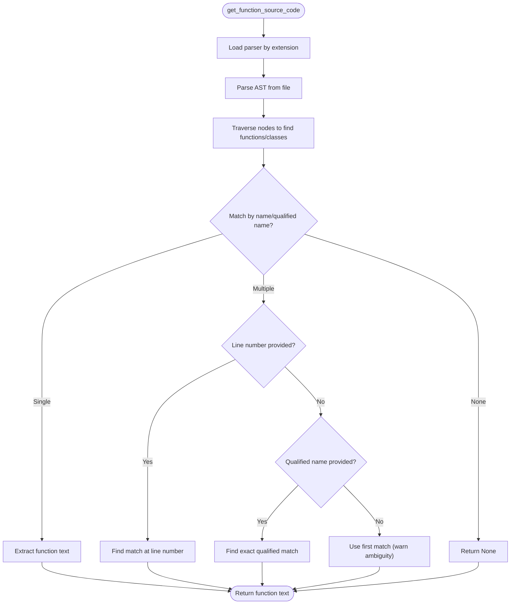
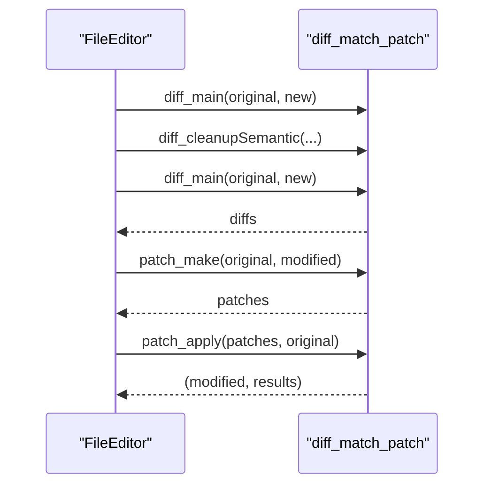
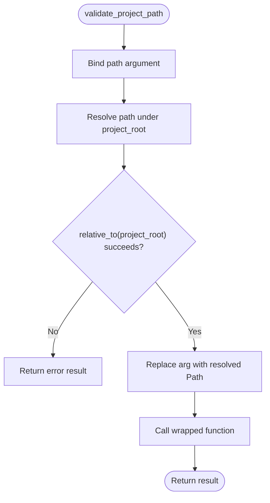
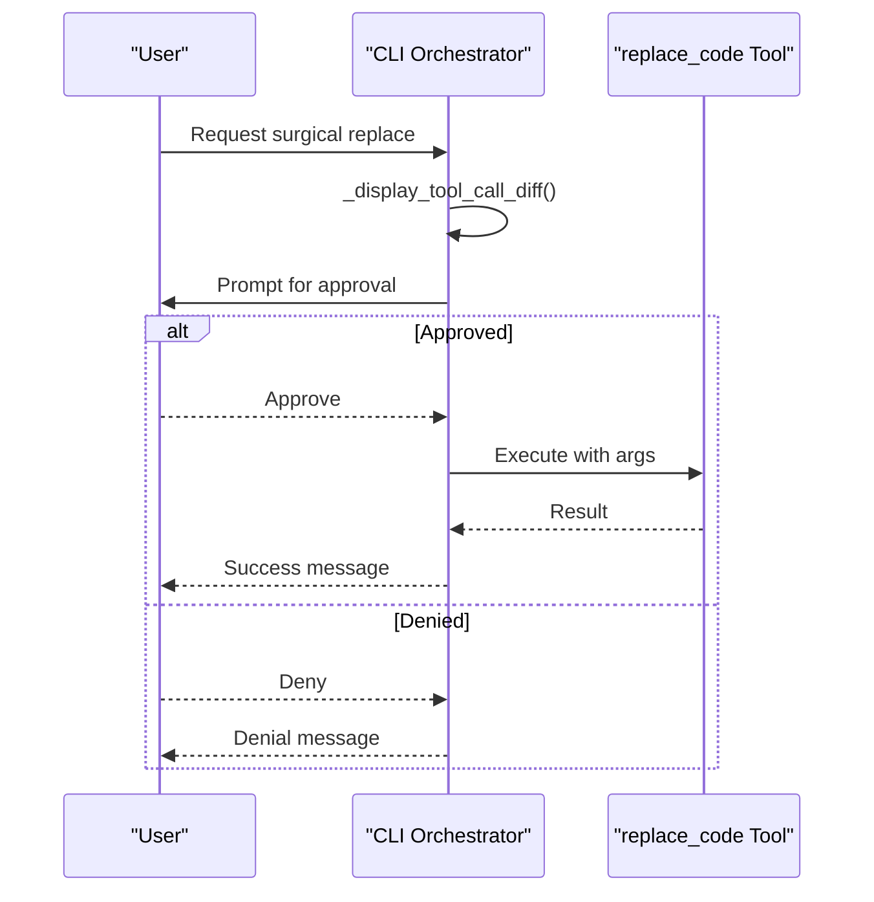
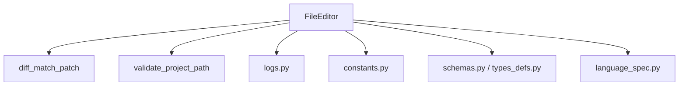

# Safe File Editing

<cite>
**Referenced Files in This Document**
- [file_editor.py](file://codebase_rag/tools/file_editor.py)
- [decorators.py](file://codebase_rag/decorators.py)
- [logs.py](file://codebase_rag/logs.py)
- [constants.py](file://codebase_rag/constants.py)
- [schemas.py](file://codebase_rag/schemas.py)
- [types_defs.py](file://codebase_rag/types_defs.py)
- [language_spec.py](file://codebase_rag/language_spec.py)
- [test_file_editor.py](file://codebase_rag/tests/test_file_editor.py)
- [test_mcp_surgical_replace.py](file://codebase_rag/tests/test_mcp_surgical_replace.py)
- [main.py](file://codebase_rag/main.py)
- [tool_descriptions.py](file://codebase_rag/tools/tool_descriptions.py)
</cite>

## Table of Contents
1. [Introduction](#introduction)
2. [Project Structure](#project-structure)
3. [Core Components](#core-components)
4. [Architecture Overview](#architecture-overview)
5. [Detailed Component Analysis](#detailed-component-analysis)
6. [Dependency Analysis](#dependency-analysis)
7. [Performance Considerations](#performance-considerations)
8. [Troubleshooting Guide](#troubleshooting-guide)
9. [Conclusion](#conclusion)

## Introduction
This document describes the safe file editing system in Graph-Code, focusing on surgical code replacement using AST-based targeting and diff-match-patch integration. It explains the security sandbox that validates file paths against the project root, the approval workflow for file modifications, and how the system handles ambiguous function matches. Practical examples illustrate surgical replacements, diff visualization, and error handling scenarios. Validation processes and logging are documented to track all editing activities.

## Project Structure
The safe file editing system spans several modules:
- Tools: FileEditor for surgical replacements, FileReader/FileWriter for read/write operations, and shell/command tools for system-level actions.
- Infrastructure: Decorators for path validation and approvals, language specifications for AST parsing, and logging constants.
- Tests: Unit and integration tests validating security, ambiguity handling, and MCP surgical replace behavior.

**Diagram sources**
- [file_editor.py](file://codebase_rag/tools/file_editor.py#L22-L296)
- [decorators.py](file://codebase_rag/decorators.py#L55-L87)
- [language_spec.py](file://codebase_rag/language_spec.py#L205-L426)
- [constants.py](file://codebase_rag/constants.py#L188-L190)
- [schemas.py](file://codebase_rag/schemas.py#L54-L82)
- [types_defs.py](file://codebase_rag/types_defs.py#L29-L35)

**Section sources**
- [file_editor.py](file://codebase_rag/tools/file_editor.py#L1-L296)
- [decorators.py](file://codebase_rag/decorators.py#L1-L161)
- [language_spec.py](file://codebase_rag/language_spec.py#L1-L426)

## Core Components
- FileEditor: Implements surgical code replacement, AST-based function targeting, diff visualization, and patch application via diff-match-patch.
- validate_project_path: Enforces a security sandbox by resolving and validating file paths within the project root.
- Logs: Centralized logging for all file editing operations, warnings, and errors.
- Constants: Encoding, message templates, and diff markers used across tools.
- Schemas and Types: Strongly typed results and function match structures for robust operation reporting.

Key responsibilities:
- Surgical replacement: Exact substring replacement with patch verification.
- AST targeting: Language-aware function/class discovery and selection.
- Approval workflow: Tools requiring user approval for sensitive operations.
- Logging: Comprehensive audit trail for all edits.

**Section sources**
- [file_editor.py](file://codebase_rag/tools/file_editor.py#L22-L296)
- [decorators.py](file://codebase_rag/decorators.py#L55-L87)
- [logs.py](file://codebase_rag/logs.py#L233-L320)
- [constants.py](file://codebase_rag/constants.py#L188-L190)
- [schemas.py](file://codebase_rag/schemas.py#L54-L82)
- [types_defs.py](file://codebase_rag/types_defs.py#L29-L35)

## Architecture Overview
The system integrates AST parsing, diff-match-patch, and a strict security sandbox enforced by a decorator. Approval-driven tools ensure user consent for risky operations.

**Diagram sources**
- [file_editor.py](file://codebase_rag/tools/file_editor.py#L204-L253)
- [decorators.py](file://codebase_rag/decorators.py#L55-L87)

## Detailed Component Analysis

### Surgical Code Replacement Mechanism
- Exact block replacement: Finds the first occurrence of the target substring and replaces it.
- Patch verification: Generates patches from original vs. modified content and applies them to ensure correctness.
- Ambiguity handling: When multiple matches exist, only the first is replaced, and a warning is logged.

**Diagram sources**
- [file_editor.py](file://codebase_rag/tools/file_editor.py#L204-L253)

**Section sources**
- [file_editor.py](file://codebase_rag/tools/file_editor.py#L204-L253)

### AST-Based Targeting and Function Matching
- Parser selection: Uses language-specific Tree-sitter parsers mapped by file extension.
- AST traversal: Recursively finds function/class nodes and extracts qualified names.
- Ambiguity resolution: 
  - If multiple matches exist, logs details and uses the first match.
  - If a line number is provided, attempts to select the function at that line.
  - If a qualified name is provided (e.g., "Class.method"), prefers exact qualified match.

**Diagram sources**
- [file_editor.py](file://codebase_rag/tools/file_editor.py#L44-L155)
- [language_spec.py](file://codebase_rag/language_spec.py#L205-L426)

**Section sources**
- [file_editor.py](file://codebase_rag/tools/file_editor.py#L44-L155)
- [language_spec.py](file://codebase_rag/language_spec.py#L205-L426)

### Diff-Match-Patch Integration
- Unified diff generation: Provides human-readable diffs for proposed changes.
- Patch application: Ensures the replacement is semantically correct before writing.

**Diagram sources**
- [file_editor.py](file://codebase_rag/tools/file_editor.py#L157-L179)
- [file_editor.py](file://codebase_rag/tools/file_editor.py#L181-L202)

**Section sources**
- [file_editor.py](file://codebase_rag/tools/file_editor.py#L157-L202)

### Security Sandbox and Path Validation
- Path resolution: Resolves the absolute path under the configured project root.
- Root containment: Ensures the resolved path remains within the project root; otherwise, rejects the operation.
- Decorator usage: Applied to file read/write/edit operations to enforce validation.

**Diagram sources**
- [decorators.py](file://codebase_rag/decorators.py#L55-L87)

**Section sources**
- [decorators.py](file://codebase_rag/decorators.py#L55-L87)

### Approval Workflow
- Tools requiring approval: Surgical replacement and file creation are marked as requiring approval.
- CLI approval flow: The CLI displays unified diffs and prompts for confirmation before executing approved changes.
- MCP integration: Surgical replace is exposed via MCP with input schema and requires approval.

**Diagram sources**
- [main.py](file://codebase_rag/main.py#L185-L248)
- [tool_descriptions.py](file://codebase_rag/tools/tool_descriptions.py#L8-L19)
- [test_mcp_surgical_replace.py](file://codebase_rag/tests/test_mcp_surgical_replace.py#L157-L184)

**Section sources**
- [main.py](file://codebase_rag/main.py#L185-L248)
- [tool_descriptions.py](file://codebase_rag/tools/tool_descriptions.py#L8-L19)
- [test_mcp_surgical_replace.py](file://codebase_rag/tests/test_mcp_surgical_replace.py#L157-L184)

### Practical Examples

- Surgical replacement in a Python function:
  - Target: exact function body text
  - Replacement: updated function body
  - Outcome: only the first occurrence is replaced; multiple matches trigger a warning

- Diff visualization:
  - Use get_diff to compare original vs. new function code and display unified diff

- Error handling scenarios:
  - Target not found in file
  - Multiple occurrences of target
  - Identical content (no changes)
  - Path outside project root
  - Permission errors (read-only files)

**Section sources**
- [file_editor.py](file://codebase_rag/tools/file_editor.py#L157-L253)
- [test_file_editor.py](file://codebase_rag/tests/test_file_editor.py#L154-L306)
- [test_mcp_surgical_replace.py](file://codebase_rag/tests/test_mcp_surgical_replace.py#L213-L317)

## Dependency Analysis
- FileEditor depends on:
  - diff_match_patch for patch generation and application
  - Tree-sitter parsers via language_spec for AST parsing
  - validate_project_path decorator for sandbox enforcement
  - logs and constants for messaging and encoding
  - schemas and types for structured results and function match data

**Diagram sources**
- [file_editor.py](file://codebase_rag/tools/file_editor.py#L1-L28)
- [language_spec.py](file://codebase_rag/language_spec.py#L1-L10)
- [schemas.py](file://codebase_rag/schemas.py#L1-L82)
- [types_defs.py](file://codebase_rag/types_defs.py#L1-L55)
- [decorators.py](file://codebase_rag/decorators.py#L1-L16)

**Section sources**
- [file_editor.py](file://codebase_rag/tools/file_editor.py#L1-L28)
- [language_spec.py](file://codebase_rag/language_spec.py#L1-L10)
- [schemas.py](file://codebase_rag/schemas.py#L1-L82)
- [types_defs.py](file://codebase_rag/types_defs.py#L1-L55)
- [decorators.py](file://codebase_rag/decorators.py#L1-L16)

## Performance Considerations
- AST parsing overhead: Parsing large files incurs cost; caching ASTs externally (as part of the broader codebase ingestion) reduces repeated parsing.
- Patch application cost: diff-match-patch operations are efficient for moderate-sized diffs; very large files may benefit from targeted replacement strategies.
- Logging impact: Extensive logging aids auditing but can increase I/O; adjust log levels in production environments.

## Troubleshooting Guide
Common issues and resolutions:
- Path outside root: Ensure file_path is relative to project root; absolute paths outside root are rejected.
- Target not found: Verify exact target text matches the file content; consider using qualified names or line numbers for precision.
- Multiple matches: Narrow the target to a unique substring or provide a line number/qualified name.
- Permission denied: Check file permissions; read-only files cannot be edited.
- Patches failed: Review the unified diff; ensure the replacement preserves syntax validity.

Validation and logging references:
- Security risk logs: FILE_OUTSIDE_ROOT
- Surgical replacement logs: EDITOR_FILE_NOT_FOUND, EDITOR_BLOCK_NOT_FOUND, EDITOR_MULTIPLE_OCCURRENCES, EDITOR_NO_CHANGES_IDENTICAL, EDITOR_PATCH_FAILED, EDITOR_SURGICAL_FAILED
- Tool operation logs: TOOL_FILE_EDIT, TOOL_FILE_EDIT_SURGICAL, TOOL_FILE_EDIT_SURGICAL_SUCCESS

**Section sources**
- [logs.py](file://codebase_rag/logs.py#L319-L320)
- [logs.py](file://codebase_rag/logs.py#L251-L261)
- [logs.py](file://codebase_rag/logs.py#L206-L213)
- [file_editor.py](file://codebase_rag/tools/file_editor.py#L204-L253)

## Conclusion
The safe file editing system combines AST-based targeting, precise substring replacement, and robust patch verification to achieve surgical edits. A strict security sandbox prevents unauthorized access outside the project root, while an approval workflow ensures user consent for sensitive operations. Comprehensive logging and testing provide visibility and reliability across diverse scenarios.