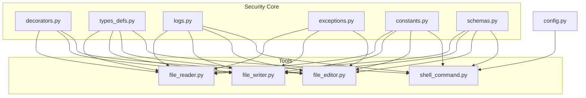
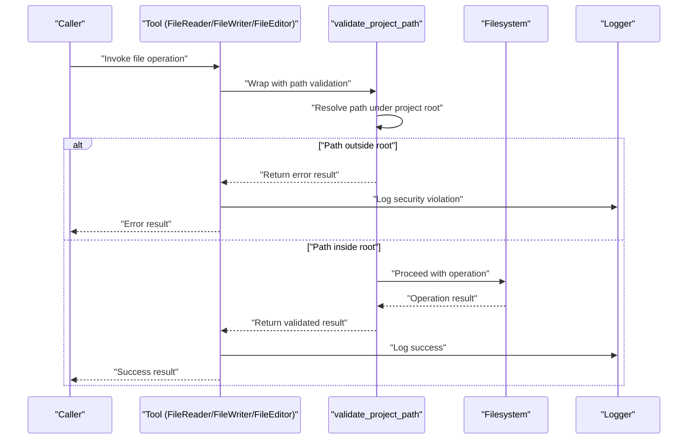
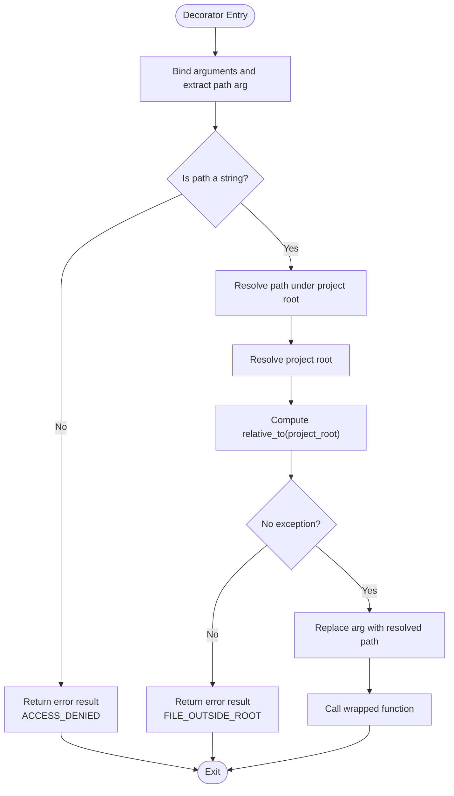
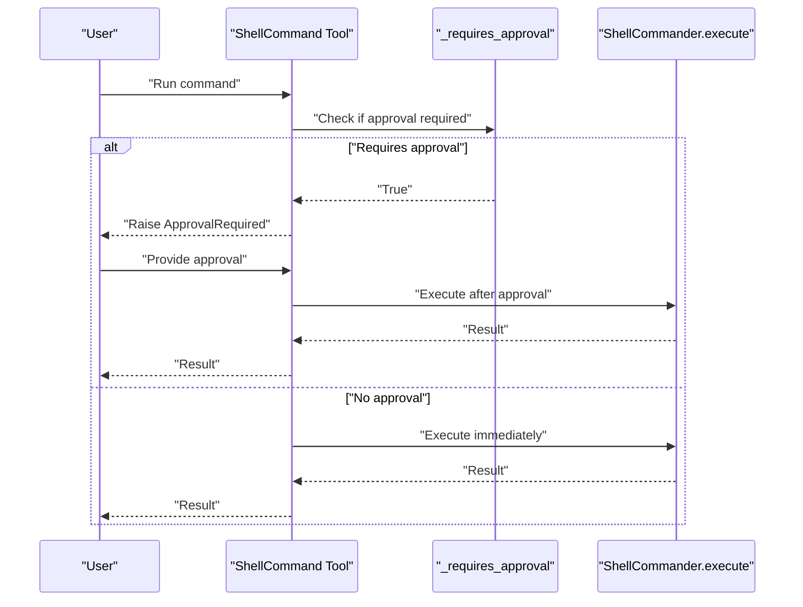
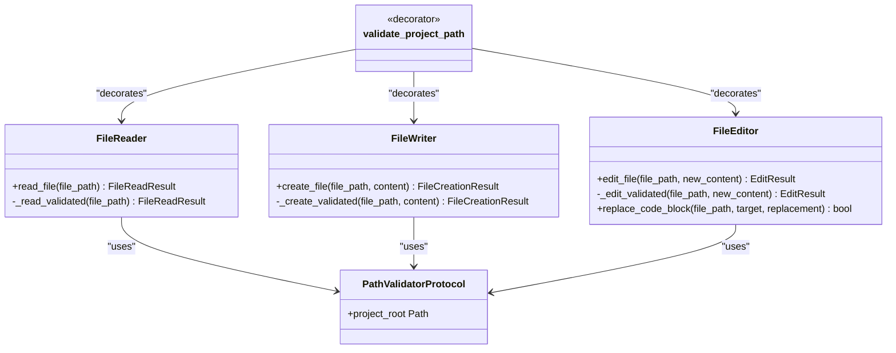
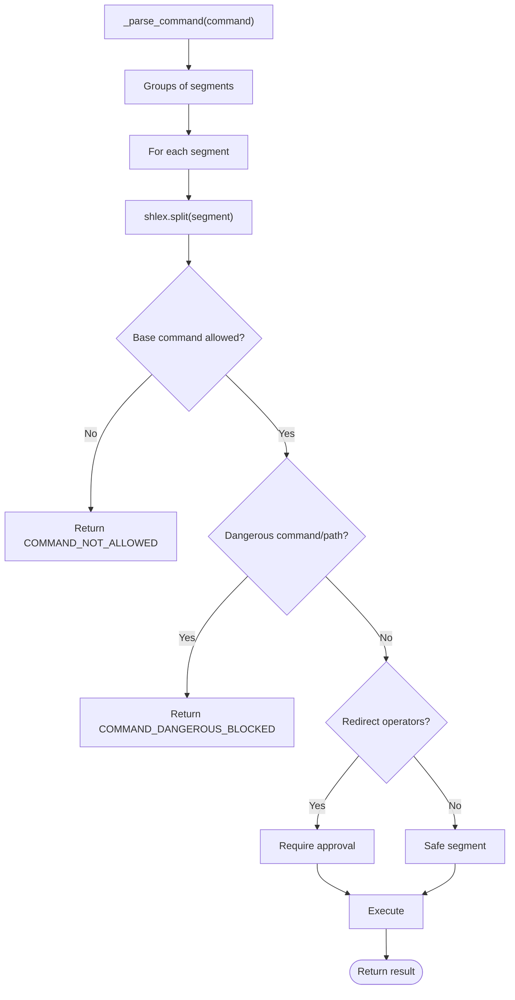
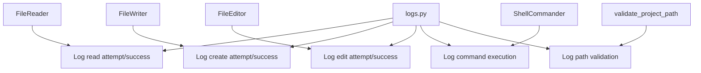
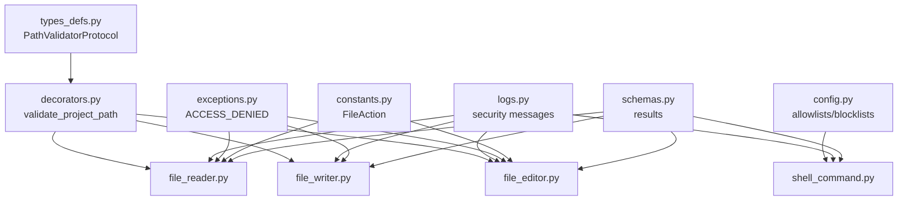

# Security Sandbox

<cite>
**Referenced Files in This Document**
- [decorators.py](file://codebase_rag/decorators.py)
- [exceptions.py](file://codebase_rag/exceptions.py)
- [logs.py](file://codebase_rag/logs.py)
- [config.py](file://codebase_rag/config.py)
- [types_defs.py](file://codebase_rag/types_defs.py)
- [constants.py](file://codebase_rag/constants.py)
- [schemas.py](file://codebase_rag/schemas.py)
- [file_reader.py](file://codebase_rag/tools/file_reader.py)
- [file_writer.py](file://codebase_rag/tools/file_writer.py)
- [file_editor.py](file://codebase_rag/tools/file_editor.py)
- [shell_command.py](file://codebase_rag/tools/shell_command.py)
</cite>

## Table of Contents
1. [Introduction](#introduction)
2. [Project Structure](#project-structure)
3. [Core Components](#core-components)
4. [Architecture Overview](#architecture-overview)
5. [Detailed Component Analysis](#detailed-component-analysis)
6. [Dependency Analysis](#dependency-analysis)
7. [Performance Considerations](#performance-considerations)
8. [Troubleshooting Guide](#troubleshooting-guide)
9. [Conclusion](#conclusion)
10. [Appendices](#appendices)

## Introduction
This document describes the security sandbox system that protects against unauthorized file operations. It explains the path validation mechanism ensuring all file operations occur within the project root, the decorator-based security checks and their integration with the approval workflow, file action permissions and restrictions, logging and auditing capabilities, and configuration options for customizing security policies. It also covers how security checks relate to user approvals and provides examples of security violations and prevention mechanisms.

## Project Structure
The security sandbox spans several modules:
- Decorators and protocols define cross-cutting security checks and shared interfaces.
- Tools implement file operations with enforced path validation and approval gating.
- Configuration defines allowlists and policy lists.
- Logging records security-relevant events.
- Constants enumerate actions and policy patterns.

**Diagram sources**
- [decorators.py](file://codebase_rag/decorators.py#L55-L87)
- [types_defs.py](file://codebase_rag/types_defs.py#L128-L131)
- [logs.py](file://codebase_rag/logs.py#L319-L320)
- [exceptions.py](file://codebase_rag/exceptions.py#L53)
- [constants.py](file://codebase_rag/constants.py#L45-L48)
- [schemas.py](file://codebase_rag/schemas.py#L48-L81)
- [file_reader.py](file://codebase_rag/tools/file_reader.py#L16-L53)
- [file_writer.py](file://codebase_rag/tools/file_writer.py#L16-L40)
- [file_editor.py](file://codebase_rag/tools/file_editor.py#L22-L277)
- [shell_command.py](file://codebase_rag/tools/shell_command.py#L262-L435)
- [config.py](file://codebase_rag/config.py#L82-L142)

**Section sources**
- [decorators.py](file://codebase_rag/decorators.py#L55-L87)
- [types_defs.py](file://codebase_rag/types_defs.py#L128-L131)
- [file_reader.py](file://codebase_rag/tools/file_reader.py#L16-L53)
- [file_writer.py](file://codebase_rag/tools/file_writer.py#L16-L40)
- [file_editor.py](file://codebase_rag/tools/file_editor.py#L22-L277)
- [shell_command.py](file://codebase_rag/tools/shell_command.py#L262-L435)
- [config.py](file://codebase_rag/config.py#L82-L142)
- [logs.py](file://codebase_rag/logs.py#L319-L320)
- [exceptions.py](file://codebase_rag/exceptions.py#L53)
- [constants.py](file://codebase_rag/constants.py#L45-L48)
- [schemas.py](file://codebase_rag/schemas.py#L48-L81)

## Core Components
- Path validation decorator: Enforces that file paths resolve within the project root and rejects out-of-root operations.
- Protocol contracts: Define the project root surface used by validators.
- Tool wrappers: FileReader, FileWriter, FileEditor, and ShellCommander apply security checks and produce structured results.
- Configuration-driven policies: Allowlists and blocklists govern shell commands and read-only operations.
- Logging and auditing: Security-relevant events are logged for visibility and compliance.
- Exceptions and error messages: Standardized messages for access denials and policy violations.

Key implementation references:
- Path validation decorator and guards: [decorators.py](file://codebase_rag/decorators.py#L55-L87), [decorators.py](file://codebase_rag/decorators.py#L93-L125)
- Path validator protocol: [types_defs.py](file://codebase_rag/types_defs.py#L128-L131)
- File tools with validation: [file_reader.py](file://codebase_rag/tools/file_reader.py#L21-L53), [file_writer.py](file://codebase_rag/tools/file_writer.py#L21-L40), [file_editor.py](file://codebase_rag/tools/file_editor.py#L255-L277)
- Shell command security: [shell_command.py](file://codebase_rag/tools/shell_command.py#L222-L259), [shell_command.py](file://codebase_rag/tools/shell_command.py#L124-L160), [shell_command.py](file://codebase_rag/tools/shell_command.py#L194-L220)
- Policies and configuration: [config.py](file://codebase_rag/config.py#L82-L142)
- Logging and error messages: [logs.py](file://codebase_rag/logs.py#L319-L320), [exceptions.py](file://codebase_rag/exceptions.py#L53)
- File action enumeration: [constants.py](file://codebase_rag/constants.py#L45-L48)
- Result schemas: [schemas.py](file://codebase_rag/schemas.py#L48-L81)

**Section sources**
- [decorators.py](file://codebase_rag/decorators.py#L55-L87)
- [types_defs.py](file://codebase_rag/types_defs.py#L128-L131)
- [file_reader.py](file://codebase_rag/tools/file_reader.py#L21-L53)
- [file_writer.py](file://codebase_rag/tools/file_writer.py#L21-L40)
- [file_editor.py](file://codebase_rag/tools/file_editor.py#L255-L277)
- [shell_command.py](file://codebase_rag/tools/shell_command.py#L222-L259)
- [config.py](file://codebase_rag/config.py#L82-L142)
- [logs.py](file://codebase_rag/logs.py#L319-L320)
- [exceptions.py](file://codebase_rag/exceptions.py#L53)
- [constants.py](file://codebase_rag/constants.py#L45-L48)
- [schemas.py](file://codebase_rag/schemas.py#L48-L81)

## Architecture Overview
The security sandbox enforces a layered approach:
- Path validation runs before any file operation to ensure confinement within the project root.
- Tools encapsulate operations and return structured results, enabling consistent error handling.
- Shell commands are parsed into pipeline segments, validated against allowlists and blocklists, and gated by approval requirements.
- Logging captures security-relevant events for auditing and incident response.
- Configuration controls policy enforcement via allowlists and blocklists.

**Diagram sources**
- [decorators.py](file://codebase_rag/decorators.py#L55-L87)
- [file_reader.py](file://codebase_rag/tools/file_reader.py#L21-L53)
- [file_writer.py](file://codebase_rag/tools/file_writer.py#L21-L40)
- [file_editor.py](file://codebase_rag/tools/file_editor.py#L255-L277)
- [logs.py](file://codebase_rag/logs.py#L201-L213)

## Detailed Component Analysis

### Path Validation Mechanism
The path validation decorator resolves the requested path under the project root and verifies it remains within the root. It rejects non-string inputs and paths that escape the root, returning a standardized error result.

**Diagram sources**
- [decorators.py](file://codebase_rag/decorators.py#L55-L87)
- [exceptions.py](file://codebase_rag/exceptions.py#L53)
- [logs.py](file://codebase_rag/logs.py#L319)

**Section sources**
- [decorators.py](file://codebase_rag/decorators.py#L55-L87)
- [exceptions.py](file://codebase_rag/exceptions.py#L53)
- [logs.py](file://codebase_rag/logs.py#L319)

### Decorator-Based Security Checks and Approval Workflow
- Recursion guard prevents repeated invocations in recursive scenarios.
- Timing decorators instrument performance.
- Log operation decorator centralizes start/end logging.
- MCP try/except normalizes exceptions into error results.

Approval integration:
- ShellCommander determines whether a command requires user approval based on policy checks. If approval is required and not granted, the tool raises an explicit approval-required signal.

**Diagram sources**
- [shell_command.py](file://codebase_rag/tools/shell_command.py#L222-L259)
- [shell_command.py](file://codebase_rag/tools/shell_command.py#L422-L435)

**Section sources**
- [decorators.py](file://codebase_rag/decorators.py#L93-L125)
- [decorators.py](file://codebase_rag/decorators.py#L128-L161)
- [shell_command.py](file://codebase_rag/tools/shell_command.py#L222-L259)
- [shell_command.py](file://codebase_rag/tools/shell_command.py#L422-L435)

### File Action Permissions and Restrictions
- File read: Allowed with path validation; binary files are rejected with a warning.
- File creation: Allowed with path validation; requires approval at the tool level.
- Full-file edit: Allowed with path validation; requires approval at the tool level.
- Surgical edit: Allowed within root; direct path checks enforce confinement; violations are logged.

**Diagram sources**
- [file_reader.py](file://codebase_rag/tools/file_reader.py#L16-L53)
- [file_writer.py](file://codebase_rag/tools/file_writer.py#L16-L40)
- [file_editor.py](file://codebase_rag/tools/file_editor.py#L22-L277)
- [types_defs.py](file://codebase_rag/types_defs.py#L128-L131)
- [decorators.py](file://codebase_rag/decorators.py#L55-L87)

**Section sources**
- [file_reader.py](file://codebase_rag/tools/file_reader.py#L21-L53)
- [file_writer.py](file://codebase_rag/tools/file_writer.py#L21-L40)
- [file_editor.py](file://codebase_rag/tools/file_editor.py#L255-L277)
- [types_defs.py](file://codebase_rag/types_defs.py#L128-L131)
- [decorators.py](file://codebase_rag/decorators.py#L55-L87)

### Shell Command Security Policy
Shell commands are parsed into pipeline segments and validated:
- Subshell detection blocks potentially dangerous constructs.
- Pipeline and segment patterns block risky operators and sequences.
- Allowlist enforces permitted commands; read-only commands bypass approval.
- Dangerous commands (e.g., rm with r and f) and paths targeting system directories are blocked.
- Approval is required when the command is not purely read-only or safe.

**Diagram sources**
- [shell_command.py](file://codebase_rag/tools/shell_command.py#L63-L121)
- [shell_command.py](file://codebase_rag/tools/shell_command.py#L194-L220)
- [shell_command.py](file://codebase_rag/tools/shell_command.py#L222-L259)
- [shell_command.py](file://codebase_rag/tools/shell_command.py#L311-L420)
- [config.py](file://codebase_rag/config.py#L82-L142)

**Section sources**
- [shell_command.py](file://codebase_rag/tools/shell_command.py#L63-L121)
- [shell_command.py](file://codebase_rag/tools/shell_command.py#L194-L220)
- [shell_command.py](file://codebase_rag/tools/shell_command.py#L222-L259)
- [shell_command.py](file://codebase_rag/tools/shell_command.py#L311-L420)
- [config.py](file://codebase_rag/config.py#L82-L142)

### Logging and Auditing
Security-relevant events are logged for visibility:
- File reader/writer/editor operations log attempts and outcomes.
- Shell command execution logs are recorded with return codes and outputs.
- Path outside root violations are logged with standardized messages.

**Diagram sources**
- [file_reader.py](file://codebase_rag/tools/file_reader.py#L21-L53)
- [file_writer.py](file://codebase_rag/tools/file_writer.py#L21-L40)
- [file_editor.py](file://codebase_rag/tools/file_editor.py#L255-L277)
- [shell_command.py](file://codebase_rag/tools/shell_command.py#L311-L420)
- [decorators.py](file://codebase_rag/decorators.py#L55-L87)
- [logs.py](file://codebase_rag/logs.py#L201-L224)

**Section sources**
- [file_reader.py](file://codebase_rag/tools/file_reader.py#L21-L53)
- [file_writer.py](file://codebase_rag/tools/file_writer.py#L21-L40)
- [file_editor.py](file://codebase_rag/tools/file_editor.py#L255-L277)
- [shell_command.py](file://codebase_rag/tools/shell_command.py#L311-L420)
- [decorators.py](file://codebase_rag/decorators.py#L55-L87)
- [logs.py](file://codebase_rag/logs.py#L201-L224)

### Configuration Options for Customizing Security Policies
- Shell command allowlist: Controls which commands are permitted.
- Read-only command set: Commands that do not require approval.
- Safe git subcommands: Whitelisted git subcommands that bypass approval.
- Binary file handling: Binary extensions are rejected by file readers.

Policy configuration locations:
- Allowlist and read-only sets: [config.py](file://codebase_rag/config.py#L82-L142)
- Binary extensions: [constants.py](file://codebase_rag/constants.py#L50-L62)

**Section sources**
- [config.py](file://codebase_rag/config.py#L82-L142)
- [constants.py](file://codebase_rag/constants.py#L50-L62)

## Dependency Analysis
The security sandbox relies on:
- Protocol contracts to expose the project root to validators.
- Decorators to enforce path validation uniformly across tools.
- Configuration to define policy boundaries.
- Logging to record security events.
- Result schemas to standardize outcomes.

**Diagram sources**
- [types_defs.py](file://codebase_rag/types_defs.py#L128-L131)
- [decorators.py](file://codebase_rag/decorators.py#L55-L87)
- [file_reader.py](file://codebase_rag/tools/file_reader.py#L21-L53)
- [file_writer.py](file://codebase_rag/tools/file_writer.py#L21-L40)
- [file_editor.py](file://codebase_rag/tools/file_editor.py#L255-L277)
- [config.py](file://codebase_rag/config.py#L82-L142)
- [logs.py](file://codebase_rag/logs.py#L319-L320)
- [exceptions.py](file://codebase_rag/exceptions.py#L53)
- [constants.py](file://codebase_rag/constants.py#L45-L48)
- [schemas.py](file://codebase_rag/schemas.py#L48-L81)

**Section sources**
- [types_defs.py](file://codebase_rag/types_defs.py#L128-L131)
- [decorators.py](file://codebase_rag/decorators.py#L55-L87)
- [file_reader.py](file://codebase_rag/tools/file_reader.py#L21-L53)
- [file_writer.py](file://codebase_rag/tools/file_writer.py#L21-L40)
- [file_editor.py](file://codebase_rag/tools/file_editor.py#L255-L277)
- [config.py](file://codebase_rag/config.py#L82-L142)
- [logs.py](file://codebase_rag/logs.py#L319-L320)
- [exceptions.py](file://codebase_rag/exceptions.py#L53)
- [constants.py](file://codebase_rag/constants.py#L45-L48)
- [schemas.py](file://codebase_rag/schemas.py#L48-L81)

## Performance Considerations
- Path resolution and relative-to checks are O(1) per call; overhead is minimal.
- Shell command parsing and validation add linear complexity proportional to command length; caching or precompilation could reduce regex overhead if needed.
- Logging adds I/O overhead; ensure appropriate log levels in production.

## Troubleshooting Guide
Common issues and resolutions:
- Access denied errors: Indicates the path is outside the project root or not a string. Verify the path argument and project root configuration.
  - Reference: [exceptions.py](file://codebase_rag/exceptions.py#L53), [logs.py](file://codebase_rag/logs.py#L319)
- Binary file read failures: Binary extensions are intentionally rejected. Convert or handle binary content externally.
  - Reference: [file_reader.py](file://codebase_rag/tools/file_reader.py#L33-L36)
- Shell command blocked: Check the allowlist and blocklist configurations; ensure the command is permitted and not flagged as dangerous.
  - Reference: [config.py](file://codebase_rag/config.py#L82-L142), [shell_command.py](file://codebase_rag/tools/shell_command.py#L194-L220)
- Approval required for shell commands: Review the approval gating logic and adjust command composition to remain within read-only or safe categories.
  - Reference: [shell_command.py](file://codebase_rag/tools/shell_command.py#L222-L259), [shell_command.py](file://codebase_rag/tools/shell_command.py#L422-L435)

**Section sources**
- [exceptions.py](file://codebase_rag/exceptions.py#L53)
- [logs.py](file://codebase_rag/logs.py#L319)
- [file_reader.py](file://codebase_rag/tools/file_reader.py#L33-L36)
- [config.py](file://codebase_rag/config.py#L82-L142)
- [shell_command.py](file://codebase_rag/tools/shell_command.py#L194-L220)
- [shell_command.py](file://codebase_rag/tools/shell_command.py#L222-L259)
- [shell_command.py](file://codebase_rag/tools/shell_command.py#L422-L435)

## Conclusion
The security sandbox enforces strict containment of file operations within the project root, integrates approval workflows for risky operations, and provides comprehensive logging for auditing. Configuration allows customization of policy boundaries, while standardized schemas and exceptions ensure predictable behavior across tools.

## Appendices

### File Action Permissions Summary
- Read: Allowed with path validation; binary files rejected.
- Create: Allowed with path validation; requires approval.
- Edit (full-file): Allowed with path validation; requires approval.
- Edit (surgical): Allowed within root; violations logged.

**Section sources**
- [file_reader.py](file://codebase_rag/tools/file_reader.py#L21-L53)
- [file_writer.py](file://codebase_rag/tools/file_writer.py#L21-L40)
- [file_editor.py](file://codebase_rag/tools/file_editor.py#L255-L277)
- [constants.py](file://codebase_rag/constants.py#L45-L48)