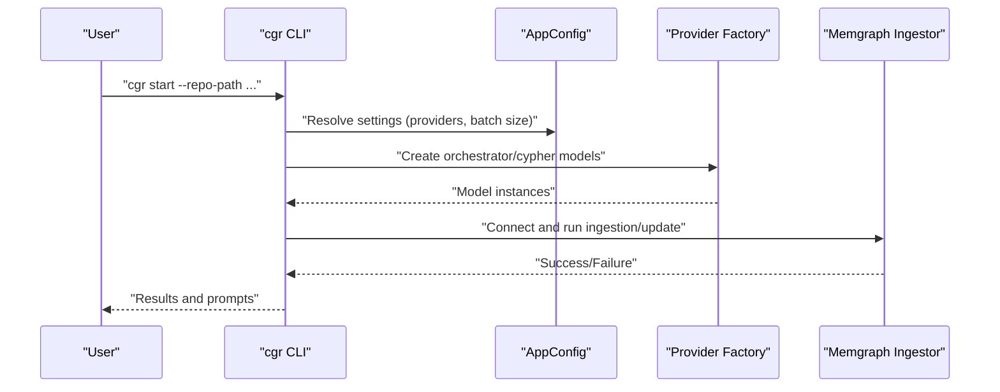
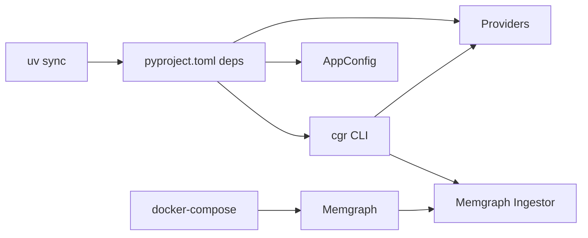
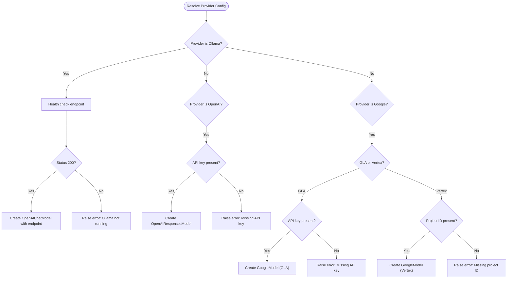

# Getting Started

<cite>
**Referenced Files in This Document**
- [README.md](file://README.md)
- [QUICK_START.md](file://QUICK_START.md)
- [pyproject.toml](file://pyproject.toml)
- [docker-compose.yaml](file://docker-compose.yaml)
- [Makefile](file://Makefile)
- [codebase_rag/cli.py](file://codebase_rag/cli.py)
- [codebase_rag/main.py](file://codebase_rag/main.py)
- [codebase_rag/config.py](file://codebase_rag/config.py)
- [codebase_rag/providers/base.py](file://codebase_rag/providers/base.py)
- [codebase_rag/constants.py](file://codebase_rag/constants.py)
- [examples/unified_poc.py](file://examples/unified_poc.py)
</cite>

## Table of Contents
1. [Introduction](#introduction)
2. [Project Structure](#project-structure)
3. [Core Components](#core-components)
4. [Architecture Overview](#architecture-overview)
5. [Detailed Component Analysis](#detailed-component-analysis)
6. [Dependency Analysis](#dependency-analysis)
7. [Performance Considerations](#performance-considerations)
8. [Troubleshooting Guide](#troubleshooting-guide)
9. [Conclusion](#conclusion)
10. [Appendices](#appendices)

## Introduction
This guide helps you install, configure, and quickly use Graph-Code to parse codebases, build a knowledge graph in Memgraph, and interact with it using natural language. It covers prerequisites, step-by-step installation, environment configuration for multiple providers (Ollama, OpenAI, Google Gemini), initial setup workflow, quick start examples, and common troubleshooting steps.

## Project Structure
At a high level, Graph-Code consists of:
- A CLI entrypoint that orchestrates parsing, ingestion, querying, exporting, optimization, and MCP server operations
- A configuration system that loads environment variables and provider settings
- A provider abstraction supporting Ollama, OpenAI, and Google models
- A Docker Compose setup for Memgraph and Memgraph Lab
- Optional unified integration with LightRAG for hybrid code/docs knowledge graphs

```mermaid
graph TB
subgraph "Host"
CLI["CLI (Typer)"]
ENV[".env configuration"]
end
subgraph "Graph-Code Core"
CFG["AppConfig settings"]
PRV["Providers (Ollama/OpenAI/Google)"]
MG["Memgraph Ingestor"]
end
subgraph "Databases"
MEMGRAPH["Memgraph DB<br/>Port 7687"]
LAB["Memgraph Lab<br/>Port 3000"]
end
CLI --> CFG
CLI --> PRV
CLI --> MG
CFG --> PRV
MG --> MEMGRAPH
MEMGRAPH <- --> LAB
```

**Diagram sources**
- [codebase_rag/cli.py](file://codebase_rag/cli.py#L26-L32)
- [codebase_rag/config.py](file://codebase_rag/config.py#L39-L234)
- [codebase_rag/providers/base.py](file://codebase_rag/providers/base.py#L165-L209)
- [docker-compose.yaml](file://docker-compose.yaml#L1-L13)

**Section sources**
- [README.md](file://README.md#L72-L78)
- [docker-compose.yaml](file://docker-compose.yaml#L1-L13)

## Core Components
- CLI: Provides commands for start, index, export, optimize, MCP server, and graph loading
- Configuration: Loads environment variables and defaults for providers and Memgraph
- Providers: Abstractions for Ollama, OpenAI, and Google with validation and model creation
- Memgraph Ingestor: Connects to Memgraph and flushes batches of graph data

Key responsibilities:
- CLI parses user options and delegates to core services
- Configuration resolves provider/model settings and batch sizes
- Providers validate credentials/endpoints and instantiate models
- Ingestor connects to Memgraph and exports graph data

**Section sources**
- [codebase_rag/cli.py](file://codebase_rag/cli.py#L55-L172)
- [codebase_rag/config.py](file://codebase_rag/config.py#L39-L234)
- [codebase_rag/providers/base.py](file://codebase_rag/providers/base.py#L40-L156)
- [codebase_rag/main.py](file://codebase_rag/main.py#L737-L742)

## Architecture Overview
The system integrates a CLI-driven workflow with a knowledge graph backend:
- Users run cgr commands to parse repositories, update the graph, query, export, or start optimization
- Graph-Code uses Tree-sitter parsers to extract code structure and relationships
- The knowledge graph is stored in Memgraph and optionally exported to JSON
- Providers translate natural language into Cypher queries and orchestrate agent actions



**Diagram sources**
- [codebase_rag/cli.py](file://codebase_rag/cli.py#L55-L172)
- [codebase_rag/config.py](file://codebase_rag/config.py#L197-L218)
- [codebase_rag/providers/base.py](file://codebase_rag/providers/base.py#L179-L189)
- [codebase_rag/main.py](file://codebase_rag/main.py#L737-L742)

## Detailed Component Analysis

### Prerequisites and Installation
- Python 3.12+
- Docker & Docker Compose (for Memgraph)
- cmake (for pymgclient)
- ripgrep (rg) for shell command text searching
- uv package manager
- Optional: Google Gemini API key or Ollama installed and running

Installation steps:
1. Clone the repository and enter the directory
2. Install dependencies using uv sync (basic) or uv sync --extra treesitter-full (full multi-language support)
3. Copy .env.example to .env and edit provider settings
4. Start Memgraph with docker-compose up -d

Notes:
- cmake and ripgrep installation varies by OS; see the README for platform-specific instructions
- The Makefile provides convenience targets for development and tests

**Section sources**
- [README.md](file://README.md#L80-L135)
- [pyproject.toml](file://pyproject.toml#L1-L25)
- [docker-compose.yaml](file://docker-compose.yaml#L1-L13)
- [Makefile](file://Makefile#L9-L29)

### Environment Configuration and Provider Setup
Graph-Code supports three provider configurations:
- All Ollama (local models)
- All OpenAI models
- All Google Gemini models
- Mixed providers (e.g., Google orchestrator + Ollama cypher)

Configuration keys include:
- ORCHESTRATOR_PROVIDER, ORCHESTRATOR_MODEL, ORCHESTRATOR_API_KEY, ORCHESTRATOR_ENDPOINT, ORCHESTRATOR_PROJECT_ID, ORCHESTRATOR_REGION, ORCHESTRATOR_PROVIDER_TYPE, ORCHESTRATOR_THINKING_BUDGET, ORCHESTRATOR_SERVICE_ACCOUNT_FILE
- CYPHER_PROVIDER, CYPHER_MODEL, CYPHER_API_KEY, CYPHER_ENDPOINT, CYPHER_PROJECT_ID, CYPHER_REGION, CYPHER_PROVIDER_TYPE, CYPHER_THINKING_BUDGET, CYPHER_SERVICE_ACCOUNT_FILE
- Memgraph settings: MEMGRAPH_HOST, MEMGRAPH_PORT, MEMGRAPH_HTTP_PORT, LAB_PORT, MEMGRAPH_BATCH_SIZE
- TARGET_REPO_PATH, LOCAL_MODEL_ENDPOINT

Provider validation:
- Ollama: Health check against /api/tags endpoint
- OpenAI: Requires API key
- Google: Requires either GLA API key or Vertex project/region/service account

**Section sources**
- [README.md](file://README.md#L145-L216)
- [codebase_rag/config.py](file://codebase_rag/config.py#L58-L78)
- [codebase_rag/providers/base.py](file://codebase_rag/providers/base.py#L143-L155)
- [codebase_rag/constants.py](file://codebase_rag/constants.py#L137-L143)

### Initial Setup Workflow
End-to-end workflow from Memgraph startup to first successful query:
1. Start Memgraph
   - docker-compose up -d
2. Install dependencies
   - uv sync (basic) or uv sync --extra treesitter-full (full)
3. Configure .env with provider settings
4. Parse and ingest a repository
   - cgr start --repo-path /path/to/repo --update-graph --clean
5. Start interactive session
   - cgr start --repo-path /path/to/repo
6. Optional: Export graph
   - cgr export -o my_graph.json

Batch size tuning:
- Adjust MEMGRAPH_BATCH_SIZE or use --batch-size to control flush frequency

**Section sources**
- [README.md](file://README.md#L217-L288)
- [docker-compose.yaml](file://docker-compose.yaml#L1-L13)
- [codebase_rag/cli.py](file://codebase_rag/cli.py#L118-L162)
- [codebase_rag/config.py](file://codebase_rag/config.py#L227-L231)

### Quick Start Examples
- Parse a repository and ingest into the knowledge graph
  - cgr start --repo-path /path/to/repo --update-graph --clean
- Start interactive querying
  - cgr start --repo-path /path/to/repo
- Export the graph to JSON
  - cgr export -o my_graph.json
- Optimize code for a specific language
  - cgr optimize python --repo-path /path/to/repo
- Use specific models for orchestrator and cypher
  - cgr start --repo-path /path/to/repo --orchestrator google:gemini-2.5-pro --cypher ollama:codellama

Unified integration example (optional):
- Run the unified proof-of-concept that connects code and documentation via a shared Memgraph
  - python examples/unified_poc.py

**Section sources**
- [README.md](file://README.md#L258-L451)
- [examples/unified_poc.py](file://examples/unified_poc.py#L30-L342)

### Configuration Options by Provider
- Ollama (local)
  - Set ORCHESTRATOR_PROVIDER=ollama and CYPHER_PROVIDER=ollama
  - Optionally set ORCHESTRATOR_ENDPOINT/CYPHER_ENDPOINT to http://localhost:11434/v1
- OpenAI
  - Set ORCHESTRATOR_PROVIDER=openai and CYPHER_PROVIDER=openai
  - Provide ORCHESTRATOR_API_KEY and CYPHER_API_KEY
- Google Gemini
  - Set ORCHESTRATOR_PROVIDER=google and CYPHER_PROVIDER=google
  - Provide ORCHESTRATOR_API_KEY or configure Vertex AI settings (project_id, region, service_account_file)

Mixed provider setups are supported by specifying different provider:model combinations for orchestrator and cypher.

**Section sources**
- [README.md](file://README.md#L149-L196)
- [codebase_rag/providers/base.py](file://codebase_rag/providers/base.py#L40-L98)
- [codebase_rag/providers/base.py](file://codebase_rag/providers/base.py#L100-L126)
- [codebase_rag/providers/base.py](file://codebase_rag/providers/base.py#L128-L156)

## Dependency Analysis
- Python 3.12+ requirement enforced in pyproject.toml
- uv is used for dependency management and extras (treesitter-full, test, semantic)
- Docker Compose manages Memgraph and Memgraph Lab containers
- CLI commands depend on configuration resolution and provider instantiation



**Diagram sources**
- [pyproject.toml](file://pyproject.toml#L1-L25)
- [Makefile](file://Makefile#L21-L29)
- [docker-compose.yaml](file://docker-compose.yaml#L1-L13)
- [codebase_rag/cli.py](file://codebase_rag/cli.py#L55-L172)

**Section sources**
- [pyproject.toml](file://pyproject.toml#L1-L25)
- [Makefile](file://Makefile#L21-L29)
- [docker-compose.yaml](file://docker-compose.yaml#L1-L13)

## Performance Considerations
- Batch size tuning: Increase MEMGRAPH_BATCH_SIZE or use --batch-size to reduce flush overhead
- Real-time updates: The realtime updater can keep the graph synchronized during development, with a performance note that CALLS relationships are recalculated on every file change
- Provider latency: Local Ollama models avoid network latency but may differ in accuracy compared to cloud models

**Section sources**
- [README.md](file://README.md#L300-L330)
- [codebase_rag/config.py](file://codebase_rag/config.py#L227-L231)

## Troubleshooting Guide
Common issues and resolutions:
- Ollama not running
  - Symptom: Provider validation fails for Ollama
  - Resolution: Ensure Ollama is installed and running locally; the health check queries /api/tags
- Missing API keys
  - Symptom: Provider validation errors for OpenAI or Google
  - Resolution: Set API keys in .env (OPENAI_API_KEY, GOOGLE_API_KEY) or provider-specific variables
- Docker connectivity
  - Symptom: Cannot connect to Memgraph
  - Resolution: Verify docker-compose is running and ports 7687/7444 are exposed; check LAB port 3000
- Incorrect model/provider format
  - Symptom: Model switching errors
  - Resolution: Use provider:model format (e.g., google:gemini-2.5-pro); confirm provider names match supported values
- Batch size invalid
  - Symptom: Error indicating batch size must be positive
  - Resolution: Provide a positive integer for --batch-size or adjust MEMGRAPH_BATCH_SIZE

**Section sources**
- [codebase_rag/providers/base.py](file://codebase_rag/providers/base.py#L143-L155)
- [codebase_rag/providers/base.py](file://codebase_rag/providers/base.py#L63-L67)
- [codebase_rag/providers/base.py](file://codebase_rag/providers/base.py#L115-L118)
- [codebase_rag/config.py](file://codebase_rag/config.py#L227-L231)
- [codebase_rag/cli.py](file://codebase_rag/cli.py#L112-L117)

## Conclusion
You now have the essentials to install Graph-Code, configure providers, start Memgraph, parse and query your codebase, and export the knowledge graph. Use the quick start examples to validate your setup, and refer to the troubleshooting section for common issues. For advanced scenarios, explore the unified integration with LightRAG and MCP server capabilities.

## Appendices

### Appendix A: Provider Validation Flow


**Diagram sources**
- [codebase_rag/providers/base.py](file://codebase_rag/providers/base.py#L40-L156)

### Appendix B: Unified Integration Quick Start
- Start Memgraph container
- Install dependencies (uv pip install -e .)
- Run unified example
  - python examples/unified_poc.py

This demonstrates connecting code and documentation into a single knowledge graph and querying across both.

**Section sources**
- [QUICK_START.md](file://QUICK_START.md#L44-L59)
- [examples/unified_poc.py](file://examples/unified_poc.py#L30-L342)