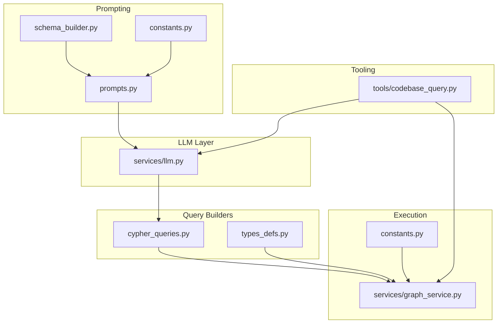
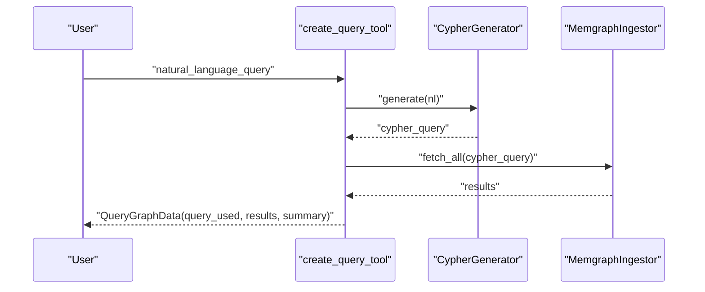
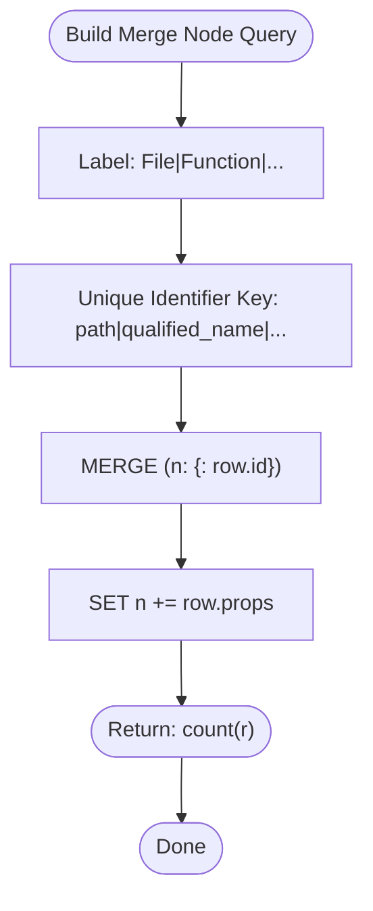
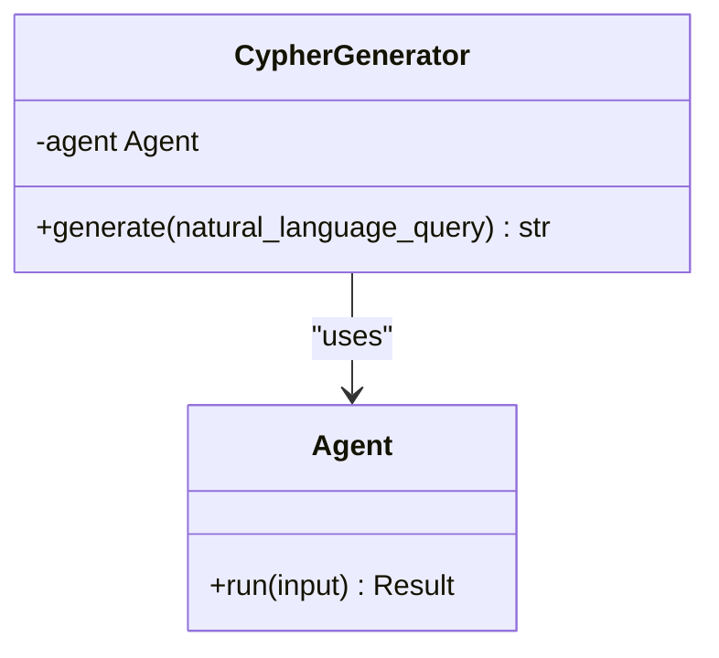
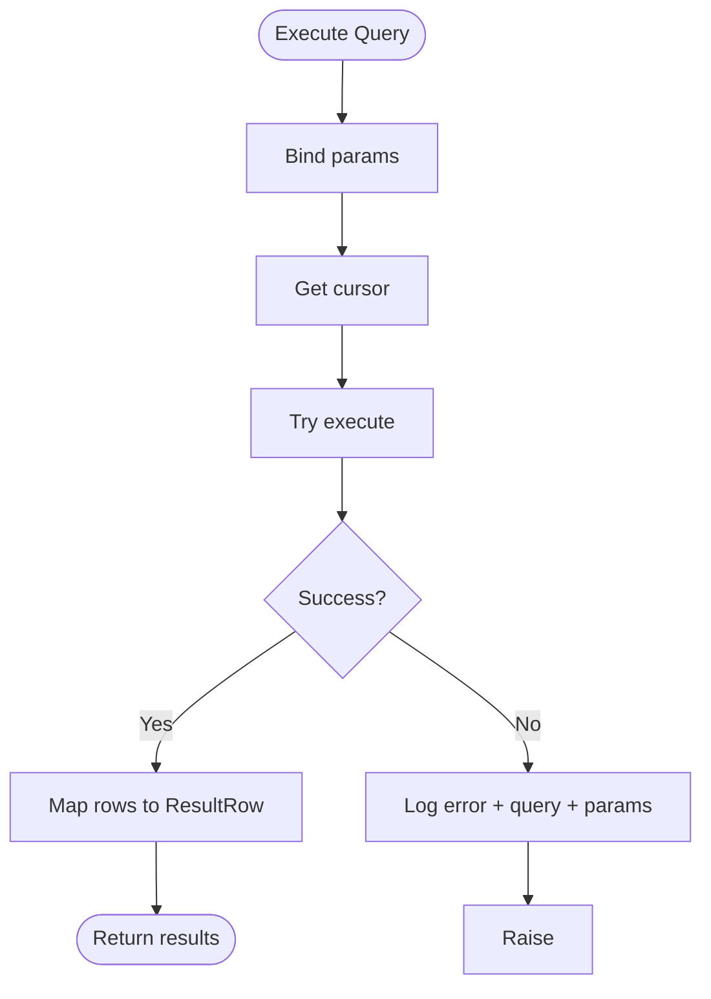
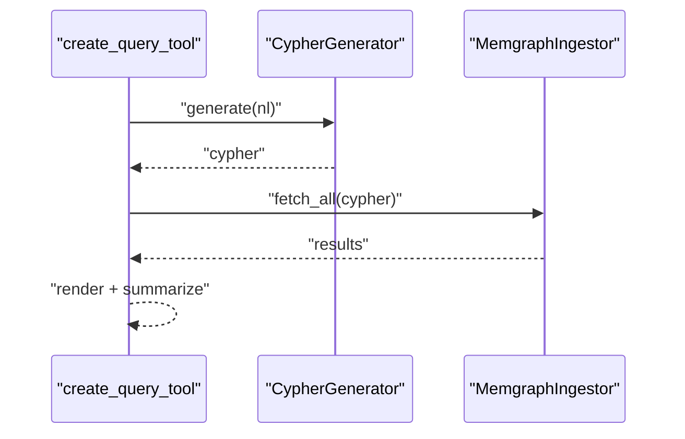
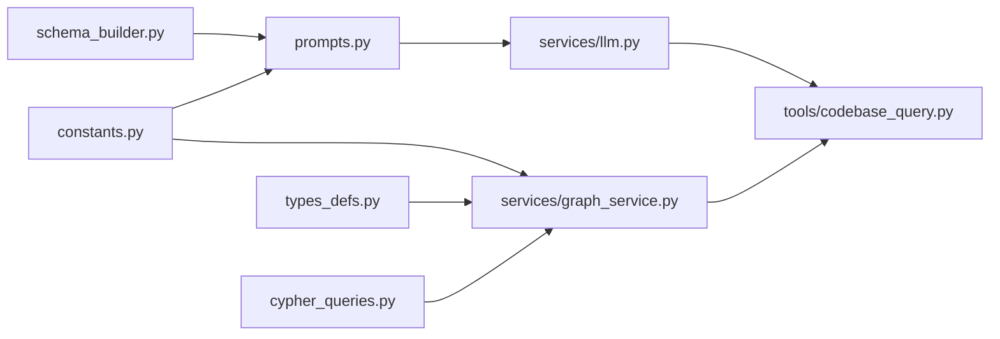

# Cypher Query Generation

<cite>
**Referenced Files in This Document**
- [cypher_queries.py](file://codebase_rag/cypher_queries.py)
- [llm.py](file://codebase_rag/services/llm.py)
- [prompts.py](file://codebase_rag/prompts.py)
- [graph_service.py](file://codebase_rag/services/graph_service.py)
- [codebase_query.py](file://codebase_rag/tools/codebase_query.py)
- [constants.py](file://codebase_rag/constants.py)
- [types_defs.py](file://codebase_rag/types_defs.py)
- [schema_builder.py](file://codebase_rag/schema_builder.py)
- [exceptions.py](file://codebase_rag/exceptions.py)
- [logs.py](file://codebase_rag/logs.py)
- [config.py](file://codebase_rag/config.py)
- [test_cypher_queries.py](file://codebase_rag/tests/test_cypher_queries.py)
- [test_codebase_query.py](file://codebase_rag/tests/test_codebase_query.py)
- [test_codebase_query_integration.py](file://codebase_rag/tests/integration/test_codebase_query_integration.py)
</cite>

## Table of Contents
1. [Introduction](#introduction)
2. [Project Structure](#project-structure)
3. [Core Components](#core-components)
4. [Architecture Overview](#architecture-overview)
5. [Detailed Component Analysis](#detailed-component-analysis)
6. [Dependency Analysis](#dependency-analysis)
7. [Performance Considerations](#performance-considerations)
8. [Troubleshooting Guide](#troubleshooting-guide)
9. [Conclusion](#conclusion)
10. [Appendices](#appendices)

## Introduction
This document explains the Cypher query generation system used to translate natural language requests into executable Cypher traversals against a codebase knowledge graph. It covers:
- How natural language is parsed and transformed into Cypher via an LLM agent
- The query building functions and parameter injection mechanisms
- Query patterns for code exploration, relationship traversal, and filtering
- Integration with LLM services and orchestration
- Examples of common query scenarios and their Cypher translations
- Optimization techniques and performance considerations
- Error handling and debugging strategies

## Project Structure
The Cypher generation pipeline spans several modules:
- Prompting and schema definitions define the Cypher rules and examples
- LLM service wraps a model provider to generate Cypher from natural language
- Query builders construct reusable Cypher fragments and batching helpers
- Graph service executes queries and manages batched writes
- Tool integration exposes a user-facing query tool that orchestrates translation and execution

**Diagram sources**
- [prompts.py](file://codebase_rag/prompts.py#L131-L171)
- [schema_builder.py](file://codebase_rag/schema_builder.py#L35-L42)
- [constants.py](file://codebase_rag/constants.py#L413-L423)
- [llm.py](file://codebase_rag/services/llm.py#L37-L76)
- [cypher_queries.py](file://codebase_rag/cypher_queries.py#L82-L120)
- [types_defs.py](file://codebase_rag/types_defs.py#L424-L555)
- [graph_service.py](file://codebase_rag/services/graph_service.py#L104-L164)
- [codebase_query.py](file://codebase_rag/tools/codebase_query.py#L24-L95)

**Section sources**
- [prompts.py](file://codebase_rag/prompts.py#L131-L171)
- [schema_builder.py](file://codebase_rag/schema_builder.py#L35-L42)
- [constants.py](file://codebase_rag/constants.py#L413-L423)
- [llm.py](file://codebase_rag/services/llm.py#L37-L76)
- [cypher_queries.py](file://codebase_rag/cypher_queries.py#L82-L120)
- [types_defs.py](file://codebase_rag/types_defs.py#L424-L555)
- [graph_service.py](file://codebase_rag/services/graph_service.py#L104-L164)
- [codebase_query.py](file://codebase_rag/tools/codebase_query.py#L24-L95)

## Core Components
- Cypher query builders: Construct reusable MATCH/MERGE patterns and UNWIND wrappers for batched ingestion
- LLM Cypher generator: Creates Cypher from natural language using a system prompt and schema
- Graph service: Executes queries, manages batches, and ensures constraints
- Tool wrapper: Exposes a user-facing tool that translates NL to Cypher and renders results

Key responsibilities:
- Query construction: build_merge_node_query, build_merge_relationship_query, build_nodes_by_ids_query, wrap_with_unwind
- Execution: fetch_all, execute_write, batch helpers
- Orchestration: create_query_tool integrates LLM and graph service

**Section sources**
- [cypher_queries.py](file://codebase_rag/cypher_queries.py#L82-L120)
- [llm.py](file://codebase_rag/services/llm.py#L37-L76)
- [graph_service.py](file://codebase_rag/services/graph_service.py#L104-L164)
- [codebase_query.py](file://codebase_rag/tools/codebase_query.py#L24-L95)

## Architecture Overview
The system follows a clear separation of concerns:
- Natural language enters via a tool wrapper
- An LLM agent generates Cypher constrained by schema and rules
- The graph service executes the query and returns results
- Results are rendered and summarized

**Diagram sources**
- [codebase_query.py](file://codebase_rag/tools/codebase_query.py#L32-L88)
- [llm.py](file://codebase_rag/services/llm.py#L58-L75)
- [graph_service.py](file://codebase_rag/services/graph_service.py#L329-L333)

## Detailed Component Analysis

### Cypher Query Builders
Reusable functions produce Cypher fragments and batched execution patterns:
- build_merge_node_query(label, id_key): MERGE + SET pattern for upserting nodes
- build_merge_relationship_query(from_label, from_key, rel_type, to_label, to_key, has_props): MATCH + MERGE + optional SET + RETURN COUNT
- build_nodes_by_ids_query(node_ids): IN [...] selection with ordered projection
- wrap_with_unwind(query): Prepends UNWIND $batch AS row to enable streaming batches

**Diagram sources**
- [cypher_queries.py](file://codebase_rag/cypher_queries.py#L101-L103)

**Section sources**
- [cypher_queries.py](file://codebase_rag/cypher_queries.py#L82-L120)

### LLM Cypher Generation
The CypherGenerator initializes a model-backed agent with:
- A system prompt that includes schema, rules, and examples
- Local vs remote provider branching for stricter prompts
- Validation that the output is a Cypher query (contains MATCH keyword and is a string)

**Diagram sources**
- [llm.py](file://codebase_rag/services/llm.py#L37-L76)

**Section sources**
- [llm.py](file://codebase_rag/services/llm.py#L37-L76)
- [prompts.py](file://codebase_rag/prompts.py#L131-L171)
- [prompts.py](file://codebase_rag/prompts.py#L174-L229)

### Graph Service Execution
The MemgraphIngestor encapsulates:
- Connection management and cursor lifecycle
- Query execution with parameter binding
- Batched execution via UNWIND wrapper
- Constraint enforcement and node/relationship flushing
- Export utilities for graph snapshots

**Diagram sources**
- [graph_service.py](file://codebase_rag/services/graph_service.py#L104-L123)

**Section sources**
- [graph_service.py](file://codebase_rag/services/graph_service.py#L104-L164)
- [graph_service.py](file://codebase_rag/services/graph_service.py#L124-L164)
- [graph_service.py](file://codebase_rag/services/graph_service.py#L329-L333)

### Tool Integration
The create_query_tool:
- Receives a natural language query
- Delegates to CypherGenerator to produce Cypher
- Executes via graph service fetch_all
- Renders results and returns structured QueryGraphData

**Diagram sources**
- [codebase_query.py](file://codebase_rag/tools/codebase_query.py#L32-L88)

**Section sources**
- [codebase_query.py](file://codebase_rag/tools/codebase_query.py#L24-L95)

### Query Patterns and Examples
Common patterns are documented in prompts and constants:
- Counting items: RETURN count(...) AS total
- Finding decorated functions/methods: decorators list membership
- Path-based matching: STARTS WITH for robust directory/file queries
- Keyword/concept search: toLower() containment checks
- Specific file lookup: equality on name/path
- Limiting results: LIMIT 50 for listing

Examples are embedded in prompts and constants for reuse.

**Section sources**
- [prompts.py](file://codebase_rag/prompts.py#L139-L169)
- [constants.py](file://codebase_rag/constants.py#L414-L423)

## Dependency Analysis
The following diagram highlights key dependencies among modules involved in Cypher generation and execution.

**Diagram sources**
- [prompts.py](file://codebase_rag/prompts.py#L131-L171)
- [schema_builder.py](file://codebase_rag/schema_builder.py#L35-L42)
- [constants.py](file://codebase_rag/constants.py#L413-L423)
- [llm.py](file://codebase_rag/services/llm.py#L37-L76)
- [cypher_queries.py](file://codebase_rag/cypher_queries.py#L82-L120)
- [types_defs.py](file://codebase_rag/types_defs.py#L424-L555)
- [graph_service.py](file://codebase_rag/services/graph_service.py#L104-L164)
- [codebase_query.py](file://codebase_rag/tools/codebase_query.py#L24-L95)

**Section sources**
- [prompts.py](file://codebase_rag/prompts.py#L131-L171)
- [schema_builder.py](file://codebase_rag/schema_builder.py#L35-L42)
- [constants.py](file://codebase_rag/constants.py#L413-L423)
- [llm.py](file://codebase_rag/services/llm.py#L37-L76)
- [cypher_queries.py](file://codebase_rag/cypher_queries.py#L82-L120)
- [types_defs.py](file://codebase_rag/types_defs.py#L424-L555)
- [graph_service.py](file://codebase_rag/services/graph_service.py#L104-L164)
- [codebase_query.py](file://codebase_rag/tools/codebase_query.py#L24-L95)

## Performance Considerations
- Limit results: Use LIMIT 50 for listing queries to avoid overwhelming responses
- Prefer aggregation queries: For counts, return only the aggregated value
- Batch writes: Use wrap_with_unwind and batch sizes to minimize round-trips
- Constraints: Ensure unique constraints exist per label to speed up MERGE and reduce duplicates
- Path matching: Use STARTS WITH for directory-level queries to avoid expensive scans
- Case-insensitive searches: Apply toLower() consistently to leverage indexes

[No sources needed since this section provides general guidance]

## Troubleshooting Guide
Common issues and strategies:
- LLM generation failures: The CypherGenerator validates output and raises LLMGenerationError; check logs for generation errors and retry configuration
- Database errors: The graph service logs query and parameters on failure; inspect MG_CYPHER_QUERY and MG_CYPHER_PARAMS for diagnostics
- Translation failures: The tool surfaces translation failures with a summary; verify the natural language phrasing aligns with schema and examples
- Batch errors: The graph service truncates large param lists in logs for readability; review truncated logs and adjust batch sizes

**Section sources**
- [exceptions.py](file://codebase_rag/exceptions.py#L42-L46)
- [logs.py](file://codebase_rag/logs.py#L195-L198)
- [logs.py](file://codebase_rag/logs.py#L160-L164)
- [logs.py](file://codebase_rag/logs.py#L190-L191)
- [codebase_query.py](file://codebase_rag/tools/codebase_query.py#L76-L88)

## Conclusion
The Cypher query generation system combines a schema-aware LLM agent with robust query builders and a batch-capable graph service. By adhering to the documented patterns and constraints, it reliably transforms natural language into precise, optimized Cypher traversals suitable for code exploration, relationship discovery, and filtering operations.

[No sources needed since this section summarizes without analyzing specific files]

## Appendices

### Query Building Functions Reference
- build_merge_node_query(label, id_key): Produces MERGE + SET for node upserts
- build_merge_relationship_query(from_label, from_key, rel_type, to_label, to_key, has_props): Produces MATCH + MERGE (+ SET if props) + RETURN COUNT
- build_nodes_by_ids_query(node_ids): Produces IN [...] selection with ordered projection
- wrap_with_unwind(query): Prepends UNWIND $batch AS row

**Section sources**
- [cypher_queries.py](file://codebase_rag/cypher_queries.py#L101-L119)
- [cypher_queries.py](file://codebase_rag/cypher_queries.py#L86-L94)
- [cypher_queries.py](file://codebase_rag/cypher_queries.py#L82-L83)

### Parameter Injection Mechanisms
- Named parameters: Dictionary binding for single queries
- Batch parameters: BatchWrapper with UNWIND streaming
- Placeholders: Dynamic placeholder generation for IN clauses

**Section sources**
- [graph_service.py](file://codebase_rag/services/graph_service.py#L124-L164)
- [graph_service.py](file://codebase_rag/services/graph_service.py#L104-L123)
- [cypher_queries.py](file://codebase_rag/cypher_queries.py#L86-L94)

### Integration with LLM Services
- Provider selection: Orchestrator and Cypher models configured independently
- Prompt variants: Remote vs local provider prompts tailored for stricter outputs
- Retry configuration: Agent retries and orchestrator output retries

**Section sources**
- [config.py](file://codebase_rag/config.py#L197-L217)
- [llm.py](file://codebase_rag/services/llm.py#L37-L76)
- [prompts.py](file://codebase_rag/prompts.py#L174-L229)

### Example Scenarios and Translations
- Count classes: MATCH (c:Class) RETURN count(c) AS total
- Find decorated functions: MATCH (n:Function|Method) WHERE 'task' IN n.decorators RETURN n.qualified_name AS qualified_name, ...
- Path-based listing: MATCH (n) WHERE n.path IS NOT NULL AND n.path STARTS WITH 'workflows' RETURN n.name AS name, n.path AS path, labels(n) AS type LIMIT 50
- Keyword search: MATCH (n) WHERE toLower(n.name) CONTAINS 'database' OR (n.qualified_name IS NOT NULL AND toLower(n.qualified_name) CONTAINS 'database') RETURN n.name AS name, n.qualified_name AS qualified_name, labels(n) AS type LIMIT 50
- Specific file: MATCH (f:File) WHERE toLower(f.name) = 'readme.md' AND f.path = 'README.md' RETURN f.path as path, f.name as name, labels(f) as type

**Section sources**
- [prompts.py](file://codebase_rag/prompts.py#L147-L169)
- [constants.py](file://codebase_rag/constants.py#L414-L423)

### Tests and Validation
- Unit tests validate query builders and integration behaviors
- Integration tests verify end-to-end tool flow and error handling

**Section sources**
- [test_cypher_queries.py](file://codebase_rag/tests/test_cypher_queries.py#L24-L90)
- [test_cypher_queries.py](file://codebase_rag/tests/test_cypher_queries.py#L106-L124)
- [test_codebase_query.py](file://codebase_rag/tests/test_codebase_query.py#L119-L134)
- [test_codebase_query_integration.py](file://codebase_rag/tests/integration/test_codebase_query_integration.py#L53-L71)