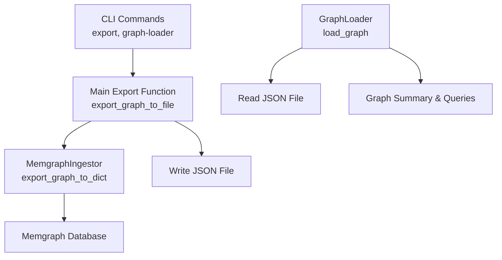
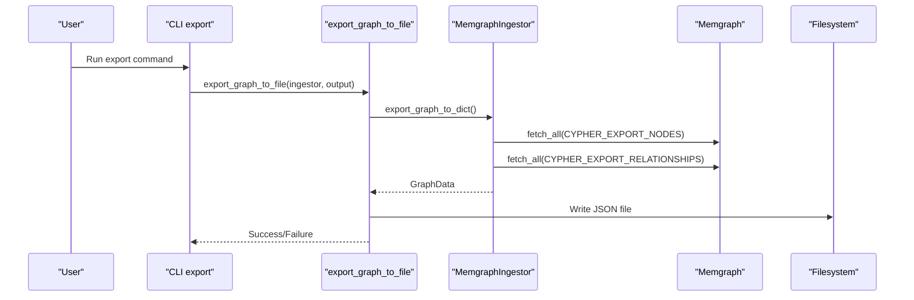
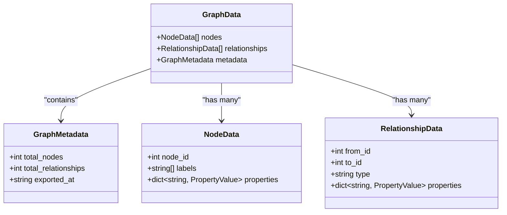
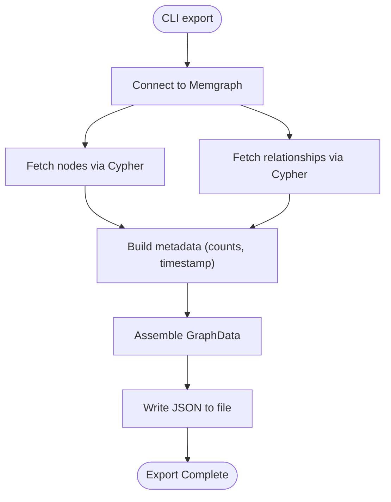
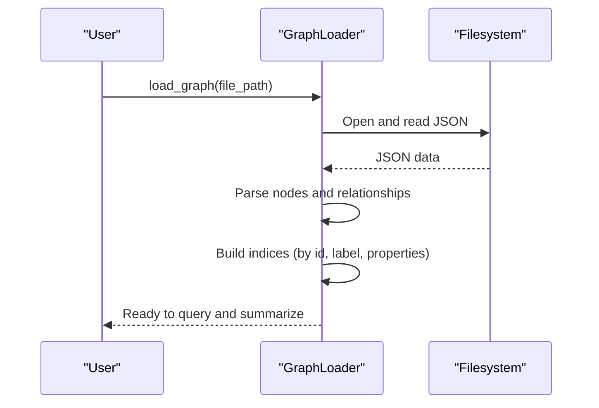
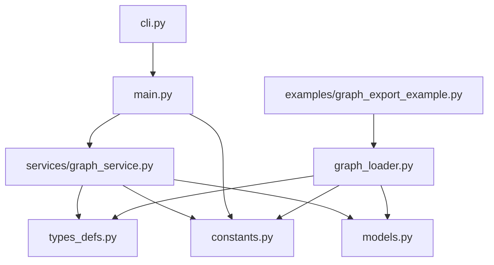

# Graph Export and Import

<cite>
**Referenced Files in This Document**
- [graph_loader.py](file://codebase_rag/graph_loader.py)
- [types_defs.py](file://codebase_rag/types_defs.py)
- [constants.py](file://codebase_rag/constants.py)
- [models.py](file://codebase_rag/models.py)
- [cli.py](file://codebase_rag/cli.py)
- [main.py](file://codebase_rag/main.py)
- [graph_service.py](file://codebase_rag/services/graph_service.py)
- [test_graph_export_integration.py](file://codebase_rag/tests/test_graph_export_integration.py)
- [test_graph_loader.py](file://codebase_rag/tests/test_graph_loader.py)
- [graph_export_example.py](file://examples/graph_export_example.py)
</cite>

## Table of Contents
1. [Introduction](#introduction)
2. [Project Structure](#project-structure)
3. [Core Components](#core-components)
4. [Architecture Overview](#architecture-overview)
5. [Detailed Component Analysis](#detailed-component-analysis)
6. [Dependency Analysis](#dependency-analysis)
7. [Performance Considerations](#performance-considerations)
8. [Troubleshooting Guide](#troubleshooting-guide)
9. [Conclusion](#conclusion)
10. [Appendices](#appendices)

## Introduction
This document explains the graph export and import functionality for programmatic access and backup operations. It covers how the system exports a graph from a Memgraph database into a portable JSON format, how it loads and summarizes exported graphs, and how to integrate these capabilities with external tools and automated backup systems. It also documents the GraphData schema, metadata tracking, and practical workflows for incremental and selective extraction.

## Project Structure
The export/import pipeline spans several modules:
- CLI entry points orchestrate export and graph loading
- Services handle exporting from Memgraph
- Loader reads exported JSON and exposes graph APIs
- Types define the GraphData schema and metadata
- Tests validate the export/import roundtrip and schema correctness

**Diagram sources**
- [cli.py](file://codebase_rag/cli.py#L237-L271)
- [main.py](file://codebase_rag/main.py#L745-L766)
- [graph_service.py](file://codebase_rag/services/graph_service.py#L341-L360)
- [graph_loader.py](file://codebase_rag/graph_loader.py#L36-L78)

**Section sources**
- [cli.py](file://codebase_rag/cli.py#L237-L271)
- [main.py](file://codebase_rag/main.py#L745-L766)
- [graph_service.py](file://codebase_rag/services/graph_service.py#L341-L360)
- [graph_loader.py](file://codebase_rag/graph_loader.py#L36-L78)

## Core Components
- GraphData schema: Defines the top-level structure for exported graphs, including nodes, relationships, and metadata.
- GraphMetadata: Tracks counts and export timestamp.
- GraphLoader: Loads a JSON graph file, constructs in-memory indices, and provides summary and query APIs.
- CLI export and graph-loader commands: Provide programmatic and command-line access to export and analyze graphs.
- MemgraphIngestor: Exports graph data from Memgraph into the GraphData format.

Key responsibilities:
- Export: Connect to Memgraph, run Cypher queries, assemble GraphData, write JSON.
- Import: Load JSON, parse nodes and relationships, build indexes, compute summaries.

**Section sources**
- [types_defs.py](file://codebase_rag/types_defs.py#L152-L183)
- [graph_loader.py](file://codebase_rag/graph_loader.py#L15-L155)
- [cli.py](file://codebase_rag/cli.py#L237-L271)
- [main.py](file://codebase_rag/main.py#L727-L766)
- [graph_service.py](file://codebase_rag/services/graph_service.py#L341-L360)

## Architecture Overview
The export pipeline connects CLI commands to Memgraph via the ingestion service, which executes Cypher queries and returns rows that are transformed into the GraphData structure. The import pipeline reads a previously exported JSON file and reconstructs the in-memory graph representation.

**Diagram sources**
- [cli.py](file://codebase_rag/cli.py#L237-L271)
- [main.py](file://codebase_rag/main.py#L745-L766)
- [graph_service.py](file://codebase_rag/services/graph_service.py#L341-L360)

## Detailed Component Analysis

### GraphData Schema and Metadata
The exported graph follows a strict JSON schema:
- nodes: Array of node objects with node_id, labels, and properties
- relationships: Array of relationship objects with from_id, to_id, type, and properties
- metadata: Contains total_nodes, total_relationships, and exported_at timestamp

**Diagram sources**
- [types_defs.py](file://codebase_rag/types_defs.py#L152-L175)

**Section sources**
- [types_defs.py](file://codebase_rag/types_defs.py#L152-L175)
- [constants.py](file://codebase_rag/constants.py#L150-L165)

### Export Mechanism
The export process:
- CLI parses options and connects to Memgraph
- Main function writes JSON using a dedicated writer
- Ingestor executes Cypher queries to fetch nodes and relationships
- Ingestor computes metadata (counts and timestamp)
- JSON is written with UTF-8 encoding and indentation

**Diagram sources**
- [cli.py](file://codebase_rag/cli.py#L237-L271)
- [main.py](file://codebase_rag/main.py#L727-L766)
- [graph_service.py](file://codebase_rag/services/graph_service.py#L341-L360)

**Section sources**
- [cli.py](file://codebase_rag/cli.py#L237-L271)
- [main.py](file://codebase_rag/main.py#L727-L766)
- [graph_service.py](file://codebase_rag/services/graph_service.py#L341-L360)

### Import and Loading
The import process:
- GraphLoader.load reads and parses the JSON file
- Nodes and relationships are instantiated into memory
- Indices are built for fast lookups by id, label, and property values
- Summary statistics and metadata are exposed

**Diagram sources**
- [graph_loader.py](file://codebase_rag/graph_loader.py#L36-L148)

**Section sources**
- [graph_loader.py](file://codebase_rag/graph_loader.py#L15-L155)

### Programmatic Access and Backup Workflows
Common workflows:
- Full backup: Export the entire graph to a JSON file for archival
- Selective extraction: Use Cypher queries to extract subsets (e.g., by label or relationship type) and write to JSON
- Incremental export: Export only recent changes by filtering on timestamps or node properties, then merge with existing JSON

Integration patterns:
- CLI export command for scheduled backups
- GraphLoader for ad-hoc analysis and validation of backups
- Example script demonstrates summarizing and inspecting exported graphs

**Section sources**
- [cli.py](file://codebase_rag/cli.py#L237-L271)
- [graph_loader.py](file://codebase_rag/graph_loader.py#L136-L148)
- [graph_export_example.py](file://examples/graph_export_example.py#L66-L87)

### Data Transformation Patterns
Transformation from Memgraph rows to GraphData:
- Nodes: Convert Cypher result rows to NodeData with node_id, labels, and properties
- Relationships: Convert rows to RelationshipData with from_id, to_id, type, and properties
- Metadata: Compute total_nodes, total_relationships, and exported_at timestamp

Validation and round-trip testing:
- Tests construct GraphData from mock ingestion calls and verify JSON validity
- Tests confirm that loaded graphs preserve nodes, relationships, and metadata

**Section sources**
- [test_graph_export_integration.py](file://codebase_rag/tests/test_graph_export_integration.py#L14-L79)
- [test_graph_export_integration.py](file://codebase_rag/tests/test_graph_export_integration.py#L191-L205)
- [test_graph_loader.py](file://codebase_rag/tests/test_graph_loader.py#L41-L82)

## Dependency Analysis
The following diagram shows key dependencies among components involved in export and import.

**Diagram sources**
- [cli.py](file://codebase_rag/cli.py#L1-L30)
- [main.py](file://codebase_rag/main.py#L1-L63)
- [graph_service.py](file://codebase_rag/services/graph_service.py#L1-L30)
- [types_defs.py](file://codebase_rag/types_defs.py#L1-L30)
- [constants.py](file://codebase_rag/constants.py#L1-L30)
- [models.py](file://codebase_rag/models.py#L1-L20)
- [graph_loader.py](file://codebase_rag/graph_loader.py#L1-L15)
- [graph_export_example.py](file://examples/graph_export_example.py#L1-L30)

**Section sources**
- [cli.py](file://codebase_rag/cli.py#L1-L30)
- [main.py](file://codebase_rag/main.py#L1-L63)
- [graph_service.py](file://codebase_rag/services/graph_service.py#L1-L30)
- [types_defs.py](file://codebase_rag/types_defs.py#L1-L30)
- [constants.py](file://codebase_rag/constants.py#L1-L30)
- [models.py](file://codebase_rag/models.py#L1-L20)
- [graph_loader.py](file://codebase_rag/graph_loader.py#L1-L15)
- [graph_export_example.py](file://examples/graph_export_example.py#L1-L30)

## Performance Considerations
- Batch size tuning: Larger batches reduce round-trips to Memgraph but increase memory usage during export.
- Lazy loading: GraphLoader builds property indexes on demand to minimize startup cost.
- JSON serialization: UTF-8 encoding and indentation improve readability; consider compression for large backups.
- Incremental strategies: Filter by timestamps or identifiers to reduce payload size and speed up backups.

## Troubleshooting Guide
Common issues and resolutions:
- File not found: Ensure the output path exists and is writable; verify CLI export command usage.
- Load errors: Confirm the JSON file is valid and matches the GraphData schema; check metadata presence.
- Empty graphs: Verify Memgraph connectivity and Cypher queries; ensure the database contains expected nodes and relationships.
- Timestamp mismatches: Confirm the exported_at field is present and correctly formatted.

**Section sources**
- [graph_loader.py](file://codebase_rag/graph_loader.py#L36-L46)
- [test_graph_loader.py](file://codebase_rag/tests/test_graph_loader.py#L77-L82)

## Conclusion
The export/import system provides a robust, schema-driven approach to backing up and restoring knowledge graphs. By leveraging Memgraph’s Cypher queries and a well-defined GraphData schema, teams can automate backups, validate graph integrity, and integrate with external tools for long-term storage and analysis.

## Appendices

### Appendix A: Export CLI Command Reference
- Command: export
- Options:
  - --output/-o: Output file path (required)
  - --json/--no-json: Enforce JSON format (only JSON supported)
  - --batch-size: Batch size for export operations
- Behavior: Connects to Memgraph, exports nodes and relationships, writes JSON, prints success/failure and statistics.

**Section sources**
- [cli.py](file://codebase_rag/cli.py#L237-L271)

### Appendix B: Graph Loader CLI and Programmatic Usage
- Command: graph-loader
- Behavior: Loads a JSON graph file and prints a summary including totals, node types, relationship types, and export timestamp.
- Programmatic: Use load_graph to instantiate a GraphLoader and call summary() for analytics.

**Section sources**
- [cli.py](file://codebase_rag/cli.py#L352-L382)
- [graph_loader.py](file://codebase_rag/graph_loader.py#L136-L148)
- [graph_export_example.py](file://examples/graph_export_example.py#L66-L87)

### Appendix C: Example Workflow
- Export: Run the export command to produce a JSON backup.
- Analyze: Use the graph-loader command or the example script to inspect the backup.
- Validate: Use tests as references for expected schema and round-trip behavior.

**Section sources**
- [cli.py](file://codebase_rag/cli.py#L237-L271)
- [graph_export_example.py](file://examples/graph_export_example.py#L66-L87)
- [test_graph_export_integration.py](file://codebase_rag/tests/test_graph_export_integration.py#L191-L205)