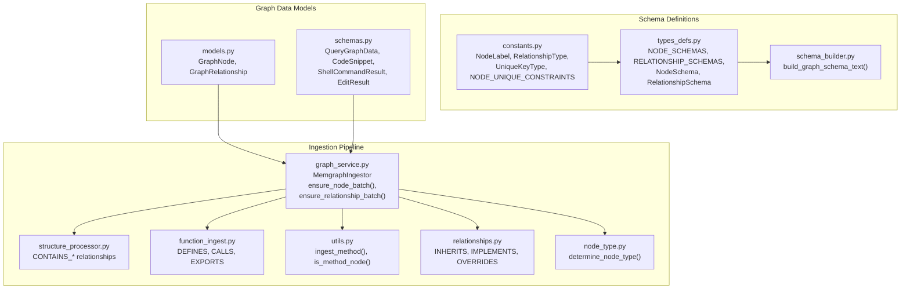
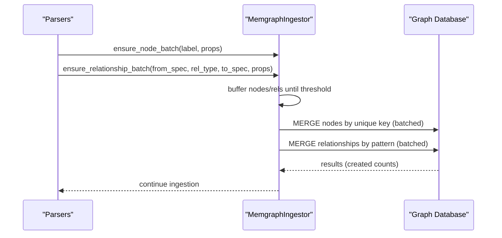
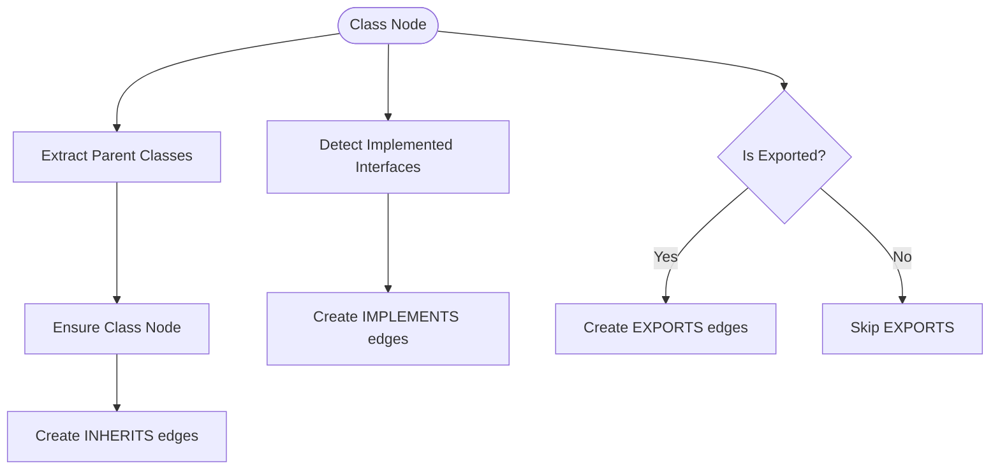
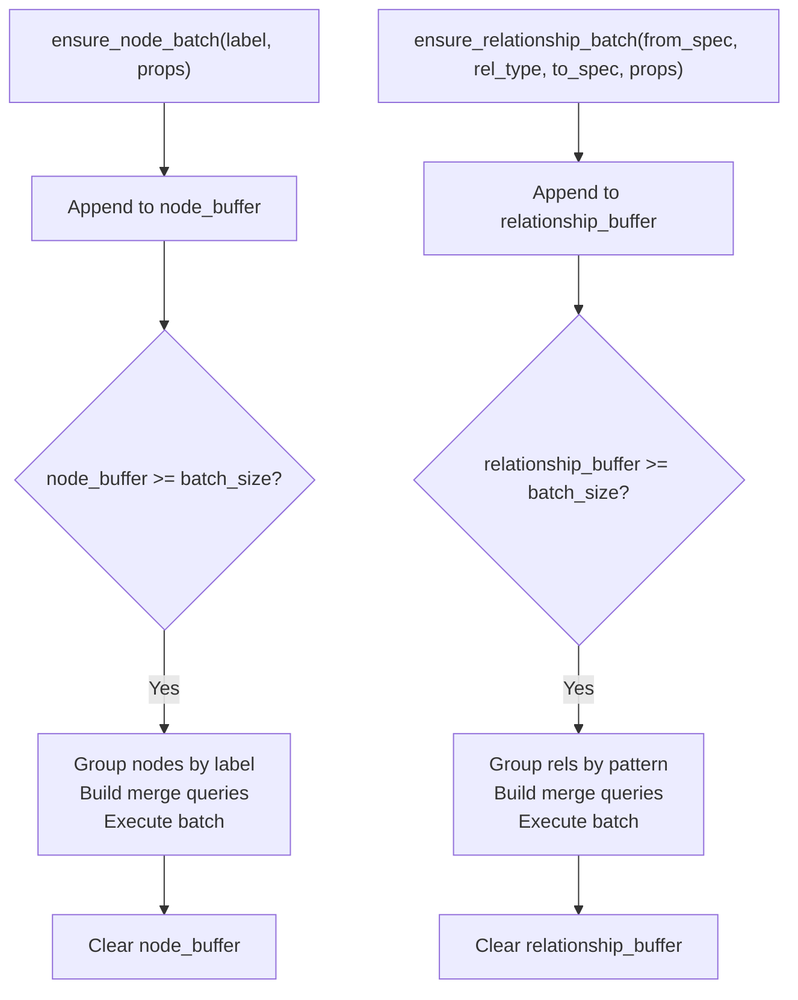
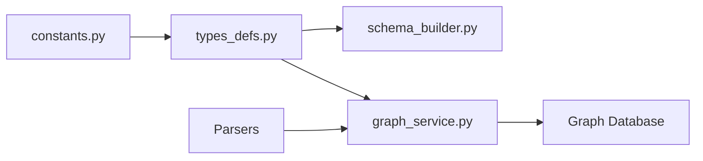

# Graph Schema Design

<cite>
**Referenced Files in This Document**
- [constants.py](file://codebase_rag/constants.py)
- [types_defs.py](file://codebase_rag/types_defs.py)
- [schema_builder.py](file://codebase_rag/schema_builder.py)
- [schemas.py](file://codebase_rag/schemas.py)
- [models.py](file://codebase_rag/models.py)
- [graph_service.py](file://codebase_rag/services/graph_service.py)
- [structure_processor.py](file://codebase_rag/parsers/structure_processor.py)
- [function_ingest.py](file://codebase_rag/parsers/function_ingest.py)
- [utils.py](file://codebase_rag/parsers/utils.py)
- [relationships.py](file://codebase_rag/parsers/class_ingest/relationships.py)
- [node_type.py](file://codebase_rag/parsers/class_ingest/node_type.py)
- [python.py](file://codebase_rag/parsers/handlers/python.py)
- [js_ts.py](file://codebase_rag/parsers/handlers/js_ts.py)
</cite>

## Table of Contents
1. [Introduction](#introduction)
2. [Project Structure](#project-structure)
3. [Core Components](#core-components)
4. [Architecture Overview](#architecture-overview)
5. [Detailed Component Analysis](#detailed-component-analysis)
6. [Dependency Analysis](#dependency-analysis)
7. [Performance Considerations](#performance-considerations)
8. [Troubleshooting Guide](#troubleshooting-guide)
9. [Conclusion](#conclusion)
10. [Appendices](#appendices)

## Introduction
This document describes the Graph-Code graph schema design system. It defines the unified node taxonomy, relationship semantics, constraints, and unique identifiers. It explains how language-specific constructs are normalized into common graph entities and documents the batch processing pipeline for efficient ingestion. It also outlines schema evolution strategies and backward compatibility considerations.

## Project Structure
The schema design spans several modules:
- Constants and enums define node labels, relationship types, unique key policies, and language metadata.
- Types and schemas define typed data structures for graph ingestion and validation.
- Schema builder generates human-readable schema documentation from the canonical definitions.
- Services implement batching and Cypher-based ingestion into a graph database.
- Parsers normalize AST nodes into graph entities and create relationships.

**Diagram sources**
- [constants.py](file://codebase_rag/constants.py#L317-L377)
- [types_defs.py](file://codebase_rag/types_defs.py#L424-L555)
- [schema_builder.py](file://codebase_rag/schema_builder.py#L35-L42)
- [models.py](file://codebase_rag/models.py#L35-L48)
- [schemas.py](file://codebase_rag/schemas.py#L8-L82)
- [graph_service.py](file://codebase_rag/services/graph_service.py#L49-L364)
- [structure_processor.py](file://codebase_rag/parsers/structure_processor.py#L12-L133)
- [function_ingest.py](file://codebase_rag/parsers/function_ingest.py#L43-L469)
- [utils.py](file://codebase_rag/parsers/utils.py#L75-L169)
- [relationships.py](file://codebase_rag/parsers/class_ingest/relationships.py#L18-L95)
- [node_type.py](file://codebase_rag/parsers/class_ingest/node_type.py#L12-L90)

**Section sources**
- [constants.py](file://codebase_rag/constants.py#L317-L377)
- [types_defs.py](file://codebase_rag/types_defs.py#L424-L555)
- [schema_builder.py](file://codebase_rag/schema_builder.py#L35-L42)
- [models.py](file://codebase_rag/models.py#L35-L48)
- [schemas.py](file://codebase_rag/schemas.py#L8-L82)
- [graph_service.py](file://codebase_rag/services/graph_service.py#L49-L364)
- [structure_processor.py](file://codebase_rag/parsers/structure_processor.py#L12-L133)
- [function_ingest.py](file://codebase_rag/parsers/function_ingest.py#L43-L469)
- [utils.py](file://codebase_rag/parsers/utils.py#L75-L169)
- [relationships.py](file://codebase_rag/parsers/class_ingest/relationships.py#L18-L95)
- [node_type.py](file://codebase_rag/parsers/class_ingest/node_type.py#L12-L90)

## Core Components
- Unified node types: Project, Package, Folder, File, Module, Class, Function, Method, Interface, Enum, Type, Union, ModuleInterface, ModuleImplementation, ExternalPackage.
- Relationship types: CONTAINS_PACKAGE, CONTAINS_FOLDER, CONTAINS_FILE, CONTAINS_MODULE, DEFINES, DEFINES_METHOD, IMPORTS, EXPORTS, EXPORTS_MODULE, IMPLEMENTS_MODULE, INHERITS, IMPLEMENTS, OVERRIDES, CALLS, DEPENDS_ON_EXTERNAL.
- Constraint system: Each node label has a unique key policy; unique constraints are enforced via Cypher queries.
- Batch ingestion: Nodes and relationships are buffered and merged in batches to the graph database.

**Section sources**
- [constants.py](file://codebase_rag/constants.py#L317-L377)
- [types_defs.py](file://codebase_rag/types_defs.py#L424-L555)
- [graph_service.py](file://codebase_rag/services/graph_service.py#L180-L218)

## Architecture Overview
The ingestion pipeline transforms language ASTs into a unified graph schema. Parsers traverse ASTs, normalize constructs into common entities, and emit node and relationship batches. The ingestion service merges nodes and relationships using Cypher, enforcing uniqueness and batching for performance.

**Diagram sources**
- [graph_service.py](file://codebase_rag/services/graph_service.py#L189-L321)

## Detailed Component Analysis

### Node Types and Properties
- Project: unique key is name; represents the top-level project scope.
- Package: unique key is qualified_name; normalized from directory layout and indicators.
- Folder: unique key is path; represents directory hierarchy.
- File: unique key is path; stores name and extension.
- Module: unique key is qualified_name; normalized from module boundaries per language.
- Class: unique key is qualified_name; supports TypeScript interfaces, enums, unions, and C++ variants.
- Function: unique key is qualified_name; includes decorators, start/end line, docstring, and exported flag.
- Method: unique key is qualified_name; created under a container (Class or Module).
- Interface, Enum, Type, Union: unique key is qualified_name.
- ModuleInterface, ModuleImplementation: unique key is qualified_name; ModuleImplementation includes implements_module.
- ExternalPackage: unique key is name; version_spec stored for dependency tracking.

Unique key policies are defined centrally and enforced during ingestion.

**Section sources**
- [types_defs.py](file://codebase_rag/types_defs.py#L435-L470)
- [constants.py](file://codebase_rag/constants.py#L335-L351)

### Relationship Types and Directionality
- CONTAINS_PACKAGE, CONTAINS_FOLDER, CONTAINS_FILE, CONTAINS_MODULE: from Project/Packge/Folder to File/Module.
- DEFINES: from Module/Class to Function/Class.
- DEFINES_METHOD: from Class to Method.
- IMPORTS: from Module to Module.
- EXPORTS: from Module/Function/Class to Function/Class (language-specific).
- EXPORTS_MODULE: from Module to ModuleInterface.
- IMPLEMENTS_MODULE: from ModuleImplementation to ModuleInterface.
- INHERITS: from Class to Class.
- IMPLEMENTS: from Class to Interface.
- OVERRIDES: from Method to Method.
- CALLS: from Function/Method to Function/Method.
- DEPENDS_ON_EXTERNAL: from Project to ExternalPackage.

Directionality follows natural ownership and usage semantics (e.g., Module IMPORTS Module, Class INHERITS Class).

**Section sources**
- [types_defs.py](file://codebase_rag/types_defs.py#L473-L554)
- [constants.py](file://codebase_rag/constants.py#L361-L377)

### Constraint System and Unique Identifiers
- Unique keys per label are defined in the constants module and applied during MERGE operations.
- During batch flush, nodes are grouped by label and merged using the label’s unique key; missing keys cause the node to be skipped with a warning.
- Relationship merges are grouped by (from_label, from_key, rel_type, to_label, to_key) pattern and executed in batches.

**Section sources**
- [constants.py](file://codebase_rag/constants.py#L335-L351)
- [graph_service.py](file://codebase_rag/services/graph_service.py#L219-L321)

### Normalization of Language-Specific Constructs
- Python: Decorators are extracted from decorated definitions and stored on Function/Method nodes.
- JavaScript/TypeScript: Decorators are extracted from decorator nodes; nested function qualified names are built from ancestor scopes; method detection considers object literals and class bodies.
- C++: Out-of-class method definitions are normalized into Method nodes under the appropriate Class; exported constructs are tracked.
- Rust: Qualified names incorporate module path segments.
- Lua: Assigned function names are resolved from assignment expressions.

Normalization ensures that language constructs map consistently to unified node types and properties.

**Section sources**
- [python.py](file://codebase_rag/parsers/handlers/python.py#L13-L23)
- [js_ts.py](file://codebase_rag/parsers/handlers/js_ts.py#L14-L116)
- [function_ingest.py](file://codebase_rag/parsers/function_ingest.py#L150-L232)
- [utils.py](file://codebase_rag/parsers/utils.py#L75-L169)
- [node_type.py](file://codebase_rag/parsers/class_ingest/node_type.py#L12-L90)

### Relationship Creation Patterns
- Class relationships: Parent classes are extracted and INHERITS edges are created; implemented interfaces yield IMPLEMENTS edges; exported classes/functions/modules yield EXPORTS edges.
- Function relationships: Functions are linked to their containers (Module or Function) via DEFINES; exported functions receive EXPORTS edges.
- Calls: Resolved call sites connect Function/Method to Function/Method via CALLS.

**Diagram sources**
- [relationships.py](file://codebase_rag/parsers/class_ingest/relationships.py#L18-L95)

**Section sources**
- [relationships.py](file://codebase_rag/parsers/class_ingest/relationships.py#L18-L95)
- [function_ingest.py](file://codebase_rag/parsers/function_ingest.py#L268-L295)

### Batch Processing Schema
- Buffered ingestion: Nodes and relationships are appended to buffers until the batch threshold is reached.
- Node batching: Grouped by label; merged using the label’s unique key; properties are separated into id and extra props.
- Relationship batching: Grouped by (from_label, from_key, rel_type, to_label, to_key); optional properties handled dynamically.
- Flush order: Nodes flushed first, then relationships; thresholds trigger both flushes to maintain consistency.

**Diagram sources**
- [graph_service.py](file://codebase_rag/services/graph_service.py#L189-L321)

**Section sources**
- [graph_service.py](file://codebase_rag/services/graph_service.py#L189-L321)

### Schema Evolution and Backward Compatibility
- Add new node labels or relationship types by extending the enums and updating the schema definitions.
- For new properties, add them to the corresponding NodeSchema entries and ensure parsers populate them; existing nodes without the property remain valid.
- When changing unique keys, introduce migration steps to backfill or recompute identifiers and update constraints accordingly.
- Maintain backward compatibility by avoiding removal of existing relationship types and ensuring parsers still handle legacy constructs.

[No sources needed since this section provides general guidance]

## Dependency Analysis
The schema depends on centralized constants and typed definitions. Ingestion depends on Cypher queries generated from the schema definitions and enforced constraints.

**Diagram sources**
- [constants.py](file://codebase_rag/constants.py#L317-L377)
- [types_defs.py](file://codebase_rag/types_defs.py#L424-L555)
- [schema_builder.py](file://codebase_rag/schema_builder.py#L35-L42)
- [graph_service.py](file://codebase_rag/services/graph_service.py#L49-L364)

**Section sources**
- [constants.py](file://codebase_rag/constants.py#L317-L377)
- [types_defs.py](file://codebase_rag/types_defs.py#L424-L555)
- [schema_builder.py](file://codebase_rag/schema_builder.py#L35-L42)
- [graph_service.py](file://codebase_rag/services/graph_service.py#L49-L364)

## Performance Considerations
- Batch size tuning: Larger batches reduce round-trips but increase memory usage; adjust according to dataset scale.
- Buffer flushing: Nodes are flushed before relationships to avoid dangling edges; ensure thresholds are balanced.
- Property separation: Extra properties are sent separately from ids to minimize MERGE overhead.
- Query batching: UNWIND-based batch execution reduces per-statement overhead.

[No sources needed since this section provides general guidance]

## Troubleshooting Guide
- Missing unique key: Nodes without the required unique property are skipped; verify parser property mapping.
- Constraint violations: Existing nodes prevent duplicate creation; review unique key policies and data normalization.
- Batch errors: Errors during batch execution log the query and truncated parameters; inspect logs for failing rows.
- Relationship failures: CALLS relationships may fail if referenced nodes do not exist; validate call resolution.

**Section sources**
- [graph_service.py](file://codebase_rag/services/graph_service.py#L219-L321)

## Conclusion
The Graph-Code schema provides a unified, extensible graph model for multi-language codebases. Centralized definitions, strict constraints, and robust batching enable scalable ingestion and reliable querying. Normalization of language constructs ensures consistent semantics across languages, while clear relationship semantics support advanced analyses such as inheritance, exports, and calls.

## Appendices

### Appendix A: Canonical Schema Definitions
- Node schemas and relationship schemas are defined as typed structures and formatted for documentation generation.

**Section sources**
- [types_defs.py](file://codebase_rag/types_defs.py#L424-L555)
- [schema_builder.py](file://codebase_rag/schema_builder.py#L23-L42)

### Appendix B: Example Node Creation Patterns
- Function nodes: Built from AST captures, decorated with qualified name, decorators, and line numbers; linked to container via DEFINES.
- Method nodes: Created under Class or Module containers; decorated with qualified name and line numbers; linked via DEFINES_METHOD.
- Class nodes: Determined by language-specific node types; parents and interfaces resolved; linked via INHERITS and IMPLEMENTS.

**Section sources**
- [function_ingest.py](file://codebase_rag/parsers/function_ingest.py#L233-L295)
- [utils.py](file://codebase_rag/parsers/utils.py#L75-L123)
- [relationships.py](file://codebase_rag/parsers/class_ingest/relationships.py#L18-L95)
- [node_type.py](file://codebase_rag/parsers/class_ingest/node_type.py#L12-L90)