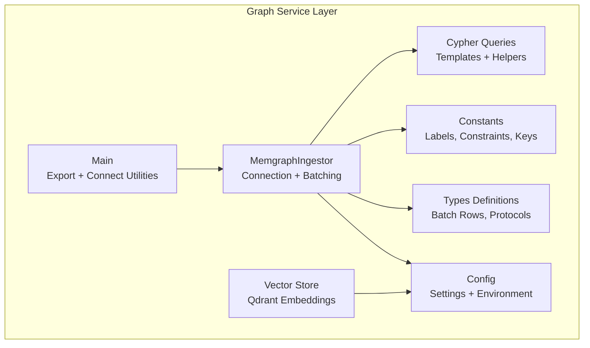
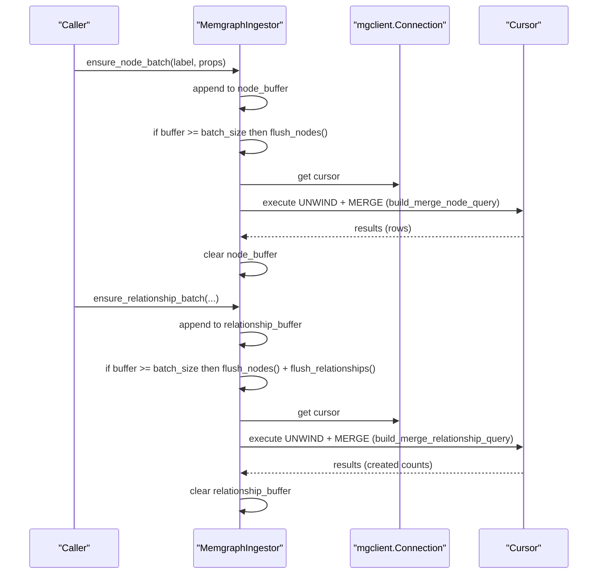
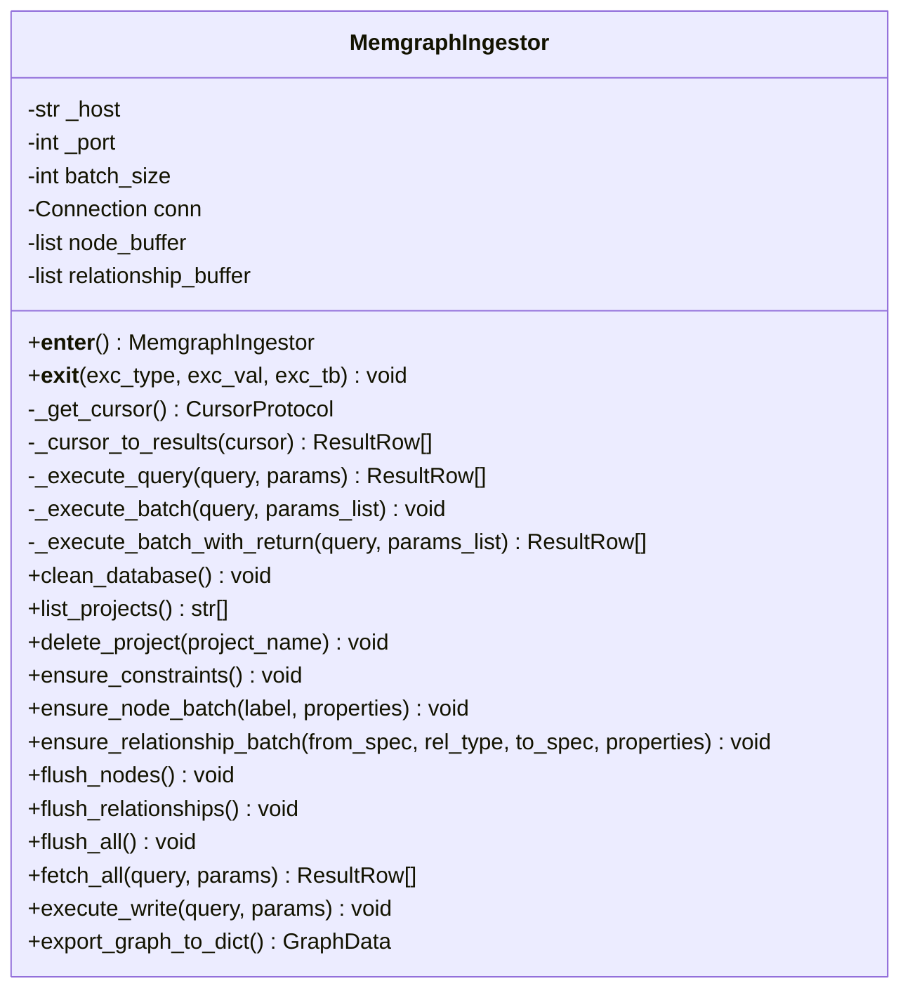
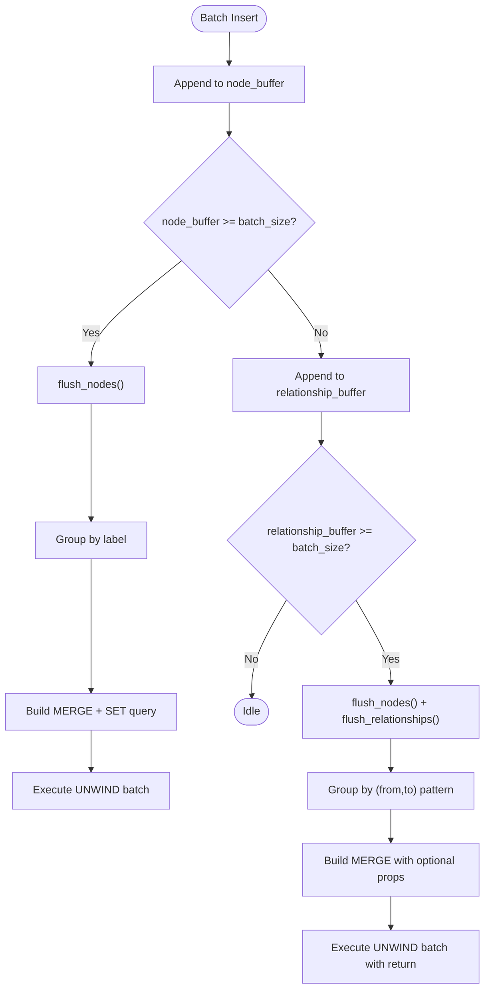
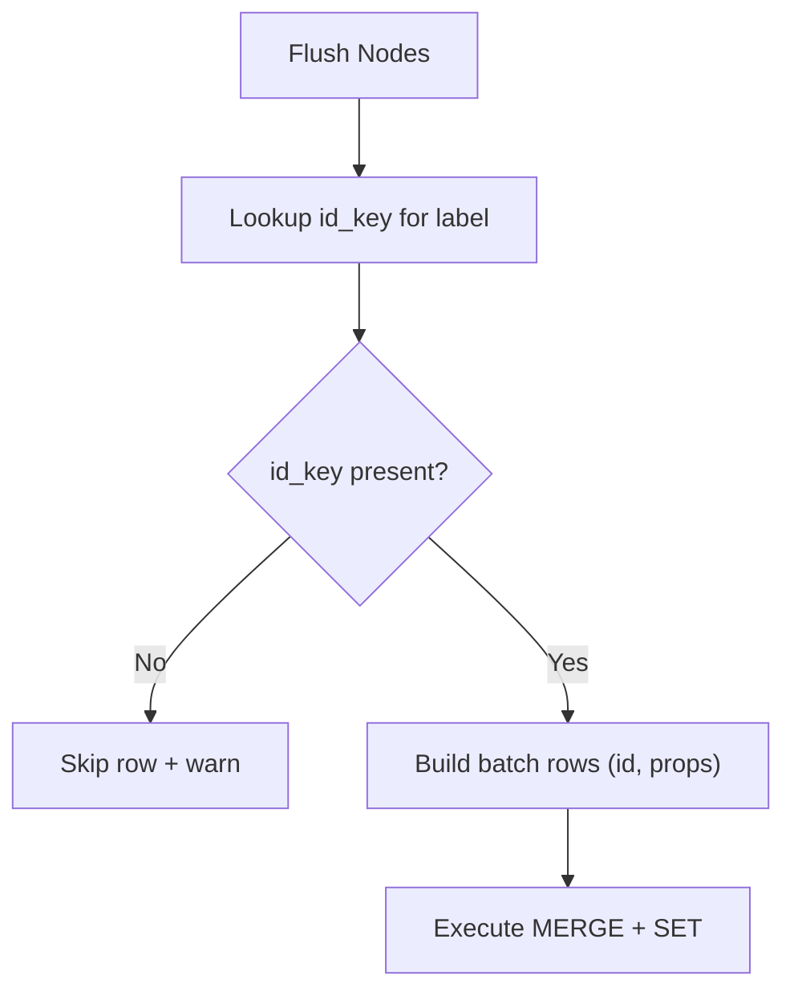
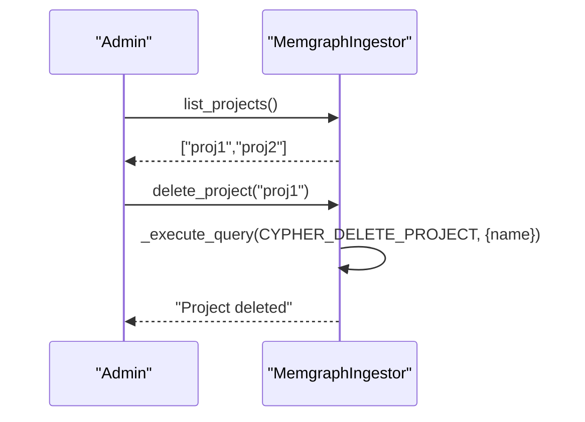
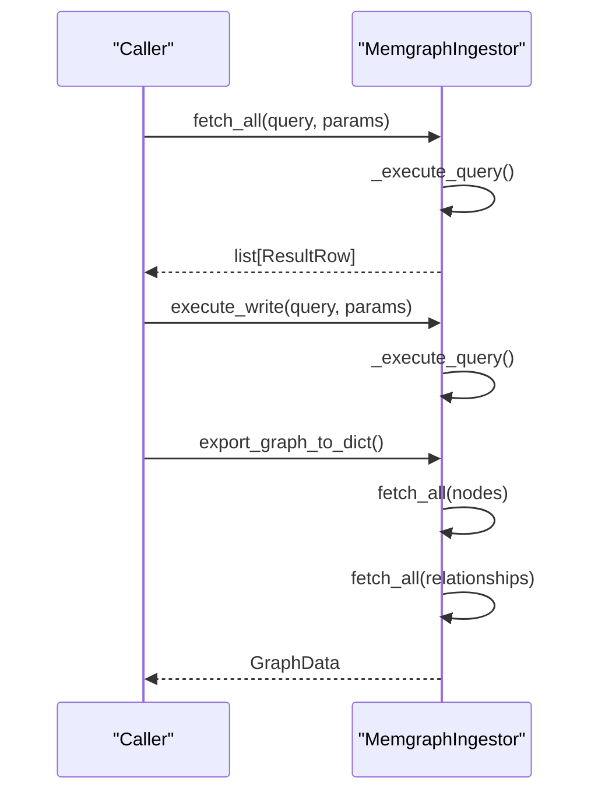
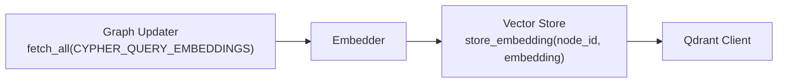
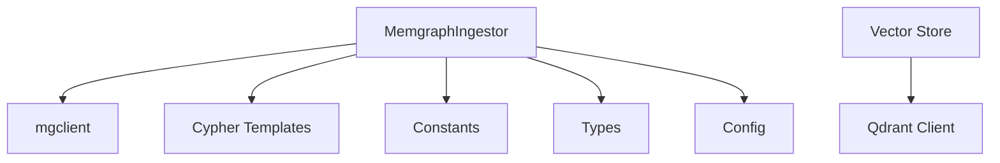

# Graph Storage and Retrieval

<cite>
**Referenced Files in This Document**
- [graph_service.py](file://codebase_rag/services/graph_service.py)
- [cypher_queries.py](file://codebase_rag/cypher_queries.py)
- [constants.py](file://codebase_rag/constants.py)
- [types_defs.py](file://codebase_rag/types_defs.py)
- [config.py](file://codebase_rag/config.py)
- [main.py](file://codebase_rag/main.py)
- [vector_store.py](file://codebase_rag/vector_store.py)
- [test_memgraph_batching.py](file://codebase_rag/tests/test_memgraph_batching.py)
</cite>

## Table of Contents
1. [Introduction](#introduction)
2. [Project Structure](#project-structure)
3. [Core Components](#core-components)
4. [Architecture Overview](#architecture-overview)
5. [Detailed Component Analysis](#detailed-component-analysis)
6. [Dependency Analysis](#dependency-analysis)
7. [Performance Considerations](#performance-considerations)
8. [Troubleshooting Guide](#troubleshooting-guide)
9. [Conclusion](#conclusion)

## Introduction
This document explains the graph storage and retrieval mechanisms implemented in the codebase, focusing on Memgraph integration, batching, constraints, and maintenance operations. It covers connection management, transaction handling, error recovery, batch processing for nodes and relationships, constraint enforcement, uniqueness validation, graph maintenance (cleaning and project deletion), fetch and write operation patterns, and performance optimization strategies for large-scale graph operations. Guidance is provided for connection pooling, retry mechanisms, and graceful degradation.

## Project Structure
The graph storage layer centers around a dedicated service that integrates with Memgraph via the mgclient driver. Supporting modules define Cypher helpers, constants, type definitions, configuration, and optional vector storage for embeddings.

**Diagram sources**
- [graph_service.py](file://codebase_rag/services/graph_service.py#L49-L364)
- [cypher_queries.py](file://codebase_rag/cypher_queries.py#L1-L120)
- [constants.py](file://codebase_rag/constants.py#L335-L351)
- [types_defs.py](file://codebase_rag/types_defs.py#L37-L53)
- [config.py](file://codebase_rag/config.py#L50-L57)
- [vector_store.py](file://codebase_rag/vector_store.py#L1-L81)
- [main.py](file://codebase_rag/main.py#L737-L743)

**Section sources**
- [graph_service.py](file://codebase_rag/services/graph_service.py#L49-L364)
- [cypher_queries.py](file://codebase_rag/cypher_queries.py#L1-L120)
- [constants.py](file://codebase_rag/constants.py#L335-L351)
- [types_defs.py](file://codebase_rag/types_defs.py#L37-L53)
- [config.py](file://codebase_rag/config.py#L50-L57)
- [vector_store.py](file://codebase_rag/vector_store.py#L1-L81)
- [main.py](file://codebase_rag/main.py#L737-L743)

## Core Components
- MemgraphIngestor: Manages connection lifecycle, batching buffers, transaction execution, and maintenance operations.
- Cypher query builders: Provide reusable templates for constraints, merges, exports, and helper functions.
- Constants: Define node labels, relationship types, unique key mappings, and error substrings.
- Types definitions: Define typed batch rows, wrappers, and protocols for cursor and result handling.
- Config: Centralized settings for Memgraph host/port, batch size, retries, and vector store parameters.
- Vector store: Optional integration with Qdrant for storing and searching embeddings.

**Section sources**
- [graph_service.py](file://codebase_rag/services/graph_service.py#L49-L364)
- [cypher_queries.py](file://codebase_rag/cypher_queries.py#L97-L120)
- [constants.py](file://codebase_rag/constants.py#L335-L351)
- [types_defs.py](file://codebase_rag/types_defs.py#L37-L53)
- [config.py](file://codebase_rag/config.py#L50-L57)
- [vector_store.py](file://codebase_rag/vector_store.py#L1-L81)

## Architecture Overview
The ingestion pipeline connects to Memgraph, buffers node and relationship inserts, and flushes batches using UNWIND operations. Constraints are enforced per node label, and maintenance operations support cleaning and project deletion. Optional embedding storage is handled separately.

**Diagram sources**
- [graph_service.py](file://codebase_rag/services/graph_service.py#L189-L217)
- [graph_service.py](file://codebase_rag/services/graph_service.py#L219-L265)
- [graph_service.py](file://codebase_rag/services/graph_service.py#L267-L321)
- [cypher_queries.py](file://codebase_rag/cypher_queries.py#L101-L119)

## Detailed Component Analysis

### MemgraphIngestor: Connection Management, Transactions, and Maintenance
- Connection lifecycle: Context manager establishes a connection with autocommit enabled and ensures flush and close on exit.
- Cursor management: Internal context manager ensures cursors are closed even on exceptions.
- Transaction handling: Uses single-statement executions for reads/writes; batch operations leverage UNWIND for atomicity and performance.
- Maintenance operations:
  - Clean database: Deletes all nodes and relationships.
  - List projects: Returns project names.
  - Delete project: Removes a project and its contained entities recursively.
- Fetch and write patterns:
  - fetch_all: Executes read queries and maps results to typed rows.
  - execute_write: Executes write queries.
  - export_graph_to_dict: Exports nodes and relationships with metadata.

**Diagram sources**
- [graph_service.py](file://codebase_rag/services/graph_service.py#L49-L364)

**Section sources**
- [graph_service.py](file://codebase_rag/services/graph_service.py#L67-L82)
- [graph_service.py](file://codebase_rag/services/graph_service.py#L84-L94)
- [graph_service.py](file://codebase_rag/services/graph_service.py#L104-L123)
- [graph_service.py](file://codebase_rag/services/graph_service.py#L166-L178)
- [graph_service.py](file://codebase_rag/services/graph_service.py#L171-L173)
- [graph_service.py](file://codebase_rag/services/graph_service.py#L175-L178)
- [graph_service.py](file://codebase_rag/services/graph_service.py#L329-L339)
- [graph_service.py](file://codebase_rag/services/graph_service.py#L341-L360)

### Batch Processing System: Nodes and Relationships
- Node batching:
  - Buffer by label and enforce uniqueness via label-specific unique keys.
  - Build merge queries per label and execute UNWIND batches.
  - Log skipped rows when unique key is missing.
- Relationship batching:
  - Group by (from_label, from_key, rel_type, to_label, to_key) pattern.
  - Build merge queries with optional properties and return created counts.
  - Track attempted vs successful creations and warn on failures.
- Threshold-triggered flush: Flush when buffer reaches configured batch size.

**Diagram sources**
- [graph_service.py](file://codebase_rag/services/graph_service.py#L189-L217)
- [graph_service.py](file://codebase_rag/services/graph_service.py#L219-L265)
- [graph_service.py](file://codebase_rag/services/graph_service.py#L267-L321)
- [cypher_queries.py](file://codebase_rag/cypher_queries.py#L101-L119)

**Section sources**
- [graph_service.py](file://codebase_rag/services/graph_service.py#L189-L217)
- [graph_service.py](file://codebase_rag/services/graph_service.py#L219-L265)
- [graph_service.py](file://codebase_rag/services/graph_service.py#L267-L321)
- [test_memgraph_batching.py](file://codebase_rag/tests/test_memgraph_batching.py#L20-L90)

### Constraint Enforcement and Uniqueness Validation
- Unique key mapping: Each node label maps to a unique property key (e.g., name, path, qualified_name).
- Constraint creation: Iterates over label-property pairs and issues CREATE CONSTRAINT statements.
- Validation during flush: Skips nodes without the required unique property and logs warnings.

**Diagram sources**
- [constants.py](file://codebase_rag/constants.py#L335-L351)
- [graph_service.py](file://codebase_rag/services/graph_service.py#L180-L187)
- [graph_service.py](file://codebase_rag/services/graph_service.py#L234-L259)

**Section sources**
- [constants.py](file://codebase_rag/constants.py#L335-L351)
- [graph_service.py](file://codebase_rag/services/graph_service.py#L180-L187)
- [graph_service.py](file://codebase_rag/services/graph_service.py#L234-L259)

### Graph Maintenance Operations
- Clean database: Deletes all nodes and relationships.
- List projects: Returns project names for management.
- Delete project: Recursively removes a project and its contained entities.

**Diagram sources**
- [graph_service.py](file://codebase_rag/services/graph_service.py#L171-L173)
- [graph_service.py](file://codebase_rag/services/graph_service.py#L175-L178)
- [cypher_queries.py](file://codebase_rag/cypher_queries.py#L7-L12)

**Section sources**
- [graph_service.py](file://codebase_rag/services/graph_service.py#L166-L178)
- [cypher_queries.py](file://codebase_rag/cypher_queries.py#L3-L12)

### Fetch and Write Operation Patterns
- Fetch: Wraps query execution and maps results to typed rows for downstream processing.
- Write: Executes write queries with optional parameters.
- Export: Exports entire graph to dictionary format with metadata.

**Diagram sources**
- [graph_service.py](file://codebase_rag/services/graph_service.py#L329-L339)
- [graph_service.py](file://codebase_rag/services/graph_service.py#L341-L360)

**Section sources**
- [graph_service.py](file://codebase_rag/services/graph_service.py#L329-L360)

### Embeddings and Vector Store Integration
- Optional Qdrant-backed vector store supports storing and searching embeddings.
- Integration occurs after graph updates to enrich nodes with embeddings.

**Diagram sources**
- [graph_service.py](file://codebase_rag/services/graph_service.py#L369-L418)
- [vector_store.py](file://codebase_rag/vector_store.py#L27-L48)

**Section sources**
- [graph_service.py](file://codebase_rag/services/graph_service.py#L369-L418)
- [vector_store.py](file://codebase_rag/vector_store.py#L1-L81)

## Dependency Analysis
- MemgraphIngestor depends on:
  - mgclient for connectivity.
  - Cypher templates for query construction.
  - Constants for label-to-unique-key mapping.
  - Types for typed batch parameters and cursor protocol.
  - Config for connection settings and batch size resolution.
- Vector store depends on Qdrant client availability and configuration.

**Diagram sources**
- [graph_service.py](file://codebase_rag/services/graph_service.py#L6-L46)
- [cypher_queries.py](file://codebase_rag/cypher_queries.py#L1-L120)
- [constants.py](file://codebase_rag/constants.py#L335-L351)
- [types_defs.py](file://codebase_rag/types_defs.py#L37-L53)
- [config.py](file://codebase_rag/config.py#L50-L57)
- [vector_store.py](file://codebase_rag/vector_store.py#L8-L25)

**Section sources**
- [graph_service.py](file://codebase_rag/services/graph_service.py#L6-L46)
- [cypher_queries.py](file://codebase_rag/cypher_queries.py#L1-L120)
- [constants.py](file://codebase_rag/constants.py#L335-L351)
- [types_defs.py](file://codebase_rag/types_defs.py#L37-L53)
- [config.py](file://codebase_rag/config.py#L50-L57)
- [vector_store.py](file://codebase_rag/vector_store.py#L8-L25)

## Performance Considerations
- Batch size tuning: Adjust MEMGRAPH_BATCH_SIZE to balance memory and throughput. Larger batches reduce round-trips but increase memory usage.
- UNWIND batching: Prefer UNWIND for bulk operations to minimize per-row overhead.
- Constraint enforcement: Ensure constraints exist prior to ingestion to avoid runtime conflicts.
- Cursor lifecycle: Always close cursors after use; the context manager enforces this.
- Logging and truncation: Batch errors truncate long parameter lists to avoid noisy logs.
- Optional embeddings: Offload embedding generation and storage to Qdrant to keep graph ingestion fast.

[No sources needed since this section provides general guidance]

## Troubleshooting Guide
- Connection errors: Verify host/port settings and network connectivity. The context manager logs connection and disconnection events.
- Constraint violations: The system suppresses logging for “already exists” and “constraint” errors; inspect logs for unexpected failures.
- Batch failures: On batch errors, logs show truncated parameters for readability; review the query and parameter shapes.
- Cursor lifecycle: Exceptions automatically close cursors; ensure queries are valid and parameters are properly typed.
- Maintenance operations: Use clean_database and delete_project carefully; confirm project names and permissions.

**Section sources**
- [graph_service.py](file://codebase_rag/services/graph_service.py#L67-L82)
- [graph_service.py](file://codebase_rag/services/graph_service.py#L114-L122)
- [graph_service.py](file://codebase_rag/services/graph_service.py#L131-L146)
- [graph_service.py](file://codebase_rag/services/graph_service.py#L84-L94)

## Conclusion
The graph storage subsystem provides robust, batch-oriented ingestion to Memgraph with strong constraint enforcement and maintenance capabilities. By leveraging UNWIND-based batch operations, typed parameters, and careful cursor management, it scales to large codebases. Optional vector store integration enables semantic search post-ingestion. Proper configuration of batch sizes, connection settings, and maintenance routines ensures reliable operation under varied workloads.