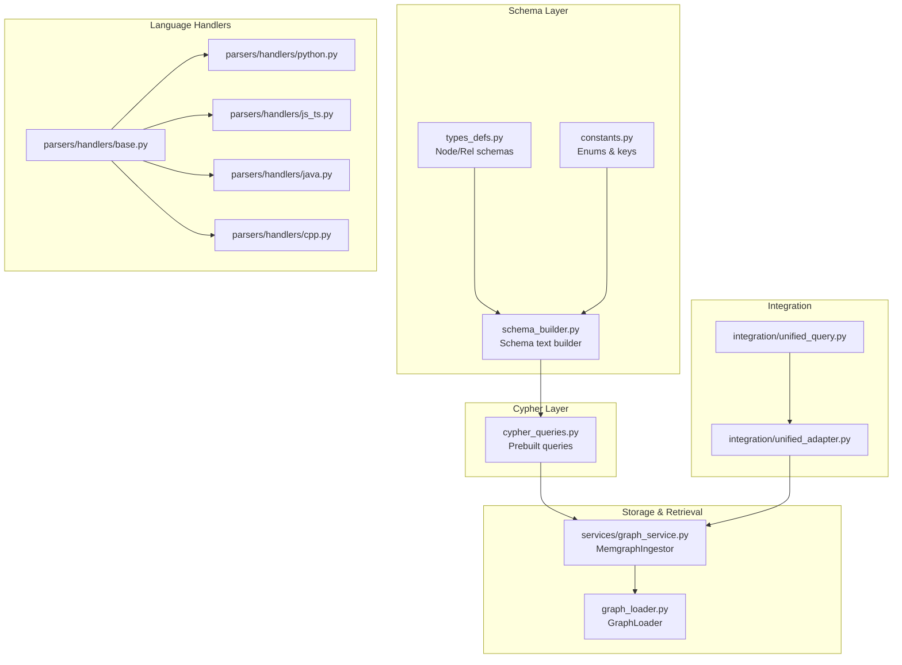
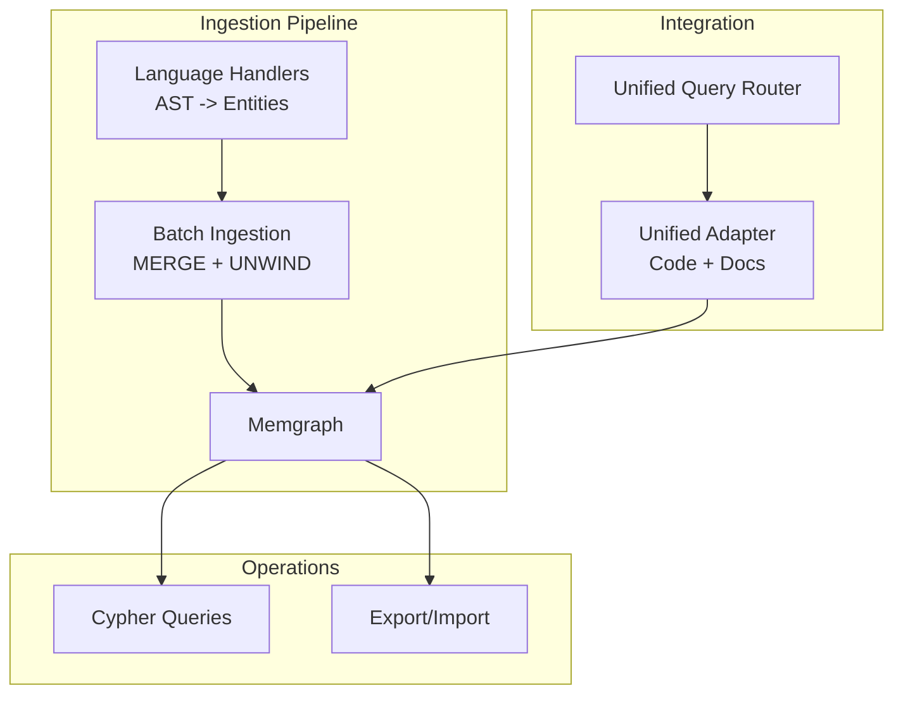
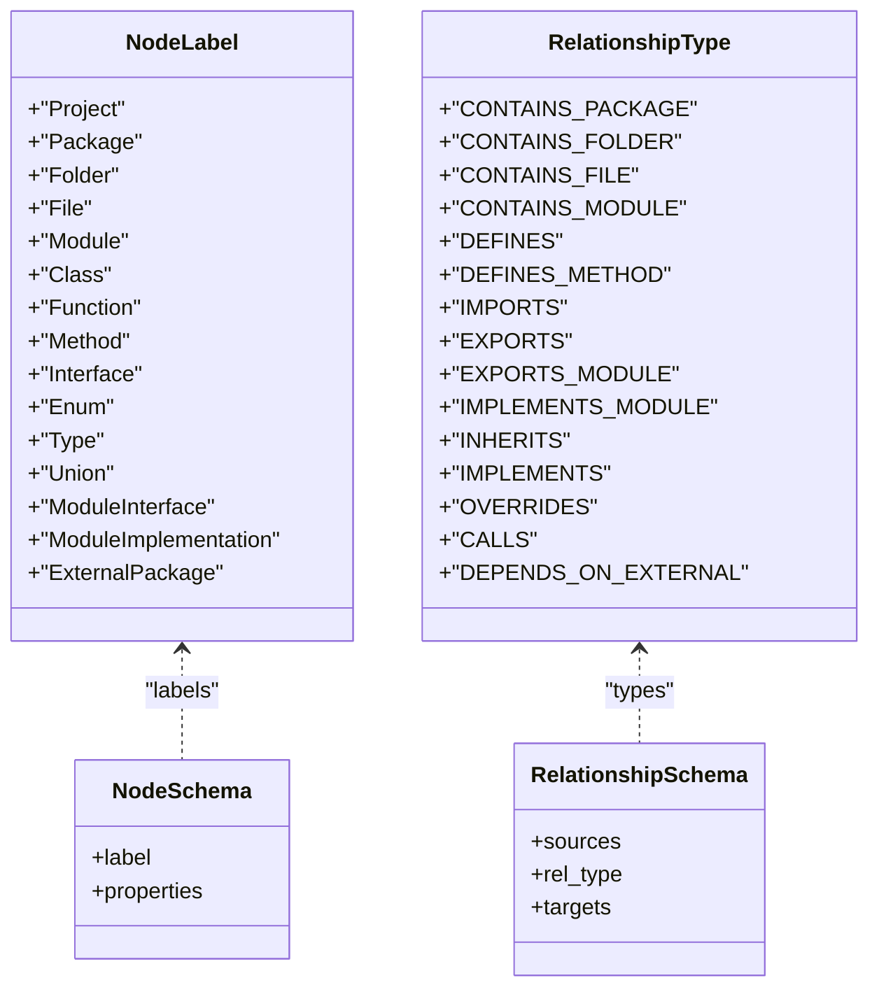
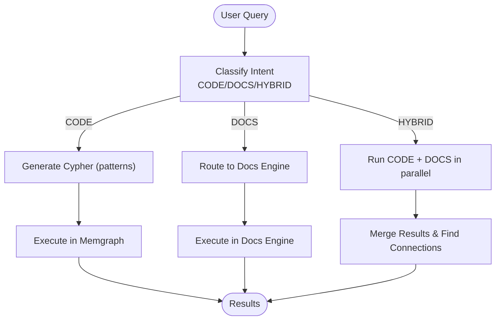
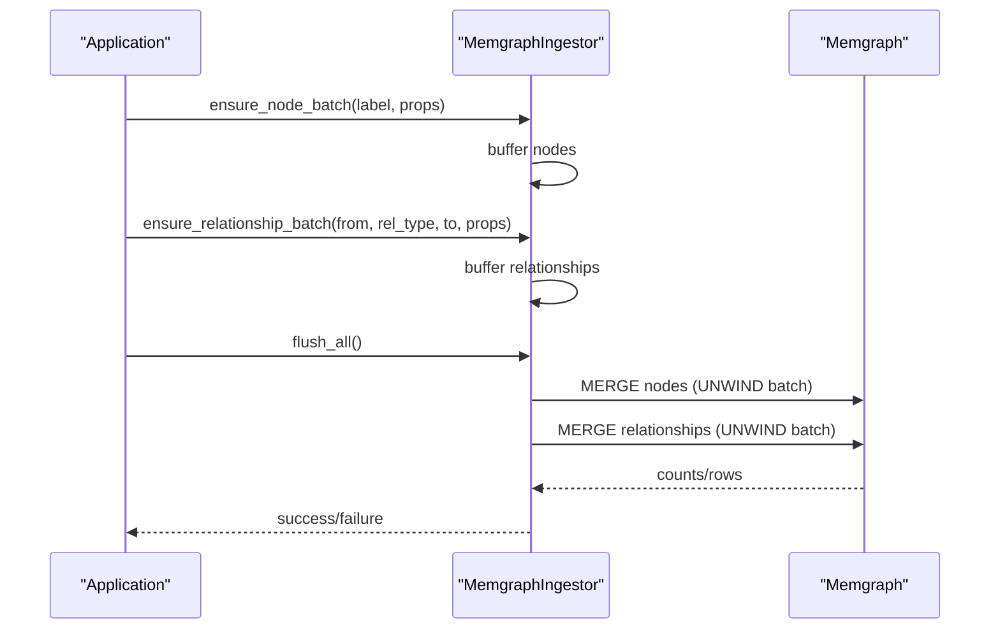
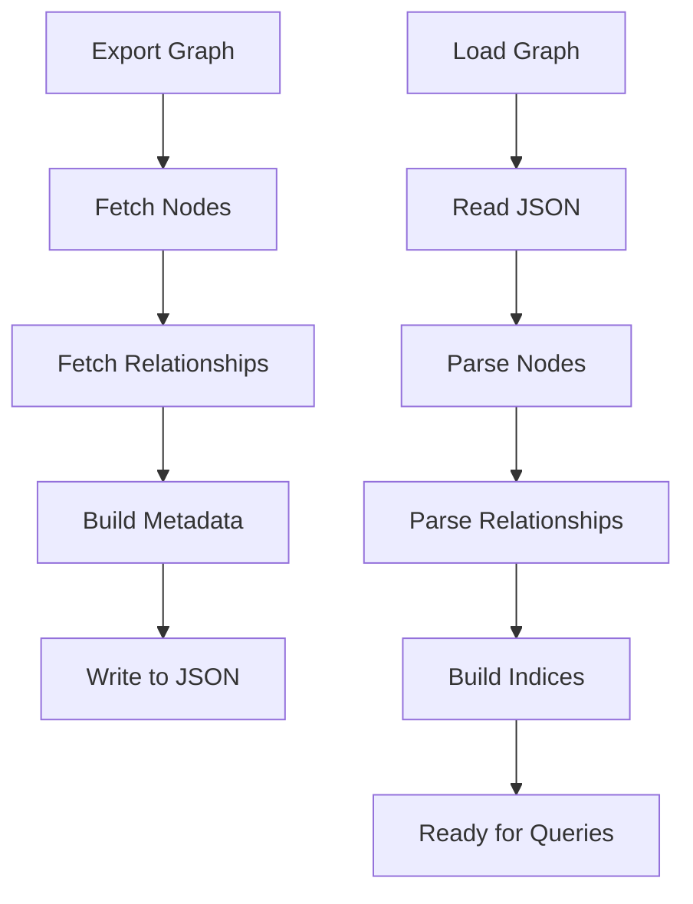
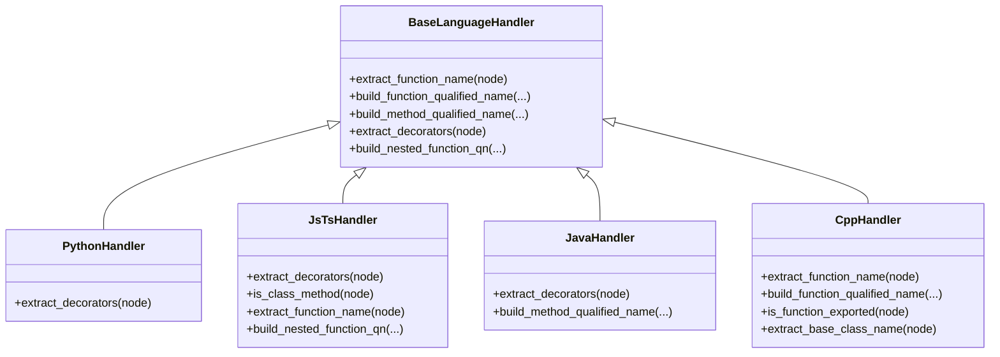
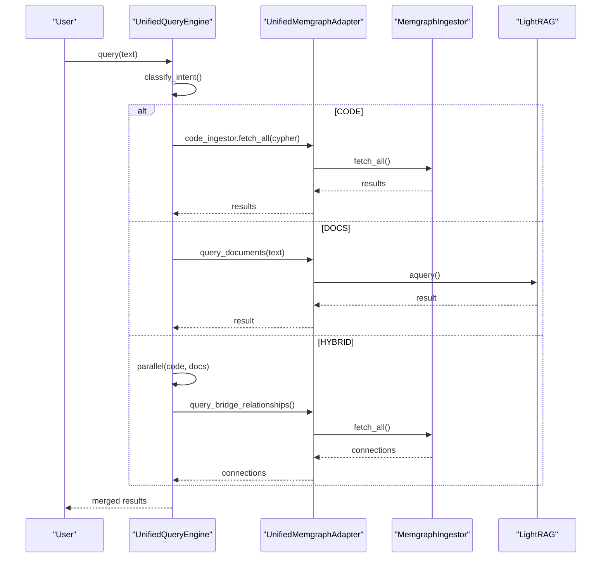
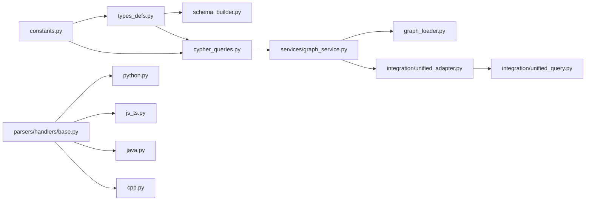

# Knowledge Graph System

<cite>
**Referenced Files in This Document**
- [schemas.py](file://codebase_rag/schemas.py)
- [schema_builder.py](file://codebase_rag/schema_builder.py)
- [types_defs.py](file://codebase_rag/types_defs.py)
- [constants.py](file://codebase_rag/constants.py)
- [cypher_queries.py](file://codebase_rag/cypher_queries.py)
- [services/graph_service.py](file://codebase_rag/services/graph_service.py)
- [graph_loader.py](file://codebase_rag/graph_loader.py)
- [models.py](file://codebase_rag/models.py)
- [parsers/handlers/base.py](file://codebase_rag/parsers/handlers/base.py)
- [parsers/handlers/python.py](file://codebase_rag/parsers/handlers/python.py)
- [parsers/handlers/js_ts.py](file://codebase_rag/parsers/handlers/js_ts.py)
- [parsers/handlers/java.py](file://codebase_rag/parsers/handlers/java.py)
- [parsers/handlers/cpp.py](file://codebase_rag/parsers/handlers/cpp.py)
- [integration/unified_adapter.py](file://codebase_rag/integration/unified_adapter.py)
- [integration/unified_query.py](file://codebase_rag/integration/unified_query.py)
</cite>

## Table of Contents
1. [Introduction](#introduction)
2. [Project Structure](#project-structure)
3. [Core Components](#core-components)
4. [Architecture Overview](#architecture-overview)
5. [Detailed Component Analysis](#detailed-component-analysis)
6. [Dependency Analysis](#dependency-analysis)
7. [Performance Considerations](#performance-considerations)
8. [Troubleshooting Guide](#troubleshooting-guide)
9. [Conclusion](#conclusion)
10. [Appendices](#appendices)

## Introduction
This document describes the Graph-Code knowledge graph system, focusing on the unified graph schema, language abstraction, Cypher generation and routing, storage and retrieval via Memgraph, export/import capabilities, and operational maintenance. It explains how language-specific constructs are mapped to a common set of node and relationship types and how natural language queries are translated into efficient graph traversals.

## Project Structure
The knowledge graph system is organized around:
- Schema definitions and builders for node and relationship types
- Cypher query library and builder utilities
- Graph ingestion and retrieval service backed by Memgraph
- Graph export/import loaders for programmatic access
- Language handlers that normalize AST constructs into unified entities
- Integration adapters and query router for unified code + documentation workflows

**Diagram sources**
- [types_defs.py](file://codebase_rag/types_defs.py#L424-L555)
- [constants.py](file://codebase_rag/constants.py#L317-L377)
- [schema_builder.py](file://codebase_rag/schema_builder.py#L23-L42)
- [cypher_queries.py](file://codebase_rag/cypher_queries.py#L1-L120)
- [services/graph_service.py](file://codebase_rag/services/graph_service.py#L49-L364)
- [graph_loader.py](file://codebase_rag/graph_loader.py#L15-L155)
- [parsers/handlers/base.py](file://codebase_rag/parsers/handlers/base.py#L15-L108)
- [parsers/handlers/python.py](file://codebase_rag/parsers/handlers/python.py#L13-L23)
- [parsers/handlers/js_ts.py](file://codebase_rag/parsers/handlers/js_ts.py#L14-L116)
- [parsers/handlers/java.py](file://codebase_rag/parsers/handlers/java.py#L13-L29)
- [parsers/handlers/cpp.py](file://codebase_rag/parsers/handlers/cpp.py#L19-L60)
- [integration/unified_adapter.py](file://codebase_rag/integration/unified_adapter.py#L19-L384)
- [integration/unified_query.py](file://codebase_rag/integration/unified_query.py#L25-L376)

**Section sources**
- [types_defs.py](file://codebase_rag/types_defs.py#L424-L555)
- [constants.py](file://codebase_rag/constants.py#L317-L377)
- [schema_builder.py](file://codebase_rag/schema_builder.py#L23-L42)
- [cypher_queries.py](file://codebase_rag/cypher_queries.py#L1-L120)
- [services/graph_service.py](file://codebase_rag/services/graph_service.py#L49-L364)
- [graph_loader.py](file://codebase_rag/graph_loader.py#L15-L155)
- [parsers/handlers/base.py](file://codebase_rag/parsers/handlers/base.py#L15-L108)
- [parsers/handlers/python.py](file://codebase_rag/parsers/handlers/python.py#L13-L23)
- [parsers/handlers/js_ts.py](file://codebase_rag/parsers/handlers/js_ts.py#L14-L116)
- [parsers/handlers/java.py](file://codebase_rag/parsers/handlers/java.py#L13-L29)
- [parsers/handlers/cpp.py](file://codebase_rag/parsers/handlers/cpp.py#L19-L60)
- [integration/unified_adapter.py](file://codebase_rag/integration/unified_adapter.py#L19-L384)
- [integration/unified_query.py](file://codebase_rag/integration/unified_query.py#L25-L376)

## Core Components
- Unified graph schema: Defines node labels and relationship types used across languages, plus unique-key constraints per node label.
- Cypher query library: Provides prebuilt queries for common operations and builders for batched MERGE operations.
- Memgraph ingestion and retrieval: Streaming ingestion with batching, constraint enforcement, and export/import utilities.
- Graph loader: Loads exported graph data into memory for programmatic access.
- Language handlers: Normalize AST constructs (functions, classes, imports, calls) into unified entities and compute qualified names.
- Integration adapter and query router: Route natural language queries to code or documentation systems and optionally merge results.

**Section sources**
- [types_defs.py](file://codebase_rag/types_defs.py#L424-L555)
- [constants.py](file://codebase_rag/constants.py#L317-L377)
- [cypher_queries.py](file://codebase_rag/cypher_queries.py#L1-L120)
- [services/graph_service.py](file://codebase_rag/services/graph_service.py#L49-L364)
- [graph_loader.py](file://codebase_rag/graph_loader.py#L15-L155)
- [parsers/handlers/base.py](file://codebase_rag/parsers/handlers/base.py#L15-L108)
- [integration/unified_adapter.py](file://codebase_rag/integration/unified_adapter.py#L19-L384)
- [integration/unified_query.py](file://codebase_rag/integration/unified_query.py#L25-L376)

## Architecture Overview
The system centers on a unified graph schema and Cypher-based operations executed against Memgraph. Language handlers transform AST nodes into unified entities, which are ingested in batches. Export and import enable programmatic access to the graph. An integration adapter allows coexistence with a documentation system (LightRAG) on the same Memgraph instance, with a query router classifying and routing user intents.

**Diagram sources**
- [services/graph_service.py](file://codebase_rag/services/graph_service.py#L189-L327)
- [cypher_queries.py](file://codebase_rag/cypher_queries.py#L54-L120)
- [graph_loader.py](file://codebase_rag/graph_loader.py#L36-L155)
- [integration/unified_adapter.py](file://codebase_rag/integration/unified_adapter.py#L19-L384)
- [integration/unified_query.py](file://codebase_rag/integration/unified_query.py#L25-L376)

## Detailed Component Analysis

### Unified Graph Schema
The schema defines:
- Node labels and their unique-key constraints
- Relationship types and allowed source/target combinations
- Node and relationship schemas for documentation and validation

Key aspects:
- Node labels include Project, Package, Folder, File, Module, Class, Function, Method, Interface, Enum, Type, Union, ModuleInterface, ModuleImplementation, ExternalPackage.
- Relationship types include CONTAINS_PACKAGE, CONTAINS_FOLDER, CONTAINS_FILE, CONTAINS_MODULE, DEFINES, DEFINES_METHOD, IMPORTS, EXPORTS, EXPORTS_MODULE, IMPLEMENTS_MODULE, INHERITS, IMPLEMENTS, OVERRIDES, CALLS, DEPENDS_ON_EXTERNAL.
- Unique-key constraints per node label ensure deterministic MERGE operations.

**Diagram sources**
- [constants.py](file://codebase_rag/constants.py#L317-L377)
- [types_defs.py](file://codebase_rag/types_defs.py#L424-L555)

**Section sources**
- [constants.py](file://codebase_rag/constants.py#L317-L377)
- [types_defs.py](file://codebase_rag/types_defs.py#L424-L555)

### Cypher Query Generation and Routing
The Cypher layer provides:
- Prebuilt queries for common tasks (listing projects, deleting projects, exporting nodes/relationships, keyword searches, etc.)
- Builders for batched MERGE operations on nodes and relationships
- A simple pattern-based Cypher generator for natural language queries in the unified query router

**Diagram sources**
- [integration/unified_query.py](file://codebase_rag/integration/unified_query.py#L87-L376)
- [cypher_queries.py](file://codebase_rag/cypher_queries.py#L1-L120)

**Section sources**
- [cypher_queries.py](file://codebase_rag/cypher_queries.py#L1-L120)
- [integration/unified_query.py](file://codebase_rag/integration/unified_query.py#L25-L376)

### Memgraph Storage and Batch Operations
The ingestion service:
- Connects to Memgraph and executes Cypher statements
- Buffers nodes and relationships and flushes in batches
- Builds MERGE queries dynamically based on node label unique keys
- Enforces constraints and logs failures
- Exports the entire graph for programmatic access

**Diagram sources**
- [services/graph_service.py](file://codebase_rag/services/graph_service.py#L189-L327)
- [cypher_queries.py](file://codebase_rag/cypher_queries.py#L101-L120)

**Section sources**
- [services/graph_service.py](file://codebase_rag/services/graph_service.py#L49-L364)
- [cypher_queries.py](file://codebase_rag/cypher_queries.py#L101-L120)

### Graph Export and Import
- Export: Retrieves all nodes and relationships with metadata for persistence or downstream processing.
- Import: Loads a previously exported graph into memory, building indices for fast lookups.

**Diagram sources**
- [services/graph_service.py](file://codebase_rag/services/graph_service.py#L341-L364)
- [graph_loader.py](file://codebase_rag/graph_loader.py#L36-L155)

**Section sources**
- [services/graph_service.py](file://codebase_rag/services/graph_service.py#L341-L364)
- [graph_loader.py](file://codebase_rag/graph_loader.py#L15-L155)

### Language-Specific Handlers and Unified Mapping
Language handlers normalize AST constructs into unified entities:
- Base handler provides defaults for extracting names, decorators, and computing qualified names.
- Language-specific handlers refine behavior for Python, JavaScript/TypeScript, Java, and C++.

**Diagram sources**
- [parsers/handlers/base.py](file://codebase_rag/parsers/handlers/base.py#L15-L108)
- [parsers/handlers/python.py](file://codebase_rag/parsers/handlers/python.py#L13-L23)
- [parsers/handlers/js_ts.py](file://codebase_rag/parsers/handlers/js_ts.py#L14-L116)
- [parsers/handlers/java.py](file://codebase_rag/parsers/handlers/java.py#L13-L29)
- [parsers/handlers/cpp.py](file://codebase_rag/parsers/handlers/cpp.py#L19-L60)

**Section sources**
- [parsers/handlers/base.py](file://codebase_rag/parsers/handlers/base.py#L15-L108)
- [parsers/handlers/python.py](file://codebase_rag/parsers/handlers/python.py#L13-L23)
- [parsers/handlers/js_ts.py](file://codebase_rag/parsers/handlers/js_ts.py#L14-L116)
- [parsers/handlers/java.py](file://codebase_rag/parsers/handlers/java.py#L13-L29)
- [parsers/handlers/cpp.py](file://codebase_rag/parsers/handlers/cpp.py#L19-L60)

### Unified Adapter and Query Router
The unified adapter:
- Shares a single Memgraph instance between graph-code and LightRAG
- Adds a node_type marker to code nodes for filtering
- Exposes APIs to add code nodes/relationships, bridge relationships, and query statistics

The unified query router:
- Classifies user intent (code/docs/hybrid) using keyword patterns
- Routes to code or documentation engines and merges results with bridge relationships

**Diagram sources**
- [integration/unified_adapter.py](file://codebase_rag/integration/unified_adapter.py#L19-L384)
- [integration/unified_query.py](file://codebase_rag/integration/unified_query.py#L25-L376)

**Section sources**
- [integration/unified_adapter.py](file://codebase_rag/integration/unified_adapter.py#L19-L384)
- [integration/unified_query.py](file://codebase_rag/integration/unified_query.py#L25-L376)

## Dependency Analysis
The schema and constants define the canonical node and relationship types. The Cypher library depends on these definitions to construct queries. The ingestion service builds MERGE statements based on unique-key constraints. The loader depends on the exported JSON structure. The language handlers depend on constants for AST node types and fields.

**Diagram sources**
- [constants.py](file://codebase_rag/constants.py#L317-L377)
- [types_defs.py](file://codebase_rag/types_defs.py#L424-L555)
- [schema_builder.py](file://codebase_rag/schema_builder.py#L23-L42)
- [cypher_queries.py](file://codebase_rag/cypher_queries.py#L1-L120)
- [services/graph_service.py](file://codebase_rag/services/graph_service.py#L49-L364)
- [graph_loader.py](file://codebase_rag/graph_loader.py#L15-L155)
- [parsers/handlers/base.py](file://codebase_rag/parsers/handlers/base.py#L15-L108)
- [parsers/handlers/python.py](file://codebase_rag/parsers/handlers/python.py#L13-L23)
- [parsers/handlers/js_ts.py](file://codebase_rag/parsers/handlers/js_ts.py#L14-L116)
- [parsers/handlers/java.py](file://codebase_rag/parsers/handlers/java.py#L13-L29)
- [parsers/handlers/cpp.py](file://codebase_rag/parsers/handlers/cpp.py#L19-L60)
- [integration/unified_adapter.py](file://codebase_rag/integration/unified_adapter.py#L19-L384)
- [integration/unified_query.py](file://codebase_rag/integration/unified_query.py#L25-L376)

**Section sources**
- [constants.py](file://codebase_rag/constants.py#L317-L377)
- [types_defs.py](file://codebase_rag/types_defs.py#L424-L555)
- [schema_builder.py](file://codebase_rag/schema_builder.py#L23-L42)
- [cypher_queries.py](file://codebase_rag/cypher_queries.py#L1-L120)
- [services/graph_service.py](file://codebase_rag/services/graph_service.py#L49-L364)
- [graph_loader.py](file://codebase_rag/graph_loader.py#L15-L155)
- [parsers/handlers/base.py](file://codebase_rag/parsers/handlers/base.py#L15-L108)
- [parsers/handlers/python.py](file://codebase_rag/parsers/handlers/python.py#L13-L23)
- [parsers/handlers/js_ts.py](file://codebase_rag/parsers/handlers/js_ts.py#L14-L116)
- [parsers/handlers/java.py](file://codebase_rag/parsers/handlers/java.py#L13-L29)
- [parsers/handlers/cpp.py](file://codebase_rag/parsers/handlers/cpp.py#L19-L60)
- [integration/unified_adapter.py](file://codebase_rag/integration/unified_adapter.py#L19-L384)
- [integration/unified_query.py](file://codebase_rag/integration/unified_query.py#L25-L376)

## Performance Considerations
- Batch size tuning: Larger batches reduce round-trips but increase memory usage; adjust the ingestion batch size according to available resources.
- Constraint enforcement: Unique-key constraints prevent duplicates and support efficient MERGE; ensure constraints are created once before ingestion.
- Index-free island lookups: Use qualified_name and path properties to minimize scans; leverage labels to narrow result sets.
- Export granularity: Export only when needed; import selectively for targeted analysis.
- Parallelism: The unified query router supports parallel execution of code and docs queries for hybrid scenarios.
- Logging and observability: The ingestion service logs batch sizes, successes/failures, and warnings for failed CALLS relationships.

[No sources needed since this section provides general guidance]

## Troubleshooting Guide
Common issues and remedies:
- Connection errors to Memgraph: Verify host/port and network connectivity; ensure Memgraph is running.
- Batch errors: Inspect truncated batch parameters logged; reduce batch size or fix malformed rows.
- Constraint violations: Ensure unique-key properties are present for each node label before MERGE.
- Missing relationships: Review CALLS relationship resolution; check for missing nodes or unresolved qualified names.
- Export/import failures: Validate JSON structure and metadata; ensure file permissions and paths are correct.

**Section sources**
- [services/graph_service.py](file://codebase_rag/services/graph_service.py#L104-L165)
- [graph_loader.py](file://codebase_rag/graph_loader.py#L36-L155)

## Conclusion
The Graph-Code knowledge graph system provides a unified schema and robust tooling for indexing, storing, querying, and integrating code knowledge with documentation. Its modular design enables language abstraction, efficient batch ingestion, and flexible export/import workflows, while the integration adapter and query router enable intelligent routing and merging of results across systems.

[No sources needed since this section summarizes without analyzing specific files]

## Appendices

### Appendix A: Example Queries and Translations
Below are representative examples of common queries and their Cypher translations. These demonstrate typical traversal patterns for finding entities and relationships in the knowledge graph.

- List projects
  - Cypher: MATCH (p:Project) RETURN p.name AS name ORDER BY p.name
- Delete a project and its contents
  - Cypher: MATCH (p:Project {name: $project_name}) OPTIONAL MATCH (p)-[:CONTAINS_PACKAGE|CONTAINS_FOLDER|CONTAINS_FILE|CONTAINS_MODULE*]->(container) OPTIONAL MATCH (container)-[:DEFINES|DEFINES_METHOD*]->(defined) DETACH DELETE p, container, defined
- Find decorated functions
  - Cypher: MATCH (n:Function|Method) WHERE ANY(d IN n.decorators WHERE toLower(d) IN ['flow', 'task']) RETURN n.name AS name, n.qualified_name AS qualified_name, labels(n) AS type LIMIT <limit>
- Keyword search across names and qualified names
  - Cypher: MATCH (n) WHERE toLower(n.name) CONTAINS 'database' OR (n.qualified_name IS NOT NULL AND toLower(n.qualified_name) CONTAINS 'database') RETURN n.name AS name, n.qualified_name AS qualified_name, labels(n) AS type LIMIT <limit>
- Find a specific file by name and path
  - Cypher: MATCH (f:File) WHERE toLower(f.name) = 'readme.md' AND f.path = 'README.md' RETURN f.path as path, f.name as name, labels(f) as type
- Export all nodes and relationships
  - Cypher: MATCH (n) RETURN id(n) as node_id, labels(n) as labels, properties(n) as properties; MATCH (a)-[r]->(b) RETURN id(a) as from_id, id(b) as to_id, type(r) as type, properties(r) as properties

**Section sources**
- [cypher_queries.py](file://codebase_rag/cypher_queries.py#L5-L120)

### Appendix B: Graph Maintenance Operations
- Clean database: DELETE ALL nodes and relationships
- List projects: Retrieve project names
- Delete project: Remove a project and all contained entities
- Export graph: Serialize nodes, relationships, and metadata
- Import graph: Deserialize and index a previously exported graph

**Section sources**
- [services/graph_service.py](file://codebase_rag/services/graph_service.py#L166-L178)
- [services/graph_service.py](file://codebase_rag/services/graph_service.py#L341-L364)
- [graph_loader.py](file://codebase_rag/graph_loader.py#L36-L155)