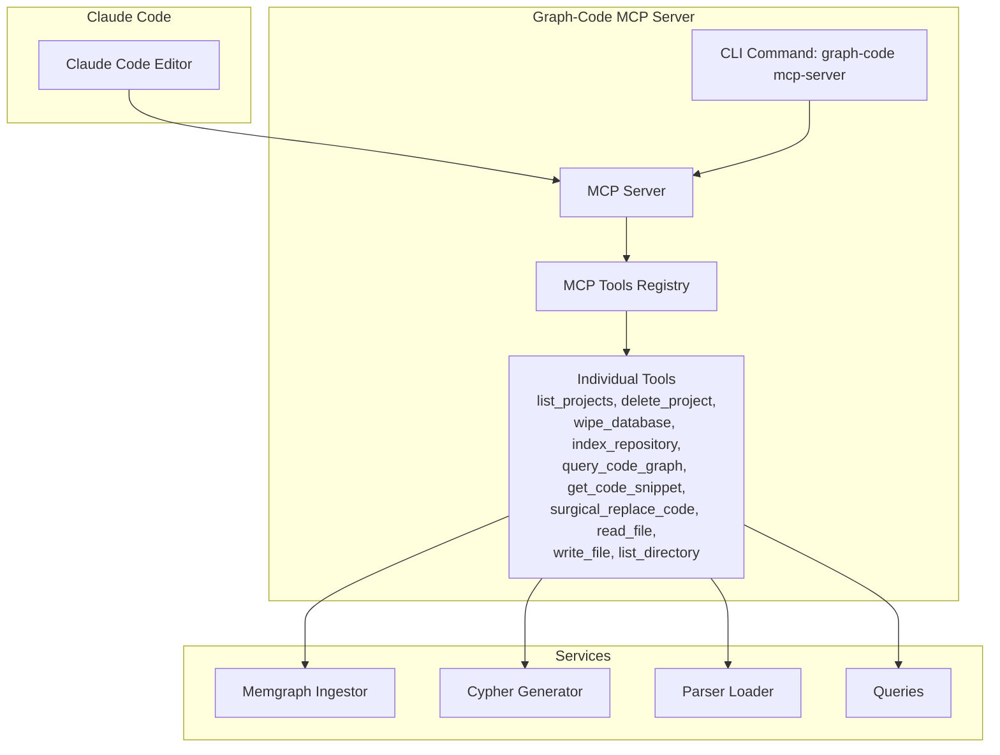
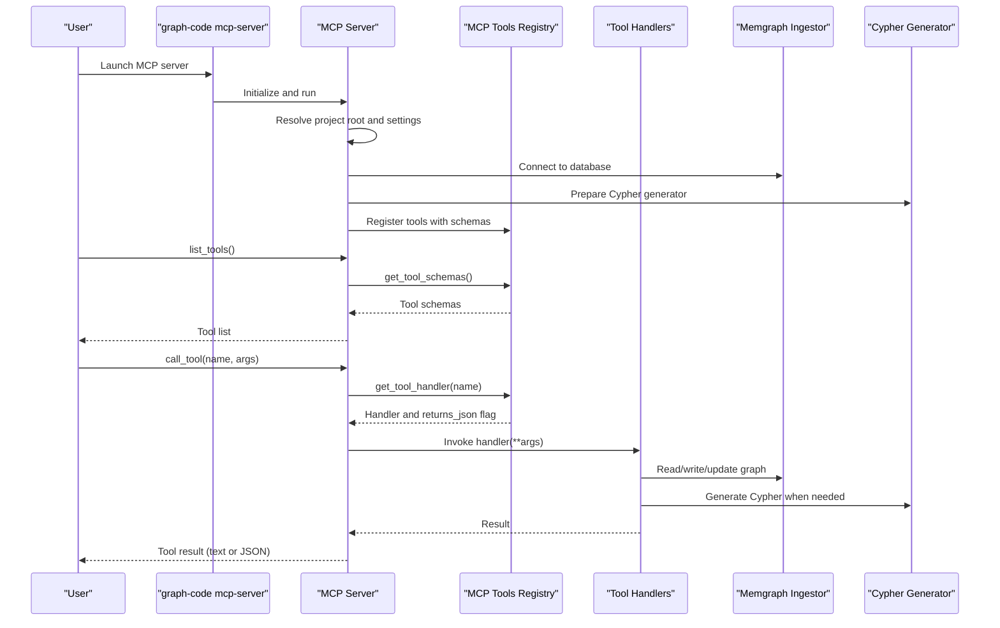
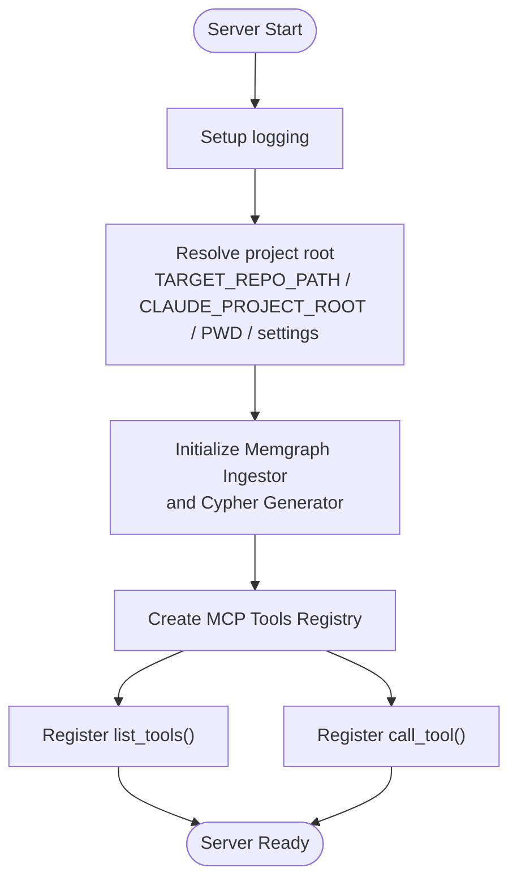
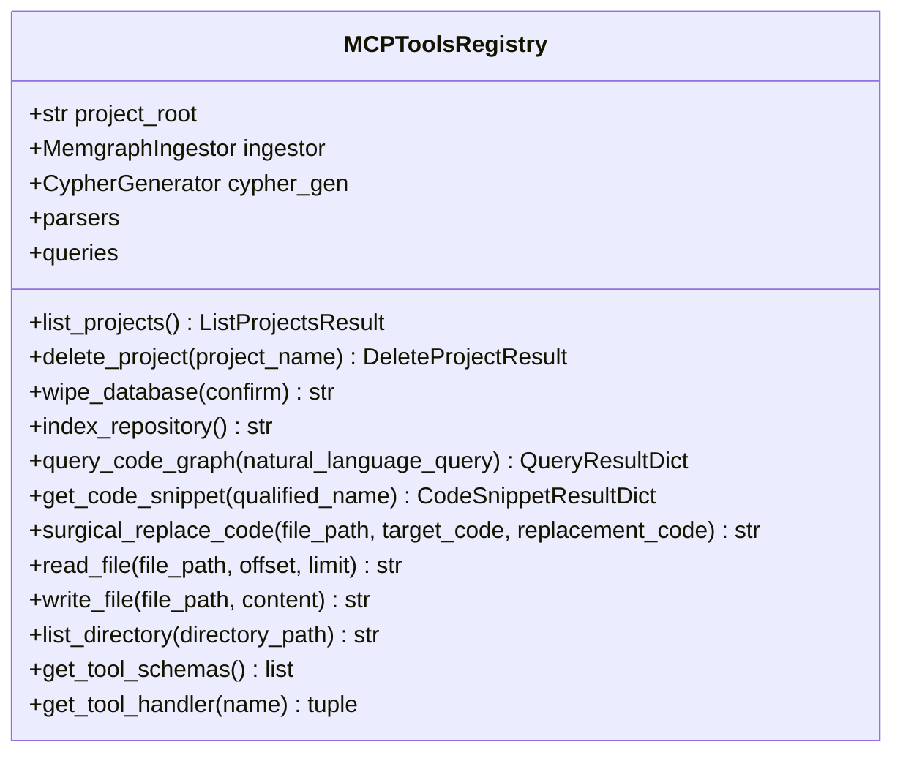
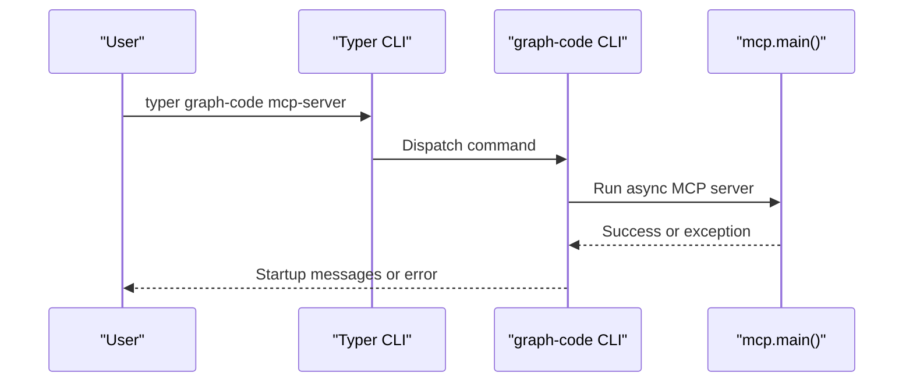
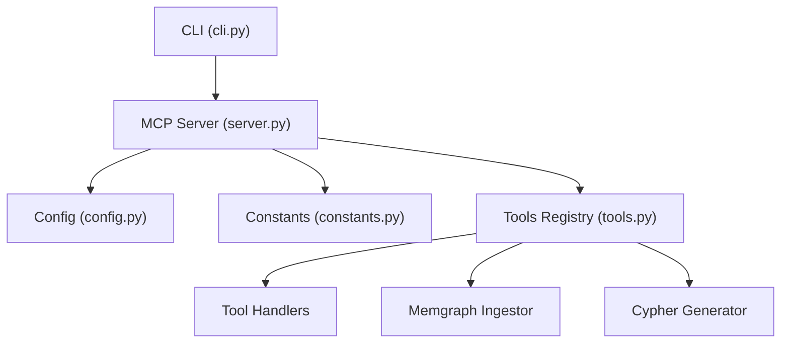

# Claude Code Integration

<cite>
**Referenced Files in This Document**
- [docs/claude-code-setup.md](file://docs/claude-code-setup.md)
- [codebase_rag/mcp/server.py](file://codebase_rag/mcp/server.py)
- [codebase_rag/mcp/tools.py](file://codebase_rag/mcp/tools.py)
- [codebase_rag/cli.py](file://codebase_rag/cli.py)
- [codebase_rag/main.py](file://codebase_rag/main.py)
- [codebase_rag/config.py](file://codebase_rag/config.py)
- [codebase_rag/constants.py](file://codebase_rag/constants.py)
- [codebase_rag/types_defs.py](file://codebase_rag/types_defs.py)
</cite>

## Table of Contents
1. [Introduction](#introduction)
2. [Project Structure](#project-structure)
3. [Core Components](#core-components)
4. [Architecture Overview](#architecture-overview)
5. [Detailed Component Analysis](#detailed-component-analysis)
6. [Dependency Analysis](#dependency-analysis)
7. [Performance Considerations](#performance-considerations)
8. [Troubleshooting Guide](#troubleshooting-guide)
9. [Security Considerations](#security-considerations)
10. [Best Practices](#best-practices)
11. [Conclusion](#conclusion)

## Introduction
This document explains how to integrate Claude Code with the Graph-Code MCP server to enable powerful codebase analysis and editing capabilities. It covers setup procedures, configuration, environment variables, workspace and project configuration, authentication, available tools and commands, practical usage scenarios, troubleshooting, performance, security, and best practices.

## Project Structure
The integration centers around the MCP server implementation and the CLI entry point that launches the server. The MCP server exposes a registry of tools for Claude Code to discover and invoke. Configuration and environment variables are loaded via a settings class, and constants define tool names, environment variables, and schemas.

**Diagram sources**
- [codebase_rag/cli.py](file://codebase_rag/cli.py#L332-L350)
- [codebase_rag/mcp/server.py](file://codebase_rag/mcp/server.py#L58-L135)
- [codebase_rag/mcp/tools.py](file://codebase_rag/mcp/tools.py#L40-L249)

**Section sources**
- [codebase_rag/cli.py](file://codebase_rag/cli.py#L332-L350)
- [codebase_rag/mcp/server.py](file://codebase_rag/mcp/server.py#L58-L135)
- [codebase_rag/mcp/tools.py](file://codebase_rag/mcp/tools.py#L40-L249)

## Core Components
- CLI entrypoint for launching the MCP server
- MCP server that initializes logging, resolves project root, creates services, and registers tools
- MCP tools registry that defines tool schemas, handlers, and input validation
- Configuration and environment variables for Memgraph connectivity, LLM providers, and shell safety
- Constants that enumerate MCP tool names, environment variables, and schemas

Key responsibilities:
- CLI: wires the MCP server command and handles startup errors
- MCP Server: sets up logging, infers project root, initializes Memgraph and LLM services, and exposes tool discovery and execution
- Tools Registry: defines tool metadata, schemas, and handlers for each MCP tool
- Config: loads environment variables and provides defaults for providers and endpoints
- Constants: standardizes tool names, environment variables, and schema types

**Section sources**
- [codebase_rag/cli.py](file://codebase_rag/cli.py#L332-L350)
- [codebase_rag/mcp/server.py](file://codebase_rag/mcp/server.py#L21-L135)
- [codebase_rag/mcp/tools.py](file://codebase_rag/mcp/tools.py#L40-L458)
- [codebase_rag/config.py](file://codebase_rag/config.py#L39-L234)
- [codebase_rag/constants.py](file://codebase_rag/constants.py#L2347-L2430)

## Architecture Overview
The MCP server runs as a long-lived process that Claude Code communicates with over stdio. The server:
- Resolves the target repository path from environment variables or settings
- Initializes Memgraph and Cypher generation services
- Registers a set of tools with input schemas
- Exposes list_tools and call_tool endpoints for Claude Code to discover and execute tools

**Diagram sources**
- [codebase_rag/cli.py](file://codebase_rag/cli.py#L332-L350)
- [codebase_rag/mcp/server.py](file://codebase_rag/mcp/server.py#L58-L135)
- [codebase_rag/mcp/tools.py](file://codebase_rag/mcp/tools.py#L433-L446)

**Section sources**
- [codebase_rag/cli.py](file://codebase_rag/cli.py#L332-L350)
- [codebase_rag/mcp/server.py](file://codebase_rag/mcp/server.py#L58-L135)
- [codebase_rag/mcp/tools.py](file://codebase_rag/mcp/tools.py#L433-L446)

## Detailed Component Analysis

### MCP Server Initialization and Tool Registration
The MCP server performs:
- Logging setup with configurable level and format
- Project root resolution using environment variables or settings
- Memgraph ingestion and Cypher generation service initialization
- Tool registry creation and tool discovery endpoint registration
- Tool execution endpoint with error handling and JSON/text responses

**Diagram sources**
- [codebase_rag/mcp/server.py](file://codebase_rag/mcp/server.py#L21-L86)

**Section sources**
- [codebase_rag/mcp/server.py](file://codebase_rag/mcp/server.py#L21-L135)

### MCP Tools Registry and Tool Schemas
The registry defines:
- Tool metadata: name, description, input schema, handler, and whether to return JSON
- Tool handlers: list_projects, delete_project, wipe_database, index_repository, query_code_graph, get_code_snippet, surgical_replace_code, read_file, write_file, list_directory
- Input schemas: typed properties and required fields for each tool
- Handler invocation: returns JSON for structured results, otherwise string text

**Diagram sources**
- [codebase_rag/mcp/tools.py](file://codebase_rag/mcp/tools.py#L40-L446)

**Section sources**
- [codebase_rag/mcp/tools.py](file://codebase_rag/mcp/tools.py#L40-L458)
- [codebase_rag/constants.py](file://codebase_rag/constants.py#L2347-L2430)
- [codebase_rag/types_defs.py](file://codebase_rag/types_defs.py#L343-L421)

### CLI Command for MCP Server
The CLI provides a dedicated command to start the MCP server, handling startup errors and user hints for configuration.

**Diagram sources**
- [codebase_rag/cli.py](file://codebase_rag/cli.py#L332-L350)

**Section sources**
- [codebase_rag/cli.py](file://codebase_rag/cli.py#L332-L350)

## Dependency Analysis
The MCP server depends on:
- Configuration settings for Memgraph host/port, batch size, and LLM provider/model
- Constants for MCP tool names, environment variables, and schema types
- Services for graph ingestion and Cypher generation
- Tools registry for tool schemas and handlers

**Diagram sources**
- [codebase_rag/cli.py](file://codebase_rag/cli.py#L332-L350)
- [codebase_rag/mcp/server.py](file://codebase_rag/mcp/server.py#L58-L86)
- [codebase_rag/config.py](file://codebase_rag/config.py#L39-L234)
- [codebase_rag/constants.py](file://codebase_rag/constants.py#L2347-L2430)
- [codebase_rag/mcp/tools.py](file://codebase_rag/mcp/tools.py#L40-L69)

**Section sources**
- [codebase_rag/cli.py](file://codebase_rag/cli.py#L332-L350)
- [codebase_rag/mcp/server.py](file://codebase_rag/mcp/server.py#L58-L86)
- [codebase_rag/config.py](file://codebase_rag/config.py#L39-L234)
- [codebase_rag/constants.py](file://codebase_rag/constants.py#L2347-L2430)
- [codebase_rag/mcp/tools.py](file://codebase_rag/mcp/tools.py#L40-L69)

## Performance Considerations
- Batch size: Configure Memgraph batch size for efficient ingestion and export operations
- LLM provider selection: Choose appropriate provider and model for Cypher generation to balance cost and quality
- Pagination for file reads: The read_file tool supports offset and limit to avoid loading entire files
- Indexing scope: Only one repository can be indexed at a time; re-index when switching projects

[No sources needed since this section provides general guidance]

## Troubleshooting Guide
Common issues and resolutions:
- MCP server startup errors: Ensure TARGET_REPO_PATH is set or inferred correctly; verify environment variables and project path validity
- Memgraph connection failures: Confirm Memgraph is running and ports are exposed
- Tools not appearing: Use the MCP list command to verify installation and tool discovery
- Wrong repository analyzed: TARGET_REPO_PATH overrides inference; ensure absolute paths when needed
- Tool execution errors: Check tool-specific logs and error messages returned by the server

**Section sources**
- [docs/claude-code-setup.md](file://docs/claude-code-setup.md#L120-L136)
- [codebase_rag/mcp/server.py](file://codebase_rag/mcp/server.py#L30-L55)
- [codebase_rag/cli.py](file://codebase_rag/cli.py#L340-L350)

## Security Considerations
- Shell command safety: The configuration includes allowlists and dangerous command patterns to prevent unsafe operations
- Environment variables: Provider credentials and endpoints are configured via environment variables; avoid committing secrets
- File operations: write_file and surgical_replace_code modify files; ensure proper permissions and backups
- Access permissions: Limit MCP server exposure to trusted environments; use secure transport and authentication as needed

**Section sources**
- [codebase_rag/config.py](file://codebase_rag/config.py#L82-L142)
- [codebase_rag/constants.py](file://codebase_rag/constants.py#L980-L1098)

## Best Practices
- Workspace organization: Keep one primary repository indexed at a time; re-index when switching projects
- Tool usage patterns: Use query_code_graph for natural language queries; use get_code_snippet for precise code retrieval; use surgical_replace_code for targeted edits
- Performance optimization: Adjust batch size and provider/model settings based on workload
- Authentication: Store provider credentials securely via environment variables or secret managers
- Safety: Review changes before applying edits; use confirmations and backups

**Section sources**
- [docs/claude-code-setup.md](file://docs/claude-code-setup.md#L67-L77)
- [codebase_rag/config.py](file://codebase_rag/config.py#L50-L81)

## Conclusion
Claude Code integrates seamlessly with the Graph-Code MCP server to provide a robust platform for codebase analysis and editing. By configuring environment variables, setting up the MCP server, and leveraging the available tools, developers can efficiently explore, query, and modify codebases with confidence and safety.